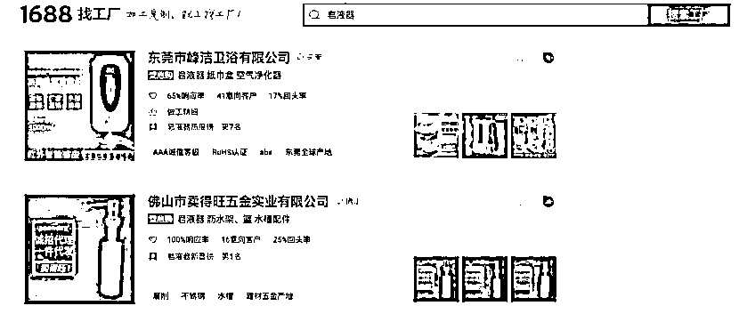
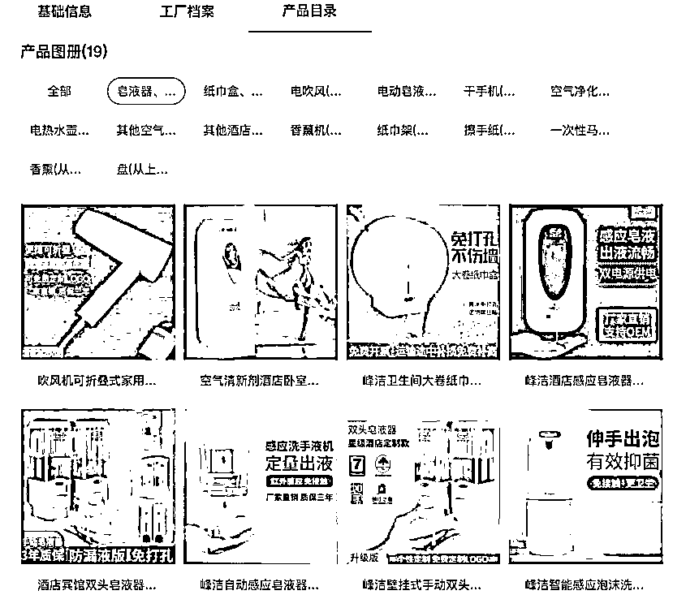

# (精华帖)(112赞)以亚马逊电商为例，聊聊从公模到私模的整个过程

作者：  鱼丸|亦仁助理

日期：2021-08-16

很多卖家做亚马逊的时候，为了做差异化的产品，会一开始就做私模，这就会面临一系列问题，比如成本高、生产周期长等等。

 

 

但对于一个有足够纵深的产品类目来说，如果你没有供应链，可以先做公模，再做私模。

今天轻享嘉宾@Bryce 老师就以亚马逊平台为例，分享了他是怎么从公模转向私模的，这个思路不仅仅是做亚马逊，做其他电商平台也可以参考。

他有四年的跨境电商从业经验，曾是跨境电商公司有棵树的主管，过手的大小平台超过十个，对平台的发展阶段和与之匹配的运营模式有了一定的理解。之后，他入职远古科技，负责新平台部门团队搭建与项目策划，实现 19 年国内蓝牙耳机出口量第一的目标。不仅如此，在开发的平台法国fnac也实现了月销售突破 100 万人民币的业绩。现在，他已经自己出来创业，曾在一个类目中获得超过 180W 利润和大量的现金流。

来，花5分钟，快速看看 Bryce 老师的思路分享。

目录

一、如何选品

二、如何筛选工厂

三、聊聊公模产品的优势及需要注意的事项

四、聊聊限定私模的条件、优势及局限

五、包销私模的模式是怎样的

六、合作开模的模式是怎样的

七、我的案例复盘

 

 

八、总结

---正文---

大家好，我是 Bryce ，目前亚马逊创业两年，很荣幸可以和大家分享我的一些亚马逊从业思路。

虽然创业的平台选择了亚马逊，但在此之前我从未实操亚马逊的经验。相较于其他平台，亚马逊是门槛最高的平台之一。就目前主流的亚马逊玩法来说，首先需要备货到海外亚马逊仓库，其次对销售策略和平台规则的掌握上，亚马逊对卖家的要求也更高。

但是亚马逊在站内流量、类目纵深、仓储物流等方面有着巨大的优势，对有一定行业经验和启动资金的卖家来说，是更好发展自有品牌的一个平台。

一、如何选品

**1. **蓝海选品****

首推 Seven 老师的系列文章：

-https://wx.zsxq.com/dweb2/index/topic_detail/241155558258851-https://wx.zsxq.com/dweb2/index/topic_detail/421144845824518 

 

这两篇文章详细讲述了如何在细分领域中从零到一打造属于自己的独一无二产品，对于有一定运营经验的卖家来说，是建立属于自己团队的产品壁垒的最初也是最关键的一步。

而对于大部分新入行的卖家来说，一方面由于运营经验不足与产品挖掘能力匮乏，很难从亚马逊繁复的品类中挑选出有价值的产品，另一方面蓝海选品完整的一套流程跑下来，通常需要三到六个月的时间，加上物流和销售的时间，收回成本的时间大大超过新手的预期。

**2. **红海选品****

个人推荐小马丁的选品思路一文

-https://articles.zsxq.com/id_mrzguwk55xw1.html

无论我们是从过往运营经历出发，还是捕捉近期的行业热点接触到了意向产品，红海选品一定意味着这个类目有了一定程度的挖掘，但是是我们仍觉得有利可图的产品。

讲完选品，接着来讲讲如何筛选工厂。

二、如何筛选工厂

下面以大家最为常用的 1688 网站对去年日本站热卖的皂液器进行举例。

** **

**1. **拿货渠道

 

 

代理商：

没有自有工厂，店铺产品通常横跨十数个小类，价格参差不齐。

组装工厂：

主要负责整体的产品结构设计，但是芯片方案和外观模具通常是采购其他厂商的，和代工厂的定义类似。

产研一体的工厂：

即 ODM ，有部分或全部的方案专利，在技术层面相较与其他工厂有一定自主研发的优势。

**2. **关键词****

很多时候我们在平台获知的产品名称是直译过来的，与工厂对产品标定的关键词可能会有出入，因此用已有的关键词搜索，找到其他常用品名，能让我们避免漏掉其他关键产品。

以皂液器搜索为例，结果中「皂液器」和「洗手机」被搜索系统判定为等价词汇并标红，因此我们也应该尝试洗手机的搜索，来扩大产品的搜索面。

 

 

**1**）以品定厂****

在首页上直接搜索，我们进入的是货源模式，即看到全是产品，我们根据需求，细化搜索条件，来挑选产品并下单。

选定「泡沫洗手机」为关键词。

-在深度认证一栏选择深度验厂，选择合并供应商（过滤大部分小代理商）。

-还可以按需筛选价格区间和所在地区。

 

 

**2**）定厂找品****

在首页上我们选择找工厂，输入关键词，此时我们进入工厂模式。

-点击品类的排行榜可查看热门工厂（注意有充钱刷榜的工厂）。

-点击厂名进入详情页，可查看工厂档案与产品目录。

 

 

**3**）样品采购

比对产品，选择符合要求的 3-5 款产品。之后选择下单（通常必选 2 个），用阿里旺旺联系卖家拿样改价。

**4**）工厂造访

有了样品的比对之后，我们可以有针对性的选择厂家进行造访了解。

-产品的工期、质检规格、海外认证与专利。

-了解大货起订量与首批价格。

-返单之后的降价区间与账期的可行方案。

 

 

三、聊聊公模产品的优势及需要注意的事项

选品选厂后，我们就会开始接触到我们最熟悉的公模产品，接下来我将讲述公模到私模的转换思路。

**1. **公模产品的优势

公模就是公有的，即厂商开好模后（当然这模具属于开模厂商），任何人都可以买这套模具生产的产品。

采购并销售公模的这种销售方式，我们通常称为现货模式。

现货模式有着显而易见的缺点，产品周期短，跟买多，竞争大。

但是对于初入行的卖家朋友来说，我觉得仍然不失为一个好的入局亚马逊的方式。

主因有四：

**1**）起订量低** **新手入局

公模产品往往承担着试水的作用，我们可以在代理商或者工厂购买很少的量来进行测款，通常两百到三百都是允许的。

**2**）价格透明****

 

 

在不清楚该类产品具体的行情下，公模价格非常具有指导意义。因为通常公模会拥有大量的代理商，比较火爆的模具，可能同时有几家组装工厂进行生产。我们在择优的同时，也可以对各家的价格进行比对。

**3**）现货供应****

相对与工期动辄一个月起步的私模产品，公模产品由于有多方卖家参与，出货量大，供应商一般会有 2-3K 的现货预备，即使没有现货，公模产品排期更多，多为 5-10 天即可交货。

**4**）产品周期短****

链接存在的时间短，是一把双刃剑。对于老卖家而言，产品获利的时间较为短暂，长期收益看低。但对于新卖家而言，类目里整体产品的寿命短，意味着评论积累较少，打新速度更快，使得资金能够更快运转起来。

**2. **公模产品需要注意什么

**1**）代理商的优势：（诚然代理商在很多量小的产品中没有任何优势）

在市场热门的产品中，对于想要测款或者达不到工厂起订量的朋友来说，代理商能够汇聚小批量订单，在工厂方面拿到优势价格。

通常热门产品，代理商因为下单量足够多，会预留一部分的现货供给市场，能大大缩短我们下单和返单所需时间。

代理商不从事生产工作，对于小批量订单也能配合我们贴标打单发货。

**2**）产品成本的把控：

 

 

如果我们前期使用代理商供货，那么在产品稳定返单之后，我们可以直接咨询工厂进行拿货。

**3**）备用链接的建设：

在市场出现大量同款产品的时候，坑位靠前的产品，自然容易受到其他卖家的攻击，这也是产品周期短暂的重要原因之一。

我们可以通过卖家精灵等工具，观察同类产品的生命周期，通常在**6-12**个月不等，一般在产品的生命中期即可开始准备备用链接的搭建。

**3. **如何利用好公模产品的优势

**1**）定制**LOGO**

对于绝大部分的厂家来说，500 的起订量就可以支持印制 LOGO ，这在一定程度上能够防止白牌卖家间的跟买行为。

**2**）定制包装说明书

包装的定制一般需要 2K 起步，说明书最好 1K 起订，在产品稳定返单之后，将定制的包装图片搬上主图，能够有效杜绝跟买行为。

**3**）配色的升级

如果你的起订量能达到 2K ，就可以和工厂协商更改外观的配色，一般更改产品 A 面的配色，就能很大程度上与其他竞争对手的产品区别开来。

 

 

四、聊聊限定私模的条件、优势及局限

限定私模，通常由较为有实力的组装工厂或者产研一体的工厂发起（我们在筛选工厂的时候应该注意这一点），一般选择 2-5 个卖家去共同营销一款产品。

无论你是创业初期就携带着不菲的本金，还是依托公模市场的红海搏杀积累了一定的资金，小范围的私模绝对是你不容错过的一种合作模式。

**1. **限定私模的条件

**1**）历史销售

很大一部分工厂在筛选限定私模卖家的时候，会参考你以往在他那里的采购情况或店铺其他产品的历史销量，以判定卖家是否具备一定的销售能力。

**2**）销量****

通常根据产品的不同，起订量一般在 1-2K 区间，相较与泛滥的公模产品，因为限定了卖家数量，所以会有相应的退出机制，如果后续返单达不到工厂要求肯定会被取消售卖权利。

**3**）限价****

由于卖家数量有限，工厂为了控制利润，会标定每个站点底线售价，以及活动的最低折扣比例，如果卖家违反限价规则，会根据所签销售合同进行处罚或取消售卖资格。

**2. **限定私模的优势

 

 

**1**）更好的产品

一般推出的限定私模，至少具备外观优势，自研工厂的产品往往还具有一定的技术优势，在与同类产品竞争时，与公模产品比较更容易取得销量。其次，在限定卖家数量的情况下，往往能出现产品配色独占的情况。

**2**）更稳定的利润

限价的存在避免了同款产品竞争时，大家打价格战的做法，保证了参与限定私模卖家的利润下限。

**3**）更长的生命周期

卖家数量的限定和销售协议的存在，一定程度上能够遏制卖家间的恶性竞争，提供了一个比公模产品更为公平的竞争环境。另一方面，由于限定私模的产品优势，在一定时间范围内它能够存活更长的时间。

**3. **限定私模的局限

**1**）利润透明化

恰恰也是因为限价的存在，大家在出厂价格趋于一致的情况下，除了占据最高排名的卖家能够稍微拉升自己售价外，其余卖家大多数时候只能将售价维持在统一的较低水准，因此产生的利润几乎是可预见的。

**2**）实力卖家的降维打击

虽然大家售卖同一款私模产品，但卖家的实力却不太一致，如果出现实力异常强劲的卖家或是工厂亲自下场，大家前期推广节奏的差距会很大，导致尾部卖家难以赶上，最终排名和销量会异常惨淡。

 

 

**3**）工厂的资源倾斜

在原材料不充足或工期较紧的情况下，头部卖家备货需求会优先满足，尾部卖家工期往往被拉长甚至无法供给产品，致使强者愈强。

五、包销私模的模式是怎样的

包销私模，顾名思义是工厂将一种产品打包给一个卖家，在限定的渠道和限定区域销售的一种合作模式。

**1. **包销协议

**1**）渠道和范围****

渠道主要是线上和线下的区别，作为亚马逊卖家的我们一般只会拿到线上渠道或者单一亚马逊平台的包销资格，工厂通常会保留线下渠道的权利以便直接出口。

范围的议定主要是根据卖家主营的销售区域决定，你可以单独拿到欧美日任意站点的包销权利，也可以拿到全站点的包销权利。

**2**）人选与销量

工厂每年新模具数量是一定的，在决定包销的模具开发过程中，为了保证该款产品的预期利润，就会物色实力卖家。

一般是有一定合作基础且过往销量有所保证的合作伙伴，但是如果新卖家有同类产品的运营经验且愿意支付一定的模具费用，也可以成为包销的对象。

 

 

销量的议定是必不可少的，一般以年度为单位，根据产品的特性确定产品的最低年销量，并议定相应的退出或补偿机制

**2. **包销的注意事项

**1**）包销产品的风险

产品升级风险：

包销模具的产品，在卖家相应的市场上一定独一无二，人无我有的产品是优势也伴随着相应的风险。

不是每一款模具都能被市场接受和认可，就像我们推的产品不是每一款都能成功。一旦我们订购了库存，由于包销协议的存在，产品发生滞销时，厂家不能将产品转销给其他客户，我们的损失会比其他时候更大。

市场区域风险：

很多产品的开发具有区域针对性，适合欧美国家的产品不一定适合日本，反之亦然，因此我们一定要明确产品在目标区域的可售性。

**2**）工期延长

对于厂家而言，不同模具的产品，从壳料到部分原材料的采购都会有所不同。备料只能根据你的销售计划来确定，如果没有明确的备货计划，特定原材料配备时间会因临时采购而拉长。其次，没有足够体量的情况下，工厂排期也没有优势。

**3**）认证与专利

 

 

我们千辛万苦来到了包销的这一步，基本摆脱了跟买和同款产品恶性竞争的烦恼。

但是值得我们注意的是，包销产品，很多厂家不愿意为我们准备相应国家的相关认证和专利，取得认证能够保证我们在平台正常销售，而取得专利能够确保产品在推广成功之后，其他厂家不会生产类似或倒模的产品或者被别有用心的卖家抢注专利落入被动。

六、合作开模的模式是怎样的

当我们在一个产品领域积累了足够多的经验，我们就可以向工厂提出自己的模具开发需求，和工厂合作开发模具。

**1. **合作模块

**1**）外观设计****

参与模具的外观设计是最常见也是最基础的合作内容，根据自身在以往同类产品获得的市场反馈或者市场的流行趋势，我们可以向工厂提出模具外观设计的方向或直接提供相应的外观设计图稿。

**2**）功能设计****

根据自身销售经验所获取的消费者痛点，对工厂提出相应的功能升级或者功能增加的需求或直接提供相应的相应的结构设计方案。

**3**）方案设计****

 

 

如果需要自行改进电子产品的 PCB 方案、整机方案等，需要自身具备一定的方案设计研发能力。

**2. **合作开模的意义

**1**）把握产品的升级方向

相比于厂家，卖家与消费者之间的联系更为紧密，对于产品的痛点和消费者的需求把握更为精确，卖家参与开模之后，能设计出更为贴合市场的产品。

**2**）领域细分与品牌调性确立

领域细分：

不同的需求痛点有时候不能在同一个产品同时解决，产品到再细分的时候，会在功能上进行取舍。以TWS耳机举例，便携型与长续航型，在设计上存在一定冲突，所以我们根据不同卖家需求，开发出了不同类型的产品。

品牌调性：

确立  一个品牌的树立通常会确立它的品牌风格，或是偏商务风的，产品素雅，曲线干练，或是主打运动型，配色鲜明，造型前卫。这种风格就对应这品牌的调性，也是品牌具有的文化基底，需要我们与厂家深入沟通开发意向才能有所成果。

**3**）为企业升级做好准备

到了这一步，我们会逐渐吸纳产品研发人员，加大对产品研发以及品牌建设的投入。开始发生从传统的贸易公司到科技驱动型公司的转变，逐渐提高自己的技术竞争力和品牌附加值。

 

 

七、我的案例复盘

方法和经验在前面已经说了很多了，最后我想和大家回顾一下我自己创业过程中最重要的一条产品线。

**1. **出师未捷的第一条链接

我们大概是 19 年 9 月初的时候在日本站上架了第一条 listing 。8 月份的时候我们对了  5 款市面上比较热销的产品，并最终选择了一款价格中等偏上的——为了避开卖家数量最多的低价款。

同时为了一开始进行差异化处理，我们在首批订单出货之前就自己设计了包装盒和说明书，包装盒为了质感，加入了覆膜、凹凸等复杂工艺，成本达到了三块多，起订量是两千，说明书成本很低，有固定开机费 500 块左右，所以一千和两千本只有 100 块的差距，当时也定了两千。

首批产品 200 个上架之后，我们立即遭遇了该产品的最大竞争对手恶意评价并投诉质量问题，在开卖 10 天后，我们的产品就被下架了，后续申诉也是无果，至今仍然有 91 个库存处于不可售状态。

从这一经验出发，后续我们又进入了好几个不同类目，但我们一直保守着两条原则：

-不要选择价格区段过高，卖家数量更少的产品试水，因为自身目标更显眼，相对来说遇到的对手的手段也更强（属于别人的利润款）

-试水产品，不要一开始就定制，一旦失败，付出的成本太高。

 

 

**2. **靠该换节点获得的第一个**BS**

我们在 19 年 9 月底上架了第二条 listing ，因为前期联系的供应商比较多，所以我们在产品下架之后立即锁定了一款市面上销量最大的低价产品，同时也是该小类目的 BS 。

这次我们选择的是一个有自己组装工厂的代理商供货，他的优势在于产品选择多，能小批量供给大工厂的产品，配合度很高。

基于当时的测评环境，我们在度过 15 天新品推广期后，排名就来到了小类的前 30 名，为了避免第一次被人过早盯上的情况，我们果断选择更改节点去到一个流量相对较小的小类。时间来到 19 年 12 月底，我们顺利的拿到了第一个小类的 BS ，当月这个产品带给我们的利润在 8W 左右。

**3. **成为小类第一前做了哪些准备

我们在 19 年 12 月份的时候开始注册自己的品牌，欧洲站历时 10 个月下证，美国站在提交注册一周后，即可申请使用 TM 标进行品牌备案，日本站目前还在公示期。在第二条链接起量后，为了尽快实行品牌备案，减少跟买行为，我们在 20 年 1 月份正式购买了日本商标（当时均价在两万左右）。

在 20 年 3 月份，我们上线了第三条 listing ——颜色变体，红色变体最后大约占据市场份额的 10% （独占，但是不是主流偏好颜色）。

在经过 5 个月的市场观察，我们发现该类的产品由于使用频次很高，属于消耗型电子产品，一般销售三个月之后，差评开始爆发式增长，链接存活时间大多为 4-6 个月。因此我们在 3 月份同时上线了备用链接，并在 20 年 5 月成功取代第二条 listing 。

 

 

在 20 年 5 月，我们最大的竞争对手，占领这个产品的市场份额约为 40% ，我们的市场份额约为 30% ，此时每月的利润为 12W 左右。

**4. **拿到真正的**BS**

同样是在 5 月底，小类里面出现了一个 FBM 的卖家恶意跟买。许多卖家同时收到了勒索信件，卖家之间迅速组成了结盟，但我的竞争对手选择每月缴纳保护费用维持销量，而我们选择拒绝，并采用多种办法投诉跟买者的数个店铺。历时一个月，我们关停了跟买者的两个店铺，销量终于开始回升。

而我的竞争对手在此之后，数次被跟买，导致链接权重慢慢下降，最终在 9 月份彻底销声匿迹。我们在 8、9 月份靠着积累的评价转战原本的小类，一直维持在 BS 水平。

在积累了不少类目经验与销量之后，我们终于作为首批卖家于 20 年 8 月上线了第四条  listing ——当年新品。

这家工厂在武汉，主要走大批量的外贸订单和分发代理商，即使无法控制卖家数量，但由于有先发资格，我们的新产品仍然从 20 年 10 月份到 21 年 2 月份牢牢占据着 BS 。

此时，我们在该小类的利润，大约是在每月 20W 左右。

**5. **产品的没落与更迭

今年春节的时候，合并国际评论之风席卷各大类目。另一个强劲的竞争对手出现了，他从产品抄到文案，链接风格保持和我们的高度一致。然后花重金在三条链接上合并了超过五万条评论，我们从每天 200 单一路下滑至 50 单只用了不到两个月的时间。

 

 

最终，我们在慢慢清理完库存之后，于 21 年 5 月份正式退出了这个类目。这个类目在创业创期给我们贡献了超过 180W 利润和大量的现金流，再做新的产品我们仍然有机会能赚钱。但是由于类目的特殊性，线下的巨量订单，使得行业内几乎不存在私模，导致卖家之间厮杀严重。

经过了近两年的洗礼，我们不再需要一个无法深耕的类目去带动现金流了。在此之后，我们将所有资金投入到限定私模以及可以包销的产线上去，并在今年上半年，对另一条经营了一年的成熟品线和厂家合作开发了两套模具。

八、总结

对于一个有足够纵深的产品类目来说，没有供应链的新手卖家基本会循序渐进走完从公模到私模的这个过程。

而一些特殊的产品，比如手工艺品，家具类或是服饰类它们会或多或少会缺失其中的某些环节。但我们要看到这个流程的本质在于，选择了红海的同款产品之后，如何一步步实现自己产品的差异化。

最后在我们积累了足够的供应商资源和运营经验之后，和工厂的合作模式只是一个灵活运用的手段。我们用公模测款，用私模来降低开模成本与试错风险，用提升的运营和研发能力去开模，去提升利润和产品附加值。

以上就是我从业跨境电商四年来，对于如何选择工厂以及后续产品如何升级的一些经验与思路。

 

 

创业以来，一路磕磕绊绊，自己的产品也终于来到了合作开模的阶段，虽然还停留在给工厂提供最基础的外观设计理念和功能升级方向上（笑）。后续开模意义算是我在前公司的心得体会。

这是我在生财的第一篇分享，感谢 Lissa 的介绍让我加入这个有趣的大家庭，最后欢迎大家批评指正，也想和各位圈友们一起沟通成长。

By the way，最近的亚马逊真是不太平，希望大家柳暗花明，诸事顺意。

P.S. 如果你也想在生财有术专栏分享你的经验和认知，请点击链接

http://form.shengcaiyoushu.com/f/HA1G1g  填写表单，我们会陆续邀请有赚钱相关经验和案例的嘉宾做分享。如已填写表单请忽略。

评论区：

鱼丸|亦仁助理 : 感谢  老师的分享，大家如果有什么问题。可以在评论区留言~ 草木青 : 先赞再看，惯例

Bryce : 大家好，我是这次的分享人Bryce,有什么问题，我都可以和大家一起探讨[呲牙] Lissa Tam : 优秀优秀！

轩辕 | 专注视频号 : 给Bryce老师点赞

大头 : 优秀  优秀  我要是能早看到，可以省半年的时间。

张大大 : 优秀优秀

丁邱洁律师团队 : 来云上夜话呗，这周末［跨境电商］专场，来分享吧！

 

 

成果：在不到一年时间赚到 100w，团队从一个人走到现在 8 个人，日利润最高达到 2w。

心得：选择和运气很重要，聚焦更加重要，聚焦成一道闪电。

心得：圈子决定一切，你的能力和认知由你所在的圈子决定，成长路上，愿意

引你入门的人很重要。
