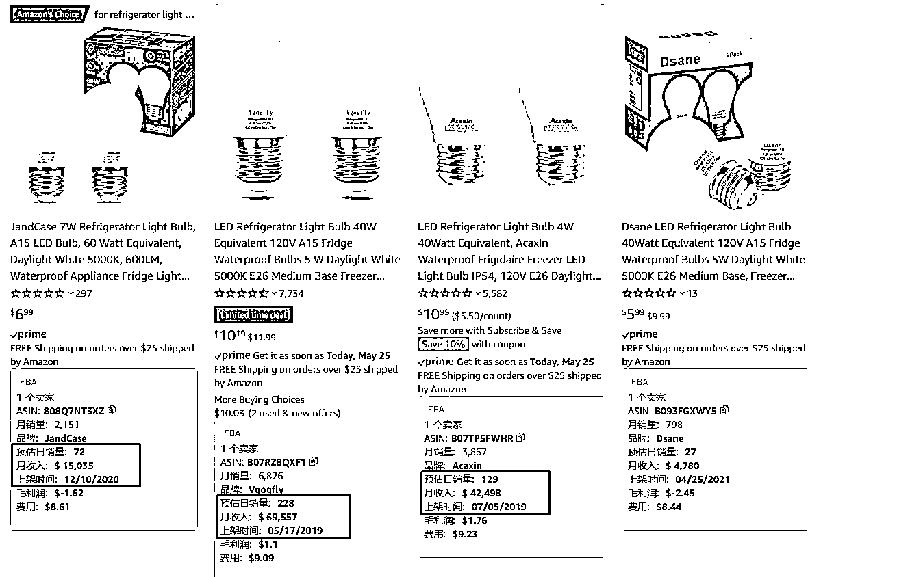
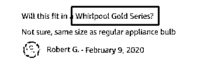

# (精华帖)(81赞)亚马逊蓝海之极致细分，根据用户分层找到极致细分

作者： Edwin

日期：2021-05-25

产品**--**流量**--**转化

挖掘需求--验证需求--做价值超越--满足需求+错开竞争--完成转化--建立壁垒--形成闭环如果我前面写的文章你有看过的话，你应该会知道我做亚马逊蓝海的核心思维就是根据不同的对象或场景，进行客户分层，在细分领域里面，把产品包装成客户需求匹配度最高的产品，并打磨到在细分领域里面拥有绝对的竞争力，做到价值超越。

以下内容是第一篇文章《**Edwin | **亚马逊蓝海错位竞争玩法》的延伸，如果你之前还没有看过的话，我建议可以先花点时间先看看：

https://articles.zsxq.com/id_a6l7aasqvmbh.html由于之前用来举例子的案例，可能讲得还不够细致，所以有部分人看过后反馈说对他们来说的确有新的启发，但是还会有很多地方无法理解，所以这篇文章，我希望在第一篇文章的基础上进行延伸，把一些内容再写的更加细致一点，让更多行业经验不太丰富的小白看完也能理解并可以直接用来实践，能赚到钱。

希望通过文字，我们会有更好的交流。

Go...

 

 

产品极致细分

下面给出一些实际的案例：

PS：只提供案例，具体的产品需要自己再去深入调研，我希望大家掌握这套方法的底层逻辑，学会举一反三。

假如你是一名卖LED灯泡的卖家，你售卖的灯泡型号是E26，你们售卖的这个型号的LED灯泡功能非常强大，可以满足客户在不同场景下都可通用的，比如说适用于客厅，卧室，厨房，走廊，庭院，车库，冰箱。

很多人常规的产品打造思路就是觉得这个产品真厉害啊，可以适用这么多场景，卖点肯定要把所有适用场景全部罗列出来，肯定大卖。其实也并不是说这样的思维完全不对，只是说这种常规打法更适合资金玩家，有一定资金的，并且资源很充足的，他们也能推广起来卖得很好，但是利润确不会特别高。

我的做法就是把每一个场景细分（客厅，卧室，厨房，走廊，庭院，车库，冰箱），进行客户分层运营，同样这款LED灯泡产品，我会把每一个场景对应的功能产品都做成一个链接，把这个产品包装成适用于这个场景下相比竞品而言最专业的的专属产品，其实对于卖家而言，库存都是同一个库存产品，只是你需要告诉客户，我售卖的是对应场景需求下的专属产品，这样就会有产品溢价空间，因为你相比同类竞品而言，你是需求匹配度最高的产品，并且你再把之前收集到的客户需求痛点融入到里面，进行价值超越，肯定就会在这个细分场景领域有绝对的竞争力，去获取更多的市场份额。

比如我可以同样把同一个LED灯泡包装成：客厅专用LED灯泡，卧室专用LED灯泡，厨房专用LED灯泡，走廊专用LED灯泡，庭院专用LED灯泡，车库专用LED灯泡，冰箱专用LED灯泡。

 

 

以下拿《冰箱专用**LED**灯泡》这个来举个栗子：

【客户需求】：我的冰箱灯坏了，我想换一个适合我这个冰箱相同型号的LED灯泡，产品质量要高，不要经常坏，我的冰箱品牌是XXX，灯头插口型号是E26，买了要能安装且合适耐用才行。

【满足需求】：我们这款是LED灯泡是你这款冰箱专用LED灯泡，型号是E26，专用的，有防水功能，使用寿命长，专用型LED灯泡，适用于冰箱这种潮湿环境。

对于客户来说，他的冰箱灯坏了，其实他的需求已经很明确了，就是想要买一个质量高的冰箱灯替换，也不需要太多的其他功能，对他来说没用。如果他通过搜索展现了大量的产品，大部分都是万金油一般，什么场景适用，那么他如果看到我这个专属产品肯定会眼前一亮，因为这个就是满足他需求的产品，他只需要挑选应用在冰箱这个场景下最好的产品即可，恰好我的产品优势就体现出来了，我的是专用的冰箱灯这个场景下的产品，无论从图片，文案，视频，A+，评论等各方面，我的产品都是围绕冰箱这个场景来展开的，凸显卖点，所以我的产品在这个场景下就很容易做到价值超越了，相比竞品而言，我的产品优势就很大了，这样子就实现了错位竞争了。

不能把产品单独剥离开来，其实这是一个体系，先确定你的客户是哪些人群，适用于哪些场景，满足哪些需求，经过调研分析，然后再去打造产品，产品包装，说明书，图片，文案，视频，A+，评论，QA等等，都要围绕这个场景来进行包装，打造成一个专属的产品，服务于细分的人群，提升产品核心竞争力。

做推广的时候，就更加容易的，可以直接专门挑选适用于这个场景产品的长尾词就进行推广，可能一个长尾词的流量并不大，但是如果你挖掘了非常多的长尾词，每个流量你都做到头部的话，那加起来的流量也是非常大的，并且这种模式的好处是转化率真的非常高。

 

 

关键词：**refrigerator light bulb **（冰箱灯泡）

第三方插件调研关键词数据：（任何软件的数据仅供参考，要结合人为判断）

通过看月搜索量和月购买量，我们可以大概知道这款冰箱灯在亚马逊上大概的需求量是怎样的，通过商品数和搜索量的比值，我们就可以算出这款产品目前的竞争度大不大，另外还需要去查看这个产品相关关键词的广告数据等一些其他数据，结合成本就能大概估算出利润情况。

关键词亚马逊前台页面：https://www.amazon.com/s?k=refrigerator+light+bulb&ref=nb_sb_noss_2亚马逊前台搜refrigerator light bulb展示出的关键词自然排位前四个产品：

 

 

中间的两个卖家是在2019年中旬通过这种细分的思维切入市场的，通过2年左右的累计，也有了一些不错的评论基础，所以价格比较高一点，获取的订单量也大一点，然后左右两边的这两个新卖家分别是在2020年12月份和2021年4月份通过相对低价切入市场，也能获取一定的订单量。

我们可以清晰的看到前面已经有卖家用这种精细化产品细分的思维去做产品了，并且效果是非常好的，  首页的其中一个产品刚好是我认识的一个人操盘的，具体是哪个产品就不方便透露，大家也不要过深去挖掘，多把心思集中在学习底层逻辑和方法上。我们可以看到这款小小的的灯泡，一个月可以卖这么多，而且成本其实比我们想象中要低，大家有兴趣也可以去中山古镇那边灯具市场看看，各种灯具产品眼花缭乱。具体的利润其实大家可以自己去核算，看看如果这款产品是你的话，大概一个月可以赚多少钱，这个我就不细说了，都是比较基础的东西，我更想说一些操盘思路方面的内容。

 

 

点进去其中的一个产品链接，我们可以看到listing页面的文案和图片等等全部围绕着冰箱的这个场景来展开描述的，所以这个产品在那个时期竞争不大的时候能在细分领域里面做到拥有绝对核心的竞争力，所以能快速获取大量订单并且累计了很多不错的评论基础，这就是建立壁垒。

当然，现在我把这个案例搬出来，不是说让大家又继续按照之前一样的思维去做冰箱灯，因为这肯定是比较难的，除非你有供应链获取更低价格，或者有其他优势，否则对于小卖家来说，肯定是很困难的。

那么，是不是完全没有办法在**2021**年中旬这个时期切入这个市场呢？

答案是可以切入的，接下来就是我想要重点强调的亚马逊蓝海之极致细分的核心思维，如果你真的能够做到我以下所要求的一些东西的话，肯定还是有很多的机会切入进来的，并且也能活得不错。

 

 

OK，往下走：

我在几个卖得不错的冰箱灯泡的评论和QA里面，发现了一些有重要价值的信息，大家可以认真的看看下面的几个QA页面的截图：

    

 

 

我们是不是可以发现，很多买家会咨询更详细的内容，比如这个冰箱灯泡是否适用于自己的XXX冰箱，具体到一些冰箱的品牌和型号了，那么我们是否可以换位思考，站在客户的角度来思考。

用以下场景来举例：Edwin昨晚发现自己的西门子冰箱的灯泡坏了，想去亚马逊平台购买一个可更换的适用于西门子冰箱的灯泡，因为要在网上购买灯泡，如果到货后发现买的不对了，退货也麻烦。那我最好的情况是不是直接给我一个确定答复，你的产品是适用于我的西门子冰箱的，这样子购买就最贴切我需要的产品。所以当你把所有产品极致细分的时候，你的核心竞争力就出来了，就很容易做到价值超越了。

所以这就是我一直在说的，做产品的时候我们要先去调研客户的实际需求，客户的需求就是我上面的那个场景，至于亚马逊其实只是其中一个销售平台而已，我们做产品一定要归根于客户需求和产品本身，不要一直盯着某一个平台或者排行榜，永远躲在一个小角落思考问题。

那么既然知道了我们需要极致细分去做了，那如果操作呢，其实也很简单，就是把所有的冰箱品牌和型号都调研收集起来，做成一个表格统计好，然后再融合到

**listing**页面的文案，图片，**A+,QA**这些里面，让卖家点进你的**listing**页面后通过你收集到的数据，就能知道他自己家里的冰箱是否合适目前我们现在销售的冰箱灯，按照我之前的简单调研，其实大部分冰箱灯型号都是差不多的，只要接口那个螺纹孔对得上就合适，所以只是你把客户的需要再细分而已，产品还可以是同一个产品来的，不用担心会有很多个变体，最多就**2~4**个子变体。

那如何去收集这么多冰箱的品牌和型号呢，其实这个就会绊倒90%的人了，我说你可以去搜索  ，通过谷歌或者其他搜索引擎啊，或者直接点进亚马逊平台家电冰箱分类那个页面进行细致统计也行，但是肯定还是有很多人被一些小困难绊倒就会放弃的（比如还有人会问怎么科学上网之类的问题，问怎么我登录不了你说的那些网站等等），所以我想说真正能赚到钱的都是那些有耐心的，能做到极致的人，学会用搜索引擎代替你的大脑很重要。

 

 

其实你大概去谷歌搜一下，也能找到一些东西，只是需要花一些时间整理而已。

例如以下网站：https://www.ranker.com/list/refrigerator-brands/werner-brandes

我们就可以找到有人收集到的冰箱品牌大全，几百个品牌型号，还有排名热度呢，这就是用心。

还有其他的方法收集数据，我就不一一列举了，正常会思考的人都会举一反三的。

 

 

其实你只要把这些内容整理好，做好细分，满足你潜在客户的需求，最终的效果肯定会出乎你的意料的，你可以看亚马逊上面也有很多做得非常棒的产品其实已经在再用这种思路。

其实说到底，就是：你是否能够满足客户更深层次的需求。

简单的事情重复做用心做，就是成功。

就像那句话：以大多数人努力的程度，根本没有达到拼智商的程度。

在我们追求极致的过程中，哪怕成不了大师，离成功也不远了。

知乎上曾有个提问：怎样才能将工作做到极致，成为该领域的高手？

一个回答是这样的：我们每个人都有成为高手的机会，那就是把你现在手里的工作坚持做到最好，然后坚持10年。

任何一项伟大的事业，都是从简单的事情开始，简单的事情重复做用心做，就是成功。

其实，并没有各个领域都精通的高手，想要成为专家，很多时候优秀和平庸的差距，就在于你有没有专注于目标并把它坚持下去。

把一件事情做到极致，你就赢了。

以上。

 

 

评论区：

良辰美 : 知易行难，我已经抄下来了，接下来是背诵执行。

良辰美 :

超级奶爸Rock : 你怎么这么秀呢！加油

Summer Xia : 厉害，厉害。执行第一位

老袁 : 读过seven的文章  良辰美的文章  你的文章  思路是真的好  受教了  谢谢[抱拳][抱拳][抱拳]

嘉应岛主 : 干货好文，已收藏

老袁 : [强][强][强]

粉粉大魔王 : 厉害
