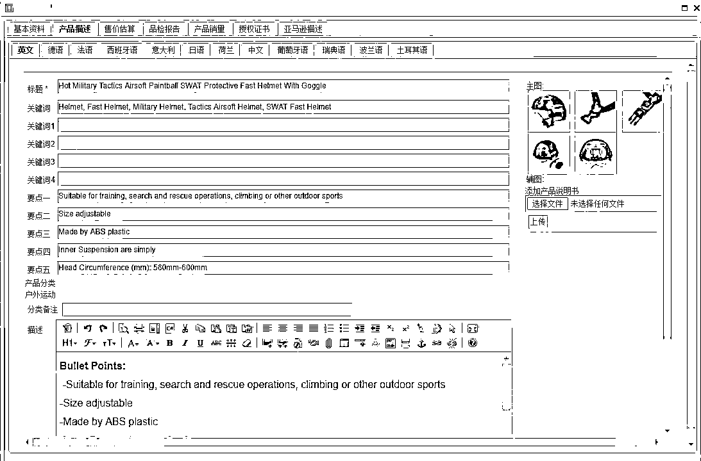
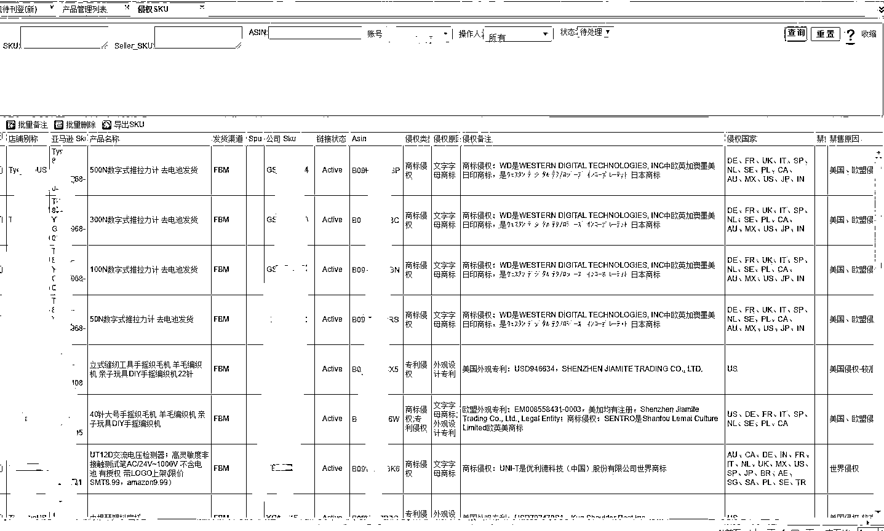

# (47赞)跨境电商复盘：0 基础亚马逊铺货创业一年，月销售额 20W+ 美金

作者：  陈焘

日期：2022-10-08

 

 

大家好，我是陈焘，一名跨境电商创业者，21年7月开始，从0基础开始做亚马逊铺货创业。

这篇文章，在去年21年9月销售额做到10万美金的时候就在酝酿了，当时写了一半，题目叫："0基础电商小白做亚马逊铺货，开店3个月做到月销10万美金，是如何做到的？"，当时无知，觉得自己还挺厉害的。但后来因为一些别的事情，文章就被暂时搁置了

到了22年，业绩开始滞涨，甚至回落，同时随着入行时间越长，觉得自己做的很多地方还是不够好，模式也只是站在巨人的肩膀上去借鉴，没啥值得分享的。直到跟一些圈友交流，发现还是很多人对亚马逊铺货不是很了解，也印证了那句话：你以为人人都知道的，至少还有1亿人不知道。所以决定趁着这个十一，把文章分享出来

考虑到排版问题，另附飞书链接方便阅读：跨境电商复盘：0基础亚马逊铺货创业一年，月销售额20万+美金

**一、最新业绩，22年9月销售额：21.5万美金**

 

 

从下图销售曲线可以看到，整体发展的趋势并不是一路向上，中间还是有不少曲折的。

在21年底的旺季，就一度做到了20万美金，然后开始销售额开始回落，直到5月重回20万，又遭遇了横盘滞涨，直到9月才略有起色

亚马逊平台仅看销售额，会虚高。因为平台的佣金是10-15%，平台FBA配送费占比也在10-20%，还有VAT税费（欧洲）、广告费、仓储费、促销费、退款等，所以平台销售额的回款率一般是在40-50%，再减去商品采购成本和发货费用，才是毛利

举个网上常说的例子：10元人民币的成本商品，卖10美金，回款按50%，5美金即35人民币，减掉采购成本和发货成本（产品重量不同，发货成本不同，暂按5元算），毛利是35-10-5=20元，毛利率也就20/70=28%

亚马逊铺货的毛利率和精品比，又要更低一点。我们的铺货模式，毛利率普遍就是10-20%之间。我们前期目标还是以业绩增长为主，所以定价也是按毛利率10%来定价。所以20万美金的销售额，毛利也就2万美金左右

**二、亚马逊铺货之路**

 

 

**1、跨境业务开启原因**

为什么一个电商小白，当时会选择做跨境电商，还是当时已经大部分人都看不起的铺货模式？

也是机遇巧合，当时因为一些别的项目，和国内某上市跨境大卖（以下简称Y公司）有了业务往来。他们也正好在孵化分销项目，合作之前深入他们公司学了2个月，了解了他们的铺货运作模式，觉得ok，就和Y公司开始了合作。

分销业务的具体模式就是：Y公司提供系统，我们提供人员和资金，然后按照Y公司内部的运营模式，上架产品进行销售，产品卖出后，由Y公司供应链来进行采购发货**# ****2**、亚马逊铺货解析（**1**）亚马逊两种发货模式

为了便于下文讲解，先介绍2种亚马逊发货模式

 

 

1）国内自发货（简称FBM）：

产品出单之后再在国内采购发货，通过国际物流发给客户，一般从用户下单到用户收货，时间一般为10-30天左右。

优点：卖家不用囤货，没有资金的压力；

缺点：客户收货时间较长，一般选择较少；平台流量不倾斜

2）亚马逊物流发货（简称FBA）：

先将产品提前发到亚马逊仓库，产品出单后，由亚马逊物流帮忙配送给客户，然后亚马逊会向卖家收取物流配送费（可参考京东物流配送）

优点：配送速度快，客户优先选择，平台流量倾斜（因为亚马逊能赚到更多的钱，配送费、仓储费、人工处理费、销毁费等）

缺点：需要囤货，有资金压力，且有滞销风险

**（2）我们的亚马逊铺货模式**

我们的运营模式，就是通过多店铺批量上架FBM商品链接，当某个FBM链接出单达到一定的条件（比如90天内，FBM出2单以上），就会将其转为FBA链接，发货去亚马逊仓库，从而获得更好的流量，出更多的单。

简单来说，就是通过FBM铺货去选品，然后发货去亚马逊做FBA。然后中间的一些运营细节：

 

 

**类目选择**

在铺货产品类目的选择上，会避开3C、服装等红海的类目，选择比如工业，汽配，户外等处于相对蓝海市场的品类，很多靠的都是类目长尾流量。

**商品链接上架**

上架ERP：商品上架有专门的ERP软件，每个sku自带图片和文案，且带侵权排查。侵权排查，对于做跨境铺货，尤其是亚马逊铺货非常重要，因为国外非常注重知识产权，如果不做侵权排查就上架，店铺很容易就侵权，侵权多了店铺也很容易挂掉。

 

 

上架模式：因为有ERP，理论上可以做到一键快速批量上架多个站点。（现在我们在做的非亚马逊平台，就是一键上架）但亚马逊平台有查重机制，会合并相同文案，所以上架的时候，每个sku的文案要进行适当的修改优化，避免合并的同时，也可以提高初始链接质量，更好地利用新品流量红利期。

 

 

上架速度：铺货前期，因为没有太多别的工作，每个员工每天上架20-80个sku不等（质量不同，数量要求不同）；后期逐渐稳定在每天8-10个sku

**上架后运营**

FBM链接上架后，会根据以下SOP对链接进行相应动作：

随着商品链接出单数增多，相应转FBA的链接也会越多，当所有FBA链接需要发货的sku个数，其重量能满足空运起始重量的时候（市场上一般是21-23kg，我们一开始也是，后来做到了10kg起重），就会开始备货发到亚马逊仓库。

FBA链接到货后，会根据以下SOP对链接进行相应动作：

FBA补货的数量，如何计算出准确的数量，是个技术活。

简单的公式就是补货数量=平均日销*备货天数 - 亚马逊在库 - 物流在途。

 

 

但展开来说，平均日销的计算公式如何确定？备货天数根据不同的补货方式（快递，空运，陆运，铁路，海运）也是不一样，当同时存在不同物流的在途库存时，如何确定要补的数量？还有会涉及热销/潜力产品的加量备货，旺季备货加量，季节性产品备货加量/减量，以及清仓链接的屏蔽与释放等。总之怎么把货的数量备好，最大程度的保证商品链接不会断货，又不能过多备货占用周转资金，更不能产生冗余库存，真的是个很技术的事。

FBA库存滞销清仓

上面也提到了，既然发货到亚马逊仓库，就会有库存冗余的风险，一旦冗余就要进行清仓，同样清仓也是有相应的SOP：清仓如何降价？降到什么程度价格要会涨？清仓的链接是否淘汰不再补货？具体会更复杂些，我们的完整SOP也还在梳理中，就先不放出来了

**后端供应链**

前面提到了，我们用的是Y公司的ERP和供应链：

FBM出单，所有的采购，入库，打包，贴标，发货都不用管

FBA发货，我们在ERP里建好相应的FBA发货单就好，后面的流程也都不用管当然这些都是有服务费，不过我们也省下了相应的采购，仓库，物流的费用，并且有更专业的人为我们服务，这对刚接触跨境电商的我们来说，更友好更高效。

 

 

**广告**

我们的广告目前也是交给了Y公司托管，铺货模式的广告也是个体力活，让更专业的人做更专业的事。

目前每个月广告数据如下，还是符合我们预期的：

aoc是20%左右，广告销售额/整体销售额=30%，广告花费占比（广告花费/整体销售额）=6%

以上就是我们在做的亚马逊铺货模式的简单介绍，中间一些细节，篇幅原因就没有展开。如果有感兴趣的圈友，可以再找我交流。

**3、后期业务规划**

 

 

亚马逊铺货业务之外，基于现有的一些优势，我们也希望拓展以下新的业务

**（1）亚马逊精品合作**

结合我们实际铺货一年多的数据，以及对Y公司EPR商品数据的了解，还是发现了有不少有潜力可以做精品模式的sku（我们铺货sku的日销，最高的有10+），所以也在积极探索精品模式中

但我们目前的团队没有太合适做精品模式的人员，所以对外也接受合作。我们提供选品支持，感兴趣的圈友可以联系

**（2）其他跨境平台铺货合作**

Y公司的产品库，一共有100万+sku的铺货完整供应链，且其中有5万左右的sku是有现货库存5个以上的，出单可以做到当天发货的。对于有发货时效的平台，还是很有优势的。

像我们目前在做的一个拉美平台，就是一键上架铺货，1个员工一个月能做1.5-2万美金销售额，毛利率10%。

所以有类似跨境平台铺货需求的圈友，也可以多多交流，互通有无

评论区：

 

 

凯 : 详细了

Lesley金子 : 真棒 

知道 : 跟卖，上个月卖了400多万的货物，这个月还没搞清楚，算下来还是亏了几万，退货率太严重了

陈焘 : FBA跟卖还是FBM跟卖？理论上跟卖不可能亏，因为卖出去的价格是否有利润，在你决定要是否跟卖之前就知道了啊。没有算利润么？

跨境杨少 : 铺货 erp 要谨慎

陈焘 : 哈哈感谢杨少提醒  有空去南京找你

跨境杨少 : [OK]好嘞

良辰美 : 最近测试个小产品，FBM没开广告一天几单，发了FBA开广告没单，链接基本一模一样，也是神奇
