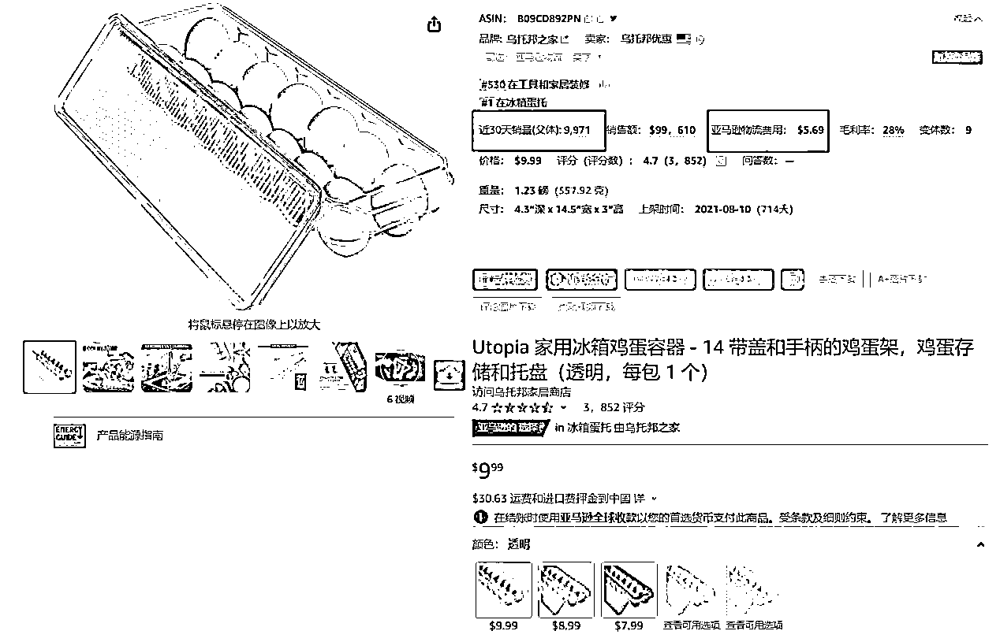
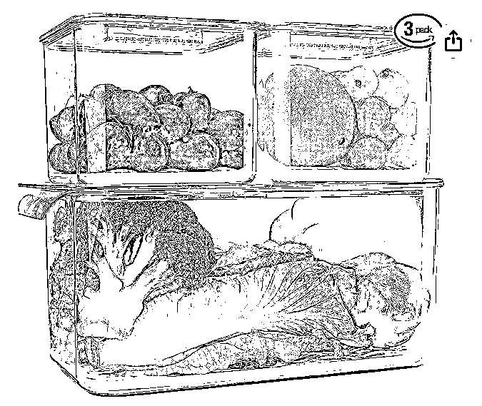

# (41赞)3-4 人小团队如何做亚马逊精铺，实现利润翻倍增长？

作者：  黄达龙

日期：2023-08-18

冰箱里的一个鸡蛋收纳盒可以作为一个电商选品，那冰箱里的蔬菜或水果置物盒，是不是也可以呢？如果再延伸到厨房里的其他物品上，是不是也适用？

我现在做亚马逊就是用的这个方法，目前一个月的销售额在 60 万美金左右。今天，我就结合自己的经验从选品、团队搭建等方面来讲讲，如何通过精铺模式做好亚马逊。

一、自我介绍

 

 

18 年通过国内一件代发项目几千元开始创业，19 年 800 多万销售额，20 年国内下滑的同时，研究亚马逊，21 年亚马逊销售 60 万美金，22 年 380 万美金，23 年目前月销售额 60 万美金左右。

亚马逊有精品、精铺、铺货等模式，精品属于红海爆款，精铺属于小爆款或者低需求市场，铺货属于概率性模式海量产品。

目前我们做的是精铺的模式。

刚开始接触亚马逊时，并不知道有这三种模式，只是根据自身能切入的方式就开始尝试了。店铺数据验证后，开始团队搭建，然后解决供应链，通过不断的产品、经验、供应链的积累，获得了一定的销售数据。

二、亚马逊精铺

机会：

亚马逊相对于国内电商来说，竞争系数比较小，还有汇率的加持，整体的 ROI 比较高。

入行以来美金兑人民币汇率最低 6.4，最高 7.3。目前 ROI 可以达到 3。

 

 

我们精铺模式的核心在于选品以及跟品，选品我们只要求日出几单就可以切入了客单价  20$左右，通过一定的积累后，有些产品也能达到月销 800 单左右。

选品：

根据以往熟悉的产品、能触达的供应链、身边的灵感，找到一些商品。

譬如，厨房用于收纳鸡蛋的盒子，是我们身边随时都可以触及的，通过反查亚马逊数据，发现竞争不大、或者可以找到优化方式，以及 1688 的工厂能够配合，那么就可以尝试了。

举例：

在前台调研 egg holder 时，发现此款商品，月销可以达到 9000 件，亚马逊配送费用是  5.69$，15%佣金是 1.5$，回款有 9.99-5.69-1.5=2.8$，投入：1688 拿货成本是 9.26，换成美金不到 1.5$，头程海运大约 1$左右，回款 2.8-1.5-1=0.3$，未计算退货以及广告等。

毛利率仅有 3%，通过不断的找品、验证，会积累一定的选品技能、供应商沟通技能以及产品分析技能。

 

 

 

持续的调研过程中，发现客单价高点，尾程&佣金占比低于 40%，切入机会相对容易点。

 

 

譬如一下这个款，月销可以达到 1 万件，亚马逊配送费用是 6.39$，15%佣金是 2.7$，回款有 17.99-6.39-2.7=8.9$，投入：1688 拿货成本是 9.48，换成美金不到 1.5$，头程海运大约 1$左右，回款 8.9-1.5-1=6.4$，未计算退货以及广告等。

毛利率可以达到 35%。ROI=投入 6.4$/2.5$=2.5，得出毛利率以及 ROI 在自己能接受的范围内后，可以找供应商沟通采购发货事项。

 

 

有了第一款的切入后，积累 listing、发货、供应商沟通、头程、广告等经验，可以考虑横向延伸，找到相对有切入机会的产品，但是用户人群是一致的。

 

 

 

 

 

通过几款产品的验证后，梳理出自己对于选品的需求，譬如日销达到 5 个，利润率 30%左右，退货率 5%左右，那么下次选品时可能会更加清晰。在塑料材质的同时，也可以考虑其他的材质，譬如陶瓷类的

金属类的

 

 

木制类的

 

 

当鸡蛋置物架感觉遇到瓶颈时，有足够的时间精力以及资源匹配，可以延伸到厨房场景的其他产品。

 

 

在此过程中，不断积累供应链资源，了解每一道生产工艺，物料成本，有利于后期研发私模产品。

在以上几款置物盒获得一定的数据后，可以反向找到工厂开发、延伸，通过不断的复制，可以从材料入手，譬如塑料制品浴室场景、庭院场景、超市场景等。

供应链：店铺有一定的销售数据后，通过 1688 的了解，发现塑料的供应商在浙江居多，可以先去拜访几位合作过的工厂，参观生产线、请教一些生产上的问题。

 

 

有一定的了解后，根据自己的需求匹配工厂，譬如该工厂没有 1688 店铺，自己有能力设计模具、自己生产加工、订单不饱和、资金不充沛等，跟工厂深入合作，前期给予一定的支持，模具费、货款全部现金，但是要求快速小批量出产品等。

三、团队搭建

① 合伙人：

通过现货测试后，跑通数据后，寻找身边价值观吻合，有一定信任基础的朋友一起打造。跨界小白，无需电商经验，无需资金投入，合作的前提是彼此信任、尊重，价值观不吻合、工作不闭环的，不考虑合作，以免后期产生内耗。

喜欢自己打造的，也可以考虑招人，这样会更可控些；

② 运营：

1、小伙伴进来公司时会分配 1 个有业绩的老店铺以及 1 个新店铺，业绩提成从  3%-10%阶梯式。有一定的运营基础后，会给他多配 1 个新店铺，为下一位小伙伴做准备。

 

 

2、当有新的小伙伴进来时，老员工需贡献一个老店铺给新人，我们理解为一种传承。老店铺给新人后，老员工只需要指导新人，协助其完成销售，但是此店铺老员工的提成会降低 50%。

到后续新员工上升之后，老员工基本不需要管理该店铺了，把时间精力放在自己的店铺上，享受被动收入。

3、当新员工再培养下一位时，第三位新员工的业绩只跟第二位员工有挂钩，被动收入只能享受到第二层级。

员工培养下一位时，会增加 1000 的底薪，但是贡献出去的店铺提成会降低 50%（本来每月可以拿 6%的话，共享出去后只能拿 3%）。

每一位员工的业绩提成比例时一致的，层级也是一致的，大家都可以想办法培养更多员工，不喜欢带人的也可以做好自己店铺。

③ 协议：

针对性的拟合作协议、退出机制、持股比例等；

④ 选品：

上架测试过的产品，并且横向延伸出同类产品，最好是同个供应商；

⑤ 文案：

 

 

打造 listing（链接），找供应商要素材图，淘宝协助修图，文案可读性的前提下，埋入部分关键词。卖家精灵有个 listing 生成器，前期学习的过程中，可以参考；

⑥ 广告：

上架后立马自动广告测试，看系统推荐的词或者同类商品是否吻合，验证 listing 有没有跑偏。自动广告的同时，针对性的投放到竞品；

亚马逊官方广告网址：

https://advertising.amazon.com/zh-cn/resources/learning-console?ref_=a20m_us_hnav_lc_t1

⑦ 分红：

 

 

合伙人模式，前期由公司投入，当总回款大于总投入+预留资金时，约定超出的部分按比例次月分红。

譬如从创始至今，所有的投入共 20 万，亚马逊回款 50 万后，预留 20 万资金公司周转，另外 10 万可以拿出来分红。预留资金随着库存、周转资金可以商讨着调整。

不管是合伙人模式还是招人，前期有测试过的产品加持，已经各个流程已经跑通了，可以避免一段摸索的时间，并且增加了成功率。团队合作前期，尽量让问题出现的更多、更快，可以更好的磨合以及打造信任基础。

四、亚马逊机会

亚马逊模式：铺货、精铺、精品；

亚马逊测算：售价-佣金-尾程-成本-头程，佣金按照类目收取，参考：

https://sellercentral.amazon.com/help/hub/reference/GTG4BAWSY39Z98Z3  尾程按照体积、重量、长宽高等维度判断，可以参考以下链接：

 

 

https://sellercentral.amazon.com/help/hub/reference/GABBX6GZPA8MSZGW  头程，海运按照体积、重量等计算，20 公斤起，目前慢船美西时效 40 天左右。空运也是体积重量参考，一件都可以发，目前时效 5-7 天。

尾程头程都有重量体积等参考维度，所以轻小商品是相对来说有这方面的优势。

根据这样的特质，可以借助软件工具选品，譬如卖家精灵，

https://www.sellersprite.com/.  有个选市场功能，根据自己的情况，筛选条件。

举个例子：

选市场-月销量小于 800-售价大于 16$-毛利率大于 50%-新品数量大于 20%（该软件有很多视频可以学习），通过筛选后发现 Executive Desk Toys （办公桌玩具），前台搜索发现结果数量 532，

往下调研后发现 10-20 美金区间销量占比最高，从中抽取了一个产品举例，并不是建议哈，因为我也没有做过这个类目。

 

 

13.99 售价，尾程只要 4.08，佣金 15%，去除尾程、佣金后毛利率有 56%，就是还有  7.8$回款，中号成本 8.2 元，头程空运预计 12 元海运预计 2 元，即使空运还有 4.8 美金回款，34%毛利率。

所以，建议新切入的小伙伴，可以尽量选择轻小商品，通过学习调研（卖家精灵有很多视频可以学习，有 5 分深入已经领先很多人了），找到细分类目，调研后找到对标产品，排除专利后，思考怎样优化。

 

 

前期只能考虑赠品或者搭配组合的方式去切入，后期才考虑模具或者新颖设计。

拿货发货，关于广告可以关注微信公众号：亚马逊广告，里面也有按照不同阶段提供了很多学习资料。

有了点的切入后，再慢慢延伸到面，验证好数据，可以考虑如何复制。

评论区：

西瓜 : 亚马逊品类分为精品，精铺，铺货。[强][强][强]
