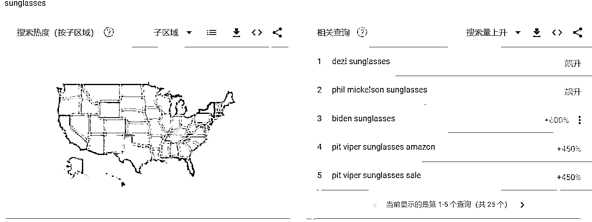
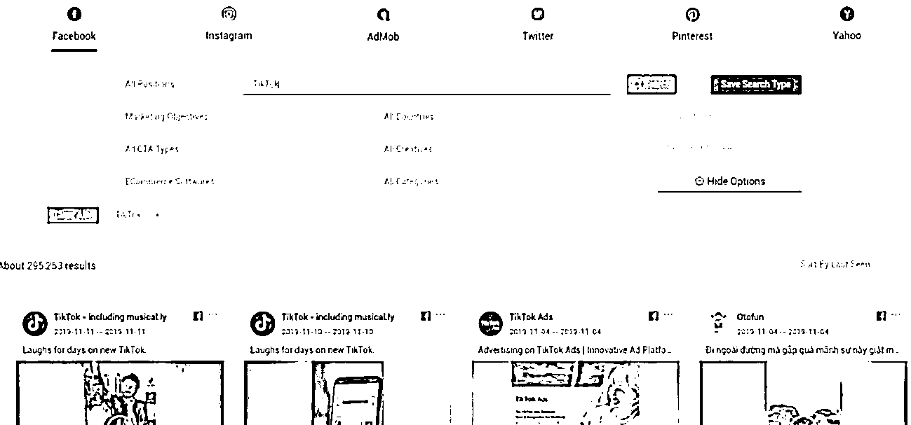
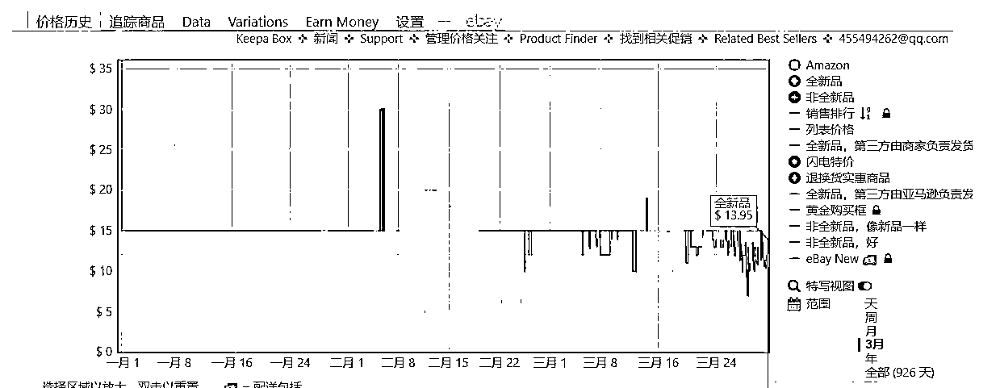
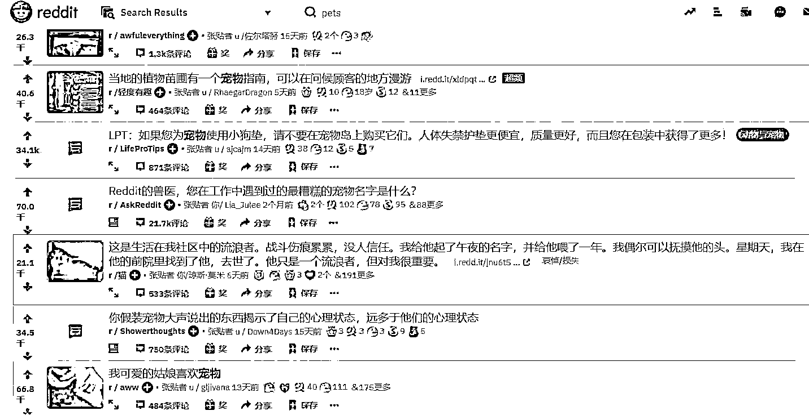
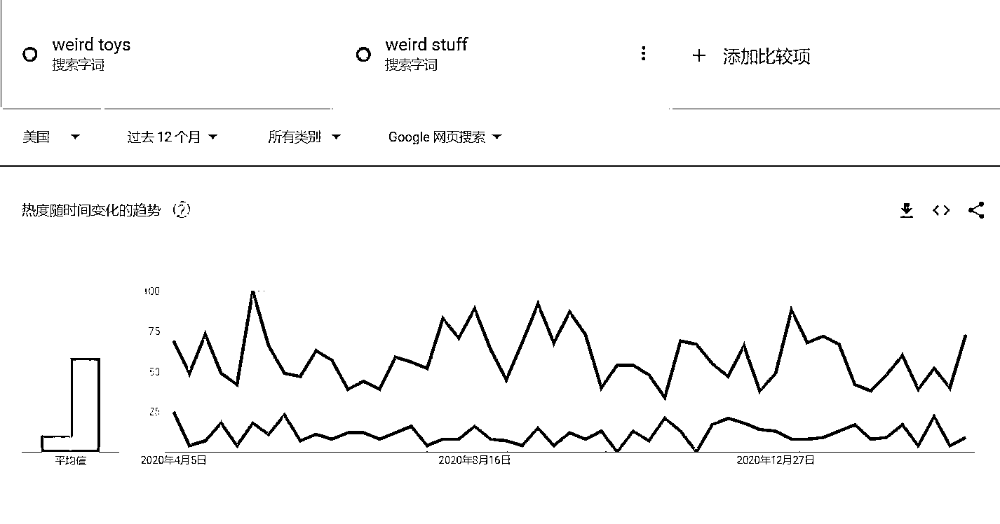
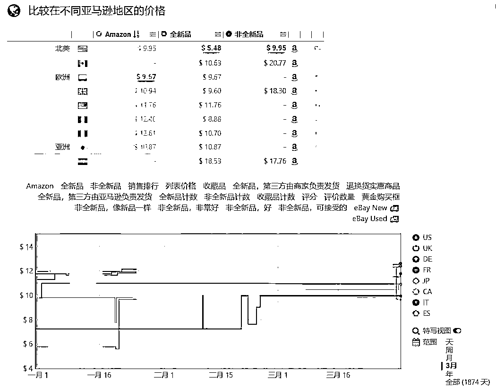
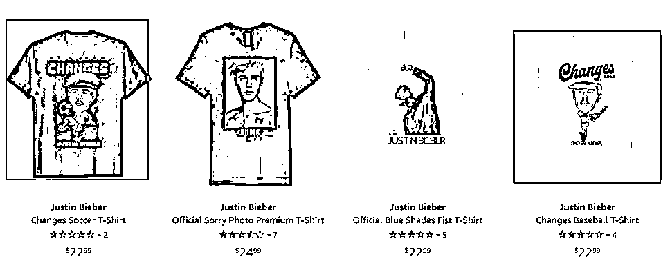
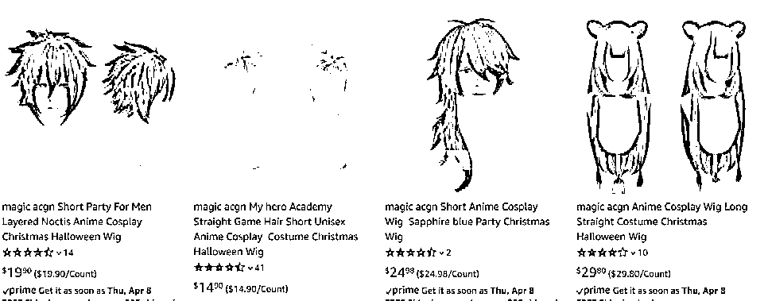

# (精华帖)(259赞)如何用一套犀利的选品思维与精细化的选品工具，找到有利润空间的跨境电商爆品？

作者：  鱼丸|亦仁助理

日期：2021-04-07

今天#生财合伙人#嘉宾@小马丁  就会聊一聊这个话题。

 

 

他是跨境掘金俱乐部发起人，擅长钻研各种海外赚美金方法，且在跨境电商网站的精细化运营、谷歌SEO、SNS社媒营销及内容营销上都颇有心得。他所售卖的商品，在竞争激烈的亚马逊里挤进了类目 Top 榜单。

欢迎@小马丁分享他的心得。

这是最坏的时代，也是最好的时代。

——致电商人

本文主要内容：

一、前言

二、初期选品思路

三、选品工具介绍

四、可复制选品思维

五、结语

一、前言

大家好，我是小马丁，是跨境掘金俱乐部发起人，擅长钻研各种海外赚美金方法。

 

 

在跨境电商里摸爬滚打多年，算取得过小成就吗？

算吧，毕竟要在竞争激烈的亚马逊里挤进类目 Top 榜单，现在回想起来胸腔里也还积攒着一腔热烈。

我失败过吗？也是失败过的。当渠道和生产都不掌握在自己手里，面对产品差评无能为力被亚马逊强制下架产品的时候，那种整个世界都是灰白的色彩的感受，依旧跃然眼前。

是正当竞争的失败还是不正当竞争地被人恶搞，现在再谈论这个对我来说已经没什么意义了，但是作为一种警醒，对后来者还是有些意义的。

我经历过那种万念俱灰的感觉，所以不想你再经历，同时我的心态慢慢地发生了转变。

从意难平到处之淡然，再到热爱分享，鬼知道我都经历了什么。

跨境电商是个行业，我常说，大家一起玩才是行业，只有自己玩，那只能是玩完。

我总归是热爱生活，也热爱跨境电商行业的，带着大家一起玩，是我现阶段找到的，能满足自己的行业意义。

所以这篇文章，我会从怎么选品开始，带着大家试一试亚马逊的水，水深水浅，我说了不算，如同小马过河，亲身尝试了才知道。

 

 

做了亚马逊这么多年，我时而会陷入一种巨大的矛盾中，有时候会觉得现在已经没有什么产品值得做亚马逊了，有时候又会觉得亚马逊仍然存在大量空白市场。

前几日苏伊士运河被堵，全球经济命脉被扼制，造成全球日均600亿的亏损，我们会发现跨境电商的体量依旧庞大。

这么庞大的体量，为什么会产生没有什么产品值得卖的错觉？

那是因为我自己钻了选品的牛角尖，永远都在找什么产品好卖，却不思考为什么这款产品会好卖，过分地关注热卖产品而忽视了目标受众的需求。

二、初期选品思路

其实选品的本质就是“抄”，但并不是找一样的产品，那样的话并不需要选品，直接跟卖就行了。

那么具体要怎么“抄”，在起步初期，或者说是手头资金并不太充裕的情况下，这里提供一个初步的思路，希望能尽可能地减少一些试错成本。

**1.**尽量选择重量体积偏小的同时又精美的产品，做到物美价廉的同时，实现成本最小化；

**2.**选择不因季节而变化的刚需性产品，减少因季节原因而堆积库存的情况；

 

 

**3.**尽量避开有大卖品牌的产品类目，同时不能选择太冷门的市场；

**4.**针对细分人群的刚需，提供高溢价低竞争产品，开拓细分市场和蓝海市场；

**5.**在同类目产品中制造差异化，做人无我有的产品。

三、选品工具介绍

在选品思路有了之后，我们就可以肆无忌惮地去选品了吗？

答案显然是否定的。

使用纯手动浏览筛选不仅效率不高，并且会更多地掺入我们先入为主的主观判断。

我们的喜好、习惯和文化都与老外不太一样，比如说之前疫情大家就想不通为什么老外会去抢购卫生纸，老外也想不通，国人为什么抢购大米面粉。

这种主观判断会在很大程度上影响我们选品的针对性。

所以在选品的时候融入工具的使用是十分必然的。

下面我们来介绍一些常用的选品工具。

 

 

**1. **谷歌趋势** Google Trends**

这个完全免费的工具对于电商人来说简直就是福音，通过它可以快速锁定产品关键词的热度和走向，迅速判断产品的市场容量和未来趋势。

下面举个例子简单地介绍一下这个工具如何使用：

比如我们想要了解美国的墨镜市场，我们可以把核心关键词 sunglasses 放到搜索框进行搜索，随后我们可以得到墨镜整体的一个需求走势图，可以看到墨镜在一年里面的需求走势情况。

我们还可以把类似产品或者其他意向产品进行比较，比如可以把普通眼镜和墨镜这两种类似产品作一个比较，这样就可以知道谁的热度和需求更大，方便我们在选择产品遇到困难的时候来做出最终的决定。

 

 

此外，我们还可以知道产品在美国不同州的不同需求情况，以及与墨镜相关的搜索词和相关话题，方便我们去做进一步的深挖，找到这个产品下面更多的长尾产品和关联产品，以及更深层次的了解我们目标消费者的对这个产品的喜好情况。

 

 

**2. Semrush**

这个工具是 Google Trends 的进阶版，虽然要付费，但是能够获得更加详尽的数据。

这个工具可以得到网站最近平均流量（平均日流量、月流量）、网站客户所在国家、网站主要竞争对手、网站品牌关键词带来流量、网站投放广告等信息。

通过 Semrush这个工具分析同行网站流量和访客主要来源，精准分析选品的竞争对手。

 

 

**3. Ahrefs**工具

Ahrefs 工具与 Semrush 是两个差不多的工具，彼此的功能和领域都非常接近，可以在这二者中间挑选一款，选择 Google Trends + Ahrefs \ Semrush 配合使用。

产品搜索量相关的衍生词都可以用 Ahrefs 找出来，根据他们搜索量和点击量来判断这个产品和行业适不适合我们。

Ahrefs 还可以查看同行在谷歌投放的广告词和广告语，方便我们了解同行广告投放情况，针对性布局和优化自己的广告语和关键词，提高广告优化效果。

我们通过 Ahrefs 看产品在谷歌趋势上面的搜索量趋势，可以大概了解这个产品的过去和未来发展趋势，同时获取必要的外部行业信息。

 

 

功能之强大，集站内诊断、关键字研究、热门内容研究、外链分析、关键词排名追踪于一身，是 SEO 的必要工具，如果选择了付费使用， Semrush 和 Ahrefs 都是非常值得深挖功能的工具。

**4. **亚马逊榜单** + Keepa **插件** \ **卖家精灵

通过 Ahrefs 看出关键词的 SEO 竞争难度后，我们再通过亚马逊 Best Sellers 最热销榜单查看当前热销产品，通过 New Release 最新上架榜单查看新品趋势，通过 Movers & Shakers 榜单看不同产品人气指数，通过 Most Wished For 榜单查看产品的存量市场和顾客的购买意愿。

通过 Keepa 插件 \ 卖家精灵，根据产品价格、产品订单、产品发货时间、广告产品做筛选，最终快速锁定产品。

 

 

**5. Bigspy**

从亚马逊榜单找到合适产品后，我们再通过 Bigspy 这个工具，查看主流社交媒体上面打广告产品，找出广告点赞互动高的产品。

根据自己性质查看更适合在哪个社媒平台做广告，找出同行做的最好的几个广告，参考借鉴他们广告语和广告活动策划，在搞社媒活动借鉴他们的广告语和文案。

 

 

思路** + **工具的主要目的，是让我们在选品的时候不至于脑袋一热就拍屁股决定选品，而是要做好产品的市场调研。

a. 通过了解同行畅销产品和价格，方便我们进行新的产品开发和价格制定，提供可靠的数据支撑可参考价值；

b. 通过了解同行网站流量主要来源渠道，分析这个产品类目的主要引流渠道，针对性引流，减少引流试错成本；

c. 通过了解同行关键词布局，方便我们布局我们的关键词，让我们关键词布局更加全面，后期排名更有优势；

d. 通过了解客户群体，剖析客户需求，可以避开竞争激烈的市场，甚至可以抓住用户痛点，开拓空白市场，实现一飞冲天。

 

 

简单地说就是同行没有的我要有，同行有的我要更精；客户想到的我要有，客户想不到的我要帮客户想到。

四、可复制的选品思维

这一整套“抄”的流程，意在提取热卖产品的内核，依葫芦画瓢，用猫的骨架去画出老虎，看起来可能有点复杂，接下来我们就用思路 + 工具，总结出一套思维模式，来看看这只老虎具体要怎么画。

**1. **跟卖型选品

这是选品里面最简单粗暴的方法，但确实好用。注意，是跟卖型选品，而不是跟卖。

我们以玩具类目为例，打开亚马逊商城的 Best Sellers 榜单，能看到排名第一的玩具产品

同时点开 Most Wished For 榜单，发现这款产品在 Most Wished For 榜单排名也是第一。

 

 

这就说明了这是一款足够热卖的产品，并且仍然有售卖空间，市场容量充足。

之所以强调是跟卖型选品而不是跟卖，是因为我们要提取这款产品的内核。

我认为这款产品的内核就是：可爱的玩具，而这也就是我们跟卖选品的方向。

接着我们可以通过谷歌趋势查看产品的趋势走向，有钱的也可以用更专业全面的  Semrush 。

谷歌趋势图：

 

 

Semrush 分析图：

我们可以看到趋势曲线是震荡上升的。

再通过 Keepa 插件查看价格趋势，查看产品售卖价格。

 

 

然后上 1688 上查看类似产品售价。

 

 

认为利润可观便可以敲定选品了。

注：毛利润**=**售价**-**采购成本**-**头程运费**-FBA **费用**-**亚马逊佣金**-**收款汇损（欧洲站还需扣除** VAT **税）

整体的选品流程就是寻找热卖商品**→**确认市场容量**→**确定产品趋势**→**确定产品利润**→**敲定选品。

同理，可以用这个方法在 eBay 、速卖通、独立站甚至各大社交平台进行选品。

社交媒体以一个类似于国内百度贴吧的网站 Reddit 为例，非常适合在上面深挖针对特定目标人群的选品调研。

比如你想要去深挖一下宠物类目，虽然现在宠物类目已经是白热化竞争市场，特别是狗粮猫粮一类，但是并不妨碍你去做一番调研试试手。

你可以去 Reddit 上面找到与宠物相关的论坛，爱猫爱狗的人总是有特别多的话题和同理心，我们要充分利用这种同理心和共情能力，让充满爱心的吧友给你打白工，而你所需要的只是试发一些样品给他们。

 

 

另外，当我们决定上一款产品的时候，也可以在相应的宠物小组发帖子，让大家根据目前的功能点和图片来提提意见，甚至可以考虑先送一批出去征求一波意见，如果不行的话可以根据意见返厂再进行修改，这就类似于产品在正式发布之前做的一个测款工作了。

之后，如果在群组和这些人混熟了，让他们帮忙解决亚马逊测评也是很容易的事情，要知道现在亚马逊刷单差得非常地严，但是贴吧这种地方永远都有热心网友存在。

**2. **视觉型选品

说实话，当看到上面案例里面这个毛绒玩具连续霸占热卖第一三个月的时候，不得不感慨人类真是一种视角动物。

但是视觉型选品并不是说选品一定要好看，毕竟审美这种东西太过私人，一千个人眼里有一千个哈姆雷特。

 

 

所以我认为视觉型选品的内核就是要有足够的视觉冲击力，既然要视觉冲击力，我们就从“ weird ”奇怪的这个关键词入手。

我们查找一下亚马逊销售榜单，发现确实有这样的产品（虽然这种长得跟月球一样的煎饼实际上是个毯子）。

这一类还有能上热卖榜单的产品，市场容量也是足够的。

从谷歌趋势上看这一类的产品也处在一个上升期。

 

 

再通过 Keepa 插件查看价格，也趋于稳定。

 

 

现在剩下的问题就是视觉冲击力还不够，然后偶然情况下我发现了这么一组产品。

 

 

 

 

 

 

可以把一些网上的神经病表情包定做成产品，视觉冲击力十足，我初步搜索了一下亚马逊市场，有很多神经病玩具产品，但是这个品种的神经病还真没有。

配合充足的市场容量和好的搜索趋势，如果你能联系到这款产品的生产厂家，或者愿意定制这种产品的厂家，说不定可以打开一片蓝海市场。

**3. **实用型选品

 

 

我们逛网店的时候，除了看到一些有趣的小玩意忍不住剁手购买以外，更多的时候是抱着极强的的目的性去搜索产品来选购的，所以售卖实用类的产品也是一个选品的思维方式，并且这类选品的核心也过于简单，就是使用，从而也显得有点宽泛。

而当你面对这么宽泛的核心而无所适从的时候，没关系，亚马逊会告诉你这个核心能衍生出什么词出来。

直接在亚马逊搜索栏输入“ useful ”，能出来很多联想词条。

实用型选品有一个隐患，就是根据使用场景的不同产品总是会出现很多意料之外的问题。

比如车载手机支架，这东西你不卖不知道，一卖吓一跳。差评里面全是诸如“手机太重磁铁吸力不够”、“支架吸盘吸力不够”、“要用胶纸站在车上不便清洁”之类的问题。

 

 

这就引申出一个选品的小技巧，从热卖的差评中去选品，看差评分析产品痛点，看是否有改进空间，同时分析 Best seller 的产品特征，我们的产品要有基本的差异化特色，要开发出适合更多场景使用的产品。

 

产品本身的缺点、服务上的缺点，通通都会体现在这里，这是你分析竞品优化自己的不能错过的宝地。

**4. **细分市场型选品

 

 

不管做多久的电商，始终还是觉得利基这个词过于抽象，我还是更喜欢称之为细分市场。

比如前面手机支架说的，要展现产品的差异化，开发出适合更多场景使用的产品其实就是一种细分市场。

同样是玩具，一岁男孩、一岁女孩、两岁男孩、两岁女孩，每一个点都是细分市场。

不止是亚马逊，我们还可以用谷歌、 Youtube 、 QUORA 等搜索引擎，我们只用他们的搜索引擎，看看我们输入关键词之后能联想出什么词条。

用 Keyword Tool 这个工具就可以。

 

 

所以我认为细分市场选品的核心就是足够发散的思维和足够精确的定点。虽然看起来很矛盾，但事实就是这样。

比如说我现在要做一个马克杯，我可以通过终极发散的思维去为这个马克杯添加元素，发掘细分市场。

节日：母亲节，父亲节，护士节，独立日，复活节，感恩节，圣诞节

主题：订婚，婚礼，周年，生日，退休，搬家，洗礼，祷告，毕业，怀孕

对象：母亲，父亲，祖父母，姐妹，兄弟，朋友，医生，护士，教师

场景：厨房，浴室，卧室，厕所，花园，办公室

功能：收纳，装饰，保鲜，测量，  应急

就是这么发散的思维，偏偏对应着每一个足够精准的细分市场。

 

 

虽然前面在思路里面说，尽量避开季节性比较明显的类目，以防库存堆积成为接盘侠。

但是在做好准备的前提下，还是可以尝试的，特别是节日，每一个节日都是你产品爆单的机会，要不要搏一搏单车变摩托，你需要自己去衡量自己的风险抵抗能力。

亚马逊主页的产品类目导航，也是一个可以快速挖掘细分市场的地方，以宠物市场为例。

在 Pet Supplies > dog > food > wet 这样去一步一步的挑选产品。

再举个例子，比如家电洗衣机市场已经接近饱和，如何从中杀出一条血路？

我们可以做一个迷你洗衣机，专门洗内衣内裤，专门解决特定问题。

 

 

虽然这个趋势起伏比较大，但是一旦有需求的时候热度能升到很高。

在亚马逊也有一定的流量， 1688 拿货价虽然偏高，但是客单价也高。

 

 

 

确定了细分市场，就可以用我之前提到的工具，如谷歌趋势图、 Keepa 插件、 Semrush 等，还有我没提到的工具，如 Jungle scout 、魔词等工具，进行一套确认市场容量→确定产品趋势→确定产品利润的素质三连，就可以选品了。

这种选品要注意观察不同产品、不同使用场景下，选品的季节性周期性问题。

**5. **情感型选品

从马克杯中分散的细分市场选品思路里面还可以提炼出另外一套核心，可以在选品中融入品牌故事，用讲故事的方式去卖产品。

比如卖这种家庭亲子 T-shirt ，不仅很有家庭氛围，还能一次卖出好多件。

如果你觉得情感型选品这个说法比较抽象，那我们直接提取产品内核。

 

 

这是一类顾客对产品能够产生认同感的选品，或者说购买了这类产品之后我能获得群体认同感。

例如，美国人对文化衫这种产品有着一种我们不太熟悉的热爱，他们很喜欢搞游行，每一次游行都是几千件文化衫的定制，所以在衣服上印 Logo 也是一个可行的选品方案。

服装上的 Logo 和特殊饰品是最快速最直观地展示自己属于某个群体的方式，特别是一些明星的粉丝群体，他们非常总是非常急切地宣扬他们的偶像。

 

 

 

贾斯汀比伯也算是一个时不时喜欢爆发一波热度的经久不息的老美明星了，他总是这么不甘寂寞。

当然要注意，不要侵权。

或者是一些明星恶搞印花，如奔跑的小李和黑人问号。

 

通过热度趋势能看到，这两位也是永远在提供着热度的明星，如何把他们带给粉丝、网友群体的情绪热度转变成你的产品价值，就是情感型选品的关键所在。

 

 

除了主流文化群体，我们还可以把目光瞄准非主流、亚文化群体，比如日本动漫的 ACG 文化， Cosplay 文化等，在美国也非常地流行，是一个虽然小众但是购买欲非常旺盛的群体。

 

 

你需要做的是多听、多看，不停地挖掘大众群体的不同的情绪，或者不同的小众群体不同的文化认同感，把这种不同群体的诉求挖掘出来，再把这些诉求变成不限于衣服、口罩、手环、旗帜、手机壳、贴纸等一切可以用来展示“潮流+文化+诉求”的产品。

一定意义上，情感型选品也可以称为情绪型选品，所以与其说是调研产品，不如说是调研情绪。

时刻掌握目标客户群体的情绪走向，甚至在一定程度上调动买家的情绪，毕竟有研究表明，有超过 60 % 的网购行为都是冲动消费，所以在有人看到你的产品就上头的情况下，何愁选品不成功。

** **五、结语

通过这篇选品的文章，我分享了一整套选品的逻辑思维，由浅到深，一环扣一环，你只要想明白了任意一环，再去看别的选品思维，会发现千古选品不过一大抄。

 

 

纯自己开发爆款，大概率是开发不来的，你看罗永浩开发个手机想造个爆款，结果造了个锤子。

我来总结下，选品是一个从具象到抽象再到细分的过程，跨境电商的选品，是同时需要放大和发散的思维和细腻的心思的，需要靠自己的挖掘去培养出属于自己的思维模式和打法，你才能收获属于自己的沉淀。

拥有了这样的选品思维，再加上舍得投资购买工具和工具合理的搭配使用，照猫画虎，你又何尝学不会？

评论区：

鱼丸|亦仁助理 : 今天的分享主要分为 3 个部分：

**1. ** 在资金并不太充裕的情况下，可以减少试错成本的5个选品思路

**2. ** 用 5 个选品工具挖掘海量数据背后的细分市场爆品

鱼丸|亦仁助理 : 3\. 用 5 个可复制的选品思维，锻炼找到爆品的慧眼来，欢迎  和大家交流。

小马丁 : 感谢沐文大佬指引，感谢鱼丸邀请，感谢生财官方给的这个机会。希望和大家多多交流学习[拥抱]

沐文 : 马丁哥真棒！！！！！加油💪

飞奔的白羊古城 : 期待亚马逊大航海船

小马丁 : 谢沐文哥[拥抱]

小马丁 : 共同期待~

焦波 | 水镜 : 厉害了马丁兄弟~ [强]
