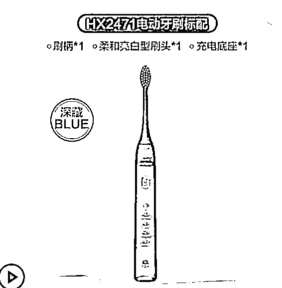
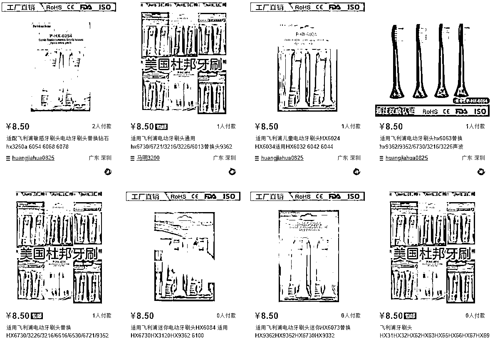
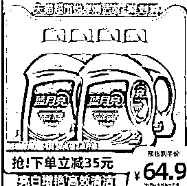
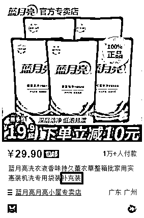

# (精华帖)(173赞)5000 字讲解跨境电商选品逻辑

作者：  君途-👾

 

 

日期：2022-05-24

本文来自于我自身的选品经验和总结，仅供参考。

要做好一个跨境项目，离不开“产品+内容+渠道“。若追求短期利润，三者中缺一尚可，如爆品站铺货模式就是”内容+渠道“，”供应链+亚马逊“则是”产品+渠道“。但长久来看，要实现持续稳定的竞争力，三者都不可缺。

这篇文章侧重讲解【产品】板块，【内容】和【渠道】板块我之后再找机会分享。

01

—

流量

好的产品=好的流量！好的产品=好的流量！好的产品=好的流量！

在互联网世界就是流量为王，谁能在繁杂的信息流中被看到，并且点进来！谁就可以在同等的大流量池里面获得更多的交易机会。所以要了解产品，先要了解流量；

对于电商领域的新客而言，流量无非就两种，一种是搜索流量，一种是推荐流量。两者并不完全割裂地存在，而是一般以“三七开”分布。搜索的排序带着推荐，推荐的结果又参考了搜索的记录；

**1. ** 搜索流量

特征：转化率高

 

 

我们在百度搜索商品，在淘宝搜索商品，在亚马逊搜索商品，其目的都是为了了解和购买这款商品，所以用户本身的意向是很高的。所以搜索流量的转化率一定会很高，以亚马逊为例，全网累计约有80%。如果你的很低，无论是【曝光-点击】环节还是【点击-成交】环节很低，那你的客户一定是被同行转化了，这时候就需要自己尝试不断地去【搜索-对比-优化】，来迭代自身的展示面，提高自身的竞争力；

流量的获取：永远地**SEO**

seo（search engine optimize）,搜索引擎优化。即利用搜索引擎的规则提高网站在有关搜索引擎内的自然排名。即利用平台的规则，在平台上抢排名；

SEO适用于任何平台！只要它有搜索！所有做小红书，淘宝，闲鱼以及各种互联网平台的项目，尽管他们的规则不尽相同。比如美团更注重地理位置，淘宝注重销量，闲鱼注重信誉。但是！他们都一个做法是相通的，就是优化关键词，这又是个很高深的学问，这里不做展开，只讲核心思想：让客户能想到和你相关的所有词语都在你的产品页面出现！

换而言之，你会发现有的sku是很难被精准地搜索到的，比如下面这只【透明的内部有金属配件的朋克风熊吊坠】，这种产品极度不推荐在淘宝等搜索主导的平台售卖，它更适合推荐类平台；

 

 

还有一些神器，像下面这款【手摇切丝机器】，在你看到产品前都不知道这种东西存在，更不会去搜索，所以这类产品也不建议在搜索为主的平台销售。

**1. ** 推荐流量

特征：随机性强

在推荐的算法研发中，人类只制定规则，结果由机器判定，所以出来的结果人无法精准预测。

 

 

以抖音为例，它会把你的视频推给你标签近似的10个人，作为第一个用户池子。如果10人里面有3个人点赞，就推给有100个人第二个用户池子，以此类推。

这种情况下，如果说就是碰巧！前面10个人没人点赞，这个视频就不会再被传播。所以抖音经常会出现两个一样的视频数据完全不一样的局面，于是也就有了“多个账号发同一个视频，搏运气跑出一个”的做法，结果往往是能跑出1-2个的。这个案例能很好地体现推荐的随机性，不过后来抖音优化了查重机制，重复的视频会被限流，所以矩阵视频的玩法也走不通了。

流量的获取：标签（精准人群）**+**内容

从上面的机制来看，要提升推荐流量获取有两种方式：一是让每一批用户更准确；二是优化内容，提高点赞率；

上述的【手摇切丝机器】，其产品使用过程本身就是好的内容，教你如何轻松切菜，所以很适合用于推荐流量，尤其是短视频这种内容承载量大的媒介；

以上的分析除了自然流量外，同样适用于广告。

02

—

差异化

 

 

这是我很喜欢的一张图，里面的格子相同，每只格子里面的小鸭鸭其实都不尽一样，但我只看到了蓝色的那只，尽管它真的很丑，但还是成功吸引了我的注意。

这在淘宝里面也是一样的，有些产品实在是太过于标准化了，以至于和其它产品完全拉不开差距，这样一页铺开直接就被忽略了。淘宝还可以在宣传图上做些功夫吸引注意力，而亚马逊只能放白净的抠图。。。

 

 

 

 

（搜索数据线，上边是淘宝，下边是亚马逊）

所以外观上的差异化是商城货品的突破口！尤其是搜索类商城，因为它会把一堆同类品摆到一起，让人选择困难。

说到数据线，必须要提一嘴老大哥anker，看看别人是怎么做亚马逊的。

 

 

（亚马逊上的【anker】搜索结果）

 

 

数据线绝对是3C产品里面标准化程度数一数二的品类，但在亚马逊上搜索【anker】，和上面的亚马逊产品列表对比，从颜色，到设计，到材质，再到凹出来的造型，各个维度都碾压上面那一批白色的公模产品。

实际上，anker极度注重【产品外观】和【电商呈现】上的差异化设计，光是一个数据线就设计了8种颜色及5张图，而数据线这种产品其实没太多技术含量，在华强北待一天能找到100个同品类供应商。

（anker官网数据线的产品页）

所以做商城，就多在外观的差异化上下功夫，做到差异化。

 

 

03

—

竞争度研究

就我个人而言，我知道好的项目非常多，能赚钱的方法非常多，但后来都是做的人太多了导致僧多肉少，最后大家吃得太猛蛋糕不够分，收益顶不上自己的辛苦费。

举个例子，在人流量大的地方卖早餐，本来生意很好，但别人看你生意好又在周边开了10家，经营的工作没有减少，收益却变成了1/10。

而在互联网，更多的是另一种情况，一个流量大的地方，只有一个铺位能租，谁租到了就能拿下所有流量。于是10个人竞价抢租，有人算了加房租后能赚10%，干了；有人算了再加房租后还能赚5%，干了；又有人算了再加房租后还能赚1%，目前好像没有别的出路，也干了。最后1%利润的人拿下来，又累又赚不到钱，收入都用来交租了，房东钵满瓢满。

在电商行业，平台方就是房东，你们竞争越激烈，它赚的越多，最后除了平台方之外大家都是输家，所以选品的时候，要严格考虑竞争度。

由于两种流量差异大，这里还是区分开两种流量来研究。

推荐流量

卖家的时间一般不充裕，没办法经常浏览国外的软件看他们推荐的产品，得到充分的选品思路。那么这个时候就只能使用广告监控软件了。举个例子poweradspy就是一个典型的广告追踪软件，你可以在上面批量查看广告。像这类广告数据化软件有非常多，可以让你非常直观的查看热门广告，相关的点赞数和评价数。

 

 

（选品需要用到的广告工具）

有时候，你可能会在这些广告间谍软件里看到很多有意思的热门产品，但是一定要保持理性，不要认为一个产品很酷炫就盲目选择这个产品，有时候这些广告不过是特效广告，而真实情况下是没有这样的产品存在的。这个在COD模式中非常常见。另外一个需要考虑的是自己的货源。并不是所有的产品都能在1688上面找到的。所以如果你对产品的预期过高，而供应资源没办法跟上，也不过是在空谈。

目前2022年，这类广告间谍软件已经是比较落后了，因为太多的卖家在使用同一款软件，看类似的数据。最终的情况就变成了，大家都没办法赚到多少钱，因为每个产品爆款的生命周期都太短暂了。

关键词难度

关键字研究的工具很多，最好用的应该是ahrefs和semrush，不过这两个工具很贵，我每个月都会花5000左右在这些工具上面，但我觉得作为个人能力的补充其实也值。

Shopify选品是可以通过针对关键字进行开展的。核心逻辑就是找到搜索量高但是竞争较低的核心关键字，然后进入市场中做这个产品。必须得说这个策略是最难的，因为我相信80%的关键字都已经是血海一片。既然想要找到剩下的蓝海市场是非常非常难的，但是只要通过合理的手段和方式，就能找到。

这里核心关注三个指标：keyword difficulty （KD），月搜索量，趋势；

**keyword difficulty **（**KD**）

 

 

反映的是竞争激烈程度，范围在1%-100%，越高竞争越激烈，一般认为80%以上想都别想，60%-70%的仍具有市场空间，40%-60%未来可期，40%以上前途无量。事实上40%以下的词已经很少了，常常是品牌词或者长尾词，如果顺着这些词找到他们品类最标准的词，往往都在80%以上；

月搜索量

反映的是市场需求，一般认为近似词累计1k以下的市场完全不值得做，但有一种情况是头5个词的搜索量都接近且很大，因为这商品没有一个标准的叫法，叫什么的都有，这时你只要能在一个叫法上做到第一名，能分到的流量就很多了；

趋势

反映的是这个市场的未来，如果是慢慢增长，那说明还有未来；如果是迅速增长且到了一个平台，那等你入场的时候这款产品的红利期大概率是过了，下一个红利期一般又要等三年。如果是下降的趋势，就好好考虑一下还要不要进场。

特别注意的是，有一些周期性的产品，永远有机会入场，比如泳衣，在今年夏天前大量推广前两年的爆款，还是可以获取到不少流量和收益的。

04

—

用户生命周期价值（Lift Time Value）（有点超纲）

LTV指的是你的用户中，平均每人一辈子能在这里的购物金额是多少？

如果做的是3C，或者是自有品牌，那这个板块如果设计好，会成为超级大招，直接让利润翻几倍。

这个板块偏向于商业模式和企业战略的设计，如果你是新人卖家或者大厂打工人，在这方面的决策上基本不会有太多话语权，可以忽略。

**1**、搭卖

一个买衣服的人，近半数都会愿意再买条裤子来搭这身衣服，如果有的话，还可以再卖他一顶帽子，这时再配一双鞋子就实现完全代入了。

 

 

当然这是极致理想的情况，但一般情况来说，这样的方式一定比单卖一件衣服来得利润高；

搭卖的做法不仅在产品上需要设计，在店铺的布局和运营上也需要有完美的布局，才能循序渐进地引导用户二次加购。

需要注意的是，这些搭卖的产品必须符合目标人群高度统一，才能提高每次加购的可能性。小米是很典型的案例，虽然它做的品类很多，但都是围绕着，【朴素却追求智能】的这波男性用户来进行产品设计的，所以会让人买了又买。

**2**、软件增值：

如果做的是3C类产品，而恰好你是品牌方，而又恰好产品需要个app，那么恭喜你，你已经脱离了3C制造业的低利润陷阱了。

3C属于制造业，制造业的成本高，服务成本还很高，所以利润普遍很低。而且还耐用，正常一个小家电都能用三五年，所以导致复购率也很低；

但是，如果你的app里面能提供那么一丢丢的增值服务，这个事就不一样了。

比如说，海康威视的监控系统，本身一套下来的价格才几百元，如果我要加一个【人脸识别】的功能，则每个月租用云服务的费用是20元，再加个【车牌识别】的功能，每个月又要加20元。对于用户来说，如果真的有需求，每个月这一点费用影响不大，但是对于品牌方，这个机制下很容易实现第一年的利润翻一倍，而且明年还可以继续收费。

 

 

（海康威视的app里面，算法商店板块）

还有一个案例是华为手表，整个手表定价不过1500元，但买回来之后下载app，发现上面还可以买表盘，最贵的定价甚至到了88元。

（华为健康运动app——watch GT 2——表盘市场）

这里还是需要回归到用户画像来看，对于华为的用户来说，一般购买力都是不弱且支持国产的，所以花88元支持一下国产其实并没有什么不妥。

**1. ** 耗材：

如果一个3C品牌，想要让用户源源不断地想起你，源源不断地购买你，那么耗材一定是最性感的。

我第一次听到这个说法其实不是在跨境电商，而是飞利浦的电动牙刷。

 

 

这只牙刷价格560元，应该是加上了产品设计费和品牌溢价，所以第一批的利润估计也还勉强可以，但是，他的刷头是每隔一段时间需要换的，于是就有了下面这款产品。

 

 

这种产品的批发价格，说实话在国内9元3支就差不多了，但是因为它是飞利浦的专用牙刷，而且上面那款牙刷的用户其实客户群体消费力都很强，所以根本不在乎这一百元的差价，刷头高价也不愁卖。

这里我们计算一下利润，三个刷头毛利润100元，大约可以用一年，而电动牙刷毛利润我估计在300左右。于是利润就变成了【300+100*年数】，那就解决了一个卖家的痛点，3C产品耐用导致复购低的问题，这个模式用得越久，复购率反而越高，换刷头这个机制也容易让客户接受。

 

 

但是！这里有两个点要注意的，否则耗材会被大量平替，让别人抄刷头而流失掉一部分用户。

（淘宝上在卖的飞利浦平替刷头）

第一个是耗材要包装得有点技术含量。比如什么【纳米材料】，【tritan耐热科技】等，用这些词来抬起价格壁垒，因为便宜货说自己有什么科技，即使是真的也没人信的，哪怕这个科技本身其实真的很便宜。

第二个是定价要回归用户人群。再次提到了这个点，如果说飞利浦的牙刷定价是200元左右，那么客户人群就会更追求性价比，这时如果要卖119三个的刷头，客户就会去找40元左右的平替；

类似的模式，蓝月亮也玩得很溜。

 

 

如果洗衣液用完了，客户会想“该换一瓶洗衣液了，想想该买什么牌子的。”

但是，如果你知道有下面这个东西。

决策就会变成“我什么时候该去买一瓶补充液”，这个方式直接斩断了客户选择竞品的可能性，毕竟只要上一瓶用得不算太差，那么补充液总是要比新买一瓶便宜点的。

 

 

以上就是我用5000字分享了我对跨境电商选品的思考。

**END**

评论区：

亦仁 : 挺清晰的选品案例，不仅仅跨境电商，其他项目也需要。

嘻嘻嘻 : 精彩[强]

丛政 : 写得很好  深入浅出

亦小亮 : 关键字研究的工具很多，最好用的应该是ahrefs和semrush，那国内最好用的是？

西昂 : 5118/chinaz/aizhan都可以啊

亦小亮 : 谢谢啦

奔跑的汤圆 : 受益良多[强][强][强]

泡芙🐵◌ི^ྀ : 惊呼：大佬
