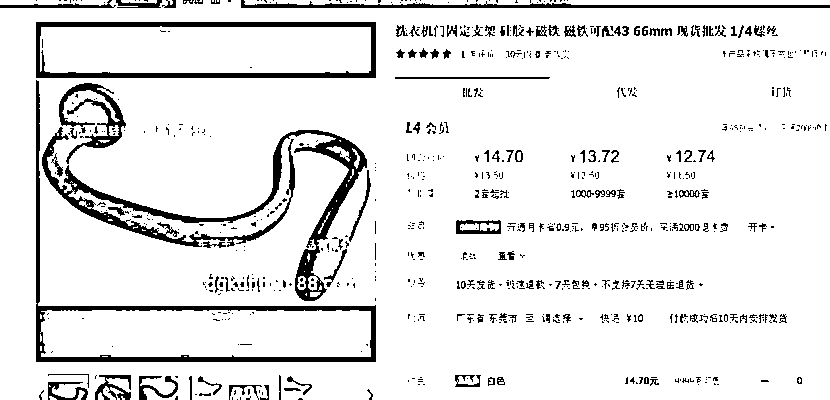
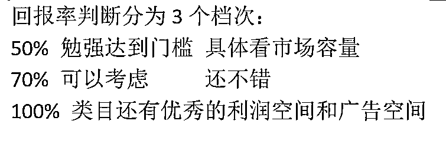
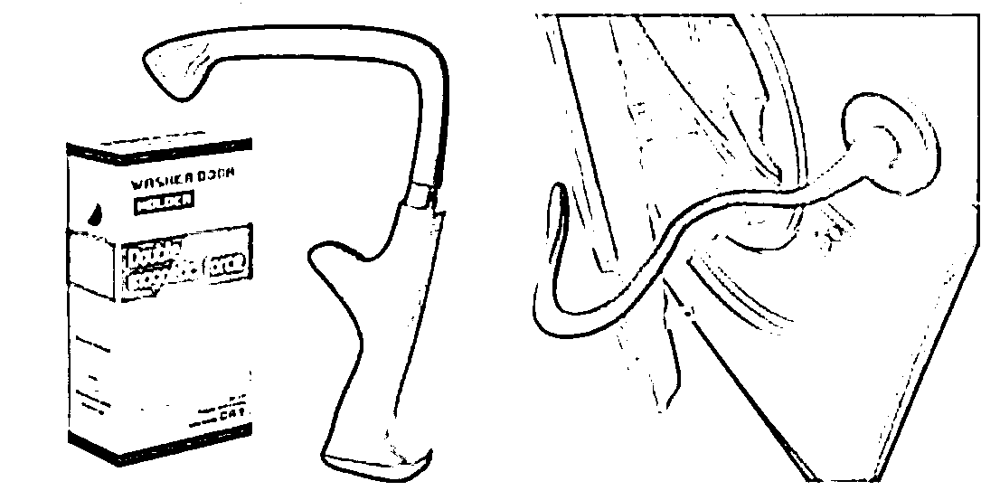
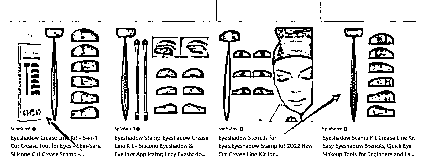
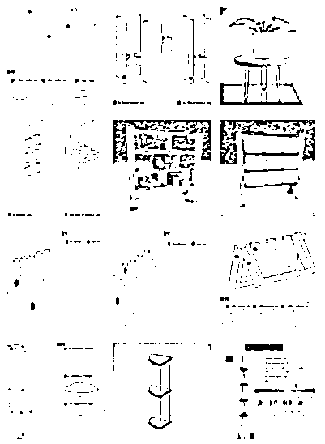

# (精华帖)(123赞)亚马逊选品、运营的常见问题详解，探讨如何突破天花板实现极致人效的自动化

作者：  张子卿

日期：2022-05-17

 

 

现在还能做亚马逊吗？

我的答案是：依然可以。

大家好，我是张子卿，97 年，在 B2B 的跨境电商行业摸爬滚打了 2 年后，在 21 年中旬选择了 B2C 亚马逊平台蓝海选品销售这个赛道，并开始创业。

在一年多时间通过对蓝海赛道进行产品研发设计，以消费者真实需求为导向，在亚马逊美国站销售 GMV 在 1000 W 以上，毛利约 10 多个点。

下面是我们在亚马逊的创业过程遇到的问题和对应的解决方案。主要分享自己创业的一些道与术。此文为精简版，原文细节 1 万多字可在文末查看。

希望通过这篇分享，解决大家对是否能做亚马逊以及如何做亚马逊这两个问题。让新入局和打算了解跨境业务的朋友有一个全局的了解。

开始之前大家最好有个预期：亚马逊这门生意终局看的是投资回报率和链接资产，亚马逊创业的核心优势在于可低成本低门槛的去多试错** **且可借势。

这里的核心的借势还是在于选品，依靠中国制造丰富快速的供应链对产品去做独特的设计和改进。

**—01—**

如何能解决选品难的核心问题** **

 

 

我向来喜欢把复杂的事情拆解成几个简单的步骤去思考。

任何公司都需要牢牢把握选品的能力，这是做亚马逊的核心。选品在我看来其实可以分为两个方面：一是选赛道，二是产品的迭代优化。

一、选赛道** **

对于选赛道，我的核心思想就是，利用可获取的数据背后所代表的信息。根据下面 3 个数据形成核心原则，再进行筛选。

关键词=赛道

关键词搜索量=市场容量

市场容量和关键词下的市场竞争对手情况之比=赛道够不够蓝海

结合上面 3 个思想，我使用的是数据软件和爬虫并行解决选赛道的问题。

具体方法表现为，先通过对海量关键词进行粗排序解决选赛道中做什么蓝海市场的问题（通过数据排序），再解决进一步通过详细调研进行精排序从而解决选赛道的问题（依靠人工和相应的软件）。

看到这里你可能有点懵，在迭代优化我会举个例子，从选品到整体优化思路上可能会更加清晰。

二、产品迭代优化** **

 

 

选品在我看来分为选赛道和产品迭代更新。

在解决完选赛道的问题后，还需要对进行产品持续性的迭代更新优化。

本质上我非常鼓励所有跨境的卖家去走这条路：从研究产品**——**到研究用户**——**再到研究真实世界的需求。

关于迭代优化，我分享几种常用的方法。

首先是确定定价区间，计算利润范围，以及给采购预算；

其次就是研究用户和用户需求，决定做哪个用户群体，是高客单价走利润还是低客单价走量。

确定好采购预算后，在预算区间内尽可能满足以下几点迭代：

1.成本优化  材质的变更

2.外观优化  颜色  包装的改进——本质在于主图  在于点击率影响的广告权重3.设计理念的传递到链接的文案优化——产品的设计可以结合运营端讲故事

4.降维

5.跨维

 

 

6.产品研发设计

举一个直观的例子覆盖以上所有方法：

关于选品：** **

washer door prop 是一款家用洗衣机支撑架，在当初火热的时候最高有近 7 万的 H10 搜索量。

在蓝海选赛道的工作结束后，先判断产品的 ROI 。如果满足需求，就到了研究用户和需求进行迭代和优化的时候。

首先计算成本，预估出采购价格。

 

 

 

在半年前这款产品刚刚兴起的时候，最好的大概 300个  评论不到，月搜索量在 1 万以上，利润空间还是比较充足的，现在的话就比较内卷了，因为整个产品的搜索容量在持续降低。

这也涉及到另外一点，无论你多么看好一个新兴的赛道，要先小批量测款后再合理备货。如果你在 7 万搜索量的时候备了 5000 套过去，那真的会很惨。

 

 

关于这个问题，我后面会说到产品的 leading time，在资金有限的情况下备货可以小而多次。降低风险，且大幅增加了资金周转速度，还记得上文说过亚马逊是一个看单位时间投资回报率的生意。

就以现在的 11.99 美金的售价去考虑先，这里可以直接使用 helium 的利润计算功能。

假设走空运的话：

FBA US$3.77

佣金 US$1.80

运费 US$1.81

成本 US$2.4

 

 

ROI就是：

（11.99-3.77-1.8-1.81-2.4）/（2.4+1.81）=52.4%

判断 ROI 决定产品是否继续，对应的标准就是。

显然，50% 的 ROI 仅仅只是勉强能做而已。何况头部的格局已经形成搜索量也下来了，机会不大了。

 

 

到这一步，就可以判断这款产品是否要继续进行下去。

Yes or No？当然对于现在来说就是 No。

可是在半年之前还是比较有机会的类目，假设结果是 Yes，接着往下演示。这里只是走一个全过程，方便理解如何使用我的选品思想和优化思路。

研究用户和需求进行迭代和优化：

 

 

这款产品主要解决了很多公寓式住宅的滚筒洗衣机门开关的问题。

对于传统的公寓式住宅，滚筒式洗衣机往往在进门的过道，如果洗完衣服后想要晒干洗衣机内部避免潮湿和细菌滋长，就需要长时间打开洗衣机门。这极大地影响了正常的走动，如果家里还有孩子和宠物的话也有对应的风险。

用户群体：住在公寓里使用滚筒式洗衣机的人。

需求：滚筒洗衣机使用后长时间打开，且不影响狭窄过道的正常行走。

竞争对手的销量和差评研究：

这里使用 jungle scout 软件研究销量，使用人工筛选研究差评区。

差评研究：

这块没什么好说的以具体的实际情况为准，研究竞争对手哪些点做的不好，在预算足够的情况下加以改进。

 

 

以 helium 10 来演示这部分：

就是找出所有与这个词相关连的精准出单词后，在进行发散和研究需求。

这个过程中，比如搜索量最高的词、最高的带颜色的长尾词、新的精准词都会被发现。

你就可以深层次的了解到，什么颜色、什么款式的长尾词搜索量相对最高，搜索量数据也代表着用户最真实的喜好和需求。

 

 

 

 

这里有两个词引起了我的注意

front load washer door prop

前置式洗衣机门支柱

washer door prop buddy magnetic man洗衣机门道具伙伴磁铁人

而且我发现 washer door prop 这个词往往能和洗衣机清洁 washer machine cleaner 有关。

产品的迭代优化：** **

**1. **优先考虑是否可以降低成本

因为除非走海运否则产品的预算已经严重不够。稍微一点波澜ROI 50%都达不到的产品风险过高。

采购成本，在保证质量的前提下找到价格最合适的卖家；

运输成本，海运方向的思考；

 

 

材质方面，是否有更合适廉价的材质同样可以满足这类需求。

（在写此文时已经有人做了类似的变换）

额外溢价方向，是否可以修改产品本身做出溢价更高的空间。

在经过一系列沟通后，得知这款产品底部的磁铁如果还需要变得更加强力和尺寸增加，成本还需要增加 2 元。在已经聊遍了市面所有厂家之后，在硅胶材质上进一步降低成本这条路已经不可能了。

如果走海运确实可以降低一部分，但基本和增加的磁铁成本抵消。

这时候就需要去思考，是否可以使用其他材质满足同样的需求，以此节省成本达到理想条件的 ROI 。

同时可以思考的就是，是否可以进一步满足潜在的消费者需求，做出高溢价的产品。也就是说实际定价可以高出** 11.99$ **的区间段。

 

 

**2. **外观优化角度思考

其实我的所有选品和迭代思路都是以数据为基本面的导向。

那么为什么要优化外观？做一个普通的棕盒不行吗？

这里提前把运营端思考的结果拿过来。核心点就在于对于亚马逊平台，产品的点击率非常重要。它直接影响了后续的广告组权重，直接影响你的广告支出。

在电商领域一张好点击率的主图，直接可以让一条链接逆天改命。

如何做到在众多商品中一眼就想让客户点击？

可以从以下几点考虑：

产品颜色的改变

外包装的改进

配件增加

总之需要结合实际的拍摄主图难度去进行深入的思考，最好达到一眼让你的产品脱颖而出的效果。

甚至可以引入测试投票，使用 PICKFU 网站可以完成。

对于这款产品而言，这方面收效甚微。因为这个类目直接是上的应用场景图而不是白底图。

 

 

改变颜色、增加配件以及优化外包装，来达到提高点击率的目的，都是建立在白底图的基础上。

但如果是这种类目的话，上面的方法就会非常起效了。

这两张图的点击率可能差 100%。

 

 

**3. **从理念的传递到链接的文案优化**——**产品的设计可以结合运营端讲故事

数据导向就是最终你的产品转化率。

这部分简单来说就是，在产品设计之初，如果抱有某种理念。可以在后续的链接文案和详情页上事半功倍。

比如你卖一款化妆品，设计之初就是为身上有疤痕的女士提供纯天然高质量的遮瑕产品。那么文案上可以大做文章了。

对于我们这款产品而言，可以从优化生活细节，保护孩子和宠物，等等角度去考虑。但是影响并不大，也不值得去重新根据新的理念去设计。因为这是实用类的产品，看的是实用性和使用价值，且不管是使用硅胶还是塑料开模成本都比较高。

降维

跨维

这里把降维和跨维一起总结，降维也就是把高维度的东西拉下来做，跨维就是把其他维度的产品拉到一个新的类目去解决新需求。从而达到做出额外溢价或者降低成本的目的。

举个例子，还记得我们之前研究关键词时候 washer door prop 常常和 washer machine cleaner 一起出现吗？

这就给我们做出新的产品溢价带来了契机。

 

 

washer door prop 洗衣机支撑架

washer machine cleaner 洗衣机清洁

洗衣机清洁这个词在调研后常表现为洗衣机片。

发散一下思维，那么常常使用 washer door prop 的人是不是也使用 washer machine cleaner 呢？

是否可以结合成本去考虑做一个组合类的产品，这种思路就是所谓的降维和跨维。

washer machine cleaner

一个拥有原本洗衣机支撑架 5-10 倍搜索量的词。

 

 

是否可以考虑将两者做一个 combo ，来达到更高的溢价。

结合产品的成本考虑，看来似乎是可行的一条路。

**4. **产品的研发设计

 

 

这部分就包括开模具、画图，以及进一步改进产品功能更加满足消费者需求的相关问题。

比如很多大型的木制品都面临着安装比较繁琐困难的问题，改设计为不需要螺丝安装的卯榫设计，也许有新的出路。

以上就是对常用几种术的探讨和应用举例。

 

 

关于运营端需要关注的数据细节和数据陷阱：

**—02—**

运营端除日常操作之外还需要尤为关注哪些数据** **

关于运营端，这里简单但着重地说几个关键的数据指标和表相的陷阱。

如果以计算机算法的角度思考运营端的数据的话，那么在运营端，对于一个产品的最核心的关键数据就是：点击率、转化率、核心关键词排名、星级评分以及整个项目单位时间的 ROI 。

下面展开来说说：

一、点击率**——**一个产品可影响的最核心的指标** **

点击率排在第一位的原因在于产品的点击率直接影响了广告组的权重，影响你的广告出价。点击率高的产品，在出价上可能会相差 100%。1 美金出到 2 美金的位置是非常常见的现象。

影响点击率的几个核心因素：

主图

价格

标题

星级

 

 

**PS. **广告的核心权重在于点击，点击的本质在于产品选品后端的迭代端和主图。点击率是可以人为大幅度进行调整优化影响的数据，也称之为可操作数据。比如一张优秀主图可以直接拉升 50% 的点击率。

二、转化率**——**一个巨大的数据陷阱** **

市面上无数的帖子和回复都提到转化率是一个产品及其重要的数据指标，这本身其实并没有错。

转化率为什么在我眼里是一个陷阱，问题就在于它基本是属于不可操作数据。

想想转化率和哪些因素有关？

价格

五点文案（产品卖点）

图片

A+页面

QA

评论区

AZ/BS标签

.....

你会发现如果你按照一个正常的流程去做每一款产品，比如认真调研，开发产品卖点、参考对比，写出本土化的文案，找相同的团队去拍摄图片和视频，等等诸多操作。

转化率其实拼的是内功、产品开发设计、文案、图片、视频、QA。

 

 

核心点：影响关键词排名的核心权重就在于链接单位时间的对应关键词下的销

售额即淘系的坑产

在产品上架之后，转化率是几乎无法去操控的。而在产品上架之前，所有的这些工作基本已经形成了固定的流程，也无法大幅度变更。

所以就导致，在产品上架开售后，除了测评和降价，运营几乎没有手段去影响转化率的数据。

归根到底，转化率体现的是做产品过程中流程制度的优越性。在上架后，不需要过度的去每天关注，因为可以做的事情很少。

三、关键词的核心排名** **

其他任何表象级的影响因素：

标签

转化率

评论

星级

历史数据等等

**...**

均为间接影响销售额的数据。

这里必须要是对应关键词下的销售额，站外和折扣都不计入其中。

 

 

四、如何使用优化**leadtime**去解决现金流不充足而项目过多的问题，同时降低单项目备货失败的风险？** **

——以 leadtime 数据为导向从投资的角度思考亚马逊这门生意：

运营端还需要特别关注并对整个项目的** ROI **和风险进行评估，对所需资源量和回报率进行合理预估。这种能力的流程化对将来能否突破商业天花板尤为重要。

这里重点提及一点，那就是对全年整个项目的资金投入 ROI 进行优化和关注。

这里就需要提到 leadtime 这个核心指标。

Leadtime 也就是从产品生产到发货上架的这段时间，对整个大框架项目的 ROI 下是非常重要的影响数据，且是可控数据。

这里举一个不是非常准确例子说明这个思想：

假如一款木制品，生产时间 30 天，运输时间 25 天，上架时间 5 天。

那么它的 leadtime 就是 60 天。

假设他的售价是 39.99 美金，重量 1.5kg，产品成本 40 元，佣金 15%，FBA 配送费 5.4 美金。

那么来算一笔账：

假设海运 15/kg 产品的运费就需要 22.5 元。

 

 

在不考虑广告等其他投入的情况下：

产品的利润（39.9*0.85*6.3-40-5.4*6.3-22.5）=117.1产品的运费和单价为（22.5+40）=62.5元

理想下的ROI=117.1/62.5=187%

假设产品月销 1000 套，那么实际需要投入的资金远远不止 1000*62.5 元。

因为 leadtime 长达 60 天的问题，一个月的销售就可能需要三个月的资金投入来保证不断货。

往往你投入的是 3 个月的资金，而实际在售卖和计算的是一个月库存资金的 ROI 。所以在 60 天 leadtime 的前提下实际的** ROI **往往只能达到理想状况下** 187% **的三分之一。而且在日常运营过程中，销量是增长或者动态的，实际的支出往往比理想状况还多。

这还没有算上亚马逊压的回款，等其他因素。

如果通过增加产品的单价，选择出货更快的供应商，选择更快的物流，leadtime 缩短到了 40 天的话，哪怕单价上升 10 块钱，最后你的实际资金ROI也是远大于之前。

且节省下来的空置资金可以投入到新项目的进展中。这就是 leadtime 数据的核心思想，优化 leadtime 哪怕牺牲部分利润，因为你可以用更少的利润来赚更多的钱。

 

 

在产品上架后，不断降低** leadtime **其实就是另一种财务角度的优化。

小结：

运营端的工作切误陷入表象，而忽略的深层次的内核。比如转化率，比如关键词排名，建议结合自己公司的实际情况进行更加深入的思考和针对性流程的优化。

同时在亚马逊初创阶段，由于资金是有限的而可以做的项目较多。**Leadtime**的优化对最终相同投入下，实际资本的回报率影响巨大。甚至往往可以牺牲利润来换取高速周转。

到这里只要不断尝试，不断迭代优化，小团队的亚马逊模式就运作起来了。

但任何商业模式我们都希望可以做到和工厂流水线生产一样的自动化，这是做业务的终极追求之一。

针对亚马逊业务而言，如果想要突破认知天花板和选品上限问题的核心点在于：

自研发选品软件解决选品产能问题

通过流程化制度和体系化的知识，尝试去培养跨境电商领域的产品经理解决产

品落地问题

文案和图片的专业外包（靠带有视觉审美的运营去统筹和提出专业的需求** **）

成熟期产品使用人工智能调节广告实现的后端运营全自动化（从回复追评** **到广告中后期** **均可以实现人工智能）

以上是我关于亚马逊情况的一些分享，希望对大家有帮助。

此外我对如何实现跨境亚马逊业务全自动化的领域做了一些探索，更多细节均写在生财这篇长文章节里：

 

 

https://articles.zsxq.com/id_jex6uu2zeu7o.html评论区：

亦仁 : 可能是生财有术搜索量最大的一个词：选品。

背后有几个逻辑，也和大家分享下：

选择大于努力，选品大于运营

起步阶段，选品而不是造品

电商是平台流量变现的最优方式之一

选品就是选赛道，赛道决定长期的利润率

Hanson不帅 : 兄弟，短短一年时间有此番总结令人倾佩。言简意赅，关于选品的思路和方法非常赞同，操作手法部分一致。

leadtime这个概念，一语点醒梦中人，亚马逊各项费用暴增，内卷严重的当下，缩短leadtime确实是一种降低风险提高利润的有效，之前一味的追求利润，运营端老是发最便宜的海运（周期40-60天），看起来头层费用减少少了很多，实则拉长了周期，增加了死库的风险。只见钱进去不见钱出来。

明知FBA有毒，我已无法自拔，亚马逊重资产模式，现在进入这个赛道还是要慎重。

张子卿 : 是的  一眼就看到了这个非常重要的指标

厉害 

阿晨 : 留个联系方式老板

黎昕 : 我觉得产品排名也很重要甚至比关键词排名还重要。

Hanson不帅 : 个人拙见：关键词排名优先，有了关键词排名才有产品排名，关键词调研优先！

跨境电商fantas* : 好厉害，第一次听见这样的选品思路，选品都已经到自动化了😂😂😂

作为亚马逊发货的服务商，回应下题主前面所说的，还能做亚马逊吗？我的答案也是可以的，因为这个市场总有人做的很好，关键思路还是在于选品！

毕竟在跨境有句老话说得好：选品70%，运营30%

今年刚和朋友成立了一家欧美线货代，海运到美国是我这边的优势，朋友之前在货代这行沉淀多年，有需要的圈友可以联系下，坐标深圳[呲牙]

林文勇 : 这回复里面埋词了

 

 
