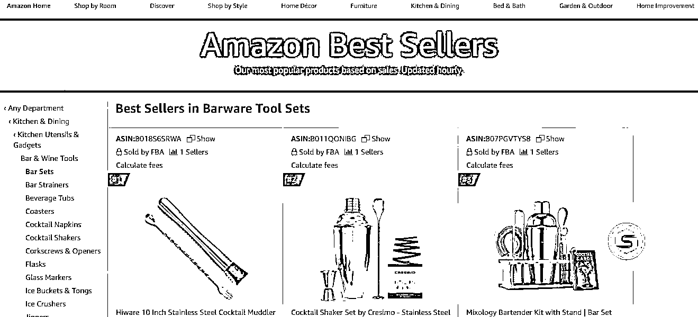
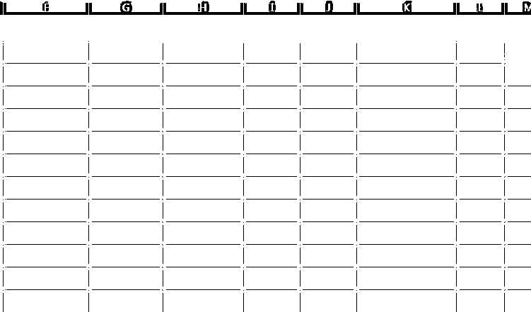
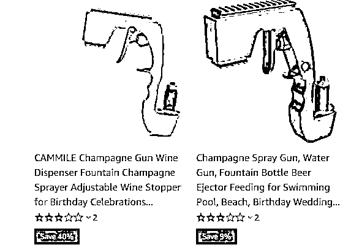
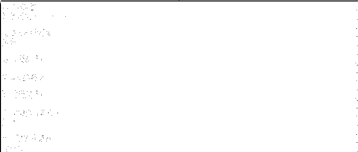

# (精华帖)(99赞)手把手教你如何选出月入上万的单品

作者： Lissa Tam

日期：2021-09-24

大家好，这里是 Lissa，今天来填坑：我的选品方法论。

4月份开始创业，折腾了1个月的店铺，1个月进行选品，产品上架至今刚好2个月多一点，经历了二次售空缺货后，目前趋于稳定，根据过去一个月的计算，该产品目前达到月利润1万以上。

本文主要和大家分享一下，这样的产品我是怎么选出来的，对于像我这样小资金、无供应链资源的卖家来说，如何选出适合自己的产品。

目前市面上做产品的方法，主要是三个大方向：**1.**现货；**2.**产品优化；**3.**产品创新。

A. 现货的玩法，销售属性公司玩的多。有资本和实力的公司，一般直接和工厂合作包销；差一点的可以拿到特定销售权；最后则是直接1688拿货上架卖，一般这种情况存在于产品还处于极度或相对蓝海情况下，否则则会陷入“选品一时爽，运营火葬场”的死亡境地，一些季节性产品或者突如其来的爆款，可以用这种方式销售，比如前段时间爆火的灭鼠先锋系列产品，以及去年很火的小矮人。这部分我的朋友 @Bryce 惠东玩得比较六，推荐他在生财的轻享给你  《以亚马逊电商为例，聊聊从公模到私模的整个过程》https://t.zsxq.com/bUJuRzVB. 产品优化有两个方向，第一，现货组合；第二，模具小改，如改颜色，模具加东西等等。现货组合相对来说好弄一点，相当于一个产品中介和筛选官的身份，选出来的产品有自己的独特性，服务给某一特定人群，因而运营的时候竞争压力没有现货那么大。模具小改也差不多，但需要有一定的量才行。

 

 

C. 产品创新旨在自己设计产品、开模，相对有些复杂，产品为主的公司一般倾向于这种玩法，需要对产品材料、产品结构设计、消费市场、用户需求、用户体验等有一定的了解。这种产品前期调研及设计比较费时，打样及研发费用高，但后期产品出来后，溢价能力相对更高。原材料木制品、金属、纺织品等模具及打样费用相对便宜，制作周期也短一些，适合练手。但整体时效仍然很长，以木制品举例，打样1-2周，后续优化及确定样品1周，货期6周，这里就去到了至少8周。再加上如果是比较重的产品，只能走海运，海上又4周，3个月过去了，产品刚上架，市场或许早就不是那个市场。如果研发能力不强，创新程度不够厉害的话，可能为时晚矣。这种玩法需要深入用户调查，个人觉得适合副业来玩，不适合刚开始的创业公司。

根据我自身情况，我开局时选择的是产品组合玩法。很费事，但是适合低成本快速测试，跑通流程。

我的选品整个流程为：产品初选-市场调研-用户需求分析-确定产品方案

一、 产品初选

选品上面，有三句话，我奉为圭臬：

1.产品要做超价值交付，至少超出30%以上@seven

2.产品看起来差不多的话，根本显示不出来产品的差异化@Zev@樊登读书3.啥是蓝海市场？比你差的，就是蓝海@盗坤

在初选市场的时候，我会选择：关键词搜索量**>4000**，搜索量**/**搜索结果**>4**，市场集中度**<50%**（非垄断市场），搜索词下有评价数少于**80**能上首页的类目，平均月销量**200**以上，毛利润最好能做到**40%**，成本利润率（净利润**/**货及物流）最好有**80%**以上，并且这个类目有机会能做出一些差异化，类目链接质量相对我做的差的（文案、图片）。也就是说：有机会做优化、市场容量够大、新品有机会获得曝光、竞争对手比我差。

 

 

初选市场可以用工具进行筛选，比如卖家精灵、数据魔方等，都可以用。下图为卖家精灵的筛选页面。

除开工具外，可以通过BSR、NEW RELEASE 榜单，（amz123.com，amz520.com，两个亚马逊导航网站可以直接找到榜单）以及整理出来的可参考卖家店铺，进行选品。还可以寻找自己感兴趣的品类，@阿发  的这篇《9大选品方法 + 4种选择垂直细分领域的技巧，一次解决两个独立站最让人头疼的问题》文章，里面有介绍如何整理自己的兴趣类目

https://wx.zsxq.com/dweb2/index/topic_detail/185228511284552筛选出来后，对利润进行分析，遇到还不错的产品和店铺，及时整理出来，放入自己的选品库中。

举个例子，大家知道我爱喝酒，那么酒具类的产品，我肯定是会找来分析一波了。比如下方鸡尾酒调酒产品，找到关键词后，将数据整理出来，放入我的选品数据库里，并对产品进行利润分析。通过1688，找到产品工厂报价及重量，进行利润计算。

亚马逊的利润公式为：利润=售价-产品成本-头程（海陆空）-FBA物流配送费-亚马逊佣金（一般15%个点）-退货成本-推广成本（测评+广告）。FBA物流配送费和亚马逊佣金是固定的，产品成本和头程略有浮动，最大浮动部分则是退货成本和推广成本。根据产品类目不同，我设定的退货率为2%，总推广成本为10%。

那按照我的利润表格来看，抛开产品组合方式，这个产品利润偏低，就不太适合我现阶段做。

（备注：图片主要用于表头参考，数据有出入，仅作为举例）

 

 

 

二、市场调研

市场调研中，我着重关注于产品类型、市场容量、对应产品类型的利润率、市场竞争强度、产品消费趋势。它与我“每个月利润、销量、前期推广成本花费、产品打上去的难易程度、产品未来发展趋势”直接挂钩。

对应的，我会着重关注几个数据：市场容量及趋势、产品类型占比、市场竞争强度、供应链稳定程度、消费需求及场景比例、用户痛点占比、以及现有产品差评点比例。

（一）市场容量及趋势

这个数据主要用于判断市场大小以及发展趋势，并分析产品的淡旺季，判断切入时间。如果容量不符合标准，或者整个行业态势呈下滑状态，那么如果从长期角度考虑，这个品类就不会做。

那么首先，我们先看市场趋势，这里我会用到2个工具：Google trends（https://trends.google.com/）,  卖家精灵（https://www.sellersprite.com/）。

Google trends主要用于看用户对该产品全网的搜索关注，卖家精灵则针对亚马逊的市场，观察用户对关键词的搜索变化量。

还是以调酒用具为例，首先，确定产品的核心关键词为：Cocktail Shaker，用谷歌趋势，抓取美国最近三年的趋势，可以看到，近三年来，这个品类用户的关注度是持续走高的。（做哪个站点，抓哪个国家数据，全文以美国站为例）

 

 

用卖家精灵工具，查询关键词的月搜索趋势，可以发现该产品搜索量可观，搜索趋势也是往上走的。

看完趋势后，再分析市场容量。

找到该产品BSR榜单，利用卖家精灵抓取整个榜单数据，能够看到其30天销量及销售额。当然，也可以用垂直关键词搜索，抓取前3-5页数据，去重后，得到一份产品表格，进行分析。

抓下来的数据进行筛选，把非对应产品删除后，可以得到精准产品下当月销量。再将谷歌趋势的数据下载下来，根据趋势变动，粗略计算出该品类一年的市场容量。为了数据精准性，我一般也会用 amazon business analysis，将关键词近12个月的排名整理出来，对比来分析。ABA和 

 

Google trends 不同的地方在于，一个是购买平台的需求，一个是"how to"搜索平台的需求。因而数据在某些程度上会有出入。那么我会二者结合一起观察。

在这些查询销量的平台中，Helium 10和卖家精灵我觉得相对准确度高，JS的话，相对而言就相差略大。

当然，这些数据也是用于看个大概而已。若是选中了一个工具，后续的销量，比如每个月下载数据更新市场容量，观察市场变化的时候，也要保持用同一个工具，确保相对数据的准确性。

最终能得到下列图表（注：表格仅为参考，内部数据并非对应产品精准数据）

（二）产品类型占比

如果只是粗略对市场进行分析，那么可以不进入产品向的分析。根据上述拉出来的数据， 通过简单的**excel**数据处理，可以看到品牌销量占比、评论数与销量的关系、**TOP10-****TOP20-TOP50-TOP100 **的销量占比，大致看到市场竞争情况，分析最低推广资金投入。

比如要做到日销80的量，位置至少要在BSR80，评论数至少要做到200。那么这个时候刷单金额大概能算出来。此外，广告的花费，第三方数据可以看到BID出价，转化率，计算出单个订单广告花费，得出广告占比。整个推广资金心里就会有数，这个品类，资金和资源能不能打起来，就有初步评判方向。

判断可做，或者未能得出明显结论，则可以进入深度的市场分析。这个时候主要站在产品和消费者的角度上进行调研，看是否有机会找到产品切入方向。

 

 

到了这一步，首先，我们会先通过Google搜索文章，查看用户在购买时会问的问题，以及blog如何分析产品，会着重关注哪些点。将这些内容参数提取出来，  就能得出一个产品组成框架。

比如，air fryer大家关注的点有：容量、内胆、操作方式、加热方式、性能、噪音、材质、外观、配件等等。

那么在做产品分析的时候，这些参数就是我们的调研方向。

最开始我们下载下来的BSR100的表格，这个时候，我们需要针对每一个产品，调研其上述的产品参数信息。类似于下图参数，部分可以自制爬虫抓取，但是大部分信息藏在产品描述、QA中，因而还是要每条链接点进去看。将这一步做完，对这个品类能了解个60%以上了。

 

 

同样，将数据全部整理完后，进行数据分析，看哪个产品类型市场容量较大、单价分布在什么位置，哪些功能是基本配置，哪些可以作为辅助，为后续选款/产品优化  提供数据支撑。

（三）市场竞争强度

这块主要有以下几个分析点：

1.市场情况分析：市场容量、增长趋势、上架时间、Listing垄断情况2.品牌情况分析：品牌占有率、品牌垄断情况、品牌上架时间、品牌增长速度、品牌上新速度、品牌产品布局

3.参数分析：不同参数下的产品占有率，包括款式、容量、材质、性能等等。

4.价格段位分析：分析用户对各个价格段位的需求占有率，以及不同价位段产品功能参数情况5.运营难度：评论数量、对上述市场、品牌、参数情况分析汇总

我在这块主要会着重关注几个数据：

1.不同款式的售价范围，及其对应的市场容量；

2.不同评论数范围对应的日销数量；

 

 

3.产品上架时间及对应的市场容量；

4.不同款式的最早上架时间、及上架时间占比；

5.TOP20品牌的市场占有率、TOP20链接的市场占有率

这些数据对应的内容是：产品生命周期、新品上架后的机会值、最受用户接受的价格范围、用户觉得需要具备的产品功能排名、市场垄断情况。

具体这部分的分析，需要根据自己的实际情况及关注点，来选择数据进行分析，形成模板。

如果品牌或者头部链接占比过大，那就不用再搞了（这个数据，在产品类型占比分析或者初选之前可以看到）。但同样，如果真的对这个产品有信心，或者有供应链/设计资源，那么继续深入分析。

将头部品牌近几年的上架款式、上架时间、客单价情况，做一个品牌数据表格，能够清晰的看到，各个品牌的产品布局。

大概做出来的图长下面这样，有产品图片、核心功能、ASIN、售价、品牌

（四）供应链稳定程度

 

 

这块从运营的层面，主要看：产品评分、1688供货数量、相应工厂数量，作出一个大致的数据分析。

产品评分如果均在4.3分，也就是亚马逊四颗半星级以上，说明整体供应链比较成熟，对于没有太多产品经验或者是供应链资源的人来说，选择这样的品类会比较不踩雷。若是市场上大部分评分都是4颗星以内，说明产品类目不成熟，假设这玩意还卖的贼好，说明是个新需求市场，有产品研发经验的人可以入场，做产品升级，只要解决了痛点，就是行业靓仔。

举个例子：champagne gun，这个夏季爆款，之前我拿过样，用起来的时候发现真是贼难用，使用前体验贼差，但是产品很花哨，很符合夏季派对需求。3颗星评分，8月份的时候一个链接最多能卖1000+，Kitchen & Dining 排名 2000左右。如果有小号，这个产品就非常适合前期卖一波，赚笔钱撤离。50RMB采购成本，重量300g左右，FBA配送费用3.47美金，市面上的竞品售价35.99。假设我们售价29.99，假设走海运，毛利率45%，投资回报率158%。算上退货率10个点，推广10个点，也能赚25%，卖1000个是5万左右；走快递，18个点的利润，1000个是3万6。但是对于新手来说，把握不住的话，很容易变成库存。

看1688供货数量，同样也是为了看这个产品是否被垄断、是否被包销、是否有专利技术、制作的难以程度等等。被供应链掐脖子是可难受的事情。还是这个champagne gun，当时1688找的时候，仅有2家有卖的，都拿了样品，联系后发现，一家是抄的另一家，另一家抄的好像是国外的，但声称改良版，自己有专利（我没有细查）。中国工厂大多也求快、求爆品。对于这种工厂，产品细节上做不到位，体验做不到位，是比较正常的。特别是如果工厂不做限价，一旦市场卖起来，但是被供应链卡住，被同行恶性竞争的话，就很难搞。包括一些品牌方的产品，前期拿货可以卖一波，能卖起来是最好的，后期如果品牌自己同一个平台上场卖，开启市场收割模式，那么对于拿货方来说，也相对被动。

那么对我而言，前期，我更倾向于供应链相对稳定、市场相对成熟的品类，一方面市场经过了验证，只要产品有特色，就可以往长期做；另一方面，没有什么专利威胁，工厂选择性多，市场成熟，产品退货率、店铺安全等，都有一定的保障。

 

 

（五）消费需求及场景，用户痛点分析

消费需求可以参考 KANO 模型，分为5类：  基本型需求，  期望型需求，  兴奋型需求，  无差异型需求，  反向型需求。

**1. ** 基本型需求： 产品功能必须满足的用户需求。当该需求满足不充足时，用户很不满意；

当该需求充足时，对用户满意度没有多少影响，用户充其量是满意。例如社交产品的加友功能；音乐产品的听歌功能。

**2. ** 期望型需求： 用户满意度随着此类需求的满足程度而线性提升或下降。当此类型需求越得到满足则用户满意度越高，反之则用户满意度越低。例如，音乐类产品的歌曲越多越好。

**3. ** 兴奋型需求： 是一种完全出乎用户意料的属性或功能。如果提供此因素，用户会感觉惊喜，满意度大幅提升，但如果不提供此需求，用户满意度也不会随之降低。例如微信的摇一摇

**4. ** 无差异型需求： 这类需求无论满足与否，用户满意度都不会受其影响，用户对此因素并不在意。例如产品的简介

**5. ** 反向型需求： 用户没有此需求，提供后满意度适得其反。例如产品付费功能。

消费需求的数据来源是评论及QA。通过分析用户的问题及好评和差评，来提取用户需求。

一般我的提取模型为：

产品：不同类型的产品TOP3个/BSR排名TOP10（太多了分析不过来，看TOP比较有代表性）QA&好评&差评：近3个月or最近80条（一般产品3-4个月迭代一次，看最新内容，体现最新产品 version 情况）

 

 

这里多提一句，看用户的关注点这块，亚马逊在用户评价的时候，会针对不同类目，提出不同的问题让用户打分。同时，对于用户的评论，会做词频整理。那么这一块，就是我们可以着重关注的点，对其进行整理分类，然后再对照着提炼QA和评论，分析用户关注点和需求。

对数据分析后，再将QA及review内容提炼；其中差评还可以用于产品研发方向的支撑。

分析完需求后，消费场景也是利用QA及Review数据，通过词频分析，提取场景数据及排名，得到用户使用场景需求。

三、用户需求分析

对上述分析完后，最终可以获得一份用户调研表：包含使用场景（场景+时间）、用户人群（人群+使用目的）、客户需求。

 

 

 

这个调研表，就是我们产品开发所依据的表格。

清楚的知道自己产品背后所对应的细分用户群体是怎样的一群人，针对这群用户，再具体研发或者改良产品。

举个例子，我做组合性产品，那么我首先需要明白这群人他的需求是什么，他是什么样的一群人，他买这个产品用来干什么，他除了买这个产品，还需要其他什么前后端的产品，他求不求方便性，求不求产品质感，他们最倾向的价格段位是多少，对应价格段的产品有哪些功能。这类产品的基础功能是什么、升级功能有哪些。在词频分析中，他们最常提及、最喜爱的款式有哪些，最多的场景是什么，需要配备什么功能或者产品。

把这些通通整理好，辅以文字形式，通过数据，展示出来。

四、确定产品方案

 

 

根据上面的用户需求分析，开始判断，这个品类是否有机会。具体是什么价位段、什么产品功能方向，他对应的市场容量、销售额及利润是多少，是否符合预期。

基础用户，给他们基础功能，匹配低价段的市容量最高的价格；对要求更高的用户，给他们配呼唤度更高的升级功能，或者上下端的产品。

最后，把“产品组成方案-价格-利润分析-预期销量-预期营收-对应1688初选”整理出来。

出合适的产品方案后，可能会有几种选择。比如颜色组合等等。当心里不确定的时候，做问卷调查。

Google设计问卷表格，然后投放fb广告，让用户进行填写，送对方礼品卡等方式，收集信息。

当然，有更省事的方法，上fiverr.com，有一帮歪果仁，能够帮你做这个事情。200份问卷的价格大约再25美金左右。

当你想不明白猜不透的时候，就想办法用数据解答问题。

但最重要的是，不要纠结。做产品本身就是不确定性的，上述工作，是为了做精品，砸钱进去之前，把不确定性变得更小一点。毕竟做亚马逊是个压资金的活儿，确定了一个品类，首批货少则200，多则2000。时间其实更为重要。“犹豫徘徊，等于白来”。

确定好产品方案，就可以再找工厂，把具体的产品落地，创建链接，准备发货了。

什么？没有店铺？关于店铺，可以看这篇文章，

https://wx.zsxq.com/dweb2/index/topic_detail/815528858411152  虽然是去年写的，但仍旧适用。

最重要得，产品上架之前，做好项目投资回报表，产品推广方案。做到“知道竞争对手是谁、什么时候需要达成什么样的销售目标、什么时候可以盈亏平衡、什么时候可以回本”。

然后，按部就班去做就好了，计划=方向=具体执行时的灵活调整指南

好了，整个选品策略写完了。

 

 

看到这里后，是不是觉得“我就搞这么个东西，为什么复杂到这种鬼程度？？”是的，的确很多步骤让事情变得复杂，但是相信我，当你把这套做完，你会非常了解这个品类，特别是在产品落地的时候，和供应商扯七扯八，又能积累到一波资源，对这个类目也有更深刻的理解。

整个流程是为了增加“确定性”，降低“风险概率”，做到“心中有数”。如果你是一名跨境新人，你需要这波流程，来增加你的跨境初体验成功率。如果你做垂直类目，你更需要这波流程，提高对市场的熟悉度。

如果是做铺货，则测款很重要，那么上述流程，很多部分能简化掉。铺货需要概率，增加产品数量，从而提高成功率。那么这波选品流程，主要用于提高成功率，但最终还是需要多款产品，需要多选。不断的看市场，在产品初选步骤和用户需求分析部分下功夫，其他的竞争性分析部分，拉数据，靠经验快速分析。

因为我的创业投入相对小，在最初的产品上，我每一款都细致的做了分析，然后确定方案。即便如此，因为最开始的不成熟，包括今年的市场因素，我的产品成功率也只有20%。活下来的一款产品，我把它做到了Best Seller TOP1, Most Wishes TOP1, Gift TOP1。当然，主要是这个类目相对小，利润虽然没多少，但是正反馈让我坚持了下来。顺着这个产品，我继续做垂直产品线开发，做好高低价位的防护。

具体的做法，我有一些复盘，发在我自己的星球、朋友圈以及生财的 #挑战2021收入翻倍#作业中，里面涵盖了我做这个产品经历的“供应链”、“推广”、“品类”“团队”方面的种种困难和思考。如果你感兴趣，可以在生财的作业里看到我的分享。10月，我将把《我是如何从0选出并打造1个月入1万的产品的（运营篇）》（白帽玩法）整理出来，分享给大家。

希望这篇文章对你有帮助，如果你有一些建议，欢迎在评论区留言，我们一起探讨。

如果觉得看得不尽兴，这里还有一些我曾经写过的其他跨境电商相关的精华文章，分享给你：

《我是如何毕业两年晋升为跨境电商大厂经理的》

https://wx.zsxq.com/dweb2/index/topic_detail/414815521552858《一文搞定亚马逊开店卖货（店铺注册/品牌备案/卖货发货/养号）》

https://wx.zsxq.com/dweb2/index/topic_detail/815528858411152 

 

《10人团队做亚马逊年营收7000w的方法论》

https://wx.zsxq.com/dweb2/index/topic_detail/241141458255151《我是怎么不靠广告，3个月时间在亚马逊把一个产品做到100W销售额的？》https://t.zsxq.com/u7AIAQB

《疫情下，跨境电商还有机会入局吗？》

https://wx.zsxq.com/dweb2/index/topic_detail/118851151558182《跨境电商创业全流程分享》

https://t.zsxq.com/jy7AMfE

感谢阅读，我是Lissa，混在跨境圈的音乐区up主，一个专注搞钱的深圳女孩 ;)————我是分割线————

最后来个小尾巴，和大家分享下创业的感受，还希望大家别笑话我。

其实这篇文章写了很久了，  一直没出完整篇，一来是测试周期不够，二来是成功有概率问题在。至今日，通过几次测试，有了一些小成果，确定了模型没啥问题，才和大家分享。之前在问涛哥栏目里面，和涛哥提及我的创业之惑，我说我好困扰，创业前期的能效太低了，我都不知道该坚持还是该去上班，我觉得我需要一个团队，但我找不到合适的人，也怕招来人没有事情给他们干，我模式跑不通，我人养不起。@杨涛  涛哥当时给我关于流量和卖货的提点，至今每每想起，都能让我更清醒更踏实。当然，还有关于团队的建议：伙伴的意义，很多时候不仅是业务上的，还是精神上的，走得不孤单，一起走更远。

的确，一个人走虽然前期很快，但真的是太累了。太多焦虑、迷茫、自我怀疑。好在坚持下来了，走着走着，感觉前路也稍微清晰了些。慢慢了解到动物园和野生环境的差异，知道决策的重要性以及所背负的压力。因为决策稳重而避了坑，也因为太过纠结而失去机会乃至成本飙升。有的时候自我安慰，说这段经历让我变得沉稳，变得更理解了什么是“工作”，什么是“做生 

 

意”，从理论派直接变为真实战家。我清晰的知道，我们所想要的，从来都是真的赢，而不是辩赢。

每个人都有想做的事，我希望我现在在做的，不仅仅是让自己能活下来，而是能够更大一点，更有意义一点。毕竟嘛，来都来了，  是吧。

在周复盘中，我一直在说想要找合伙人、投资人，甚至为此发起了“每周见一人”的活动。我觉得，是时候更加认真对待，把它提上日程了。如果你对亚马逊选品、或者亚马逊运营推广有自己的经验见解，如果你也对创业感兴趣，如果你对Lissa感兴趣，要不要一起聊聊，看看我们有没有机会，能一起走一段，一起走得更远？

最后，感谢一直支持我的@森淼，感谢@涛哥的帮助，感谢@亦仁的鼓励，感谢@白一喵的分享（要不是看到小白最近在生财的精华帖，这篇文章我大概率会一拖再拖 T T，小白乃神人也），感谢所有为我提供过帮助的朋友们。

借用最近朋友圈的一句话结尾：

生财变得好大好大，我变得好小好小

生财真棒，我也努力长大

评论区：

亦仁 : 感谢分享，已加精华。

Lissa Tam : 终于等到了😭  感谢亦仁！

轩辕 | 专注视频号 : 赞，核心方法论，数据分析、选品策略、产品趋势、开模差异化（高级玩法），这些都是可以借鉴到国内电商，不仅仅是跨境，供后面阅读的圈友参考。

wilsion亚马逊 : Lissa，我是你的粉丝😄😄。偶像，请问下各个品牌产品布局策略那张表是怎么做出来的呀，感觉不像是excel。

Lissa Tam : Excel….

跨境电商fantas* : 楼主的选品思路很有逻辑，很值得卖家学习，已收藏，借Lissa的分享 

 

给自己打个广告，我主营欧美FBA，做亚马逊圈友可以找我发货哈，价格都好说[呲牙] 苏生 : 厉害，感谢
