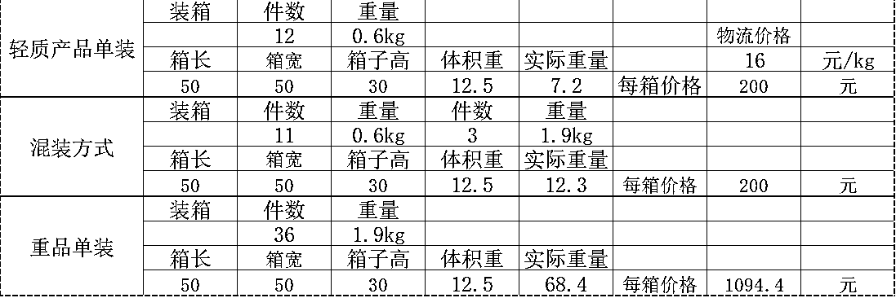
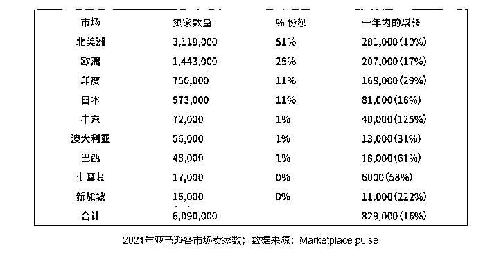

# (精华帖)(74赞)如何从细节抓利润，将亚马逊业务的利润率从 1-2% 提升至 7-10+%？

作者： thousands

日期：2022-07-05

大家好，我是 thousands，目前是一家鞋服公司的亚马逊运营团队负责人、负责团队目前年 GMV 在 7-8 千万美金。

和大多数的亚马逊卖家一样，去年最惨的的时候，我们团队的新品月度净利润率几近于零，老品从 10% 跌到 5% 以内，而后痛定思痛，决心从每个环节去优化、提高利润率，最终新品能够到达 7% 老品回到 10% 及以上。虽然我们顺利破局，但依然有很多卖家仍陷于低利润的死胡同，因此，我想给大家分享我们具体的实操方法论，希望能带来帮助。

首先先说利润的的组合公式（利润=收入-成本  ）。

先来拆解一下：

收入=“售价*销量”

成本=“商品采购成本、头程运费成本、亚马逊抽佣、亚马逊仓储费用、亚马逊配送费用、推广费用、促销折扣费用、退货费用、损毁费用”

 

 

我们就这其中的因子，做了一些细分的拆解。能对利润率做到增益的部分主要有：售价、商品采购成本、头程运费成本、仓储费用、推广费用、配送费用、退货率、损毁率。

而后我们在对能影响以上因子的部分做了一些优化，以下是我们做重点优化的部分。

一、选品：拉高定倍率、提高** 10%+**毛利空间

**1. **选择最适合自己水平的体量****

为什么说选品要选适合自己的水平的体量，因为在每个品类中都要尽可能地往头部去靠，所谓的头部是指的类目的头部，以及关键词排位的头部。

为什么这么做？

亚马逊是一个流量的平台（在流量的紧缩期会尤为明显），流量在淡季时都会

优先安排给头部，因此一旦选择了一个产品无法做到头部，就容易出现没有自

然流量，只能靠不断的付费流量推广产品，推广成本居高不下的问题产生。

只要做到头部，至少在当前的平台，你可以有跟工厂更好的议价权。

因此结合自己目前的投资预算，预估所要做细分赛道的头部需要的资金、做到类目或者细分需求下的 TOP 是比较明智的选择。

 

 

目前我们自己的产品已经抢占多类目的 TOP、同等单量下、做到 TOP 的转化率更高、广告单量占比更低（综合下来，广告花费占比能降低 2 个点左右）、同时在供应链上也享受到一些优势（例如大厂优先给我们排单、且价格更低、挤压同行等）。

**2. **选择综合实力较弱的类目

在甄选品类的时候可以多做几个备选项，做完之后进行筛查，这个时期的亚马逊已经没有绝对的蓝海之说，比你弱的就是蓝海，比你强的就是红海。

在筛选出来的类目里，分别从供应品质（评分、断货次数）、视觉品质、文案水平、推广节奏（销量历史变化曲线等）、资金能力等多维度解析竞品对手之后，再决定跟进的类目。

**3. **初创期卖家优先选择轻、小、快

作为初创的卖家，从 0-1 的过程难免会走不少弯路，选择轻小快的卖家可以尽可能节省时间成本、利用最短的时间跑通整个流程，可以更快地对自己的细节判断做验证。

**4. **差异化选品

差异化选品，是拒绝内卷非常重要的一部分。只有在产品上做到差异化，才能拥有更好的议价权。在平台电商里，差异化的产品固然会被跟进，但差异化的护城池水越深，这个利润溢价就能够保持越久。

**5. **定价

 

 

如果不是价格敏感型的产品，那么在不大幅度影响转化率的情况下去定高价格，可以一定程度地提高毛利水平。一些我们临近断货的服装产品，在临近断货时做了 5+ 美金左右的提价，但事实上对于转化率的影响微乎其微，因此在对价格不敏感的商品上，建议大家大胆卖高价。

以上流程，对整体利润率影响：**5-8%**

二、生产

**1.  **选择有供应链优势的产品

速度，开发的速度、量产的速度；

质量，能否做好质量把控；

灵活性，做到柔性，可以少量多批次的开发、测试；

工厂综合实力。我碰到不少工厂原本不错，但是因为资金链等问题导致后续变

差。

有供应链优势的产品，可以帮助我们在产品的开发过程中节省巨大的测试成本。

另外，可以规避大量的测试风险。去年年初的时候，对自己的选品和推广能力盲目自信，很多新品在第一批次的备货过程中就备了小万件的库存过去，结果因为工厂的质量问题，导致很多产品评分低、退货率高，最终的结果是产品通过放量等手段草草了结。

去年因为“大跃进”的产品净亏损就有大几十万人民币。

 

 

一方面是少亏，另一方面，优质且配合度高的工厂在起量之后，还可以通过更合理的备料方式、优化生产流程、压低生产成本，最终为了获得更多的订单，我们可以在产品成本上获得更低的价格。

**2. **多家工厂备用、形成工厂竞争内循环

优质的供应链光有一家还不够，得让工厂之间形成竞争关系。要让工厂有危机意识，这样子可以快速知道谁做的又快又好又便宜。

在这个事情上，我们的做法是定期召开某个类型的供应商会议，将我们的诉求及目前遇到的问题进行反馈，对能够响应我们诉求的供应商重点给予帮助扶持，定期淘汰劣质供应商。

以上流程，整体利润率影响：**1-2% **

三、运输

**1. **明白物流行业的淡旺季、错开价格高峰期

每年随着购物流量的波动，海运的价格也在波动。例如 prime day、黑五等活动旺季前，都会有价格的波动，因此在这些节点前，我们会卡时间节点。

例如今年的 prime day 在 6.20 日前停止入仓，美森快船的时效大概在 30 天，如果卡在  5.10 这个节点发货，价格必定会高。

 

 

市场的供需关系势必影响价格，因此如 prime day 前 90 天，我们会将原有（在途+在库）备货再增加 20 天左右，这样在价格高峰区间只需要对库存做一定的差缺补漏，通过此操作，在物流头程成本上我们至少降低了 6% 左右的成本，而这个 6% 的成本，就为我们在利润一环抠出了约 0.5% 的利润率。

**2. **多家物流做比对

一开始，我们倾向于只走一家比较稳定合作的物流合作商。后面经过几次同行的介绍，才发现物流的成本经常是高于平均线的，并且在时效上也并无优势。

后面就这个问题，我们不再依赖自己最初的判断，通过一些不同行业的卖家介绍，我们分别测试了几家的物流商，对几家物流商的时效、价格方面做了分析，并把数据给到物流商，进行沟通。

在每次发货前，我们会通过比价的方式（结合时效）进行发货，物流商因为彼此之间相互知道，因此在价格上多有让利，在这一环上，我们又最终抠出了约 0.8% 点左右的利润率。

**3. **结合免费海外仓做周转

有些季节性的产品、原发货期高峰期刚好与物流价格高峰期是对应的，因此我们就会将发货期提前。

但因为有的产品在新店铺发售，过早大量发货会导致新店铺的库销比过低，从而导致高额的仓储费用，甚至无法正常发货。

 

 

因此，我们会结合提供免费海外仓仓储（45 天内）的物流服务商进行发货，将旺季的货部分保留在海外仓，到季节的时候再安排入仓。这一点里节省的费用结合第一点来看。

**4. **处理包装（箱、袋、盒）

重货** + **抛货的混装装箱方式

大家都知道，物流头程的价格是按照体积重或者实际重量最高来计算的（其中体积重为长cm*宽cm*高cm/6000 ），因为涉及到我们自己的产品，这里不举实际的例子，这里用两个虚拟的产品 A\B 做具体的装箱对比，大家可以进行几种装箱方式的对比（为了让数据更明显，不考虑装箱规格要求）。

A 产品 0.6kg、12件/箱；B 产品1.9kg、36件/箱

同样的箱子规格中，通过轻量、重货混装的装箱方式，可以让体积重趋近于实重，从而减少头程的成本。第二种装箱方式中，虽然只减少了一件轻货，但是却可以装三件重货，大大缩减了单件发货成本。

 

 

通过这种方式，我们实现跨类目重货的成本突破，部分重货我们可以以低于同行 30% 左右的价格发出，这个让我们得以在毛利上领先竞争对手 5% 左右，因此我们可以比对手更“卷”的同时拥有更多的利润。

其次是减少非必要包装，去年年中我们通过集中盘点的方式，对已有的装箱方式进行改良，压缩非必要的箱子规格，在一些以体积重为主的箱子上，缩减了 10% 左右的头程成本，实现了净利润率 0.8% 的增长。

最后是产品包装的处理，去年亚马逊的新闻就开始报道亚马逊的配送费用也将采用体积重、或者实重的中高的一方进行收费，因为我们有一部分的产品都是抛货，了解到亚马逊是进行机器扫描的，会对长宽高最高值进行取值，因此我们对包装进行整改。

例如，原本的包装中有龙骨带，龙骨以上多余的部分被我们严格的控制，原本的包装不够紧凑，会换成更加紧凑的袋子或者盒装。

 

 

最终也缩减了部分产品，在配送费用上能减少 20% 的 FBA 配送费用，在政策实施时，相较同行同等提价的范围下，我们净利润率上涨了 2% 左右。

以上流程，整体利润率影响：**2-3% **

四、仓储

**1. **做销售计划、备货计划、减少冗余库存

针对产品做好详细的销售计划，一般来说海运产品，库存（包含在途）天数应该控制在  50 天上下，因为销量不是一成不变的，因此针对产品的推广节奏、季节、提报活动、做对应的销量预测，控制良好的库存销售天数，可以极大减少不必要的仓储费用。

 

 

通过对比类似人群及对标的竞品，做好详细的销售计划之后，我们从原本 90 天的备货量减少到 50 天，这里就至少减少了 40% 左右的仓储费用，在 Q4 季度在净利润率上提高了 1%。

**2. **结合海外仓做仓储周转

另外，因为昂贵的仓储费用，我们会将一些季节差较大的产品提前备货于海外仓，从而在不影响推广节奏的情况下，减少仓储费用。

**3. **迅速处理滞销品：放量**+**清算**+**弃置

 

 

原本在推广的过程中，我们给予运营的试错时间过长，有些产品在准备前期的备货量会比较夸张，但跑一段时间数据的反馈表明产品并不是所谓的“爆款”。这个过程中没有及时地去处理库存，导致了大量长期费用的产生。

在这之后，新链接到达一定的时间节点（1 个月左右）如果没有按照推广节奏进行，我们会进行帮带，对节奏进行把控。如果在介入之后仍无法解决滞销，会果断开始放量配合降价等处理，尽可能将冗余的库存处理掉，节省仓储费用，并尽可能回收投入的成本。

以上流程，整体利润率影响：**1-2% **

五、推广成本

**1. **结合多种站内工具，选择竞争更小的流量坑位、做低**CPA **的流量

因为我们公司几乎是不碰人工干预的，所以广告是我们极为重要的推广手段，这也是大部分的白帽玩家所用的推广方式

去年在广告 CPC 飙升的情况下，我们没有及时做好战略的调整，一昧地迷信高点击率、高转化率的位置，最终的结果是 CPA 不断的攀升，在原本的广告订单占比不变的情况下，导致总的广告花费占比上升了 3-5% 个点不等，这就直接蚕食了我们的净利润率。

后面在经过几次内部的深度研讨，开始不断尝试各种新的广告方式，更多以 CPA 为导向去考量广告。

 

 

在这段时间内，对我们已有的广告手段进行了剖析。

首先，我们常用的广告手段有：由第三方代投的 DSP 广告、站内 AMS、SP、SB、SD 广告，经过对手上不同的类目数据进行汇总。

@首先 DSP 部分的 CPA 仅在再营销及站内竞品关联位的投放较为优秀，因此我们减少了对于其他类目的及一些陌生人群的拓宽。

在DSP上的投放也逐渐由原来的试错，但可增大体量允许亏损的心态转为不赚钱便不投放。不仅如此，我们还会定期做复盘，及时根据数据反馈对预算进行及时的调整。

C是站内的 SP 广告，过往我们的 SP 广告更多是使用关键词卡首页的方式，非常暴力，出效果很明显，但后期的CPA 非常的难看。

后面我们发现利用定位的方式，在一些关键词可以达到一样的效果，并且 CPA 更佳。有这样的发现很重要的一点在于，我们几乎对所有的广告都有测试，拥有大量的数据，可以快速测算出什么样的广告类型，是在当前拥有最低的 CPA。

总结出来：更多利用定位；更多寻找竞争力较弱的长尾词，这些词虽小，但量足够大的情况下体量也很吓人。

 SB、SD 以往我们更多的是当成钓鱼工具在使用，虽然表现好，但总产生订单占比并不高。

 

 

过往我们以为这是常态，但是在一些竞品的广告报告里，我们看到有的卖家在这些部分的占比确实要高于我们很多，且广告表现更好，因此我们有意识地不断去通过堆叠、竞价调整等方式扩大这部分的比例，最终使得这部分 CPA 较低的广告部分大幅上升。

⭐广告的部分没有什么特别技巧，以上是我们使用过程中较有成效的部分，说破便不值钱，但总结起来，方法就是多测试，别错过亚马逊的任何新动向，通过对比寻找较优途径，并不断地放大。

另外，广告很重要的目的之一是自然位，是为了产品能够有源源不断免费的流量，如果产品是有差异化的产品，那可以放开手脚地尝试去关掉一些广告（结合自然位的观测）。

**2. **花费时间做好页面，每高一丝的转化率，都是实打实的利润

所谓页面，我们分为两部分：

@静态部分，如图片、文案等

想要有更打动人的文案和图片，在完全不懂的情况下，还是那个最基础的方法论，研究—模仿—超越，先学优秀的竞品，再学习优秀的类目的优秀做法借鉴思路。

C动态部分，如 rev 、QA

rev 即使是不人工干预，也可以更多地将更优质的 rev 通过点赞等方式展示在更前面的位置。而 QA 更是可以通过分析用户更多关心的问题，以自问自答的方式获取更多的信任感。

**3. **逐步降低付费订单占比

 

 

去年很长一段时间，我们的自然订单占比一直上不去，也是导致利润率上不去的原因，后面发现因为亚马逊货架理论的存在，导致同一页面内，同 asin 会相互之间抑制。

因此在一些老品上，我们进行批次的降低广告预算，发现总订单量没有下降，甚至出现了上升的情况，这点帮助我们在总广告花费占比上至少节省了 3% 的花费。

**4. **做站外的引流、红人种草等动作（难、但贵在效果好且持久）

去年开始，我们逐步的增加了站外的一些投放，通过联系 Instergram 、FaceBook、一些独立网站网红、编辑等，不断的积累，使得我们获得很大一部分来自于站外的流量。

这部分的工作在刚开始的时候非常艰难，一是网红的触达率很低，二是没有过往的合作经验，经常遭到拒绝，但是久而久之，我们联系的网红编辑也成为我们重要的合作伙伴，有一些新品，因为得到这部分流量的加持，在新品期间就可以实在自然流量 8：1 付费流量。

因此这里也十分建议做亚马逊的圈友可以去开展这部分的工作内容。

**5. **关联布局、进行流量闭环布局、尽可能避免跳转流失

一开始我们对自己的流量闭环做的并不好，关联位甚至连 A+ 的布局都不够完善，导致很多的流量进入到我们产品的页面后，不断地被竞争对手瓜分走。

 

 

于是，我们通过页面布局结合站内广告等方式，将页面内的关联位尽可能做到全覆盖，一来可以最大限度地将一些自然关联位自动覆盖，节省费用；二来由于连接的大多数调性一致，这部分流量也在我们的链接内进行了很好的再转化。

以上流程，整体利润率影响：**4-5% **

六、退换货

**1. **针对差评及时做供货改进

亚马逊飞轮理论中非常重要的一环是客户体验，也是常被卖家忽略的一环。链接有利润的时候便只顾放大体量，但是这些卖家最终走向便是逐步被亚马逊淘汰，劣质的评分和较高的退货率会使得链接正向维持越来越难，去年我们也针对很多老品进行定期改良。

 

 

@对退货报告进行更加具体的分析，明确存在的退货原因，积极与工厂沟通进行改进，并在小批量（如某服装中的部分颜色）测试中取得较好结果之后进行全链接的改进。

C针对差评、QA，进行收集，对有反应到的产品劣质部分及时的改进，同时对一些劣质变体进行及时淘汰，减少差评率。

以上流程，整体利润率影响：**1-3% **

这个过程说来简单，但是一个非常长期的过程。

我们一些 3 年以上的老品常年未被淘汰，一是因为不断增加新元素迭代，二是因为退货率和评分高于竞品，因此我们可以获得更多平台的信任，拥有更多的自然流量、并且在退货损耗上更少（以我们定倍率在 5 左右的产品，一个点的退货率便能够剩下 0.3 个点的净利润率）。

总结

有人的地方就有江湖，卖家数量激增。

 

 

有实力卖家内卷的情况下，利润率受到整体环境是压迫是非常正常的情况。

在现有的大环境下，我不倡导大家大肆地去铺开，在拥有一定的体量的情况下，先将自己更方面的细节尽量做到最优，提升自己现有体量情况下的利润率，这样子就有了更强的硬实力。

蓝海是相对的，有了更强的硬实力，亚马逊在你眼里会有更多的蓝海市场，这样子你也会有更多的选择空间。

最后，祝新老圈友利润率节节攀升。

评论区：

万里 : 呜呜，前年到去年上半年，应该是最近的辉煌时刻了

燕窝雪姐 : 比你弱就是蓝海，比你强就是红海，喜欢这句话！这是强者的世界，我们就是要努力变成强者

nomadii : 精细化运营是可持续的基础

Erika : 但是说实话，点赞review和人工自问自答QA，这也算是干预了   

 

thousands : 是的

thousands : 这块的风险可以忽略不计，我所谓的干扰更多指的是sd、僵尸等  淑婷 : 谢谢分享，非常精细化，这里广告的CPA指的是什么？

thousands : 每出一单需要花费的广告成本
