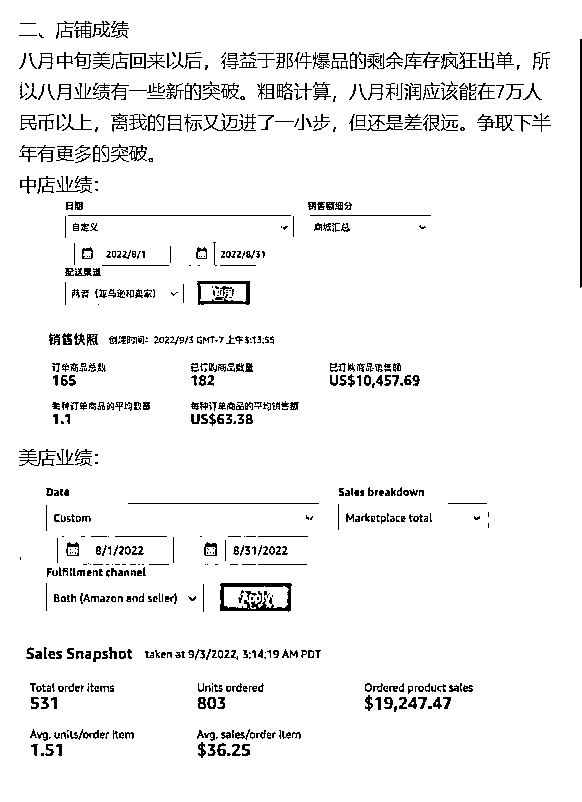
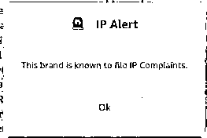
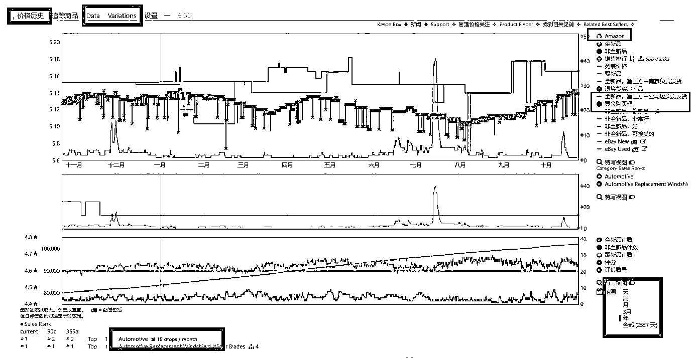

# (53赞)亚马逊 OA 模式分享

作者：  安瑟

日期：2022-10-25

周一在亚马逊的航海做了亚马逊OA模式的分享，应静伟的邀请把分享的内容发出来，希望可以给对这方面感兴趣的朋友一点答疑。

大家好，我是安瑟，先介绍下我的经历。

之前一直在外企搬砖，主要做产品开发，负责部门一半的品类，每年向供应商采购1500w刀左右。20年底因为家庭原因从上海到杭州定居，开始考虑自己单干，最后综合以往的工作经验，包括产品开发，英文优势，行业发展选择了做跨境电商。

21年三四月上了优联荟举办的第一期亚马逊OA训练营，5月份开始全心做，期间做过后面几期训练营的辅导员和助教。目前在OA稳定的情况下，开始尝试做精品模式，严格来说OA是我创业的前期练手准备，只是现在看准备时间有点长了哈哈哈。

现在生财里OA部分的内容基本上也是当时训练营认识的朋友分享出来的，比如永哥，大咪和Bruce，他们的OA也做得非常好，静伟也是因为看到我的这个经历来邀请做分享的。

 

 

不过要先给大家打个预防针，比起之前几位精品大佬的分享，都是Best Seller，年销千万，利润月10万，我今天的内容就没有这么高大上了。与其说是经验分享，基本上就讲一下我自己对这个模式的一些看法。

内容主要分成以下几个部分，基本上以问答的形式呈现。如果大家还有其他的疑问，再提出来讨论。

一、亚马逊OA是什么？和其他模式有什么不同？

二、OA的天花板是不是很低？

三、OA现在还能做吗？

四、OA适合什么样的人去做？

五、OA需要什么样的条件才能做好？

六、OA最核心的部分是什么？

七、OA有哪些风险和坑？

# 一，亚马逊OA是什么？和其他模式有什么不同？

这个内容我们手册里已经有更详细的解释了，一句话说就是去其他网购平台采购低价的产品，发货到第三方物流商检查，打包贴标后发到亚马逊仓库，然后上架跟卖平台上的现成有销量的同款品牌产品的链接（国内卖家链接除外，切记）。这里要补充的是，采购的平台非常多，不要限定于手册举例的Walmart，Target几个大平台。如果你试过一些选品工具，就知道上面有几百上千的网站供你去淘宝。

 

 

我把OA看成是亚马逊最简单的模式，因为它与其他几个模式相比，不需要花精力，成本去做页面运营，不需要打广告。只需要你能买来销量已经稳定的产品，再上架等着出单就可以。

以下是亚马逊几个模式的简单对比，可以看到OA少了难度更大的链接打造和广告两个部分，属于最青铜的级别了，因此很多做精品的朋友也会有看不上这个模式的，心想（不就是跟卖嘛，哈哈）。

# 二，OA的天花板是不是很低？

之前在生财里看到，亦仁有在其中一个OA的帖子里留言大概问，这个模式的头部能有多少利润？也就是天花板有多高。确实咋一看这样一个看起来很一般的套利操作，应该没什么想象空间。不过实际上平台上已经有很多体量非常大的玩家。

比如有一家华人创立的公司叫Hour Loop，主要就是做OA，现在做大了开始和品牌直接签代理之类有更高阶的玩法。他们是2013年成立的，今年1月份在纳斯达克上市。可以看到他们的产品品类非常广，链接达到90000个，这可不是常规的软件铺货，上架的都是品牌的产品。

 

 

 

 

 

不过上市公司太遥远了，我们看看身边的例子。我看到圈里自己公开的的不少朋友也有做得很不错，大家可以看看截图，这些人都是从去年才开始做的。因为是付费社群的内容，就不放详细链接了。另外之前训练营中我认识的还有好多没有晒成绩的朋友，靠这个模式在默默赚钱。

 

 

# 三，OA现在还能做吗？

 

 

群里有看到同学问这个问题，虽然不知道是因为看到什么内容问的。我的看法是，当然可以。

从模式发展来看，OA的模式在美国已经挺长时间了，各种规模的卖家都有。而且我现在偶尔会看到一些，日本，欧洲甚至东南亚地址的账号在做OA。

从竞争来看，国内火起来其实也才一两年的时间，对于亚马逊的整个体量来说，这段时间进去的人，不会对你产生多大的竞争。相比每年进去做精品的卖家数量，这点竞争基本上都可以忽略。

从平台政策看，也没看到什么消息说平台要取消跟卖的功能，也没有明显的收紧品牌权限或者侵权处理。

从流量角度看，OA销售的产品主要是一些比较稳定的品牌链接，基本上不依靠广告流量，主要靠品牌带来的自然流量稳定排名，以品牌的名气大小来定位置和销量。在流量越来越贵的现状下，这点比起国内精品的品牌甚至算是优势。

所以，特别是对一个新手来说，并没有什么理由阻止你进场。

# 四，OA适合什么样的人去做？

 

 

我想了一下，这个模式其实没有什么门槛，基本上会进生财的人对一些已知的困难都问题不大，如果要说，那对以下的几种人会比较适合。

1，如果你本身有一份正职在做，不打算离职，现在只是想要在业余时间做一份副业赚点外快。这种情况的同学很多，甚至有些同学做起来后，慢慢觉得手里的砖不香了。当然也有很多的人，慢慢就放弃了。

2，全职宝妈，奶爸。带娃之余，空闲时间每天花几个小时去运营店铺，有时也可以几天不开后台，店铺也在默默出单，连收款都自动打到账上。甚至过的比上班舒服，毕竟做得好的人可以照顾家庭又可以赚的不比上班少。

3，没有亚马逊经验的纯小白，想要入局亚马逊。不管你最后是否成功入局了，OA是你最容易切入亚马逊的模式（划重点！）。你可以省去精品最难的页面打造，调研，广告这些最难的部分，但是可以熟悉最基本的整个流程，开店，发货，物流商沟通，后台操作，开case，客服等等。当你熟悉简单的部分，再去做难的部分你的底气就特别的足，特别是你又已经在通过这个赚到钱的情况下。

4，有亚马逊经验，想靠OA多一点收入。我在训练营也遇到很多这个情况的朋友，这种朋友来做OA我一直说简直是降维打击，有天然的优势。我也特别喜欢和他们聊，除了给他们提供一些经验之谈，我也能向他们请教很多精品的问题。之前还有一个朋友和我聊OA，但人家自己的精品团队已经20多人了，还想能不能在OA的模式去尝试规模化。不过这类朋友通常都会非常的忙，不能稳定的安排时间选品，挑战也是比较大的。

如果有亚马逊经验，但是之后是想做精品的去创业的，那别浪费时间在简单的模式练级了。这个对精品的帮助确实不太大。我自己也有点陷在这里，今年初就开始学习精品的课程，但是一直走的特别慢没啥成绩。甚至有时候会想，每天只要花2，3个小时，一个月可以赚到大部分人几倍的工资，做精品的驱动力就会受到影响。格局不够。

 

 

# 五，OA需要什么样的条件才能做好？1，英文听说读写能力

整个OA过程中，选品需要看各个网站的产品信息，确保和亚马逊的链接一致。平时需要和网站的客服，物流商邮件沟通产品，发货的细节。然后有时被砍单，或者付款有问题需要找网站客服电话沟通，找PayPal客服电话解决账号问题。当然这里很多部分也可以通过一些翻译工具来实现，我也看过一些英文不好的同学做得好好的，但这可以是你的一个优势，更快更好的解决很多问题。

# 2，有耐心，能坚持

前期的选品和积累，一定是枯燥无味的。每天基本上就盯着网页，对比产品信息，价格，查售卖权限，甚至有点大海捞针的感觉。这部分通过一些付费的选品工具，TA，SM等可以减轻工作量，但是很多人都在这一步放弃了。很少人可以忍受刚开始的时候，每天看5小时以上，连续一周，一件满意的产品都没选到的结果。

 

 

然后少数跑通流程的人最后也不一定赚钱了，因为卖出一点点产品是赚不了多少钱的。

只要坚持选品，拓宽自己的产品库，品牌库，你才能扩大你的规模，最后赚到可观的金额。据我所知，很多训练营跑通流程的同学，后来也因为各种原因没有坚持做下去。

但是当你坚持，积累到一定程度，你有自己熟悉采购的品牌和采购网站，最后你只需要打开网站搜索产品就可以找到产品下大数量的订单。总体来说，这是一个越做越轻松的生意。

# 3，一定的资金

OA是需要采购囤货的，前期可以用几千块钱跑通流程，但做到最后你做多大也取决于你的资金投入。不过好处是，采购是可以用信用卡的，如果你采购的产品周转非常快，你可以在信用卡还款日前收回货款，相当于你没有投入你自己的资金，但赚回了更多的钱。

我之前在优联荟内部分享时聊过一个说法，我把OA看成是一个投资理财项目，我用信用卡资金采购的产品，用信用卡50天免息的时间，如果产品可以在这个时间内周转一圈，最终赚回了ROI为20%的回报。即使是按一年周转6次，这个也是ROI超过100%的投资项目，而且你还没有投入自己的资金。最后你能赚多少钱，就取决于你能投入的资金乘以你的ROI。

当然，这是比较理想的计算，中间会有很多可能产生的问题，比如选品不好卖不出去，被人投诉侵权，周转不够快等等拉低回报率的因素，但这些都是能力问题。毕竟从投资的角度来看，选一个能卖得出的产品，可比你去选一只不知道涨跌的股票确定性大多了。

 

 

# 六，OA最核心的部分是什么？

今天就只强调一个点，最核心的是选品。

选品是OA最最重要的内容，没有选到好的产品，一切都无从谈起。产品选好了，出单会非常省心，实现躺赚。但什么样的产品是好的产品？

一个好的产品通常看以下几个重要的方面  ：

# 1，不侵权

其实这也是个伪命题，所有没有拿到授权售卖的产品，原则上其实是侵权。不过并不是所有的品牌都会去管这个问题，另外亚马逊平台基本上在品牌发起投诉才会主动判断侵权。也就是说，没人管你就可以卖，但是你要避开有人管的品牌。

这里我们主要是用大数据工具避免侵权的问题，IP Alert这个工具收集了市面上发生过申诉侵权的品牌数据，你点开页面就会提醒你，这样基本上避免了已知的风险。当然也还有一些其他的技巧可以做参考，比如分析卖家情况。然后还有其他免费的工具，但效果没这么好。

 

 

# 2，有权限

只有有售卖权限的产品你才能上架，像下图这种需要申请的一般没有权限，或者需要经销商采购发票才能开通权限。权限会随着你的业绩增长自动开通更多的品牌，另外美国公司注册的账号天然有更多的权限。

# 3，有销量

能卖得出去的产品才是好产品。平台上有很多亚马逊自建或者其他三方卖家建的链接，前期已经积累了稳定的排名。这样的链接有稳定的排名，稳定的流量，从而保证稳定的销量。这个可以通过各种软件工具可以查看销量，比如卖家精灵。

 

 

# 4，有利润

通过计算，卖出的价格减去各种成本（产品采购成本，物流商成本，头程物流，平台成本）得到你的利润。也可以通过工具来计算。我用过几个插件工具之后发现有时不同变体会出错，现在基本上都是直接用卖家后台的网页最精确。

 

 

 

 

另外，这里我自己有一个数值参考，先不管利润大小或者ROI多少，计算一下利润和FBA费用的比例，特别是做鞋服等退货率高的同学，退货回来后FBA费用平台是不退给你的，如果你的利润不能覆盖这个费用，退货一次一件商品基本上就是白卖了。

因为前期不太可能像精品一样通过销量来摊平这部分费用，所以需要注意一下。通常利润可以覆盖这个费用，我都会买回来测品，只要你能周转你就是赚钱的，周转率和利润率抓好一个就够了。

# 5，价格是真实可参考的

可参考指的是当前价格是真实可以用的，而不是处于虚高的阶段。这里要用到查看价格历史的工具，基本上我们都是用Keepa。确定这个价格是大部分时间里的成交价格，而不是犹豫短暂缺货卖家涨价导致的短暂价差。

一定要找资料认真去学Keepa的使用，做到精通，特别是下图红框的部分，对你判断一个产品能不能购买起决定性作用。这里涉及的内容很多，包括价格历史，卖家数量波动，亚马逊自营情况，变体选择等等，是选品参考的重点！

 

 

# 6，竞争良好

一般你不可能能找到独占的好产品，除非少数时间缺货了。所以你只能尽量找到竞争毕竟良心的产品，这里参考的指标包括有：

比如卖家数量，月销量除以有效价格的卖家数可以大概得出每家分到的销量。

比如有没有恶性竞争，卖家无底线自动调价的情况。

比如有没有亚马逊自营长期霸占购物车，有的话尽量避开。

比如有没有大型经销商大量备货的。这些都是要考虑的因素。

这些也是有经验之后通过看卖家列表，Keepa，卖家精灵可以判断的。

 

 

# 七，OA有哪些风险和坑？

最后一个部分来浇一下冷水，虽然前面说了很多OA的优势和赚钱的想象空间。但这一路下来也或多或少我们会掉进各种大小的坑。如果你看透了模式，你就只能趟过去解决问题，然后继续赚钱。

下面列举一下比较常见的几个风险：

# 1，侵权投诉

这个是最严重的一个风险，结果也各不一样。严重的话品牌会向平台投诉，然后平台直接冻结店铺账号，这种情况听说过几个但不太常见。另外轻一点的情况是，投诉之后平台会下架你的链接，后台绩效挂小红旗，然后给你提供品牌方的联系方式让你联系去沟通，品牌方如果同意了会取消投诉。后果就是库存不能卖了。这里只能在前期通过工具提醒以及经验去判断，尽量去避免。

# 2，平台收紧售卖权限

有时候平台会无缘无故的把你的售卖权限取消，链接变成不可售。这种情况通常发生在Q4旺季来之前，我去年碰到过几个产品，产品送人亏2千美金。但今年好像没有这个情况了。不过遇到这个情况也是有解决方案的，一是找一些账号资深的，或者有美国店铺的朋友看看权限，帮忙清货。二是，通常采购网站都是有30-90天的退货期的，而且这个 

 

退货期过了你和客服battle也是有可能答应退货的，原路退回损失可以降到最小。还有一些朋友有其他平台账号，比如eBay，也可以上架清货。

# 3，不靠谱物流商

一个靠谱的物流商可以帮你省去很多的麻烦，不靠谱的可以带来更多的麻烦，因为这部分的操作远在大洋彼岸，你是完全无法控制的。我有碰到过签收后反馈没收到的，有发错货变成其他ASIN导致退货的，有收货一个月不处理不发走的。甚至有人遇到货到仓库后玩消失的。不过这种其实也和我们国内的货代一样的性质，碰到了只能认倒霉。

我们能做的一般有下面几点：

前期多花时间精力去搜索，筛选，通过网上的信息做初步的筛选。比如物流商网页的历史，建立时间，地址的实景，邮件沟通的感觉，效率去判断是否靠谱。

然后选定几个备选，同时去测试，合作一段时间就知道质量了。

最后一定要少量测试几个月，确定靠谱了再加大发货量，不然万一损失就是一大批货。

我当初是花了好多天去搜索，发了几十封邮件，最后筛选出来备选。即使这样，我第一个物流商最后发现还是一个说的好听，发货拖拖拉拉的主。还好最后换的备选效果还不错。

 

 

# 4，产品滞销

这个情况也是一个常见的问题，特别是前期选品不熟练的情况，我们会忽略了某些条件，导致选的产品最后发现卖不出去啊。

所以这块我们能做的就是：

选品的时候照着前面说的几点条件，一个个去对。不要因为看到利润很高就激动的去下单采购。要大胆，但也要细心。

降价处理。通常OA的产品很少是真的没人买，通常你通过降价也可以清掉，最终无法是不赚钱或者亏一点，还是能收回大部分成本。

如果你选的上架后发现已经过季了，也能放着等到应季了。通常这个时候反而会出现缺货的情况，你可以涨价把之前的仓储费补回来。

# 5，各种丢件

做的时间久了总会遇到各种各样的丢件问题，采购网站到仓库丢件，物流商发去亚马逊上架丢件，亚马逊退回物流商也会发生丢件。这里其实处理得好其实有时候也是好事。

采购网站到仓库的丢件，通常去找采购网站客服投诉都可以直接退款给你，甚至有时候发现实际上仓库收到了。网站的客服一般都不太会较真难为消费者。

 

 

亚马逊上架丢件和退回物流商丢件就需要一个battle的过程，次数多了你会总结出准备赔偿申请的经验，该准备到什么程度。我的建议就是认真一点准备，证据充分到人家不赔你都不好意思。最后赔付了，相当于你直接出单把产品卖给平台了，所以说也是一件好事。之后具体碰到如果不会的，我可以指导一下。

以上就是我要分享的内容了，准备的有点仓促，大家凑合看哈。

主要还是看航海手册的内容比较全面。而且很多问题都是具体操作才会遇到的，到时大家需要帮助了可以再来提出问题。

以上。

评论区：

北纬64度 : 感谢分享，对oa有了大概了解

施小施 : 我在美国有海外仓，非免税州，圈友如果有想尝试这个项目的，可以提供这个服务，不收注册费，仅收单个打包处理费用1.5～2美金

三林 : OA的全称是

张静伟@生财有术 : OA（Online Arbitrage)线上套利  三林 : soga 谢谢答疑

星光熠熠 : 棒极了

小可爱～ : 请问可不可以介绍靠谱的物流商，自己找了好久没找到合适的，都快崩溃了，不是太贵就是要求太高不接收新卖家
