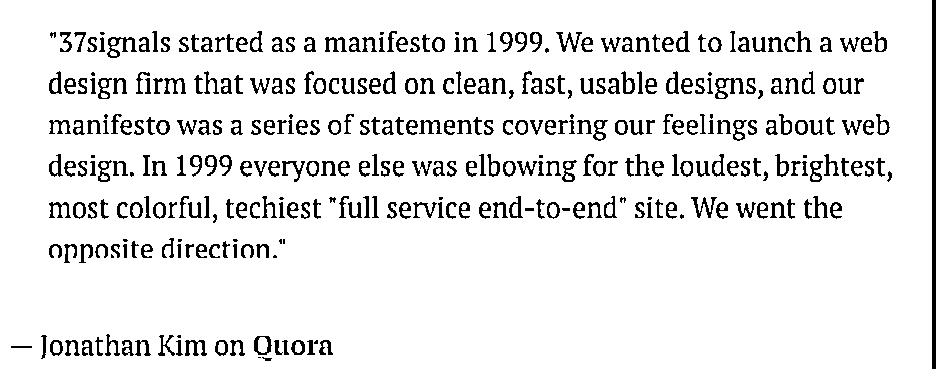

# 3.9 方式八：个性化需求定制 ★★ @刘小排

有人愿意预付费找你定制某个需求，这是非常好的模式。

码叔在生财有术做过分享，这正是他的方法。 他从 6 月自学 Google 插件开发以来，半年时间已经变现了好几十万，他的方法可以复制。他总是从定制需求开始，从来不自己生造一个 idea。

某人有个需求，知道码叔会编程，就付费让码叔定制开发。然后，码叔就想办法把它产品化，卖给更多的人。

十年前，我在一家软件外包公司工作。这家公司主业是接欧美软件外包，但是高明的老板，从一早就意识到了这套思路。既然有客户愿意花钱让我们做，那我们何不试试把它标准化，卖给其他客户呢？ 他们也时不时推出一些小型的 SaaS 产品，有些也取得了小成。

（这家公司叫重庆诺怀软件科技有限公司，到今天也还在运转，我是它的一个小股东）

国际上更著名的案例是 Typeform 和 Basecamp，他们最初都是软件外包公司，然后从客户的需求中，找到了共性需求，再将之产品化。以下是创始人的原话。

生财有术有很多独立开发者，经常会接到付费定制开发的需求。 大家完全可以组织起来，去发掘其中产品化的机会。

注意事项：生造的需求往往是误区

这不是一个好的方法论，通过生造 idea 获得成功的公司，屈指可数。

把它列到这里，是希望跟大家提个醒。

下次，当你脑海里冒出一个天外飞仙的想法“我想到一个绝妙的点子”的时候，多问问自己，用户在哪里？谁愿意付费？

最好骗的人，是你自己。我们很容易被自己的生造 idea 搞得很嗨。千万别轻易爱上自己的想法。

内容来源：《如何获得产品 idea》

