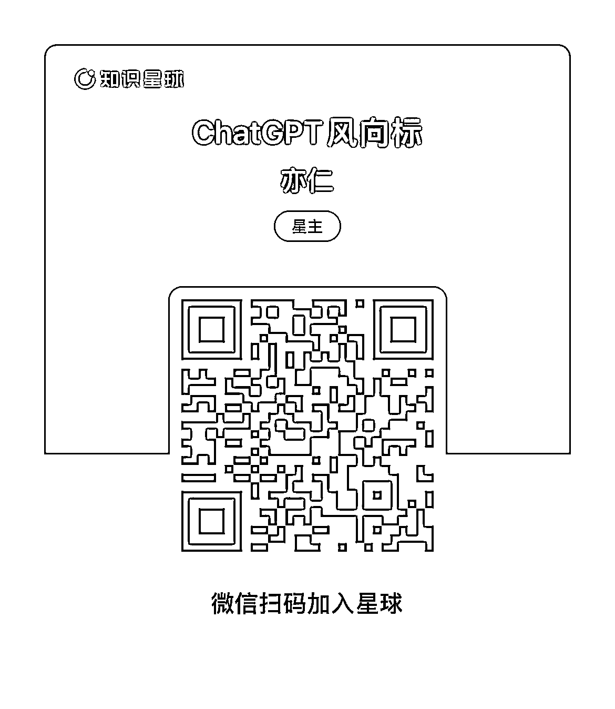

# 一、了解 ChatGPT

亦仁在 2 月 7 日，创建了一个关于 ChatGPT 的星球，暂时免费。截止目前已经有 3.6 万人加入啦。

如果你还没加入，可以扫描下方二维码加入。

其中有一篇精华帖，是龙珠圈友 @白一喵 为大家写的《如何正确向 ChatGPT 提问》示例。

帖子里用第一视角向 ChatGPT 提问，并引出了大量关于如何使用 ChatGPT 的内容，由于这个案例非常具有代表性，所以在正式使用 ChatGPT 之前，建议大家先阅读完这篇帖子，以便更好的了解 ChatGPT。

这里仅摘录部分内容，完整内容见：《如何正确向 ChatGPT 提问》

用户：我想请你解释一下你的工作原理。不过第一步，我想先让你用一个关键词归纳你的解释，作为开始。你会用哪一个关键词呢？ ChatGPT：如果要用一个关键词来归纳我的工作原理，那就是“自然语言处理”（Natural Language Processing， NLP）。我是一个基于 NLP 技术的语言模型，通过分析您输入的自然语言文本，尽可能准确地理解您的意思并回答您的问题。 用户：好的，那么请你围绕“自然语言处理”（Natural Language Processing， NLP）这个关键词，解释一下你的工作原理？ ChatGPT：作为一个自然语言处理模型，我的工作原理可以概括为：利用机器学习和深度学习技术，通过处理大量的文本数据，从中学习自然语言的模式和规律，从而能够理解和生成自然语言。 具体来说，我的工作原理通常包括以下几个步骤：

1）文本预处理：将原始文本数据进行清洗、分词、词干提取、停用词过滤等操作，以便于后续处理。

2）特征提取：将文本转换为计算机可以理解和处理的数值型特征表示。常用的特征提取方法包括词袋模型、TF-IDF、词嵌入等。

3）模型训练：使用机器学习和深度学习算法，利用预处理的文本数据和特征表示，训练自然语言处理模型。常见的模型包括朴素贝叶斯、支持向量机、循环神经网络（RNN）、卷积神经网络（CNN）、Transformer 等。

4）模型评估和调优：使用预留的测试数据对训练好的模型进行评估，并对模型进行调优，以提高其性能和泛化能力。

5）应用部署：将训练好的模型部署到实际应用中，例如文本分类、命名实体识别、情感分析、机器翻译、智能客服等。

总的来说，我的工作原理基于机器学习和深度学习技术，利用大量的文本数据来训练自然语言处理模型，从而实现自然语言的理解和生成。 用户：请用一个生活化的、没有接触过计算机的老年人也能理解的隐喻，来解释你刚才这一段说明。 ChatGPT：当我们处理自然语言，就像处理菜谱一样。首先，我们需要将菜谱上的食材清洗干净、切好，以便于后续的烹饪。接着，我们需要将食材加入适当的比例和顺序，这就相当于将文本转换成数值型特征表示。然后，我们需要根据不同的菜谱，选择不同的烹饪方式，烧煮或煎炒等，这就相当于选择不同的自然语言处理模型。最后，我们将烹好的菜品上桌，就像将自然语言处理模型部署到实际应用中一样。这样，我们就可以将繁琐的文字处理任务变得简单快捷，让计算机来帮我们自动化处理自然语言。 用户：你是一种快速发展的新兴技术，使用你的人很可能不了解你的适用边界，你认为哪些领域适合找你帮忙，哪些领域不适合找你呢？ ChatGPT：作为一种快速发展的新兴技术，我有自己适用的领域，也有不适用的领域。 我适合的领域包括但不限于：

1）自然语言理解：如情感分析、文本分类、命名实体识别、关键词提取等任务。

2）机器翻译：将一种语言的文本翻译成另一种语言的文本。

3）智能客服：为用户提供自然语言交互式的客服服务。

4）信息检索：如搜索引擎、推荐系统等。

5）自然语言生成：如自动写作、机器翻译等。

6）语音识别：将人类的语音信号转换成文本。

而我不适合的领域则包括但不限于：

1）涉及高度主观判断的任务：如判断艺术作品的价值、文本的真实性等。

2）涉及个人隐私的任务：如个人身份认证、个人情感识别等。

3）涉及特定领域知识的任务：如专业术语的翻译、医学领域的自然语言处理等。

虽然我可以处理自然语言，但仍然需要人类的指导和纠正，同时也需要结合具体应用场景和实际需求来确定我的适用范围，避免出现误导和误判。

5 月 19 日消息，ChatGPT iOS 应用程序在美国上线，未来几周将在其他国家上线： apps.apple.com/app/openai-cha。另外 Android 应用程序后续即将推出，Android 用户可以期待下～

如何注册账号？

由于注册内容较为敏感，航海手册中不便展开说明，请大家自行解决。

