# 7.2.1.1 主要的使用方法

•方法一：用 ChatGPT 4.0，直接提问就好

比如这样和 ChatGPT 说：

帮我写 5 个相同主体概念，不同画风，不同画家的 prompt "未来城市，飞行的汽车，霓虹灯"画家写在 prompt 最后面，by 画家。并翻译一个英文版。

给概念，就是你想要生成的图片主体，例如“未来城市”，也可以“未来城市，XX 画家”等：

以下是在 MJ 中，用不同的 Prompt 生成的图片：

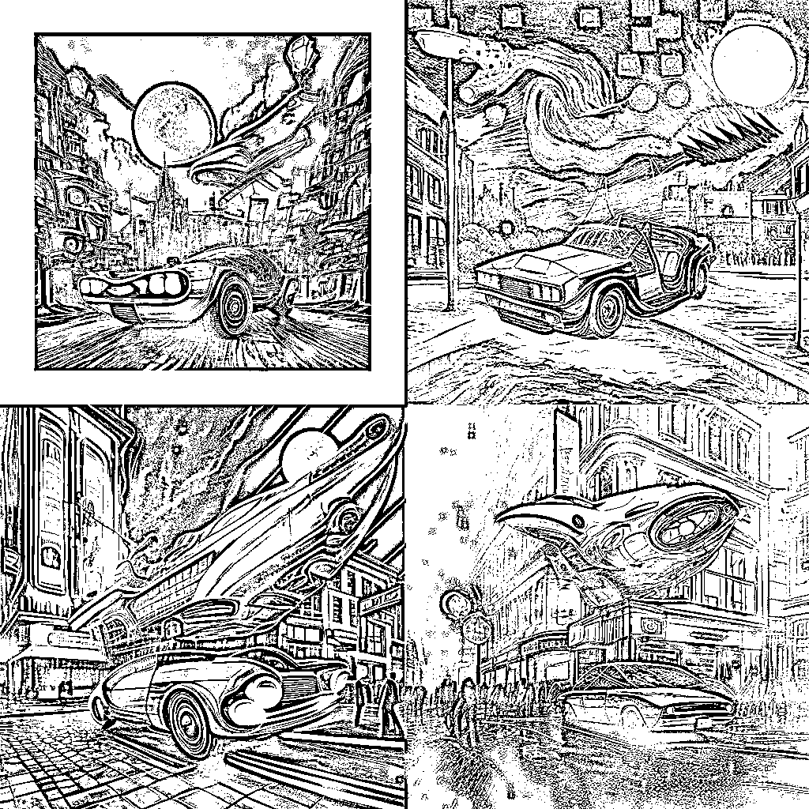

1

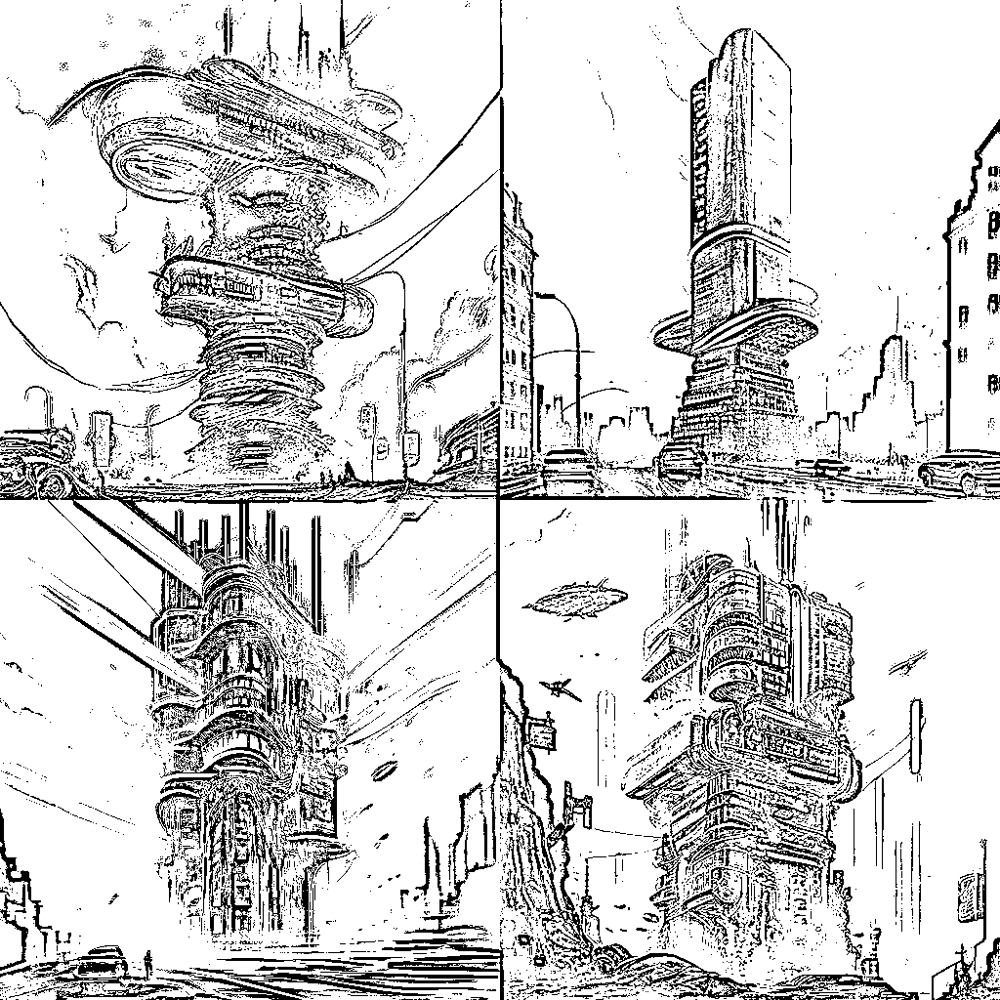

2

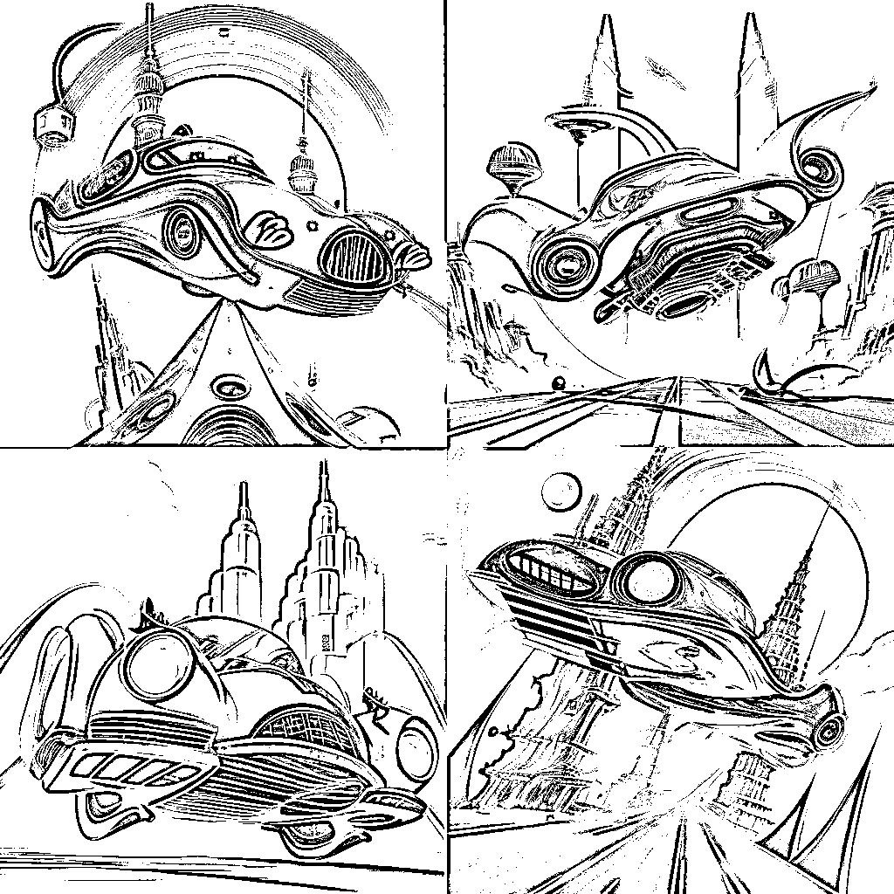

3

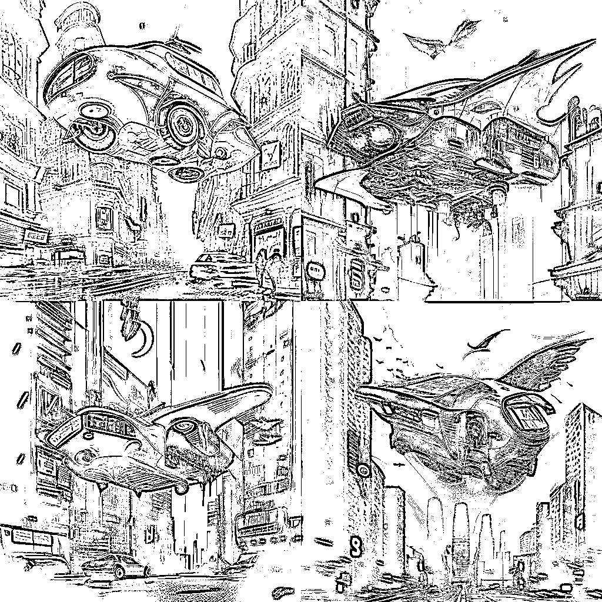

4

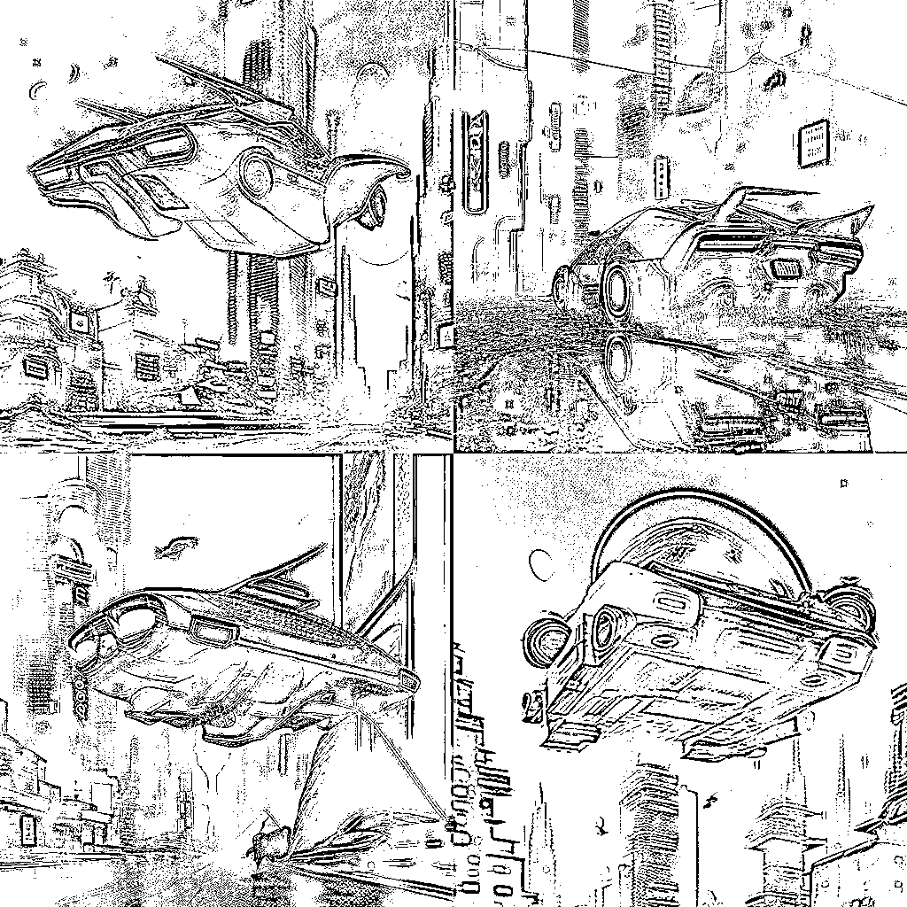

5

•方法二：充当法（角色扮演）

第一步：

你是文本生成图像领域的专家，文本生成图像也简称 AI 绘画，需要绘画者提供一段方便 AI 理解绘画内容的提示语句子，然后由 AI 绘画程序根据提示语内容，绘制成美观的画面。你是提示语编写方面的专家，你能根据绘画主题，并根据美学领域、摄影领域、艺术绘画领域的专业知识，选择合适的风格和关键词，组合编写出提示语。你现在的任务就是帮助人们编写提示语，后面我会给你解释具体工作流程，明白了吗？

第二步：

我的创作步骤如下： 1、首先寻找一种具有鲜明外观的生物，注意不是普通的生物，而是适合变形成独特外观的生物，例如玉米、螃蟹、鹦鹉螺、珊瑚、你应该知道更多有着鲜明外观的生物，但不要直接用我给出的例子。 2、其次将它和某种类型建筑相结合创造一种具有鲜明特色的建筑，例如鹦鹉螺壳外观的房屋。 3、然后，添加一些可增加画面效果的描述语、艺术家、摄影师等等，例如照片级真实感，清晰对焦，美丽而细致的灯光，阴影，电影构图。 4、注意，我是要创作一个具有独特生物外观的建筑，而不是在建筑中有一个生物。

根据上面我的创作步骤，帮我编写类似的提示语吗？在每一步给我五个选择，这样你才能更好的了解提问者正在寻找的内容，然后你再继续提问，明白了吗？

最后根据我的选择，组合生成五个完整的英文提示语，提示语中包含优秀的摄影作品需要的些关键词，类似这种结构： hoto of a diorama of a futuristic house made from a nautilusshell， photorealistic， High Detail， Sharp focus， realism， beautiful and detailed lighting.shadows，by jesper ejsing 注意你可以自己增加、选择其他一些关键词，不能只重复我给出的示范关键词。

现在按第一步给我选择一个具有鲜明外观的生物给我选择，再进入后面的步骤。

第三步：

选择你想要的外形

第四步：

很好，我将上面这个生成提示语的对话方式称为：仿生设计法。今后当我说请用仿生设计法生成一个提示语时，请按照上面的步骤和我进行对话，你明白吗？

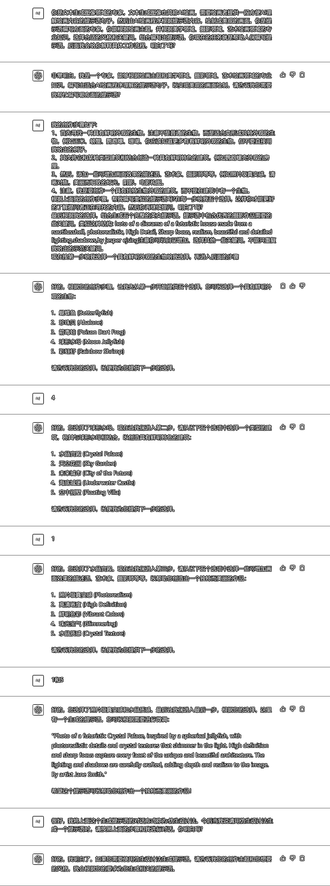

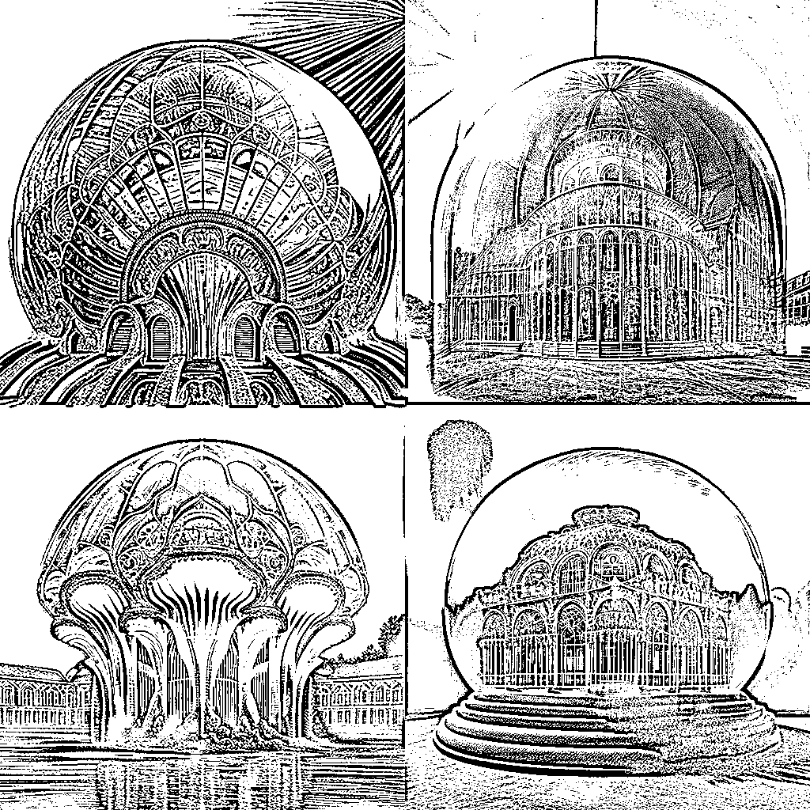

Prompt ：水母和宫殿的结合

•方法三：充当提词器并激发想象玩法（开盲盒）

"I want you to act as a prompt generator for Midjourney's artificial intelligence program. Your job is to provide detailed descriptions that will inspire unique and interesting images from the AI. Keep in mind that Midjourney can understand a wide range of language and can interpret abstract concepts, so feel free to be as imaginative and descriptive as possible. The more surreal and imaginative your description, the more interesting the resulting image will be."

翻译成中文

“我想让你充当 Midjourney 的人工智能程序的提示生成器。你的工作是提供详细的描述，这将激发人工智能独特而有趣的图像。请记住，Midjourney 可以理解广泛的语言，并可以解释抽象的概念，所以尽可能自由地发挥想象力和描述性。你的描述越超现实、越富有想象力，最终得到的图像就会越有趣。”

我让 ChatGPT 充当 MJ 的提词器，并发挥它的想象力，如下：

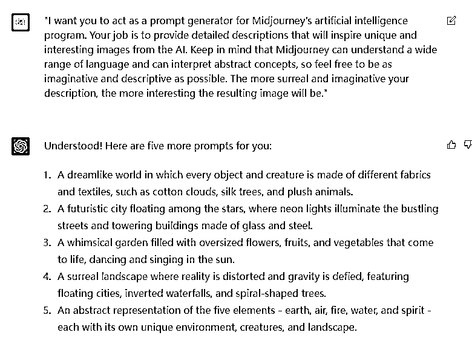

以下为用 ChatGPT 提示生成的提示词，在 MJ 里面生成的图片：

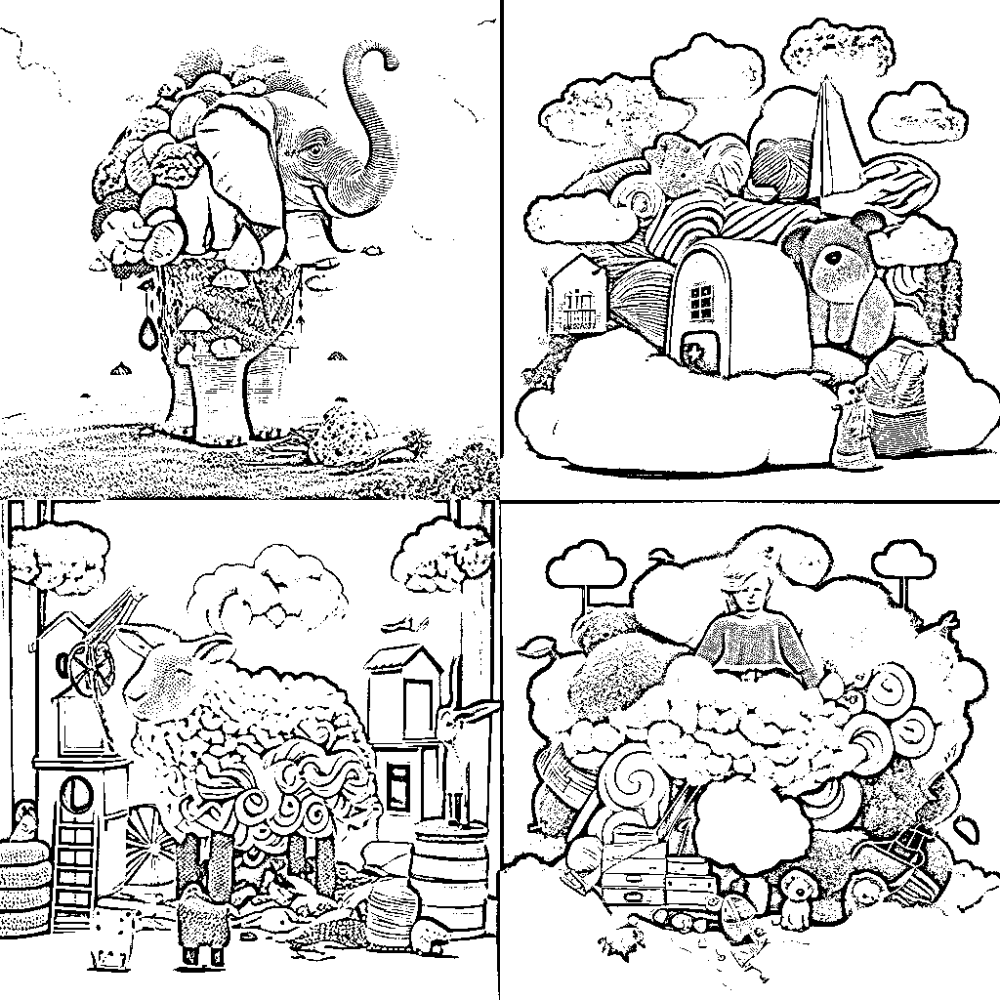

Prompt1

Prompt2

Prompt3

Prompt4

Prompt5

是不是很惊艳，开盲盒图片，而且也很奇特，可以发小红书和抖音图文。

•方法四：只改动部分提示内容

给它整句提示，并告诉它只改动的部分，其它意思大致不变，生成更多的提示：

You act as an optimization prompt generator for Midjourney's AI program. Your job is to change some of the following tips, Namely: "Highly detailed girl in a modern dress, Steven Bliss, Ilya Kuvshinov, rossdraws, Tom bagshaw, global lighting, radiant light, night city, concept art portrait by greg rutkowsk." Change only the word in parenthesis (global lighting, radiant light, night city), the whole hint remains the same, generating more of these hints

翻译成中文：

你充当 Midjourney 的 AI 程序的优化提示生成器。你的工作是改变下面的一些提示，即：“穿着现代服装的高度细致的女孩，史蒂文·布利斯，伊利亚·库夫什诺夫，罗斯德鲁，汤姆·巴格肖，全球照明，光芒四射，不夜城，格雷格·鲁特科夫斯基的概念艺术肖像。”仅改变括号中的单词（全局照明、辐射光、夜之城），整个提示保持不变，生成更多这样的提示

只保持整体结构，改动了部分，其实也可以改动一些其他的，比如改画家，改风格，改主体，也可以只保留一个，其他都改动等。

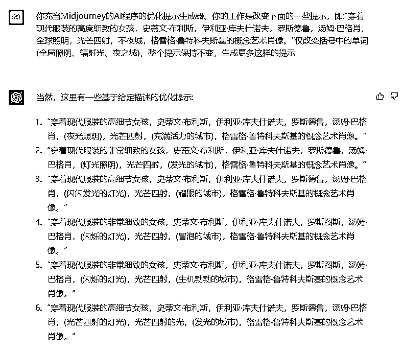

以下是 chat 回复的 6 个提示词生成的图片：

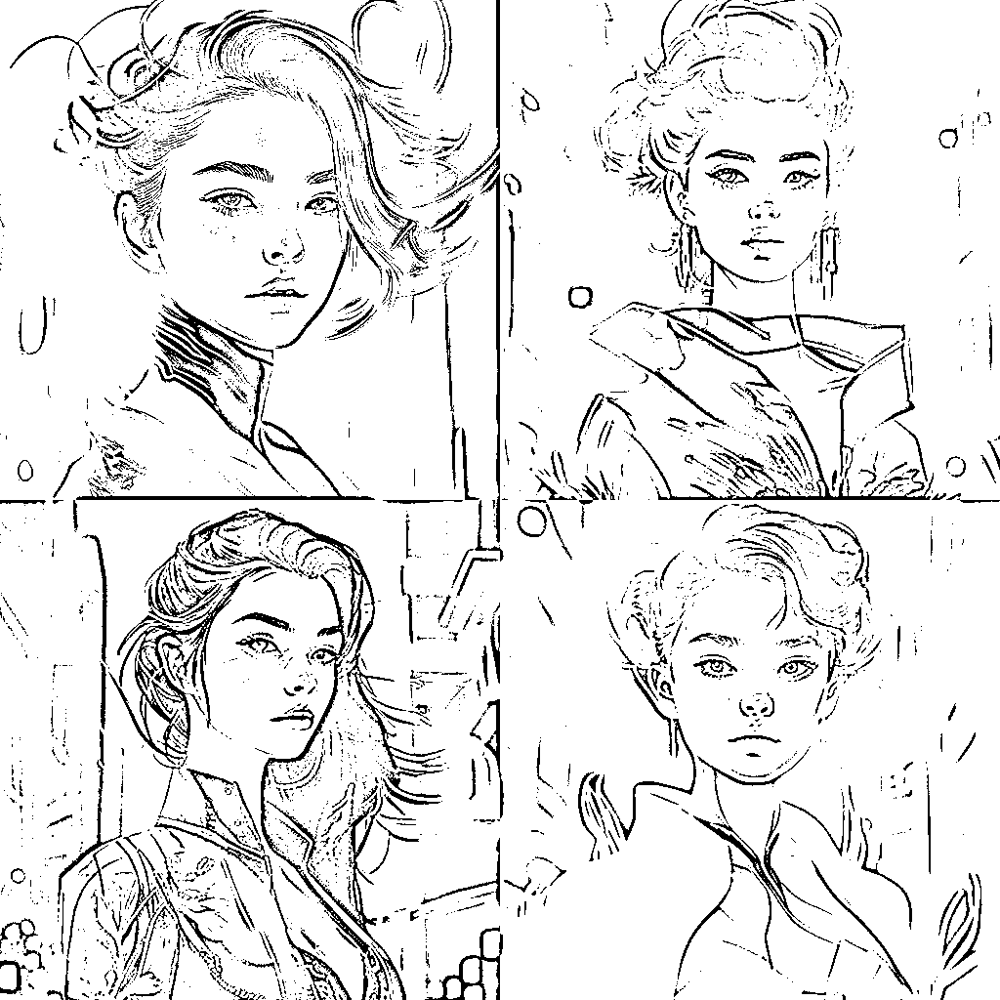

Prompt1

Prompt2

Prompt3

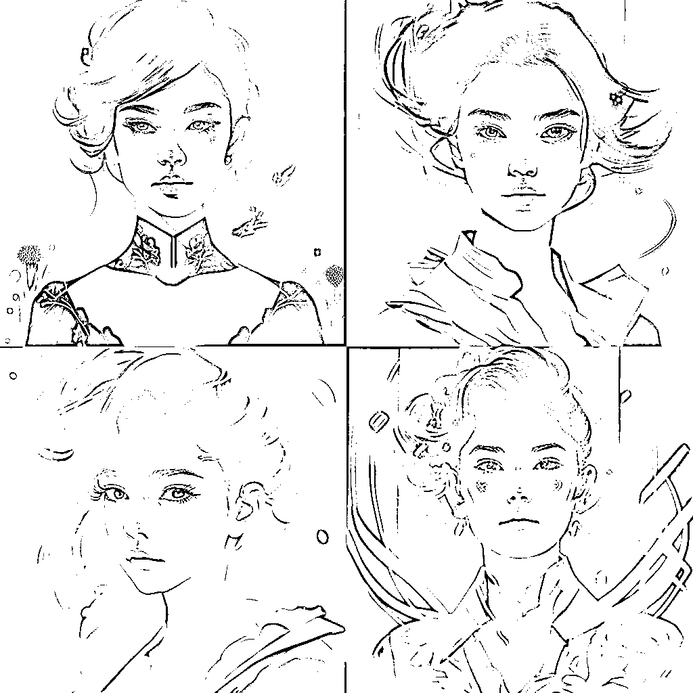

Prompt4

Prompt5

Prompt6

下面这张是我给的原图，也就是发给 ChatGPT 提示的关键词图：

示例模范图

•方法五：帮你想组成元素

一幅画的组成元素框架为：[主体]+[细节]+[风格修饰词]

第一步：问 ChatGPT，一幅画的描述由哪些方式构成

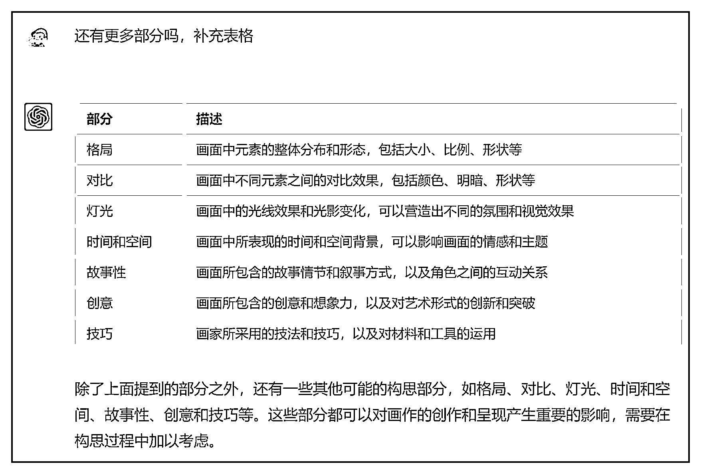

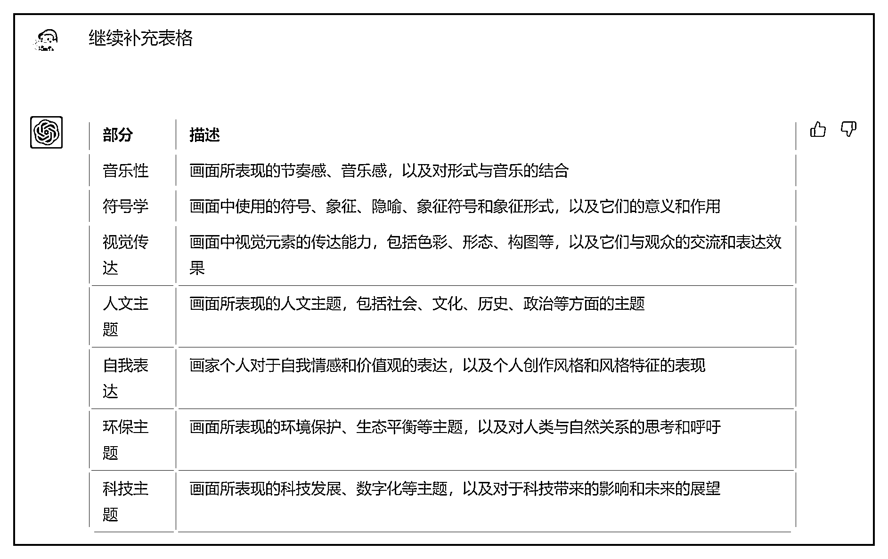

第二步：让它帮你举一些示例

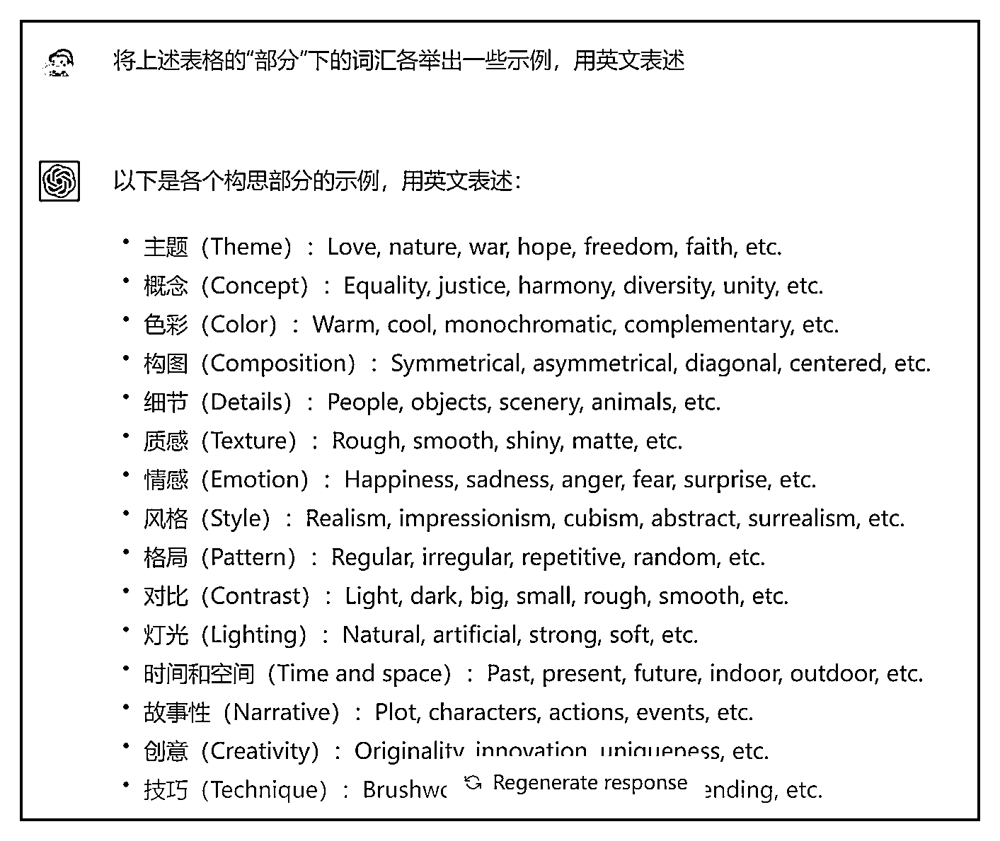

第三步：描述你想要生成的想法，让它帮你选

第四步：让它用英文组句子

第五步：放在 Midjourney 中生成

效果还不错，充满斗志的船员在大海上航行，欢快、昂扬、充满幸福感。

以上只是示例，实际上，每个部分还没有让它出全，比如，灯光有哪些种类，艺术风格有哪些种类，材质有哪些种类，等等，不再赘述。

内容来源：《如何用 ChatGPT 批量生成工业级提示词，并在 MJ 里面生成 AI 图片》、《AI 绘画的新进展和未来趋势：ChatGPT 带来的变革》

