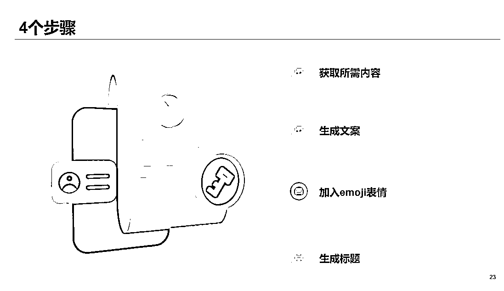
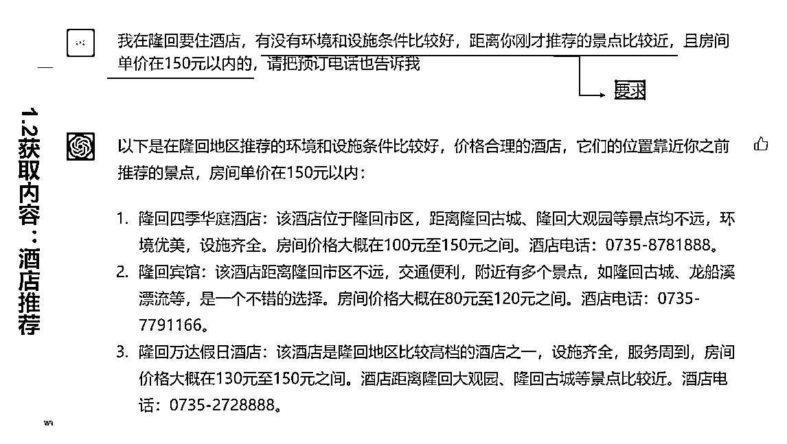
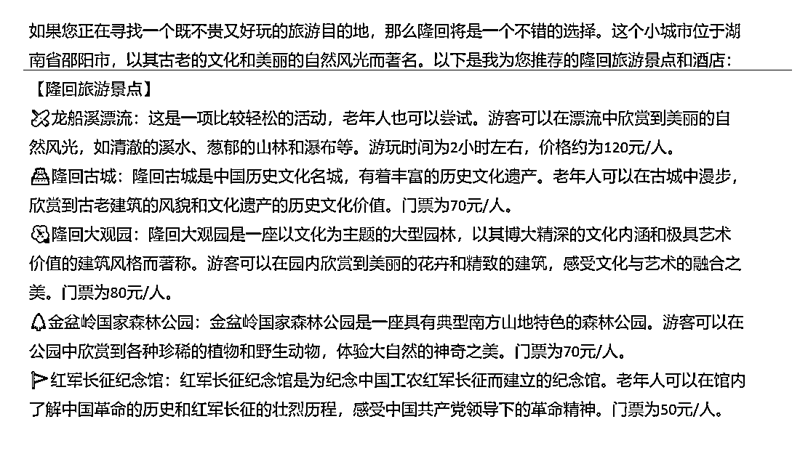
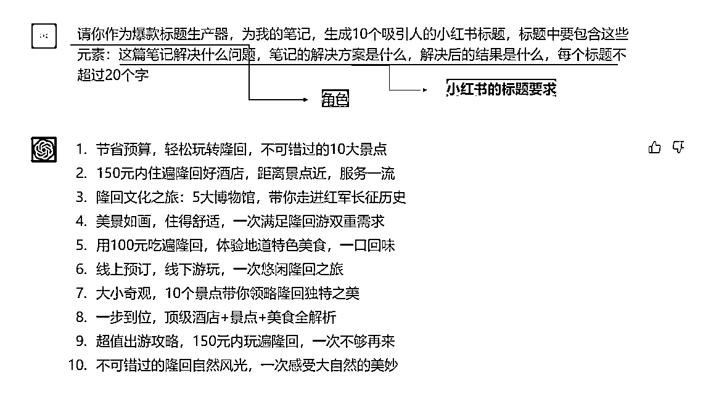

# 10.1 案例一：用 ChatGPT 写一篇小红书旅游笔记 @菜菜

四个步骤用 ChatGPT 写一篇小红书旅游笔记，这四个步骤是哪四个呢？

第一，先通过 ChatGPT 来帮我们获取基础的内容；

第二，让它生成文案；

第三个，通过 ChatGPT 可以快速地插入 emoji 表情，这也是小红书文案的特点；

第四，让它帮我们生成爆款标题。

这个实战案例，是写一篇邵阳隆回的旅游笔记。先来看第一个步骤：

我的提问是包含了背景，角色和要求的：

•背景：我的舅舅准备组织一场家人的旅行活动，五个老人都在 60 岁以上；

•角色：我让 ChatGPT 扮演邵阳隆回当地的导游；

•要求：人均只有 1000 元的预算。

我们可以看到 ChatGPT 给我生成的内容。因为版面的关系，我没有截全，其实后面还有很多。通过同样的方式，我把酒店的内容、美食的内容也获取了，由于版面的关系，我没有把美食内容放上来。

获取到内容之后，第二个就是让 ChatGPT 帮我们生成小红书文案。我给它赋予了一个角色——小红书的旅游博主，帮我把以上的信息生成一篇小红书旅游笔记。然后它就开始生成了。

第三步，添加 emoji 表情。我给它指令，在每段开头的位置插入合适的 emoji 表情，文章的内容里也要插入表情，我们来看一下，神奇的事情发生了：

你看它的表情配得很合适，比如龙船溪漂流，它插入的就是船的表情，隆回大观园，这是一个植物园，它插入的就是花儿的表情，还有红军长征纪念馆，它插入的表情是一面红旗。

最后，我让 ChatGPT 帮我生成标题，这里我给它的角色是爆款标题生成器，要求是标题当中要包含解决什么问题、笔记的解决方案是什么、解决后的结果是什么，以及标题的字数：

可以看到，生成的标题。还是挺不错的，至少能打 80 分的水平。这样的水平，我们在外面可能要花 4000 - 5000 去请一个文案，但是有了 ChatGPT，这些钱都省下来了。

内容来源：《玩 ChatGPT2 个月后，我总结出高效对话 ChatGPT 的 6 字真经》

