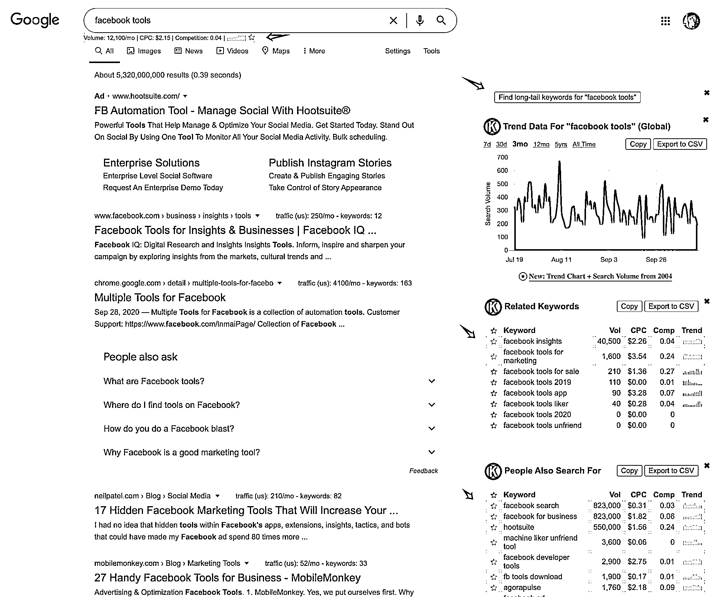
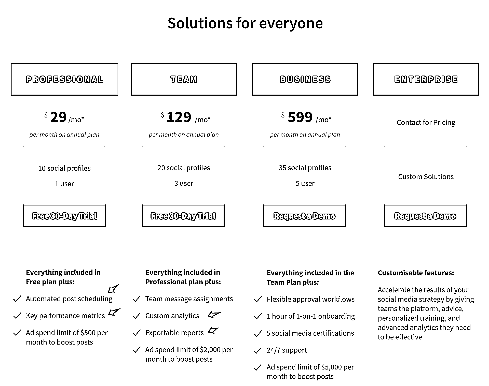
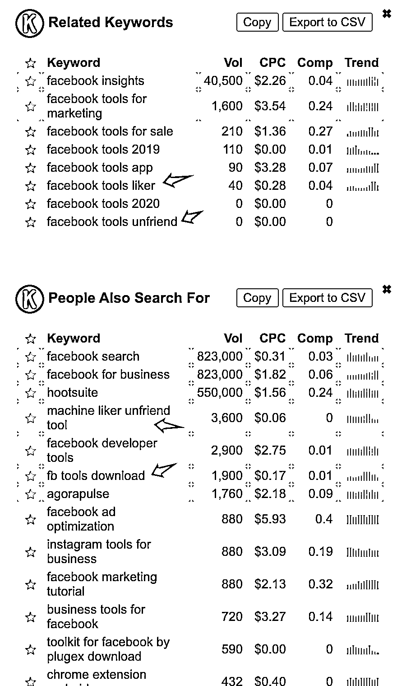
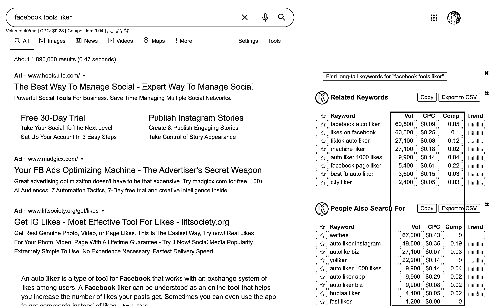
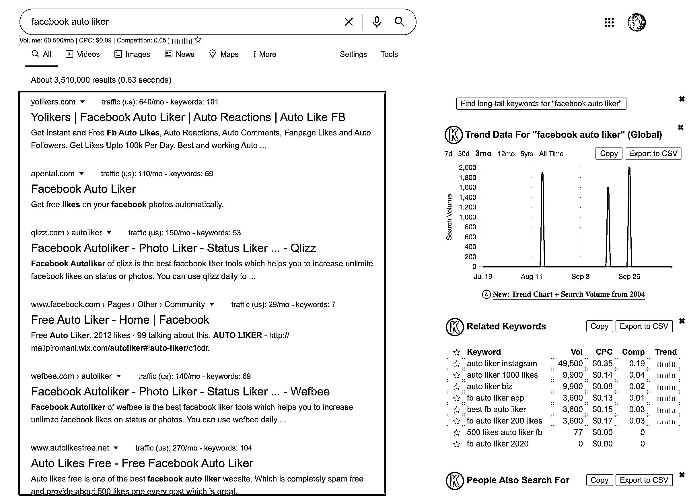

# (精华帖)(66赞)如何挖掘小众产品的需求（入门级）

作者：  壹树

 

 

日期：2020-10-19

#小众产品 #独立开发 #浏览器插件 #需求挖掘

大家好，我是壹树，一个人在海外浏览器插件这个不起眼的小众市场深耕了将近 4 年，今年 5 月决定不再上班做产品汪，把这个“小”从副业变成了主业，目前专注小众领域的软件（插件）产品变现。

长话短说，今天跟大家分享一套入门级别的需求挖掘方法：

从大关键词中找大产品，将大产品中进行功能拆解，从功能中发现长尾关键字，通过长尾关键字数据反推小产品的可能性。

这套方法用到了以下的浏览器插件工具（需梯子进行安装）

Keywords Everywhere - Keyword Tool （付费的，充值 10$ 有 10000 点数，够用好久了）

https://chrome.google.com/webstore/detail/keywords-everywhere-keywo/hbapdpeemoojbophdfndmlgdhppljgmp

对于小众产品，工具类是一个基本面，之所以“小”，是因为解决的是用户的一个“点”，这个点就是产品的原点。当然我们不可能漫无目的地进行，可以选用比较常见的“视频”，“图片”，“社交”，“电商”等的领域。

下面会一步一步描述如何进行发掘的，我们选用 Facebook tools 这个大关键字开始。点击搜索后，插件直接在页面显示了很多的相关数据，例如：**Volume****, CPC,** **Competition****, Trend**，都是搜索的关键指标，这些指标仅提供了参考价值，因为如若切换到其他类似工具，数据会有差异，但也很好地提供了价值。

 

 

简单解释一下这些关键指标：

Volume：每月搜索量

CPC：单次点击成本

Competition：竞争难度，0 ~ 1 难度依次递增。

Trend：趋势，搜索量的趋势

通常是将前三个指标混合一起对比的，这三者关系一定要保持敏感，不然会错过很多机会。

**1. ** 搜索量大，CPC 低，Comp 又低，那么就是一个好的关键词。

**2. ** 搜索量小，CPC 高，Comp 接近 1 ，那么就代表厮杀尸行遍野了。

 

 

但对于小众产品来说，这个大关键字意义不大，虽然搜索量很大，如果现在去抢这个词，那么大概率就是炮灰，而且对于用户来说，这个词的需求不够直观，没法直达用户的“点”。

这里你发现了一个广告，不要忽略这个广告，点进去。然后浏览此网站的功能介绍页面与价格页面，因为这个 2 个页面有我们需要的信息。

功能介绍页：

功能介绍页面包含了那些功能，为用户带来什么，可以大概了解工具的功能范围，一般用于评估技术实现难度。

产品价格页：

价格页面通常会详细地将功能点列出来，然后用户可以进行对比。如：Automated post shceduling（定时发帖），Key performace metrics (关键性能指标），Custom analytics（用户分析），Exportable reports（导出数据报告）。这些都是我们对工具的一些直观理解，也是相对直观告知用户的一个“点”。

 

 

通过上面页面大概可以知道一些关键字如：automated, scheduling, export report, analytics，这些都是产品的“点”。可以串起来：facebook + 关键词，然后继续搜。你会发现很多平时发现不了的小点。

那么再从旁边的 Related Keywords 与 People Also Search For 的面板上去找。一般情况下，总会看到一些更细关键词，通常表现为英语动词，如：Facebook tools liker，Facebook tools unfriend, FB tools download。

 

 

 

 

分别点进去后你就会发现新大陆了，如：Facebook tools liker。

我们再点一个：Facebook auto liker，看看这些网站的，这些产品可不是用爱发电的，都是能捞钱的货。

 

 

然后你就发现有 Facebook auto poster, Facebook auto friend request 等的关键词，这些就是一个小众产品的“点”。

到这一步，你应该可以发现各式各样的小产品，只要把 Facebook 换成 Instagram, Youtube, Amazon, Shopify, Ebay, 等等，实在是太多了。

当你发现这个“点”后，如何用数据拍板这个“点”是否应该去产品化？

这里总结一下我的插件经验数据，虽然不一定具备确定性，但可以参考：

如果是社交类， Volume 大于 2000 ，Comp 小于 0.25 就可以上，通常 CPC 不会很高，订阅流失率比较高。

如果是电商类， Volume 大于 500 ，Comp 小于 0.2 就可以上，通常 CPC 会比较高的，这类小产品的订阅流失率是比较低的，变现比较持久。

 

 

如果是 toB 类， Volumn 大于 1000, Comp 小于 0.2 就可以上，这类的流失率比电商类高一点。

个人建议从自己熟悉的技术平台入手，每上一个产品后都要进行复盘，复盘的过程就是提升下一个产品成功率的过程，非常重要。

当你习惯了这种搜索方式以后，你会发现很多工具类都是相似的，只是换了个平台，或者换了个使用载体，从 PC 变成了手机，从手机变成了平板，从 exe 变成了浏览器插件。每次切换都将用户重新洗牌，若你发现了某个“点”的搜索数据很好，赶紧上产品，变现其实没那么难的。因为这些都是已经在其他平台或载体上验证过的产品。

相关工具推荐：

https://neilpatel.com/ubersuggest/

https://serpstat.com/

下次会填一下海外小众产品收款渠道的那些坑，因为 8 月我的 Paypal 与 Stripe 相继被冻结了，因为疫情期间付费用户涨了，争议率高了，被银行风控了，结果是，我的所有插件的付费订阅用户都没法自动续费了，然后我通过一个月的时间挽回了将近 50%的付费用户，:P。

若对小众产品感兴趣的，可以加V交流：shuhankuang

插一条信息：G Suite 改名为 Google Workspace 了， Google Workspace 有 20 亿用户，而且这帮用户都是 toB 企业用户为主，然后里面也有个插件市场，你懂的。:P评论区：

 

 

Blanke : 付费课程完成了没[撇嘴]

infinity : 感谢分享！你的 Stripe 是在香港开的吗？

壹树 : 香港和美国都开了

壹树 : [尴尬]，已太监快一年了。哈哈哈

黑豹 : 很不错

哈哈 : 这工具一个月可以搞多少米

亦仁 : 感谢分享，已加精华。

任知行 : 我也是码农，也写过浏览器插件，感谢分享
