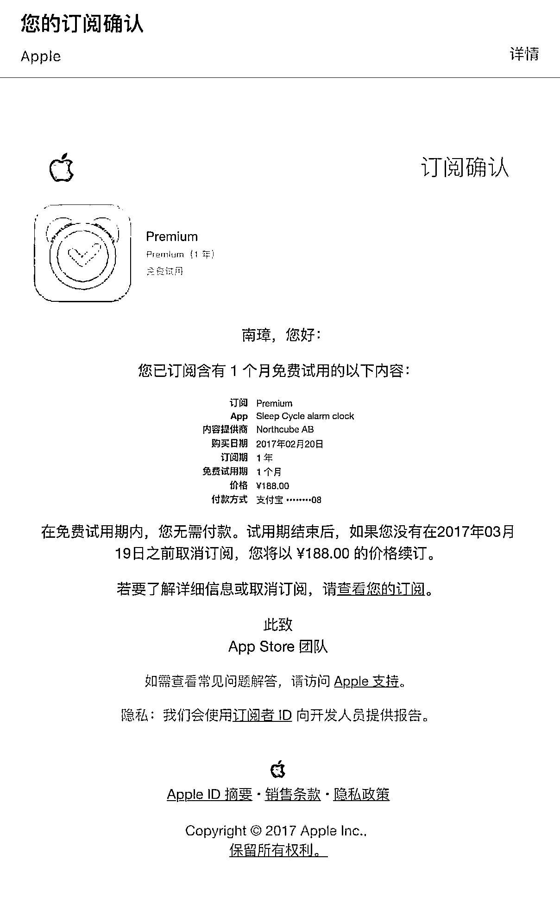
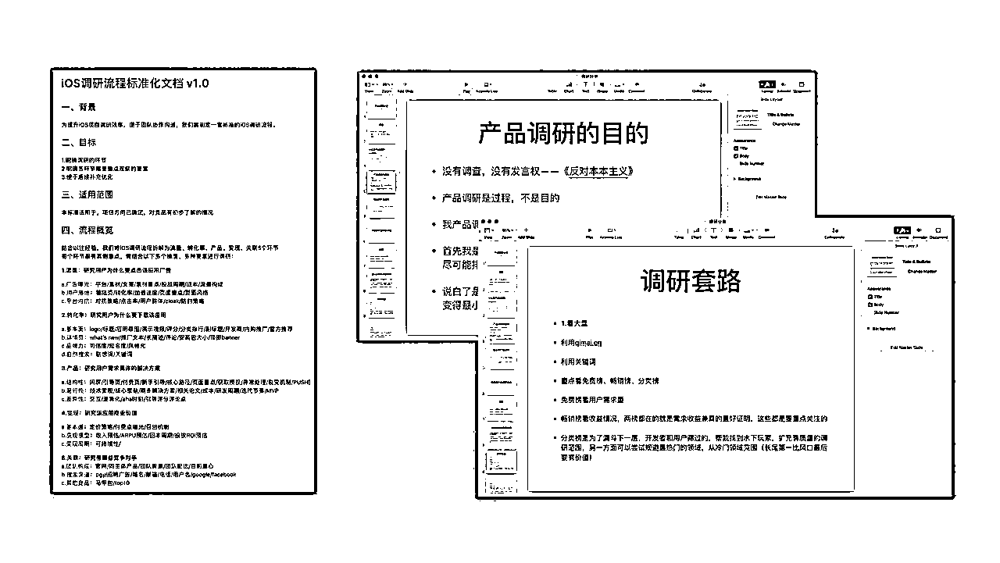

# (精华帖)(57赞)我和订阅二三事（上）

作者：  南璋

日期：2021-12-17

目录

1\. 对订阅付费看法的转变

2\. iOS调研流程

3\. 我们在订阅上的具体玩法

 

 

---正文---

本文是一个订阅产品 2 年级生的自白，和大家分享一些做订阅的坑和经验。

本文涉及到的知识点，都是对亦仁老师、九日论道老师知识体系的拙劣模仿，九日论道老师乃订阅届当之无愧天花板，Respect 。

我最早接触到** APP **订阅是在** 17 **年，在一款叫 SleepCycle 的睡眠类 APP ，完成了首次订阅体验。

这产品现在还活的很好，单月营收在 $100W 上下，背后是一家 21 年 6 月上市的瑞典公司，可追溯的团队成员 37 人，按人民币估算，人均产值 ¥200W 。

 

 

 

 

**-01-**

对订阅付费看法的转变

由于当时的工作和认知所限，我对订阅付费的原始看法是：

**1.**  订阅产品制作精良

**2. **订阅产品价格高昂

**3. **订阅试用期可白嫖

**4. **订阅适合内容付费

时间来到 18 年，笔者转职成为一名小程序产品经理，在设计工具小程序变现的时候，再次留意到订阅。

此时对订阅的看法是：

**1. **订阅能够提升低频产品的**LTV**

**2. **订阅是低价高频的终身买断制

**3. **订阅是高价低频的按次购买制

**4. **订阅是开发者和消费者的对赌

在微信小程序阶段，没有进行真正自动续期订阅的实践。

 

 

但是关于套餐包的设计，有了一些新的认知。

我发现，

**1. **相同产品，定价高更赚钱。

在相同产品体验条件下，套餐组合定价更高的产品，整体收益更高。

具体例子：

在低频工具+不能自动续费的条件下，按月或者按季度的效果都不如我们按年来的好。

同样的套餐，定价 299 就是比 99 更赚钱  ，价格翻倍，付费转化率不会腰斩，至多下滑  40% 。

**2. **营销活动，降价不如加送。

 

 

原理同上。

**3. **买断用户，使用频次最少。

购买终身用户的使用频率远低于年用户。

大部分用户对自己的需求会错判，用户会因为定价魔法，去买更高客单价的产品。

**4. **自发复购，首年复购率**5%**。

即使不是自动续期，依然会有用户自发复购，首年复购率在 5% 上下。

随后进入 19 年，正式入坑 APP 订阅（此处感谢建青大佬帮助）

当时是拿到了某月 Appannie iOS 收入 TOP 3000 名的表格，里面的字段包含了最重要的下载和收入数据。

 

 

看完这 2000 个项目后，我对订阅看法变成：

**1. **任何产品加订阅付费都能赚钱

**2. **订阅产品设计对收入影响巨大

基于 1 ，我们当时评估了收益可能和团队能力，我们在新奇特和效率工具两个方向里面挑选入手项目。

基于 2 ，我们开始了对优秀订阅页的收集和探索。

**-02-**

 

 

**iOS**调研流程

在具体产品的调研中，我们将 iOS 调研流程拆解为流量、转化率、产品、变现、关联** **5 个环节。

每个环节都有其侧重点，需结合以下多个维度、多种要素进行调研：

**1. **流量：研究用户为什么会点击该应用广告

a. 广告曝光：平台/素材/文案/素材重点/投放周期/成本/流量构成

b. 用户落地：着陆页/转化率/加载速度/页面重点/页面风格

c. 平台对抗：对抗策略/点击率/用户群体/cloak/防封策略

**2. **转化率：研究用户为什么会下载该应用

 

 

a. 基本面：logo/标题/应用截图/演示视频/评分/分类排行/副标题/开发商/内购推广/官方推荐

b. 详情页：what's new/推广文本/长描述/评论/安装包大小/顶部bannerc. 品牌力：可信度/知名度/风格化

d.自然搜索：联想词/关键词

**3. **产品：研究用户需求具体的解决方案

a. 结构性：闪屏/引导页/付费页/新手引导/核心路径/页面重点/获取授权/异常处理/裂变机制/PUSH

b. 易行性：技术实现/核心壁垒/商业解决方案/相关论文/成本/研发周期/迭代节奏/MVPc. 差异性：交互/差异化/aha时刻/引导评分评论点

**4. **变现：研究该应用商业价值

a. 基本面：定价策略/付费点曝光/召回机制

b. 变现模型：收入预估/ARPU预估/回本周期/投放 ROI 预估

c. 变现周期：可持续性

**5. **关联：研究有哪些竞争对手

a. 团队构成：官网/同主体产品/团队背景/团队配比/目前重心

b. 搜索渠道：pgy/招聘广告/域名/邮箱/电话/用户名/google/facebookc. 其他竞品：马甲包/Top10

**-03-**

 

 

我们在订阅上的具体玩法

调研后的流程按下不表，直接看看我们在订阅上的具体玩法吧。

**## **核心公式

**LTV**估算**=**客单价*****订阅率*****（**1-**取消率）*****扣费成功率*****续期次数*****苹果稅单一套餐包订阅率在** 5%-8% **，取消率** 50-60% **，扣费成功率** 30-40% ****## **定价策略

 

 

订阅页  单一套餐包

$69.99/年+3 天试用

挽留页  套餐二选一

$9.99/周+3 天试用

$29.99/月+3 天试用

**## **触发逻辑

1\. 用户首次打开（AARRR->ARARR，转化前置）

2\. 免费次数用完（快速引导用户体验核心流程，流程结束后，下次体验提供等待或订阅选项）

3\. 部分功能上锁（订阅页 banner和功能一一对应）

4\. 多次未付挽留（多次访问=转化可能高，主动挽留并降低支付门槛）

**## **交互设计

1\. 关闭按钮改为-> Continue with a limited version2\. 购买按钮文案Start Now

很可惜，19 年的订阅探索，最后以产品下架告终。

回顾这段旅程，发现有三个坑是出乎意料的。

**1. **真续费率

用户即便在试用期间不取消订阅，到期能续上费的人数仅为30%。

 

 

**2. **审核难度

苹果审核标准和时长难以预料，对项目节奏影响巨大，卡审核一个月都有发生  。

**3. **额外费用

语料训练，素材制作，投放测试，数据归因，都要花钱。

许多没料到的成本在不断上涨，反之团队耐心则被不断压缩，跑正 ROI 的难度不断攀升。

因为出海的失利，团队士气大受打击，回顾半年没管的小程序，发现不仅没有凉，反而流量有了自然增长。

于是乎重回小程序，同时我们把这半年在 App 订阅页上研习的套路，还有在 App 上无法实现的运营套路，一股脑的加在了小程序上。

话不多说，直接上结论：

**1. **微信体系免费试用加订阅**=**血本无归

**2. **让用户看到不让用户带走**=**转化利器

20 年经过疫情和团队变动，我又贼心不死的盯上了订阅项目。

我想再来一次的话，我肯定能在订阅上赚到钱。

下一回给大家带来，21 年我在订阅上的实践。

 

 

下期预告

1\. 火过的一定会再火，赚过的一定能再赚（调研）

2\. 试用 or not 试用, this is a question（定价）3\. 订阅产品通用原型（交互）

4\. Tiktok-Admob套利模型（新机会）

5\. 订阅负面消息汇总（避坑）

评论区：

大周 : 这个内容不会太机密吗？看完对ios订阅这一块的业务有了比较深的了解。回想起之前下载了扫描全能王，一个三天免费试用然后交了大几百的年费，是不是也是这样的套路

南璋 : 现在iOS订阅比较规范了，对于免费试用类型的订阅，苹果会多次邮件提醒用户，即使不小心被扣费，退款也是比较容易的。另外苹果近年对违规订阅产品整治力度开始加大，不仅会下架、封号、暂停付款，甚至会没收开发者收入。

hank : 同是做iOS订阅类项目的，非常认同你的观点，受益匪浅

有个地方想提问下

LTV估算=客单价订阅率（1-取消率）扣费成功率续期次数苹果稅

这里是不是应该是

LTV估算=客单价订阅率（1-取消率）扣费成功率续期次数[1-苹果稅%(15%~30%)]?因为你是得扣除苹果税以后剩下的收入才算利润

南璋 : 感谢提醒，此处应是（1-苹果税），我改正一下。这里更加严谨的表达，还需要把未满一年（30%）和满一年的区分开来（15%）。

hank : 是啊，还要看是否申请了Small Business Program，有机会一起交流下  亦仁 : 感谢分享，已加精华。

施霖终生学习者-链接 : 好精彩，期待下期更精彩，

陈怀哲 : 好熟悉的名字，我好像几年前加过你，有印象吗
