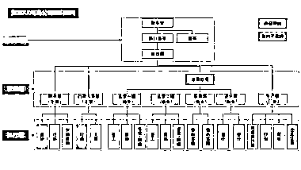
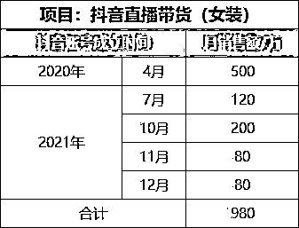

# (精华帖)(127赞)初始公司，股权设计的「四步走」

作者：  深圳刘宁培

日期：2022-07-08

哈喽，我叫刘宁培，长期在深圳，龙凤胎奶爸，哈哈。

主业企业咨询：股权、企业经营管理、商业模式板块。

生财有术第二期付费至今的会员，最近忙着带娃，才空出时间写文章。

[西瓜]一、企业在创业期：股权设计看下文

1、先讲讲合作这件事

合作，普遍分为以下5种，以下5种合作方式，合作方需要投入的金钱、时间、精力等各项成本由浅到深。

（1）一次性合作：支付佣金、采购、租赁；

这种合作常见，尤其像北上广深这搞钱的城市，谁不是身兼多职。

支付佣金：A公司有某产品或者某服务，我给A公司介绍客户，A公司通过产品实力/服务实力成交客户，客户全款结清后，A公司支付给我事先约定好的佣金；

采购：根据需求批量采购物料，如采购办公用品、电脑、文具等；

租赁：租赁办公室付租金，租赁共享单车、租赁充电宝付租金等；

 

 

（2）非核心职能合作：外包、贴牌；

外包：公司为了节省成本，将非公司核心职能的业务，外包给别的公司合作以降低成本，一般有多个备选合作公司，如劳务外包、客服外包、美工外包等；

贴牌：公司为了节省产品生产成本（自己建厂、组建生产线、开模、招人成本太高），找相对完善的产品供应链，进行贴牌生产合作（代工生产、委托生产、委托加工）。在第二产业的制造业居多，各个工厂完成某产品其中一部分的组装件；美业中贴牌的也多，像各种面膜、医用冷敷贴的源头工厂多在广州增城、佛山等地。

（3）核心职能合作：代理、加盟；

代理：商业1.0到商业2.0阶段，多出现在传统行业的的供应链环节，也就是各地代理商、经销商角色；品牌商搞定技术、产品生产，把货出给全国各地的代理商、经销商。比较大的品牌代理会细分到县级经销商，知名度一般的，一般到市级代理经销商；因为经销代理协议是几年一签约，所以大品牌商对代理商、加盟商的筛选会很重视，尤其一二线城市的代理商、经销商，轻易不换，算比较深度的合作，品牌商给代理商经销商做品牌、给差价，代理经销给品牌做渠道、做售后，双方之间互惠互利；

加盟：大大小小的品牌全国各地放开加盟，如美业、餐饮业、房地产行业等等。品牌方向加盟商门店输出：产品、品牌、营销、运营、管理、工具等方法论，一般赚3笔钱，加盟费、品牌费（管理费）、供应链差价（门店月销售额的资金沉淀），会筛选加盟商的精力投入、落地执行力，也会有品牌商运营督导做市场维护；加盟商会筛选品牌的投入金额、盈利方式、回本周期，当然，最重要的是筛选品牌是不是在割韭菜。

（4）项目制深度合作，共同开发；

利润大、回款慢的工程项目居多；

一方负责整个工程项目的洽谈、项目的签约、资金的回款率，

一方负责资金的调派、及时到位、较长周期的资金垫付，

这种项目：时间周期较长、双方都要把公司的关键人员匹配到位。

（5）股权合作：合资公司；

志同道合、能力互补、资源互补的几人，一起成立公司，按股权比例享受公司的分红。

志同道合：大家都觉得这个赛道好、项目好，能赚到钱，一起长时间的投入，时间一般不低于3年（多少公司合作不到半年就拆伙了）。

能力互补：你擅长公司战略制定、顶层设计，他擅长销售成交，我擅长落地运营，各自能力互补，能快速让公司赚钱（尽量能力互补，若不能互补，缺乏的板块是在市场上可以招聘到的）。

 

 

资源互补：企业性质不同，需要的资源不尽相同，如资金资源、品牌资源、技术资源、渠道资源等等。

第五种合作方式，股权合作合资公司，是堪比“一起步进婚姻殿堂”级别最深的合作。

找我们咨询股权顶层架构、股权比例如何设置的客户，因为他们不是志同道合、不是能力互补、资源不互补等原因，不能起到1+1＞2的效果，大概有30%左右的客户群体，都被我们劝退了，没必要成立公司合作，也没必要花多少钱去购买某公司的多少股权，用另外4种合作方式就可以了。

（生财圈子里，被我劝退的预计有20多个，没必要投资30万、100万、300万去买某公司的股权成为股东，也没必要因为哥们义气原因，把别人拉近公司做股东。股东，是要来公司为利润做贡献的，很多股东，甚至是累赘。）

2、初创公司股权16坑。

之前在生财分享过两篇初创股权设计的文章，有兴趣看链接，不重复写了。

链接1：

链接2：、

之前广州见面会分享的文件：初创公司，股权设计的“四步走”-生财有术广州见面会分享  见面会分享时间有限，常见的股权16坑没时间分享，在这里补充：

（1）控制权角度：

①平均主义、股权均分、雨露均沾；

2个人的股权比例是50%、50%，

3个人的股权比例是33%、33%、34%、

4个人的股权比例是25%、25%、25%、25%.....

缺点：公司没有话事人。

芝麻绿豆点的小事，大家都要开会来讨论下；

负责成交的股东，说要前端销售给高提成，才对销售更有激励；负责落地的股东，说要后端落地给高提成，才能给公司带来口碑跟转介绍；公说公有理，婆说婆有理，没有人能绝对的拍板，没有拍板，就没有执行，还没开始对外扩张市场呢，内部分配方面先出问题了；

②股权过度稀释

缺点：后期容易失去控制权。

创业之初，创始人前期不要把股权稀释过大。初创期，创始人最好占比67%以上，发展期占比52%以上，扩张期占比35%以上，如果不懂股权定层规划，没有提前用有限合伙 

 

企业架构、金字塔架构、一致行动人、投票权委托等方法把控公司的控制权，再接下来第二轮、第三轮的股权稀释，剩余股权比例越来越低，最严重后果就是被踢出局。

③大股东被小股东绑架；

如股东人数是3人，任何2人的股权比例之和都大于第三人，1+2＞3

这种股权比例，也是公司没有话事人，没人做主；

最经典的案例就是49%、49%、2%，两个大股东都被2%股权的人牵着走；

④员工直接持股；

缺点：退出变更费时费力

初创企业，不建议做股权激励，没有意义，轻则被员工吐槽画饼、职场PUA，重则隔天员工离职。即使有员工认可公司未来的发展，股权激励用虚拟股形式、代持的形式、期权池预留形式、有限合伙企业做LP形式等形式，间接持有公司股权，不要到工商变更直接持有公司股权。免得员工没完成业绩退股、或者员工离职退股，要去工商办理一堆的手续。

（2）进入机制角度：

⑤前期资源占股；

没任职、没出钱、没技术专利，提出用资源来换股权，如果他敢签对赌协议约定多长时间内给公司带来多少利润，完成了，再给股权；如果不敢签对赌协议，就要占股，有多远滚多远。见不得这种便宜占不尽的人。

这种有资源的人，说得好听会资源整合，说得不好听，就是个二道贩子。

⑥兼职创业占股；

创业成功是个小概率事件，说九死一生也不为过，多少创始人呕心沥血吃睡在公司，都不一定能保证创业成功，一直存活下去；在创业公司里面兼职，还想拿公司股权，不是耍流氓吗！我们接过最夸张的案子是一个公司里面6个初创股东，只有两个人是全职的，另外四个人都是兼职的，其中一个兼职的人身上挂着七八个项目，天天东奔西走到处飞。

⑦老板想给，员工不想要；

公司渐渐赚钱了，提出做股权激励，给核心员工股权；员工说不要。

员工不知道股权有何用、意义何在。

员工不知道股权在未来每年能给到带来多少分红。

员工不知道股权在未来十年八年能带来多少溢价。

员工不知道股权什么时候行权、什么时候可以卖出套现。

 

 

⑧股权白送员工；

老板很大方，有格局，为了稳定人心，真心想给员工股权，也知道股权最后的价值，提出股权白送给员工，不需要员工出任何资金购买，但是，员工跟老板所处的维度跟思考方式不一样。员工甚至还会反问老板：公司的注册资金是实缴还是认缴？如果产生债务，是否需要承担？

（3）分配机制角度

⑨按出资额分配；

出钱占大股，资金型驱动的企业可以按照出资额分配。

资源型驱动的企业、人才驱动型的企业、技术驱动型的企业，慎重按出资额分配。

很多案例是这样的：出钱多的人占大股，对公司的利润没有多大的贡献，每年年底分走公司最多的钱，实际操盘人前期因资金压力出资少，但对公司利润贡献多，却分走少部分的分红。

案例结果是这样的：操盘人偷偷在外成立一家一样业务体系的公司，不断将公司现有业务转移，利润转移，后面出资人发现了，就是对簿公堂打官司，两败俱伤。

⑩天使投资占大股；

资金型驱动的企业可以，资源型驱动的企业、人才驱动型的企业、技术驱动型的企业慎重。

理由同上：另起炉找——业务转移——利润做空——对簿公堂——两败俱伤

⑪股权一股独大；

股权比例如下：90%：10%、95%：5%、99%：1%。

传统制造业中，大部分公司都是这种股权比例，都是家族企业为主，甚至是100%控股，无可厚非。但是已确定好几个人要合伙做这个项目了，这种股权比例，没有激励，没有激情，小股东的激情可能就是员工高管的激情。

⑫不知道怎么分；

分多了，赚了？分少了，亏了？这个话题内容比较大，放在下一个环节。

90%以上的初创企业会碰到的问题，经营权（员工）、所有权（股东）混为一谈。

（4）退出机制角度；

⑬人走股走；

公司成立时没约定好退出机制。初创股东因各种原因离开公司，但是没有退股，保留着公司的股权。

一般两个结果：

 

 

（结果一）公司赚钱分红，每年要给离开的股东分红，后期找到可以代替离开股东的人才时，没有更多的股权可以稀释了；后期资金要进入时，看到走的人还不断分红，一般会要求公司先解决这种历史遗留问题；（结果二）公司亏钱负债，离开的股东要承担承担债务风险；

⑭创始人淡出运营不退股；

公司成立时没约定好退出机制。

创始人不参与公司运营，跑去一个更好的赛道上发展，如果对公司贡献最大的创始人都慢慢退出了不干，还不退股，未来的高管股权激励、资金进入方面，只会越来越难，或者是每年保持利润不变。这种情况下，其他有激情打算继续在这个赛道做的小股东，会想办法另起炉灶。

⑮退股回购价格无约定；

每个人对股权价格都有自己的认知。不管是按照市盈率估值、市销率估值、净资产估值等，大家提前约定好退出回购价的计算方式。江湖再见，还是朋友，一来还是很多合作机会的。我们见过最奇葩的就是，大股东派人殴打小股东要求退股，刷新三观。

⑯竞争对手持有公司股份；

公司成立时没有约定好股东的优先购买权。不管是哪个股东退股，公司的现有股东是有优先购买权的，如果没约定好，股权落到竞争对手手上，竞争对手想要整垮你，方法很多。

3、90%以上的初创企业会碰到的问题，经营权（员工）、所有权（股东）混为一谈  问题如下：

三个合伙，ABC出资相同，AB都不参与经营和工作，该怎么分配股份和工资？

三人合伙开店，一人只出钱不出力，二人出钱又出力，请问怎么分股？

四人合伙开店，四人出资一样多，两人经营店铺，两人不参与店铺经营只出资，经营收入该怎么分？

跟朋友合伙开饭店，我出15万朋友出10万，他在店里管理工资定的1.1万，股权如何分配?

三人合伙，一人出全资偶尔出力，两人全职出力不出资，怎么分配股权比较合理？

请问三人合伙做音乐餐吧，我和一人出资各50万全职出力，另一人出资100万不出力。

股份三人平分是否公平？

100万元的店，2人各占一半股，A只持股份，B持一半股份还加管理技术，怎么分红? 和朋友合伙开服装店，资金各出一半，他负责店铺管理，我偶尔帮忙，请问股份如何分配合适? 四六分呢?

 

 

两个人合伙创业，一个人出资不管事，另一个人出资又出力，股权该怎么分？

三人合伙开餐饮店，都全职参与店铺经营，出资比重为57%:28%:15%，这种情况下，如何分红才公平？

......

以上这类的问题，6个字解决“先员工，后股东“。

顺便讲下企业经营管理的基本概念：

几个志同道合、能力互补、资源互补的人一起成立公司，做某个项目；做好公司一年0收入的资金储备，不要因为资金链断裂公司倒闭；画好公司基本的组织架构图，在组织架构图上定岗位职责、每个岗位定薪资待遇（含提成）；

公司年利润=公司年收入-年支出（图1所示），

切记：股东享受的分红是公司的年利润（图1标蓝部分）；

如果A即是公司的股东，又是公司的员工，切记，先是员工，后是股东。

A的第一层身份先是员工，先是按照公司的岗位职责完成公司的要求，正常领取底薪+提成，如果A不能完成公司的要求，是不能继续在岗位上任职的，等着年底分红就行；

A的第二层身份才是股东，公司年收入-年支出，剩余的利润，按照股权比例分红。

很多案例就是这样子：ABC三人，一人负责产品，一人负责销售，一人负责运营，公司赚钱之后，每个人都说自己所在的岗位对公司贡献有多大，要分多点股权。

这是两件事情。股权是公司创立之初就确定好的，项目该怎么分红就怎么分红，提成该怎么拿就怎么拿。如果是新项目还好说，可以重新成立公司或者成立事业部单独核算的方式进行分红。如果是老项目  ，因为赚钱了，都觉得自己贡献多分红少，只能说吃相都很难看。

讲1个朋友的案例。

朋友L，跟M两个人，在惠州淡水开了一家苏宁易购；

两人关系好，哥们义气，一起出钱付加盟费、买样机、租店铺付租金；一起全天在店里面上班销售；都约定不拿薪水，每个月的收入减去产品成本、房租水电，剩余利润五五分；

前面做得挺好的，到第9个月的时候，L来跟我诉苦，现在门店90%的业绩都是由他贡献的，M越来越懒，对门店的业绩贡献只有10%了，觉得很不公平，做得多，分的一样多，想拆伙了，这样子还不如自己做。

 

 

这就是明显把所有权、跟经营权混为一谈了。

如果一开始就约定好不同的电器的提成比例。谁销售的产品，第一层身份先是员工，先按照员工的身份拿走对应的提成，剩余的月利润再是股东的身份五五分。

切记：先员工，后股东；如果员工的岗位职责不能完成，就不要在公司任职当员工。很多初创企业都是把经营权（员工）跟所有权（股东）混为一谈，最后都分配不均，草率收场。

[西瓜]二、企业在发展期：要给员工做股权激励的看下文

1、为什么要做股权激励？

初创股东们，要把时间精力放在投入产出更高的地方。项目0-1跑通了，去掉所有成本，赚钱了，接下来考虑的是放大，1-10，10-100的阶段；

创业期，0-1的阶段，股东们亲力亲为将所有环节跑通，忙的时候一起熬夜打包发货都是常态，但是进入到1-10的发展期复制阶段，初创股东再去做打包发货的杂事，时间就会变得廉价，东西全部交给别人做不放心，怎么办？

培养第二梯队的股东，让这些核心高管成为“老板”，让他们为自己打工；

如：

互联网项目：知乎带货、抖音短视频带货等，跑通第一个账号，就同步启动第二个、第三个项目账号.....第100个账号.....

实体项目：开一家理发店、美容店赚钱了，接下来到另外一个客户属性相同的地方开店，把之前跑通的事情重新做一遍.....

第二梯队如下图中的管理层：（图2所示）

这是我们给一家深圳电商公司做的组织架构图，第二梯队的股东就是中间的管理层。稀释的股权比例是20%，财务部主管跟行政人事主管的股权比例各3%，运营经理的股权比例是8%，生产部的股权比例是6%；

2、为什么股权激励有用？

股权激励="钱"，所以股权激励有用。

无论是股权激励，还是积分卡、KPI绩效、OKR、阿米巴、事业部单独核算，说到底就是合理的分钱、合理的刺激；上班族做副业是为了搞钱，有资源的人创业是为了搞钱，在一家稳定发展的公司，想办法拿到公司的股权带来的分红，也是为了搞钱；

 

 

（1）看短期：分红权；

每年分红，能看到每年增加到手的收入是多少。

假如该深圳某电商公司年利润是500万，A是运营经理，有公司8%的分红，正常薪资水平是年薪24万，分红是40万，合计税前年薪是64万。

如果竞争对手开30万、40万想要挖走运营经理，不可能。即使竞争对手给出的薪资超过64万*1.2倍=76.8万，运营经理也不会冒险离开，毕竟公司明年的利润可能做到600万，到手的综合收入更高，而且去到另外一家公司也有被卸磨杀驴的可能。

（2）看长期：股权增值权；

公司走到最后，一般是4条路径。

第一条，经营不善，倒闭；

第二条，赚钱，利润可以，不会被时代淘汰，家族传承继续做，继续赚钱；

第三条，被收购，被资本看好公司的业务发展或者是财务流水，想要合并财报做上市筹划，可以按行业的市盈率收购，被收购时手里的股权可以交易套现，十倍溢价；

第四条，公司做大做强，走上市路径，几年后套现，百倍溢价；

如果A通过对公司的利润贡献，得到公司的股权，这个公司做大做强，走的是第三条、第四条路径，手中的股权很值钱，很香的；

不管是看长期还是短期，不谈使命愿景价值观的前提下，咱都是为了钱打工，马老师说的很对，辞职就两个理由，要么钱没到位，要么心受委屈了；大部分，还是钱没到位。

有客户问我们怎么更好地管理95后、00后......好家伙，我也想知道，除了不给他们更多的钱，还有什么方法可以管理这群嗨点、泪点比较高的、动不动就辞职的95后、00后。

3、股权激励12步骤；

进入机制层面：

（1）定目标：分存量利润、分增量利润；

①分存量利润；

老板有新项目要启动，只有20%的精力放在原项目上，不想操心太多，又不想公司高管被挖走导致利润下滑，拿出公司的利润分给核心高管。

项目年利润500万，明年的年利润目标还是500万，跟高管们约定，明年继续做到500万的利润目标，会拿出20%的利润进行分红，也就是100万。假如共有5个高管，则人均年收入增加20万，竞争对手想要挖人，就要在正常行业薪资水平上+20万挖人，或者配股权。

 

 

悦刻案例：

这里讲一个案例，熟悉我的圈友知道我喜欢找被动收入的项目，像纯托管的优剪，项目稳定不用被割韭菜，今年发现了另一个项目“RELX悦刻”，认识了悦刻公司的朋友，也认识了一些深圳店老板，了解后发现门店坪效是“优剪”的三倍，心痒痒的，不过现在不能开，要等到10月1日之后。

认识其中一个老板，在广东区域开了12家店，每家店每个月贡献8000-10000左右的利润。

他的分红方案如下：

门店收入：员工每天收款，员工也看得到，门店支出：房租水电杂费、产品成本、员工底薪（几乎都是2500-3000左右的底薪）

利润=门店收入-门店支出，利润跟员工五五分成，这种分红机制，每个员工都拼命做，遇到门店没货催老板订货，遇到消费者砍价尽量不给优惠送礼品，很多事情都不需要老板操心。

这种分红方式，员工拥有了门店50%的分红权，

而很多其他门店用的就是阶梯式提成的方式，固定底薪4000左右，完成3万业绩提成3%，完成5万业绩提成5%之类的。不同的分红方式，同样做5万业绩，员工到手收入差一倍。积极性差不别不言而喻。

②分增量利润；

原公司项目利润500万，跟高管约定，明年超出500万利润部分，46分、37分、28分等；另外一种是减少式分配机制，生鲜行业的损耗高达30%，永辉超市生鲜的损耗只有5%，方法论就是把减少损失的损耗部分，按照不同的职级（经理、主管、店员等）进行分配。

（2）定时间；

确定考核开始时间、考核结束时间，分红发放时间、取得股权与行权的时间。

尤其高管在意的是分红发放时间，不要拖，及时激励。

如美业行业是轻资产行业，他们的分红时间可以做到1季度1分，甚至是每个月分。

（3）定价格；

0元出资：无需员工出资，在职满多少年（忠诚度），完成了岗位职责内的所有任务，没有大错；

折扣价出资：不交钱不交心，白得不珍惜，让员工按照市场价的几折认购，小米最初的股权激励就有三种方式：全额工资+少量股份、一半工资+一般的股份、少量的工资+较 

 

多的股份；

市场价出资：按照双方约定好的价格出资，计算方法有很多种，一般都是加倍买；

（4）定权利；

实股：分权分利润，工商注册的实股，一般对象是资本（土豆协议，保护投资人，避免离婚分权）

虚拟股/干股/分红股：分利润不分权，没有管理公司的决策权，对象是高管为主；用的较多是vesting逐年成熟的方式。

分配机制层面

（5）定来源；

来源：创始人、联合创始人

（6）定稀释方法；

方法一：；同比例稀释，如创始股东的股权比例是60%：30%：10%，约定同比例稀释20%的股权给到高管，

股权比例变成60%×80%：30%×80%：10%×80%：20%，即48%：24%：8%：20%；

方法二：无中生有法：，如创始股东的股权比例是60%：30%：10%，约定在100股的基础上增加20股给到高管们，公司的原股本是100股，增加20股，也就是120股  股权比例变成60%÷120%：30%÷120%：10%÷120%：20%÷120%，即50%：25%：

8.3%：16.7%。

股权顶层设计一开始就做好布局的，用同比例稀释的方法；

公司是人力驱动型公司，不断有同领域的人才加入公司，让公司越做越大的，用无中生有法；

（7）定数量；

顶层是控制权，基层是激励权。

激励比例要确保维护企业的控制权、激励对象能够真实地感受到激励。

企业的控制权：释放给员工的股权激励额度尽量低于总股权的1/3。

感受到激励：为什么一直强调企业处于初创期，来年能不能存活下去都是个未知数的时候，不要做什么股权激励，因为没有激励性，没有作用效果。

公司年利润50万，拿出20%出来分，也就是10万，10万还要分给5个人，人均2万块=月工资增加1666元，真不如直接加底薪来得激励。

除非你有把握公司的利润未来几年有指数型的增长，并且员工也知道有这个增长。

讲下龙珠圈友的案例。（图3所示）

 

 

项目成立的时间是2020年4月份，整个团队刚尝试抖音直播带货。

零售三要素，人货场，

人：长得好看口才好的主播，对公司忠诚度高最好了；

货：物美、价廉、交付快、可账期的供应链资源；

场：线上，抖音直播，抖音直播运营玩法要熟练；

团队开始，各种摸索试错烧钱，此时跟员工说投钱来认购股权，股权以后很值钱的，员工跑得比兔子快。但当你第一个账号跑通了，整个项目已经摸索成功时，有数据说话，再跟员工谈股权，醒目的员工懂得公司未来走矩阵玩法，股权未来会出高于市场价，想办法要多点股权。

假如这时候花100万购买公司10%的股权，公司2021年同步操盘了另外四个账号，加上最初的账号  ，做到了月销售额980万。如果2022年，每月稳定在1000万左右，年销售额在1.2亿左右，去掉所有成本，净利润15%，年利润1800万，10%的税前分红就是180万。一年就回本了，股权值钱。

当看到公司年利润1800万的时候，再说花100万买10%的股权，那就是异想天开了。

所以：除非把握公司利润在未来几年有指数型的增长，且员工知道有这个增长。那在盈利初期就可以做股权激励，不管是运营牛人、美女主播、上游供应商，股权绑定，竞业协议一签，以后就在这家公司好好干。一起赚钱，一起分钱。

（8）定对象；

①内部：管理层高管、核心员工。

核心员工也参与的原因是，如果高管真的被竞争对手挖走了，核心员工可以快速顶上，不会出现业务真空期。

②外部：上下游合作伙伴、资本；（根据不同的谈判情况，定虚拟股、实股）

（9）定模式；

以下内容较为复杂，有个简单概念就行，不具体展开。

①创业期：虚拟股激励（干股/分红股（在职分红，在职期间享有)，增值权；）、业绩股激励、超额利润激励法；

②发展期：实股激励、虚拟股的超额分红+在职分红+少量实股（注册股）股权激励；

③扩张期：实股激励、（内部创业股激励）、金色降落伞股权激励（老员工）、虚拟股激励、（岗位股权，做到这个职位，就给）、知识股（合理评价，双方利益）；

 

 

股权，是个分钱的工具，也是整合资源的工具。（图4所示）

希望大家把股权工具运用好，将公司做大做强，一起有格局的分钱。而不是像某公司一样批量割韭菜，某火锅店的某明星，大家感兴趣的话，可以去查下持股51%的四川至膳，名下有谭鸭血、贤合庄、  烧江南、黄鱼先生、天然呆奶茶店、炊二哥、灶门砍、娃三.....

退出机制层面

（10）定退出时间；

约定多长时间内不能退出，避免套现。

（11）定回购价；

人走股留，对彼此都好，约定好回购价跟初创股东的优先购买权。

退出机制，是共赢，不是博弈。江湖再见，还是朋友，还有很多合作的机会。

（12）定合同；

白纸黑字，不要口头协议。

写在最后：

股权顶层设计的问题找我（没上市规划的），1小时解决。

需要上门落地股权方案的也可以找我，1个月内解决。

https://t.zsxq.com/fyNbAuR https://t.zsxq.com/UBqVvjU https://t.zsxq.com/27eqV7A

 

 

 

 

评论区：

吴一村 : 太适合初创的圈友了，点赞，受用[强][强][强]

乐天 : 想啥来啥～生财真是百宝箱～感谢圈友分享～

一时 : 这个太宝贵了，避免了很多坑

宝哥~ : 厉害了  ，  宝宝需要喝奶粉可以联系我呀  ，我这边做批发的

书仔 : 哈哈哈，每个股权的书都是一样的内容

深圳刘宁培 : 刚把四张图片跟广州见面会的文件上传，看过的圈友，可以再看一遍。[得意]

设计师小元哥 : 目前四人技术团队，每个人都是25%股份分，然后确实存在执行力不够的现象！[流泪]

深圳刘宁培 : 如果你们都意识到这个问题的话，可以解决。而且要尽早解决，赚小钱还好，越做越大的时候，公说公有理，婆说婆有理。

 

 
