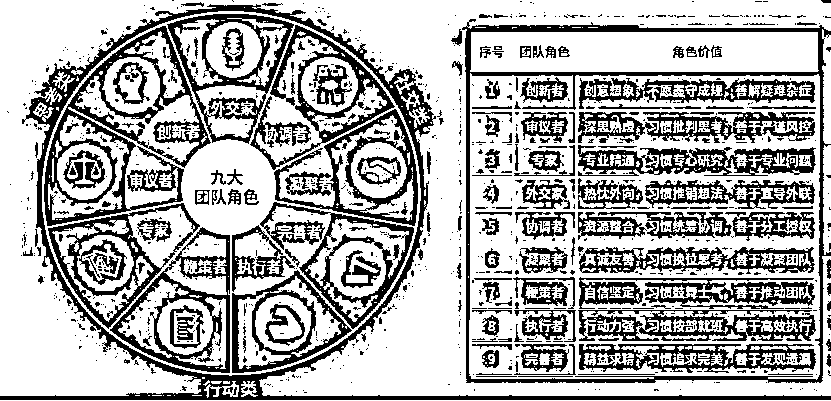
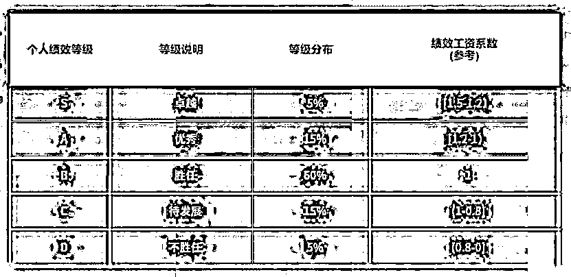
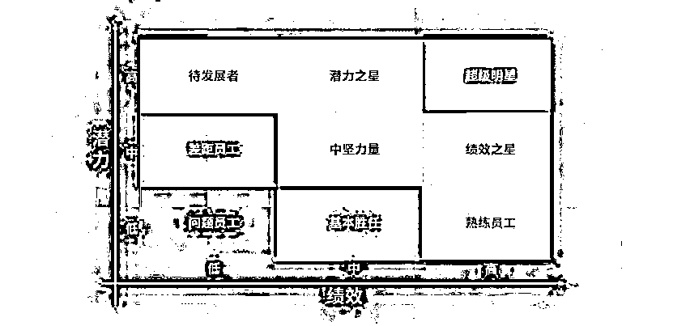

# (精华帖)(126赞)创业团队走向规范化管理时，绩效考核怎么做，才能避免给团队埋雷？

 

 

作者：  鱼丸|亦仁助理

日期：2021-07-14

大家好，我是鱼丸，今天邀请了一位对人力资源和团队管理有丰富经验的嘉宾，来给大家分享一个创业公司都非常头痛的问题：

到底怎么做绩效的考核，才能真正发挥作用，而不是引发各种新问题？

相信这个话题，很多创业者和管理者会很感兴趣，我们这一期的「生财合伙人」嘉宾@许范范  老师就会做一个详细的分享。

许范范老师可能有些圈友已经读过她的文章了  https://t.zsxq.com/muvB2RR  ，她是一家世界 500 强区域人力副总，前人力资源咨询公司高级顾问，也是一名 10 年的职业发展教练，最擅长的是人力资源、团队管理。

她在文中说到：

“我见过很多创业公司，考核结果只有一个应用目的，就是分钱。也不能说有错，但就是有点浪费，绩效考核的应用途径远远不止分配奖金这一个，其实考核结果在人才选用育留的各个环节，都可以有效应用，包括奖金分配、晋升淘汰、任务选择、荣誉表彰、经验分享、人才盘点、人员招聘、优化考核等。”

那么怎么落地呢？她在这篇分享中给出了一些思考框架和工具，干货不少，可以做笔记好好研究，比如：

 

 

“整个创业公司和团队，要聚焦的目标是什么？如果这里没有梳理清楚，后续的所有工作都没有意义。创业团队的老板，要对此保持清醒和坦诚，任何想要先跳过这一步，思考执行下面那些相对容易步骤的想法，都是考核的虚假动作。”

“以财务指标为最终目标，通过客户指标、运营管理指标、团队学习成长指标逐步推演达成，本质上是关于公司战略因果关系的不断推导。”

“因为基于「承诺与一致」的心理，自行设定的目标与承诺，更有可能在未来工作中激发一致性的行为。”

“为什么设置这个岗位，一般可以用「为***群体提供***的服务/支持，以解决/提升****」这个公式来描述。这里最容易出现的误区，就是错把职责当成岗位价值，作为考核指标。”

……

来，开始她的分享。

目录

一、考核到底有哪些利弊

二、绩效考核如何操作

1\. 考核指标如何设置

2\. 考核依据如何收集

 

 

3\. 考核结果如何出具

4\. 考核结果如何应用

5\. 如何对考核结果进行反馈辅导

三、总结

---正文---

大家好，我是许范范，被戏称为生财「一文打天下」的人，在生财发表的第一篇也是唯一一篇文，就被加亦仁大大加了精华、邀请加入龙珠俱乐部、参加线上私董会。

但我并不擅长赚钱。我是一家世界 500 强区域人力副总，前人力资源咨询公司高级顾问，也是一名 10 年的职业发展教练，最擅长的是人力资源、团队管理。

最近才发现，我擅长的领域对生财的很多小伙伴也是有价值的。《创业团队如何招募面试到合适的小伙伴》这篇文，有近百位圈友加了我，好多人拍照给我看几十页的万字图文全部打印了出来，让团队研究学习，还是彩印。我真的无比感动，深受鼓舞。

亦仁大大说，不仅是面试，绩效、薪酬、员工发展，很多这些团队管理的话题，圈友们都很急需。或许，我可以帮生财圈友们管管后院儿，成为大家团队管理的大内总管。

那今天给大家分享一个常常面临的话题：绩效考核管理。

和很多带团队的龙珠俱乐部圈友们交流过，绩效考核这个话题让人头秃：考核有什么利弊？到底要不要考核？什么时候考核？考核谁？考核什么？怎么考核？考核完了怎么用？

 

 

那我今天依然尝试用一篇万字长文，努力帮大家解答一些疑惑，总字数 10119 ，阅读大概需要用时 25 分钟，将从几个维度进行分享，接下来，先从考核的利弊开始讲起。

一、考核到底有哪些利弊

考核往往发生在创业团队业务规模、人员规模上了一定体量，复杂度提升，超出了创业公司老板能够一眼衡量、评估的范围，靠人治已经行不通了。

而无法衡量就无法管理，当公司迈入规范化管理阶段，绩效考核就是解决目标传递、衡量评估的问题。通过绩效考核，对团队进行过程管理，以考核作为抓手和指挥棒，辐射更大、更系统的管控范围。

考核目标是管理员工愿不愿意（态度）、能不能行（能力）、允不允许（机制）三个层面，从而达成组织能力提升、业务目标达成的效果。

绩效考核让很多创业团队负责人、团队成员闻风色变过，因为如果做得不好，确实徒增忧患，具体会导致这样的几个方面的问题。

**1. **绩效考核会导致的弊端

**1**）聚焦短期利益，忽视长远利益

绩效考核很容易聚焦于当下看得见摸得着的指标，而对团队未来有深远影响的、短期内难以明确见效的部分常常被忽视，严重的时候甚至会误导整个团队的方向。

 

 

比如有些公司，考核指标核心都是当下的营收、利润，而忽略甚至损害了长期用户留存、客户满意度等会带来的长远利益的指标。

**2**）重视业务前线，忽视支撑的中后台

能够个团队直接带来业绩和营收的销售、商务等，在绩效考核中会被倾斜，而负责产品研发、质检、运营等中后台，常常会被忽视。

在老板看不见的地方，中后台搭建的资源投入、团队积极性、话语权等，会随着考核导向极受影响，在业务竞争力的打造上埋下巨坑。

**3**）破坏公司氛围，资源抢夺部门墙高垒

在短视的考核压力下，业务部门可能会相互拆台，想方设法从公司整体利益中为自己部门捞资源、捞支持、捞好处。信息、资源、经验不再共享，形成一个个互相防备、猜忌的秘密基地。

中后台支持部门因为没有功劳可凸显，只能聚焦于不出错，于是处处照本宣科，官僚主义开始滋生。

**4**）极力逃避责任，破坏奋斗创新精神

在唯考核至上的环境中，大家开始只关注切身利益。一旦出现问题，第一时间不是解决问题，而是想方设法逃避推脱。管理者也倾向不在容许团队创新，创新意味着承担风险和出错。

**5**）团队培养短视，忽视长远梯队建设

 

 

部分老板下面的管理者，容易只关心绩效达成也眼前利益，不再重视员工的感情，而是作为完成绩效的机器，对员工带着批判和审视的眼光，对照考核要求抓小辫子。员工压抑主观能动性，严格遵守考核要求，只付出手不付出脑和心。

是不是挺悲伤的？我就遇到过一个创业的朋友，上面绩效考核的坑几乎全踩中了。进行绩效考核后，公司都关注销售额去了，奖金高啊，其他部门好多人也提出想要转销售。

产品的质检懈怠了，结果出了很大的纰漏，损失了一笔巨额赔偿，而相关部门却都在跟她解释推责，销售线和质检线的老大在她的办公室，当着她的面互相指责骂街。

她说那一瞬间，她觉得自己一定是脑子被驴踢了，才会想要搞绩效考核，这考核做了还不如不做。真的都是绩效考核的锅么，是不是不搞绩效考核就不会导致这些弊端了？别急着下判断，我们再来看看如果绩效考核做的好，会有什么利好呢？

**2. **绩效考核会带来的利好

**1**）目标聚焦层层分解到岗到人，有效落地

随着团队人数越来越多、业务越来越复杂，超出老板的管理半径，而且不再能只看结果，必须也对过程进行规范化的管理，绩效考核是一个必然的过程。

绩效考核是一个聚焦工具，创业团队很容易有很多想法、什么都想试一下，导致无法聚焦，而绩效考核可以保证相对集中公司的方向，各个群体都能马车头朝向一个方向。

绩效考核是一个沟通工具，将公司的目标层层宣导传递下去。绩效考核是一个落地工具，通过有效的分解方法，可以将目标按照公司-部门（或小组）-岗位-人，层层分解到岗到人，有的放矢。

**2**）聚焦组织能力提升，不再纯依赖牛人

 

 

绩效考核一般都会协同推进公司规范化、标准化的进程，通过系统规范的目标设定、考核推进、反馈辅导等方式，能够有效推进公司制度建设、经验传承、规范流程等，实现组织能力的聚焦提升，组织能力成为公司新的核心竞争力，而不会因为个别牛人的进来、离开、状态好不好大起大落。

**3**）共同利益绑定上下同欲，精诚合作

考核目标重视共同目标，考核目标间强关联、强绑定、强协同，考核结果的应用也将共同利益设定成强绑定，部门和部门间、员工和部门和公司间，就能激发同舟共济、携手共进的状态。

**4**）作为激励晋升依据，公平公正鼓舞士气

绩效考核可以规避吃大锅饭的问题。考核结果作为物质激励依据（工资、奖金、期权、福利）、晋升激励依据（提拔、调整、降职、淘汰）、树立标杆依据（荣誉、表彰、站台），看得见争得到的、客观公平公正的考核结果，会让员工更有预期，鼓舞士气。

**5**）作为能力提升牵引，倒逼人才梯队建设

有了考核的指挥棒，员工的能力提升更有聚焦的方向。有效考核指标的设定，老板下面的管理者，管理团队的能力会得到系统历练，兼顾长短期目标，培养后备板凳队员，推动人才梯队建设。

是不是又有点心动了？考核利弊之间，一正一负，对公司业务战略、组织效能、团队效能等的影响，天差地壤。

二、绩效考核如何操作

 

 

怎么能让考核尽可能发挥价值，避免弊端呢？取决于5+1的影响因素。

5是指绩效考核指标的设置、考核依据的收集、考核结果的出具、考核结果的应用、考核后的反馈与辅导。1是指管理者的团队管理能力。

**1. **考核指标如何设置

这里最重要的，是如何平衡业务目标与个人目标、长期目标和短期目标两对矛盾。

有些公司图省事，或者管理层自己没想清楚，就想把责任下沉，让员工自己去想，自己个自己定考核指标，挺多公司干过这个事情。给大家举个例子。

我之前在咨询公司的时候，就见识过一家公司，他们的绩效考核全部都是自下而上的。

怎么个自下而上法呢，让员工自己报目标，过程中可能领导和员工之间拉锯战几次，然后层层往上汇总，汇总到部门于是部门的考核指标也有了，再汇总到公司于是公司的考核指标也有了，最后就这样决定了所有人、部门和公司每个年度的目标。

这就是一种挺可怕的考核方式，管理层是简单省事了，但整个公司缺乏统一的导向，更缺乏衡量个人设定的指标、数据的有效性，而无法衡量就无法管理，绩效考核也就形同虚设。

指标的设定是最关键的一个步骤，这里有三大类的指标需要依次想清楚，并不是上来就是每个人的考核指标是什么。

我在上一家平台公司，领导让我重新设计员工绩效考核体系的时候，我就跟领导说那公司的战略部门要再一次理顺公司的考核体系，而且人力资源部要全程参与。

 

 

因为公司的考核体系、部门的考核体系，是员工考核体系的前提，所以要依次分析设计。并不是上来就是每个人的考核指标是什么。

**1**）创业公司**/**团队的考核指标是什么

整个创业公司和团队，要聚焦的目标是什么？如果这里没有梳理清楚，后续的所有工作都没有意义。

创业团队的老板，要对此保持清醒和坦诚，任何想要先跳过这一步，思考执行下面那些相对容易步骤的想法，都是考核的虚假动作。

对于创业公司，如果业务体系已经比较复杂化、规范化、过程有很多量化指标可以评估、可以按部就班推动，可以使用 KPI 的考核方式。

如果无法那么量化、依赖团队的主观能动性，可以使用 OKR （目标与关键结果）的考核方式，大部分创业公司比较推荐 OKR 的方式，虽然有很多人也都建议过 OKR 不适用于考核，但从实际应用来看，关键结果的部分也是可以有效作为指挥棒指引团队的，指挥棒本身就可以是一种考核导向。

那问题就来了，怎么梳理出公司的考核指标呢？推荐 2 个工具。

第一个工具：战略平衡记分卡

分别从财务角度、客户角度、运营管理、学习成长四个维度，梳理公司核心目标和关键指标。平衡记分卡可以有效平衡创业短期目标和长期目标、财务类目标和非财务类目标，两对经常产生矛盾的目标。

 

 

以财务指标为最终目标，通过客户指标、运营管理指标、团队学习成长指标逐步推演达成，本质上是关于公司战略因果关系的不断推导。帮大家梳理了一个样例如下：

第

第二个工具：商业模式画布**9**要素

从价值创造、客户管理、资产管理和财务管理四大界面，包含价值主张、客户群体、客户关系、关键业务、重要合作、核心资源、渠道通路、收入来源、成本结构九大关键要素。

这是我比较推荐的分析工具，在网上你也可以找到大量的滴滴、樊登、小红书等各种各样企业当初他们在创业阶段的商业模式画布。帮大家梳理了一个分析的核心问题如下：

 

 

平衡记分卡和商业模式画布，其实都相当于是给到创业公司尤其是老板一个仪表盘。如果把公司业务的开展看做一次飞行航程，仪表盘就是让很多过程和结果指标可视化、可衡量、可预判。

防止只关注速度（参考公司利润）这样的指标，还能够时刻关注到油耗、油料、高度、剩余里程等这样的指标。

公司的目标聚焦到关键的重点，抓住了核心的影响 80% 业绩的 20% 的关键指标，绩效考核的拆解才有了核心依据，确保方向不偏离。

**2**）部门**/**小组的考核指标是什么

部门/小组的考核指标是从公司指标中拆解而来。在这个过程中，我遇到过的最大阻力，往往也是各家公司通常都会遇到的阻力，就是从公司目标到部门/团队目标如何拆解？如何保持不同部门/小组间的协同？如何让各部门/小组认同？

 

 

建议可以通过部门/小组 OKR 研讨会的方式确认。当时我们采取的也是类似的方案。当时尽管公司目标出来之后，公司的负责人基本上就已经把各部门的指标也都想好怎么分配了，但我们仍然建议组织各部门/小组负责人用研讨会的方式确认，并且引导他们自己设定 OKR 。

因为基于「承诺与一致」的心理，自行设定的目标与承诺，更有可能在未来工作中激发一致性的行为。不用要求一定要一次性做到完美，对于创业公司而言可以不断按照 D、不胜任 C、待发展 A、优秀的原则，小步快跑、阶段回顾、持续迭代。

以下为大家提供一个示例：其中目标和关键结果，就是部门/小组的考核指标，同时也是该部门/小组负责人的考核指标。

对于目标设定：

强调方向明确鼓舞人心，有时间期限（考核周期），与公司业务价值充分结合，由独立的团队来执行目标。

对于关键结果的设定：

 

 

要具体的、量化的、有挑战性的，要蹦起来才能够到的，同时一定要上下左右对齐一致，充分认可；只表述对目标有关键影响的关键项结果而非全部罗列，基于结果而不是隔壁的职责；同时每个结果要有明确的责任人。

**3**）岗位**/**个人的考核指标是什么

当公司、部门/团队的考核指标完善后，岗位/个人的考核指标才能有效进行，也会更加聚焦、精准、高效。岗位和个人的考核指标也依然可以采用 OKR 的梳理原则，其中目标，也就是岗位价值的部分。

建议从 2 个层面进行考虑，一个是岗位价值，一个是角色价值。

第一：岗位价值

比较好理解，为什么设置这个岗位，一般可以用「为***群体提供***的服务/支持，以解决/提升****」这个公式来描述。

这里最容易出现的误区，就是错把职责当成岗位价值，作为考核指标。

举个例子，如果一个人的岗位是苹果果农，他的最终考核指标就是苹果成熟个数和成熟率，为了完善过程结果考核指标，可以倒退追加苹果结果个数、结果率、苹果树成活棵树、成活率等。

而这个过程中的栽树、松土、施肥、捉虫、授粉等都只是职责，并不是岗位价值。

第二：角色价值

这个之前很多创业团队可能没有考虑过，创业公司一般人数不多，很多人员其实承担这不同的角色价值，推动团队的工作优化。

 

 

除了以上两个维度关注的工作产出，还需要在考核中兼顾人才梯队建设、公司价值观的传递宣导，建议普通员工的考核指标可以如下设置。

这个目标任务书可以由部门/团队负责人，和岗位员工共同沟通确认，逻辑和部门/小组考核指标制定研讨会是一致的。

 

 

如果在研讨的过程中，发现很难梳理出岗位的核心目标和关键成果，那很有可能是负责人和成员对考核都尚缺乏经验，可以尝试采取这样两个方法。

第一个方法：借鉴优秀公司

寻找榜样公司同类型业务的同类型岗位，他们的考核指标是怎样的，先抄再超，借鉴并没有什么不好，先模仿再在后续工作中逐步寻找最适合自己的考核指标。

第二个方法：研究优秀个体

拆解那些优秀的内外部员工，分析他们是因为达成了什么样的关键目标和成果，具体做了什么，才取得了成功，也是一种非常行之有效的方式。

**2. **考核依据如何收集

在考核依据这里最大的两个坑，一定要给大家提醒一下。

第一个坑：考核依据收集缺乏统一归口部门或岗位

如果考核的依据缺乏说服力，考核结果就必然容易被质疑。考核也就依然起不到有效的作用。这对于组织考核的团队有很大的挑战。

应该尽可能避免纯主观性收集依据，量化的考核指标，可以由公司设置统一的部门或岗位进行统计梳理，避免扯皮，公司大一点的可以设置战略管理部、计划运营部或者总经办，小一点的可以设置一个计划管理岗，或者就是综合管理岗，来统筹管理这件事。

这样的话所有的考核数据归总，才能够横向纵向来齐，防止考核依据的数据收集过程中各部门信息不对称、数据对不上等问题。

 

 

如果涉及到一些主观的考核指标，如工作态度、价值观、跨部门协调这类指标，就应该基于 BEI 行为事件的方式，有任务背景重难点、员工角色与行为、行为结果等的观察，才能确保考核依据的员工信服。

如果团队逐步扩大，也建议在考核周期结束后，通过填写工作总结方式进行考核依据收集。样例如下，可以根据需要在此基础上增减。

第二个坑：用** 360° **互评的方式作为部门和岗位考核依据

早些年很多公司都干过这件事，为啥呢，因为不得罪人啊。大家彼此之间互相考核，互为考核依据，考核结果是什么就不跟哪个具体的人有关系了，大家说了算。

我也经历过这样的考核方式，最终的结果是什么呢，大家都不敢红红脸了，不敢跟人产生争执，意见不一致的时候憋着，反正公司又不是我的，最后公司就变成了老好人的氛围，敢红脸说真话的人都走了待不下去。

 

 

实际上， 360° 互评现在已经很少用在绩效考核方面了，考核依据的收集虽然有挑战，也不建议图省事免责就用互拼的方式。  360° 目前已经主要用于反馈和发展，而非考核。

**3. **考核结果如何出具

这里创业公司经常会出现的一个坑，就是评分。举个例子，之前有个创业公司的朋友跟我，他们公司考核结果是评分，结果发现一个部门比一个部门打的分高，满分 100 分，有个部门 10个人，人人都是 95 分以上，光 100 分就有 3 个。

我了解他们公司的考核体系后，觉得这个不能怪那些部门负责人，毕竟要带人干活的是他们，他们更要关注团队以后干活的积极性，如果公司没能给到相应的要求和抓手，必然一个比一个分高，不然凭啥隔壁部门都是 90 多分，我们部门都 80 多分啊。

所以在考核结果这个部门，公司也是要提供规则的。创业团队一般不建议太复杂的打分方式，相对于打分的方式，更建议 S卓越 \ A优秀 \ B \ C待发展 \ D不胜任 5 级强制分布考核法，团队可以结合自身需要看是否强制分布。

考核结果出具规则，一般都会根据二八原则，优秀及以上占比 20% 左右，待发展及以下占比 20% 左右。

团队小的时候，可以整个团队强制分布；团队大的时候，可以以部门/小组（人数大于  10 ）为单位进行强制分布。

 

 

根据不同阶段的业务发展需要，如业务进展良好希望鼓励团队，可以提高优秀及卓越的占比。如果业绩不佳希望鞭策团队，甚至淘汰一部分表现不佳的员工，可以提高待发展及以下的占比。

又或者鼓励个人与团队共荣辱的角度，可以根据部门/小组的不同考核结果，设置不同的强制分布比例，如部门考核结果为 A优秀 / S卓越时，部门可增加员工 A优秀 / S卓越比例，减少或不评 C待发展 / D不胜任，反之亦然。

如果有部门/小组人数过多，如超过 30 人，有些部门/小组的管理者，希望对团队中「胜任」部分的成员，也进行更精细化的区分，从而使得奖金分配、晋升发展等更有区别性，可以再提供 B+ / B- 的区分度。

**4. **考核结果如何应用

 

 

我见过很多创业公司，考核结果只有一个应用目的，就是分钱。也不能说有错，但就是有点浪费，绩效考核的应用途径远远不止分配奖金这一个，其实考核结果在人才选用育留的各个环节，都可以有效应用，包括奖金分配、晋升淘汰、任务选择、荣誉表彰、经验分享、人才盘点、人员招聘、优化考核等，依次介绍一下。

**1**）奖金分配

这里最大的坑，就是绩效考核和奖金的分配规则不清晰，原本要公平公正的绩效考核，又会被人揣测为暗箱操作。

我就遇到过一些公司，绩效考核和奖金分配的原则上写着「酌情依据绩效考核结果分配奖金」。你说什么叫酌情？让员工怎么想？怎么信服？

如果考核体系刚运行不久，不太放心考核的客观性，不敢把全部奖金都和绩效考核挂钩，那可以把奖金分成两个部分，一部分是绩效奖金，设置为与绩效考核直接挂钩；还有一部分是专项奖金，可以跟营收、利润等明确挂钩好评估的指标来，设置阶梯式提升比例，形成一个奖金分配的双重保险。

其中和绩效考核结果直接挂钩的绩效奖金，建议创业公司可以设计的不用太复杂，最常用的系数的方式，这也是我之前设计绩效考核体系中最常用的方式，举例如下。

 

 

其中绩效系数影响的奖金，是绩效工资的部分，而非基本工资。系数可以上下浮动多少，一方面要结合公司的人工成本测算，另一方面要结合不同岗位对公司业务影响和本身岗位性质略有调整。

**2**）晋升淘汰

可根据考核评级，设置晋升、淘汰要求，年终绩效考核或者技季度考核连续 2 次为 S卓越获得晋升与加薪、 A优秀可以加薪、 C待发展降职或降薪、 D不胜任淘汰等。

在部分管理类岗位竞聘中，也可以设置考核要求作为资格门槛。

**3**）任务选择

如 A优秀 / S卓越  的员工，可以有资格承接公司标杆项目、开拓性项目、高利润项目等等，甚至有机会再新赛道上拿着可业绩兑现的股权。

C待发展 / D不胜任需强制性服从分配。

 

 

**4**）荣誉表彰

对于 A优秀 / S卓越的员工，进行仪式感的荣誉表彰、先进评优、榜样故事撰写等，立标杆重点进行行为事迹宣导，不要纯基于个人，一定要详细表述做了什么事情、什么样的行为，才被取得好成绩和表彰。

还有针对团队、部门，甚至公司，每当有一些关键的、标志性的成果，都可以尝试一些仪式感的庆祝仪式。

我见过一家创业公司，在公司准备了一个系着大红绸的铜锣，每当有人完成自己的关键成果，就可以去敲响那面铜锣，公司会用拍立得拍下来，贴在旁边的墙上，写上是完成了什么挑战。敲响那面铜锣成为了很多人都期待的荣誉。

**5**）经验分享

组织 A优秀/ S卓越优秀经验分享，要将大牛的能力及时沉淀为团队、组织的能力。

创业团队要逐步摆脱对大牛的强烈依赖，防止因大牛情绪和业绩的波动极大影响公司，最有效的方式就是将大牛的经验沉淀萃取，也是对团队进行培养发展的最有效方式。

C待发展 / D不胜任的情况，也可以组织小范围的负面清单复盘。

**6**）人才盘点

对于公司和管理者而言，盘人的习惯和频率，应该和盘钱是一样的。

通常可以用「绩效——潜力」九宫格的方式，来盘点团队成员，以时时警惕保证人才队伍对业务的支撑。

结合盘点的结果，及时调整人才选用育留策略。

 

 

**7**）人员招聘

考核结果也同样可以应用于人才招聘策略。一方面结合考核指标，可以调整人才的招聘要求，尤其是冰山以下不易改变的性格、价值观（驱动力）部分。

我就见过一家公司，他给出纳岗的价值观考核要求是坐得住、有耐心，但是招聘的时候对所有的岗位要求都是有野心、勇于挑战，这显然是相互矛盾的。

另一方面结合考核结果和人才盘点结果，也可以及时调整招聘策略，补足团队短板、引入鲶鱼效应成员等。

**8**）优化考核

还有一个常常被忽略的应用，就是每次绩效考核结果出具后，也应该对照团队、公司目标达成情况，再次复盘绩效考核体系的合理性、有效性，不断迭代优化绩效考核体系，尤其对一些深处敏捷行业的创业公司尤为重要。

 

 

**5. **如何对考核结果进行反馈辅导

这里最大的坑，就是很多公司考核完出了，结果出来了应用了就直接结束了，员工对于考核结果一脸懵逼，好或不好都不知道为什么。

考核是管理工具，而不是目标。最重要的是让员工知道什么样的行为是好的，要鼓励的。什么样的行为是不好的，为什么不好，正确的行为是什么，要怎么调整提升，否则考核就没有太大的价值和意义。

我遇到过好一点的公司，会跟管理者要求说要进行绩效反馈，但反馈什么、怎么反馈、怎么和员工沟通，又是修行看个人、全各凭个人本事。结果反馈了还不如不反馈，和员工的矛盾反而跟深了，员工一边哭一边吼「你凭什么说我不努力，你有问过我经历了什么吗」，当场拍桌子走人。

所以考核后，不仅要安排管理者进行一对一反馈辅导，更要提前对管理者也进行反馈辅导的培训。

绩效反馈辅导是一个对管理者非常有挑战性的工作，反馈辅导的好士气大振，反馈辅导的不好分分钟军心不稳、骨干流失。

**1**）提升管理者反馈辅导意愿

管理者对下属的反馈辅导，也同样面临可不可以、愿不愿意、能不能够的问题。

 

 

**2**）提升管理者反馈辅导技能

管理者对下属进行反馈辅导的时候，其实也经常会遇到很多棘手的情况，也要培训他们相关技能。

分享几个绩效反馈辅导实用技巧。

第一：基于行为和事件进行反馈

 

 

馈行为及行为评价，也一样是基于 BEI 行为事件沟通法，这个技巧我们之前在分享精准面试技巧的时候分享过。

千万不要只有主观评价，比如下面这些描述都是巨坑：

我觉得你沟通能力不太行需要提升；他们好几个人说你沟通表达能力不太好。这种表述都只能激发矛盾和逆反，即使你是夸奖的「你沟通表达能力很强」，听起来也像是场面话不太真诚，一定要基于行为来反馈。

可以让对方分享自己的经历和典型事件，也可以描述你观察到的事件，他的角色、行为，行为产生的结果和影响，如果有必要还可以给他对照拆解一个标杆人物的事件和行为。

这样会非常有说服力。

第二：辅导个人能力提升和职业规划

 

 

这里要运用的能力和技巧就比较多。比如基于大五性格职业优势模型，帮他分析个人天生的优劣势。

能基于职业锚驱动力模型，分析员工的职业动力在哪里，看重什么，负责什么样的工作最适合，近期表现与驱动力是否被满足之间的关系。

 

 

基于 GROW 模型帮他梳理下一步的提升计划，能够帮助员工一起探讨目标设定、现状差距、选择方向、行动计划等，并在过程中进行有效跟进和辅导支持肯定；基于能力意愿矩阵，和下属探讨对他下一步的管理策略等。

也可以不拘泥于工具，管理者也可以寻找最适合的方法，来辅导下属成长。

三、总结

绩效管理其实是非常挑战管理团队的一个综合能力。因为话题会涉及到业务规划、公司愿景、公司价值观、员工岗位适配、培养发展、激励保留、员工性格驱动力分析、矛盾冲突分析解决等一系类问题。

绩效考核体系设置的再好，最后都需要管理者去落实，因而管理者的能力，也是绩效考核效果的关键。

需要对管理者提前进行赋能，包括但不限于：

 

 

1）  公司业务目标、发展愿景、阶段重点、企业价值观等，管理层需达成一致。

2）  不同部门/小组核心价值、关键重点、如何协同，管理层需要精诚合作。

3）  不同岗位的岗位价值、岗位职责、考核要求，相应管理者要清晰明确。

4）  针对性的绩效反馈辅导能力培训，如管理反馈时负面情绪、建设性反馈方法等，管理者要掌握到位，而且绩效反馈辅导不应该是只有针对考核结果，日常的工作行为也同样需要及时的反馈辅导。

5）  员工职业发展规划的技能，如优势定位、成长地图、培养发展等，管理者要充分擅长。

6）  其他：管理者自身领导魅力、管理层彼此之间的磨合、表率作用、对人性的洞见、对业务流程他提效管理等等。

这些都会影响绩效考核最终的实际效果。

绩效考核是一件路漫修远、任重道远的事情。团队小的时候，往哪里跑喊一嗓子可能就好了，即使方向错了再喊一嗓子可能就回来了。

但当团队大起来、业务负复杂起来，几十人数百人甚至上千人的冲锋陷阵，指挥棒便必须随之迭代升级，让方向目标、关键结果更加聚焦、系统可控。

对于绩效考核体系的搭建而言，不必第一次就追求完美，在执行的过程中不断复盘优化迭代是可能是更好的选择。在绩效考核这件事上，小碎步跑，也会很快。

我是许范范，会持续和大家分享人力资源、团队管理的相关话题，也很想知道你的创业公司遇到了什么，说不定我们可以碰撞探讨一下，欢迎找我交流。

 

 

P.S. 如果你也想在生财有术专栏分享你的经验和认知，请点击链接

http://form.shengcaiyoushu.com/f/HA1G1g  填写表单，我们会陆续邀请有赚钱相关经验和案例的嘉宾做分享。如已填写表单请忽略。

评论区：

鱼丸|亦仁助理 : 感谢  老师的分享，大家如果有什么问题。可以在评论区留言~ figo : [呲牙] 我来打call

许大范 : 亦仁大大给我定的4个人力专题作业，  这是第二个专题。除了聘面试、绩效考核，后续还会分享薪酬与激励、晋升与发展，有任何人力资源和团队管理的相关话题都可以探讨哈~~

王燕楠Nancy : 最近正在烦恼这方面的，太及时了

许大范 : 哈哈哈做你的及时范儿~

于源 : 马克

兴小哥 : 给范范老师打Call

昕爸乐 : 打call
