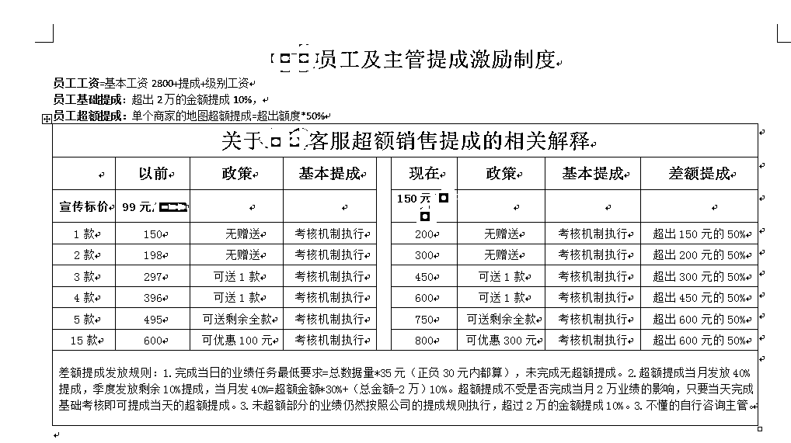

# (精华帖)(197 赞)简单制度化让小销售团队半自动运转，轻松赚取千万营收

作者：  鱼丸|亦仁助理

日期：2021-03-24

创业团队通常会一人多职，因此，更需要通过合理设计管理制度，来让团队分工清晰、协作高效，并减少公司负担。

那么，如何高效批量筛选面试者，并减少无效的培训资源？

如何合理设置部门，以减少企业负担？

如何建立一套激励和考核制度，让员工自我管理？

今天#生财合伙人  嘉宾 @营销人老张，他将会以销售型公司为例子，分享以上的问题。

来，欢迎他的分享。

 

 

大家好我是地推传媒张，互联网创业 8 年，这 8 年来有成功的案例也有失败的教训，目前主要全网销售信息差产品，目前团队 50 人左右，年销售额 1000 w 以上，因为是低成本的可复制信息差产品，利润还可以。

在创业的 8 年里从最开始的 1 个人，到后来的几十人，失败后再到 1 个人再到几十人，起起落落，创业是勇敢者的游戏，没有一劳永逸的项目，也没有不挣钱的行业。大多数情况下你的认知决定了你的财富，人很难挣到认知之外的钱。废话不多说进入主题。

今天分享的大纲：

1\. 不养闲人，只留能为企业赚钱的员工，能不配置消耗型部门就不配置

2\. 小公司不配人事怎么解决大量人员招聘的问题

3\. 如何标准化批量筛选面试者，减少无效培训资源

4\. 3 个维度建立一套销售人员自我管理的制度

5\. 如何设置一套有激励性的提成制度

6\. 简单规则附能主管权利，减少主管管理时间，多做业绩

7\. 多用逆向思维抛出矛盾，让员工自己去解决自己产生的矛盾

8\. 对首次创业者的几点提醒

开笔写的：小团队的管理打造

说一下今天的重点，创业团队无法避免肯定会经历从无到有，从小到大的过程。但是小团队的管理是非常重要的一个环节，小团队由于受到资金和规模的限制，无法像大公司一样设置比较齐全的岗位，通常情况下老板是人事、是财务、是搬运、是电工、是销售等等角色。

 

 

通过这几年的团队管理经验，目前团队通过一些简单的制度，基本实现了半自动化运转，每周我只需要 2 天时间落实本周的工作重点及业绩情况，每月只需要 2 天的时间制作工资表（我们公司没有专职财务，因为公司是自己一个人的，不需要公示账目，也没有人事后面我会讲没有人事怎么解决招人这个问题）。这样把自己大多数的时间解放出来，处理其他新项目的学习探索以及方向性的事务。

介绍一些我们团队的主要情况，我们是一个典型的销售型公司，我想大多数公司销售部门都是最重要的一个部门，管理好销售部就代表着公司的营收不会出问题。下面我就以销售型公司举例如何提供销售的效率。

一** **、不养闲人，只留能为企业赚钱的员工，能不配置消耗型部门就不配置

我们公司有 50 人其中 44 人是一线销售人员，剩余的 6 个人是销售的内勤人员，就是 6 个销售配 1 个资料人员，负责销售后的产品资料整理，完成后交给销售人员，销售再花  1 分钟交给客户即可。

内勤的目的是分担销售的非销售工作，让销售每时每刻都处于销售产品环节，切记不要让销售做太多的重复性，文字性工作让销售分心。销售的重中之重就是销售产品。只做专一做销售产品的事情。

我们公司人事和财务的工作是自己在做，但是这两项工作我一个月一共只需要花最多 6 天的时间就完成了。财务因为是自己一个人的公司，所以只需要一个外账会计即可，一年是 2400 元。所以整个公司除了 6 个内勤不赚钱，需要养。其他的每一个员工都是自己养活自己，为公司创造价值。所以公司的人员运营风险非常低，基本上没有让空闲人员成为企业的负担。（当然如果是大企业如果部门配备不齐会被认为是野鸡公司不正规，这里仅仅是说创业型小公司）

二** **、小公司不配人事怎么解决大量人员招聘的问题

 

 

可能很多创业者都会遇到这样一个问题，销售型公司人员流动性较大，但是有业绩的老销售的稳定性又比较高。就会造成前期招聘需求比较大，但是 3-5 个月以后人员配备齐全后人事的招聘工作量就很少了，一个月就是补 3-5 个流动人员而已，但又不知道给人事安排什么其他工作，导致人员工资浪费。

我也专门请过人事也出现了这个问题。后面公司的操作方法是：让销售主管兼任招聘工作（每个月用一周来做专职招聘工作，其他时间任然做自己的销售工作，如果招聘量大就分更多的时间给主管招聘，作为补偿主管去招聘耽误的时间，每天的业绩默认完成。

因为我们是有每日业绩考核的。所以主管反而觉招聘比完成业绩更加轻松，很乐意去做）。

为什么说销售主管适合招聘？

1\. 销售主管对工作岗位比较了解，而且销售看人也比较准。

2\. 销售主管招来的人需要自己带而且以后加入自己可能会影响本组的业绩考核，所以不会乱招人。

3\. 需要制定一套人员招聘的基本条件，牵制主管乱招人。

4\. 每天给主管规定具体数量的人才网简历电话拨打预约数量。做流量的都懂，只要不断预约人来面试就不怕找不到人。

 

 

三** **、如何标准化批量筛选面试者，减少无效培训资源

很多公司都担心招聘到的人员不适合公司，导致公司培养一段时间后损失惨重。要么能力不行，想开除却浪费了工资。要么培养几天浪费了老员工的培训时间却没有产生任何价值。因为培养一个员工的成本是很高的。

很多老板都是自己面试人来减少看错人的概率，但是老板如果花大量的时间去面试普通员工会导致自己忙不过来而且非常累，无法做其他更多的思考。我们设置了一套标准化的招聘流程后基本上主管招聘进来的员工质量也大大的提高。

1\. 大面积撒网，招聘信息一定要写的吸引人，工作简单，办公环境好，五险、不加班等等这些词语才能吸引更多的人投简历，这个就和获客文案是一样的，公司的优势，吸引求职者的地方一定要写出来。

 

 

2\. 每天主管拨打固定数量的简历电话预约面试，保证面试的人数，还要在简历库里面去主动搜索人才，主动电话联系，这个是很多公司没有做的事情，所以很多公司的人事说没人投放简历也是这个原因，因为没有主动出击招人。只有面试人数保证了才能筛选到优秀的人。

 

 

3\. 面试很多公司面试完就是让求职者回去等通知，然后会根据情况通知来实习的人员，这样导致可能通知的人不一定会来上班，或许是随口答应来上班，但是缺又不来了，导致安排好的入职培训浪费了或者新人员数量不够。面试后一定是让面试者如果愿意来公司实习可以给面试者发一个短信我愿意来实习，然后公司在根据回复情况通知实习人员，这样就把主动权掌握在了自己的手中，不至于你看上她，他可能完全不想来公司的局面。不利于公司培训安排

4\. 让求职者消耗大量的时间成本，留下真正需要这份工作的人。通知实习后一定不要马上开始培训，这样很多情况下浪费主管或者培训者去讲解，当求职者上午听完了解工作有难度后可能直接下午不来了。导致做好的培训安排却没人听了。

可以先准备一个公司的产品销讲话术，第一天的实习生什么也不做，安排直接背文案（文字不要太多，也不要太少，我们是 1500 字左右的销售文案）。通过这么简单的过程有把没有耐力，心烦气躁不适合做销售的新员工就会背一会自己放弃了。通过背文案的检验能够很快知道新员工的应变能力和反应能力，能够初步知道新员工的个人能力。

背文案基本需要 1 天时间，快的半天左右，背完就直接让新员工回去。不在安排其他内容，这样可以增加新员工背文案的速度，背的快的半天就回去了。第二天上午安排员工自己熟悉昨天背的内容，不安排具体培训，是为了在培训之前进一步消耗新人的时间成本。第二天下午安排简单的讲解，可以讲公司基本概率，也可以讲背诵的文案。

切记第二天只能讲一些相对轻松的话题，不要把工作讲得太难，讲销冠工资多高，我们从来不加班之内的，没有勾心斗角，工资高于同行多少多少等等。这样可以让新人进一步了解公司的产品，对公司充满信心。人只有尝试了才能克服困难，不要先让困难把有能力的人吓退了。

 

 

到第三天来的新人，基本上从通知面试到过来背诵花费了 3-5 天左右（面试成功后延迟  2 天通知到公司实习有 2 天的间隔），公司却没有消耗太多的人力成本即使 1 个人都不来也没有关系。重复进行招聘操作即可，通过这一系列的操作，那些歪瓜裂枣，没有耐力，不适合这个工作，对销售不自信的基本已经淘汰一大部分了。这样有效降低了培训和面试成本。

四** **、**3 **个维度建立一套销售人员自我管理的制度

1\. 每日业绩考核，每日业绩考核制度主要是让员工每天能够提醒自己完成业绩，过程管控结果，每天完成了，每月自然就完成了。如果安排管理一个人天天去催员工完成业绩，我想谁也不像成为全公司不喜欢的人。

如何设定每日业绩目标，你把最近几个月的销售大数据调出来， 70 % 的人都能达到的业绩就设定为每日最低业绩，未完成每日最低业绩的处罚可以自动加班半个小时才能下班或者其他。

每日最低业绩主要是让员工每天想着自己的业绩应该是多少。有个比喻：比罚款更难受的事情是，看到别人都下班了，自己还要加班。特别是 5 点钟还没有完成业绩的员工，基本会主动把老客户拿出来跟踪，因为人性就是不想加班。但是也不能全公司都在加班，那样公司的抱怨情绪会比较高。

2\. 每周目标考核，一周不能完成 KPI 的，是需要主动到销售前五的人员处去旁听学习 4 个小时，而且需要销冠签字主管检查。这样主要是帮助业绩不行的人员自我学习。另一个是在周例会需要分享自己的学习心得，这个主要是监督学习的人要认真学习而不是走过场，另一个是让上台的人在面子上过不去，如果每周都去分享学习心得，大家都知道你是业绩倒数。从情感上也过不去迫使员工想去完成业绩。

 

 

3\. 每月目标考核，月度的考核结果已经从每天每周在做铺垫了，所以说能完成每天和每周，每月就不难了，每月主要从提成上考核。这一块我单独讲一下。

五** **、如何设置一套有激励性的提成制度

1\. 基础提成，主要是保证公司的基础业绩，让完成了一定销售额度的员工有提成，通常是底薪 + 提成 %。如果薪资结构是完成固定基础业绩才有提成的话，可能部分销售无法拿到提成，导致部分业绩差员工人员主动性不太强，下半个月看到自己完不成的情况下，没有了销售斗志。举例：每月的销售基础销售任务是 2 万元，高于 2 万的可以提成  10 % ，那么如果完成 2 万以下的员工其实下半个月积极性不高。（当然也有无责任提成制度，这里不细讲）

2.  超额提成，主要是保证每个人都可以拿到提成，每天激发员工的业绩。例如： A 产品单价 1000 元，给员工一个销售底价比如是 600 元，如果没有超额提成，大多数情况下员工会 600 销售，努力高卖客单价主观性不强。如果销售 600 以上的金额提成 50 % 那么高卖积极性会瞬间提升。我们公司因为这一条提高了 20 % 以上的业绩。

 

 

超额提成这里有一个细节：你准备做超额提成的时候可以先提高产品价格，然后把提高的那部分作为超额部分，这样保证了业绩只会提升不会降低。

3\. 超额提成按照每个单子计算，你有一个单子超过就提成，不与月度考核的总业绩挂钩，保证了每个员工做了都有提成的心态。

4.  超额提成因为比较高公司可以在上面附加很多条款，设置多个等级的比例。比如公司迟到严重，就规定每月迟到 2 次以上，请假 2 天以上，超额提成自动降低 5 % 。比如为了保证基础业绩更高，可以设置基础业绩分几个等级对应相对应的超额提成比例。这样就保证了员工既要基础业绩冲量，也要超额提成附能的局面。总之这个是根据实际情况去匹配即可。公司因为超额的各种附能，没有降低了迟到，降低了请假，降低了相互赠送业绩情况，降低了遗漏客户的情况。

 

 

六、简单规则附能主管权利，减少主管管理时间，多做业绩

1\. 主管拥有开除组员权利，如果组员被开除，组员只有自己去寻找新的组接收自己，如果没有寻找到新组接收，组员由公司直接管理，只要是由公司直接管理的组员超额提成自动降低 10 % 。

2\. 如果组员有违规情况，比如自己因为客服服务态度不好被处理，只有主管可以申请给组员解除，组员不能自己申请，可以让组员去协调主管之间的微妙关系，解决相互依赖的问题。

3\. 组员受罚，主管会受到连带责任，也会被罚款，防止相互包庇的行为。目前公司主要用这几条就让组员基本服从主管的管理了。没有用太多的其他条条款款。

七** **、多用逆向思维抛出矛盾，让员工自己去解决自己产生的矛盾

 

 

1\. 比如员工 A 与 B 同组因为争抢客户发生矛盾，都到办公室哭诉， A 提出要换组，不与 B 一起工作， B 也同时提出不与 A 同组要换组。这种问题如果解决不好会有一定的负面影响。

a. 如果直接统一换组，以后同样问题其他人员效仿，导致有处理不完的问题。

b. 帮换到其他组，其他主管也不一定喜欢这样的组员，导致其它主管内心对公司有意见。

c. 不处理也不行， A / B 员工都带着怨气工作，业绩下滑。

d. 逆向思维法解决： A 到办公室提出换组，告诉 A 公司原则上是同意换的，但是需要你自己去找其它主管协调，有主管接纳就可以自己去。 B 来提出也是同样的回答回答 B 。

这样所有的人公司都不得罪， A / B 自己不能换是自己协调能力不行，也怪不到公司。

八** **、对首次创业者的几点提醒

1\. 一定不要随便答应员工提出的要求，一定要根据实际情况决定对整个公司和其他员工是否会产生负面影响在决定。

2\. 当你发现某个员工有违规的情况一定要当面指出，不要认为也许员工会自己改正，更多是不处理这个问题其他员工相互效仿，会不断放大这个问题。

3\. 切记不要随便在会上面宣布某个规定然后过几天觉得不适用在随便又改了，这样会让员工觉得你是一个说话很随意的领导。

 

 

4\. 不要想着所有员工会感激公司养活了他们，大多数情况下你们之间就是工作关系，出了门交集就很少了，甚至很多员工因为一点小摩擦离开公司后会说公司的坏话。大多数情况下老板在员工的眼里就是一个天天要业绩的没有情感的角色。

5\. 任何一个看似简单的行业，即使你把所有可能出现的问题都想了一遍，当你真正去做的时候才发现到处都是困难，所有的创业都充满未知，会出现各种你意想不到的问题。

6\. 如果你还没有开始做的时候就开始考虑同行模仿之类的是多虑了，完全不用担忧你的行业会被别人模仿，做互联网的竞争都是面向全国，竞争迟早会来，做好当下去执行就行了。就单单执行力这一块，就已经让 90 % 的人退步放弃了。

写到这里今天的分享也差不多了，我是地推传媒张  微信号 fei7777 。希望和大家探讨更多的小团队管理经验，大家一起生财有术！

评论区：

鱼丸|亦仁助理 : 他在互联网创业 8 年，所经营的公司年销售额 1500 w+，并在没有人事，没有专职财务的情况下，通过简单清晰的制度设计，使 50 人规模的团队基本实现了半自动化运转。

今天的分享大纲如下：

 

 

**1. ** 不养闲人，只留能为企业赚钱的员工，能不配置消耗型部门就不配置

**2. ** 小公司不配人事怎么解决大量人员招聘的问题

**3. ** 如何标准化批量筛选面试者，减少无效培训资源

**4. ** 3 个维度建立一套销售人员自我管理的制度

**5. ** 如何设置一套有激励性的提成制度

**6. ** 简单规则附能主管权利，减少主管管理时间，多做业绩

**7. ** 多用逆向思维抛出矛盾，让员工自己去解决自己产生的矛盾

来，欢迎  的互动。

胖小爸-深圳买房融资 : 好及时，最近正好需要这个[强][强][强]

涛子 : 期待

回望起点 : 感谢生财看得起！大家一起生财有术！

飞书何伟建 : 很受启发

望月 : 中国的管理，就是处理人性的艺术，这里体现得很细腻，都是智慧啊！

麒麟 : 感谢分享

【一职多责】

厨师就一定是是炒菜做饭么？其实不一定，大多数的厨师是要安排人力（管理）、确认食品安全（监管）、既要帮忙做清洁的工作（保洁），也要去帮忙买原物料（采购），看似名称厨师长，做饭好吃一招鲜，其实也需要在负责其他方面的琐琐碎碎，只是权重大小不同的问题；

这就在创业公司的好处，可以尽快知道厨师不仅仅是厨师的现实；

【为什么说销售主管适合招聘】

有句大佬说过，“让听得见炮火的人去发号指令”，讲究的就是时效性和事实性；同样可以引导出另一句话：让明白业务的人去找战友。

啥叫大公司病，其中一个病源是摩擦成本，人事的角度看人会和运营的角度看人一样么？好的方法是人事和运营的人都可以参与到面试中去，如果是二者是一个人的话，那效率就高出一大截，少了扯皮，多了务实；

 

 

我是加入生财第 126 天的麒麟，有幸一路前行。

回望起点 : 个人理解中国人口中的情商，就是了解你对面的这个人的心里所想，然后根据他所想去回答处理问题，得到自己想要的结果。
