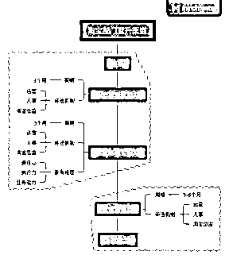

# (精华帖)(343 赞)如何通过制度管理，使公司从年入百万迈过年入千万的门槛

作者：  亦仁

日期：2020-08-19

有这么一句话：三流的公司管理靠人，二流的公司管理靠制度，一流的公司管理靠文化。

靠文化管公司，这是追求。靠人管公司，着实挺累。

靠制度管公司？  可以尝试一下。

今天的  ，我邀请了  来分享他如何靠制度管公司，带领公司从年入百万迈过年入千万的门槛？

欢迎  。

———

再小的团队，再小的公司都要有制度

生财有术的各位朋友们，大家好，我是盗坤。首先给大家介绍一下我自己，我是 93 年的，目前管理着一家四五十人的公司，公司主要经营电商，以及和电商相关的知识付费项目，现在每个月净利润稳定在 50 万+以上！

我相信生财有术有很多和我这种类似的情况的朋友，因为一些机遇和自己的努力以及运气，赚到了一些钱。并且，在这过程之中，业务不断发展，团队不断扩大，一直发展到了几十上百人的规模。

但因为没有在什么大公司上过班，担任过领导位置，也没有什么丰富的管理经验，公司还是处于一个非常粗犷式的发展状态。

 

 

没有清晰的公司组织架构，没有健全的人事、财务制度，江湖义气成分浓厚，内部管理十分混乱，更像是一个团伙而不是一个团队，这一切，都严重制约着我们继续地往前发展。

当然，也尝试过招纳一些稍微大一点的公司的“经理”，或者有些“MBA”背景的“人才”空降到自己的公司里。但却发现，或许是他们的管理模式太先进了，又或是自己的公司积重难返，总之，双方的化学反应，极不明显，格格不入。

其实，高级人才依托于大公司的平台管理经验，直接搬到到小公司里，确实会有很多不落地的地方，非常的“不接地气”。这主要就是因为自己的公司还处于一个非常弱小的状态，资源不够丰富，就好像一个破马车装上了一个波音 747 的发动机，那么就会很容易引发机毁人亡的情况。

所以，今天，我就将我的一些个人经历分享给大家。告诉大家，我是如何从一个人发展到今天，以及我是如何在公司发展的同时去建设我的公司制度问题的。

【专注蓝海，年入百万】

如果熟悉我一点的财友都会知道，我是通过淘宝蓝海起家的。相关的经历我就不细说了，我将之前的一些帖子给大家分享出来，有兴趣的可以移步去观看。

《淘宝蓝海小类目的玩法》

《淘宝蓝海市场:我人生的第一次月入百万》

今天第一部分呢，我主要给大家总结一下，我从 15 年一个人一个店到 18 年年入百万做对了哪些事情。

1、创业，先求生存，再求发展！

我昨天发了一个朋友圈，说到“ 点点滴滴的从小做起，从一个人，一个小店，一步步的做起。不要一开始就想做一个大企业。这个世界没有优秀的理念，只有脚踏实地的结果。”

我见过太多太多的创业者，还没开始想好要做什么，怎么赚钱，就先租了一个豪华的办公室，把公司注册了，然后请秘书，前台。

我的公司直到今天都还没有前台，我也没有秘书。也是随着最近公司人数的增加，之前的民房确实坐不下了，我们才从之前的民房办公室搬到了写字楼。

 

 

初次创业者，一定一定一定不要犯好大喜功的毛病，还没赚到钱，就开始大手大脚的花钱。也不要有一些不切实际的幻想，幻想着你自己就是最幸运最特别的那一个。

一开始，要把自己当成最普通的那一个。

我第一次做淘宝，完全没有创业经验，更没有电商经验，凭着一个点子，头脑发热就想做一个有温度的淘品牌。

此时的我，根本就没有考虑到“怎么赚钱”，也没有想过自己能不能做起来，只是在那幻想可以赚到钱，更多的是在想着怎么做个有逼格的产品，有逼格的店铺。

事实证明，我做的店铺既没有逼格，也不能赚钱，而且还亏了整整一年。

所以，后面我知道了，活下来，才是最重要的，活下来才有发展的机会。我不再去依据自己的想法喜好去做淘宝，而是什么好做，什么对手弱，就做什么。

创业初期，一定要“务实”，不要“务虚”

2、专注力，先打造自己的一亩三分地。

小北老师是我在生财有术非常佩服和崇拜的几位大佬之一，他在他公众号说过一句话，大意是他这么些年，见过很多有钱人，但那些真正赚钱的人，无一不是因为专注。

我表示，附议！

你可以看看咱们生财有术的老胡，专注淘客；小北老师，专注跨境；黄亮，专注快手短视频；亦仁，专注生财有术；盗坤，专注淘宝蓝海...

不是不可以多领域经营，那得像亦仁说的那样，先有了自己的一亩三分地以后，再从自己的领域去做延伸做扩展。

到你真正在该领域积累一定的丰富资源，充沛的资金，优秀的团队，有这丰富的创业经验以后，那么你可以试着去做扩展。不过那些都是集团，巨头做的事情了。

小白，小团队，更应该专注于一个细小的细分领域，持续深耕，持续专注，打造自己的一亩三分地。真正有了自己的一亩三分地，你会发现有很多你意想不到的收获，拓展也是自然而然地延伸的。

比如，亦仁专注于生财，现在开发了大航海，训练营，又延伸出了私董会。未来，我觉得生财有术的机会还很多，可延展性还很多，不过这一切的前提都是因为亦仁先有了《生财有术》这个一亩三分地。

 

 

又比如我自己，能做知识付费的延展，前提完全是因为自己在淘宝领域里多年的浸润深耕，通俗易懂地来讲，就是我吹这些牛逼，都是因为前面多年的内容沉淀。你来试试做淘宝领域的知识付费，看看有几个人愿意给你付费！

我这么些年，受过很多诱惑，有线下的有线上的，很多项目都去尝试过，也亏过不少钱，只有淘宝给我真正赚到了大钱，支撑起了我的整个公司。

生财有术的信息量很庞大，繁杂。这里面有着许多优秀的内容和宝藏，但是需要你自己去仔细辨别、筛选、挖掘，也需要你沉下心来，拒绝浮躁，抵制诱惑。

不要今天看见盗坤帖子就觉得淘宝好发财，明天看大航海又觉得短视频好做，后天看淘宝客觉得淘宝客很好赚钱。去寻找真正适合你的项目，然后心无旁骛地坚持，持续深耕。

我现在专注于淘宝，打开生财，一般只读星主帖子和精华帖子，偶尔也会翻翻其他帖子，不是为了找项目，求暴富，只是为了抱着找思路，拓视野的心态去阅读去学习。

3、忍耐力，赚钱的道路上总是充满绊脚石，端正心态解决就好

以我现在为数不多的经历来讲，如果是自己创业做项目，想要很快得到结果的，几乎很难很少。

大多数的创业项目都是充满细节的，而这些细节的打通无疑都是需要试错和时间成本的，所以，赚钱的道路大多数都是充满曲折坎坷的。我们要做的就是，端正心态解决就好。

我做淘宝经历了很多的困难和挫折，不过，怨天尤人是没用的，如果你想要赚这个钱，想要发展，那么你就只能解决他。

不要因为一些小挫折就选择放弃，那种你想躺着就把钱挣了的，你也只有躺着才可以挣钱，还得有点姿色。

【通过制度，实现月入百万】

我要给大家讲的第二部分，就是今天的重点，也就是我对于公司制度建设的反思和总结。

1、阿米巴模式让我们公司快速裂变。

 

 

先给大家说一说我公司之前的运营模式，

第一阶段：店铺从 0 到 1 的全过程都是我自己来，选品，找货源，做图（外包），上架，运营，客服，发货（代发），报表全部都是由我自己来。此阶段为我一个人单打独斗阶段，一个人这样操作，三个店基本上已经是极限。

第二阶段：随着业务的发展，我开始请了美工，客服，财务，我自己还是负责选品，找货源，做图（设计），上架，运营。此阶段我开始了规模化运营，抽离部分工作，但是重头还是压在我肩上，我觉得极限是十个店。

第三阶段：业务继续发展，我开始给部分优秀的客服分配更多的工作，培养他们成为运营，由他们替我找货源，代放单，运营，填写报表等等，但是核心的选品工作还是我自己来。此阶段，我的工作量进一步得到释放，但是内部管理比较混乱，此种模式极限也就是四五十个店。

第四阶段：开始借鉴阿米巴模式，以小组制为单位，独立核算，独立考核，独立制定计划，以运营组长为核心，他可以去独立发展团队，我只提供选品，看报表。运营组长从一个人、一个店开始，第一个店做起来实现盈利，就可以向人力申请，由我同意，然后配客服。接着开第二个第三个第四个店，然后将客服发展成运营助理，请新客服。所有小组发货的财务由我调配，做图的美工由我统一调度。此阶段，我已基本放手工作，此种模式，因为我还兼有其他工作，所以极限百店左右。

第五阶段（正在进行）：培养电商总监，由电商总监总体负责管理电商部门，独立决策，具体负责各小组的管理，同运营组长沟通，统一协调、调度运营、客服、美工、财务人员的配置搭配，。此种模式，极限可以达到一百到两百个店。目前，我正在对电商部门的运营进行为期三个月的考核，然后选取电商总监。

第六阶段（未来）：根据业务规模的发展，可以开设电商一部，电商二部，电商三部；

如有必要，还可以花钱培养测试，内部孵化，扩展延伸到京东、拼多多或者跨境等平台，沿用之前的小组模式，总监负责，设置成淘宝部、京东部、拼多多部等。此种模式，极限可以数百上千家店铺。

2、再小的公司，再小的团队也要有制度

我在创业初期，喜欢拉朋友进来，而且公司内部充斥着“义气”等元素在公司文化里面。

岗位设计、薪酬发放、考勤打卡、财务制度等方面都非常的随意，没有一个制度可言。

 

 

起初，我觉得在创业初期这是一个很难避免的问题，制度，规范这些应该是后面的事情。而且小公司也没有资源来承载一个非常复杂的组织结构，只有大公司才会搞那些复杂的人事制度，管理制度。

但是，今天我要给所有正在创业的小伙伴说一句，再小的团队，再小的公司也要制度。

大家可以看看图 1，这是我为公司下一步发展所设计的公司内部组织架构。这其中，很多岗位目前都还是空缺的，包括电商总监，知识付费部门的市场总监、人力资源总监等等；还有很多岗位是一人多岗多职的，比如我们的行政也要承担着人事招聘，考勤打卡等等。

我们可以一人多岗，一人多职，我们可以岗位空缺。但是，职位没有，不代表就可以制度缺失。制度的缺失，代表着一个公司内部公平的缺失，纪律的缺失，一个缺乏制度建设的团队是绝对走不长远的。

红军，八路军，当年为什么能够凭小米加步枪，一步一步发展壮大，取得胜利。原因有很多，但是，把制度建设摆在第一位应该是他们取胜的一大原因，也是他们区别于其他军阀的本质，他们是一支有组织有纪律的部队！

所以，把制度建设，从公司成立的第一天就放在公司的工作重心中来！

虽然，我现在的公司组织架构，有些岗位还有空缺，有些组织架构还不够完善。但是我们设计的这套组织架构背后也是有着一套基础制度在支撑的，每一个岗位背后也都有相应的制度在支撑(图 2 图 3）的，我觉得，这是我非常自豪，也是对于未来非常有自信的一件事情。

而且，这个事情还必须得是我们创始人自己来，因为只有你才熟悉你的公司，你的业务，你的团队。这也是为什么我文章一开始说的，空降的高管不接地气。

因为我们的公司还很弱小，而高端带来完善体系也意味着高昂的管理成本，高预算的营销理念等等，所以我们的公司承载不了他们的理念，所以，制度建设我们必须自己来抓这个工作。

记住，好的制度是为人服务，为公司服务，制度的设计一定要从公司的需求出发，从公司的实际出发，而不是从制度出发，用制度去束缚公司，束缚人。

3、摆脱个人主义，信任团队

当我们大家一起制定了一个制度之后，那么我们就要遵守它。接着，你要做的就是去足够信任你的团队。

 

 

我一个人做淘宝的极限应该可以赚到百万，但是通过制度，通过团队，我现在觉得我们淘宝部门的盈利天花板是几千万。

一个公司在发展的过程中，老板一定要学会给自己解绑，也要学会给团队赋能。不要什么东西都想牢牢拽在自己的手里，对员工，对团队严防死守。同时，还要学会给团队赋能，给他们能量，给他们资源，给他们机会，让他们去创造价值，实现价值，实现梦想！

要把通过自己的拿到的结果，变成通过制度、通过团队拿到的结果。一旦我们建立好了一个制度以后，那么 OK，大家去遵守它，并且老板要足够地去信任你的团队，设置好一个可容纳的试错区间，给自己内心也设置一个试错容积。

一旦你把工作交给了团队，那么就放手让他们去干，接下来的事情按制度进行。

如果团队做的不够好，该扣工资，该罚工资，该降级甚至该淘汰，那都是制度的选择。

我足够信任你，但是我们也遵守公司制度，遵守游戏规则。不是我要惩罚你，而是制度惩罚你，也不是我要提拔你，是制度要提拔你。

摆脱个人主义，才能将创始人解放出来，去思考更多的东西。

https://t.zsxq.com/Ea6miYN https://t.zsxq.com/IiYNBUR

 

 

 

评论区：

阿狸 : 年轻有才大佬[社会社会][社会社会]

冰蓝色 : 真好

无双 : 此文再值一张门票！对于即将创业或者在创业路上的伙伴一定有启发。

俺的管理就是弱的一匹，将来不出意外，也会面临管理几十人上百人的情况。现在正好是打基础的时候。谢谢分享

钟南 : 团队无论大小，都要有规则意识。

制度执行到位，带领绵羊也能打战。

alan : 三流的公司做产品，二流的公司做方案，一流的公司制标准。

维她 : 感覺需要出個續集，給員工賦能，離不開招聘到合適的人

郑小焦 : 谢谢分享。跟坤哥认识几个月，无论是淘宝蓝海项目的生意领域，还是个人做事风格的独特魅力，都令人从心底里赞叹和佩服。大格局思维，学习[抱拳][抱拳] 偶本帅帅 : 讲的很好，我觉得应该加一个前提，那就是适合公司的制度
