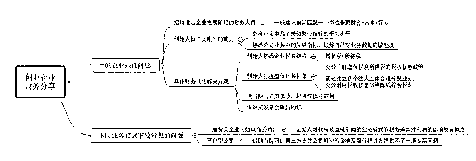

# (精华帖)(131赞)中小企业财务中走过的坑

作者：  亦仁

日期：2019-05-14

每周一，邀请一位圈友分享TA行走江湖的生财之术。

（今天一直在外面，  发迟了，自罚三杯）

生财有术星球有很多创业者，特别是小型创业团队，“小”很多时候也意味着“不规范”，经常会掉一些坑，  而这些坑回头看的时候，如果当初有人提醒一下，很可能就可以绕过去了。

中小企业的财务中的坑就是其中的坑之一。

所以，我邀请了我的财务顾问，一名注册会计师，她有10年的财务工作经验，也是咱们星球的星友之一，  ，来给大家做一个  。

如果你掉过企业财务上面的坑，此篇文章应该看；如果你还没掉过企业财务上面的坑，此篇文章更应该看。

 

 

如果看不懂，建议像我一样，多看几遍。

以下是今天的分享，enjoy！

大家好，非常感谢星主亦仁的邀请，很荣幸来做这个分享。我今天分享的主题是：中小企业财务中走过的坑。

我是华理，可以叫我Emily。做财务10个年头了，注册会计师一枚，曾经同事评价我是他们碰到的财务中最懂业务的。

08年刚毕业的时候在天健事务所做了不长时间的审计，之后在央企做了一年多的会计，但是发现自己的性格不是太适合，于是接下来的6年在500强的外企转做财务分析工作（就是大家所谓的表姐），也是在这几年中慢慢提高了自己对数据的敏感度，同时由于工作中更深入地接触到业务的每一个细节，慢慢的将自己的财务思维向业务思维转变。

之后考虑到外企本身的发展受限，接下来的3年转到了互联网领域，先后在A轮智能硬件公司（100人以内）以及A轮医疗互联网公司（200人以内）担任财务负责人，负责公司财务业务0到1的工作，在会计、税务、银行、审计等多方面积累了丰富的实战经验。

今天主要跟大家分享一下我在过去的几年中通过接触到的初创企业总结的一些大家普遍可能碰到的财务问题。

首先咱们说说大的方面，最近三年除了服务3家创业公司外，也为很多身边的朋友公司出谋划策。碰到很多以下类似的情况：有个朋友公司做电商的，一年3000-4000万左右的流水，但是财务一直是让400元/月的代理记账公司负责。联系我的时候是意识到财务即将失控。另一个电商朋友，业务中货款来往频繁，与供应商及客户都有不同的账期，对我抱怨做了一年还不知道自己公司到底赚了多少钱（应收应付款到底有多少）。

所以咱们先来说说创业公司的财务人员配置这个大问题。

参考之前提到的这两家公司，创始人基本也算是首次创业，前期1年多的时间都是在拼业务，财务这块建议还是需要有一个财务专业人员负责，但同时可以兼顾人事以及行政。

前期不一定招很有经验的人士（毕竟成本比较高），有一定的专业基础，人耐心有责任心即可。一般的初创企业即使如之前提到的流水较多的情况下，实际业务模式简单，基本上这个人员配置能解决80%-90%的财务问题，不至于给业务拖很大的后腿。

另外咱们再来聊聊创始人需要具备的财务能力——做一个会算大帐的老板。

 

 

首先来说一说什么叫算大账。“大账”首先针对的是主要的财务指标，一般每个公司收入、成本、毛利、费用、净利润就是最基础的关键指标，此外针对不同类型的业务也会有需要特别关注的指标。

通过之前几年的积累以及对上市企业的观察，市场上一般贸易型及大部分生产型企业的毛利率普遍30%左右，净利润在10%左右；互联网企业毛利一般比较高，并且在达到规模效应后随着收入的增长毛利会显著降低，一般需要重点关注的是管理费用中的研发开支主要是人工成本及营销推广成本（一般在10%-15%左右）。人员成本估算一般按照采用人员的基本工资*1.7左右（该数值主要包括员工五险一金、福利、办公费用及差旅费，可根据公司实际情况适当调整）来估算一个大致数据。

另外目前很多互联网企业大多是预收费性质，所以在日常经营中一般更多的关注预收款的情况，毕竟最后能有多少确认为收入还是依赖于预收款的多少；

TO B类型的软件企业普通毛利在60%左右，净利润普遍也在30%左右，重点应关注的是现金流情况，一般TO B类型企业普遍项目执行周期超过1年多的甚至会有2年左右，回款是影响发展的主要因素。

我的很多创始人朋友第一次看到上面的数字都会觉得头皮发麻，但是通过2-3次业务模拟，基本对净利润的把握不会有太大的偏差（绝对不会超过一个数量级），此外通过不断的修正，同时结合自身公司的实际业务情况与以上市场普通情况做一定的对比，在做业务决策时能够做到更加快速和准确。

其实真正的高效决策还是在于创始人对几个关键指标的把握，财务的数据只是在此基础上的补充与验证。我的几个朋友在此基础上算过几次账后，发现对业务的敏锐度也有很大的提升。

说完大的方面，咱们再具体聊聊初创企业（有自我造血能力，已盈利）碰到的日常业务中相对专业性的问题，主要还是税务方面的问题。

平时跟创业者交流经常会碰到比较多的对税种结构不是很熟悉的情况，一般企业在业务交易过程中先后会涉及两个税种：增值税以及企业所得税。

增值税是在销售货物或服务时直接征收，所得税是在销售货物或服务后扣除成本以及各项费用后的净收入再征收。目前接触到的创业公司碰到的增值税以及所得税问题基本能通过目前的税收优惠政策优化解决大部分的问题。

 

 

所得税方面：建议创始人把握“大账”，总体扣税前利润控制在小型微利企业的范围内（如果公司发展比较快或者有新的业务，那就再开一家呗，每家控制在都能享受优惠政策的范围内）。

另外对于年纳税所得额超过300w的企业基本属于中型企业，可以争取申请国家高新企业享受所得税减按15%征收，如果公司不是高新技术企业，因为一般政府对于招商引资这块都会有不同力度的税收返还政策，可以联系当地政府了解针对其他企业（如文化产业）特殊税收优惠政策。

对于增值税来说，很多人也比较容易混淆，所有企业，按照规模都可以分为小规模纳税人或者一般纳税人，与企业类型（个人独资、有限责任公司、个体户等）没有任何关系。

特殊情况下有些业务需要（如客户是一般纳税人，会要求供应商提供专票），小规模纳税人也可以去税务局申请代开3%的增值税专用发票，但是这部分税费不在免税范围内（因为客户拿着专票进行了抵扣，如果本公司再免税，那国家得亏大发了）

总体来说，创始人把控“大账”的思路跟所得税类似，建立好财务框架，通过几家公司合理分配业务（比如一般创业公司可以建立两个纳税主体，一个为小规模纳税人，一个为一般纳税人，对于部分较小且发生频次不高的业务可以在小规模纳税人主体公司中进行，其他对接较大客户的业务在一般纳税人主体公司中进行），充分发挥企业所得税及增值税的优惠政策，以达到综合税负最低。

基本上这个框架搭建好后，企业日常中80%的业务都能解决，剩下的部分可以结合个人独资企业（国内部分不发达地区政府为了招商引资，政府会有比较优惠的税收补助政策，就是俗称的税收洼地，设立个人独资企业可以享受很低的税收优惠政策）进行优化。

说到这里大家平时肯定也会接触到比较敏感的买发票问题，我个人不是很建议这种操作，相比以上通过建立财务框架利用优惠政策的方案，买发票实在是一个费力效率低下并且风险极高的操作。

目前金三系统上线后，国内发票特别是增值税专用发票管控越来越严，市面上碰到很多陌生的声称可以低税率开票的公司绝大部分都是坑。

 

 

最常见的操作就是开立多个皮包公司，利用大家想节税的心态来提供开专票的服务收取一定的税点。开具完发票后（你收到发票一般会验证真伪，都是真票哦）几个月就会一次性作废所有发票并注销公司。这时候往往税务局会通过这些皮包公司反查出之前开过票的企业，基本上一查一个准，所以建议大家不要轻易相信这类陌生的推广。

如果你有幸身边有靠谱的朋友在日常业务之余能提供给你这方面的帮助，请善待这些真正的兄弟，并做好资金、合同、发票三方资料的统一工作。但是这些帮助相信也是不能长时间持续的，基本能解决几次燃眉之急已经很不错了。

此外，还有一个小诀窍跟大家分享一下，平时可以安排财务人员多与直属管辖的税管员联系，如果有幸能有税管员介绍对应靠谱的中介机构（税务事务所、审计事务所），基本花个小钱能让你在大部分时间安心业务，不受税务的困扰。

以上是一般企业会碰到的共性问题，接下来分享一下两个相对特殊但是目前也是比较多公司会碰到的问题。

目前互联网企业的业务模式大部分可以分为以下三类：

1、贸易类企业，以电商企业为代表

2、服务类企业，以提供各类服务（技术为多）为代表

3、平台型公司

其中贸易类企业日常主要模式就是购进货物并卖出货物，业务模式相对简单，碰到比较多的一个问题往往是因为自身业务下游对接下一级渠道时销售模式的区别而导致增值税的税负差异大的问题。

一般直销的话对下游渠道开具13%的销项专票，同时供应商会开具13%的进销专票，抵扣后没有什么问题。但是在代销模式下会碰到比较多下游的代理商只能开具6%的进项发票导致该部分有7%的税差，会直接影响业务的整体利润。

以上部分说实话没有为大家解释的非常深入，主要还是这部分的专业度比较高，对于创始人来说如果能了解透彻当然比较好（但是目前为止我没有碰到过），其实日常创始人只要有概念这两种模式会对利润影响比较大，在谈判的过程中了解对方具体结算的条款方式，剩下对业务的具体影响可以让财务给出详细的测算。

之前碰到比较多的情况是往往创始人直接负责业务的谈判，到财务人员了解到这方面影响的时候已经是项目完成做结算的阶段，木已成舟的情况下朋友只能自己默默吞下苦果。

 

 

另外对于平台性公司，往往会碰到比较多的就是资金池的问题。这方面可以找一家有第三方支付牌照的公司帮忙（现在微信也有了微信分账的功能，之前我经手的业务中也有跟类似的连连支付合作过），改变业务模式后财务方面只需要结算自己抽取佣金部分的收入即可。

特别是提供服务方多为个人的情况下之前大多都会为个人提供不了可以抵扣的专票而在着实头疼。我之前的亲身经历就是之前业务没有通过第三方的情况下由于本身佣金比例较低承受不了6%增值税成本而导致项目搁浅，后期在这个问题解决后业务才能重启。平台公司体量起来比较快，现在税务对这块的监管也慢慢趋严，这方面的问题最好能尽早考虑。

我的分享到此结束，感谢亦仁，感谢生财有术的各位老板。

关于财务方面的问题今天主要也只是做一个抛砖引玉，主要介绍的也是大部分创业者会碰到的最多的问题。

此外每个公司业务类型的不同，具体经营情况各异，如果大家有其他个性的问题，也欢迎加我微信emily860715，备注  生财有术，谢谢大家。

评论区：

亦仁 : 创业财税相关问题如果比较多，也欢迎评论区提出来，比较集中的话我会邀请  开一个财税快闪群，开群现场答疑。

二宝 : 开群太棒了  正好有疑惑

Auroraaa : 打call🥂🥂🥂

亦仁 : 咱们星球的  也是CPA，热心的她也会帮大家解答财税问题。

C小调 : 学习了，已收藏[强][强][强]

 

 

Sky🏹（表哥） : 收藏！

千羽 : 很关键，最近两年应该会用到

不许变懒的猫 : 特别有用，意犹未尽，其实很多创业型公司交的税是很多的，之前有人分享过大概7个点的样子，看起来有利润，一扣税所剩无几。特别喜欢这一期的分享[强]希望大牛开个专栏，哈哈
