# 社群发起人 202308

> 来源：[`remhu1p2pr.feishu.cn/docx/QXJAdhbPUod0Prx9zcvcqEeUnJf`](https://remhu1p2pr.feishu.cn/docx/QXJAdhbPUod0Prx9zcvcqEeUnJf)

# 社群发起人

出品时间：2023 年 8 月 10 日

手册使用说明：本文旨在向你展示一个社群运营的底层逻辑和更多玩法可能性，帮助你更好地理解和实操。

建议：如果需要快速定位到精确内容，可以使用快捷键 Ctrl + F/command + F 的形式，搜索「关键字/词」，查找你想要的内容。

写在前面

💡Hi,欢迎大家来到 8 月航海 | 社群发起人 | 实战手册，相信在接下来的日子里，我们将在这里见面很多次。

在这个以人的连接为根本的时代，我们处在一个无处不社群的场景中，当我们连接在一起激发价值的时候，全新的关系在不断构建。而这种构建打破甚至重塑着传统经济下的商业模式。 移动互联网的发展，给了社群新的承载平台，并大大增加了社群内部、社群与社群之间的交互频次，催生了更多维度的社群生态。

现在看市面上大部分社群，有通过社群做营销，转化变现的，也有把社群本身作为一个付费产品的。可以说，组建社群，就是最小可行性创业，验证需求方向是否能够满足个体和群体的增长。

如果你想要学习如何创建并运营社群，有一颗真诚、热情、愿意分享的心，想把自己的社群做的更好，或者想通过社群成立自己的生意。我们就一起开始这趟航海之旅吧！

手册怎么用？

8 月航海开船仪式后，我们会在航海群中发一张「知识点亮卡」，点亮卡的作用是将社群逻辑知识拆分，帮助同学们更容易理解手册内容。

更具体地讲，就是本手册的学习路径了。安排如下：

第一阶段：以理解社群的基石概念和社群的价值为主，通过「一、什么是社群」和「二、社群能让我们获得什么」，解决 WHAT 级别的问题。

第二阶段：通过「三、如何建社群」掌握方法论和原理框架，侧重掌握实践的心法，解决 WHY&HOW 级别的问题。

第三阶段：站在上面的基础上，在四、五、六章节，深聊社群的商业化，讨论社群的增长问题、长期发展问题，以及进一步的深聊，社群商业化的话题，给出足够多的社群商业化的可能性。

另外，在手册的最后会有条形马老师关于社群的思考，以及相关书单推荐，值得一读。

本期的航海手册，是在 2 月航海 | 社群运营 | 实战手册的基础上升级而成，保留了之前手册的主体内容，除此之外，在第六章节商业化案例鉴赏部分，新增了社群相关案例，帮助大家更好的理解各类商业化社群的形式和运营方式参考。

需要说明的是，手册中会用更多的篇幅讲社群运营的底层逻辑。别处常常讲到的社群运营技巧，这里不会讲到。速朽的知识，这里不费笔墨。但这里的内容如果你能掌握，你将有能力洞悉别处的社群运营技巧背后的逻辑与缺陷。

具体的社群运营案例会在航海中的高手分享环节进行分享，也欢迎大家移步群内，多多交流自己看到的社群相关的各个信息，讨论丰富多彩的社群运营技巧。

除了上述内容之外，还有个核心就是多提问，多交流。在这里如果没办法满足你的需求，多在航海群里向其他船员问问，我们会一起找到关于难题更多的解法。

希望大家可以在这次航行里收获成果外，结识一群战友。

以下正文内容由生财有术嘉宾 @条形马 授权，生财有术联合制作而成。仅供航海船员以及生财有术星球圈友学习使用。

其中，「6.2 商业化案例鉴赏」节由@一尘学长 @黄伊森 @徐欣欣 三位圈友贡献。特此鸣谢！

同时也欢迎圈友们在实践过程中持续反馈，和我们共同完善，可以联系鱼丸（yuwan387）提供修改建议～话不多说，我们启航吧。

话不多说，我们启航吧。

零、坐稳扶好，我们出发！

## 0.1 本手册的学习路径是怎样的？

Learn to sell, learn to build. Learn both and you will be unstoppable.It’s easier for a builder to learn sales than for a seller to learn building.Builders have to constantly refresh their skills. Sales skills scale better over time as companies grow.@Naval

我钻研和体会社群，自 2012 年起，算起来有十一年了。

钻研社群的乐趣的地方在于，社群没有那么难，也没有那么容易。

期待像我们「生财有术」这样，建立一个生命力旺盛、行业影响力不菲、商业价值足够的社群，也是一件难而正确的事。最难之处在于，社群并非标准化的产品或需求简明直接的平台，而是处在动态之中的。且，社群的“品质”，永远和社群里的人是无法割离的。这一点是极为不同的。

因此，做社群并非小事，它充满挑战、难题，也充满成就感。

但社群又是容易的。容易在，它可以从小处做起，从一个群主发起，而非必须从一个团队发起。

这种矛盾，是社群的魅力。

希望这本手册，能让大家在接触社群这个充满魅力的事物时，先缓下来、慢下来，不从具体的玩法走进去，而是从社群的第一性原理走进去。

希望这本手册，能带领大家剖清「社群」这种组织的关键概念，拥有做废几个群后自己将变得更强的勇气，以及能将社群做的比同行更好的信心！

更具体地讲，就是本手册的学习路径了。我的安排如下：

第一阶段：以理解社群的基石概念和社群的价值为主，解决 WHAT 级别的问题。

第二阶段：我们走进一步，开始从原点分享建社群、建立社群的方法论和原理框架，侧重掌握实践的心法，解决 WHY&HOW 级别的问题。

第三阶段：我们将站在上面的基础上，讨论社群的增长问题、长期发展问题，以及进一步的深聊，社群商业化的话题，给出足够多的社群商业化的可能性。

伴随状态：具体实践卡点的答疑（将沉淀在本手册百问百答中）和航海活动，将是与以上三个阶段同时发生的伴随状态。

在时间上，以上这三个阶段，将在本次航海的第一周和第二周里面发生。而我们「工作坊」式的航海实践，亲手来建群，安排在了第二周和第三周。

航海本身更准确的航海图，请挪步群内了解吧！

## 0.2 本手册不会讲到的内容

这份手册，不会逐步讲解如何拉微信群、如何建 discord 频道、如何申请一个知识星球，而是会回答一个社群如何才能成立，靠社群本身站稳脚跟，开始生长。也会回答如何甄别一个平台是否符合承载特定社群的要求。

这份手册，不会教大家写营销向的社群招募海报，不会教高转化的付费社群转化文案，不会聊低转高的社群如何埋点、如何锁单、如何做高转化率，不会聊如何转化（割一波）自己的微信好友，而是会去讲解如何找到和建立社群真正的价值，如何将社群的价值展示给别人看。

这份手册，不会讲如何为社群发展分佣合伙人、不会讲如何设计超过三级的分佣梯度，但是会讲如何与你期待的人一起共建社群，你们该将注意力放在何处。

这份手册，不会将社群作为一种特别的运营工种（社群运营）去展开讨论，而是去讲社群如何成为商业模式的 MVP 甚至是商业模式本身，社群如何改变一个人看待世界的方式。

别处常常讲到的社群运营技巧，这里不会讲到。速朽的知识，这里不费笔墨。但这里的内容如果你能掌握，你将有能力洞悉别处的社群运营技巧背后的逻辑与缺陷。

所以，这份手册，会有些不一样、会有一些不按常理出牌，但我保证，它是独特的，我甚至可以保证另一件事：

这份手册里所讲的社群知识，在五百年后（可能是 2523 年），依旧可以帮到一个真诚地想创建社群的入行者。

以及，我只保证这里逻辑结实，不保证手册内容简单。

以上是我们启航前，所有你需要知道的事了。

那么，坐稳扶好，我们出发！

# 一、什么是社群？

## 1.1 什么是社群？

我们遇到的第一个问题，就是非常有难度的问题。

社群不仅仅是一个微信群、一个知识星球，社群是一种特定的组织，社群是一个逐步形成的、有兴衰、有内核的共同体。

社群，是所有人聚合在一起的整体，减去简单的个体之和后，多出来的那部分。

同一节地铁车厢里的人，不是社群。走进小学里的一个班级，那是社群。

大会散场后待在原地还没起身的人们，他们身处的现场微信群，不是社群。在同一个微信群里聊太久，久到想要办一场线下见面会的人们，是社群。

球场上的为球队进球欢呼的观众，大概不是社群。更衣室里的那支球队，大概是社群。

社群里的人，一边向内聚集，一边共同活动，一边彼此连接，一边相互交换。

什么是社群，确实是很难的问题。

## 1.2 哪里能做社群？

能建立社群的 APP 和平台，是非常广泛而且推陈出新的。这里，我试着列一份“如何判断所用的工具和平台是否适合建立社群”的检查清单。可能会更适用一些。

清单在此：

1）所选平台本身可以被社群成员便捷地、高频地使用。

比如，如果创建人的主阵地和大家所处的行业都不是抖音，没必要在抖音上建社群。微信群就很好。

比如，你所建立的是全球社群，那么微信群显然就不如 discord， facebook， telegram 要有优势。

微信内的 H5 和小程序，由于内容展示能力弱于原生的 APP（如知识星球），及时性弱于微信群本身，往往不是一个好的选择。

2）所选平台能发挥出你想建立的社群的关键优势。

比如，你期待建立以内容（主题、帖子）为基石、持续能有内容沉淀的社群，那么知识星球、飞书+飞书文档相比于微信群，可能是更好的选择。

比如，你希望建立的社群，大规模群直播是常态，那么钉钉目前可能是更好的选择。

3）所选平台本身贴近社群潜在成员的具体工作和生活。

比如，想在阿里巴巴内部建社群，微信群就不如钉钉群。反之想在腾讯内部建群亦然。

比如，部落群在游戏内如果有频道，要比在知识星球建群好太多。

4）需要用户专程到来的群，一般不如用户顺便到来的群。

这一点也是微信群的巨大优势。

电影、电视剧爱好者的社群，豆瓣小组或比微信群更有优势。

知识星球里的免费群，向原本就在知识星球里付了费的人招募，比向站外的人更容易。

5）在哪个平台建立社群，就只能尊重哪个平台的规则和潜在规则。

比如，每个平台都有对应的内容监管压力。👀不注意就会被告知互联网不是法外之地。

如果客观上尊重不了，最好换平台。

6）群价值足够强足够强，在哪建群，群成员都会排除万难使用。

不少圈友整个知识星球里，只加了一个生财有术。打开知识星球，等价于打开生财有术。

有条件自己上架自己的社群 APP，也是可行的。

群价值足够强，并不容易。

## 1.3 什么不是社群？

装社群的容器（平台、APP 等），也可以装别的。但不是社群，却当做社群来经营和思考，是南辕北辙的。

行业千人大会现场群，不是社群。

单次转化群、低转高群，不是社群。

裂变后编号 xxx 的微信群，不是社群。

群里装流量、不装用户的群，不是社群。

物业拉的业主群，税务局建的会计群，不是社群。

并非是社群就好，不是社群就不好。没有对错之分。只是，社群的知识与逻辑，对这些情况来讲，只能有启发，不能照搬。

讨论一个典型：单次转化群为什么不是社群？

这是个专门值得在一小节里聊的话题。

举例来说，像低转高社群、七天体验群（转化群）均不属于我在本手册中所定义的社群。简要来讲，它们都有一个最重要的特点：为业务方服务、为业务结果负责，而非为用户价值服务。

这里并不是说，这样的群没有意义。而是说，应该继续以业务为先的角度，去思考这样的群。尤其是在设计方案中，应该考虑到这样的群，周期一定是短的。

常见的误区，是拧巴着运营。比如：

① 明明以转化为目的，结果在运营时告诉群友该群的初衷其他的目的（比如常说“把大家聚在一起多交流；一起做些有意义的事；我们会不定期找高手和大家分享”）；② 明明 7 天后，这样的群在业务组眼中，就没有业务价值了。又抱着想要再给用户些价值的心愿，不愿意解散。

② 明明 7 天后，这样的群在业务组眼中，就没有业务价值了。又抱着想要再给用户些价值的心愿，不愿意解散。

正是这样，既不解散又没有新的主题，新的对用户、对运营团队都没有意义的主题，使得这些群慢慢地就荒废和了无生机了。

以及，在这里，也值得提前说我社群从业近 10 年来的一个体会🧐：社群初期和中期，没有群主持续付出的社群，只是偶尔管一管，社群是一定做不起来的。

# 二、社群能让我们获得什么？

社群能让我们获得什么，是我想在这份手册里回答的第二个大问题。

在这一部分，我们除了简明扼要地回答社群能不能帮我们赚钱之外，还会重点解析另外几个我们容易忽视、但是却极有价值的社群基石概念。

基石概念的说法，指那些基础到极致，基础到未来设计任何社群时都需要思考的概念。它们像基石一样，如果不扎实，后续的上层建筑（社群玩法、运营活动、执行方案、变现逻辑）将在上面无以为继，地动山摇。

如果你在读完了下面这一部分，对社群能让你收获的事物动了心；或者，期待知道关于社群这件事我眼中的第一性原理级别的概念都有哪些，有这样的好奇心；我想，为了设计和经营社群而吃一些苦头，应当也是痛并快乐着的了。

概念都有哪些，有这样的好奇心；我想，为了设计和经营社群而吃一些苦头，应当也是痛并快乐着的了。

## 2.0 现金收益

做社群，能让我们赚到钱💰吗？

相信加入生财有术的朋友，抬头看看咱们生财的社群成员数和生财有术目前的票价，就彻底不会怀疑「社群」这种商业模式能带来的、每年数千万级的变现能力。

如果在其他地方来分享这一部分，可能需要赘述颇多。但是在生财，就无须多言了 :D

## 2.1 杠杆复利

为什么社群获得强大的变现能力，是成立的？在探讨社群产生价值的逻辑时，我认为绕不开的两个关键词：杠杆和复利。

这两个关键词，关系到未来你亲自设计社群时，模式是四两拨千斤，还是会变成千斤拨四两。因此，值得细讲讲！

做线性的工作，获得指数的回报，是复利。

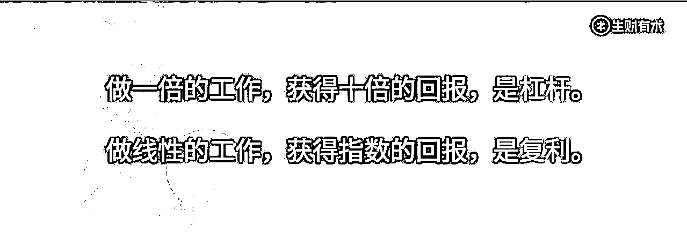

有杠杆的事和有复利的事，都让我们获得了投入的倍率。

而且，这两种有价值的事，在社群的模式下，都能获得。这两者，正是我这一节的关键词。

*

社群的第一个价值是它的杠杆。在两个方面体现：时间、信任。

一方面，社群是时间的杠杆。

这条结论是这么理解的：你只需要花和一个人说话的时间，就能把你想要表达的内容和所有在群里的人都看到。

举个例子，在古代的村落里，信息传播速度最快的地方是哪里？是井边和大树下。道理何在？因为这是原始的村落里，两个客观存在着的、且人类最容易聚集的场所。井边的洗衣劳动，锁住了她们的双手，但并恰好不会占据她们的注意力和表达。

观存在着的、且人类最容易聚集的场所。井边的洗衣劳动，锁住了她们的双手，但并恰好不会占据她们的注意力和表达。

没有电灯光（古代）、没有日照光又睡不着的夜晚，尤其是盛夏，模糊了人们表情的树下，则是大伙一块同步今日见闻的最好的会议室。不得不对话的场景被制造了出来，于是，他们可以在这里进行高频的、点对面的对话。

好的社群也像这样的场景一样，是人们得以点对面对话的所在。媒体适合点对面地发布信号，而社群则适合点对面地对话，再适合不过了。

能点对面地沟通，不正是杠杆么！

另一方面，社群其实是信任的杠杆。

拿微信群举例：你在 500 人面前树立可信赖的形象（包括你的专业性、价值观、你的品格），和在一个人面前树立，其实付出的成本是类似的。

但是我们就可以看到，如果你有同样的成本，在社群里面你触达到的是 500 人，他们对你的印象和概念都是鲜活的。这些积累下来的印象，在未来的合作里面，能不能帮助你消弱掉难以逾越的信任成本？我想是可以的。

尤其是你接下来将会读到和理解到，积累信任的这件事情，本身就是在赚钱。你就会看重这里的 500 倍杠杆到底意味着什么。

*

我是这样理解复利的：过去做的事，价值没有停在过去，还在对未来的事，产生促进和推动。

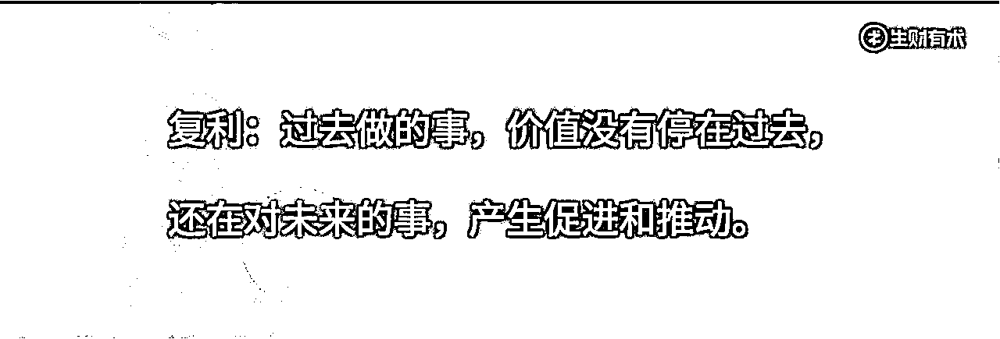

为了解释这样的复利是如何在社群中发生的，我将举一个微信购物群来说明。

想象这样的一个场景：你做了一些群，01 号、02 号、03 号等等，加起来一共装了几千人。你作为一个牛 X 的买手、会选品，搞到了物美价廉的品，也打通了这些品的供应商。

由于你在推荐商品上面特别的克制，你的品控又做得特别好，你逐步积累下来了每个人群的人，以及她们对你的信赖，她们的信赖很简单。不需要信赖你所有的事，我们不需要如此贪心。我们仅仅需要用户在两个维度上、两件事上，相信你。

第一件事情，如果东西是需要的，只要她们跟着你买，就不会出错。

第二个事情是，只要她买了，她获得的价格一定就会比她付出的成本要低。用户购买一个商品。她付出的成本不仅仅是她付出的价格。还有她甄选和试错的成本。

这两件事，群里只要有一个人信、有一个人晒单，很快就会有第二个、第三个人信。

这种共识建立的过程，比逐个一对一私聊的方式来建立，更高效。而且这种共识（或者说信任）一旦建立，是有惯性的。惯到停不下来。你积累下来的社群用户对你的笃定，你能帮助你，越卖越容易。你第一次卖货跟第 10 次卖跟 100 次卖货甩货的效率一定是不一样的。

在用户她的心智中，这个群卖给她的东西，到底是让她更好地生活还是想办法赚她的钱？问问自己这个问题，这个问题决定了这个群做变现的未来，是越来越轻松还是越来越艰难。

越来越轻松，并不是说你的效率越来越高了，而是说，社群的复利在帮助你做事。

复利在社群中发挥能量的场景，并不止购物时相信什么这样的一处。之后设计和经营社群时，不妨问问自己，我的社群有复利、有杠杆吗？它有机会成为一个为你创造启发的问题。

## 2.2 内容沉淀

内容沉淀，也是社群的价值所在。

因为，能否内容沉淀，是不同生命力的社群的重要分野。

没有内容沉淀的社群，是很可惜的。社群里聊过、探讨过、辩论过的事，值得复读的认知和分享，在时间线里被顶上去之后，大概率会再也不被翻出来，像飞鸿踏雪泥一样，就那么消失不见了。

而如果能意识到这一点，为社群设计内容沉淀的机制或环节，或者选择像知识星球这样天然利于内容沉淀的社群载体，那么，每次旧的内容被郑重地再拿出来、再引起讨论，都是在更有效率地放大社群的价值。这一点，我在知乎这个问题下，有过详细的论述，这里指路。

有丰富的、成体系的内容沉淀的社群，也是其他新冒出来的社群无法比拟的优势。

让内容沉淀，开始为社群的全员产生价值。听上去好像很复杂，其实开始实行起来很简单：

如果是微信群，好的聊天内容，有没有人愿意整理成帖子、飞书文档？

聊得好的地方，有没有群友或群管理员对内容做初步的合并转发（于是就打包到一起了）？

群里有没有几位深度参与社群历史的人，能根据当下的探讨找的出来过去的沉淀，把它们勾连起来？

如果这三个问题，你都有 Yes，那么，你就能让社群的内容沉淀，为你的社群，发挥出价值来。而不必每月一次地总陷入到类似的问题里，或者反复重复发明轮子。

举一个离我们很近的例子来说，生财有术里，精华帖之所以给龙珠；精华共读营活动之所以能放大社群的价值，也正是因为生财有术非常在意「内容沉淀」这件事。

## 2.3 关系沉淀

说关系沉淀，一定要讲社群的通讯录。

关系沉淀，其实最基础的做法，是维护一份非常可靠的群通讯录。包括群友的各个介绍，非常有用，作为所有群友的共同财富。

还是以微信群举例：微信群有一个特点，一个新的群友进了群以后，他看不见之前以往的人的发言，所以他也不知道之前以往的人谁比较厉害，或者是该去向谁求助。这个时候我们去把关系沉淀做出来，把群通讯录建立起来，对于后来的每一个人，是方便的。

这个通讯录，也不拘泥于姓名、地址、联系方式、行业和职位等等，甚至没有这些特别 “实名” 的内容，只有：我有能力解决什么样的问题、我有什么样的资源、我对什么样的事情感兴趣、我需要什么样的帮助等等比较不 “属性” 向、不 “标签” 向的内容，也是可以的。

除了通讯录，社群的关系沉淀还体现在哪里呢？还能体现在，一个群内有足够多的人知道你是一个靠谱的人。

甚至你不是社群的群主、管理员，但是多年在同一个社群里长期活跃。当你在需要的时候，（以及群管理的允许下），勇敢的发出自己的需求信号，通过这样的一个弱关系的社群，你会获得超出自己意料的链接能力的。

而别人慷慨的帮助，并不仅仅是因为对陌生人超级善良。而是因为一个简单的、潜在的逻辑，“看你活跃这么多年了，知道你一直都是做这个的。谁也不会为了这样的一件小事，伪装这么多年。相信你，顺手帮一把。”

一个长年人畜无害、在多个行业社群里活跃的人，开发客户的难度相比一个仅仅是通过朋友圈和一对一单聊来拓展客户的人，不知道容易多少。我一位多年的朋友，在介绍她为何总是拿到某知名集团业绩 Top1 并拿到数百万级年薪时，用到的也是在社群中发展自己的方法。

此刻在读这份文档的朋友，如果有类似的经验，因为多年泡社群，获得了一些奇妙的机遇和链接，也可以告诉我、告诉同和你在航海船上的圈友们。

你可以和五个人十个人做十年的朋友，但你很难和三百人五百人一千人做十年的朋友圈。而社群，却可以帮你解决这个看上去几乎不可能的事。

## 2.4 贵人乍现

这里的逻辑，同 2.3 很相近。

但有一个关键词，「见证之下」。

事实上，长期活跃于社群的人，无论是发起人还是参与者，都是生活在社群活跃人士的见证之下的。这种见证的力量，会产生巨大的信任。尤其是你的诉求、你的信号，如果也是在社群里的大家见证之下发布出来的，同时又有其他人在你发布的同时有互动、有声援，那么这件事的可信度，几乎就轻易摸到 100% 了。

想象这样一个场景：

在某 499 人，你多年活跃的微信群里。

你发“公司业务不好，设计团队减员了，出 iMac，都是前年的款”。并附上了一张五台 iMac 的照片。

有一群友问，“上次去你公司看过这几台，都出了吗？”

你说“留一台。”

又有群友说，“干业务不容易啊。什么价？”

你说“和闲鱼价格差不多，但都是国行。同城更方便。”

这时，有一位潜在的群友，点开了你的私聊对话框。

不急，再想象另一个场景：

同样是这个群里，有一个你和他单独加过好友但几乎没有聊过的朋友。

这次，你没有在群里发消息。你单独将上面场景里会在群里说的内容，发给了他。

哪怕他有需求。

你感受一下，在哪种场景下，他更相信你？

这种差别，不是什么业务逻辑，也没有什么数据什么好感值，但是是实在的差异。

而这种实在的差异带来的信任的差别、机会的差别，就是见证的力量。

正是基于这种实质的差别，我想告诉大家，通过社群、通过这种弱链接，更容易获得贵人的信任和结识。一方面来自于杠杆，实现了一对多；一方面来自于见证，潜移默化地完成了取信。

现象上，甚至可以说是贵人乍现。

但假设另一种情况呢，这个贵人加过你的微信。你们没有话题，相互不了解，所以没有开启过深度的沟通。由于你不知道对方的情况、段位也不如对方，很难通过单聊让人对你产生兴趣和信任。大概率的情况可能是，你每年群发了新年祝福，在第二年的时候，发现被删除了好友。

这样两相对比，便更能体会到社群的价值了。

*

写到这里，我算初步地回答了「社群能让我们获得什么」这个问题了。不过，社群的运转和经营是奥妙无穷的，所以，也难免我也可能没有列举出社群能够给你带来的全部。

那么，社群还能给我们（有志于设计和经营社群的人）带来什么，就是一件值得期待的事了。如果你认可这份期待，不妨和我一起探索下面的这个问题，如何建社群？

# 三、如何建社群？

## 3.0 为什么不先聊增长？

先上图。

图不复杂，不过大有门道。可能乍一看看不懂。没关系。容我们逐步讲解。

社群架构图的阅读顺序，是从下往上看的。

列在下面的要素，是上面的要素的赖以成立的基础；而上面的要素，可以反作用于下面的要素，同时在丰富社群本身的形态和特点。左右的元素，表明它们之间的关系是平行的。

比如，上面的图就是在说明一个这样的认知「社群的一切基础，是信任」。这一节，就将从这个话题讲起！

## 3.1 以信任为基础

先让我来问大家一个问题：做好一个社群，最关键最关键的事，是把什么做成？

大家可以思考一下这个问题的答案。

可能你会说，

社群最关键的事，是热闹。

不是，是得有大佬坐镇。

是红包和福利要到位。

是得持续找新人，不持续社群会是一潭死水。

是群主要有影响力，影响力越大社群越简单。

很抱歉，这些答案都不对！

做好一个社群，最关键最关键的事，是把什么做成？

答案其实就是：信任！

不过，信任这个词，太容易在鸡汤和无谓地说教中出现了，以至于大家对它的内涵和价值，产生了某种免疫。认为它是虚的。

这种认识，是一种误解。

以为信任这个词其实是鸡汤用意。

以为信任是美好的空气。

以为信任无形且不可控。

以为信任是讲给别人听的。

以为信任仅仅是在讨论品德的语境里面。

以为信任没有价值。

我认为，以上全错。理由如下：

信任支撑了人类天生贪恋的确定性。

信任是砍掉沟通壁垒的利器。

信任是最好的策略。

信任是可以直接货币化的。

信任不仅仅发生在人与人之间，还发生在人与组织、系统、规律之间。

我想请你回忆：你听过信贷吗？听过信用卡吗？听过 M2 吗？听过准货币吗？听过三根大阳线改变信仰吗？听过共识凝结吗？听过零信任系统吗？

信任这样的概念，在专业的行业里，可以度量、可以计算、可以直接产生货币（烦请航海成员中经济或金融相关的圈友在这里多多批注解释这句）。

信任的所指，并不虚空！

再回头看，我们在第二块内容中提及的现金收益、杠杆复利、内容沉淀、关系沉淀、贵人乍现，很巧，无一背后不是信任在为这一切发挥最最基石的保障。

甚至我要说，在人类史数十万年的发展中， 帮助人类这种高级动物，面对各种不确定时，最有效的策略，就是信任。因为我们人类，天生贪恋确定性。

历史长河中，游牧民族长期搞不定农耕民族的局面，有一个重要的成因，是农耕民族非常大胆地、在不知道地球和太阳到底是什么关系前，对节气这样的规律和周期的信任！信任到敢于把种子在对的时间里，埋进未知的土壤中，并心怀勇气地等待数个月后大地给予的回馈。

让我重申：请记住，人类这个动物天生贪恋确定性和信任，是我们在面对不确定性时积累的策略。

这里浓墨重彩地讲述信任这个概念，本意并不是为了帮大家普及信任这个概念，而是帮助大家把信任这个概念重新摆正，放在应该属于它的位置上。

它在社群里面是属于支配地位的。如果我们把它放错了位置，会因为认知错位而造成我们会在未来社群的战略上反复踩坑，反复犯错。

甚至我在写到这里的时候，想说，如果这份手册到最后并没有像我期待的那样教会你如何做社群，但却教会了你以一种崭新的视角重新去理解和认知「信任」这一概念。我想，我也会是满意的；于你，应该也是值得的。

*

所以同样，信任也是社群的基础。

不过，让人意外的是整个社群在出生的时候，信任其实是从零开始的，这可能有点反常识。

信任到底发挥着怎样的作用？

拿知识付费的 KOL 和他的听众举例说，你可以这样想：我是否相信你的能力？我是否相信你的审美？或者是你这个技能硬不硬，能不能说服得了我？或者是我能不能相信你的价值取向是 OK 的？还有，我能不能相信你的价值判断能力是 OK 的。你给我科普一个新概念，我是否相信你的科普，这些的内容全部都包含在信任里了。

我是否相信你的能力？我是否相信你的审美？或者是你这个技能硬不硬，能不能说服得了我？或者是我能不能相信你的价值取向是 OK 的？还有，我能不能相信你的价值判断能力是 OK 的。你给我科普一个新概念，我是否相信你的科普，这些的内容全部都包含在信任里了。

信任的本质，是在帮助人们解决这样的需求时，进化出来的一种策略。

*

你如果理解了这样的前提，然后去推理，在社群的初期才会做到另外两件事：

第一件事情是招募成员一定要慢；

第二件事是丑话一定要放在前面，这个丑话暂时指的是退出机制。

简单来说就是进人要慢，踢人要快。

在信任的基础上衍生的策略一：慢以凝核

大家划一下重点，这个是在信任的基础上延伸的第一个策略，叫慢以凝核。慢指的是社群的成员增长一定要慢。

因为人类没有办法说 “我们今天认识，我们明天就彼此信任了” ，这个是非常难的。是信任这件事情特别重要，而且又慢。所以在此基础上，我们要做的事情是先去找一个特别小的核心，非常有策略、有决心地先把核心凝结起来。凝结的胶水就是大家的信任，才是应该最开始做的事。

有些社群的设计者特别喜欢坑自己。比如上一周想好了要创建一个社群。在启动的那一天特别着急。一下子把整个社群垒在了 100 人，这个是非常坑爹的。如果是没有共识、初来乍到的 100 人，在很长的时间才能积累出来他们的彼此信任。

对，倒不如你从一个最小的核心团体开始，一圈一圈地把信任的外延不断地扩大，这样反而更快，而且也更合理。有些人比较喜欢社群的扩张特别快，但是越快扩张的社群可能会死得越快。

所以在社群初期，慢以凝核是避免社群夭折的第一步。

在信任的基础上衍生的策略二：退出机制

退出机制其实是一个一听就明白的概念，我们简短地介绍一下。

整个社群在发展当中，成员其实都是盲选的，没有办法说百分之百确定这个人就合适在这个社群里。你选错了就要让对应成员退出，但如果你没有把丑话说在前面，这个人是退不出去的，或者退的时候特别闹心。

所以，我们以先验的智慧，是能预见到这样的事情可能会发生的，那么，我们就要在人进来之后，第一时间把退出机制说明白，否则等整个事情会拖得变成我们不想看到的那样，人可能就退不掉了。

但是社群里不合适的人一旦搁置着、囤积起来，呆在社群里，对社群不是一个好的事情。没有一个非常好的退出机制，最麻烦的一点，是这个社群里的成员，就难以越相处越凝聚的更紧密了。俗话总说，“该走的不走，该来的也就不想来了。”

讲信任，我们真可谓是浓墨了。接下来我们讲一下这个架构的第二层，从小往上数第二层叫做趋同的目的，或者是叫趋同的目标。

「趋同的目的」如果再凝练一下，五个字概括为两个字，那就是「定位」。

## 3.2 社群的定位

定位的意义，也是基石性的。

定位在定什么？其实是在定社群的价值的核心所在。

“这个社群的目的地是哪里？社群将会给成员什么样的价值？社群在整个人群的分布当中，它处于怎样的位置，它想到达哪里，期待拥有符合怎样门槛（条件）的成员？” 这些都是最初的定位。

“我的群就是交易二手书的，一手书去当当买，不要在群里问，没有。”

“聊钱，不伤感情。”

“关于养多肉和多肉的一切。”

“杭州周末好去处，周周组局。”

“写作改变生活。七天写一篇，一起写七年。”

…

以上这些都是定位。

你的定位越清晰，你的社群里面的人才会越不至于失去焦点。

因为清晰的定位可以告诉他们，在社群里面做什么样的事才能帮助到他们，做什么样的事情才能去对他们产生有益的影响。甚至告诉他们，社群里欢迎他做什么样的事。并且，整个社群的价值观，是跟整个社群的定位高度耦合的。

如果只是一个特别小（< 30 人）的群，这个群其实只要足够的信任，他们在一起做什么事情都会很开心。但如果是期待成为规模稍微大一些还能罩得住的群（超过 200 人），这时面临的任务，就是要找定位。而且是需要找以信任为基础的定位。越大的群，越需要去培养以信任为基础的定位。

定位在找到前，可能需要花费较多的思索，而在找到后，会有一种恍然开朗的感觉，“往这个方向去，那不是明摆着的么。”

如果你有这种感觉，大概率你找对了。

这里有一个常犯的错误，当确定社群定位时，可以自己来确定，一个社群成员都没有。但是一旦确定了定位，招纳的人一定是要在认同定位的基础上才来到社群里的。

大家来理解定位的时候可以去记忆这样的一句话，就是跟你的定位不无法结合的事情，能赚再多钱，也不要强行嵌进社群里面做。和你的定位没有办法匹配的人，他花钱付门票，也不要再放他进来。

在这里，定位，是有取舍权的。

用定位，去取舍一系列的活动、策划、巧思应不应该在社群里做，是最朴素且简单的取舍办法。

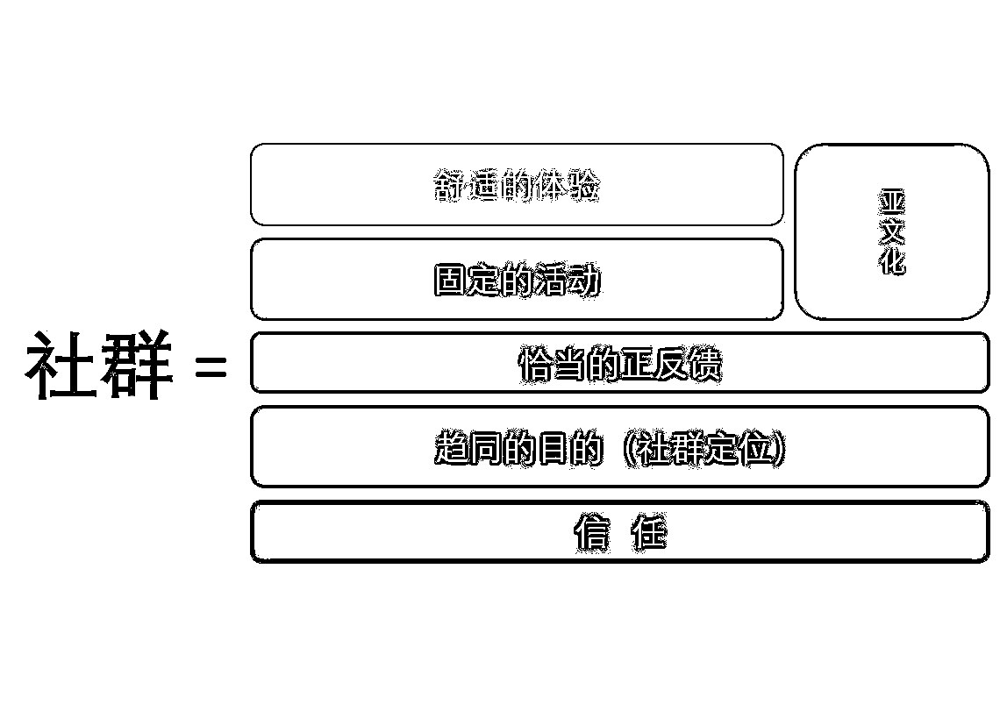

还记得我们社群架构图长什么样子吗？

聊完了架构图里，最底部的两块要素，在这一节里，我们把剩下的要素，一网打尽、一锅炖光。

也因此，这一节的篇幅，肯定长，不消说。

*

### 3.3.1 先从一个社群领导力 Tips 开始讲起

心理学家们发现，其实一个人到底有没有领导力，并不完全取决于这个人自身，也不完全取决于他有没有办法拿到绝对的决定权。

心理学家们发现，其实一个人到底有没有领导力，并不完全取决于这个人自身，也不完全取决于他有没有办法拿到绝对的决定权。

还有一个重要的影响因素，就是有没有人回应这个人的呼应，这个回应的人存不存在？

如果一个人发起了号召，并且立马会有一个人站出来回应他，一个领导力的最小模型就产生了。

这个第一个站出来回应的人，就是这个号召本身的正反馈。

看了这个例子之后，我们再去想，一个社群里面怎么样去发起一个活动？

其实。一个非常接地气的技巧，你发起这个活动之前，先从社群里面找 2 到 3 名铁杆粉丝，先把这个计划告诉他们，听听他们的态度，再邀请他们跟你一起，你在群里号召时，一起回应你。

这个小技巧，利用到了人的非理性、利用到了领导力的构成、利用到了正反馈的原理…如果你对自己的发言和倡议没有底气，可以试试。

正反馈，指的是一个更宏观的事情，或者一个靠得住的机制：在你的社群里，所有有益于你的社群的行为，都希望这样的行为能获得群友的或者是你的正反馈。

比如一个讨论古籍或者讨论玉石鉴定的社群里面，有人突然发出了鉴赏心得或者是得了一件宝贝，请群友帮忙掌掌眼、参谋下等类似的事。如果这位朋友在社群里发声了，却总是得不到正反馈，那么这个群的定位其实可以说是名存实亡的。

不过大家在去设置活动的时候，尽量参考我所罗列的社群常识列表。

不可不知的社群常识列表：

用户只会因为和自己有关而参与；

用户需要清晰容易记的目的；

用户只需要必要的形式；

用户喜欢尽量少的规则，冗杂的规则是大敌；

用户能分给你的注意力极其有限；

用户喜欢付出尽可能少，获得尽可能多；

用户喜欢自己控制局面，而不喜欢被掌控和过多约束；强制要求群友每日参与社群活动，是反人性的；

强制要求群友每日参与社群活动，是反人性的；

信任的积累是缓慢的；

吸引比追求更有效，如果你不懂得如何吸引，你很难做好社群。

这些常识的力量在于，能帮你打破社群设计时的理想主义。做出一个能接地气、在真实世界里运转自如的社群。

比如：如果你想倡导用户去参加什么样的行为？这样的行为对于他来说：

第一，回报够不够高？

第二，他感不感兴趣？

第三，他需要的成本是付出的成本是不是太高了？

第四，他是在被约束，被控制，还是他自己在掌握局面的状态？

第五，你能不能考虑到它其实没有那么多的注意力分给你这样的一个社群？

回到我们刚才说的那个列表的正确用法，它的作用是让你在每一次设计一个活动之后，不要着急拍大腿就想“我这个活动一定特别牛，我一定要推给很多人去听”。其实这是不对的，你做完这个活动一定要先去反省一下。

怎么反省？对照着刚才的社群常识表逐一地去对照，看一看是不是每一关都能过得去。如果绝大多数关都过不去，建议你再想想这个策略是不是真的合理。

想这个策略是不是真的合理。

当一件事不来自拍大腿时的灵感，而来自于一种推敲后的坚定，推动时，就能敢于在社群内有力地为这件事创造正反馈了。群主往往第一个出来响应，往往呼唤更多人响应。

这里再列一个非常魔性的公式和大家探讨。

### 3.3.2 一个魔性的公式

超强激励 = 正反馈 + 随机性

大家可以再去看那张结构图，正反馈是站在定位的基础上。也就是说，所有有益于定位的事、所有有利于推进、发展、扩大我们定位的事情，我们都一定要给它以正反馈，让它不至于总是落空。

甚至这里还有一个小技巧，就是正反馈加上随机性。它的激励效果特别强大。

举例：人类对赌博之所以成瘾，就是人类无法抗拒这种经典的、随机的超强正反馈。

人类对赌博之所以成瘾，就是人类无法抗拒这种经典的、随机的超强正反馈。

走在路上捡到钱引发的狂喜，也是这两个要素的组合。

盲盒手办这种商业模型的关键要素，也是这两者组合，甚至为了强化，人家还出了隐藏款。

抓娃娃经久不衰，娃娃越精致，正反馈越强烈。

再想想让 QQ 邮箱、微信当年日活飞起的漂流瓶、摇一摇附近的人？

以上无一不是这个神奇公式的应用。如果不信，想想上面的场景中， 两个要素任意抽去一个要素，上面的商业模式还成立吗？不成立了对不对。这在逻辑上说明，被你抽取掉的，就是它商业模式成立的必要要素。

随机的正反馈，还有一个作用，就是节约成本。随机和正反馈这两个因素咱们再组合一下，或者说再联想一下，它其实还是微信红包的本质。

有人发红包，正反馈！能抢多少拼手气，随机！

微信当年大战支付宝时，手里的支付盘面的牌几乎等于没有。从 0 起步，使用春晚 + 红包这样的一个产品策略，在一个春节就能做到逆袭支付宝的线上支付的基本盘（绑定银行卡用户规模）。这样的一个效果，其实就是微信团队（龙哥），非常深刻地理解了随机的正反馈、理解了损失厌恶心理。

理解了随机的正反馈、理解了损失厌恶心理。

微信的这次策略甚至定义了互联网公司后来买央视春晚广告的基本范式：拿来发红包。

有意思吧？

2023 年春节期间，我听到有人吐槽，怎么今年不见互联网公司上春晚撒币发红包？那一刻，我先想起来的，就是当年微信春晚上那超神的一战，成就了微信在支付的地位。

### 3.3.3 对群主的正反馈

恰当的正反馈，还有另一个层面的意义，是面向群主的。

首先，一个社群的第一责任人，一定是社群的创建者（都写入法律法规了 :D）。社群的创建者，要做好持续为社群付出时间和精力的觉悟。

一旦你决意去组织起一个社群的时候，你个人的时间成本、精力，一定是躲不掉的。既然付出是必须的，为了这个社群能健康发展，我希望你能赶紧地找到一条：沉淀社群价值。

沉淀的目标是：让社群本身的价值在中后期可以大过你的时间成本。

唯有此，才能为你换来后面的时间杠杆。否则，永远饱满地付出，谁也做不到。如果社群唯有此才能存在，那么几乎等于社群无法长期存在。

之所以无数小而美的免费社群无疾而终，主要原因就是，群主的无偿付出并非无限的。哪怕群主自己，许下过宏愿。

在我看来，还不如免费变付费。用收到的实打实的费用，来回报创建人的时间与精力。一旦收费，为社群的付出，就从自担其重的公益，变成一种履约的责任。这种局面，反而能真正督促一位社群创建者，长期地为社群付出。

而且，每一位社群创建者，都应该更懂人一些。

关于人，我想告诉各位的第一个结论，就是，人非理性人。人一定是非理性的。市场经济里，人是理性人的假说，也是有限理性的。这样的结论，是拿下 2017 年的诺贝尔经济学奖的，是有份量的结论。

怎么去理解？

你的社群创建初期，你可能会有一腔的热血，你有很多的激情、很多的承诺。但，事情是一时的，激情也是一时的，这种一时的行为，都是非理性的行为。

如果从长期看，你没有办法去收获经营社群的价值，那么，你就很难长期地为社群做付出。一旦反复地吃力不讨好、觉得没有必要、付出不被承认、所有人也都觉得免费不损失什么参与意愿也不强，你就会重新想，觉得何必呢。

这也是社群发展的一种动力学。

因此，在设计和思考社群时，也得把「群主（自己）也是非理性的」包含进去思考。否则，想出来了方案，方案也没有那么接地气。至少没把方案的第一执行人（自己）的诉求考虑周全。

而整个社群在没有完成原始积累、没有激发出新的愿意持续为社群付出的成员之前，可能会因为群主的付出热情和动力的消失，整个群快速坠落，也就没有了。

上面的部分，是对 3.3.1 中讲正反馈的一个补充。正反馈，是你作为群主一定要考虑到社群的制度。要学会用起来正反馈的力量。不然，一旦经营一个社群，对你来说，不是滋养，反而变成了一种消耗，从长远来看这个社群也是很难维系下去的。

这事特别容易踩坑，但大家初期很容易忽略。

说人话就是，也劝一句：如果你的付出真的是实打实的，记得收钱。

赚钱嘛，不寒碜！

固定的活动，我为这个要素，做了一个简单的思维导图：

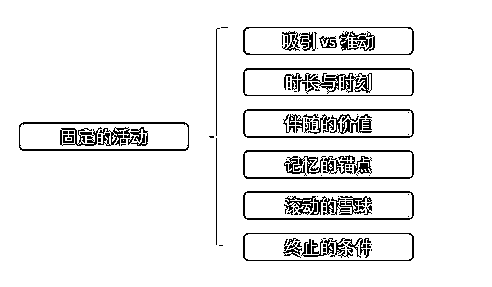

这里，咱们逐个讲讲。

① 吸引 vs 推动

其实社群里的活动，很多时候是发起人和几个核心的成员，想办法去设计出来的。但是设计出来以后，一推不响（无人响应、大家无感）是常态。原因往往特别简单：大概率是你是在推它。或者说，不推不动的活动，都是推不动的活动。

在设计活动的最初就应该知道的是：活动，是你用来吸引用户、激发用户的，而不是去给用户布置作业的、不是推销给用户来完成的。

只有这样，你对整个活动的节奏和整个活动的需求、还有整个活动供应的价值，包括它的吸引点，包括它的引诱点，你都会设计得比以前要好很多。

这个事情跟追女孩子比较像。你死缠烂打可能不是很有用，但是如果你可以吸引到女孩子就很厉害了，对不对？

那么，设计的活动，如何去吸引用户？

你必须学着换位思考，学着把“感受活动在用户眼中的样子”，变成你的本能、变成你的思维习惯，你才会找得到感觉，知道如何去吸引你的用户。

② 时长与时刻

在设计活动时，我们往往需要思考两个设计活动的重要工具：时长、时刻。

我们希望，固定的活动，它的时间点是经过考虑的，这个叫时刻。它时间的长度也是经过考虑的，叫时长。

一般来说，我们不建议错误的时间点里面做活动，也不建议错用错误的时间长度来做活动。

举个例子：一个线上活动，可能需要大家花费半天的时间，活动每周举行两次。这样的一个活动，甚至都不用仔细去想活动的细节，就会发现很明显就是反人性的，哪怕第一天没夭折，你敢期待它未来长期的参与率吗？

细节，就会发现很明显就是反人性的，哪怕第一天没夭折，你敢期待它未来长期的参与率吗？

另外，不要在工作日的下午在群里做活动。到了周末，也记得让大家好好去放松，尽量也不要安排线上的活动。线下活动，周末非常方便，但是线上的活动，还是需要考虑一下是否值得大家牺牲周末时间的。

经验来讲，大多数用户参与活动的规律是这样的：比较黄金的时间点大概是周二、周三、周四的晚上，周末反而不高。

当然，我又要说一个事情，就是万事有反例，但核心的逻辑不变。同样的逻辑，可能反常的安排，也是合理的。

下面，我以举办行业峰会为例，向大家介绍，在思考和考虑峰会是安排在周末还是周内，可能经历了哪些考较？

先放结论，大部分是安排在周内办的。

那么，为什么线下的行业峰会，不放在周末而通常放在周内来做？

因为，一来，参会用户，他们周内参与他们自己所在行业的会议，是具有正当性的、完全可以去参加的。如果周末去参加，可能就属于他自己的事情了（不带薪）。

另外一点，在行业内如果你周内说你去做什么事情，你很容易跟同事说起来的，这样整个业务组可能一起就过去了。而且，事情如果是反过来发生。业务负责人带着核心员工去参加会议。难度不是工作的一种吗？更应该放在工作日。放在周末，大家光是一听到，积极性先都没了。还未入场，好感先减三分。

是一听到，积极性先都没了。还未入场，好感先减三分。

而且，作为会议主办方，把会议办在周内，还可以拒绝掉一些跟行业无关的人。

为什么？因为周末大家都比较闲，但如果说是周内，行业无关的人很难去请假，给领导一个理由他去参加一个跟他行业没有关系的事情。这个理由不正当，假请不出来，就不请了。所以，周内开这种会议也可以把一些是你定位之外的人群去给剥离开来，这个也是择时有所考虑时，显示出来的一个利好。

③ 伴随的价值

这个非常好理解，就是一个活动，哪怕是再小，它也有一个伴随的价值。

咱们小时候都有守着看电视的习惯，知道每周五一定会有个什么，或者是每天晚上九点半后有什么。甚至不管好看不好看，到那个时刻了，大家想起来，都会来看一眼。

你知道每个周期（比方说每个月、每个季节、每年）的一个事儿所在的时间点，又有做这个事儿的合理性，那么，这个事儿，它就会产生一个伴随价值。

大家一想到活动，往往会喜欢贪大，想“我要搞一个大事情、大动作”。但大活动经常搞，谁也经不住。活动不大，每周一共只占用半小时到一小时，但是周周都有，可能是更适宜的。

甚至我们来说，这样的一个伴随价值，它每天哪怕有 1 分钟到 5 分钟，准点发生，就会产生它的期待。

我给你们举一个例子，罗振宇，他在公众号每天早晨会死磕自己来个 60 秒。对这样的一个事情，时间长就非常短。但是从长远（十周年）来看，伴随的价值是非常鲜明的。

④ 记忆的锚点

固定的活动，再小都不用怕，小比没有强一百倍。大小并非最重要的，另一件事更重要：用户获得比用户投入高。

不少社群的创建者，他们来做活动，会总想憋个大招。其实完全没有必要，这样反而去局限了自己，说我们应该找一个怎么样的大事情来做。一两次后就想不出来了，反而把自己逼到死胡同里了。

持续地做小事，反而更简单。只需要保障「用户的获得比用户的投入高」，这样的小事，就永远了长期运转下去的力量。

固定的活动还有另一个好处。它能在用户的认知里创建一个记忆的锚点。这能让用户条件反射式地记住你的社群。很多社群玩着玩着就死了，因为群无特别之处，大家对群也没有任何独特的认知。但如果一个社群有固定的活动，在发生有意义的小事，这个群至少无论死活，是被人记住的。

记忆的锚点，我再给大家举两个例子：

这种滚动，还能起到另外一种作用：它可以帮助你把真正的铁杆粉丝去筛选出来，也可以帮助你的社群给用户留下更多的记忆。无论是在两个中的哪一点，这个过程其实都是在让树生根的一个过程。

忆。无论是在两个中的哪一点，这个过程其实都是在让树生根的一个过程。

我们很难想象，没有扎根的大树，如何在各种风雨动荡中挺立身姿。

而如果把整个社群的成员和外部潜在的目标用户，当做土壤。那么，社群里有局部影响力的铁杆粉丝，就是你的整棵大树的树根。因为是他们在抓牢土壤，他们在更方便地帮助整个社群把人们聚集起来，而不是你自己独自完成这一切。

所以大家也可以看得到大规模的社群，它会分一些小组长，或者是行业里不同方向的高手。特别大的社群，它会有各个城市的分舵，每个舵都会有一个小舵主。

⑥ 终止的条件

哪怕固定的活动，有诸多的好处。也有一点，是需要提醒诸位的。创建这个活动时，记得一并想一想它终止的条件。

事情的发展，是充满意外的。而创建一个固定的活动，不等于永远去背负它。所以，最好最初就给出它结束的条件是什么。

这和「丑话说在前面」的道理是一样的。当事情的价值增量不达预期，或者开始起变化时，给自己一个机会，让自己合理地停下来，是重要的。

### 3.3.5 亚文化

框架边角的亚文化，是什么，价值何在呢？

这一节，来讲这个话题。

亚文化，这个概念不直观，我来举一些实例。

比如，弹幕之于哔哩哔哩。弹幕在国内，是 Bilibili 的首创。其他平台的也放弹幕，但最有弹幕文化的，依旧是哔哩哔哩。这种一个平台的特色行为、特点功能，容易形成该平台的文化。比如 “空降”、“前方高能” 这样的梗，都是衍生于弹幕这样的功能之上的。

再比如表情包。你知道吗，颜文字表情 →_→ 之于「最右」App。这样的一个颜文字，居然可以催生出一个叫最右的段子 APP。而数字 233333 为何表示大笑，则是从猫扑社区走出来的一个文化符号。猫扑论坛的论坛留言功能，可以输入表情包编号，直接在回帖中显示表情包。而第 233 号表情包，就是大笑并捶地。当年所有在其他地方看见 233333 并好奇且费解的人，都会被这样的一个符号引流，带回到猫扑社区里。

再说到 Bilibili，它是真懂自己的亚文化（社区文化）的，Bilibili 用自己的社区热梗持续不断地做官方表情包并实时更新出来。它是我见过唯一这么做的平台。

之所以亚文化的位置，和固定的活动、舒适的体验一起，正是因为，它们是相伴相生的关系。在全图上，亚文化立在正反馈之上，也说明，它同样是以正反馈为基础的。

答案显而易见，从固定的活动和舒适的体验里，诞生了共同的经历、共同的记忆，逐步一小块一小块地形成绰号、共识、段子、表情包、梗。而这些，都是文化的符号。

脱口秀演员李诞经常说 “不提倡在脱口秀大会说内部梗”，就是因为脱口秀演员本身，不可避免地形成了一个共同体。这个共同体里的梗，被认可度超级高，而且共同体之外的人是理解不了的。如果内部梗过多，共同体会面临难以破圈的难题。所以，看

2016 年各个公司纷纷下场做 APP 的时代，最大的教训就是初出茅庐的小团队们，光解决界面的流畅度问题、体验问题，不解决真正有价值的问题。最后程序员、业务组、投资人一块抱团团灭。

经历过那时候的用户，估计还能记得一批很美好、体验很不错，但就是不知道能拿来干啥用的产品。

从体验切入（社群框架的顶部）而不从社群的地基切入，就是典型的创建社群的误区了。

那么，能不能基于这个框架，大致给一种创建社群的流程上的参考呢？

我想，是可以的。只是在阅读这种参考之前，我希望大家能明白，参考只是参考，并非固定不变的 SOP，不要反而被这种参考锁住了手脚。

Q：如果我来做技能成长型社群，哪怕是我不会的技能，我会怎么起步，如何一步一步做呢？

A:

① 首先，我不会先着急建群。

我想先去看，在没有我的社群时，希望学习这些技能的人都散落在什么地方。我要扎入这个群体之中去培养自己的兴趣，理解这个群体的兴趣。

我会尽可能地列出大家在提问或讨论这种技能时用到的专有名词，无论这种名词是一个按钮的名字、一个错误提示的文案、一种学习这个技能的软件的名字、一个此领域的 KOL 还是这种技能里的分支概念。

我会在一切有搜索框的网站和社交 APP 里搜索我找到的专有名词（或者称为指纹名词、标识符）。看看大家在什么情况下说这些话，为什么说，是想讨论什么，是哪里遇到了困难。如果我搜索朋友圈，发现我有不联系的好友常常聊起这个技能，我会单独和他聊天、约电话，了解这个群体从 0 到 1 的路径是如何走过的。

我会尽可能地关注在这一技能方向上做内容创作的人或商品，最好是通过有推荐系统的平台。这样，我关注的足够多以后，推荐系统会源源不断地给我推荐相关的内容创作者或相关的商品。在今天，我会选视频号、抖音、Bilibili、快手、淘宝、小红书。

直到我开始明白，一个技能的新人，踏进这个技能领域，容易踩哪些坑、容易犯哪些错、最经常冒出哪些疑问，怎么才能真正入门，哪些书是这个技能的好书，哪些文章是这个技能的好文章，哪些人是这一行里得到推崇的高手。

直到我掌握清楚，这个行业里重要的事在哪里发生、新闻在哪里发生、机会在哪里发生？

直到我如果接触到一个新人，和他在线上聊天或线下喝咖啡，他惊讶我为什么如此懂他？他会觉得我怎么和他有这么多的共同经历？

如果我做不到这一点，我会亲自扎进去当一个小白，从零学这个技能。我会带着两种视角去学。一种是该怎样就怎样的白纸状态。另一种是退一步、高一尺的俯视视角，关注自己卡在哪里、困惑哪里、如何找到突破。我会为两种视角都做笔记，这样，我将更懂我的用户。

由于以上的事情，我如此投入地去做，在这个过程中， 我认识了 100-200 左右的潜在种子用户，也是合理的。

② 接着，我会想定义一件对刚入行的新人，有意义的小事。

这件事是需要探索的，但我没有那么着急。

或者是为这个行业建一个导航站，并拿这个站寻找愿意一起维护它的人。或者是我不停地拿重要的行业情报去请教高手，并把他们的观点整理消化、输出成文章。或者是我去逐字逐句地翻译（汉化）这行里非常重要但还没有被翻译成中文的资料，免费地放在网上，一章一章地公开。或者是雷打不动地每周想出一个练习技能的案例，为这个案例找愿意练手的人，为练手的人找愿意点评作业的人，为点评作业的人众筹练习的人的红包作为感谢。等等。

有意义的小事是具有召回力，而且能精准筛选出目标用户的事。它很难找，但我会多想一想。

不过如果我建站，我会先用飞书导航去建站，而不是写代码、搭网站、注册域名、申请 ICP 备案。敏捷地验证比章法更重要。

如果我逐字逐句地汉化重要资料，我会先用 ChatGPT 和 Google 翻译帮助我，而不是自己哼哧哼哧逐词查过去，懂得借力很重要。

③ 然后，我会带着我找到的这件小事，和我的目标用户聊。聊他的兴趣，聊他听到这件事的好奇心，聊他的参与意愿。以打量这件事本身的吸引力。

④ 我也会从我的种子用户做起，内测群。

能用微信群做的，先用微信群做。测试固定的活动，是否每多做一次，社群的凝结力会更强了。我会和种子用户讨论参与这件事的成本，讨论从这件事里获得的体验、反馈和成就，讨论如果这样的一件事需要付费才能运转下去，他们愿意付出怎样的成本。

我也会观察，有没有人私聊我，告诉我他准备邀请什么样的人加入这件事。

我会着手整理一个零基础的技能新人，晋级的路线图应该是什么样，知识图谱应该是什么样，检查清单应该是什么样。每个月应该学习什么，练习什么。并测试它的反响。

如果我的内测群，一切运转良好。它慢以凝核，它积累了信任，它的所指是清晰不混乱的，我会试着扩大一步。我将先从一部分我自己的影响力覆盖所在，为它招募成员。并继续保持观察。

⑤ 再之后，如果这样也没问题。我会尝试为这件事构建增长的渠道（我将使用的方法，会在 4.3.2 节详细介绍），并衡量哪条渠道效果好，尝试着去维护它、强化它和深化它。

同时，我会开始正式地筹备加入社群该知道的事的物料，像小册子一样，让每一个人都知道加入社群后最值得做的事是什么，哪里找得到社群的知识沉淀。

⑥ 我会直接为社群起一个好名字，为社群定价，宣布内测结束，开始收费。在价格上，我会效仿亦仁做一些涨价策略，创造一些紧迫感。

⑦ 我的朋友圈会不编撰地分享我社群里发生的故事。谁拿到了什么成果。谁付出了什么代价。我因为社群里的发生的事，有了哪些新的思考。

我会讲社群里高手的故事、新手的故事、特别的故事。如果故事不多，说明我和社群成员一起做事情还不够久、不够近。

我的公众号也会这样做。如果我会拍短视频的话，这也会是其中的内容。我会鼓励社群里的其他成员也这样做。将社群里的事，当做生活的一部分。

如果我没想明白可以给社群里做贡献的人什么回报，我会先发红包。

⑧ 我会找到一件社群里的成员只要想参与就可以参与进来的事。

比如和社群成员共创一本在线的《技能入门实战手册》。我们探讨和梳理重要的问题，邀约社群里有能力完成它的人一起来完成。对某一节有独立贡献的人，我会写到第一页，写他的名字，写进共同的作者里。对细节处有推敲贡献的人，我也一并在手册末尾感谢。

哪怕没有手册，我也希望社群里大家的认知、知识，有所沉淀，不致消散。

这本手册有雏形，路线没问题，我就会带着这个手册去交朋友。我会告诉别人，这里发生了一件这样的事。一伙人在共创一份手册。如果这份手册可以放在小报童上做付费阅读，我会和手册的作者一块分享这里的收益。

我会思考社群如何帮助一个敢于实践的新人从零到一，如何从授课型的社群转向前期授课后期陪伴型的社群，我希望社群收到的不是课程的钱，而是身处其中不愿离开的钱。这两者不同，因为社群是一个共同体。

这样的社群，算是走上了轨道。这之后，我会不停地思考社群的原点、社群的增长、社群的价值、社群当下最重要的事是什么、有没有在做对的事。我也会一直思考，如何更好地传递社群的价值观、凝结共识、激励付出、修剪枝叶。

我想我说清楚了创建一个社群，想办法使之结实、成立的路上，大概发生了什么。同时我也说清楚创建一个社群，和做一份社群运营的工作的区别。

但读到这里的你，我希望你没有忘记，以上只是一种参考，而不是标准的做法。它大致反映了创建社群的面貌，希望对你有裨益。

## 3.5 什么是社群牵头人应有的品质？

这一节的标题，大致等价于“什么样的人适合建社群？”

抛开繁纷的概念和运营上的技巧，甚至抛开社群最底层的认知和逻辑，来回答这个问题，可能更合适。

我认为，下面这样的人，适合建社群？

真诚的人更适合建社群。

喜爱分享与交流、抵得住挫折与冷清的人更适合建社群。

乐于走近人，善于理解人心的人更适合建社群。

这些才是先决的条件。

至于做着做着就明白了的事、能够习得的认知和能够学到的技巧，乃至一些运营工具或软件啥的，全都先不用管。

这些全藏在后天里，不要背这么重的包袱。实践时留心就好了，学到时试着掌握就好了。

也正因为如此，本节的标题，是「社群牵头人应有的品质」，而非「社群的牵头人应该懂得的知识」。

# 四、如何增长社群成员？

用户增长、成员招募、社群新增，这些说法，背后都是对同一个问题的期待，即「如何增长社群成员？」

而一想到这个问题，大家会自然想到一些词，引流、裂变、钩子、SEO 等等。但社群成员的增长，如 3.0 节所述，又有差异。

但无论如何，让我在这一章节里，把增长的话题聊透吧。

## 4.1 社群的冷启动

社群的冷启动，这个社群第一次涉及招募成员的环节，应当界定为社群的第一次增长。

冷启动一般从哪里招人呢？无外乎主页发通知、兴趣小组发帖、发朋友圈、发公众号、好友群发，等等。

在这个环节，很少投放广告、买推送刊例或者是着急做分佣推荐，会显得比较莽。

我们上面在聊信任时，讲清楚过「慢以凝核」逻辑。在我看来，社群的核如果还没有出现，依旧应该认定，整个社群还处于冷启动阶段。

而形成这个核，也是这个阶段的成员招募的重点。在它出现之前，不建议着急于社群的规模。

是这样的：

① 小范围地招募成员；

② 思考谁应该出现在这个群里；

③ 思考社群未来应当如何甄别成员；

④ 如何与不合适的社群成员说再见。

哪怕是在需要付费的社群里，每位成员都是付费加入的，以上的问题依旧重要。

而这些思考和实践，也并非了无痕迹，润物细无声的。它们会产生初步的结果。即，社群的内核（成员）开始出现、显形了。

太早关注社群的规模，并非好事。如果核没有出现，或者建立社群内核的路径没有想清楚，社群的规模越大，所要引导和梳理的 “混乱” 也越大。

以上的办法，很难以一个定量的结果方便大家判断，到底做对了没有。可能会比较难把握。不过没关系。不必抱着掌握的心态，去建社群、去招募。

做崩几个社群吧！一个不够！

建议大家做到一个比较矛盾的平衡，叫「莽撞又细心」。「莽撞」就是说你敢于动起来，「细心」就是说你在动起来以后，你能做一个体贴入微，观察得比较深入的一个关注者，进一步的去关注这个社群哪些地方对于你来说是失控的。

做一个莽撞又细心的社群创建人，先动起来，小范围地测试，密切地关注自己最初的几个群，是如何被自己做崩的。在做崩社群之中或之后，再来感受手册里的内容，可能是更好的策略。

诸如 “是的，就是这种感觉” 和 “我能感受到这次没做成是哪里出问题了” 这样的判断，都是好的心领神会！

## 4.2 社群里的吸铁石

社群的吸铁石，就是社群的吸引力。

怎么理解社群的吸引力？

想象这样一个场景。比方说，我们的群友跟其他人在饭桌上聊起这个群时说：哎！你快加进来吧，这个社群 XXX 。那这个 XXX 的东西他会不自觉地讲什么呢？

如果说 100 个人像上面那样做这个社群的转介绍，有八九十人讲的都是一样的。这个一样的事情，可能就是大家眼中的社群最关键的吸引力、吸铁石。

这样的事情有的可能是常识里面的、或者说大家很容易想到的。比方说，这个群总发红包，这种吸铁石算是比较客观的、也比较大众，就是说每个社群都能具备，只是看他想不想。

另一种社群，它的吸铁石，可能是社群里独特的、稀缺的、甚至是唯一的。而且越独特、难获得、稀缺、唯一，吸引力就越强烈，这个社群本身的活力就会越强。

我简单举一些例子，大家感受一下：

内推群，“这个群能改简历，负责过大厂招聘线的同事，亲自教你怎么改，改出美团味儿、字节范儿。”

古玩群，“群里多个鉴伪高手坐镇。你不认识的物件，对群里的高手来说，可能就是一眼假。”

搞钱群，“群里白手起步从 0 到五十万以上的高手，不下十个。而且他们都爱分享。”

*

社群的吸铁石也决定了另一件事：当我们招募社群成员时，我们的宣发应该把什么放在中心？

我们用的，可能不单单是自己的影响力，因为总有自己影响力覆盖不到的地方。在影响力覆盖之外的地方，用影响力难以破圈、开拓局面。也不单单用自己的私域，自己的听众群体。因为是存量，规模还是比较有限的。

圈、开拓局面。也不单单用自己的私域，自己的听众群体。因为是存量，规模还是比较有限的。

那我们应该用的是什么东西？其实社群的吸铁石，主要是想回答这样的一个问题。

拿社群的吸铁石，来做社群的宣发，是最顺畅的。

行业上普遍的逻辑，是详情页的逻辑。几大块，什么故事、怎么背书、怎么力证、什么大纲、如何退款。没有这样的几大块，当然大概率已经很差了。但目前，大家还是比较卷。这样的几大块，几乎是课程宣发、训练营宣发、社群宣发的标配。

所以，如果你只有这几大块，而缺少了更独特、让人印象深刻心向往之的一件事，做出来的宣发物料、素材，从观感上，还是会千篇一律，和用户能接触到的其他群，相像、没有辨识度。

我们如何独特？为什么人们值得走近我们、走进我们之中？定义清楚社群的吸铁石，用它去回答这样的问题。

吸铁石一旦明确了，能够对社群的增长和招募，产生四两拨千斤的效果。

这也是我认为做社群增长的底层思路：并不着相于做增长、拉成员，而是思考，如何建设一个真实的所在，如何建设一个部分人的向往之地。如果想做好社群，壮大它，完美不是它的必选项，但向往一定是。

我们之前讲过某社群的一个口号，“7 天写一篇、一起写 7 年，7 年后一起去南极。” 然后海报上，画了冰川与企鹅。这样的一个口号，就是很引人入胜的、令人向往的，会让人不自觉地，去想想那个场景的。然后心里可能会冒出来一句话，“是挺好的呵。”

口号，就是很引人入胜的、令人向往的，会让人不自觉地，去想想那个场景的。然后心里可能会冒出来一句话，“是挺好的呵。”

有了这样的口号，和围绕这样的口号建立起来的细节，是重要的。

它甚至不需要写出，我的费用多少钱，这个群里面每周有谁来分享，群里的神秘福利、神秘嘉宾都是谁。没有这些常见的拼凑组合加分项的思路，也能够把这个社群的规模做起来。

因为他找到了一个吸铁石，这个吸铁石甚至是很尖锐的，是直指人心的。让大家感受得到这个群不一样，会深刻烙印牢牢记住的。

“有它在，它是成立的，没有其他也无妨。” 如果这是用户的感知，那它就是对的。

*

话风一转。

我们当然是希望每一个社群都有吸铁石，但通常的情况是，找到吸铁石确实是难的事。

所以，定义吸铁石，一直在路上、一直合计着、琢磨着、探索着，不期待一蹴而就，反而是正确的心态。

找准吸铁石后，社群不是成不成立的问题，而是会在增长、发展这样的事上，上新台阶。

吸铁石的说法，提出了一个问题。并且，这个问题应放在重要的位置上。

## 4.3 从社群的“引流”聊起

与其说是社群引流，我认为更准确地说法，是为社群做渠道的建设。

但为了便于理解，下面的部分，依旧是两种说法交替使用。

讲讲我对社群的渠道的定义：

用户在他常出没的地方，见到了你的内容，听说了你的消息，受你吸引和指引，来到了你的社群。那么，从他常出没的地方，无论是线上还是线下，到你社群，这样的一条通路，对于你的社群来讲，就是你的社群渠道。

*

社群引流、社群的渠道建设，如果是建立在我们社群有吸铁石的基础上，如虎添翼。但如果暂时还没有吸铁石，我们也要去做。

行动起来最重要。

做渠道建设前，你需要做这件事——把整个社群的各种物料给建立起来。

我们总是在不同的平台、渠道上面去推内容，无论是视频、文字、图片还是音频。这么推内容，其实是在向公众做证明题，证明我们的社群存在、我们所描述的价值存在、我们所描述的优势存在。

那么，哪些可以是我们用来引流的渠道？

### 4.3.1 从自有渠道引流

最简单的引流的渠道：举个例子，大家可以看一个面向职场人的公众账号，叫「辉哥奇谭」。

这个账号，处理内容的手法是很典型的。他在每一篇的正文，下面都像插曲一样，去放一张图，展示自己的付费知识星球正在发生的事情。这个位置过于固定，以至于像在文章中开辟了一块地方做专栏。

这样，几乎每篇文章末尾，都能对他的知识星球做透出。这样的做法，是很持续的。但这里面有一个常见的误区。

叫做「对全部成员可见，不等于全域曝光」。

我们很多人都有自己的影响力基本盘。或是公众号，或者抖音，或是小红书，或是贴吧，博客，论坛等。但哪怕在你影响力最大的地方，大部分人也少做了一个事情，叫持续透出。

很多人会认为，我已经特地发了一篇文章或者视频专门介绍自己了，这样就够了。

其实这样是完全不够的。

为什么不够？

我们拿公众号来举例子。

## 1\. 公众号渠道

公众号的打开率可能在 2% - 3%，已经很高了。但这也只是意味着你这一篇文章，哪怕所有的 3% 的阅读都是你自己的读者，你也还有 97% 的读者，根本不知道这件事情，不知道你建了一个社群。

这中间，差了 33 倍。

如果你是因为羞涩，所以只发一次。或者是由于找不到你认为对粉丝不打扰的方式发布，所以就只愿意打扰一次。简单算一下，你大约相当于放弃了这一渠道的 32 倍的增长。

那你说，多发几次就好了。一样的文章反复发它几遍。其实这样也是不可取的。因为这样对那 3% 的用户是一种反复的干扰。

所以说，我们建议你不停地去变换新的形式，或长或短，持续的去做这件事情。因为只有这么做才能够起到在这样的一个单渠道做到了全量透出的效果。

所以，全量透出，并不取决于你在发布的时候是不是选择了所有人，而是，实际上所有人知不知道你做的这个事情。这两个事情的区别还是很大的。

我们刚才讲的那个「辉哥奇谭」，就是一个很好的例子。它其实每一篇文章都用了一个有差异的短篇去做透出。以及，当他的文章写得好，超出了正常的阅读量时，也会到达新的群体里面。

截止目前，他的知识星球的成员数已经突破 1.5 万人了。他的星球的年费是 420 元一年。

## 2\. 小红书渠道

我们再拿小红书举例子。小红书上的引流，通常是比较低调的。一般也是，在账号的主页上已经放置了个人微信、助理微信、社群应该联系谁就好了。

事实上，像小红书、哔哩哔哩、抖音这样的账号，跟真实的世界所有接触的点位当中，浏览量最大的一定不是账号的主页。虽然，每个作品都会导致一部分用户去看了主页。

用账号的主页去做透出，仅仅证明了我们确实埋下了一个渠道的入口，但它的体量并不可观。想象一下，用户在自己的 Feed 流里面看到一个视频的更新，一个账号更新，他有多大的可能性顺着视频点到主页里面看一看呢？其实这个转化率一般是千分之几这个级别。

最好的办法，可能并不是在账号主页透出加入社群的线索。而是就地解决！在你当日新增播放量最大的作品的下面置顶一条评论，可能效果更好。

那么，有没有办法把社群招募这件事情本身，作为一个内容发布出去直接引流呢？

也是有办法的，但这个难度比较大。因为你既期待这个内容起到传播的作用，又期待这个事情起到招募和转化作用，这两个平衡并不好做。它们会彼此削弱。

一般不建议，但也值得一试。

*

上面讲清楚了我们在建设自有渠道时常犯的错误。

下面，还要讲另一个事情。讲一个关键词，叫信念感。

就是说，我一旦决定做这件事情，我要自己坚定地相信，我做的这个事情是好的，是有益的，是尽我自己最大的努力从我的用户需求出发的，不仅仅是我拿来变现的，同时也是别人需要的。

如果没有这样的一种「用户很有可能需要我的社群，只是还不知道我的社群有多好而已！」的信念感出现，每次提及自己花心血亲手做的社群，花精力在运营的社群，就会觉得自己是在打广告。

这种心态，会很影响自己把这样的宣发渗透到自己平时做内容的方方面面。进而在实质上，影响社群的增长。

当然，我们认为那种比较极端的、非常 spam 的、所有的能透出广告的地方都想方设法地打广告的、广告感巨强的账号，是非常讨厌的。我个人也很反感这样的人。

但，这并不是说打广告是不对的。而是说，不厌其烦、不分场合、打断别人的话题去打千篇一律地广告是不对的。

我们一定要有一个信念：哪怕我们全方位地讲，也可以和那些像狗皮膏药、像牛皮癣一样无处不在的做法不一样的。

我们是在分享我们自己打造的作品，而非拿着我们的社群做流量变现。

我们在通过我们的作品创造价值并获得酬劳，而非圈钱和割一波韭菜。

我们的用户，对我们表达的是认可。

他们用脚投票，在我们的社群里活跃。

他们用钱包投票，付费加入我们的社群。

这种信念感，将驱动我们更好地思考和实践如何构建，将支撑我们更坦然坦率地推荐别人付费下单加入我们。

（附：将用户称之为韭菜的人，在我这里，是永远学不会社群的构建和经营的。)

*

如果你不希望千篇一律地宣发社群，还可以怎么办呢？

答案很简单，从社群里就能找到。

因为，一个健康的社群，里面发生的事情是方方面面的。你完全不必每一次都是拿着这个社群的整体去对外面展示吸引力。

这一周可能是拿社群里发生的段子去讲；下一周可能又拿我们整个社群共创出的好内容去馋人，再下一次可能是公开复盘我们举办了一场什么样的线上活动，以及这个线上的活动带来的反响。再下一次讲我们的用户由于加入我们的社群，发生了哪些改变、拿到了哪些成果。

这些都是独特的社群氛围、社群价值的不同侧面。拿这些作为一个吸铁石，作为一个有吸引力的引流的种子，其实很自然地就能丰富我们宣发的内容创作。

我将这样的方法，称之为「万变不离其宗法」。因为宗生万变，以万变引人入胜即可。

（读懂这里，大家应该更能明白，为何我们要花一、二、三这么大的篇幅去介绍社群的宗了。道理非常朴素，因为无宗，无法生万变。)

万变会不会引起大家的反感呢？

其实大家反感的并不是并不是你做了社群这件事情，或者是你有一个商业化的产品。大家反感的是，你把大家已经知道的信息一遍又一遍的反复透出。

像是鲁迅说的，极度絮叨的祥林嫂。

相反，那潜在的用户是不是排斥呢？

不排斥，因为可能他所期待的是：上次讲的事情他已经知道了，他也期待加入，但目前他所看到的，还不足以让他形成决策。那么，自然而然，你得回答一个问题，你有没有一些更有力的东西让他更好地去判断该不该加入到这个群体里面？

*以上的分享，其实已经把我们引流路上、渠道建设路上，最常见的坑、误区，以及对应的逻辑，都讲明白了。

以上的分享，其实已经把我们引流路上、渠道建设路上，最常见的坑、误区，以及对应的逻辑，都讲明白了。

在渠道归类上，自己的朋友圈、公众账号、小红书、以及哔哩哔哩、抖音、快手、视频号等等短视频账号，都算是以自己的影响力为辐射半径的自有渠道，自留地。

接下来，我们讲讲自留地之外建立渠道，我们是如何思考的？

### 4.3.2 从外部渠道引流

要知道，在我们的影响力辐射范围之外，我们就是透明人。那么，我们应该如何让别人在意到我们呢？

这个问题，可以用一句话回答：选择恰当且有力量的载体，融入我们的内容。

找到一个好载体，是十分重要的。

业界常有找风口、坐飞机、上电梯这样的比喻，形容找到载体这件事情。热点就是一个载体。但载体不一定非得是热点。

如果一个人无论对方聊什么，他七转八转就能把自己擅长的话题与之呼应上、结合上，那么，对于他来说，万物都可以是他表达自己的载体。

达自己的载体。

但，有一个误区是：也有人在蹭热点载体时做了很大的曝光，很大的播放量，但是他所做的内容里面没有他自己。他在追热点的过程当中，把他自己的东西丢了，无论是他自己的价值观、他自己的判断、他自己的存在感还是他自己的产品，一点儿都没有结合进载体里。

这样，数据再好看，也没有意义。

那怎么做呢？

我举服务于行业新手的社群，演示一个普遍的做法。

第一步：挖掘和罗列清楚行业新手聚集和交流的公共空间，无论线上还是线下；

第二步：收集行业新手最常见的问题，无论是通过调研、搜索还是打电话直接问典型用户；

第三步：筛选出你最看好的 100 个问题，让你的典型种子用户投票，问他们，哪些问题是他最期待知道答案的；

第四步：挑被投票最多的 20 个问题，为它们精心准备内容，先以文字稿为主，一定要用新手愿意读、能感同身受的语言；第五步：找到公域里讨论这些问题的地方，将你准备的内容，贴上去，选最适合那个场景的形式，无论是图文、视频、短视频、语音还是其他；

第五步：找到公域里讨论这些问题的地方，将你准备的内容，贴上去，选最适合那个场景的形式，无论是图文、视频、短视频、语音还是其他；

第六步：每日巡一圈儿，观察数据反馈，在数据可观的地方，建立渠道。

谁懂新手的全部常见问题（FAQ），谁就懂新手，谁就能取得新手的信任，谁就能让新手走近。

如果你还想得起来你自己作为新手的细节，能真诚地讲述，你是如何从新手的过程中一路走出来的，也是一个非常好的、适合放在主页置顶的内容。

这里面甚至还有取巧的方法。

我知道很多服务技能型入行小白的人，仅仅是认真地去这些生产力软件（如 Pr、Ps、剪映、达芬奇、Anaconda 等等）的官网或手册里，把它们的 FAQ 内容找出来，把它们用户论坛里的常见问题找出来，视频化地呈现出来，就能解决好小白的 80% 的问题，成为能帮助他们、能每年赚个数十万打底的大 V 了。

*

当然了，这样的事里，仍然有误区。

当我们去找常见问题的时候，常常发现，就是我们以为的最重要的问题，跟用户最重要的问题其实并不是一致的。

这样的情况，不要想当然。需要我们想办法把自己的姿态放得低一点，再低一些，去扎进用户里，看看用户最爱问的、最经常问的、最关心的到底是什么。他最关心的，甚至可能是很傻的问题，但哪怕是这样的问题，你帮他解惑，他也会感激你、认可你。

而如果，你在他没有提示的情况下，说出来那个令他辗转反侧的问题，并给出了完美的解答，会给他的心灵产生极大的震撼！

读到这里的朋友，恭喜你。

我在这里留一个作业：如果你已经大致想好了未来想做什么社群，请逐一回答下面的问题。

形容一下，你的潜在用户是谁？

调研回答，他们最经常问的 20 个问题是什么？

为什么是这 20 个，你的证据是？

其实，常见问题就是你走近你的用户的载体。而你的回答，就是你融入问题中的你的独特内容。

这样的载体为何有力？

因为他们是用户最关心的内容。

这个就是我们对“外部渠道”怎么建立的思考和举例。

体量很小时，建立外部渠道，最常用的策略，就是这种我称之为当风轻借力的方法。但同时，请注意，不要在借力的过程当中丢失自己。

《临江仙·未遇行藏谁肯信》

侯蒙

未遇行藏谁肯信，如今方表名踪。无端良匠画形容。当风轻借力，一举入高空。才得吹嘘身渐稳，只疑远赴蟾宫。雨馀时候夕阳红。几人平地上，看我碧霄中。

拿知乎为案例

2017 年，我做知乎的那个知识星球的时候，其实一共在知乎就回答了 4 个问题，回答完以后再也没有管过，那四个问题那一年帮我赚了六位数的收入。

回答用户关心的问题，比回答自己关心的问题，更能关心用户。

响应用户关切的话题，比创造自己关切的话题，更能关切用户。

查理·芒格说，钓鱼的技巧，很简单，去有鱼的地方钓。

反过来就是我们希望先把鱼竿放下去，然后希望有鱼游过来。一个以我们自己为中心的观点和方法，不一定是对的方法。

我这里可以提供一份列表，供大家观察这些问题的热度（网页版打开，看右上角浏览数据）以及高赞回答是否商业化：

如何把皮肤养好 ？ - 知乎

新手求教多肉怎么养？ - 知乎

英语好的人是怎样背单词的？ - 知乎

有什么相见恨晚的背单词方法？ - 知乎

你有什么相见恨晚的知识想推荐给年轻人？ - 知乎

得了「罕见病」是怎样一种感受？ - 知乎知乎里建立渠道的机会是，知乎里还有大量用户当下关切的问题，没有被商业化。而这些问题，每天都在产生新鲜的阅读量。

知乎里建立渠道的机会是，知乎里还有大量用户当下关切的问题，没有被商业化。而这些问题，每天都在产生新鲜的阅读量。

如何得知问题的热度呢？

如果问题是在百度知道里，可以通过简单的原生接口，获得百度知道的浏览数据的每日增量。

也可以通过百度指数，观察问题对应的关键词的热度的每年的周期性。

如果问题是在微博热搜发现的，要知道，不一定每一个都是真正热的，有的是买的，有的是真热。当时有一个测试的方法很简单，就是你把关心的热搜词的内容，完完整整地包含在你的一条微博里，造个句子，然后发出去，看这条微博的浏览量能到多少？每个你关心的词都可以测。浏览量很轻松就冒上去的，就是真正的热词。

这一整个的 4.3 有点长，我们不妨简单做个关键词总结：

1.

自有渠道及如何发挥自有渠道的最大价值

2.

信念感

3.

外部渠道的建立方法

4.

不要把自己弄丢

5.

如何测知关键词的热度

下一节的话题，将会是“裂变”。

## 4.4 聊聊社群的“裂变”

大家会对裂变的印象挺深刻的，主要是跟海报、详情页、分销、分佣、项目合伙人、快速传播等这样的事情关联起来。

这里想聊“裂变”有两个初衷，一方面，希望大家不要把这样的操作神化、神秘化；另一方面，也不要把它当成社群增长的基本盘，它并不能够既有量的优势，同时又能有质的优势的，它可能往往只能占其中一头，我偏向站量的这一头。

裂变是 2017 年下半年左右，开始火起来的。当时像荔枝微课、千聊、唯课、熊猫课堂、甚至像三联生活周刊都出来做分销裂变，我们在朋友圈里面能够看到大量的人去发海报。

裂变主要两种。一种是口碑驱动的。另一种是纯分佣收益驱动的。以上两种的不同比例的混合，按下不表。

拿纯分佣举例：

“我今天发这个东西就是希望把我朋友圈都转化掉，这个东西不是我的，是我看到的，但是朋友圈里有人下一单，我能赚 35 块。所以我今天希望在我的朋友圈里小赚一笔，搞个 20 个人过来下单，我挣个 700 块钱，我吃顿好的。”

由于无数个这样的个体，导致这个事情在朋友圈里面刷屏。后来微信团队本身也不认可这种传播方式，然后也对这个方式进行了治理。一个域名通过二维码扫码的频次在瞬时达到峰值，触发治理警戒，官方的人就会亲眼去看一看，人工介入审核。通过直接限制链接或域名的打开，限制传播。

社群适不适合分销者以小赚一笔的心态做裂变做用户增长呢？

从社群的角度去思考这个事情，我们会发现说完全趋利，但是对这个社群和对这个产品本身的认知、认同都很小的人，往往不是我们社群的目标用户。

比方说，他们其中可能 80% 是来了就走了，羊毛党。就今天就是薅一波就就走了，并不期待说我在这里投入什么精力。

因为你跟他接触的时间太短了，短短到他没有正面跟你发生接触，他仅仅是在他朋友圈看到了一张图，你海报写的好，他三秒钟就决定要扫码了。

你跟他真正的接触，仅仅只有三秒钟。怎么会对你有什么认知呢？

所以这里还有一个点可以分享：我们用什么东西来吸引人，我们的人最终可能就会具备什么属性。

比方说我们用占便宜这个点来吸引人，我们社群最后来的人都是占便宜的，这反而不是好事。

我们通过抢红包来吸引人，即使我们希望大家过来聊聊人工智能，聊聊最新的行业进展，但是最终人来的都是来抢红包的。

所以有的时候它在数据上好看，但是对于真实的事情，在数据之外甚至是数据背后的东西，关系到这个事情本身是好是坏的时候，往往并不是数据说话。

或者换个数据，它就不好了，就比方说他的新增特别漂亮，但是我们去看成交率，一下就垮掉了，那这种成交率的垮掉是结构性的，是做不上来的，并不是说我从新增到成交这个环节本身哪里做错了，而是上一个环节就是错的。

那么有没有什么时候或者什么类型适合做裂变？

如果你能找得到一个大家有吸引力，同时在社群内的人有信念感，社群的口碑积累到一定程度，其实适合做个一次裂变的。

比方说生财日历非常适合拿来这里举例子。

因为卖日历跟推荐星球相比，其实挣不了多少钱。但是去参与这个事情的人本身对日历是认可的，而不是说他想要把自己的流量价值最大化所以找到了日历这样的一个载体。

事实上，日历并不是能帮他把流量价值量化的产品，但他之所以选择完全是基于对内容的认同，而非日历本身的佣金比例有多么的吸引人。

这就是一个很好的裂变和传播的例子了。

所以裂变不是一概而论的。我希望大家能够通过这一节，看到裂变这件事情本身的正面和反面。

那么再一起看看另一个问题：长期裂变和短期裂变活动是什么区别呢？

长期的增长，节奏缓慢一些，但是绵绵不断。我们会在社群的自增长里面介绍它。

但不妨先界定一下，短期的爆发式的裂变，周期很短，一天、一周或半个月。如果是长期的口碑传播，有的人也把他叫做裂变，但是我觉得最好的还是老老实实的叫人家口碑传播。

裂变有它自己应该处在的位置，不要把它当成万能的解药，但是也不要认为它一无是处。

如果大家真的对裂变感兴趣，就是可以推荐顺着这两个关键词往下研究：病毒传播模型、传播因子。然后可以去关注深圳一家在裂变上很有水准、很有操盘经验的团队，叫零一裂变。这里就不展开讲了。

讲个趣事。微信生态里面，目前我知道的行业第一个小程序裂变的案例，是我在 2017 年 8 月份操盘的。我们的小程序，在 2017 年 8 月 8 日微信无现金日，两三天的时间做了 200w 用户。并因为这种刷屏，拿到了天使轮的融资。

所以我想说，这一节讲裂变，虽然我讲得少，但我还是很有发言资格的。 :D

## 4.5 增长与自增长

理想的社群增长路径，一定是先主动后被动的。

这里的主动指的是什么？

这里的主动增长，指的是社群创建人自己的人肉推广，包括你人肉去自己给自己写内容，包括你自己给自己投广告。包括你自己去拉人进来，这些都是主动的。

被动增长的核心秘密在于复利，在于你自己留下来的内容、或是机制、或是口碑，它不需要你个人再为它的传播付出等量的努力，它自己出去带路、把人给你带回来。

形成这样的局面，才是我定义的被动增长。

健康的增长模式，或者是理想的增长模式，一定是一开始是主动为主，后来慢慢让渡到被动增长为主。

或者我们这么说，如果想做长期的万人付费社群但无法解决被动增长问题，相当于业务模式选了 Hard 模式，但是如果能有意地锻炼和触发被动增长模式的出现，则相当于选择了 Easy 模式。

锻炼和触发被动增长模式的出现，则相当于选择了 Easy 模式。

那么，如何创造被动增长的局面呢？

我认为有必要学些方法了。这些方法，如果用关键词列出来，就是口碑、内容、问题、软件、机制、（品牌）。

P.S. 其中的品牌，实话说，我不懂，没有实操过。这里，只是列出来备忘而已。

它们将如何有效？

我们逐个简要地聊一聊。

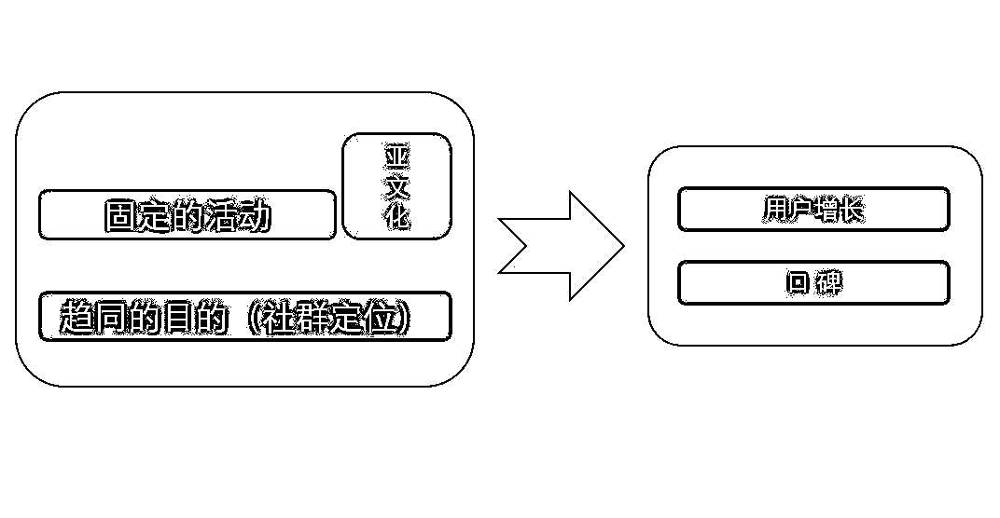

### 4.5.1 口碑

众口铄金四个字，其实是一条被动增长的秘诀。

大家觉得小米有情怀，将硬件的毛利控制在 5% 以下，呼喊为发烧而生。大家不知道的是，小米一开始就不做用户增长，只做口碑。他们早已经想明白 ，口碑的建设，是最好的被动增长。（见小米内部营销手册《参与感》一书）。

真诚，公开地真诚。回应，公开地回应。传播，努力地传播因社群而获益的人而不是传播社群。

这些都是坚持下来，能形成口碑的方法。

建设口碑，也是社群里，经典的难而正确的事之一。

如果你问到，如果我希望从零开始建设口碑，应该关注哪些要素，掌握哪些原则呢？

我会答：

两个要素，一个是群众体验；一个是群众推动群众。

1）群众的体验

在阻碍「体验」酝酿成口碑传播这件事上，容易犯错的地方有，社群本身的名字、社群内活动的名字。

符合下方这些描述的，均不是好名字：

拿社群的名字做听写。100 个人听到，有一半人写不对的名字，不是好名字。

典型常见的，是让人意想不到的谐音替换字。

中英混合的，大概率不是好名字。

如是英语，单词过难的，大概率不是好名字。

在国内做，尽量规避英语单词。

如是 KFC、ETC 这样的字母缩写型的，字母不要超过 3 个。三个最多了。

长度超过 5 个汉字的，大概率不是好名字。

读不顺的，不是好名字。

朗朗上口又不耽误注册商标的，是好名字。

比如，阿里巴巴（四字三声词）、小鸡叫叫、4399、农夫山泉，好名字。

看到名字后，难以脑中浮现出画面的，大概率不是好名字。

比如，苹果、小米，就比讯飞好；风向标就比商业线索好。

所以，以上这些描述，可以作为工具和方法，来检验我们起的名字，是不是好名字。

背后的原理不赘述了。体会，重要的是体会。 :D

*

活动的记忆点，高光时刻，也能将丰富的体验浓缩成能传播的要素。

参加同样的活动，不同人的记忆点是不同的。活动的总结和事后传播物料的过程中，让传播的物料本身鲜活、有画面、能讲成一句话或梗，更重要。

在酒桌上，“现在的 00 后一口闷小一斤白酒，分酒器直接吹，不带换气的”，比 “年轻人真能喝” 更好传播。

在微信群里，“他分享完，十几个群友发专属红包，直接刷屏”比“老师的分享干货满满，线上气氛很好”更能传播。

“那时虽然大家都在线上用文字交流，但奇了怪了，能感觉到全场鸦雀无声，所有人都在屏住呼吸等下一条消息冒出来”比“他分享时没有人插话”更能传播。

这些体验，不仅要讲，还要往社群之外讲，还要持续地、有方法地往外讲。

*而如果群友能在被问及呆在社群的收获时，都能清楚地讲上几句，也是口碑正在酝酿中的绝佳状态。

而如果群友能在被问及呆在社群的收获时，都能清楚地讲上几句，也是口碑正在酝酿中的绝佳状态。

因为社群的事，会变成他和朋友们喝茶、聚会、饭桌上的谈资，会成为他给别人讲写新东西时的社交货币。

*

而所有的体验中，能激发情绪的体验，最能让人持久地记忆。

概念、信息和知识，都不能让人持久的记忆，并拥有一致的印象，但情绪可以。

2）群众推动群众

传播的战场

递子弹

有激励如果大家没有特别强的技术技巧，光是想通过人与人的关系的这样的一个方式去增长自己的社群。首先要思考的一个点就是如何让你的群友去发动更多的群友。

如果大家没有特别强的技术技巧，光是想通过人与人的关系的这样的一个方式去增长自己的社群。首先要思考的一个点就是如何让你的群友去发动更多的群友。

如果你的小活动都会或多或少带一点让一个人去发动另外一个人这样的基因，整个活动去推广起来可能会比你自己单独作为一个节点，向不同的多点去覆盖，效果要好很多。

群众发动群众最典型的例子是拼多多，他的推广成本特别低，因为他每推广一个人就可以获得 3 - 4 个人的用户的触达效果。这个也是他设计在基因里的，让群众去发动群众。

例如有些行动类或者成长类的社群，会给用户发一些荣誉的勋章、荣誉的纪念品或者荣誉的称号。

一方面用户自己有成果可以秀出来；

另一方面，如果用户觉得这样的称号或者是你的品牌有价值的时候，他会在未来的自我介绍里面去提及到这部分。其他看到他自我介绍的人会好奇，“诶，这个称号是什么” 或者是 “诶，奖章又是什么” ，这样又会造成一部分社群用户的回流，从社群的角度来看，这也是用户增长了。

再比如一个叫 Keep 的产品，下面这个帖子，也说明了本节的一切。

### 4.5.2 内容

社群产生内容。

拿内容做被动传播（自增长），有一个清晰的策略：去推动易传播的内容做传播，而不是相反。

这里的误区是，我们容易去推动易转化的内容出去。但你想，易转化的内容，在传播上往往没有那么出色。推动这样的内容，看似容易看到效果，其实依旧还是主动增长的逻辑。

但易传播的内容，你花力气去推，后面会更容易有陌生人接过接力棒。

或者我们换一种说法，可以称之为，先让会走路的内容走出去，让能传播的内容传播。

这里捎带着推荐两本书，《理解媒介》与《舆论》。

怎么衡量内容是否易传播呢？

我会去关注另外一个点，就是这样的内容的阅读者，他有多大的可能性，把这个内容再分享给别人，或者是跟别人讨论这个事情。

举一个例子。一些社会事件让大家能积累情绪、积累压力但是想表达些什么又表达不清时，如果有人写了一篇透彻、有说服力、能释放情绪压力的文章，这样的内容，就会成为无数有这样的情绪的人的嘴替。体现在文章的阅读数上就是，文章会爆量。

但反过来，能让内容的传播者身上多一个负面标签的文章，哪怕不是故意的，也不那么好传播。

对比一下吧：

《年中就加薪，教你和老板谈工资，彻底 K.O 老板》

《职业成长规划指南，职场无它法，打铁还需自身硬》

哪个更容易被你的用户发朋友圈传播呢？

答案显而易见。第一篇会进收藏夹，第二篇才会进朋友圈。

### 4.5.3 问题

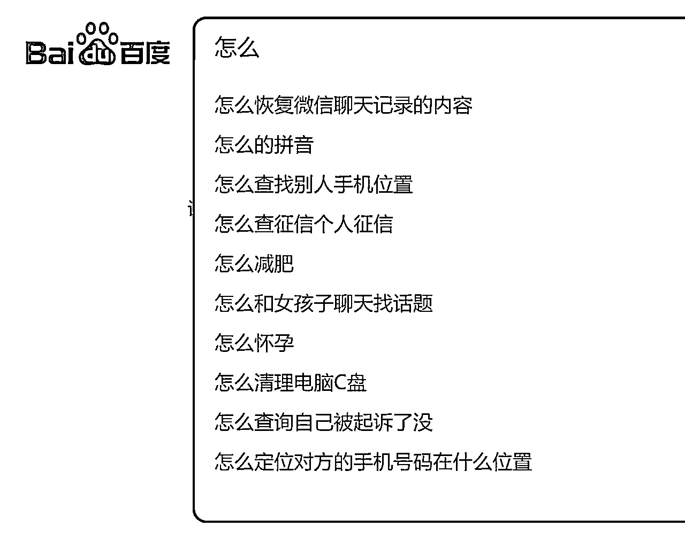

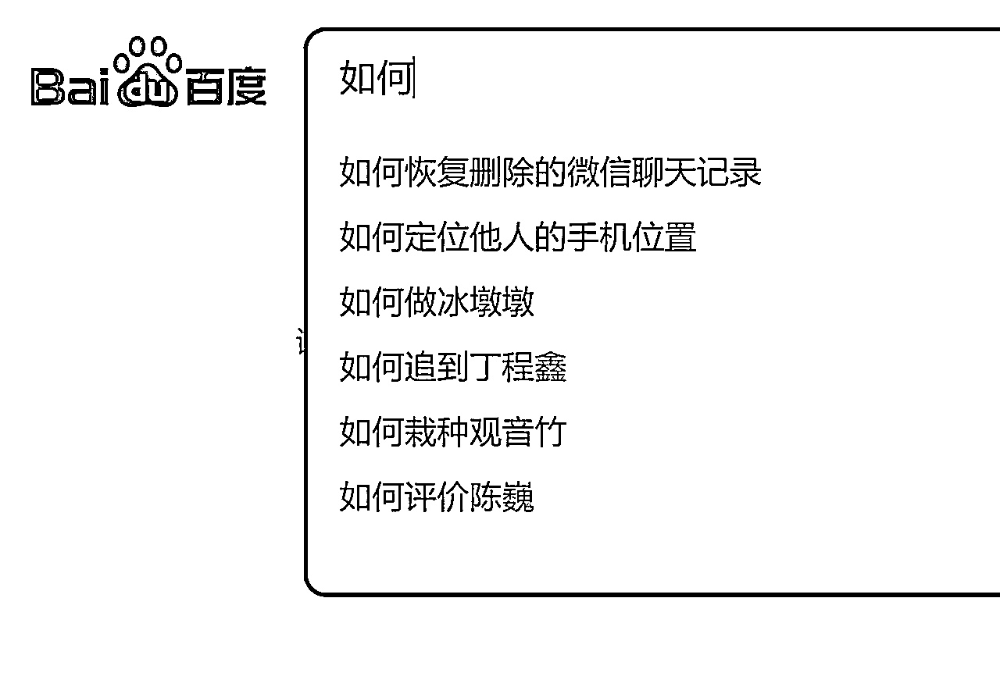

比如小红书（2023 年 2 月 24 日）的联想是：

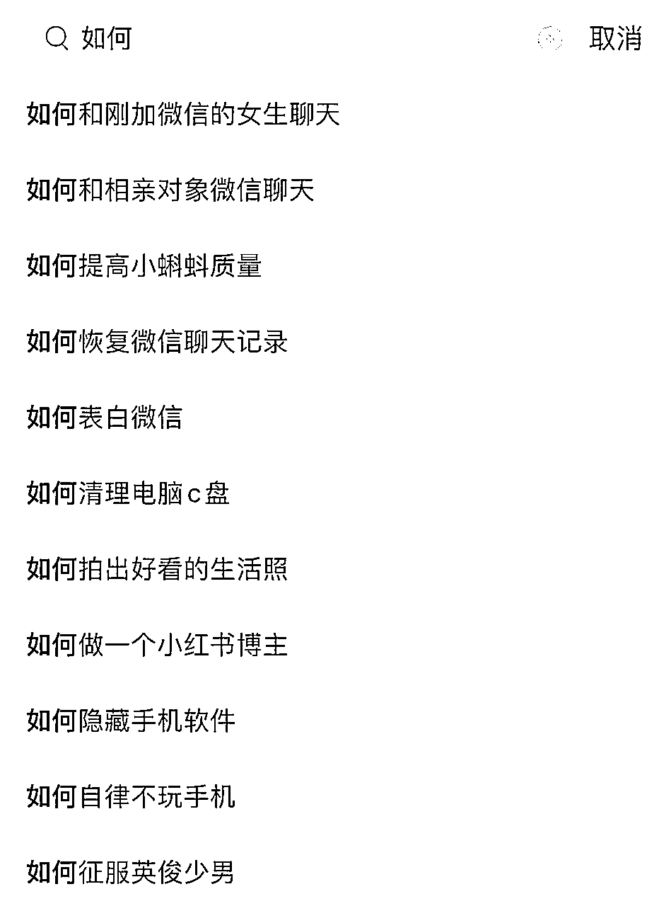

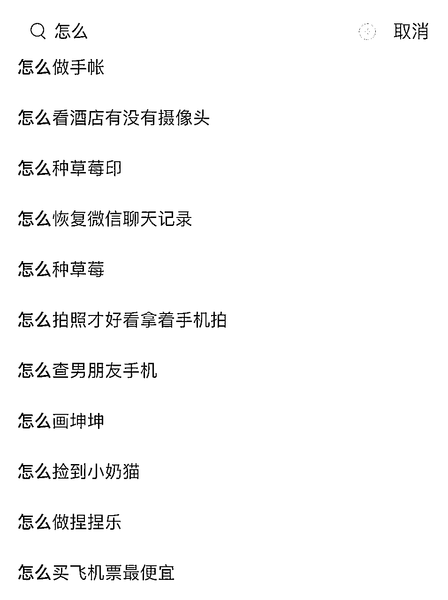

这些哪怕不是相关的从业者，定期去搜搜，也会有很有启发。

我们在 4.3.2 节中介绍的建立外部渠道的方法，就是我使用问题这一自增长工具的示范。大家读到这里，可以点回去回顾下。

不过可以说，这种自增长的驱动力根源在于，你一直在回答用户关心的问题。而用户，一直在关心他们记挂的问题。你和用户，内容相遇，一拍即合。

那么，我们找准了问题，要把问题放在哪些平台呢？

好问题。我的解法是拿数据支持。哪些平台养成了用户搜索习惯，且内容的半衰期长，我们就去哪些平台放置问题。

让我来推荐，我会推荐小红书、知乎、微信公众号、抖音和 Bilibili 。它们都是当下（2023 年 2 月 24 日）值得尝试的平台。

而其他小一些的站点如果你想尝试，我也建议两个点：

① 你自己就是你的目标用户，你常逛的地方就是好地方；

② 小站点在百度、微信等，有较高的内容排名权重。

附一个让人意外的小红书的搜索频次的数据情况。

2022 年 2 月 24 日消息。昨日，小红书 COO 柯南透露，平台日均笔记发布量超过 300 万篇，60% 的用户每天都会在小红书高频搜索，日均搜索查询量近 3 亿次，“小红书已经成为了普通人的生活搜索入口”。

Ref: 小红书 COO 柯南：平台日均搜索查询量近 3 亿次

其他平台的搜索，官方也有公开，这里不占篇幅了。

关切问题、关切搜索、关切需求，这三种要素是紧密相连的。

### 4.5.4 软件与机制

1）软件

长期的自增长，尤其是非运营活动驱动的自增长，往往需要软件的配合。

一般下面这些需求旺盛时，就需要寻求软件、SaaS 工具的支持了：

给加过来的新成员，自动打标签，以统计和区分渠道；

需要通过推荐海报（二维码）来实现自动化的指引；

需要 SCRM 系统来为每一位社群成员建立简单的归档，以便于精细化服务；

需要独立的会员荣誉系统，或者清晰地打卡记录工具。

如果用户活跃或社群自增长的每一步，都需要人来完成其中的环节，那么，这种增长注定不是全天候的。这时，思考如何用软机制总是解决社群中动态的问题。好的机制，能支撑起社群的价值观，甚至能不停地巩固社群的价值观。

机制总是解决社群中动态的问题。好的机制，能支撑起社群的价值观，甚至能不停地巩固社群的价值观。

甚至有时，由机制所反映出的价值观，威力要领先于社群（和一切组织）中所倡导的价值观。

其中，可以猛烈地改造社群面貌的，当数机制中的激励机制。

这里，我决定暂时放下冲动，不从理论的角度来诠释机制，而是试着举一些例子，帮助大家理解。

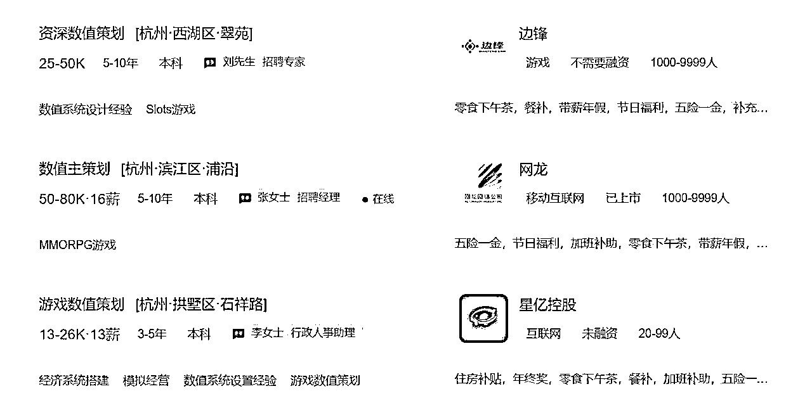

一些游戏数值策划的招聘需求（2023 年 2 月 25 日）

在游戏（可以理解为大型社区）设计领域，游戏的数值经济设计师（有时叫数值策划）就是为游戏中的机制而工作的。

这是一份重要的岗位。他们通过在数值上定义游戏玩家的付出能得到什么，定义稀缺，定义所得到的资源如何消耗，以及不同的消耗和转换之间如何平衡，来保障游戏系统本身的持续运转不崩塌。

没有好的机制保障，一个多人游戏很容易导致类似通货膨胀般的灾难。手里的神级装备突然不值钱了，或者新手达到同样的阶段比当年的老手要快个十倍，都会导致游戏的体验彻底失衡崩塌。

*

而在社群中，通过定义大家在哪里的付出才能获得回报，是能够决定社群的资产基本盘的。或者说，是能够体现社群的创建者是如何理解社群的基本盘的。

社群（组织）所提倡的事物，是否有次序？次序是怎样的？社群（组织）所反对的事物，是否有次序？次序是怎样的？

这一系列的问题，无法以宣传固定下来，只能以机制固定下来。

比如说，长内容和短内容哪个更重要？帮助群友和撮合群友相互认识，哪个更重要？直播分享与文字发帖，哪个更重要？学习和实践哪个更重要？

这些问题，在社群的初期能想清楚最好。在社群的高速成长期里如果想不清楚，对社群来说，一定是某种意义上的灾难。

想清楚的标志，也是通过机制固定下来。

比如说，如果社群里有货币，那么，它将以何凭据产生、为何而支付？回答这样的问题，就是在回答社群的激励机制如何建设。

以及，如果社群中所倡导的努力方向，是没有任何回报的。而另一个不倡导的方向，反而拥有不菲的回报。那么，社群最终的演化价值观，反而是这个不倡导的方向。

那么，社群所不提倡的、禁止的事物，社群为此付出了什么样的努力呢？如果仅仅是说说，当然是无法起到禁止目的的。

比如，付费社群里，哪些行为会让你宁愿全额退费也要把一个成员移除社群，这样的行为，才是真正的社群红线。而并非群公告里所写的禁止的那些。

而定义社群内「什么行为触发移除和退款」，就是在定义社群的一种机制。

宣发上和行动上，保持一种一致，是困难的，但是，是正确的。

*

比如说，在城市和在县城，在契约社会和在熟人社会，所运转的机制是不同的。

不同的机制下，同样的结果，会产生不同的回报。有的制造成果，有的却制造摩擦与冲突。

*

你看，4.5 的篇幅，并不短。读到这里时，你还记得本节的主题是「增长与自增长」吗？

不妨回顾一下这一节的结论。

构建自增长的五种有力的方法是：口碑、内容、问题、软件与机制。

:D

## 4.6 增长的误区

驳「增长是一切的解药」，增长不一定总是解药。

这是这一节的主题。

首先，社群和消费品大不相同。

消费品的交付过程是短暂的，消费品的体验来自于使用过程。交付过程与使用过程，是分离的、独立的。

而社群的交付过程是漫长的。一个一年为期的付费社群，它的交付周期，就是一年。它的交付过程，和用户对它的使用过程，是重叠的。

正是这种不同，导致了我们的社群，实际上无法来者不拒。也导致了我们的社群在往前走时，必须不断定义我们的核心用户画像，不断地提炼社群成员应有的共性与实际的共性。

一旦重要的偏离，那么，这时的增长，也意味着，越增长越偏离。

其次，内核和规模之间，有时候是互斥的。

拿微博和知乎来举栗子。

微博上社会热点和网络暴民行径一起出现时，与我国的两种普及之间的数量级差异，不无关系。一种是移动互联网的普及，另一种是高等教育的普及。

人们又为何总是怀念知乎的早期氛围呢？是因为官方的运营者愈发水准下降吗？

我想还有一种重要的客观原因。就是规模的增长超越内核后，又突破了潜在的用户画像的总人数。

这种客观，是和运营水准无关的，就是增长超限导致的。

事实上，很多垂直社群，总人数就是不多的。几千人，已经可以把这个圈子全装进来了。

早年（2017 年之前）的中国脱口秀行业，就是这样的一个典型，可能整个行业有水准的脱口秀演员，一个微信群就全装满了。这时，想做增长，要解决的是从业者基数问题，而非增长本身了。

最后，快增长总是对应浅了解，慢增长对应深了解。

如果上规模的社群，没有办法消化快增长所产生的用户，所带来的负面影响，是要大过增长带来短期营收的。

快增长与消化能力、慢增长与面对营收压力，这对快慢之间的矛盾，也是一个每次都得选两个的选择题。

上面的问题，一旦解决不好，暂时关闭增长而非执着于增长，可能会是个不错的选择题。

除此之外，还有一些特殊的情况，值得提：

如果社群的规模将超越社群本身的服务能力，社群是需要关闭增长来限制规模的。

社群一旦获得了一个意外的增长渠道，在判明不符后，是需要切断这条渠道的。创业者社群在讨论新机会时，涌入一批炒股大妈，当然并非妙事。

社群的定位在转折期里，原增长渠道是需要谨慎一些处理的。

这些，都是「增长」这枚硬币的背面。

# 五、如何运营“好”一个社群？

这里要回答一个好问题，「以上一二三四章的内容，都彻底掌握，才能运营好一个社群吗？」

我的答案是，那必须不是啊！

哈哈，有没有觉得，一下子轻松了不少？

## 5.1 什么是运营“好”社群

那么，到这里时，让我们节奏缓一缓，再次问出这个问题，什么是运营“好”社群呢？

你应该想到了，这个问题，是难以有固定的答案的。

更活跃、规模更大、付费人数更多、增长更迅猛、内容更干货…… 这些，可以是答案，但都不是标准的答案。

忘掉所谓的「社群运营」行业惯例。每一个有特色的社群里，对于「什么是好？」都应有自己的定义的。

好的，不需要是全面的，也不需要是完美的。

这种有关“什么是好”的定义，最好先被斟酌、再被推动达成共识、再体现在社群的一次又一次的行动中、再经过迭代被重新定义。

也正是这样，不必盲目地跟随他者的定义，而应该找寻和确认自己的“好”法。

以救助本地流浪动物为主的社群，关注救了多少只动物就好了，不必关注每天群里多少人活跃。

以好书共读为主的社群，关注每一轮的选书是否合理，关注每一次活动推动了多少人确实读了一本书就好了，不必先关注群友之间是否能发展出友谊或是一种熟识。

以鼓励口语交流的社群，甚至不必太在意大家交流上的语法错误和发音是否规范，不磨灭成员的交流欲，反而更重要。

在你认为社群最关心的那件事上，这个社群的进度如何、成效如何？这才是最重要的。

在其他的事情上，取舍和克制即可。包括我手册里讲的这些逻辑，逐条照做，过于死守，反而会让你寸步难行。这手册里的一些逻辑，哪怕篇幅很长，只要它们与你的社群所在乎的“好”关系不大，放着不管即可。

些逻辑，哪怕篇幅很长，只要它们与你的社群所在乎的“好”关系不大，放着不管即可。

## 5.2 谈社群的“重新激活”

也有朋友经常问，“我的群被我运营死了。（你懂社群），给我讲讲，还有办法激活它吗？”

“没有。”

被运营死掉的社群，并没有什么一招激活术。

甚至，重新激活社群，也是一个伪概念。

社群无法重新激活，只能重新出发或再次生长。如果你搞清楚了社群是为何凉下来，你就可以重新出发，在原因上做改变，然后再尝试一次。

原因可能是多方面的。

可能人不对，或者提供的价值不对，或者提供的方式无法达成价值，或是在社群里创造价值的方式变难了，或者是社群的 spam 没有人治理，或者是社群的信任基础被破坏了。

原因需要被洞察出来。

无法忽视多方面的原因，一概而论、一键激活。

以及，一个技巧：

如果你在群里发红包也无人领，可能得试试逐一私聊或另外建群了。

## 5.3 社群的经营是动态的

这一节的标题，这正也是社群经营不轻松的地方。

出发对了的社群，路上不一定对。

出发不对的社群，路上不一定无法纠偏。

社群的动态，就是这样。

我们将社群的创建人，视为社群的第一责任人。

一旦社群的创建人，放弃对社群的时间投入和精力投入，社群就容易滑落、跌损。

一旦社群里的成员，都认为不值得再花时间和精力投入社群，社群就必定会消亡。

社群是由社群里的成员参与、时间和注意力的投入所维系的。再明显不过了。

甚至，只要这种投入的意愿没有消失，高度信任却很少吱声的社群，也可以因为一句话，天南海北聚到一起。

经营社群，无法一劳永逸。

虽然经营本身，可以根据不同的情况，或轻或重。

## 5.4 一些絮叨

社群需要的，是经营，而非运营。

社群创建人所需要的，也是品质，而非技巧。

社群成败与否，总在“是不是做对的事”上，而非“社群的各项数值是否符合行业平均水平”上。

社群对社群成员的凝结能力，也是在信任上，而非在活跃程度上。

深入地经营社群，观察它、经营它、思考它，它总是给我返璞归真的力量，帮助我获得一些别处难以获得的力量。

也希望这种力量，你同样能够感受、可以获得。

# 六、深聊如何做好社群的商业化？

冤枉呐！

社群的商业化，放在这里，并非因为做社群它不挣钱。

而是因为，「怎么建社群」是难于「怎么用社群赚到钱」的。

更难的事打好基础后，我们这一章终于能在社群如何商业化这里，百花齐放一下。

## 6.1 商业化社群鉴赏

### 6.1.1 直接收费的社群

最直接的，社群可以通过直接收费赚钱。互联网的经典模式「羊毛出在猪身上」对于社群来讲，大可不必如此曲折。敞开了报价，直接收费是最便捷的。社群对社群成员有价值，直接收费理所当然。

极简的模式，在微信里收款、群收款，都方便。

帖子、内容的占比稍重一些的，用知识星球，就是最好的选择。个体用，知识星球代缴 20% 的税。

出海的社群（语言关、文化关两大难关），Telegram 和 discord 都是不错的选择。

如果希望就近原则，付费 QQ 群，抖音、小红书和快手的主页粉丝群，也都妥帖。群没有收费功能，在直播间收礼物放行就好。抖音如果课+群的方式，用学浪最方便。

在强大的付费意愿面前，怎么收费的方式反倒没那么重要了。

不要纠结。

哪些类型的事儿能直接收费？

信息、认知、社交、培训服务、陪跑、陪伴，这些都是典型的付费点。

就拿买相机和玩摄影举例子好了。

及时同步各家相机厂商的上新线报与最新价格，建付费社群，属于信息。

科普如何分析各家相机厂商的成像素质，搞清楚旁轴、全画幅这些概念的基本原理，建付费社群，属于认知付费。

跟着某知名摄影大师一块，顺带着认识一批摄影的高手、同好，为这个付费进群，就是属于社交。

想接拍写真的活，搞摄影想拿奖，加入训练营，一周理论、三周实操，进群先付费，这个就属于培训服务类。

拍出来的照片总有问题，挑出来发群里求指导，群里的大伙儿情况也差不多，进群每年包指导 100 张照片，同时群主遇着好照片会拿到群里分析讲解，进这样的群，属于进陪跑群。

大家相互讨教，把摄影、玩设备、交换闲置镜头、淘腾老相机、相互约一同街拍，这样的群，属于陪伴型社群。

但这里，也并非泾渭分明的。毕竟都是群，不同类型甚至有可以混合和相互转换的可能性。

不过不同的主题，可能倾向的选择往往也不同。比如减脂、减肥，拿社群来做，一般选训练营；营养搭配、宝宝辅餐，一般都是培训服务加陪伴式社群，请一位营养师坐镇。

### 6.1.2 电商复购

做电商型的社群，甚至可以这么说，没有电商社群，只有电商复购社群。真是无复购，不电商。

因为电商社群，只有足够的交易频次，才能支撑起足够的商业化规模。毕竟，在养一整个团队前，至少得依赖社群养得起一个人。

所以如果做社群的选型的话，卖女装的群，大概率比卖男鞋的群，更容易做一些。

至于社群里有没有积分、有没有等级成长体系，这些都是以社群本身能否不停地产生复购为基础的。

钻研和实操社群有 11 年了，迄今为止只看过一个例外。没有复购，一期一会，靠大额交易完成商业化目标。

这个例外是「线上看房团」，做跨城市的房产投资。线上成团、线下带队看房，满意就找群主做中介，签合同成交。群费拿来 AA 食宿费用。建群一周，看完就解散。

### 6.1.3 线下门店

做社群线下门店，拉群并不难。顾客进群的入口，也可以多样化。

线下门店，拉群并不难。顾客进群的入口，也可以多样化。

这里提供一些思路。

可以店员导购或结账时，喊入群。品牌连锁的，也可以微信、支付宝支付后页入群，通过付款完成后的页面提供入群入口。还可以门店门口竖个易拉宝、立牌，通过物料上的二维码，直接就入群了。

如果是交易后，东西带着包装拿到家，还可以通过包装上的卡片，邀人入群。

甚至餐饮门店，排队区号的时候，排号也有群。

讲个好玩的事，这一领域，除了各自的小门店自己，最大的垄断级别的团队，是一家叫美味不用等的公司。你们都用过，却不一定记得它。

截至 2020 年 6 月时，美味不用等覆盖了全国 352 座城市，为超过 30 万家餐厅提供智慧餐饮一体化解决方案。每年服务近 10 亿人次的消费者。

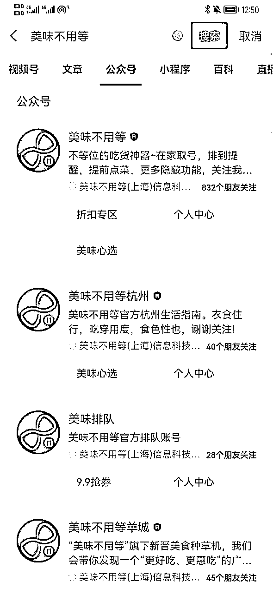

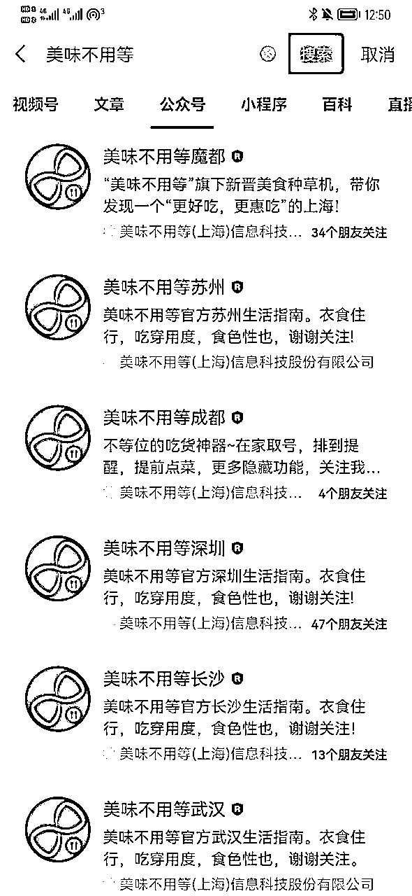

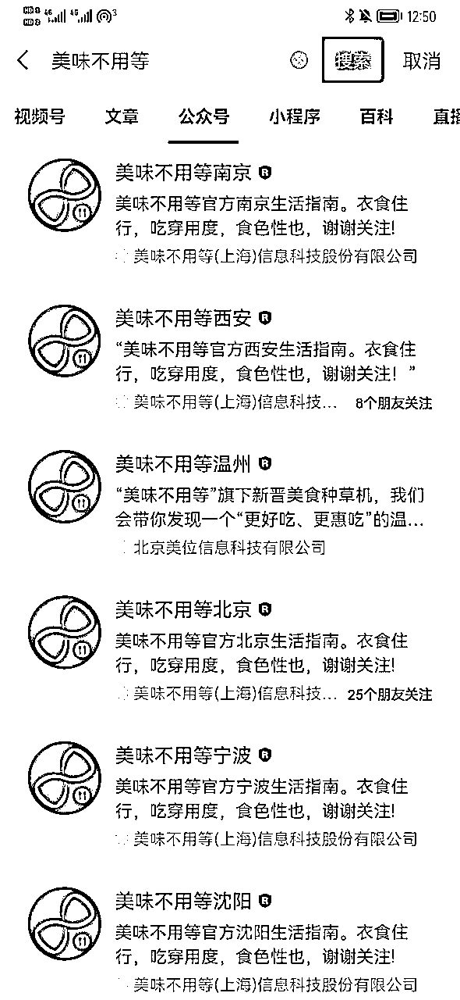

有多壮观，看看我手机微信的截图吧，提醒注意绿色的 xx 个朋友关注

早年这家团队规模做得很快，持续拿得到融资，不过商业化探索一直没有找到方向。目前我观察到的是，这个团队，将排号群和同城美食营销（群内发放优惠券等）结合起来，以巨大的群规模在前进。

说到这里，不得不提瑞幸和蜜雪冰城的社群营销。

生财圈友加过这两个品牌方的消费者社群的，一定不在少数。好奇它们群运营思路的大部分消费者，估计也一脸懵逼，“所以，就是不停地发优惠券吗？再没有别的套路了吗？”

说实话，没有了。

可，毫无社群氛围哇？

是的。

这类门店众多的品牌社群，其实还是为业务服务。它们能把「线上领券、线下核销」这一件事做好，依赖足够的规模，实现薄利多销，就已经非常有价值了。

在这个体量下，往群里加太多环节，为了氛围感而氛围感，反而增加直接运营社群的门店或城市运营中心的负担。也又犯了我们上面提及过的“从舒适的体验入手优化社群”的错误。

当然，这么大的规模，如果能做加法、加准地方，也会对社群在意的业绩和体验带来提升。也是很考验社群直觉和社群理解的。这里可以作为一道开放的问题，供诸位一起航海探讨。

### 6.1.4 内容种草

内容种草，事实上也是大家常说的商业模式。只不过，现实却很骨感。这种模式，尤难。

从小红书平台的商业化进展上，就可见一斑。小红书种上草，转身就去淘宝拔草了。

而内容种草激发需求，从而引导出消费，完成商业化，虽然难，但也可以举些例子。

典型的社群主题，可以是植物、多肉，这种种起来不嫌多、拍照又很容易出片的品类。在群里交流种植经验、分享一些新品种。

还可以是小众设计师的上新群。比如独立设计师专做女生的包。大家蹲守在群里，观摩一款新款包包是如何诞生的，同时早鸟价格拿下心仪的款式。

不过哪怕我是能举出这两种，依旧得说，难度很大，内容种草只能作为原有业务的补充，难以独立形成业务基本盘。

### 6.1.5 作为媒体的社群

社群的规模往往没有内容订阅的媒体规模大。

但要是人数在于准不在于多的事，社群可能也够用了。

一整个商场所有的店长，一个城市所有的服装厂的负责人、所有的鲜花老板，一个产茶地所有有茶园的人，一个细分赛道大部分的创业者，一个垂直领域大多数的媒体人，一个分支法律领域所有的律师和法条研究者，单平台一个大类目下所有的头部广告主。

一条群通知，等于整个行业的消息同步。

具体到一个区域、一个行业、一个环节，关键的人可能没有那么多。一个社群，完全装完了。这样的社群，商业模式对标媒体的商业模式，向三五百人打广告等于向整个行业打广告。

的商业模式，向三五百人打广告等于向整个行业打广告。

当然，这时候的价值，不在于阅读数，而在于消息联系到的一个个具体的人了。

### 6.1.6 做“撮合”的社群

“撮合”型社群可以涉及的方向，是更丰富的。

但第一谬误，就是没有落到具体场景，上来直接整一个“资源对接”群。甚至群名里就带着资源对接。资源对接的具体场景、具体双边对象，才是社群的创建人，应该明确的。双边对象不同，玩法甚至完全不同。

撮合型社群，做相亲，尤为刚需。尤其是社群内的价值观有实质性的巩固，做相亲简直是顺水推舟的事。

而相亲要是想独立拿出来做付费社群，有一个点在于，不可按能否约会付费，得在进群门槛处收费。收费点在于购买潜在的约会机会，而非约会本身。

那么，招聘社群，也是撮合型社群的典型。但这一行的好实践，还是以内推机会+简历指导为主，无论社群本身是否收费，至少做到一个到面、一个入职，能拿到不菲的内推金。

此外，聚集起潜在的、精准领域的人才，尤其是人才缺口大、急，或者是人才鉴别成本高的行业，人才聚集的价值更高，和需求方谈合作，底气十足。

撮合 VC 和创业者呢，撮合人找合伙人呢，撮合体量相近的人找合作伙伴或促成异业合作呢？可能直接来，会路径稍长。但商学院和读个 MBA 这种，最大的价值，可能也是在这里了。倒并不是学到了些什么。

还有可撮合的吗？

供应链和品牌方，品牌方和营销方，方案的需求方和代为实施方（TP、DP），都是可以做到业务达成型的撮合社群。

被撮合的事儿再小一些的呢？也有。

00 后的扩列社群，Z 世代的表情包互换群，微信读书爱好者的组队群，拼多多的帮砍一刀群，蚂蚁森林的合种群，等等，都是被撮合的事儿小，但可以做很大的用户规模的社群类型。

事儿小，但是刚需又尤为强烈。体验过的朋友，阔以在航海群里讲一讲。

以及，派单和接单，也是典型的撮合型社群。

收费点在于促成合作的交易成本，也在于提供机会（看能聚集到的单子多不多）的机会成本。

设计外部群。技术外包群。专业的细分领域的翻译社。抢茅台、抢潮玩、门票并提供刚性兑付。这都是典型的成群模式。放单、进单、接单，会成为这样的社群的底色或 BGM，社群会围绕着这样的底色，产生各种各样的活动。也会因为什么单子值得接、单子该怎么做，慢慢地产生价值观。

单、进单、接单，会成为这样的社群的底色或 BGM，社群会围绕着这样的底色，产生各种各样的活动。也会因为什么单子值得接、单子该怎么做，慢慢地产生价值观。

从相亲到招聘、从投资关系到合作关系、从上下游到异业合作、甚至到生活里需要帮忙的小事儿，都是撮合型社群发挥能量的舞台。

此处不得不推荐一本书，叫《中间人经济》，是这撮合型社群的创建人一本必读书目了。

总之，商业化的社群，其多样性，是十足的。行业、经济的变迁，也会不停地催生新的社群。而且，在大多数情况下，社群就是绝佳的平台型商业模式的 MVP。

比如在 2018 年由腾讯领投、估值约 1 亿美元的多抓鱼，最开始验证商业模式是否成立时，没有开发，只有社群，往来的交易没有订单和商城 SaaS，全靠 Excel 表格在群里穿梭。

而说到作为第一款变现产品的社群，作为为原有业务的营收做加法的社群，也均各有优势。

当然，这里值得重申，社群不仅仅止步于是一种业务。更有机会，成为一部分人的生活方式。

## 6.2 商业化案例鉴赏（由圈友贡献）

### 6.2.1 【案例一】合伙人社群：百度问答分销模式打造与实践 @一尘学长

项目案例：百度答题分销模式项目的社群经验分享

项目模式：

分销模式引流获客

创建百度答题社群，以训练营模式进行交付

盈利模式：培训费用

项目背景：

主做大学生假期工，大学生因疫情无法线下工作，在寻找线上机会

22 年 9 月初步尝试百度答题，但由于答案需要自主寻找，效率低且无法放大，项目暂时搁浅

22 年 12 月生财有术 ChatGPT 风向标，尝试与百度答题结合，项目再次启动第一期人数较少，只想着把交付做好，我们学员的上岸率能达到百分之百

第一期人数较少，只想着把交付做好，我们学员的上岸率能达到百分之百

原因：

1）项目符合对应的群体

2）项目简单只需要执行就能拿到结果

3）交付内容足够支撑执行

基于上述原因，第二期人数增长速度快，因为市场足够大，所以校园代理也开始让他们分销。那么同理，线上也可以如此，于是就联系一些朋友问他们是否感兴趣。这个过程中会有一些问题重复出现，我们的解决方法是开始组建分销群，这样信息能够在群内更好地同步

分销群的建立一开始是为了同步信息，但是慢慢的就多样化，因为大家都有各自的影响力，群内也会有分销的氛围，毕竟多数都是创业者，在搞钱这一部分非常积极

接下来说一下百度答题项目的复盘和建议

首先需要确定社群的目标，我们建立的群一共有两种，第一种是【学员群】，第二种是分【分销群】。做学员群的目的是为了更好地交付，做分销群的目的是为了更好地宣传和裂变。

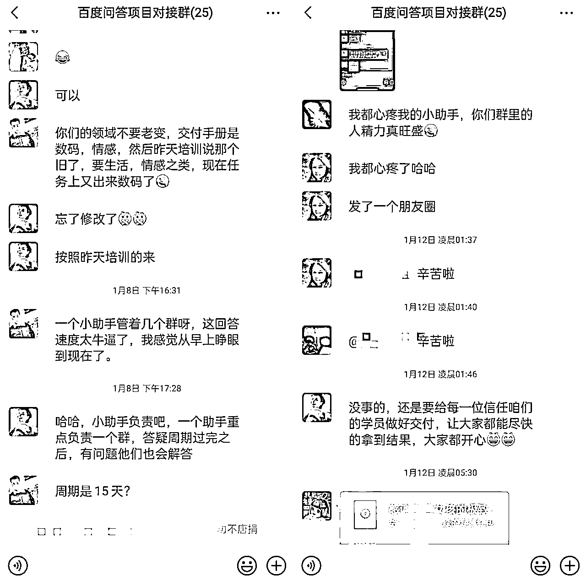

大家也可以建立一个充满活力和合作精神的分销合伙人社群，从而为产品及课程提供更好的宣传和分销。

在社群运营过程中需要注意几个点：

2.交付分销层构建

学员交付层：做好交付，拿到结果

做好交付，拿到结果

项目流程不断迭代

每日答疑汇总问题

答疑助手即时回复

每日任务目标计划

学员激励营造氛围

3.合伙人分销层：

让其放心，一条龙服务

营销转化朋友圈文案素材

专属的交付手册以及答疑引导学员裂变获取新流量

引导学员裂变获取新流量

做好后端交付并利润分成

4.日常也需要鼓励合伙人积极参与社群，不要让他们做旁观者，要让他们做参与者。多发一些正反馈去刺激他们，比如今日分销的数据，今日学员的收入反馈等，同时我们也可以评选优秀的贡献者并发相应的红包，以激励更多的人参与到社群中来。

5.我们还需要定期跟进合伙人的情况，了解他们在推广过程中的需求和反馈，以不断优化课程及产品。同时还需要有专门的人及时关注各位分销合伙人的公众号、朋友圈等，把这些内容更新到社群的内容和信息，以保持合伙人的兴趣和参与度。

6.不仅要维护社群内的合伙人，还应该去破圈拓展新的合伙人，积极寻找和建立合作关系，例如与私域 KOL 或其他社群合作，共同推广课程或项目，从而扩大项目的影响力和覆盖范围。

7.为了激励部分合伙人的参与和努力，我们可以提供一些奖励和福利，例如过节时发的红包或者一些礼品等其他形式的奖励，从而增强合伙人的关系动力和推广积极性。

总之，要成功地运营一个分销合伙人社群，需要负责人在社群的建立、吸引、提供内容、支持和反馈、活动组织、关系建立等方面付出努力，不断优化和改进社群运营策略。

在这一块可以给大家分享一下分销比例的构成，因为近期有很多朋友看到我们百度问答项目做的很成功，就想找我们学习，但是这一块很难去以我们的标准给大家分享，因此总结几块内容供大家参考。

项目成本：分销比例应该考虑到项目的成本，确保分销比例不会影响产品的盈利能力。如果分销比例过高，可能会降低产品的利润空间，不利于产品的长期发展。

市场竞争：分销比例也应该考虑到市场竞争的情况，如果市场上其他同类产品的分销比例较高，那么合理的分销比例应该更高才能吸引更多的合伙人加入推广。

合伙人贡献：分销比例也应该考虑到合伙人的贡献，合伙人的贡献不同，分销比例也应该有所不同。例如，某些合伙人可能会为产品带来更多的销售额和利润，他们应该获得更高的分销比例，一般这一块我们会设置相应的阶梯。

一般来说，分销比例可以在 30%到 70%之间进行，具体比例需要根据以上因素和具体情况进行调整。另外，分销比例也可以根据合伙人的推广效果和销售额进行动态调整，这可以激励合伙人更加努力地推广产品，提高产品的销售和市场份额。

经过我们的实战经验和分析，明白了好的分销合伙人是不断地筛选出来的。对于一个产品和项目的推广而言，教育的成本太高，我们可以培训使分销合伙人价值最大化，但是如果连如何分销都要指导或者督促，还不如我们自己培养人来的轻松。

但是并不代表着我们就不在这上面花费功夫，毕竟我们是第一负责人，要为自己的事情负责。为了把我们对于分销合伙人的影响降到最低，我们需要在以下方面进行优化和迭代。

1.激发合伙人的动力，可以设置丰厚的奖励机制。例如：推广成功后给予一定的提成或奖励，这可以激发合伙人更加积极地参与推广，并为产品带来更多的销售额。

2.一定要提供多样化的推广文案：合伙人在推广产品时，需要有合适的推广文案来吸引潜在客户，因此可以提供多样化的推广文案。例如：海报、倒计时、项目介绍等，让合伙人可以根据不同的推广场景和客户需求来选择适合的推广文案。

3.为提高合伙人的推广效果和自由度，可以提供培训和指导，帮助合伙人了解产品的特点和优势，掌握推广技巧和方法，提高推广效率和效果。

4.提高合伙人的自由度，可以提供更多的选择和自主权。例如：合伙人可以自由选择推广的时间、方式、渠道等，或者可以自由制定推广方案和策略。这可以激发合伙人的创造力和热情，让他们更有动力地推广产品。

5.为了让合伙人更加清楚自己的推广效果，可以设置监测和反馈机制。例如：合伙人可以实时了解自己的推广效果和销售情况，我们也可以定期对合伙人的推广效果进行评估和反馈，帮助他们及时调整策略和方法，提高推广效果和自由度。

通过以上措施，不仅可以激发分销合伙人的动力和提高他们的自由度，还可以让他们更加积极地参与推广，并为产品带来更多的销售额和市场份额。

内容来源：《从 0 到 500w+：百度问答项目社群分销模式的打造与实践》

### 6.2.2 【案例二】付费社群：从 0 到 1 盈利十万的育儿社群 @黄伊森

项目案例：从育儿知识科普到孵化母婴好物群的经验分享

项目模式：

通过育儿知识科普，逐渐提高个人影响力，随之挖掘受众人群痛点，搭建购物群

盈利模式：知识付费、产品利润

项目背景：

有留学医生的行业经验为背景，尝试做短视频和图文，开始接触自媒体

市场环境趋势所致，推进社群的建立生财有术日历共读群提供社群主营方向思路

生财有术日历共读群提供社群主营方向思路

通过运营育儿知识付费社群挖掘的需求和痛点，孵化母婴好物群

我的主业是儿科医生，所以第一个想到创建的社群自然是宝妈育儿群。在建群之前也没有任何的运营经验，我就先去听了咱们生财圈友@北大苏姐 的一堂社群运营踩坑课，这堂课我至今记忆犹新，我从她的分享里面，学到了社群运营的几个坑。这边也先分享给大家。

第 1 个教训：不要做免费社群！不要做免费社群！不要做免费社群！

第 2 个教训，不要只是群主单方面一头热的去分享和输出，而群内没有回应和互动！

第 3 个教训，一定要有明确的群规并严格执行，这些群规的目的是为了创造一个舒服的社群环境，让你的同频的人可以走到一起并留下来！

大家都知道那个著名的消费能力链条：孩子＞女人＞宠物＞男人，由此可知，育儿 + 宝妈群消费能力强，变现空间大，宝妈群永远是各种社群中最活跃的，但如果运营不当，很容易会变成日常聊天 + 吐槽群。

我认为一个好的社群应该把大家集合起来去做一个共同的事情，让大家喜欢待在这里面，每天有收获和成长，而不是每天无意义的“活跃”。

加入生财之后，看到很多圈友在卖生财的日历，并运营生财日历共读群，可以把同频的人集合在一起，分享自己的见识并共同成长。由此，我确定了私域社群的主题和方向：育儿日历共读群，群规就是“抱团取暖，互惠利他，保持同频，鼓励链接”。把育儿日历做成一个类似于生财日历那样一个形式的共读群，每天分享一个育儿知识，这样群里的宝妈们每一天都有新的内容可以学习并围绕这个主题展开讨论。

铁粉初代：

社群虽然是付费社群，但最初的一部分成员其实是免费的，是我门诊的一些铁杆粉丝，我把这些小朋友的家长们邀请进来，作为第一批的友军和基础支持者。

他们在群舆论的把控方面给了我很大的支持，同时我隔三四天就会询问一下她们，关于社群分享的内容和社群运营给我一些反馈，因为之前累积的良好的信任基础，所以她们给了我非常中肯和非常坦率的反馈，我听取并非常及时的做了相应的调整，事实证明这些调整对于社群整个的运营是非常有效的，让内容的分享更加的高效及时。

2.增加曝光率：连续 100 场直播，大力出奇迹

在这之前，我没有任何的互联网产品销售经验，可以说我是一个互联网素人。记得有一次我的自媒体合伙人@梁靠谱医生，在她的生财日历共读群里分享过：对于一个互联网素人来说，要闯出名堂，一要靠持续的内容输出能力，其次要有属于自己的互联网标签。

加入生财之后，看到了视频号直播风头正劲，也看到粥左罗老师的连续直播 100 天挑战，当时我就在想，我是不是也可以发起一个自己社群的连续 100 天直播挑战。好处如下：

首先，连续直播可以作为一个刚创立的内容社群的持续输出，有利于保持社群的活跃度和保障优质的内容，也让更多的人看到我们，从而提高社群的影响力，扩大社群规模。

其次，连续直播可以锻炼和提高自己的直播能力，包括直播间的运营和互动，以及带货能力，后期有新的产品上线之后，可以通过直播间促进成交。

最后，连续直播 100 天挑战达成后，可以获得一个属于自己的互联网标签，从今以后，可以跟人吹牛：我是第一个完成了连续 100 天直播挑战的儿科医生，哈哈哈在我直播过程中，有不少育儿电商平台找到我想要合作，后来通过沟通和筛选，选定了一个我认为靠谱的母婴用品平台进行合作，我们新建了一个“伊森严选母婴好物群”，主推靠谱实用，有专业背书的母婴用品。

在我直播过程中，有不少育儿电商平台找到我想要合作，后来通过沟通和筛选，选定了一个我认为靠谱的母婴用品平台进行合作，我们新建了一个“伊森严选母婴好物群”，主推靠谱实用，有专业背书的母婴用品。

目前我的销售已经超过了 10w+，我的个人佣金也达到了 10000 多块钱，这还是在疫情期间上海的物流受到很大限制的情况下。虽然这个销售额并没有很高，但是我相信，任何一个 100 万都是从第 1 块钱开始的。而且随着口碑和影响力的不断增加，这个增长肯定不会是线性的。

4.突破瓶颈：由低转高，这些操作让社群客单价涨了 15 倍社群运营到一定阶段，就需要在适当的时机迭代更新，由低转高。以下是我做的几个事情：

社群运营到一定阶段，就需要在适当的时机迭代更新，由低转高。以下是我做的几个事情：

第 1 点是，挖掘社群成员需求。

随着社群的增长，社群成员的需求是在增长的，所以，我们要去敏锐的观察到社群需求的变化，甚至去挖掘社群成员潜在的需求，根据这些需求升级产品，这样才有可能把客单价由低转高。

在我刚开始运营这个育儿社群的时候，只是一个低客单价的引流产品，跟很多其他的育儿社群一样的，我也是一个人包打天下，所有的群里的问题分享都是我一个人在做。本身我在临床干的时间也很长了，所以基本上 90%的问题都可以搞定。

但是随着社群的成长，你会逐渐发现一个儿科医生，他的专业知识再丰富再全面，他也没办法覆盖儿童健康的所有领域。现在的宝妈们对孩子的健康关注，越来越多了，不光是看病，还包括喂养，睡眠，儿保，视力，口腔等等。另外还要去挖掘宝妈本身的需求，比如说产后康复，女性成长，宝妈副业等等都是可以作为社群的潜在增长点。

第 2 点，打造“小而全”的团队。

当发现或者挖掘出新的需求的时候，而你又没有办法去满足这个需求的时候，怎么办？我的策略是，放弃创始人 IP，找同行当医疗合伙人，打造一个“小而全”的团队。

社群运营到一定阶段，就需要在适当的时机迭代更新，由低转高。以下是我做的几个事情：第 1 点是，挖掘社群成员需求。随着社群的增长，社群成员的需求是在增长的，所以，我们要去敏锐的观察到社群需求的变化，甚至去挖掘社群成员潜在的需求，根据这些需求升级产品，这样才有可能把客单价由低转高。在我刚开始运营这个育儿社群的时候，只是一个低客单价的引流产品，跟很多其他的育儿社群一样的，我也是一个人包打天下，所有的群里的问题分享都是我一个人在做。本身我在临床干的时间也很长了，所以基本上 90%的问题都可以搞定。但是随着社群的成长，你会逐渐发现一个儿科医生，他的专业知识再丰富再全面，他也没办法覆盖儿童健康的所有领域。现在的宝妈们对孩子的健康关注，越来越多了，不光是看病，还包括喂养，睡眠，儿保，视力，口腔等等。另外还要去挖掘宝妈本身的需求，比如说产后康复，女性成长，宝妈副业等等都是可以作为社群的潜在增长点。第 2 点，打造“小而全”的团队。当发现或者挖掘出新的需求的时候，而你又没有办法去满足这个需求的时候，怎么办？我的策略是，放弃创始人 IP，找同行当医疗合伙人，打造一个“小而全”的团队。

第 4 个，设立体验卡制度。

做知识付费的人大多数最讨厌的都是那种双手朝上的白嫖党，但是，在社群升级的时候，我设置了一个体验卡制度，就是说，如果是对我们的社群不是很了解的新用户，可以免费体验 28 天，在我们社区里面，无限次提问，同时可以参加在这个期间举办的实操训练营。28 天是免费的，同时 28 天到了之后，你可以选择退出，如果你觉得我们社群的服务达不到你的预期值的话，我们分文不取。

之所以会设立这个体验卡，是因为我们是一个育儿社群，我们是做一个长期服务的陪伴型的社群，那么 28 天对于一个宝宝来说，其实是一个非常短的一个时间，而我们只是提供了一个机会让宝妈了解这样一个与众不同的，具有很专业的服务团队的社群。

我们不担心她会白嫖 28 天，因为她一旦体验过我们的专业服务之后，我们很相信，她在 28 天之后会选择成交，而不是选择退出社群，因为她在别的地方找不到这样的育儿社群，这点我对我们的产品非常有信心。

而且付费用户是一个双向筛选的一个过程，如果我们觉得这个宝妈的育儿理念实在跟我们不符合，那我们就会劝退。28 天之后就可以退出我们的社群，因为你跟我们不是一个育儿理念的，那大家还是好聚好散吧。

第 5 个，借社群周年庆造共同回忆。

这个活动的目的，是为了造共同回忆，同时，可以让宝妈们给我们提供，正反馈和社群宣传资料，效果还是不错的，我们收获了，挺多的好评，而且是真情实感，真实发生的故事。这些宣传资料都可以反复用在朋友圈及社群升级的过程中。

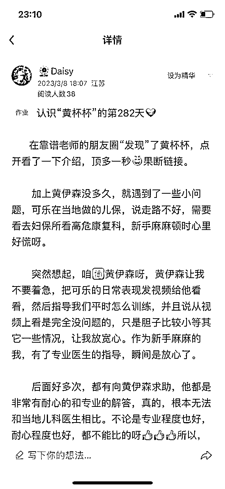

内容来源：《从 0 到 1，我是如何打造出盈利十万的育儿社群的？》

### 6.2.3 【案例三】电商社群：从 0 到 1 打造高复购率的小社群 @徐欣

项目案例：高复购率的快团团电商社群经验分享

项目模式：社群冷启动，通过运营策略不断增加客户粘性和信任，提高个人影响力，提高销售额和复购率

盈利模式：产品利润

项目背景：线下实体生意经营多年，对选品和选供货商经验丰富，链接源头厂家和卖家也很有经验，确定开始做快团团

线下实体生意经营多年，对选品和选供货商经验丰富，链接源头厂家和卖家也很有经验，确定开始做快团团

通过冷启动后初期运营，收到反馈后总结经验，从而确定做生鲜品类

根据社群定位：健康，报考公共营养师为社群做专业赋能

快团团 23 个人的小社群，从 2 月正式开始运营，一周只投入周一到周五早上 5 分钟晒早餐，群里除了不定期分享一些养生知识和推品基本不闲聊

2 月份一共推了 46 个商品链接，平均每天不到 2 个，而且只卖生鲜。在这样的情况下，我的 2 月业绩是 11562.3 元，提成是 1996.87 元。

在很多讲快团团社群实现这个销售数据需要有 150 人左右，而我当时的社群人数不到 30 人，现在是 47

所以今天我来分享一下，我是如何冷启动一个小社群并进行变现的。

1.正式启动当时发朋友圈的时候，正好看到@芷蓝 说的一个个人使用说明书，于是我就做了一份，其实完全都没想好，要买什么，但是把自己有什么先亮出来。

当时发朋友圈的时候，正好看到@芷蓝 说的一个个人使用说明书，于是我就做了一份，其实完全都没想好，要买什么，但是把自己有什么先亮出来。

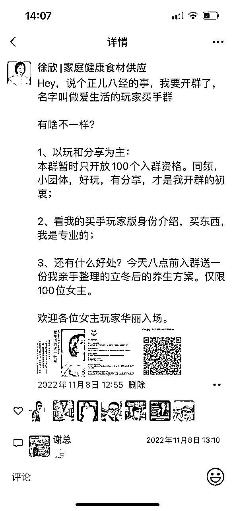

当时进群有 10 多个人，大家聊天还算是非常热闹，但是当我真正推品的时候，却很少有人下单。我就去我快团团看数据，像童鞋、童衣这些浏览数量确实还不错。但是没有下单。

后来我又试着推了推吃的东西，这时候有人开始下单了。于是我就在想为什么？

我就试着以用户的视角进去看了看衣服和鞋子的链接，发现我自己也很难下单去买，页面提供的信息很多，却没有什么打动人的关键，而且衣服款式选择还特别少。

我想想我自己给娃娃或者自己买衣服的场景，就发现，衣服这个东西和个人审美关系太大了，这个你很难踩到其他的审美的点，大社群可能靠人数可以，但是小社群不行。

到了 11 月 23 日的时候，我就意识到两个问题：

1）品类太泛了不行，因为我很难短时间去了解清楚，如果你只是轻描淡写丢链接，别人就会认为你在割韭菜；

2）生鲜食品的打开率虽然没有日化服装高，但是转化率高，而且我自己其实买衣服这些不太会从快团团这个渠道买，但是买生鲜是我自己经常要做的事情，但是我从电商平台上买生鲜几乎没有让自己满意过，所以不如先来解决自己的需求。

于是我就开始留意食品生鲜，自己找了很多食品包括生鲜的大团长来测品，前期自己测品，测品大概花了将近 1 万块，最后让我找到了两三家品质非常稳定，售后也靠谱的大团长，提供的食材也符合我想打家庭健康食材的特点。

但是第一波有销售业绩，群里买的人很少，两三个人。于是我开始发朋友圈，发朋友圈都配图的是我自己家吃的照片，真实分享。

第一次我选品卖的是苹果，没想到一个朋友圈帮我出了几单，而且我等大家收到货以后，就回访，了解购买者对苹果的评价。没想到，评价出奇地高。甚至还有人当场就回购了 5 箱发公司给员工吃。

于是我就朋友圈，晒单发圈，晒单发群。渐渐地群里也出了一些单，但是还是不多。后来疫情放开加上过年，我们全家病倒，加上这个时候全国快递瘫痪，我就把卖货停了，因为生鲜最怕路上耽搁，这个时候丢客户最容易。

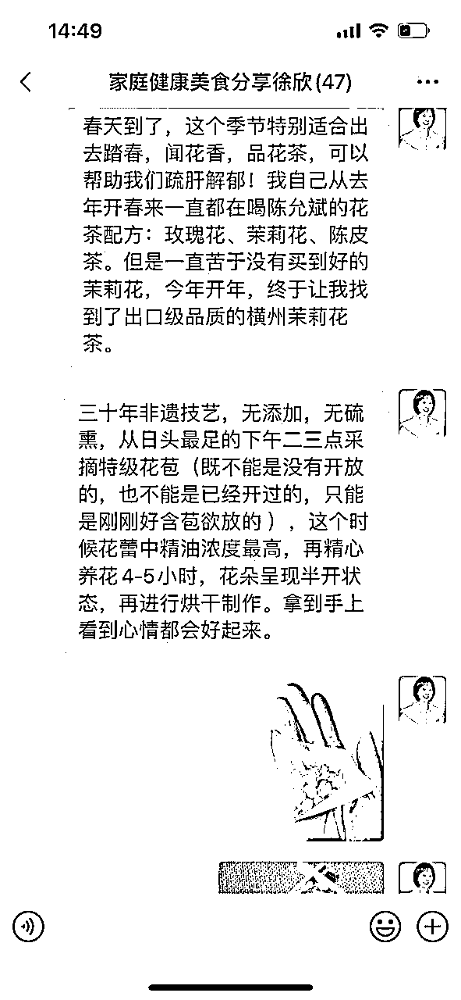

然后就是这样逐一下来，当场的氛围特别好。当天还宣布了 1 个群规则：新增成员增加一次抽奖机会；（这个也是跟生财的朋友学的，效果好不好，我最后总结）

友学的，效果好不好，我最后总结）

当天我的销售业绩是 1200 多，提成是 240 多，费用加上红包是 610 元，可能很多朋友一看，我亏钱了。这个事情不值得做。但是从后面来看还是非常值得的。

值得做的地方有两点：

1）我卖的是高端生鲜，这个东西是怎么宣传都没用，一定要吃才知道对比在哪里，直接送给别人试吃别人压力会很大，这样抽奖抽到别人觉得心安理得；

2）让别人觉得这个群好玩，事后我回访了几个好朋友，她们都觉得特别好玩，很过瘾。

有一次我看到小红书上有个大团长说一定要问候早晚安，每天要固定时间做固定的事情，这个是不是很耳熟，在条形马老师的手册中就有。所以我看条形马老师的手册特别有感觉，因为很多事情我都经历过，很多坑我也都踩过了。

早安红包这个事情，我并没有按照那个大团长说的做，因为一来是红包成本太高，二来群里的人不一定能看上。于是我就想，什么事情，我可以坚持在早上做，同时同群里紧密结合？

早餐，我自己坚持给家人做早餐已经有两年了，虽然也不可能天天，但是一周五六天没啥问题。于是我就开始在群里晒早餐。

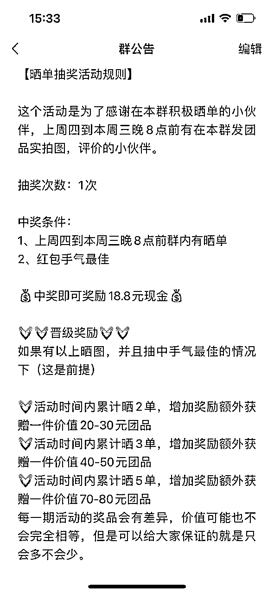

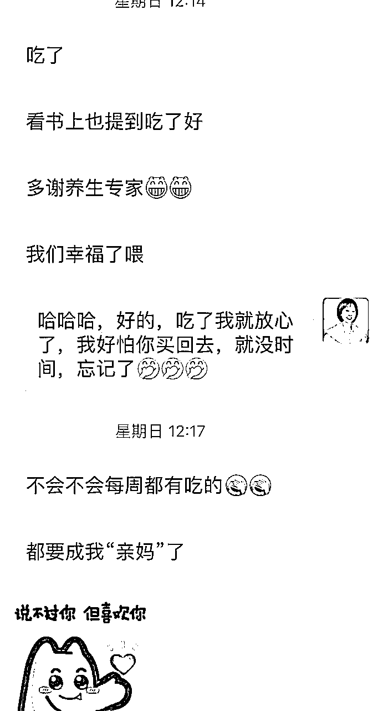

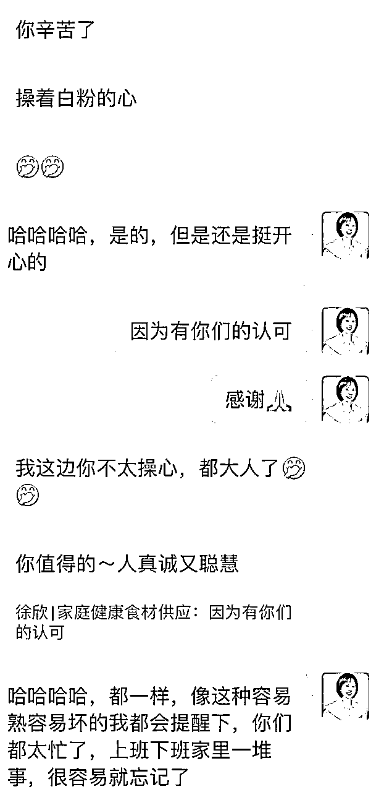

群外用功 2：有售后，不解释，永远站在客户这边

有售后，不解释，永远站在客户这边，平台不认，就自己赔付。我记得有个梨子我在回访的时候，客户跟我说有两个水分不足，这个事情一般来说都不算售后的，因为照片没法体现呀。我当时二话不说，按照个数赔钱给她。

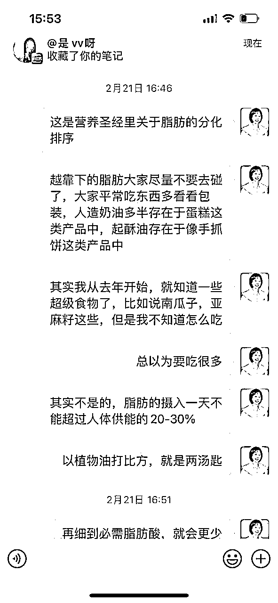

再来说说我遇到的 3 个问题

问题 1：运营成本高

刚开始的时候，听了一些大团长的，说要在群里发大红包，所以大的活动节点，我都是 40 元一个的红包发，抽奖也是用的 5 元的红包，后来做总结，发现没有必要，没有你会因为老板大方发红包而下单，所以后来一不发节日红包，二不发大红包，三所有抽奖红包减为 1 元。

有抽奖红包减为 1 元。

做生意，小数怕长计，一定要减掉日常不必要开支。

问题 2：盲目裂变，导致成本上来却没有效果

运营了一段时间，想要裂变，于是在元宵节的时候告诉群友，只要新增一个团员，就在群里抽奖一次。后来发现完全没有必要，因为大家也不会 CARE，但是群运营成本又上来了。同时还增加了我自己为了选合适价格与合适产品的运营负担。

问题 3：活动时间的摸索

刚开始会员日我是定在晚上 8 点，但是群里的成员都是有家有孩子的人，晚上 8 点基本上都在辅导孩子做作业，所以最后把时间定在了中午 12 点多，这个时候反而是上班族最放松的时候。

运营社群三个意外的收获：

1、收获了陌生链接与信任赚钱我觉得分两个层次，一个是面上的赚钱，就比如说我做这个事情实际赚了多少钱。二就是收获了别人对你的信任，后面才会有可能衍生出更有价值的事情。这个事情我暂时不知道是什么，但是以一个做了四年实体生意的人来说，一定是值得投资的。我觉得这个就是条形马老师说的“贵人”。

赚钱我觉得分两个层次，一个是面上的赚钱，就比如说我做这个事情实际赚了多少钱。二就是收获了别人对你的信任，后面才会有可能衍生出更有价值的事情。这个事情我暂时不知道是什么，但是以一个做了四年实体生意的人来说，一定是值得投资的。我觉得这个就是条形马老师说的“贵人”。

2、帮助朋友走出困境

我有一个很好的朋友去年的时候确诊了重度抑郁症，其实这个事情对我确定做健康这条线也有非常大的促动，过程中我一直在找怎么帮助她康复的饮食方案。后来她也想做快团团，就把我的经验复制给她，并帮助她快速完成了从 0-1 的打通

3、企业团采

刚开始的时候我就遇到买五箱苹果给公司员工的。

后来就遇到一个朋友因为觉得茉莉花茶太好喝，要给企业采购 800 份，但是我自己没重视，在与供应商谈团采环境时间没有控制好，导致错过了机会。但是这对我是个非常好的提醒，就是企业团采这个事情可以做。

最后，我想告诉所有还没起步或者刚刚起步的朋友，我们会遇到很多困难，但是我相信一个定律，就是竹子定律。

竹子用了 4 年的时间，仅仅长了 3cm，从第五年开始，以每天 30cm 的速度疯狂地生长，仅仅用了六周的时间就长到了 15 米。其实，在前面的四年，竹子在土壤里积蓄扎根，为它以后的生长做好了充足的准备。

内容来源：《新手如何从 0 到 1 打造拥有高复购率的小社群》

# 七、社群思考

第七章的内容，并不在我们社群手册的主线内容里。手册里的 what， why & how，在前六章里，已经大体结束了。

但对社群，我还有些无处放置的思考，不如放在这一章里，分享给大家。

## 7.1 社群的生命周期

到第七章，我们能聊到社群的生命周期（社群的寿命）这个话题了。

但，在讨论社群的生命周期之前，我想宕开一笔，先聊点别的。

先聊另一个问题：社群可能会是怎么死的？

1)一部分典型的社群创始人，会这么做社群：先把人都聚集起来，再看看能不能做一点什么事情。

一部分典型的社群创始人，会这么做社群：先把人都聚集起来，再看看能不能做一点什么事情。

这么办，就特别容易出事。因为聚集进来的人，共性并不清晰。不同的人，也抱着不同的诉求。

在这样的前提下，你想在后期再去确定一个稳定的、趋一的定位时，难度特大。而且，这种难度还是自己人为制造出来的。在这样的难度下，社群容易夭折，也是不奇怪的。

这可能是逆了我们说的「先定位、再招人」的规律，选择先招人再定位，结果没处理好，快速走完了社群的寿命。

2)

社群最终将形成一种共同体。

无论这种形成的动力，是源自大家在加入社群前就对结识彼此的期待，还是来自共同的经历为大家创造了相互结识和欣赏的契机。

也因为如此，如果凭借社群创建者的力量以及外力的帮助，社群无法形成这种共同体，无法逐步地产生群体认同，那么，社群最终也将在大家耗尽彼此的期待后，归于平静（凉了）。

3)

社群的商业化途径，得不到社群成员的认可，也是典型的社群走到尽头的原因。尤其是曾经免费，后来苦于经营压力转而收费的社群，开启商业化的道路，最是曲折。

谈钱不伤感情，对于大多数群体而言，是难的事。成员们自己，从社群的建设者转而被视为社群的商品本身，也是难以消化的转变。

这里的探讨可能很复杂。而我常见的建议，是群主最好一开始就帮助群友调整好预期。如果未来必将收费，一开始的“免费”，换另一种称之为“内测”的理解，可能是更妥帖的。

而如果有合理的机制，让社群内高贡献者，成为社群的虚拟股东，或者退一步成为受益者的一员，也是必要的做法。

4)

社群不易。很难总结完一个社群因何消亡。

对于社群的创建者来说，干黄一个社群才是常态。如果无法在干黄一个又一个社群中继承些什么出来，那么将社群理解为扑面而来的无尽的失败，也是容易踏入的误区。

比如，这一整篇不下三万字的手册，是干黄了多少个社群才写得出的血与泪呢？哈哈。

但让我回过头复盘，社群给我的启发与改变，远超我的付出。

我想这也是我自己能有机会持续思索社群，不可或缺的正反馈吧。

那么，书归正传！我是如何理解社群的生命周期的呢？

我有四点思考，手册中不再一一展开了。

① 社群的周期的完结，是社群价值的完结。

② 社群创始人的放弃，是决定性的。社群创始人的不放弃，也是决定性的。

③ 社群走完它的周期，虽然可能是社群创建者意料之外的事，但是，是社群本身的常态。

④ 短周期的社群，短做；长周期的社群，长做。社群的意义，不一定非得用长短大小来衡量。

## 7.2 群体的非理性行为与社群

这也是一个有趣的议题。

群体的非理性，并非什么学术概念，而是每日在社群中发生的日常。

微信群里的“保持队形”、“人类的本质是复读机”都是群体的非理性的体现。

在意的群友都下单了，也比自己在考虑适不适合买，更具备怂恿的力量。

众目睽睽之下，一个人捍卫自己的错误观点的决心，也要远高于他单独对话的时候。哪怕这种众目睽睽是在线上。

一个人独自不会做的事，一群人一起做，反而不觉得奇怪了。

一群人有能力为一件事赋予意义，而一个人很难有足够的勇气彻底相信自己赋予一件事的意义。

群体的非理性，浸泡在群体里的个体的非理性，也并非什么坏事或者蕴含着失了智的贬义。有时候，勇敢就是需要一些非理性的。

而社群的创建者，如果能够理解并运用这种群体的非理性（毕竟它客观存在着），所能做到的事，所能掌握的力量，将远高于另一个自己，另一个将每位群成员都视为理性人的自己。

当然，非理性的力量、群体情绪的力量，运用存乎一心，善恶选择，也存乎一心。

# 八、书单推荐

接下来，我会列出我认为想要长期做好社群，值得深入阅读的书单。

以及，想多说一句，以下推荐书籍中，所列书目的价值作用，无法相互替代，哪怕是名字看起来相近的那些。

兰·费雪《完美的群体》古斯塔夫·勒庞《乌合之众》

古斯塔夫·勒庞《乌合之众》

罗伯特·西奥迪尼《影响力》

理查德·塞勒《助推》

Eric S. Raymond 《大教堂与集市》

郑也夫《信任论》

查尔斯·杜希格《习惯的力量》

杰克·特劳特《定位》

徐志斌《小群效应》

查理·芒格《穷查理宝典》

戴维·迈尔斯《社会心理学》基思·斯坦诺维奇《对伪心理学说不》

基思·斯坦诺维奇《对伪心理学说不》

玛丽娜·克拉科夫斯基《中间人经济》

沃尔特·李普曼《舆论》

读书是一件慢而正确的事。而从书中获得启发，往往不会那么立竿见影。但知道自己推荐的书被读完一本，总是愉快的。

所以，如果以上的书目对你有帮助、有影响，我很乐意知道。甚至你仅仅是想告诉我你读完了哪一本，我都是欢迎的。

# 九、Q&A 社群百问百答 ing

本节内容将伴随航海的进行而展开，请关注航海资料库...

set 限制解除基思·斯坦诺维奇《对伪心理学说不》玛丽娜·克拉科夫斯基《中间人经济》沃尔特·李普曼《舆论》读书是一件慢而正确的事。而从书中获得启发，往往不会那么立竿见影。但知道自己推荐的书被读完一本，总是愉快的。所以，如果以上的书目对你有帮助、有影响，我很乐意知道。甚至你仅仅是想告诉我你读完了哪一本，我都是欢迎的。

基思·斯坦诺维奇《对伪心理学说不》玛丽娜·克拉科夫斯基《中间人经济》沃尔特·李普曼《舆论》读书是一件慢而正确的事。而从书中获得启发，往往不会那么立竿见影。但知道自己推荐的书被读完一本，总是愉快的。所以，如果以上的书目对你有帮助、有影响，我很乐意知道。甚至你仅仅是想告诉我你读完了哪一本，我都是欢迎的。

