# 时间管理 202308

> 来源：[`remhu1p2pr.feishu.cn/docx/G2CEdWB8QoK25JxUx0rcHC7Nnob`](https://remhu1p2pr.feishu.cn/docx/G2CEdWB8QoK25JxUx0rcHC7Nnob)

出品时间：2023 年 8 月 18 日

手册使用说明：本文旨在向你展示一个整体的个人时间管理原理与方法，帮助你更好地理解和实操。

建议：如果需要快速定位到精确内容，可以使用快捷键 Ctrl + F/command + F 的形式，搜索「关键字/词」，查找你想要的内容。

写在前面

💡

Hi,

欢迎大家来到 8 月航海｜时间管理｜实战手册，相信在接下来的日子里，我们将在这里见面很多次。

首先需要跟大家说明的是，本次手册是在 5 月航海｜时间管理｜实战手册的基础上制作而成，新增内容主要为【提升执行力】和上一期航海的高手分享内容，集中在第二、七、十、十一部分。所以大家在阅读的时候，会发现很多内容和之前的手册有所重叠，这是正常情况。

时间管理，是每个人都会面对的课题。每一个人在工作、生活、自我成长等等方面都有很多事情要做，然而我们会发现，同样一天是 24 小时，有人可以很好地完成工作，完成技能学习，陪伴家人，同时也充足地休息，而有人总是加班到半夜，工作成果拿不到，身体也被拖垮了。

但是，别担心，绝大部分的低效，并非来自做事能力不足，而是缺少了对时间流逝的正确感知，以及对于宝贵时间的规划和管理。

如果你目前也苦于无法高效地管理时间，不妨从这次航海开始，掌握基本的时间管理技能，逐渐赢回对时间的掌控力。

首先，我们会先了解到时间管理，其实是在管理自己更好地利用时间；接下来，我们会学习如何记录和复盘自己的时间；

在此基础上，我们开始对基础时间、蓄能时间和创造时间进行合理的规划和调整；

然后，我们进一步学习如何系统地提高时间的利用效率以及提升自己的执行力

最后，我们要解决很多人都认为是老大难的问题：拖延症，以及如何驾驭情绪。

在这里，对于时间管理的全流程，我们都给出了详细的步骤，在最后一个章节，我们也整理了一些圈友的时间管理案例供你参考。

航行结束后，这份手册依然可以继续成为你的实操教材。航行期间，我们也会邀请教练做多角度分享，解决大家可能产生的各类问题，也欢迎大家一起交流自己的时间管理心得。

除了上述内容外，还有个核心就是多提问，多交流，在这里没办法满足你的地方，多问问，我们会一起找到关于难题更多的解法。

❗️每一期航海手册我们都会持续迭代，如果你是本项目上次航海的老船员，那么以下有新增/有修改的内容可能更值得关注：

2.3.1 愿意度分配法

七、如何提升执行力

10.4 从事件维度去做量化

11.8 一块木头：如何在不同的环境下，用时间计划表保持自律

11.9 卓卓子是我🎈：弹性上下班的职场人如何做好主业的同时提升自己

希望大家可以在这次航行里收获成果外，结识一群战友。

以下主要内容由生财有术联合圈友 @车纯的高效人生 制作而成，另外也整理了一些圈友时间管理的案例供大家参考，仅供航海船员以及生财有术星球圈友学习使用。

同时也欢迎圈友们在实践过程中持续反馈，和我们共同完善，可以联系鱼丸（yuwan387）提供修改建议～

# 一、时间管理是什么？ @车纯纯

💡

在开始时间管理之前，我们希望你对它有一个整体的理解。无论是工作、家庭，大大小小的事项都涉及到前后顺序的安排和时间规划。相信很多人都有工作和休息、陪伴家人时间的无法平衡的问题，又不知道如何解决，因此在本节会先带你感受时间，然后带大家走出两个关于时间管理的常见误区：✅误区一：认为时间管理，顾名思义就是管理好时间

✅误区二：觉得时间管理要从做计划开始

✅误区三：认为计划中断 = 不自律接下来就开始打破误区，认识时间管理，为后续的实操做准备吧。

## 1.1 时间管理的重要性和应用场景

在开始这趟时间管理之旅前，我想请你先来回答三个问题：

第一：你的余生还有多少奋斗的时间？

第二：你现在的时薪是多少？

第三：你期望的时薪是多少？你希望什么时候能达到？

对于第一个问题，算法很简单，用你希望退休的，减去你现在的年龄，再乘以 1/3（其他的 1/3 用来睡觉，1/3 用来吃喝拉撒娱乐等事项）。如果你今年 30 岁，退休的年龄是 60 岁，那么你实际能用来奋斗的时间就是（60-30）*1/3，也就是 10 年。

怎么样，比你想象的多还是少呢？

第二个问题，你现在的时薪是多少，也很简单，如果你有一份全职的工作，就用你的收入除以（ 21 天 * 8 小时），如果你是创业者或者自由职业者，就用你的收入除以（ 30 * 10 ），创业或自由职业者的工作时间，一定是比正常上班要多得多的，由此带来的回报也相应会更大。

这里有一张《各级收入人群时薪》的图片，你可以作为参考。

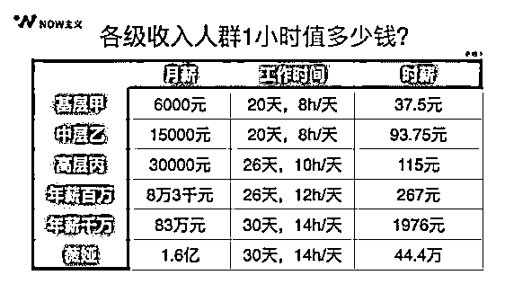

第三个问题，你的时薪达到了你的期望值吗，如果没有达到的话，你希望的数值是多少，你准备以多快的速度达到呢？

哦，对了，这里我们只计算了赚钱的时间，但没有算花钱的时间。实际上，我们用退休前 1/3 的时间赚的钱，要养活自己另外 2/3 的生活，以及退休后直到离开的生活，这还没有包括我们的孩子、父母等需要照顾的家人。

相信你已经感受到了，虽然“死亡”距离我们还很遥远，但留给年富力强的我们努力奋斗的时间，实在不算多。

如今，一提到赚钱、变现，大家第一反应就是要找机会、找风口、找资源，但却忘记了这些外部要素可以无限多，赚钱的方法千千万，但每个人一天还是只有 24 小时，一生也不过百年。

如果没有管理好时间这个唯一人人平等的资源，没有关注提升自己的时薪，而是忙乱中将珍贵的时间随意地花在各种各样的杂事中，最终不但浪费了时间，也很难真正收获到成果。

人从出生的那一刻起，就生活在时间的河流中，无法截断也不能退出，做任何事情都要花时间。唯一的办法就是静下心来，按照工作、生活、家庭等板块，用心管理好自己的时间，实现自己各阶段的目标，活出自己想要的人生。

## 1.2 时间管理的常见误区

误区一：认为时间管理，顾名思义就是管理好时间当我们静下心来想一想，就会发现时间有四个主要特征：

第一，不管你愿不愿意，它一直在流逝。

第二，没有任何人能够人为控制它。

第三，一生当中无论我们做什么事情，都需要花时间。

第四，所有过去的时间，过去就过去了，永远不能复返。

这么一分析，我们就能发现，时间根本不可能被管理。好消息是，时间也是这个世界上唯一真正平等的资源。即便是一个亿万富豪，想拥有好的身材，也需要花时间到健身房里去挥汗如雨。所以，时间管理管的并不是时间，而是自己。通过管理自己，更好地去利用时间，完成自己想做的事情。

误区二：觉得时间管理要从做计划开始

回想一下，你是否有这样的经历，明明做了一份图中左边这样很完美的计划，然而每天重复的现实却是右边这样的。更可怕的是，这样的循环不断地出现在你的生活当中，让你逐渐地失去了信心，觉得自己实在是没有办法成为一个自律高效的人。

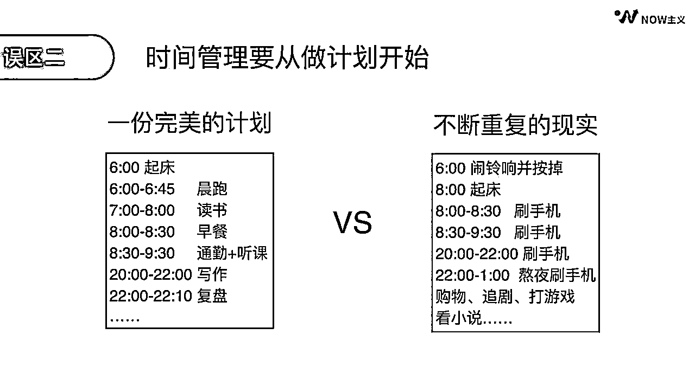

为什么看似完美的计划往往行不通呢？底层的原因是惯性的力量在指引着我们。

研究发现，一个人一天当中 95% 以上的行为都来自于惯性。我们所看到的那些高效人士所谓的自律只是一个表象，实际他们早已经习惯这么做了。妄想用一天就能达成别人花了一年甚至几年的时间养成的习惯，当然是不可能的。如果想要改变，只能逐步优化自己的时间分配，这也是那些长期高效自律的人真正在使用的办法。

之前网络上就有一张时间管理表格，这张表的主人是清华的特等奖学霸马东涵。上面从周一到周日，从早上 6 点到晚上 1 点写的满满当当。第一眼看过去往往都以为这是一张计划表，但她后来澄清了这其实是一张记录表。

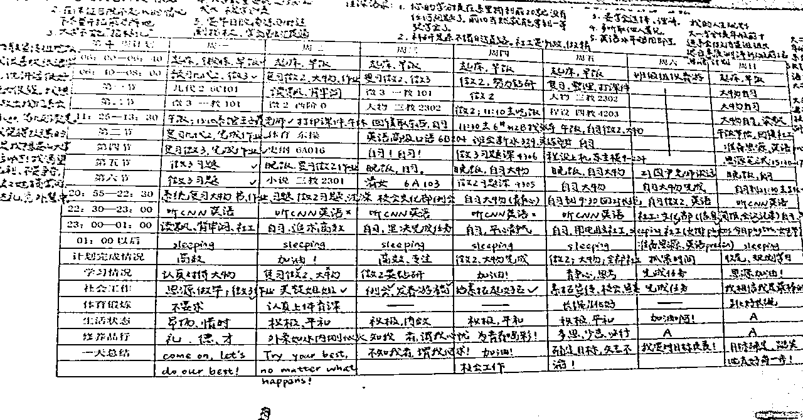

通过记录来逐步优化自己的时间分配，才是开启时间管理的正确姿势。

这个方法的源头是著名的时间管理大师柳比歇夫，他一生当中完成了 70 多部专著， 12500 页的论文，自学了 3 门外语，收集了 13000 只的地蚤标本，留下了大量的通信回忆录，不仅如此，他一天还有时间睡 10 个小时。

听完之后是不是内心大受震撼？对比一下普通人和高手的时间管理方式就可以看出，普通人的常规操作是先计划再执行，但因为缺乏记录和反馈，没做几天也就忘记这回事了。

而高手则是先记录自己真实的时间使用情况，再通过复盘，从中找出可以优化的部分，设定计划并且执行，提升自己的时间使用效率。并且把自己的执行情况再一次记录下来，重新复盘，优化执行。如此反复。

而高手中的高手柳比歇夫，坚持了整整 56 年。所以即使看起来才华横溢、天资聪颖的人，也需要在时间管理上下苦功夫，才能取得杰出的成就。普通人更是要按照记录、复盘、计划、执行。如此反复的坚持，日拱一卒，才能真正的管理好自己的时间，创造属于自己的价值。

想要更好地理解这一点，可以把人生想象成一条河流。从出生的那一刻起就开始不停地向前奔腾。当我们想要发生改变的时候，没有人能够把长江直接搬到黄河。能落地的做法是，先知道自己当前在哪，再沿着自己期望的方向，耐心地修建新的河道。所以，忘掉那些不靠谱的计划，正确的时间管理，要从记录和复盘开始。

误区三：认为计划中断 = 不自律

这几年各种各样的打卡盛行，而众多打卡比较一致的特征就是一天都不能落。所以在大家眼中，高手就是那些每天都锻炼，每天都读书的人。但事实真的是这样吗？

高手也只是一个活生生的人而已，他也会有紧急的事，也会有身体不舒服的时候。除了非常极少数真的能够排除万难，做到每天坚持一件事的人以外，大部分的人其实都不具备这样的条件和能力。所以，拉开我们跟高手距离的，其实是我们对自律这件事的认知。

普通人辛辛苦苦地坚持了 7 天，第 8 天因为一些事情没能坚持，马上产生了极其强烈的愧疚和自责，然后就放弃了。但一个高手遇到这样的问题，会先坦然地面对现实，然后第二天继续行动起来。从长远来看，断断续续的积累，远好过于短期冲刺式的坚持。

要想生动地理解这个概念，我们可以想，每坚持做一次，就相当于往家里搬了一块金砖，即使第二天你没做，前一天搬的金砖也不会跑掉，对吧？所以中断很正常，更重要的是要继续开始。因为我们的每一次努力都不会白费，它们会沉淀下来，成为只属于我们自己的财富。

所以，不要再执拗于连续打卡了，做时间管理，积累比连续更重要。

# 二、时间如何分配

💡

时间管理的第一步，就是先清楚地了解我们目前的时间都花在了哪里。因此我们用「记录」和「复盘」的方法，帮助大家更好地了解自己的事项和所用时间。

另外，在本节你也会看到经典的「时间管理四象限分配法」和圈友 @车纯的高效人生的「NOW 主义时间三分法」，尝试把 24 小时看做完整的一天，把工作、生活、娱乐等所有我们花时间做的事，都罗列出来进行整体的合理规划。

记录的方式，你可以借助我们推荐的手机 App，也可以使用 Excel 表格。现在开始，记录下来你每天的事项和所用时间吧。

## 2.1 为什么要进行时间分配 @车纯纯

首先，我们一起来看看笨笨和大明的故事。

笨笨和大明是同期入职的同事，笨笨单身，大明已婚，有个可爱的 3 岁女儿。在公司里两个人的工位是紧挨着，工作内容也差不多。但大明用了不到一年的时间就完成了升职加薪，而且每天都神采奕奕的。反观笨笨，每天都在辛苦地加班，但好像忙忙碌碌，却没有什么成果。

两个人只隔了半米，每天却好像生活在完全不同的世界里。这是怎么一回事呢？我们来看看两个人上班的一天都是如何度过的。

笨笨的一天是这样的：

我特别忙，天天要加班；

我根本没时间运动和学习；

好不容易到了晚上，感觉终于是自己的时间了，所以经常一刷手机就刷到了两三点；我住的离公司又远，往路上就浪费了两三个小时。

你看，我根本只有工作，没有生活。总结一句话就是作为弱小可怜又无助的社畜，我可真是太惨了。

我们把笨笨一天 24 小时分配进行可视化，就会发现他只睡了 5 个小时，一天三顿饭可能平均只有 10 分钟，用在刷手机的时间上，却足足有 7 个小时，因为白天的 8 小时工作时间内很低效，又只好再低效加班 3 小时。

同样的，一天 24 个小时，我们来看大明：

我每天都会保证基础 7 个小时的睡眠；一天 8 小时的工作，我很难保证从头到尾都全神贯注，但一般只要有 60%- 70% 的时间，也就是 5 个小时左右的专注时间就够了；

我几乎不加班，业余的时间我会用心陪伴家人学习和运动；

上下班的路上，我会学习提前计划好的课程；

我觉得休息和娱乐都很重要，会主动安排。

总的来说，我觉得工作和生活都挺好的。人生遇到问题很正常，勇敢面对，解决它或者接纳它就好了。

我们来看看大明一天 24 小时的分配。睡眠 7 小时很充足；每顿饭平均 20 分钟，很悠闲；除了清洁之外，还有一个小时的休息时间；学习时间和通勤时间合并为 2 个小时；抽空运动 30 分钟；陪伴家人 2 小时；还有 2 个小时的主动娱乐时间。

当然了，能做到这些，更重要的是因为他在 8 个小时内高效工作，没有让工作的时间溢出，占用其他事项的时间。

对照一下，你现在是笨笨还是大明？

你也想像大明一样高效工作，愉快生活吗，那让我们一起开始吧～

## 2.2 从记录和复盘开始时间管理 @车纯纯

### 2.2.1 记录

首先第一步：记录。在《奇特的一生》这本书当中，我们可以看到柳比歇夫记录时间的方式非常详细。

这样的传统记录很有效，但工作量大，难以坚持。为了更高效地记录，我找到了一款软件，叫做块时间 App 。块时间 App 在安卓和苹果平台有不同的名字，安卓的平台叫「块时间」，苹果平台有两个版本，免费版叫「时间块青春版」，收费版叫「时间块」。收费版的色块可以显示标签的名称，并且可以设置二级的分类标签，大家按需下载即可。下面这张图就是安卓版本的使用界面。

块时间的使用方式非常简单，我们先在右侧栏当中列出我们常做的事件分类，选中左边需要标记的时间模块，再在右侧的对应色块上轻轻点一下，就可以完成记录了。

一开始建议大家选择 30 分钟的颗粒度，然后再逐步过渡到更精确的 15 分钟颗粒度。大家熟悉的企业家俞敏洪和王健林，其时间颗粒度也都是在 15 分钟左右。

关于记录时间本身需要花费的时间，请放心，在这个便捷工具的协助下，每天最多不超过 10 分钟。

可能有人会想：这也太事无巨细了吧，而且我根本不记得我这一天干了什么。怎么办？

这里，我们就要上第二个工具了，也就是我们手机里的闹钟。在第一天做记录的时候，请你和我们一起玩一个游戏：为你起床之后的时间，每整点定一个闹钟，一直定到睡觉之前。听起来是不是很疯狂？没错，这个游戏就叫做「疯狂的闹钟」。

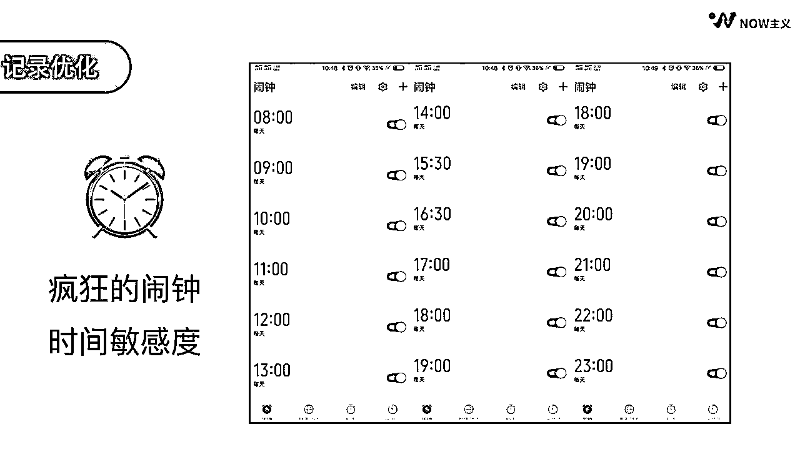

因为我们对时间流失的主观感受往往跟客观是不同的，比如玩游戏的时候会觉得时间过得很快，但做一件很不喜欢的事情时，又会觉得时间太慢了。这样一天体验下来，首先我们能精准地知道自己每个小时都干了什么，不会再有“我很忙，却好像没做什么”的认知失调；其次，每个小时的准点闹铃，也能培养我们对时间的敏感度，校正一下主观中对时间流逝的感知。

这里特别要强调一下，对一刷手机就停不下来的朋友，「疯狂的闹钟」有奇效。原理也很简单，一旦你意识到自己在肆无忌惮地浪费时间，就不会愿意再继续浪费下去了。

块时间 app 搭配「疯狂的闹钟」，我们就可以轻松地记录自己一天到底做了什么。「疯狂的闹钟」只需体验一天就好了，块时间 app 我建议大家至少持续记录一整周。这样，我们日常工作和生活中会发生的每一件事，具体花了多长时间，以及各项任务到底为什么没完成，就会一目了然了。

你会发现一天的时间真的比我们想象的还要不禁用，但当你真正用心去管理和安排的时候，又会大大提升时间的使用效率，这就是时间管理的神奇之处。

### 2.2.2 复盘

如果人是一条河流，记录让我们知道了我们身在何处，下一步就是要去做复盘了。

常见的复盘格式有很多，比如女孩子喜欢的贴纸手账、非常流行的九宫格晨间日记等。但它们的统一特点是太复杂，填完一份至少得花小半个小时，很难坚持。

那么，如何优化复盘的模式呢？我们要从“复盘到底盘什么”这个问题出发来思考，复盘最主要的目的有三个：

今天的成果明天的计划

今日的反思

回答了这三个问题，就可以快速清晰地对自己的一天进行全面审视了。

今天开始，我们就可以参考这个模式来做日复盘的打卡。第一次上手可能需要 10 分钟，但只要熟悉了这这个结构， 5 分钟左右就能完成一份全面、详细、有反思、有指导的日复盘&日计划。

（日复盘举例）

上面这个例子，在模板的基础上又对每件事情所用的时间进行了具体的标注，可以为之后的事项计划做指导。

做一天的复盘可能没什么大不了的，但如果坚持一周，你就会对这周做了哪些事情，获得了哪些成果了如指掌，再也不会觉得时间都荒废了。如果坚持一个月，你就会得到一份详尽的月复盘表，一个月的行动收获近在眼底。

如果坚持 10 年，我们就能清楚地看见自己的成长脉络。这是我每一年的年度复盘和计划表，我很清晰地知道自己每一年都做了哪些事情，有哪些进步和需要提升的地方，并且对于新一年的计划有清晰的目标和落地。坦白地说，这样的生活有计划，有成果、有期待，感觉真的好极了。

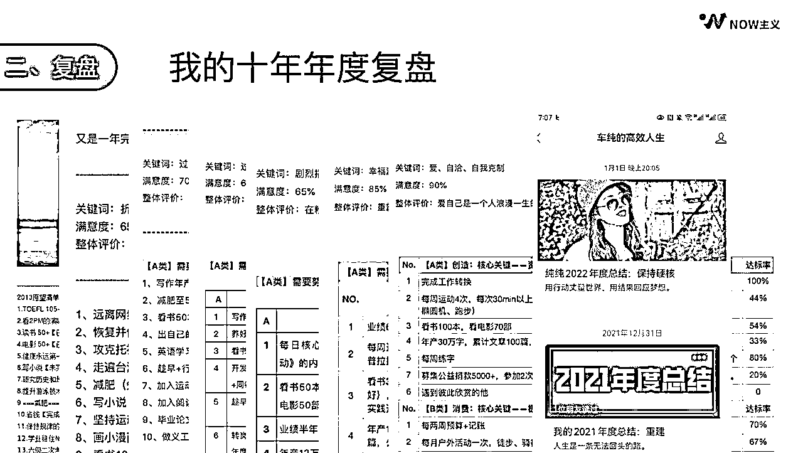

每个人的人生都有自己独特的方向，而复盘让我们知道哪里需要改进，让我们逐渐变成更好的自己。这就是复盘的意义。

相信你已经开始关注自己当前时间安排的习惯了，那么记录和复盘这两件事也请一定要坚持下来。你会对自己的时间安排越来越了解，从而越来越有自信做好时间管理。那么按照记录、复盘、计划、执行的模型，接下来，我们一起看看如何做计划，才能提升时间效率吧。

## 2.3 时间分配方法

💡每个人每天的时间都是相同的，都是 24 小时，但因为分配的不同，导致了结果的不同。

可见，高效人士跟普通人士唯一的区别，就在于他们知道如何更好地规划和利用自己的时间，既能取得工作成果，又能享受生活。既然如此，我们就要解决一个核心问题：如何分配我们一天的 24 个小时。

本小节将会带大家认识三个不同的时间分配方法，大家根据自己的情况，选择适合自己的方法。

### 2.3.1 愿意度分配法@卓卓子是我🎈

把每天要做的事情分为这几类：想做，不想做以及不得不做。

对于要做的事情，不管是工作还是学习，可以在手机的提醒事项或者备忘录里写上我要做的几件事。

其中包含了我应该要做的、我不太想做的、我不得不做的等等…然后在接下来的一天，根据自己的心情来安排这些事情：举个例子：上午到了公司，神采奕奕又能量满满，我可能就会选择做产品规划或是写方案这种需要深度思考，且利用大段时间的工作；

下午昏昏欲睡，没什么精神，就处理一下工作的消息，回复一下邮件，又或者是和开发对齐一下当前工作的进度，整理一下需求表，这类工作通常碎而不难，但却占到了工作的很大一部分；偶尔在上下班的路途上，可能会有那么一瞬间的灵光乍现，可能是一个想表达的话题、一段想说的观点等等…这个时候我就会打开备忘录，语音转文字把那一刹难的灵感先记录下来，用作日后的内容素材。

可能也有小伙伴会说，那在大段时间里，一直被打扰，怎么办？我的经验是：主动出击。

如果你的领导掌控欲很强，提前跟他约好时间手头项目或工作的进度汇报；

如果你总有那么几个同事喜欢在工作的时候过来打扰你，提前询问他们上午是否有需要协助的工作

……

把时间的主动权把握在自己手里，提前约定别人的时间绕开你需要集中注意的时间段，工作昵称备注 xx:xx-xx:xx（即某一段时间）可联系，如无意外你被打扰的情况会至少减少一半。

我们不要限制自己在什么时候要做什么事情，而是给自己充分的自由度，告诉大脑：今天就这么几件事要做完，怎么做什么时候做，你自己定。

这样的好处就是你既不会在拧巴的时候干你不想做的事情，也不会因为错过了要做这件事情的时间而感到沮丧影响接下来一天的能量。

内容来源：6 月 8 日 《顺应人性的时间管理方法》@卓卓子是我🎈

### 2.3.2 时间管理四象限分配法 @车纯纯

相信你的脑海里已经浮现出了一个非常经典的工具：时间管理四象限。这个工具有多普及？几乎所有人的时间管理启蒙都是从它开始的。

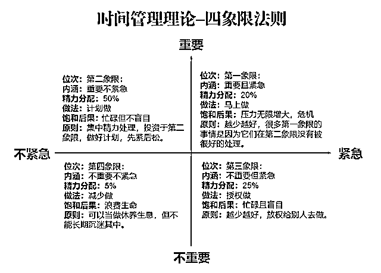

时间管理四象限按照重要和紧急两个维度，把我们常做的事情放到了四个象限当中，并且给出了具体的建议。

重要及紧急的事情马上去做，重要不紧急的事情制定计划做，不重要但紧急的事情，授权别人去做，不重要也不紧急的事最好不做。

### 2.3.3 NOW 主义时间三分法 @车纯纯

以上这个经典的时间分配方法，相信很多小伙伴在用了，也有一定的成效。也有小伙伴会觉得对自己的四象限管理比较困难，比如无法很好地分轻重缓急，或者事项总在增多等等。那么也可以尝试圈友 @车纯的高效人生 的分配方法：NOW 主义时间三分法。

首先，时间管理四象限是以事件为标准的，使用的过程中，很容易发现这四个象限永远可以往里面填无穷无尽的事情。然而事件无限，时间却是有限的。每个人每天只有 24 个小时，如果列事项的时候没有考虑到这一点，很容易列很多其实没时间去做的事。

其次，读书、运动都属于重要不紧急的事。但不紧急这个说法给大家的感觉就是今天不做没关系，慢慢的就变成每天都不做，甚至再也就没做过了，相信大家应该都有这样的经历。

第三，娱乐和放松都被划到不重要也不紧急的事情当中。但这恰恰就是人的天性。想一想，几乎每个人都可以一天不读书，但他绝对不可能一天不玩手机。

最后，不重要但紧急的事，时间管理四象限建议我们授权别人去做，但并不是每个人都有这个条件，而且很多事情别人也真的无法代劳。

在下图中我列出了职场人士的一天，你会发现这其中称得上重要紧急的事情，几乎都是发生在上班的场景里。长此以往，你会发现，我们吃饭为工作让路，娱乐为工作让路，睡觉为工作让路，休息为工作让路。最后导致的结果就是工作不断占领越来越多的时间，大家变得越来越焦虑，也越来越疲惫。

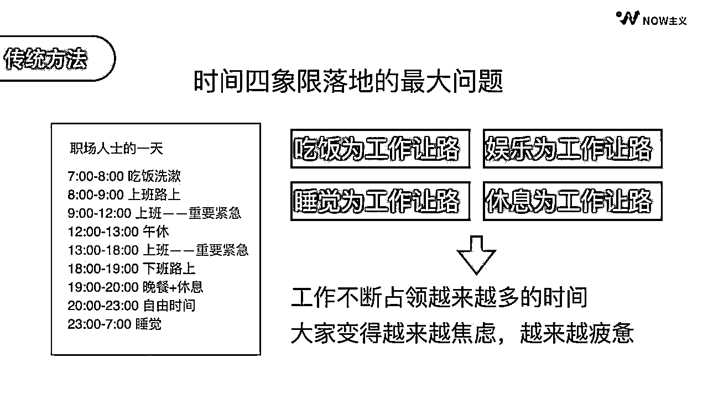

所以时间管理四象限是个非常棒的方法，但它比较适合只用来管理和工作相关的事项。在今天这个工作和生活边界越来越模糊的时代，只使用时间管理四象限，容易让我们把工作和生活对立起来，两边互相抢夺时间，造成焦虑内耗。

当我发现这一点之后，我就换了一个思路。我想，与其去纠结永远做不完的事情，不如从有限的时间出发，认真地盘点一下，我们一天的 24 个小时到底都用来做什么了。

不列不知道，一列吓一跳。我们一天当中要刷牙、洗脸、吃饭、通勤、上班、午休、刷手机，也许还要运动、看书、见朋友、和家人聊天，以及做自己感兴趣的事情。按照这个思路，我们把一天 24 个小时按照用途，其实可以归为三类：第一类：睡觉、饮食、清洁、休息，这些是我们生存的基础，叫做基础时间。

第二类：学习、运动、娱乐、爱好，这些是让我们身体和精神得以充电的时间，叫做蓄能时间。

第三类：我们的主要工作、副业、做公益，本质上都是在创造价值，所以叫做创造时间。

而人毕竟是社会性动物，还有一些需要与他人合作的事情，在基础部分是关爱家庭，在蓄能部分是建立人际关系，在创造部分是与人合作。

我将这种时间分类的方法命名为 NOW 主义时间三分法：基础时间是生而为人的必须；蓄能时间是为身体和精神充电；创造时间是创造价值，与社会交换。这样的分类还能帮助我们更清楚地认识到每件事情的价值，避免无意义的精神内耗。

比如休息是属于基础时间，其实它是人的基本需要。不要为了自己想休息而感到焦虑或者羞耻，也不要为了其他的事情而拼命压榨自己的休息时间。

家庭是人的情感根基，无论是谁都需要花时间在家庭上，这是一个底层的精神需求，也是一个人幸福的根源，不是一句很忙没时间就能骗过自己的。

娱乐真的是被大家误解最多的事情。主动娱乐是健康正向的，也是人非常基本的需求。所以不要因为刷短视频而感到愧疚，你可以主动安排每天刷多长时间的短视频，在这个时间里面充分去享受这种快乐。

从下面这个表当中你可以清晰地看到，工作只是人生的一部分，不能也不应该肆意侵占其他事项的时间。

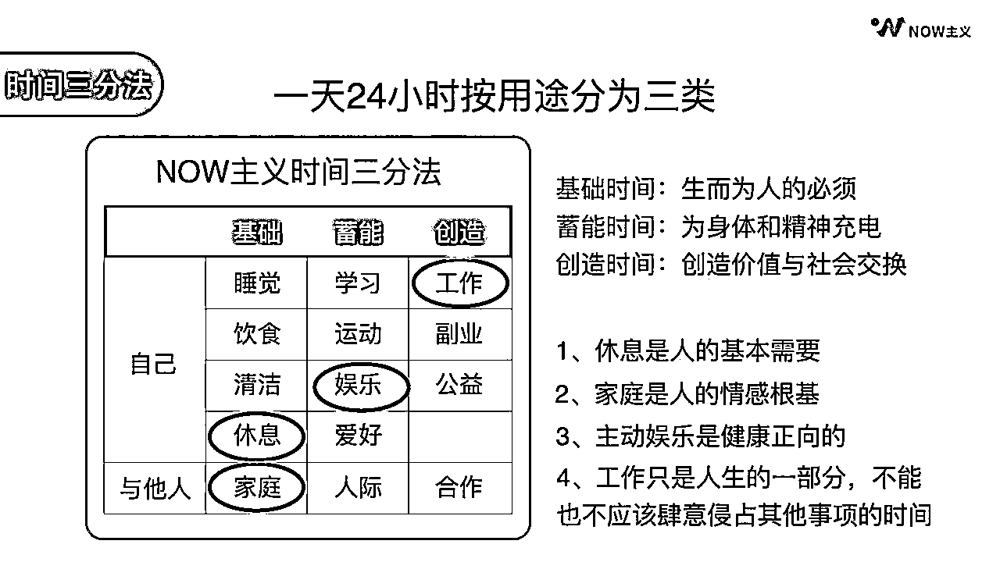

接下来问题来了，基础、蓄能和创造从时间管理的角度出发，为这 3 项的重要性排序，你会怎么排？

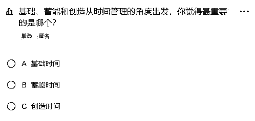

可能很多圈友下意识地就选择了 “创造时间” ，因为这个时间是用来工作赚钱的，赚钱难道不是最重要的事吗？

但其实，我们要赚钱，首先得有一个健康的精力充沛的身体以及身心健康的状态，所以基础时间做的事，吃饭、睡觉、清洁和家庭，才是我们最基本的生存需要，才是真正最重要的。

而第二重要的其实是蓄能时间，因为到了创造时间，你已经必须要直接拿出成果了。没有一个老板在招人的时候，是想让你在他那里学习，他们希望你能够直接给公司创造价值。但很多人现实中，却忽略了专门安排时间学习、运动，给自己充电，不断提升专业技能的重要性。

所以现实当中我们常常会看到，一个人在工作 5 年之后，他的身体很疲惫，知识储量几近枯竭，很难支撑他下一步在职场当中的发展。这就是因为弄错了这三者的重要性的排序，从基础到蓄能到创造，这是一个赋能的过程，反过来则是一个反馈的过程。

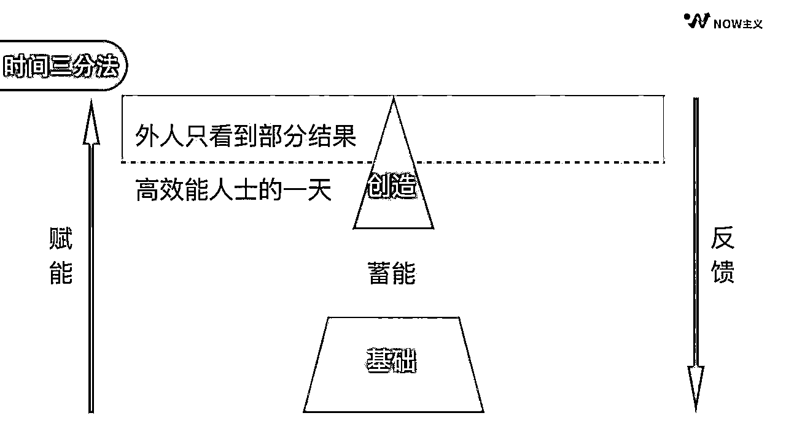

一个高效能人士的一天必然是符合这样的安排。然而我们往往只能看到外界的部分结果，误以为他所有的精力都用来工作。

我们再来看看前面笨笨和大明的例子，他们俩为什么会有如此不同的状态。这时候答案就显而易见了：笨笨的基础时间太少了，所以他没有办法维持一个好的精力，而他的蓄能时间又都是非常单一的，娱乐低效工作更是占据了他太多的时间。

但是大明有足够的基础时间让他精力充沛，而蓄能时间也安排得丰富多彩，工作时间牢牢地控制在 8 小时之内。相信这样大明即便偶尔加班，也能够很快的自我调整，回到自己满意的工作和生活平衡的模式。

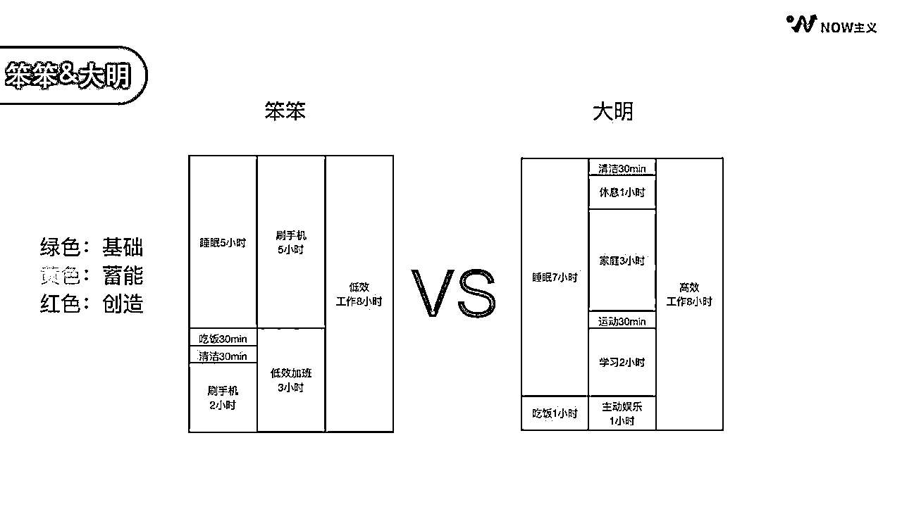

这里我也给大家准备了一些不同情况下时间分配的参考。比如同为高效的职场人士、单身人士和已婚人士，在基础时间的大部分以及创造时间方面是不会有太大的差别的。关键在于蓄能时间的安排，单身人士会用更多的时间来发展自己的社交爱好。对于已婚人士来讲，这个时间可能有一部分给了家庭。

同样的，作为创业者，创造时间比 8 小时再多出 3 个小时也是非常正常的。但不管创业多忙，都一定要留时间陪伴家人。缺失了亲密关系的人生，赚再多钱都难以获得真正的幸福。高效的学生通常也要比别人花更多的时间用来学习，此外还会安排圈友社交以及娱乐等等。

再来看看全职父母这个群体，他们大部分的时间都花在经营家庭上了。我特别列出了基础部分的购物 1 小时，这也属于全职父母在家非常重要的一项工作。对比来看，在做兼职的宝爸宝妈，为了能有足够的工作时间和学习时间，也许会和家人协调，将家务时间缩短，也会主动减少自己的娱乐时间。

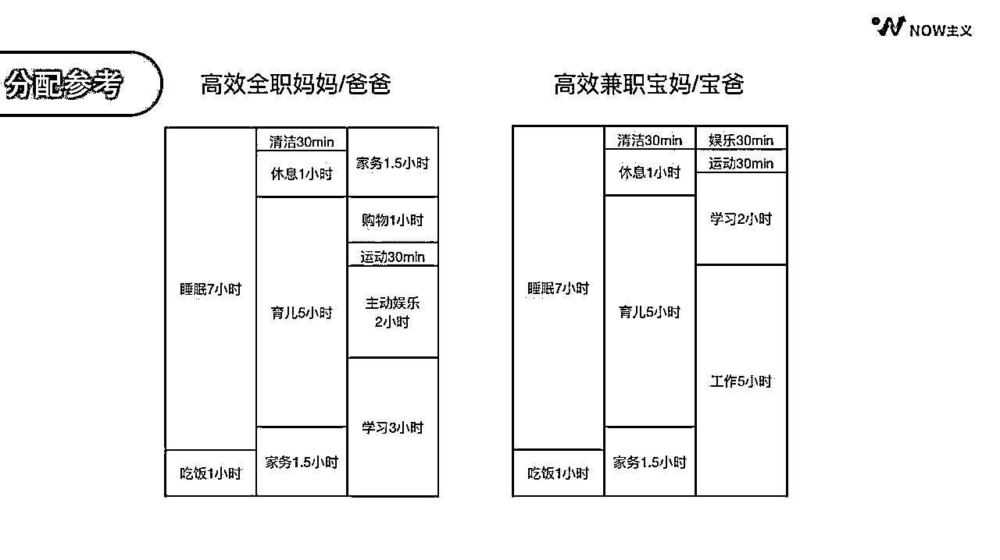

这里的每一张高效人士时间表的背后，都是一个用心努力经营着自己工作和生活的人。

每一个人一天都是 24 个小时，当我们处在人生的不同阶段，我们的分配比例会有所不同，这些都是非常正常的，关键在于有觉知地主动去安排和协调。

## 2.4 【练习】开启时间记录与优化分配 @车纯纯

现在，我们已经了解了如何记录和复盘，也知道了时间分配的方法，那么现在就可以行动起来，做一个自己的时间日志啦，从记录和复盘开始时间管理。

第一步：时间记录

你可以下载块时间 App 来辅助记录，也可以用工具包里的时间日志表格来进行记录，方便后续整体复盘。时间日志模板下载：《时间管理 | 实战工具包》

时间日志表格模板概览：

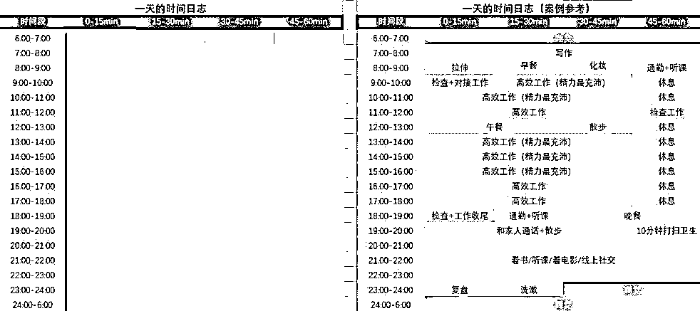

第二步：优化时间分配

时间日志做好之后，结合记录的内容，我们可以完成下面这个小练习，开启时间分配的初步优化：

📌

模板第一步：我一天的 24 小时，按照【基础 - 蓄能 - 创造】进行划分，会包括以下事项：

1、基础：

2、蓄能：3、创造：

第二步：我的时间分配，可以这样优化：

1、

2、3、

给自己的一句话加持 / 鼓励：

参考案例：我一天的 24 小时，按照【基础 - 蓄能 - 创造】进行划分，会包括以下事项：

1、基础：睡眠、饮食、清洁、休息、通勤、打扫、化妆、和妈妈通话 2、蓄能：读书、散步、拉伸、看漫画、刷微博、链接朋友

3、创造：规划、IP、引流、产品、内容、运营

我的时间分配，可以这样优化：

1、人际方面时间分配较少，开始每天上午 11:30 - 12:00 之间，链接一个朋友

2、睡眠时间从 12：00 调整到 11：30

3、固定早上起床后到 10 点为输出时间

给自己的一句话加持 / 鼓励：慢慢来，比较快你也可以在工具包的表格中 - 第二个子表格找到该模板，下载使用：《时间管理 | 实战工具包》

# 三、创造时间的规划 @车纯纯

💡

我们第一个要学习规划的就是创造时间。

在我们每个人当前的生活当中，其实花费时间最多的并不是睡眠，而是创造。有没有发现大部分人的工作，都已经从 8 小时溢出，开始蔓延到生活的方方面面了。

因此我们可以看到，创造时间对大家来说是花费时间最多的模块，而且工作的时间和效率是大家普遍苦恼的问题。如何提高我们的工作效率，真的是一个非常非常重要的课题。

如果先规划基础时间和蓄能时间，可能你总会想，自己是没有时间去实施的。但当你把创造时间先规划好，再去进行蓄能时间和基础时间的规划时，压力是不是就更小了？

高效的工作规划分为 5 步：列出任务，估计时间，预留机动，排序分配，检查回顾。

直接这么一听，可能你有点懵。不要担心，接下来就会展开讲讲每个步骤是怎么做的，你会发现其实每一个步骤都在针对性解决我们工作效率的卡点。

## 3.1 高效的工作规划方法

### 3.1.1 第一步：列出任务

有些朋友对于列任务有个误区，就是想到什么就写什么，这样的方法很容易遗漏工作计划。而更清晰的方法是按照分类来罗列。比如我们日常的工作主要有 4 种。

每日常规性的任务；

今日计划要做的工作；昨天没有完成，推到今天的工作；

今日新增的工作。

这样分门别类地把待办事项罗列进去，就不会担心遗漏了。

### 3.1.2 第二步：估计时间

已经列出了待办事项，但是我们一天只有 24 小时，那如何判断工作需要的时间呢？

大家有没有这种感觉：有时候觉得今天只有 2 项任务太好了，结果一天结束，发现时间都用光了，也就只做了这 2 件事。这到底是怎么一回事？

时间管理领域里有一个著名的帕金森定律，它指的是「工作会自动膨胀，直到占满你所有的时间」。这个定律给我们的启发是，我们预留的时间越多，我们需要的时间也就越多，所以多预留时间会降低我们的工作效率。

不过别担心，通过前面记录和复盘的步骤，我们就可以逐渐精准地预估自己独立完成一些重复型工作的时间了。比如我每天会花 5 分钟进行日复盘，写一篇 2000 字的文章大概需要 2 个小时，阅读一本熟悉主题书籍的速度大概是 3 万字 / 小时。

有了基于复盘的精准预判，我们就不会留太多的时间给自己，也就不会在不知不觉中浪费时间了。

### 3.1.3 第三步：预留机动

大家一定都碰到过这种情况：工作中除了可以预估的常规任务，还经常会遇到新任务。

在常规任务上：即使做了万全的准备，结果刚开始第一步就出了些问题，导致后面又花了很多时间，补救计划全部都被打乱了。

在新任务上：接二连三的新任务不停地打乱原计划，导致最后一半的计划都没有完成。

这两种情况该怎么办呢？我们需要了解另一个可以运用在时间管理领域的定律：墨菲定律。

它指的是事情如果有变化的可能，不管这种可能性有多小，它总会发生。也就是说只要我们碰到不熟悉的任务，想得再周到都会出错。所以，碰到新任务、不熟悉的任务或者需要新技术时，一定要给自己多留一些时间。

比如，我自己就会提前预留 3 到 5 倍的时间，而且我不会花太多时间在初期准备上，因为未来是未知的，我会先开始边做边调整。

可能有些人会认为预留 3 到 5 倍的时间太多了。其实如果能够用 1 到 2 倍的时间就完成，当然是最好不过了，但为了确保我们能够预判未知的风险， 3 到 5 倍的时间是比较合理的。

另外，每天可以留出 40% 的时间给到意外事件。比如如果工作 8 小时，我就会预留 2 到 3 个小时的空余，先不急着安排。如果那天很幸运的没有遇到突发事件，那我就可以将原本计划第二天做的事情提前，或者用这段时间来学习，提升自己。

所以说，计划并不是排得越满越高效，用预留机动时间的方式，留出应对突发、未知事件的盈余时间，能让我们做到心中有数，更加从容不迫。

### 3.1.4 第四步：排序分配@车纯的高效人生@ T_T

我们先来看碰到的问题：每天本来就有常规任务，还有许多新增任务放在一起，经常不知道该先做哪件事，怎么办？

很简单，三步走：先排时间，再排重要程度，最后根据预估的时间安排进日程中。

举个例子：我今天的工作一共有 5 项，分别是早上 7 点发营销日历，制作给客户的提案，撰写一篇业务文章，搞一个新项目的营销方案下午 1 点和 B 客户通电话。因为时间是硬性条件，所以我会把固定时间的事情先排列出来，分别是 7 点发营销日历和 1 点到 1 点半和 B 客户通电话。

剩下的三件事，我按照重要程度排序为 A1、 A2 和 A3。我预估 A1 需要 3 个小时， A2 需要 1.5 个小时， A3 需要 1 个小时。

A1 是最重要的，所以我把它排在上午 9 点到 12 点的时间，接下来 1 点半到 3 点的时间完成 A2， 3 点到 4 点的时间完成 A3 。

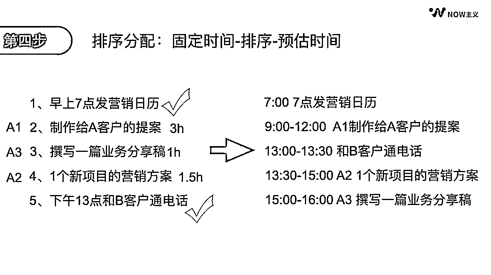

排好这些事情之后，我们可能还要应对一些新增的事项。例如一些突发的紧急情况、计划外的紧急事件或者对我们产生内外干扰，却又不那么重要或紧急的事件。

这里要特别注意，有些的新增事项不一定非要自己做。如果判断不是自己的事情，可以果断地拒绝；如果判断可以授权他人去做，那就分出去。

对于需要自己做的， 2 分钟能完成，顺手就把它做了。2 分钟如果完不成，就把它放入事项清单，和其他事项一起比较，看看需要立即做，还是安排其他时间做。

综上所述，我们可以把工作中不同的事件分为：A / B / C 类来看 A 类事件：我们确定必须自己亲自执行的重要事件，是已安排的计划内事件，包括重要紧急和重要不紧急的事件。

B 类事件：突发的紧急情况，计划外的紧急事件 C 类事件：其他时间，对我们造成内外产生干扰，却又不那么重要或者紧急的事件

把事项分类好后我们要坚持处理事项的顺序，参考如下原则：首先保证 A 类事项被执行，记录推迟或委托 B 类事件，能不自己干的尽量找人干，C 类事情不做，只做文字记录。

我们第二个重要的意识形态，每天要确保 A 类事件（要事）在高能量时间段去执行，即高能要事。

一个人每天的效率高峰值通常在早上醒来的时间段内，一般 2-3 小时，我个人的话 一般早上 9 点开始 1-2 小时，下午 2 点后 1-2 小时，是精力最能集中的时间段，如果紧急程度都差不多的话，我会把 A 类里面最难的事项安排在这些时间段里面，如果是紧急事情，优先处理紧急事项。

但有没有一种可能，就是两个任务，我分辨不出来它的优先级？其实从来没有两个任务会有相同的优先级。只要放在一起比较，总有一个更重要。只要你能把当天要做的事情都列出来，应该先做什么后做什么，结果就一目了然了。

大家可以根据自身的高能时刻做调整。有的人深夜时刻恰恰是思维最清晰的时刻。

内容来源：《高能要事：如何通过时间分类来提高时间管理效率》

### 3.1.5 第五步：检查回顾

又一个常见的场景出现了：有时候一天下来感觉也挺忙碌的，但快到了下班时间，我们才发现待办清单上还有好几件事都没有完成，这是为什么？

我们的大脑很难同时记住很多事情，所以列了清单之后一定要多次回顾。简单来说就是一日三省。

前一天晚上：在日复盘当中列出明日计划

早上到办公室的第一件事：检查当日待办清单

下午上班前：检查上午的事项完成情况，并调整下午的计划下班前：检查今日事项的完成情况

这样，到了下班之前就已经做了 4 次今日事项的检查了，基本上不会有遗漏或者耽误的情况。

总结一下，做一份高效工作计划的流程是这样的：首先，列出当日的全部任务。其次，预估每件事需要的时间，然后预留出机动时间。接下来对刚才的任务进行排序分配，先排固定时间的，再按照优先级排剩下的工作。最后，每天至少要有 3 次的检查回顾，确保任务完成。

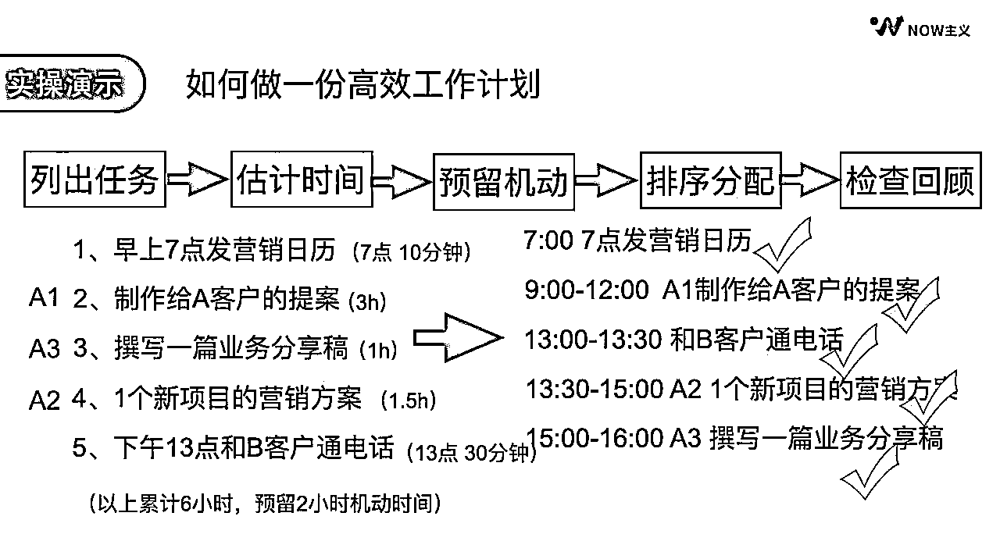

这 5 个步骤常看常新，一定要经常练习，才能真正的完全掌握。记得学完就练，才能知行合一。

## 3.2 规划工具推荐

Excel 表格：非常清晰，而且容易保存，比较适合大部分时间都在办公室办公的圈友；

日事清 App：比较适合工作很灵活，经常在外出差或者拜访客户的圈友。可以以周为单位来规划一整周的工作计划，看起来非常得清晰。手机、电脑、网页等多个平台都可以通用。

工具本身其实没有好坏，关键在于如何使用。那么接下俩选择一个你喜欢的工具，今天就开始行动吧。

# 四、基础时间的规划 @车纯纯

💡

通过时间管理三分法，我们知道了一天的 24 小时，可以分为基础、蓄能、创造三大类。这其中，最重要的是基础时间，也就是睡眠、饮食、休息、清洁和陪伴家人。

在这一节，我们会讲讲基础时间规划的四个步骤：记录、调整、固定和优化。也会和大家介绍如何更好地使用这个非常经典的时间管理工具：番茄钟。

基础时间是人生的基石，也是我们每天都要做的事，应当以 “尽可能规律” 为目标，做进一步的规划和安排。

## 4.1 为什么规划基础时间？

良好的睡眠让我们有充沛的精力，来面对工作中的挑战；

健康的饮食让我们给身体及时补充能量；

休息能避免我们透支自己的体力和脑力；清洁让我们拥有整洁宜人的面貌，悦人悦己。

特别需要注意的是，“陪伴家人” 也在基础时间的板块，因为亲密关系是我们幸福生活最根本的组成部分，因为工作繁忙或者自我提升，而借口没有时间陪伴家人，其带来的后果是无法想象的。

## 4.2 规划的四个步骤

基础时间主要包括睡眠、饮食、清洁和家庭，这部分的规划较为简单，一共有四个步骤，分别是记录、调整、固定和优化。

第一步：记录

前面我们提到过，人是惯性的产物，所以大量的行为是 “无意识的” ，在基础生活的部分尤其多，只是我们很少有机会从客观的视角观察过自己。而基础时间部分的事项，睡觉、饮食、清洁和家庭，又是每天都一定会做的事，积少成多，产生的时间浪费不可估量。

拿早起来说，现在很多人早上一睁眼，就会拿过手机开始刷，不知不觉半个小时，甚至一个小时就过去了。这个隐蔽的坏习惯不光浪费了最宝贵的晨间时光，还会让大脑一大早就接触到最刺激最易获取的信息，导致在白天工作中无法聚精会神去面对真正的难题。

所以，记录的目的，就是要先把自己一天从起床睁眼到睡觉的全部时间都记录一遍，找到自己行为中的惯性。

第二步：调整例如，通过记录发现自己一睁眼就刷手机到不得不起床，早起的时间都浪费了，那就把早上睁眼后的时间，换成立即做到书桌前读半小时或者一小时书。这样同样的时间，就从「刷手机」调整为了「阅读」。

再比如，有的女孩子通过记录会发现，自己每天早上考虑穿什么衣服，换来换去就要花掉半个多小时。那就把「搭配衣服」的时间，从早上换到晚上睡觉前，还可以将衣橱整理一番，准备好几套固定的搭配，这样早上起来就可以直接选一套，穿着出门了。

这些通过一步步调整优化出来的时间，日复一日，聚沙成塔，能帮我们省下大量的时间浪费。

第三步，固定

改变一个旧习惯的方法，就是用一个新习惯替代它。但旧习惯之所以能成为习惯，一定是在我们的生活惯性中根植了很久的。所以当我们用早起看书替代早起看手机后，还需要坚持一段时间，通过不断重复将其稳定下来，用好习惯彻底代替坏习惯。

第四步，优化

从原则上说，基础时间越规律越好，比如固定的时间入睡和起床，固定的时长刷牙洗脸等。在这个过程中，我们可以进一步发现可以优化的空间。 比如刷牙的时候可以同步煮鸡蛋，休息时可以一边靠墙站一边看喜欢的电影，再比如打扫卫生这件事可以拆分为每天下班到家就做 10 分钟的随手打扫，然后每个周五或周六，再花 3 小时做一次大扫除。

这些细处的基础时间的优化和利用，都是在做的过程中逐步感悟到的，之后会慢慢形成一套自己的基础时间高效安排。

以我自己为例：睡眠：一般会在 23：30 - 00：00 之间睡觉，早上 7：00 - 7：30 起床。

三餐：时间都比较固定。早餐是在 8: 15 - 8 ：30，有 15 分钟的时间；午餐是 12：00 - 12：20，20 分钟的时间；晚餐是 18：20 - 18：40，有 20 分钟的时间。

洗漱：早上洗漱化妆通常需要 30 分钟，晚上洗漱卸妆大概需要 15 分钟。

打扫：习惯每天做 10 分钟的随手打扫，每周五或周六进行一次 3 小时的大扫除。

家庭：每天和家人通话至少 30 分钟。

休息：每工作 50 分钟就休息 10 分钟。

通过一段时间的记录之后，你也会对自己的基础时间做到心中有数。这部分因为是每天的硬开支，千万不要因此而感到焦虑。既然每天一定要花时间吃饭，那吃饭的时候就不要再想着工作，想着客户，安心吃饭就好，其他基础时间的事项也是同理。

在基础时间部分，有两件事要特别强调一下：

睡眠提升一个人想要过高效的生活，最关键的就是要有规律和高质量的睡眠。而拥有良好睡眠的方法并不难，和时间规划一样，睡眠也不适合一上来就硬规划，我们可以采用三个步骤来优化：第一监测睡眠，第二找到规律，第三优化作息。

市面上记录睡眠的工具也有很多，比如睡眠手环、睡眠手表以及睡眠软件等等，大家可以根据自己的实际情况选择适合自己的工具使用。偶尔的熬夜或者偶尔的失眠都是非常正常的，关键是能够通过监测和调整，及时的回归到正常规律的睡眠当中。

另外，圈友杨涛也和大家分享了一些关于改善睡眠的方法，需要的小伙伴可以跳转到 10.3 了解。

及时休息

现在我们办公的场景大多是坐着的，但是久坐的危害真的比我们想象的要大得多。

第一个事实：久坐和许多疾病相关。比如容易造成颈椎病、腰椎间盘突出，肌肉量减少，增加内脏脂肪， 二型糖尿病风险增加 88%，心脏疾病风险增加 14%，肺癌风险增加 27%，肠癌风险增加 30%，子宫癌风险增加 28%。大家也不用纠结说这些数据到底准不准确，我们只要牢牢地记住，久坐会影响到我们身体的方方面面。

第二个事实：运动和久坐其实是不能相互抵消的。也就是即使你每天都要运动两个小时，也不能弥补你久坐六七个小时甚至 10 个小时以上对身体造成的伤害。所以比起去加强运动，及时地休息可能更加重要。

## 4.3 规划工具推荐

1）番茄钟

说到休息，大家可能会想到非常经典的时间管理工具：番茄钟。

就是以 30 分钟为一个单位进行工作或学习，其中包括一个 25 分钟的专注时间和一个 5 分钟的休息时间。背后的原理是人的专注力其实只能持续 15- 20 分钟。

层面上来讲它是非常科学的，但是你会发现番茄钟中的 25 + 5 并不适用于职场。主要的原因有三个：

第一，时间太短， 25 分钟往往很多人刚刚进入工作状态。

第二，职场中很多时候，并不方便我们每 25 分钟就起来走动或者倒水休息。

第三，在职场的环境中，被打扰是一种常态。25 分钟集中精力是一种比较理想化的想法，不一定真的能实现。

所以我们可以把休息的方式切换成每工作 50 分钟，休息 10 分钟。在 50 分钟的时间里专注于工作，然后花 10 分钟集中来休息。比如会做一些倒水、上卫生间、简单的拉伸运动，以及检查一下当前的工作进度。

最简单的实现方式，就是电脑桌面闹钟提醒。如果是苹果的 iOS 系统，可以使用 Be Focused 这个软件，如果是 Windows 系统，它自带的电脑闹钟就已经够用了。

除此之外，每次休息之后还可以切换一下办公的姿势。比如第一个 50 分钟是坐着的，第二个 50 分钟就可以换成站着。现在能够帮助我们切换站坐姿的桌上桌以及落地桌都有很多，大家可以按需配置。

根据前面的记录和梳理，我们就可以得到一份按照时间来排列的基础部分的时间安排了。也许通过这几天的记录，大家发现了，其实我们每天的早中晚都会有一些固定的行程，这些行程属于每天都要做的事，并且它们越规律越好，这样我们就可以用行为惯性来节约意志力的消耗了。

# 五、蓄能时间的规划 @车纯纯

💡创造时间用来赚钱，基础时间确保我们最基本的身心健康，蓄能时间则如其名，是让我们在工作之余，为自己的大脑、身体、人际关系补充能量的，所以蓄能时间包括学习、运动、娱乐、爱好和人际。

规划蓄能时间主要有三步：

第一，做计划；第二，估算大致时间；

第三，以周为单位提前安排。

在做蓄能规划的时候你会发现，有很多方向，但是又不一定可以精确安排到某天某时，因此规划时你需要明白：不可能有完美的一天，但可以有完美的一周。

具体如何规划蓄能时间，我们来一起往下看。

## 5.1 为什么规划蓄能时间？

蓄能时间包括学习、运动、娱乐、爱好和人际。

学习让我们有更多的知识和认知，来解决复杂未知的问题；运动可以提升我们的身体素质，同时也是释放压力的最佳途径；

娱乐本身是正常、积极的需求，主动安排好娱乐时间，可以无负担地享受其中；爱好承载了我们对世界的好奇心，让我们多了一个了解世界的视角。

同时，人际关系也属于蓄能板块。建立人际关系很像存钱，平时就要日积月累，不断地投入，需要的时候才能取出使用，这部分的时间也要提前规划出来。

## 5.2 规划的 3 个步骤

蓄能时间主要有三步：第一，做计划；第二，估算大致时间；第三，以周为单位提前安排。

以我个人为例，我的蓄能时间主要包括学习、运动、娱乐、爱好和人际。做规划的时候就会先列出我想做的每类事情，具体有什么，再去估算每一项的时间。比如：

学习：我要阅读一本《影响力》，大概需要 8 - 9 个小时。

运动：我要健身三次，每次健身 2 小时加 1 小时路上和清洁的时间，总共需要 9 个小时。

娱乐：我想看一部 2 个小时的电影，一部 30 分钟的纪录片，每天还想刷 15 分钟的漫画，刷 30 分钟的微博。

爱好：我希望能够在周末有 1 小时的练字时间，如果有超过一天的空闲时间，可以去户外爬山或者徒步。

人际：我希望每周能够线上联络一位好友，线下有一次社交。

而且大家也一定都经历过这样的时刻：中午吃饭的时候想看综艺，结果打开电脑挑了半天，饭都吃完了综艺还没找到，或者晚上终于有时间，想看书。结果找了半天，都没决定看哪本书，时间也就这样过去了。

所以我们在做计划的时候，一定要提前把具体读的书、看的电影、做的运动都敲定下来，避免临时决定浪费时间。

所以我的常规蓄能时间可以这样安排：

这样的一个基础模型定下来之后，后续的蓄能就可以来参考安排了。

## 5.3 蓄能时间规划的注意点

以周为单位提前安排

在做蓄能规划的时候需要明白：不可能有完美的一天，但可以有完美的一周。

看看按照这样基础和蓄能规划的方式，美好的一周到底长什么样。我们来看看大明的一个星期都是怎么安排的。

看图可知，大明的每天早上都很规律，周末跟工作日的作息是一样的，这样整个人的生活状态会更规律，也更健康。而且因为已经提前安排好了具体的内容和需要花费的时间，所以基本上都是能够践行下来的。

像这样的一周是不是充实、丰富且愉快？相信只要我们持续地记录复盘，合理的规划践行，也是能够拥有这样完美的一周的。

## 5.4 【练习】时间三分法综合练习

了解了基础、蓄能、创造三大类时间的规划，现在我们就尝试着根据时间三分法，来安排一下自己的各类事项吧。

因模板较长，这里给大家以图片的形式进行展示，你可以在工具包的表格中 - 第三个子表格找到该模板，下载使用：《时间管理 | 实战工具包》

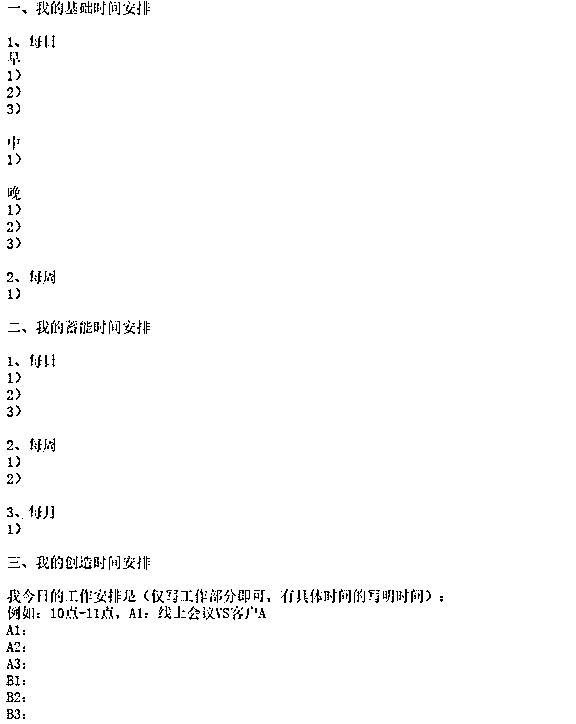

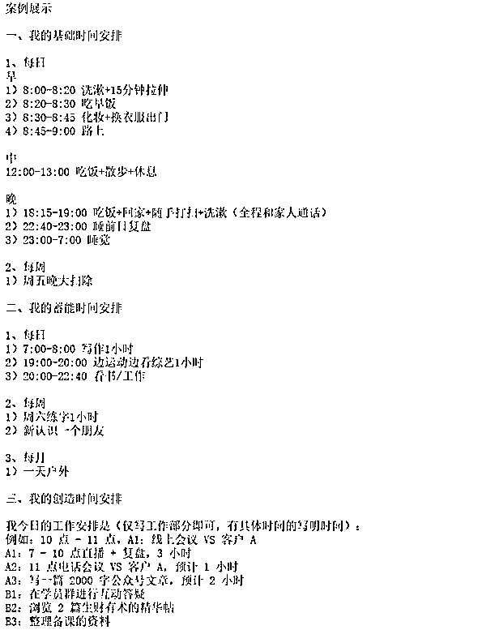

# 六、如何提升效率 @车纯纯

💡

其实记录时间的过程，就是我们把时间进行可视化的过程。我们把时间块想象成一个一个的乐高颗粒，时间就等于有限的乐高颗粒。而时间管理就是用有限的乐高颗粒来搭建我们的人生。

在时间有限的大前提下，怎么提高时间利用率？我们一定要思考的问题了。深耕时间利用率可以从以下四个方向入手：

第一，提高单位时间的产出；

第二，时间的精准化利用；

第三，时间的精细化利用；第四，时间的叠加利用。

接下来就会详细讲讲每个方向的时间利用都是怎么提高的，快来学习并且优化你的时间安排吧。

## 6.1 如何提高单位时间的产出

想要提高单位时间的产出，就要弄明白我们效率低下的根本原因。主要有三个：

第一，不想做不想做的原因也有很多，比如受情绪干扰，这部分会在下面的情绪管理部分具体去讲解，这里先整体概括一下。

这种不想做的感受其实可以用「混沌」两个字来形容，不管是情绪还是做事，好像都有一层迷雾阻挡着。破解的办法就是要从混沌到具体，看下方的图片你就明白了。

左图会给你一种模糊的、迷茫的感觉，就好像我们面对一个复杂任务，但思绪混乱，无从下手的状态。

但看右边时大脑马上就会下意识反应出 1+1=2，这就是具体的力量，它能帮你绕开情绪的混沌，带领大脑直接开始思考解决方案。

大家在做事情的时候会不会发现，自己只要开始做了，越做就越来劲。这是因为越做事情就越具体，就变得更加自信。而越不开始做，事情就会变得越来越混沌，导致你逐渐被焦虑淹没。所以从不想做到开始行动，你只是缺一个开始。

给大家分享一句非常好用的咒语：我就先做 5 分钟。

不管问题有多难多复杂，先尝试做 5 分钟看看。一旦开始接触具体的事情，我们的注意力就会从焦虑转移到解决方案上，自然而然地开始行动了。

第二，想做但是不会做或者思路不清楚

开始做了之后，也会遇到一个新的问题：可能不会做，或者思路不清楚，同样也会导致低效。

这个时候我们可以大事化小。具体拆解路径主要有三步：

第一步：确认目的

第二步：确认有多少时间

第三步：确认做这件事情的标准是什么？

举个例子：领导现在让你做一份 PPT，你需要怎么做？一定要在接下工作的第一时刻就按步骤逐一和领导确认：

了解了这些需求之后，我们再根据做 PPT 的流程以及所需的时间做进一步的拆解。

第一步：已有 PPT 资料整理，需要花费 1 个小时。

第二步：撰写大纲文案需要花费 1 个小时。

第三步：制作 PPT 加匹配图片、图示图表，大概需要花 4 个小时。

第四步：添加动画转换格式检查 PPT 大概需要半个小时。

剩下的 1.5 小时是预留的机动时间。

这样我们就把一个大任务变成了一项小任务，再结合我们当前的实际情况，就可以排进事项清单了。

在这里就有一个新的问题，面对一个新任务，如何快速掌握拆解逻辑？给大家一个解题思路。

这里的关键是，千万别花时间去原创，一定要去拿别人的模板来改。因为很多你第一次做的事情，已经有无数人做过并且总结经验了，不要去重新发明。车轱辘会做了就能提高效率吗？也不见得。

第三，会做但集中不了注意力导致效率低

无法集中注意力的原因，大致可以分为两大类，一类是被外部打扰，另一类是自己不够专注。

沟通是大家协同工作必须做的事情，但又因为这些沟通的部分，我们经常在工作中面临随时被打断的困境，而且一旦被打断，又很难回到工作状态里，很影响工作效率。这里教大家非常好用的一招：设置自己的防打扰时间。

举几个例子：从部门协调的角度上来讲，财务部可以发布一个这样的通知：各位亲爱的同事们上午好，因公司发展良好，业务繁忙，最近财务部工作量陡增。现计划将每天上午 10：00-12：00 设定为财务部内部处理工作时间。有业务对接的同事，请在早上 9：00-10：00 以及 13：00 以后这两个时间段集中联系我们，谢谢大家的配合财务部。

如果你是甲方，想要催稿可以这么说：白云早上好，我是 A 公司负责与您对接文案内容的黑土，我们的文案需求已经发给您了，麻烦您在今天 13：00-15：00 之间这个时间段将文案的初稿发给我，我会在 16：00 之前与您确认，谢谢。

领导面试可以这么说：请将我的面试时间统一安排在周三 13：00-16：00 的时间段，如果有意外情况，我会提前通知。

工作对接我们可以这么说：收到，我上午要处理 A 项目这份文件，下午 3：00 之前我给到您，您看可以吗？

自由职业的朋友可以这样和身边的人告知：大家好，上午的时间我一般会用来集中输出内容，回复消息会比较慢，请尽量在下午 1：00 之后与我联系。

当所有的事情都杂糅在一起的时候，我们的效率是最低的。但如果你主动出击，提前和他人约定好沟通的时间，就可以帮助自己把每天的工作时间分为专注工作时间和专注沟通时间。这样该集中注意力做工作的时候就做自己的工作，该对外沟通的时候就在一个时间段里统一完成。这样两部分的时间就都是高效时间了。

所以其实预防打扰的秘诀就是先发制人，提前和对方约定时间，既能方便他人，也能解放自己。这也是《孙子兵法》中“致人而不致于人”的智慧。

除了被外界打扰之外，我们自己也会容易走神。经过多年的实践，我发现以下几个方法是真的很管用：

第一个，设置自己的专注环境。

专注环境还要分为信息环境和工作环境。在信息环境中，我们要尽可能的关闭所有非必要的软件提醒，这样你就不会被一些八卦消息或者不是很重要的新闻报道打断工作了。

越来越多的信息纷杂的微信群，也是隐藏的专注力炸弹。对于无法退出的微信群，我们可以设置成消息免打扰，过多的群还可以选择折叠该群聊。如果担心错过群里的重要信息，可以挑选「关注重要的群成员」，这些人在群里发信息才会提醒你，比如群主、班主任等。这样整理一波，你会发现真正有价值需要关注的群消息其实非常少。

工作环境：桌面不一定要完全整洁，但是工具要备齐，别刚开始没多久就发现缺少东西，导致工作中断。

第二，工作时要不要听歌？要具体判断。

如果你把听歌作为屏蔽外界噪音的屏障，听歌就是有用的。但如果你所在当前的环境非常的安静，听歌只是为了放松心情，那大概率它会让你走神，比如听到熟悉的歌忍不住跟着哼起来，或者听到不喜欢的歌还得打开手机切换等等。建议大家做有挑战性的工作时，关掉音乐，聚精会神。在做比较熟悉，游刃有余的工作时，可以打开音乐，在一个轻松的状态下工作。

当然了，即使不听歌，在办公室里挂上耳机，其实本身就是在告知他人别来打扰我，对自己也会有一种我要开始认真工作的心理暗示作用。

第三，可以给自己设置一些个性化的工作启动仪式，比如接一杯水放在桌上。

除了打造专注的信息环境和工作环境，我们还可以做一件事来主动监测和提升自己的注意力。具体怎么做，我们可以选择一个有倒计时功能的软件，开启 50 分钟倒计时。在接下来的过程当中，每当我们下意识地去看手机时，我们就记录一下屏幕上显示的时间，继续回到工作中，等 50 分钟倒计时结束，再来看看自己分心了几次。

这个办法多次练习，可以在短期内提升自己的专注度。它起作用的关键是能够在自己注意力不集中时，第一时间觉察并中断我们想要刷手机的潜意识，提醒我们尽快返回工作状态。

类似的倒计时工具有很多，这里特别推荐一款简单好用的 APP：Forest

## 6.2 如何进行时间的精准化利用

精准化即我们预估花费的时间跟我们实际花费的时间相差尽可能的小。

这里就有一个问题：为什么我们预估的时间经常不准？仔细回想你就会发现，我们每天做的事情大致可以分为两大类，一类是相对可控的，一类是相对不可控的。相对可控的部分，其实是可以做到精准预估的。

比如，你读完一本 18 万字的熟悉的主题的书，需要多长时间？可能有些圈友从来没有思考过这个问题，但你只要依照以下 4 个步骤去行动，就能得出自己的答案。

第一步，阅读 15 分钟，记录总字数。

第二步，算出自己的阅读速度，比如 500 字每分钟。

第三步，算出自己一小时的阅读字数。推算下来大概是 3 万字每小时。

第四步，就可以直接得出答案了。阅读 18 万字熟悉主题的书，你需要 6 个小时。

因为读书是相对可控的事情，所以算出数据之后，下次当你拿起一本新书，只要看一下总字数，就大概知道自己读完这本书需要花多长时间了。

精准预估我们还可以用在哪里？比如你每天都要做的一项工作是什么？大约需要花多长时间？你基础时间部分的各个类别大约会花多长时间？因为每次做的时候变化不大，所以能够帮助你更精准地确认自己的时间支出。

对于相对不可控的事件，我们需要了解霍夫施塔特定律：你在一件事情上花费的时间，总是要比想象得多。而且即使我们已经提前意识到这一点了，在给一个复杂的项目制定截止期限的时候，也很容易自信过度。

这里有一个参考标准，把你最坏情况下所用的时间乘以 2，就是你理想的截止时间。跟我们之前所说的预留 3 - 5 倍的机动时间其实是异曲同工的。

知道了这个定律，我们就要在心理上做好准备。我们可以设定一个严格的最后期限，但是别指望我们的项目会按计划全部完成，结果只能是比理想预期完成得少。所以时间精准化教会我们从事件出发，相对可控的追求精准，相对不可控的降低预期，多留时间，这样我们的计划才更可能实现。

## 6.3 如何进行时间的精细化利用

接下来我们来看看第三个方法时间的精细化利用。时间其实有很多的度量单位，比如年月周日、半天、小时、 30 分钟、五分钟、一分钟等等。

在过去的几天当中，通过块时间的记录，其实大家的时间颗粒度已经变得很小了，但你们一定见过这样的人，跟你约定时间的时候说：我们下午见。这样的人，他的时间其实就是以半天作为一个颗粒度来划分的。

所以当我们的时间颗粒度越小，我们能够利用的时间就越多。而我们每一天的时间，无论怎么安排，都一定会出现很多碎片化时间。所以，想要提升时间，精细化地利用，我们可以提前想好这些时间都能做什么。

比如 15 分钟能做什么？可以听一节音频或视频课，做一组快速锻炼，给家人打一通电话，快速地打扫一下卫生，网上买今天要吃的菜。

5 分钟能做什么？我们可以听一首歌，做一组颈部的拉伸，去一趟卫生间，下楼扔个垃圾，快速回复一条消息。

有了这样的一张清单，遇到碎片化时间的时候，你就可以充分利用起来了。所以时间的精细化是从时间出发，时间颗粒越精细，我们能够做的事情就越多。

## 6.4 如何进行时间的叠加利用

最后一个深耕时间利用率的方法就是时间的叠加了。其实现在大家已经非常普遍地在这么做了。比如刷牙的时候，或者通勤中听课打电话的时候，就可以四处走动，增加一下我们的运动量。

时间叠加就是找到可以一起做的事情，合并利用时间。

当然了，在我们做记录的时候，我们可以以价值更高的那件事为标准。比如通勤的时间用来学英语，这段时间我们在记录的时候就可以直接标记为学习时间了。

# 七、如何提升执行力 @刘小排

💡每一次的生财有术小航海，都能在一个月之内，改变很多新人创业者的命运。没有拿到结果的圈友，大部分在自我复盘时都会提到，主要原因是执行力不够。

本章刘小排老师将会结合生财以及生财航海的例子，给大家讲解执行力到底是什么？怎么提升呢？本章将会从认识以下三种执行力出发：第一种执行力：“症状解”

第二种执行力：“杠杆解”

第三种执行力：‘系统解’带大家认识不同的执行力，大家可以根据自己的情况，进行对号入座，希望能给你一个启发。

我们从三个典型的生财有术圈友开始讲起。

圈友 1：小 X，发了一条朋友圈“立一个 flag：明天中午十二点（17 个小时）完成小航海”，果然，他第二天完成了小航海。

圈友 2：小杨，曾负债 140 万。为了学会做淘宝，他用了 3 天的时间，每天 16 个小时左右，把生财有术里面的相关电商精华文章全部打印出来，一边阅读一边去理解做笔记，积累了 5 万字的文档笔记，涵盖了无数个细分的知识点。后来，他成了淘宝大牛，现在年利润数百万元。

圈友 3：老刘，他每天的日程是这样的：7 点准时起床，然后运动，阅读，参加活动，演讲，和客户讨论项目进展，开电话会议，和多年未见的好友畅聊叙旧，一直到晚上 23:00，听 15 分钟雨水拍打在窗户上的白噪音，睡觉。他非常享受自己的生活和工作，一年要讲 100 多天课，要给企业做咨询，要写得到的付费课程，要每日更新公众号，还要运营付费社群进化岛，还有时间一年出国玩两次。

那么，问题来了：这三位朋友都有执行力。他们的执行力，是同一种执行力吗？

## 7.1 三种执行力

第一位圈友，我不用说名字了，因为他代表了大多数圈友。相信大家或多或少，都能在自己的朋友圈，看到类似的行为。

第二位圈友，是木易 Troy，大家可以看视频详细了解他的故事。https://t.zsxq.com/036Qbi2RB

第三位圈友，就是大名鼎鼎的刘润老师，他同时也是生财有术的嘉宾。

这是三种截然不同的执行力。为了方便讨论，我参考了吴伯凡先生讲道德经时候打的比喻，为它们起个名字。

第一种执行力来自“症状解”，第二种执行力来自“杠杆解”，第三种执行力来自“系统解”。

### 7.1.1 第一种执行力：“症状解”

所谓“症状解”，就是头痛医头、脚痛医脚。你有什么症状，就去解决什么问题。理性上想干一件事，感性上缺乏动力？那就 “打鸡血”。

对某个事情有好奇心？那就去探索，满足你的好奇心。饿了？那就去找东西吃。放到做项目或者开始某项计划的场景，最常见的“症状解”是打鸡血。在项目早期的时候，鸡血，当然得打。如果鸡血都不愿意打，那你跟执行力也就没啥关系了。

打鸡血的方式有很多种，我个人认为，最好用的一种，是混圈子。

你从书上、从网上看到，有人做副业抖音赚了多少多少钱，可能打动不了你，你不会行动。但如果你身边的朋友、抬头不见低头见那种，突然副业做抖音赚了多少多少钱，那就可以刺激到你了，你的鸡血效果会变得更好。

生财有术说“线上聊千遍，不如线下见一面”，就是这个道理。

拿做副业这件事来说，训练营、小航海的形式，比起自己看书看教程，往往也能取得更好的效果。这是同样的道理。让大家在一个圈子里，互相交流，互相激励。

不过需要提醒的大家的是，打鸡血也是最不靠谱的执行力来源。不信，你看看自己今年的新年计划？很多人的新年计划，是找出来去年的计划，把年份改掉，其他不改。

短期冲刺、快速开始，你需要找的是“症状解”，打鸡血和好奇心都不错；想要做得长久，你需要找到其他的执行力源泉。

### 7.1.2 第二种执行力：“杠杆解”

木易 Troy 的执行力这么强大，让他可以在根本不喜欢淘宝的前提下、投入这么大的精力去学习和实操，离不开他“欠 140 万”这个大前提。也就是说，他是被逼的。“欠 140 万”这件事，是他行动的杠杆。

同样的例子，还有罗永浩的“真还传”。那么如何获得这样的执行力呢？本质上，你需要找到一个外界的事物来逼自己。

市面上很多教人做抖音、做 TikTok、做视频号的训练营，你们有没有发现，训练营的收费越高，效果越好？其中有一部分原因，是你付出的成本，潜移默化成为了逼你自己的动力。

生财有术的小航海是免费的，你看了就看了，没什么动力去做。但如果你参加了其他 3999 元、7999 元、12999 元的训练营，你潜意识中会觉得“我如果不好好做，这钱就打水漂了”， 也算是一种逼上梁山。

当然，如果你愿意玩得更大，那效果就更好。像我公司一些小伙伴自发组织的减肥大赛，每个人出 5000 元，一个月后，减肥第一名拿走所有钱。可想而知，最后所有人的减肥效果都非常好。

如何能够复制这个套路？

哈哈，刚才我们已经讲清楚了原理，操作细节就不用赘述了吧？

比如，你可以转给朋友 10 万元现金，除非你成功完成 7 月小航海并且充上排行榜，否则不退还。那你的小航海效果一定可以名列前茅。也许你会问，这种执行力怎么长久呢？当你退还我 10 万元的那一天，我的执行力源泉不就被掏空了吗？

不用担心，它可以长久。当你拿到结果之后，会有其他的正向反馈，会持续激励到你。

到了那一天，可能是你有了员工，你要为员工的吃喝拉撒负责；也可能是你发现这事竟然能够赚钱，爽，主动想办法去赚更多钱；还可能是“干着干着就爱了”，升级为了第三种执行力。

### 7.1.3 第三种执行力：“系统解”

对应着道家概念的“无为”。

“无为”的意思并不是“什么都不做”，而是“看上去像什么都没做，但事情就是自然而然地发生了”。第一种和第二种执行力，是“Make Things”，刻意做事情。第三种执行力，是“Make Things Happen”，让事情发生。

显然，刘润老师非常享受自己的工作和人生。刘润老师为自己的人生设计了一套系统，他活在自己编织的系统内。你以为他在勤奋地工作，他自己觉得他只是在尽情地玩耍。

这就是最好的、最持久的执行力源泉。

## 7.2 为什么说第三种执行力最好

让我们再稍微做一层抽象。假如我们面前有一块让我们很痛苦的砖头，我们需要把它搬走，我们怎么办呢？我们有很多种方式。

方式一：给自己鼓鼓劲，告诉自己必须搬，然后亲自去搬。 —— 这叫“症状解”。

方式二：找到了一个杠杆，用杠杆翘起来了砖头。—— 这叫“杠杆解”。

杠杆，有很多种。

你花钱找人搬。你是用了金钱的杠杆；

你刷脸找人搬。你是用了影响力的杠杆；你写代码，让机器人帮你搬。你是用了技术的杠杆；

你不搬就会饿死、不搬就会亏损 10 万元。你是用了动机的杠杆；方式三：你设计了一个机制，让搬砖过程变得愉快，搬砖不再是让你痛苦的问题。—— 这叫“系统解”。

为什么说第三种执行力最好？我们再来个例子。

我不爱学习，但我马上要高考了 。这是症状解。

我爱学习，学习使我妈快乐。这是杠杆解。

我爱学习，学习使我快乐。这是系统解。

猜猜看，长期而言，哪种学习效果最好呢？

想要起步，我们可以找“症状解”，想要做一个成功的企业，我们需要找到“杠杆解”，想要做一个伟大的企业，我们必须找到“系统解”。

## 7.3 普通人如何使用三种执行力

如果你能直接追求“系统解”，一步到位地到达“无为”状态，当然最好。你先爱上了一件事，然后不计成本的投入，这件事碰巧你得做得好、碰巧还能赚钱。有什么比这更美好的事呢？

但是，它往往可遇不可求。大部分人的大部分经历，其执行力源泉，往往是按顺序打怪升级的，拿我自己在生财有术的经历来说。

### 7.3.1 第一阶段：我为什么要加入生财有术呢？

因为有“症状”。因为我身边有朋友加入了，还取得了一些成果，我很好奇。此时我处于“找症状解”阶段。我的症状是“好奇”。

进生财有术之后，我没日没夜地读完了几乎所有精华帖，我的所有行为，是好奇心驱使的。等满足了好奇心，我的症状就已经解决了。

好在我进入了第二阶段，否则，我和生财有术的缘分就到这了。

### 7.3.2 第二阶段：我为什么要在生财有术持续输出呢？

因为“杠杆”，我至少有三个杠杆。

首先，我有帖子获得了精华，还蛮爽的，驱动了我继续写。

然后，我从生财有术里学到的一些方法，竟然能够帮助到朋友赚钱，那就更爽了，驱动了我继续在圈子里混。再加上，我尝试用自己的经验和方法论去改进一些方法，有时候能取得更好的效果，那简直不要太爽，从金钱上和心理上我都获得了满足感。

最后，我在一期小航海里担任了船长。这有点“逼上梁山”的意思了，如果我不好好做，我老脸往哪搁啊？硬着头皮做了一个月。 类似于木易 Troy 背着负债做淘宝，只不过我背的是人情债。

### 7.3.3 第三阶段：我开始觉得生财有术是我生活的一部分

是的，干着干着就爱了。

现在的我，每天的零碎时间，都会看完生财有术所有的新帖子、在龙珠群里交流。不是谁逼我的哦，是我自己觉得爽，喜欢。

我会时不时发帖，向大家分享我新的感悟。没有人逼我，也只是因为我喜欢。我还喜欢和生财有术的圈友们交流，他们个个都是实干家。

以上，就是刘小排老师带给我们的如何提升执行力的知识。相信很多人在执行过程中，遇到的最常见的情况，应该就是拖延了吧？接下来我们再一起随着车纯纯老师学习下如何解决拖延症。

内容来源：三种执行力

# 八、解决拖延症 @车纯纯

💡

拖延症是现代人最普遍的负面情绪的来源，几乎每个人都会说我有拖延症。但这里一定要跟大家明确一下，拖延症并不是一种心理或者精神疾病，而是一种自我调节失败的结果。自诩有拖延症的人，会把计划要做的事情往后推迟，即便他们知道，那会让自己内疚，变得焦虑，任务也完成得更少。

所以，拖延只是一种行为的结果，想要真正的解决，得从原因入手。另外这里也提供了两个解决拖延症的办法供你参考：

✅方法一：积极语言的力量

✅方法二：if then 方法最后你还需要关注两个拖延症相关的重点：

✅警惕没有截止日期的拖延

✅学会利用积极拖延

接下来，我们就一起来解决拖延症吧！

## 8.1 拖延的原因

这里我梳理出了导致拖延症的 7 大原因，你会发现它们都是一种我们对事情的认知模式。想要解决拖延症，从根本上要在大脑中用积极的思考方式去置换这些认知。

将任务复杂无从下手转变成万事皆可拆的思维。

面对信心不足，害怕失败导致的拖延，要告诉自己成功是大收获，失败是小收获。

当一味追求完美导致项目虎头蛇尾的时候，要告诉自己完成比完美更重要。

因为急于求成轻易放弃，而导致一些学习计划一直拖着没有行动，就试着告诉自己慢慢来比较快。

我们把拖延的问题归咎于他人，消极抱怨和等待的时候，需要及时反思。心有不得反求诸己。

当我们自己心态消极，自暴自弃的时候，要记得对自己说我很好，此刻的我就是自带圆满的。

当我们意识到自己总是在等待，没有时间观念也没有 deadline 的时候，就要对自己说最好的时间是现在，当下我就要行动起来。

所以解决拖延症没有什么灵丹妙药，核心就是在每日行动的过程当中，运用积极认知和积极语言的力量，提升自己面对和跨越困难的勇气。

## 8.2 解决拖延症

### 8.2.1 方法一：用积极语言的力量

将你认可的话语写在随身携带的本子，或者摆放在桌面的卡片上，常看常新，用积极语言的力量持续影响自己。越简单的方法往往越有效，只要你去做了，就能感受到自己的思维在向积极的方向发生神奇的转变。

### 8.2.2 方法二：if then 方法

有关拖延症，还有一个好的方法推荐给大家，叫做 if then。这是什么意思？想象我们自己是一台手机，拖延就是总出 bug 的地方。我们看看我们能不能用 if then 这个程序，让自己不要思考，直接去做。比如无法坚持跑步，我们遇到的障碍是醒了之后赖床，经过 if then 模式的修改，就变成了 if 早上起来 then 下楼跑步，直接绕开障碍。

再比如无法坚持阅读，障碍，是容易沉浸在玩手机里。我们就可以修改我们的认知模式，变成意识到自己在玩手机， then 去阅读。这个方法已经帮助到成千上万人，逐渐养成了好习惯。如果你也遇到过这样的困惑，请一定要去尝试一下。

## 8.3 关于拖延症的两个重点

### 8.3.1 警惕没有截止日期的拖延

拖延症分为两种：一种叫做有截止日期的拖延，也就是我们常见的各种 deadline ，另外一种是没有截止日期的拖延，比如自己做的成长计划、读书、锻炼等。

这些有截止日期的拖延，虽然可能让我们在冲刺的时间里筋疲力尽，透支身体，但是无论质量怎么样，一般都还能勉强完成。但没有截止日期的拖延，就会不断导致我们积累负面情绪，一边清醒地意识到时间在流逝，一边又因为自己什么都没有做而感到无力、焦虑、恐惧、痛苦、有负罪感，甚至不断地自我否定。

### 8.3.2 学会利用积极拖延

在确定这件事价值不高，或者不确定这件事是否值得做的时候，就先放着不去做，过一段时间也许就真的不需要做了。比如，当我们在书店看到一本新书，我们可以先记录下来，过一阵去豆瓣网查一查已经看过的人的书评，如果评分很差，恭喜你幸运地逃过一劫。这个方法也适用于新电影、新节目、购买新产品，看各类新闻事件等等。

# 九、如何驾驭情绪@车纯纯

💡

刚刚有提到，因为拖延或者事项未完成，我们可能会产生负面情绪。那么当负面情绪真的出现时，我们应该如何应对，才可以减少对自己的伤害，以及尽可能保证其他事项正常推进呢？

这里和大家分享根据正念疗法而总结的一个「情绪修炼四步法」：觉知，接纳，分析，处理。

我们会带着案例来给大家详细地讲解如何使用「情绪修炼四步法」。

除了运用四步法修炼，我们还可以做一件事，那就是建立自己的积极情绪锦囊。做一些让我们情绪可以变好的事情。当然，如果你有其他好用的办法，也可以和大家分享。

具体怎么做，我们一起往下看。

## 9.1 情绪的原理

假设我们处在理性的思考状态中，但在现实落地的时候，很有可能情绪一上来就什么都忘了。每一个人每一天都多多少少会遇到情绪的问题。为什么会这样？我们要从人类大脑的构造说起。

人类大脑的形成是一个非常漫长的过程，最内层的爬行动物脑是在 5 亿年前形成的，第二层的古哺乳动物脑大约在 2 到 3 亿年前形成；最外层的人脑是在 20 万年前才形成的，这就是著名的三脑理论。截至 2023 年 2 月，最新的情感神经科学的研究，已证明三脑理论由于过于简单，并不真的科学。但它还是揭示了大脑中情绪与理性最基本的关系，所以在这里，我们沿用这个极简模型，帮助自己理解和应对负面情绪。

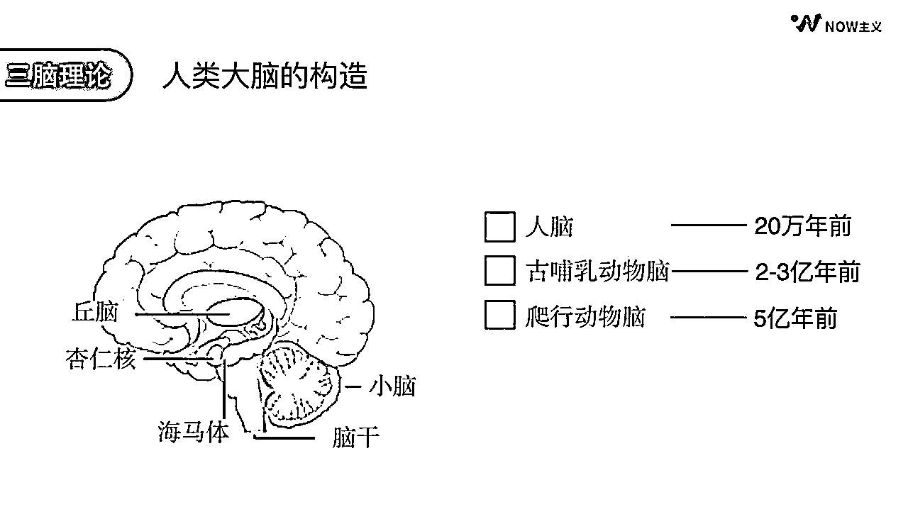

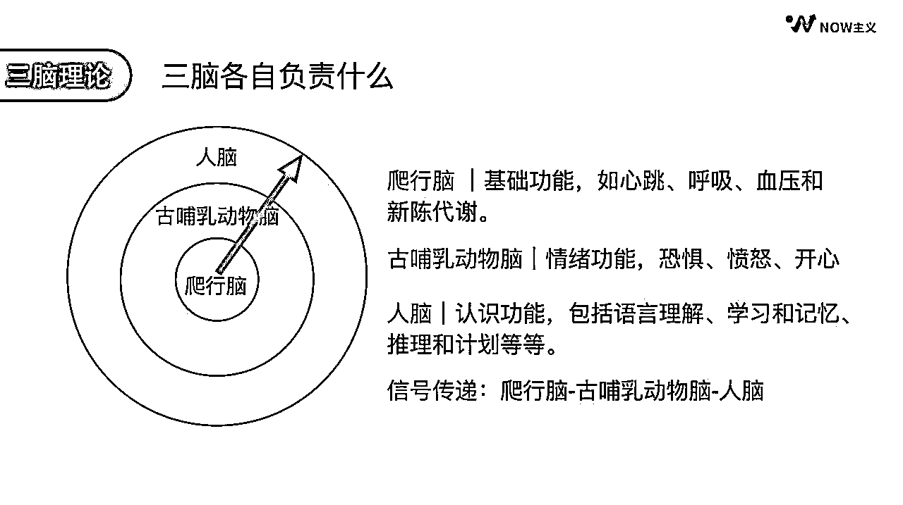

三层大脑分别负责不同的功能。最内侧的爬行脑负责我们身体的基础功能，比如心跳、呼吸、血压和新陈代谢。第二层的哺乳动物脑负责情绪功能，包括恐惧、愤怒、开心。最外层的人脑负责认知功能，包括语言理解、学习和记忆、推理计划等等。

在我们的大脑中，信号的传递方向是从爬行脑到哺乳动物脑，再到人脑。我们将三层大脑的功能简化一下。可以这么看，最内侧的是负责生理基础，第二层负责情绪，第三层负责理性。这样的构造使得我们人类先有情绪，后有认知，而且情绪的作用远比认知的作用大。更重要的是，这是生理结构导致的，所以每个人都是一样的。既然每个人都有情绪，那如何做到情绪更稳定呢？

## 9.2 正念疗法的运用：情绪修炼四步法

普通人应对情绪的方式是很担心自己受情绪困扰，所以有一种防御机制。但是因为情绪永远是先于理性抵达，所以往往会遭遇失败，进一步又衍生出更多的消极情绪。而高手则是先觉察情绪，知道自己当前处于情绪的状态当中，并且接纳这种状态，接下来对情绪进行分析，再进一步的处理解决，并且在这个过程当中持续地进行优化。

这个方法背后的理论依据是心理学当中的正念疗法，它包括有意识、有目的地觉察，专注于当下，也就是当前这一时刻的情况，在觉察和专注当下的过程中，不做价值判断，也不去分辨好坏和对错。具体怎么做，我们来一一展开。

### 9.2.1 第一步：觉知

觉知就是觉察到我自己有情绪了，然后尝试从一个客观的外部视角跟情绪保持一定的距离，来观察和体验自己当下真实的情感。想要做到觉知，我们可以想象自己的意识从身体里慢慢抽离出来，漂浮在上空中，用上帝的视角来观察自己。

### 9.2.2 第二步：接纳

意识到情绪是先于理性产生的，所以此刻的情绪已然诞生，无论好坏，我们都无法消解它。所以我们需要带着一颗不评判的心，不走神，不评价，全然接纳当前的情绪状态。我感觉不是太好，因为这些都是负面情绪，但是它已经发生了。我首先要接纳它，有情绪是一件很正常的事情。

易仁永澄说过，当出现因为自己没有做好而产生负面情绪时，你必须要调整自己的认知：现在面对的情况并不能证明你不行、你很烂、你的未来不够好，请以后不要这样去评价自己。真实的情况是：你拥有一个训练自己「控制注意力」的具体的场景，这是一个道场，是在为你提供训练的最佳机会。

### 9.2.3 第三步：分析

首先分析一下，我们处在何种情绪当中？这里要特别注意，不要笼统地说我很不爽，而要精准地描述下定义贴标签。最常见的 8 种情绪包括恐惧、焦虑、愤怒、愉悦、羞愧、内疚、恶心和兴趣。这个概括相对来讲还比较笼统，我们也可以根据自己的体验，建立自己的情绪列表。

比如我感觉到自己当下的情绪应该是焦虑。触发焦虑的原因是我上午没有按照计划度过。此刻的我就忍不住叹气，也打不起精神。但这可能会引发我继续破罐破摔的冲动。再躺一下午，直接毁掉周末。从短期来看，这个行为很不健康，从长期来看，可能还会影响我对做计划并达成这件事的信心。

这时我们需要看看这个情绪到底是怎么来的。我们可以问问自己，情绪最开始是怎么触发的，是因为什么人，什么事？它给我造成了什么样的身体上的感受和反应？他又可能会引发什么样的冲动，导致什么行为？从短期来看，这对我有帮助吗？从长期来看，对我又有什么影响？

### 9.2.4 第四步：处理

需要注意的是，处理并不等于解决。我们要先判断这种情绪我能有办法消解吗？如果有办法，就行动消解它。如果不能，我们只能选择接纳，并与这种情绪共存。

比如开头举的例子，接下来如何处理呢？虽然上午的时间已经过去了，但是我还有下午和晚上可以重新调整计划。我可以先点一顿健康营养的外卖，下午按照原计划阅读和写作，出去买菜，给自己做一顿丰盛的晚餐。晚餐之后，如果不想跑步了，调整成散步也很不错。

重新调整计划之后，平复心情，开始行动起来。这样，我们就运用情绪修炼四步法，成功地完成了一次情绪的觉知、接纳、分析和处理，并且把自己引导向了积极行动。

当然了，要熟练地运用情绪修炼四步法是需要持续练习的。但好消息是，觉知会随着刻意练习的次数越来越提前。一开始，我们会在情绪涌起，甚至行动已经发生完之后，才觉察到我们的情绪。但慢慢的，我们会在情绪发生的当下就能够立刻察觉，甚至有些情绪管理的高手，他能够在引发情绪的行为产生之前就做好预防准备，这些都是不断精进情绪修炼的成果。

## 9.3 被突发情况干扰如何快速找回状态

讲完修炼情绪四步法，我们来看看一个工作中的常见场景：正在专注地工作时，被突发情况打断，事情中断了不说，情绪也立即变得很差，迟迟找不回状态。

遇到突发情况的解决方案其实很简单，就是把突发的事情跟今天要做的其他事情放在一起，再做一个重新排序。

如果特别重要，就当下立即完成；如果没那么重要，就排进事项清单当中。如果 2 分钟可以做完，就马上把它做了，连清单都不用写。

但是，突发情况更大的影响是，让我们产生了负面情绪，迟迟无法重新回到工作状态中。要想快速找回状态，就要解决一个更深层的问题：如何应对我们的期待和焦虑。

我们期待按照原定的计划完美地完成我们的任务，但突发情况把这一切打乱了，于是我们开始失望，沮丧，乃至焦虑、内耗， 这些情绪进而导致本不富裕的时间雪上加霜， 本就有限的思考带宽进一步收窄。

所以原定的计划被破坏，只是显性问题， 突发情况真正影响的是我们的情绪和状态，或者用一个更加抽象的词汇“ 能量 ”，当我们感受到失控的时候，能量就会降低，进一步导致拖延加剧。

那如何预防这个问题呢？这时候我们就可以用上刚刚学到的情绪修炼四步法：觉察、接纳、分析、处理。

其实这里面最重要的就是第一步，觉察。

但大家在实操的过程中，会发现在突发事情发生的当下，我们忙着处理事情和处理自己的焦虑情绪，是没有办法静下心来走这样一个流程的。

那也没关系，我们可以在事后给自己专门安排一个时间和空间来思考和梳理，一层一层抽丝剥茧地找到影响你情绪的真正问题。

到最后，大家无一例外，都会发现， 这种情绪的根源就是感觉自己很委屈，受到了不公平的对待，比如为什么要突然安排这么多事情给我？为什么要突然发生这么糟心的事？ 这个世界上有这么多人，倒霉的为什么偏偏是我？

再往下挖， 一个更深层次的认知心智浮出水面： 我希望一切按照我想要的样子来。

单独看这样一句话，你会觉得敢这么说的人，一定是得了失心疯。但有意思的是，有大量的人在生活当中，不知不觉地用这样的视角来看待一切的事物。这也就能解释，为什么每天在职场当中都有很多人因为计划被打乱而抓狂。

好消息是如果你被我说中了，那么接下来的三个解决方案，对你会很有帮助。

方法一：解决问题

简而言之，就是用自己的行动来改变当下这种讨厌的情况，解决掉这些麻烦的问题，这是一种狠人常常采用的方法：看不惯我就干掉它。

方法二：改变认知

从根本上理解，随机是世界的一部分，所有的计划，只要有安排，就一定会被打乱，早晚而已。

建立了这样的认知基础，我们就会降低对计划完成度的期待，在突发事情发生的时候，也就不容易产生极强的负面情绪了。

方法三：先解决情绪，再解决问题这个方法对一切人都通用，当你情绪很上头的时候，你是没有办法专注问题本身的，所以你可以找到任何你觉得适合自己的方式，帮助自己先从情绪的问题里走出来。

虽然解决情绪问题，并不能从根本上解决事情造成的结果，但它就像止疼药一样，当下是有效果的， 这就已经足够了。

缓解或发泄情绪的方式，大家各自有各自的选择，在这里就不赘述了。

内容来源：《给人类的自我管理解决方案》

## 9.4 建立自己的积极情绪锦囊

对于情绪管理，除了运用四步法修炼，我们还可以做一件事，那就是建立自己的积极情绪锦囊。具体的做法就是积累一些自己只要做了，就能快速缓解负面情绪、引发积极情绪的事项。比如：晒太阳，打开屋子里所有的灯：充足的光照经常被用来治疗抑郁症。

根据具身认知原理，身体的动作能够改变情绪。你可以尝试对着镜子微笑，喝一杯暖饮，吃最喜欢的水果，洗个热水澡，加一件厚衣服，小睡一会，做 10 分钟运动，收拾一下房子等等。

欣赏一些能让自己愉悦和平静的书籍、影视作品、音乐。

站起来到更开阔的空间，例如室外绿地。

准备一笔情绪专用购物金，郁闷的时候可以放开了买买买。

状态不好的时候复盘，注意这里只写自己做得好的部分，不要写改进。

找支持自己的家人、朋友聊一聊。

看一部悲伤的电影，能够抒发我们的负面情绪。

把我们的所思所想写下来。

美国的哲学家尼布尔说过一段话：愿上帝赐予我平静，去忍受我必须忍受的事；愿上帝赐予我勇气，去改变我可以改变的事；愿上帝赐予我智慧，让我能够分辨两者之间的不同。

其实，我们在对情绪的觉察、接纳、分析和处理的过程，就是我们增长勇气和智慧的过程。这也是为什么情绪稳定是每一个成年人一生的必修课。

## 9.5 【练习】负面情绪处理实战演练

请你回忆自己最近的一次过度负面情绪，分析是陷入了哪种思维误区，并运用情绪修炼四步法进行分析，写出处理方式。

📌

我的负面情绪处理思路：

1、事件：2、思维误区：

3、处理方式：

1）觉知：

2）接纳：3）分析：

4）处理：

给自己的一句话加持：

案例：1、事件：一直拖着没有参加航海打卡，产生负罪感，不好意思出现在群里

2、思维误区：恐怖化-没跟上后果很严重，应该化-我应该完美地完成所有打卡 3、处理方式：

1）觉知：我现在处于过分内疚的负面情绪中

2）接纳：事实确实如此，我只能接纳这种情绪

3）分析：我是因为没有按时参加航海学习和打卡，陷入了应该化思维中，产生了内疚和自责的情绪，又进一步导致我一直拖着不去完成，甚至直接从群里消失。

4）处理：距离大航海结束还有一周多的时间，我可以马上行动起来，先从完成今天的打卡开始。

你也可以在工具包的表格中 - 第四个子表格找到该模板，下载使用：《时间管理 | 实战工具包》

# 十、如何养成时间管理的习惯

💡

你有没有认真思考过：为什么我们明明知道方法有用，甚至已经开始看到成果了，还是会在某一天突然放弃？要解答这个问题，我们就需要了解两种完全不同的思维结构：问题思维和创造思维。而在养成习惯这件事上，我们更需要用创造思维来看待。

创造思维的结构只有两步：

✅第一步，认清现实；

✅第二步，计划愿景。

时间管理本身只是一种手段，去做你想做的事，你会为了实现目标，更好地落地践行时间管理的。即便真的停止了，再重新开始就好了。那么接下来就尝试转换思维，更好地持续进行时间管理吧。

## 10.1 坚持的重要性@车纯纯

当我们参加了 21 天航海实战活动，认认真地跟着节奏做项目，完成了至少 12 次的航海日志，也有了不少的收获，但当 21 天后航海靠岸了，你也许会开始担心，没有了这里的氛围和一起前行的伙伴，自己会不会又渐渐放弃了做时间管理，回到了在拖延和自责中反复循环的日子。这种担心绝不是空穴来风，我们一定都曾经有过这样的经历。其实我们只要把自己从问题思维，转换到创造思维，很多养成习惯的事情就会迎刃而解。

## 10.2 从问题思维转换到创造思维@车纯纯

我们用最常见的减肥来举一个例子：

如果用问题思维减肥，会发生这样的情况：你因为不满意自己的体重而感到焦虑，想减肥，决定开始控制饮食，加强运动，连续 3 天晚上不吃饭。到了第四天，你觉得自己已经瘦了，焦虑情绪缓解了不少，于是停止了饮食管控，又开始大吃大喝。之后又觉得很后悔，第二天继续控制饮食。如此反复，结果减肥但没成功，对自己也是越来越不自信了。

如果换成创造思维减肥，会怎么样呢？：首先，承认自己现在体重是 60 公斤。这是一个事实，没有好坏，我全心全意地接纳它。然后，我心目中的理想体重是 55 公斤。为了达成这个目标，我接下来需要少食多餐，并且每日记录我的体重。因为我非常渴望达成新的目标体重，所以我在饮食和运动的时候都会以实现这个目标为导向，做出选择。

创造思维的结构只有两步：

第一步，认清现实；

第二步，计划愿景。

根据现实和愿景之间的差距来制定计划，持续行动，直到现实和愿景保持一致。除了刚才减肥的例子，我们再举两个加深一下理解：

现实是当前每两个月才看一本书，愿景是想要每周看一本书。计划从现在开始，能够每天读书 1 小时。

现实是经常迟到，愿景是能够提前 10 分钟到公司。计划从今天开始每天早起 30 分钟。

问题思维和创造思维两种不同思维结构，最大的差别是，问题思维是被问题和焦虑所驱动的，充满了对自己的苛责和无力感。而创造思维则是被目标和愿景驱动，充满了对实现目标的信心和渴望。

刚才担心自己 21 天航海结束，接下来能不能持续践行的思维，就是典型的问题思维。在事情还没有发生的时候，就预设了一堆负面的假设，并且对自己毫无信心。

我们换用创造思维来看这个问题应该怎么思考？正好我现在已经入门了时间管理了，也为自己制定了一套适合自己的时间管理方案。接下来我要继续优化自己的时间分配，那就先从再来一个 21 天日复盘开始吧。

怎么样，从问题思维到创造思维方式的转变，是不是突然就不焦虑了，反而对接下来的落地践行充满了信心和期待？

陈海贤老师在《了不起的自己》这本书当中说：人生是一个创造的过程，一个把我们心里钟爱的理念变成现实的过程，而不是解决问题的过程。

当然，这并不意味着我们不需要解决问题，但是解决问题不应该成为行动的动力，我们热爱的想要实现的东西才是。所以，不要担心自己会停止时间管理。时间管理本身只是一种手段，去做你想做的事，你会为了实现目标，更好地落地践行时间管理的。即便真的停止了，再重新开始就好了，因为积累大于连续。其实你一直在成长的道路上，从未停止。

那么，再让我们回到源头上，问一问自己，我们为什么要学习时间管理？

刘擎老师在他的著作《西方现代思想讲义》当中提到，人类痛苦的两大根源分别是死亡和贪欲，因为每个人都面对着在有限的时间里如何应对自己无限欲望的问题。

而学习了时间管理的我们，更能够直面人生有限的事实，主动追逐自己认可的价值。同时，我们也能接纳并理解自己的欲望，倾听自己的内心，找到真正让自己愉悦的事。

既要珍惜时光，也要勇敢地追求梦想。我想，这就是时间管理能够给予我们的最大的启示。

## 10.3 环境倒逼@久树

环境塑造人，环境影响人。

个人的力量是单薄的，群体夹持的力量却能走很远。今天你躺平，我们夹持你前行；明天我躺平，大家夹持我前行。用他律的环境彼此鼓舞，可以行走很慢，但一定要开始行动。

内容来源：《时间管理：悦纳自己，知行合一》

## 10.4 从事件维度去做量化@卓卓子是我🎈

很多人在运用时间管理的时候，记录的都是时间，如果记录时间无法培养出时间管理的习惯，不妨试试从事件维度去量化，从而培养时间管理的习惯

因为人都是有惰性的，特别是在做你不愿意做的事情的时候。自律本身，就是一件反人性的事情。

比如你今天的目标是阅读 1 小时，那磨洋工是度过 1 小时，认认真真也是度过 1 小时，在自律性不够的情况下，可能浑浑噩噩东摸西看，这 1 小时就过去了。

结束以后，打开「块时间」：18:00-19:00 看书 1 小时，纯纯的自我安慰正确的做法是量化你要完成的事情而非时间维度。举个例子，如果我这个月的目标是要读完一本书，我不会计划每天阅读 x 小时，我会规定自己每天阅读 x 页。

比如这本书，总共 200 页，按 30 天计算那平均每天就是看 6 页，但生活总有意外，你不可能每天都能安安心心坐下看书吧？

那就不如每天看 10 页，1 个月当中只要有 20 天能拿出点时间来看书，每次看不少于 10 页，那妥妥就能完成目标。

然后呢？然后挑选一个合适的时间，找一个合适的地点，远离诱惑，安安静静地在自己的空间里完成这 10 页书的阅读，同时记录完成这个动作所需的时间。

一方面，你的目标并没有因为水时间而掺杂水分，另一方面你对自己在一个「天时地利人和」阅读这本书的时间有了一个清晰的认知，那下一次，你就可以很准确地知道，大概要预留多久才能完成你的目标。

内容来源：6 月 8 日 《顺应人性的时间管理方法》@卓卓子是我🎈

# 十一、高效时间管理的案例

💡

上面我们完成了对时间管理的认识和规划学习，也了解了如何解决拖延症，以及如何驾驭情绪。相信你已经开始进行对自己的时间进行更好的管理了。在这一节，我们将向你展示一些圈友的时间管理案例，看看他们作为老板、创业者、宝妈、职场人等，都是怎么规划自己的时间的，以及对时间管理有什么看法。

每个人的生活工作都是不同的，所以案例供大家参考，还是需要大家找到更适合自己的规划方式。如果你有不错的时间管理案例，无论是针对哪个方向的，欢迎你来和大家分享。

## 11.1 小马宋：如何平衡工作和家庭

过去一年，我在公司的时间是很长的，尤其是晚上经常加班到 10 点以后，回家孩子都睡了。后来我决定不再在公司加班（除非是直播等必须在公司完成的工作），把加班内容带回家里去做。周末也在家里工作，顺带参与孩子的学习和成长。

我太太问我在家加班效率如何？我说还行，虽然没有在公司效率高，但我觉得在家加班的总价值最高。因为既有对家人的陪伴，又可以跟孩子互动和交流。

因为一个人要干很多事，并不需要很多时间，对我来说，我觉得一天认真工作 4 小时是足够干所有的事了。

我睡觉时间 7 - 8 个小时，如果算上起床、洗漱和做饭、早餐（一般我在家，会给孩子做早餐），那一定是有 9 小时的。不过我在卫生间里能做一件事，就是把当天的英语学习任务完成，大概阅读 1000 字的英文新闻原文，做早餐的时间，我还有 30 分钟可以听音频课程。

出门上班，就只剩下 15 个小时了，我骑共享单车通勤，来回 14 公里，骑行加步行时间来回 90 分钟，一天剩下 13 小时 30 分钟。骑车上下班我可以听得到或者播客，这算是学习时间。如果不听课，那就是边骑行边思考工作问题，这个时间有 1 小时算是工作时间。

午餐时间 1 小时左右，加午间休息时间，又占去 1.5 小时，剩 12 小时；打游戏给自己设定了时间上限，一天 45 分钟，剩 11 小时 15 分钟；给自己留 30 分钟左右刷社交媒体的时间，剩余 10 小时 45 分钟。一天中还有各种日常小事，比如上厕所、做俯卧撑、跟同事聊天，日均要花掉 1 小时左右，现在剩余 9 小时 45 分钟。

回复微信等，还会花掉我 1 小时左右，现在就只有 8 小时 45 分钟用于正式工作。当然你也知道，人不可能在工作中完全投入，即使我每天加班到晚 10 点，我真正有效工作时间也不会超过 6 小时。但就这 6 小时，其实是非常高效的工作时间了。

我关掉了所有消息通知，除了电话和微信语音通话的提醒。我也不刷朋友圈，只要每一两个小时看一次微信就可以了。我们的问题不在于时间管理技巧，而在于我们的意愿，我们每天有很多想做的事，对大部分人来说，工作是我们最不喜欢做的事罢了。

内容来源：《分享我个人上周的决定和时间管理的问题》

## 11.2 Lissa Tam：亚马逊创业者的时间管理

当亚马逊跑通后，我的流程基本上是：选品、拿样、确定产品方案、采购、拍摄、修图、剪视频、运营、补货。

大约是 2-3 周一个循环，偶尔遇到选品瓶颈期，则往后顺延。可以给大家看一下 21 年刚创业的时候做的进度甘特图。

选品是最让我觉得 “好像每天都没有产出、无所事事” 的一个环节，这部分就是以 “选出来一个产品” 为里程碑。

因为周期着实有些长，这让我感受不到什么反馈。

后来我就尽可能把量化颗粒度做细一点，比如说一天要海选出 XX 个产品、一周做 X 个产品方案、一个月确定 X 个可量产的产品方案。

除了工作流程外，重要还有数据分析和汇总。通过三方工具进行数据整理，自己再用 Excel 做个数据分析看板，用来追踪各个节点达成率。推新品也会有专门的推新记录表格。记录每日的销售数据、关键词排名、产品数据、流量转化率、新品日志等等，便于后续的复盘，以及推新策略的可复制。

大部分的时间，我都花在选品上，预估是占 65% 。产品花的心思比较多，在运营这一块，时间花费相对就少一些。在运营端，我目前只做效率最高、ROI 最漂亮的事情：投广告。像 post 这些，之前招了人我是全部给运营在做的。这个对于我而言，是需要花时间、ROI 还不错的事情，但我没有那么多时间和精力去做，遂排名靠后，时间不够我就不做。

新品我会每天都盯着，老品则时间节奏拉得比较长。新品每天看排名、看销量、看广告数据，进行调整；老品一般一周看一次，统一进行调整。然后再一周统计一次销售数据，对齐销售目标。

看起来很多很琐碎的事情，拆分到天，其实也没有那么忙。比方说最近一段时间，我会睡到 8 点起床，在星巴克从 9 点呆到 12 点，回办公室从 1 点呆到晚上 10 点。推进了上个月的两个要开模的产品，同时毙掉了上个月和这个月选出的品，目前正在为这个月的产品 KPI 发愁。

至于每天做的事儿，我偶尔在事情多的时候，会用印象笔记记录下来我要干的事儿，然后对照着做（实际上大部分我都没办法当天完成）。更多的时候，我则按心情做事儿。

我是个拥有人类缺点“拖延”、“懒散”、“情绪化”的人，我没有办法 100% 克服，而正因如此，这才塑造了我的样子。我属于“时间管理能力其实挺菜”，但我用“加班来凑”的人……

自由职业者贵在自律。自律使人自由，诚不欺我。

在我的时间管理方法里，我个人的理念是：时间管理旨在提高单位时间利用率，而不是时间总长度的花费。

我更倾向于“结果导向”+“聚焦”，这也会结合到精力管理。只有精力管理好了，时间利用率和效率才会变高。

这个方法也是在生财学到的，来自易仁永澄老师的时间管理 https://t.zsxq.com/03MrB2Zb6 和 CC 老师的精力管理 https://t.zsxq.com/03ZrfiybY。

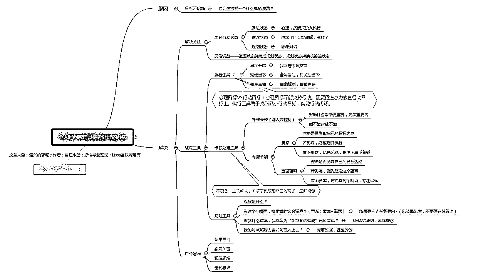

然后我会再用飞书，每个月初，我会制作好当月 OKR / KPI ，然后再分拆为多个小计划，进行达成。

飞书的模板功能太好了好嘛！强烈建议大家都用上！同款链接：《项目管理模板》

作为创业者来说，时间维度是需要拉长来看的，至少得半年往上。创业是个长期的事儿，很多时候往往放弃，是源于坚持不下去了，而非破产倒闭。

如果时间放长到周、乃至月，那么我一般是这样安排的：按照亚马逊项目流程进行工作，一般是平均工作 60 小时 / 周

每周会文字复盘一次，2000 字的文章，时间花费在 1 - 2 个小时；6000 字及以上的文章，时间花费在 8 个小时

每周至少锻炼 2 次，一般是跑步 / 刘畊宏 / 健身房 / 羽毛球，一般是平均 3 小时 / 周每周休息一天，大部分时间追剧、看书，偶尔画油画；每 2 周 / 月会自嗨一次，一般是花一个小时愉快地唱歌

每月 / 2 个月偶尔出去玩一次，一般是海边 / 爬山每周喝 2 杯奶茶，一般是为了缓解焦虑（乱入）

生活是看起来似乎平淡又枯燥，但也正常地运转着。要是说我有什么遗憾，我觉得最大的在于：我没有充分利用好自由职业者的“自由”——空间自由和时间自由。随时随地的办公，去任何想去的地方旅行，做自己想做的事情。

内容来源：《Lissa 林氧氧裸辞创业的复盘--我是如何度过亚马逊创业这一年（经历/营收/时间管理/日常）》

## 11.3 杨涛：怎样改变混乱的生活作息呢？

改变作息最好的方式就是「睡眠，饮食，运动」，大道至简，任何花哨的套路都是基于这三点演化出来的，然后试图通过操作来增强一些信心罢了。生理上难入睡是存在的，「睡意稍纵即逝」的那种微妙的体感，不知道和在座有没有共鸣，建议：1。 什么睡前泡脚，红酒，牛奶啥的，都没啥用，褪黑素是真有用（建议选贵的）；2\. 床上用品要舍得花钱，床陪伴了我们三分之一的生命，其实很多人可能根本没花几个钱，选最棒的床垫，最好的四件套，这是提升幸福感的最佳投资；3\. 你需要一个超棒的枕头，这为什么单独说呢，因为这个太难了，而且因人而异，我今年换了五个枕头了，邓禄普，睡眠博士，慕思，然后出差睡酒店都买了两次枕头，暂时没有非常好的推荐，但是深信，枕头就是枕脖子；4\. 深蓝 / 紫色床单，完全不透光的窗帘，对深度睡眠挺有好处的。

心理上的难睡，我是建议你多想想：1。 想通晚睡是一种错觉，貌似时间多出来的错觉，其实，每天睡眠时长基本是一样的，你 10 点睡，5 点起来，和 2 点睡，9 点起来，时长是一样的，哪怕你玩游戏，我也不管你，但事实上，早上起来玩游戏，有一种莫名的成就感；2\. 任何电子产品不带进卧室，前两天会非常难受，第三天开始就会感觉很好，这时候记得，别破戒，破戒太痛了；3\. 你回忆一下，我们是不是第二天有重要事情，都能早睡早起，如果是，那为什么不好好活着？

4\. 冥想可以尝试，亲测有效。最后分享几个老司机的小偏方：偏方 1：调整生物钟最好的方式是，瞅着睡不着都扛着快天亮了，就别睡了，洗洗，吃顿元气满满的早餐，然后正常工作，中午有困意也扛住，然后晚上回家，早早洗洗睡，第二天早上定个六点的闹钟；偏方 2：转一万块给你的伴侣，每次早上让她喊你起来，然后你去洗漱完成，就会拿到一千块的奖金，如果当天没起来，钱就没了，如果她当天没喊你，她就扣一千块，双重幸福感；偏方 3：饮食方面，坚持 7 点吃早餐，晚上一定睡得好；偏方 4：95% 的人一天连一分钟的刻意运动都做不到，你想成为那最优秀的 5% 么？偏方 5：糖一定能少就少，人的一生只能吃 800 公斤糖，谁先吃完谁先走。

内容来源：《怎样改变现在这种混乱的生活作息呢？》

## 11.4 杨涛：赚钱路上如何做好时间管理？

赚钱路上的时间管理，具体的任务清单是“番茄钟”、“四象限法”都是工具。大家都听过我讲过什么的各种各样的图形，番茄钟，跟 to do list ，还有这个四象限都讲过。

那最重要的理念是：

我们我有一句名言：如果你是三分钟热度，那么我们就在三分钟之内结束战斗。听进去。各位。如果你做事只有三分钟热度，那么我们就想办法在三分钟之内拿到结果。明白吗？你要找那种非常快拿到正反馈的，你自己知道你自己不行，所以就要快速的拿到正反馈。

记住一句话，天性难移，很难改变自己的性格。那要怎么改变呢？只能通过不断地去刺激大脑。怎么刺激大脑？你就算学一个很强项的技能，很难学的技能，很长线的技能，你也要在短时间内拿到结果。你在短时间拿到结果，你就会被刺激，你就会获得满足，你的灰质层就会分泌多巴胺和内啡肽。然后你就会很爽，很爽的话你就会促进下一次学习。我们就要快速地拿到结果。因为成功它是一个像滚雪球一样有惯性的，一次的小高潮，会迎来一次非常巨大的高潮。然后你就会非常的爽。

2\. 减少赚钱时间，留出增值时间。你接下来想到赚钱的钱数，靠现有业务、现有能力惯性推进能不能达到？如果不能，就要规划出时间，备战另一种可能性。这个讲得非常的对。

这里有一个悖论是什么呢？很多人他会用战术上的勤奋掩盖战略上的无能。什么意思呢？就是他会每天把自己的意志力耗尽，就是他在干一个事情，他会让自己很累很累。但是他没有勇气去腾出时间放空自己。然后去干嘛呢？去规划、去总结、去调整。

为什么呢？改变总是反人性的。为什么呢？改变他不一定会变得更好，但是你不改变一定是维持现状的。如果对现状不满，那么一定要改变。这么一个简单的文字推导，所以说留出增值时间，就是留出时间，在战略上，在方向上去进行，在方向上努力。

有一句话叫：如果方向错了，那么停下来就是前进。这句话我非常的喜欢，但是很多人他不愿意。为什么呢？他学一个东西，干一件事情，干了很久，他有什么呢？他有沉没成本，明白吗？这个我已经学了那么久，明明我学得很难，很吃力很费劲，对不对？如果方向错了，停下来就是前进。

80% 的时间做决定成败的事。赚钱路上要学会取舍，在无关紧要的事情上追求完美，特别耽误赚钱。这里我非常的有发言权，你想，我们讲：

卷福说过一个一句话：叫 stop to find some easy way out ，我们不能去找捷径，因为捷径一定是错的。

一个值得做的事情一定是什么？难而正确的事情。难而正确的事情，明白吗？这个要理解一下。如果你觉得一个事情它有捷径可以走，那么这件事情一定不长久。这个是结论。知道吗？这个是结论。

然后所谓的这个取舍，在无关紧要的事情上追求完美。这个是什么呢？这个是叫钻牛角尖。

这里有两句话送给大家：很多事情没有深究的意义，很多事情没有怀疑的价值。

我不是针对谁。在座的各位肯定有发生过这种情况：刚刚跟别人吵架，吵完架回家，突然间感觉刚才没发挥好，然后整个人非常的消耗。

在群里面跟别人对喷，然后喷完了没事了，然后过一会想起来。刚才没发挥好，这就钻牛角尖。

还有突然间想到一个念头，然后过一会就忘了，是不是？过一会儿就忘了，知道吗？过一会忘了，然后一直想不起来，一直就想不起来。这就是什么钻牛角尖。

我刚才讲的这个吵架没发挥好的这个事，你们肯定有那种代入感，对不对？就是这样，就是轻重缓急四个字，一定要品。轻重缓急。你如果一直自己一直不想去做那些难而正确的事情，那就是你不肯去挑战你的人性，挑战你的人性的弱点。

内容来源：《听涛说—2022 生财日历共读精华（下） 》

## 11.5 港妈金侣：宝妈如何进行多份副业？

妈妈们的时间和精力是非常有限，把不同的副业分享到不同时间段去做，我的几个对策是：

1） 自由支配的时间我早上的工作效率很低，但是晚上相对安静的环境呢，我就可以比较高效的工作。自由支配时间，就是要利用我精力最充沛的时候去做一些更高效的工作。

2.） 利用碎片化的时间比如说我会在做饭的时候去听课，也会在平时在路上坐车的时候呢，去做一些不需要集中注意才能做的副业，比如在社群里推荐产品。

可以思考一下，哪些副业需要整块时间（自媒体写作），哪些副业可以用碎片的时间（社群卖货），哪些副业可以同步一起做（我常常会同步几个群一起开会，哈哈哈）。

3） 工作的优先级排序

虽然我是有非常多的副业的，但是不同副业的轻重缓急都是不同的，要根据自己的节奏去有效地安排。同时也可以根据自己的时间去放弃一些花时间特别多的这种副业。比如去年，我做了非常多的短期课程训练营，但是今年我基本上都没有在做，把时间放到更能产生复利效果的。

4） 能量管理比时间管理更重要很多宝妈是有时间的，但是却提不起能量做任何事，要学适当的能量管理。在自己精力充沛的时间段，实现高效的工作，这也是节约时间的一个秘籍。

内容来源：《无专业，无定位，无爱好的全职妈妈，20 个月，变现 170 万+的经历分享》

## 11.6 运营女超人子渝：职场博主如何做好工作、家庭和副业的时间分配？

我日常工作非常忙，家庭也需要照顾。做博主副业的时间是白天零碎化的时间 + 晚上下班后 9 - 12 点的时间组成。平时白天我会抽午休、甚至上厕所的时间，看一些最新的内容找找灵感，并记录下来。

下班时间我会整理灵感成为内容，周末录制。我还参加了 2 个学习班来丰富自己，希望增加内容的表现力。我会用周未等孩子上补习班或者收拾房间的时候来学习。确实是比较紧张忙碌的状态。

我管理时间基本都是用 SOP 流程化思维，以及花钱外包一些基础工作。

流程化，就节省了很多重新计划、安排的时间，是提高效率的好手。

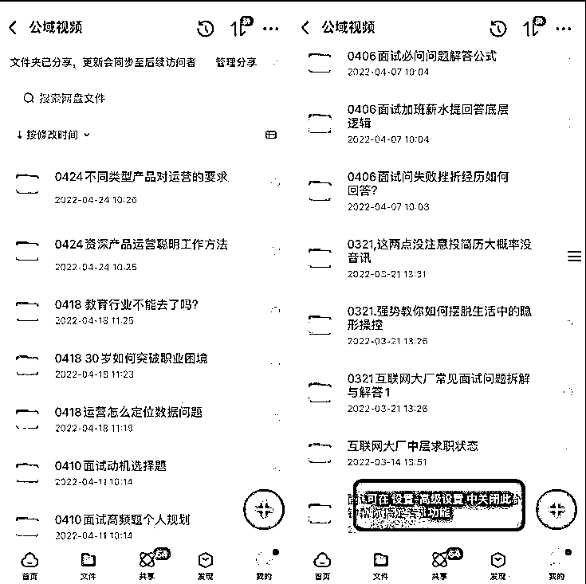

小钱节省时间

很多时候忙，是因为各种零碎的事情太多，而这些事情其实是可以外包出去的，把自己的时间更多留在核心的事情上。最近我找了小助手帮我剪辑视频和做图文，我只要专注于内容生产即可。虽然会然收入有所减少，但我认为有效的分工的方式能让我更好的坚持，并能专注于内容和视频表现的精进，:我觉得这是增强自已核心能力的部分。

内容来源：《中年宝妈“996”下班后当职场博主 聊聊我小红书从 0-1 到变现的过程》

## 11.7 T_T：总加班的 IT 职场人如何做时间管理

有很多小伙伴可能会有这样的问题：加班很多，休息、留白时间、反思时间被挤压，IT 行业应该更严重，这种情况如何破解？

我的思路是从导致你增加加班时间的原因来入手分析。

因为不同的原因的解决方案是不一样的，举个例子，给大家一点参考。重要的是大家要有分析原因的意识和能力。

如果你是一个执行者，领导的安排分配是否合理，是否需要申请更多的资源，给我分配的内容是否是我陌生的领域？

记住会哭的孩子有奶吃，如果确实是如上原因，和领导沟通，拿出实际论据，领导一定是会协调资源帮忙顺利完成事项的。因为这是他的本职工作，而且领导也希望你跟他提前反馈、获取他的帮助。这样他才能可控。

如果是因为你个人时间被碎片化占有，有一些可参加、可不参加的会议、可做可不做的事情，可以学会适当的拒绝，如果因为你白天无效浪费时间太多，那我觉得我们时间管理的实践恰恰是帮助我们解决这些问题。

如果是我们个人能力或个人经验的话，这个还需要我们靠加班来快速弥补欠缺的知识。当然这里又涉及到高效学习方法的范畴了。

另外基于一些项目管理的经验引申，如果做大型项目就知道了，很多情况下因为突发问题、潜在风险、未识别的依赖、外部资源等都影响我们的项目的进度，让我们不得不通过加班时间去解决这些问题。

因为我们项目没法按照既定的计划实施，浪费了很多前置的时间，所以准确的计划评估制定，细到背景、痛点、人员数量、人员经验、时间、事项具体范围、工具、依赖、风险、风险规避措施等，所有项能做到心中有数，才能计划可控，然后后续的要做的是要严格按照计划执行。

一般项目结束后都要进行复盘总结，把本次踩过的坑作为下一次的经验。后续在项目管理中会更加顺畅，这样 A 类事件推迟导致的加班时间就少了。

另外作为 IT 从业人员，特别建议大家看看工作中有哪些可以自动化替代的重复性工作等等。借助一些提升效率的工具，例如给大家安利一款截图工具 Snipaste，信息记录工具 ediary。

总的来说，导致加班的问题可能涉及目标、计划制定、执行情况、个人精力、习惯、回顾等多个方面。我们需要按照 PDCA。P-Plan 计划 D-DO 执行 C-Check 检查 A-Act 修正循环实践，成功的经验要经过总结、输出、肯定、标准化，未解决的问题进入下一个 PDCA 环，一旦这些成为一种能力和习惯的话。你会发现越来越轻松的。

内容来源：《高能要事：如何通过时间分类来提高时间管理效率》

## 11.8 一块木头：如何在不同的环境下，用时间计划表保持自律

我先说个最近亲身经历的例子。

我有一段时间工作繁忙，却正好家里有要事处理，那我就只能带着工作回老家呆几天。

从工作的角度看，这也就相当于我脱离了原本那熟悉而有制度约束的工作环境，从而进入了我人性最喜欢的舒适环境里（原因是自己的窝是最有安全感最舒服的，时刻想着摆烂）。

那按照我以往的行为习惯，只要我离开熟悉的上班环境，一回到日常生活都可以被家人照顾得非常到位的舒适环境时，我就一定会变成干活做事懈怠懒散、处理工作效率骤降的状态。

不过这次，在我学习了时间管理后，这一切真的都不同了，因为我即使回家了我也保持着【开启整点闹钟提醒】和【记录时间】的习惯，以此来【及时地回顾自己每小时的状态】从而做到【动态调整自身】。

这个技能真的非常有效地帮助我把我在家的每小时都运用得恰到好处，做到吃喝玩乐毫无心理负担，且我的工作是一点也不落下，甚至还能超预期交付。而能做到这样是因为我的基础时间/蓄能时间/创造时间都被我通过回顾复盘后对它们做出了及时调整，规划出了最合适自身状态的时间安排。

处于不同日常生活环境的时候，运用时间管理法最让我感觉酸爽的是，当我会顺着我的人性去偷懒去快乐时，好巧不巧的，我的整点闹钟就总会响起它革命的号角！

而每次铃声响起，真的是即刻就把我从那被欲望所控制的状态里一下就拉回到反人性的理性世界中，所以这技能运用在不同日常生活环境时，我只能说是屡试不爽！

特别是每次我坚定地扼杀了人性欲望，且按我原定计划表的任务，做到了令自己满意的成果后，都能深刻感知到那一刻身心的极度舒适感，对我人格的自信也在 +1+1+1 地叠加！说到做到的那一刻也真正地感觉到自己的所做所为对得起时间。

所以，从这个案例来说，我是觉得如果初步入门了时间管理法后，想要更深入地去实践的话，真的可以让自己多处于不同的环境下去训练这项技能。

在不同环境下运用，会比一直处于正常规律中去运用时间管理法更快速地拿到有效的成长反馈。

我再具体说一下这个过程中我是怎么做到管理时间的。

方法一【时间三分法】：按照车纯老师的时间三分法，在不同环境下，我会以工作为中心去提前规划出来较合适的时间，之后再按照实际去动态调整最合适的时间。

以我最近在杭州出差学习而调整规划的时间表为例：

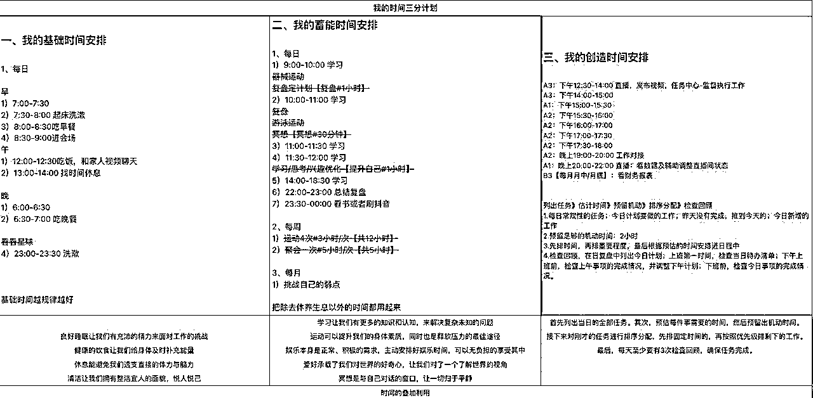

方法二【疯狂闹钟】：它整点响起的时候，就是提醒我要去回顾过去的一个小时里我究竟干了啥事情是有价值的或者是浪费时间的。同时，我会再去看一下计划表在该时段需要做的事情是什么，看看时间安排上我当下的行为是否跟既定目标产生偏差。

一旦意识到出现偏差就要督促自己即刻修正行为并回到原定目标轨道上。如果说还没有完成任务，但已经过了原本设定的任务时间段，那就把未完成的任务给调整到其他的时间块上去。

方法三【时间块】：回顾完过去那一个小时发生的行为，并在时间块记录下来。这样就可以通过记录的内容去复盘总结，再去做到及时调整自己的行为。基本目标不变的情况下，看看哪部分的时间是可以做到动态调整的。

如何调整：

1.

到计划表去看剩余时间里的任务安排；

2.

从基础时间/蓄能时间/创造时间的维度去看已规划的任务是否合适当前的状态；

3.

有不合适的就即时修改计划，以做到实时调整计划来让自己能完成一天的计划，同时也能起到一定的复盘作用。

方法四【学会拒绝】：拒绝那些可能阻碍你完成目标的诱惑，如果你是一个懂得拒绝的人，那在时间管理这个能力上已经超越很多人，算是进阶的选手了。

方法五：把时间块和滴答清单这两个 app 都放在手机屏幕最显眼的位置，这样可以减少忘记使用它们的概率。

根据我本人的经历，我觉得训练这项能力的过程中有两个需要注意的点。

① 当所处环境不是平时所熟悉的工作环境时，在创造时间这部分的安排上，一定要把机动时间预留的足够多。

比如，平时的创造时间里的机动时间规划是 2 小时，那在不规律的生活环境下去规划的话，最好是把机动时间扩展到原本的两倍甚至三倍，但会牺牲基础时间和蓄能时间，不过可以确保工作顺利完成，不形成堆积状态。

因为当我们脱离了规律的工作环境后，是最容易被各种未知因素影响自身行为的，这些未知因素会致使专注力被大大降低，甚至有时出现手头的事情被直接打断的状况。所以我觉得比较客观的规避方式，就是在「创造时间」部分预留足够的「机动时间」给它，也就相当于把本来集中的创造时间打散了。

② 这个技能在未养成习惯前会经常性忘记去记录时间，如果你也会如此的话，我想跟你说这是初期的正常反应，督促自己别因此产生懈怠情绪。

我发现我在初期的时间管理过程中忘记记录是经常性的事情，而忘记记录会致使连锁的反应发生。

比如，没有记录就没办法深度复盘总结，这样就无法及时调整自身，久而久之看不到时间管理的成效就会懒散，周而复始就会出现懈怠心理。

我想提醒的是，哪怕暂时做不到时间管理也请告诉自己不要有懈怠心理。你尽力做到最好就行。只要你做了，那在这件事情上你已经开始积累了。

想被时间认可，是需要有恒心的。而时间管理这个技能工具，你每一次的认真运用，在你往后成长的每一步里都算数。就算某一段时间你会忘记使用它，但它其实也存在着。只要它存在着，那你在未来的某一刻你就一定会记起它。

那当你记起它的那一刻，我想提醒你的就是：别犹豫，马上开始回顾过去一小时的自己，然后去你记录的地方把过去一小时你做了什么给记录起来。

想预防自己又忘记的话也可以马上开启疯狂闹钟，整点提醒自己。一点点做到循环渐进。通过这样一次又一次的积累，我就不信在不久的未来你成为不了一个时间管理达人。

当然，你本身从学习这技能开始就能做到一直不忘记记录的话那就最好不过啦！恭喜你成为时间管理达人指日可待了！

最后，我想说我运用这个技能到现在，我最直接的感受就是：在不同环境下运用它，都会让我的时间在自己的管理下变得更具价值。

从基础时间，到蓄能时间，再到创造时间，这是一个正向的时间规划，因为人是需要休息和赋能，才可以有精力和实力去创造价值。

同样，创造价值后也会反馈正能量给到赋能和休息，形成正向回路。

内容来源：6 月 1 日《如何在不同的环境下，用时间计划表保持自律》@一块木头

## 11.9 卓卓子是我🎈：弹性上下班的职场人如何做好主业的同时提升自己

弹性上下班的职场人如何做好主业的同时提升自己呢？

我的方法是利用好碎片化时间，每天比别人多 2 小时由于工作性质，我是弹性上下班时间，上班晚下班也晚，因此也不存在什么早起时间（主要也是我懒）。

这也就是为什么我每天的可利用时间不多，因为我不乐意早睡也不乐意早起，只想在我现有的时间作息里，希望能多干点什么。

所以我就把目光瞄到了日常里的碎片时间上。

上下班通勤的时间，加上等地铁总共有 1 个小时，这一个小时，我可能会看书，可能会听播客，可能会刷生财有术的精华帖。

总之一般不会闲着，也不会打瞌睡。

上班 8 小时，总有那么点摸鱼走神的时间，毕竟每个人的持续专注力是有限的…通常这个时候，我就会站起来，在办公室做做 15-20 分钟的拉伸。

扭扭腰，走动走动，上下左右活动一下颈椎…今日份的碎片化健身时间，就完成了。

午休的一个半小时，一边吃饭我会一边看看我喜欢的综艺或是追剧，吃完饭剧也看得差不多了，预留半小时的时间午睡。

这期间娱乐的目的也达到了，晚上也不会额外想要心心念念看点什么，最后一刷就是几小时浪费一整晚。取而代之的，我可能就会上网课、看感兴趣的书、或者做自己项目相关的事情，不贪多，某个时期针对这个阶段对我来说最重要的事情择一即可。

这种成片无人打扰的时间，对我来讲弥足珍贵。

那以上只是我自己的生活经验和时间安排，大家可以看看自己每天有哪些不得不进行的碎片化时间，在这些碎片化时间里加入其他要做的事情。

这样无形中，你原本要做的事情就在这些碎片化时间里被消化掉了。

多余出来的时间，想干什么都是自己的，哪怕你要说在这些碎片化时间处理工作，腾出更多时间摸鱼，有何不可呢？

不要高估自己的自律性，进雷区之前先排雷

航海期间，我看到有的小伙伴说，做事没有定性，本来打算看航海手册，结果忍不住刷了一下淘宝，看了一下别的资料，结果衣服也没有买成，航海手册也没看多少。

通常这种情况下，我不会给你说什么建立目标感、信念感，培养专注力、意志力的建议，说实话，大家都是普通人，不要用「超人」「精英」的标准来要求自己。

最好用且最简单的方法，就是给自己营造一个良好的环境，比如：不要在卧室工作；

不要用手机查资料；

不要在工作设备装娱乐软件

……

这些道理简单粗暴，但是非常好用。

在希腊神话中，有一种人面鱼身的海妖，长得美若天仙并且拥有天籁迷人的歌喉，她们住在海岛用歌声魅惑航海者，使他们行为失控，船只触礁沉没，最终成为她们的腹中餐。

在荷马史诗中，奥德修斯获得了神明的忠告，预先做好了预防措施：命令船员在经过海岛前把自己绑在桅杆上，并告诫他们在行驶经过海岛期间，无论自己有怎样的举动，都不可以为他松绑，同时要求船员们用石蜡堵住耳朵直至完全驶离海岛。

在经过海岛时，奥德修斯果然听到了迷人的歌声，他不顾一切想要挣脱绳子，大吼大叫，但船员无一人理会。船只不断前进，直到离开了海岛才解开了奥德修斯的绳子。

而奥德修斯，也在安全的情况下，欣赏到了海妖天籁般的歌声。

舒适的卧室环境、拿在手里的手机、同事嘈杂谈论的八卦…这些都是我们在做事过程中免不了会遇到的诱惑。

不要妄图考验自己，在本该专注完成目标事件的过程中，既要专注在事情上，又要专注在用意志力对抗上。

做事的时候，手机调成静音或者专注模式或者干脆放在另一个远离自己的位置，用 ipad 或者电脑来学习，不装视频软件或是游戏。

大部分时候，我们都是主动分心，所以应减少环境中的刺激源。如果真的走神了，停止走神，放空自己，站起来活动活动筋骨、伸伸懒腰都可以，宁可放空也不要被思绪牵着走，然后再重新坐下来让专注力一点点重新聚焦回原本的事情。

内容来源：6 月 8 日 《顺应人性的时间管理方法》@卓卓子是我🎈

