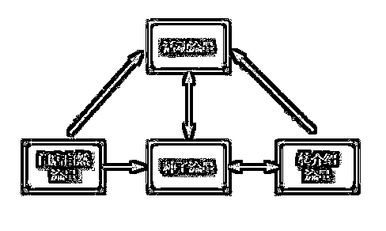
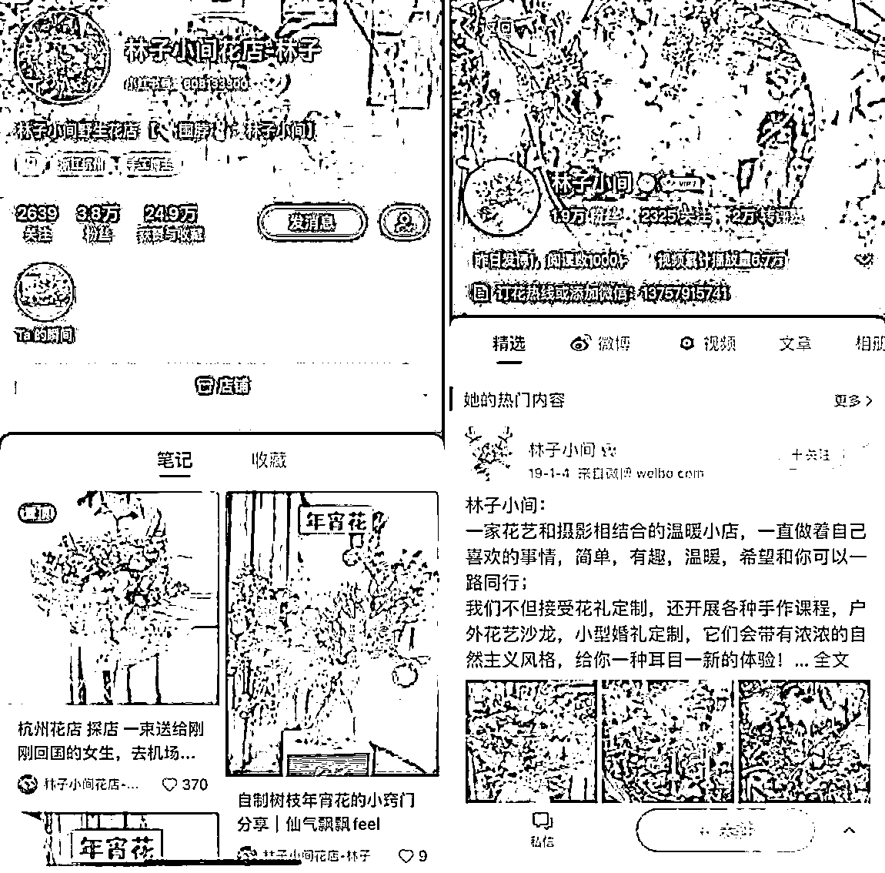
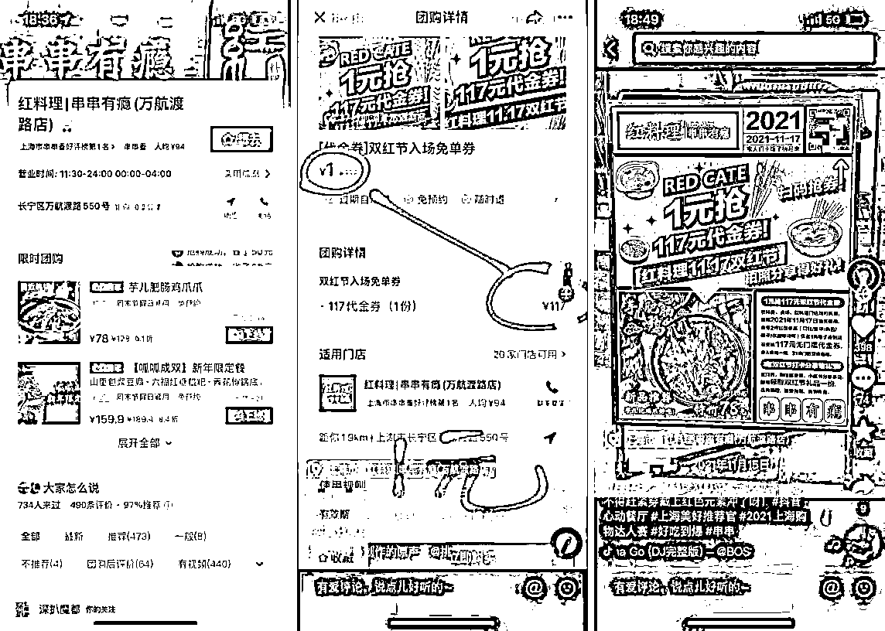
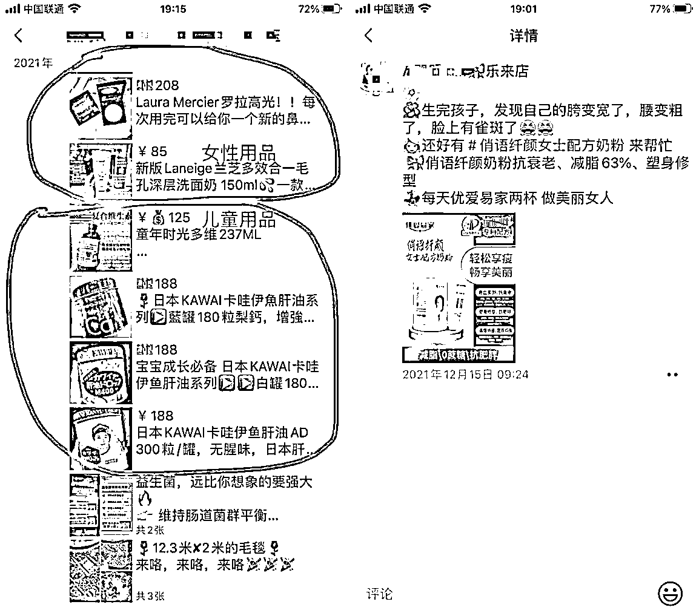
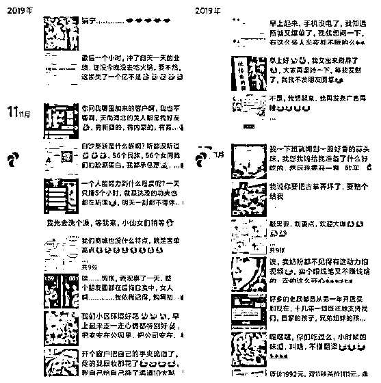
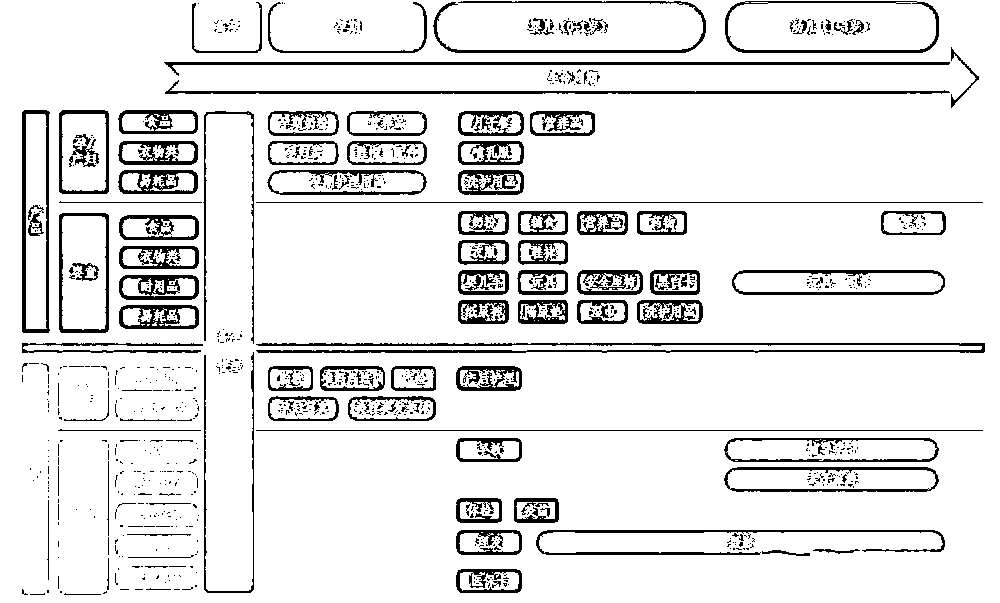

# (精华帖)(109 赞)搭建自己的私域流量池，从人货场分析冲出重围的线下店铺

作者：  佳佳

日期：2022-01-27

大家好，我是佳佳，曾在母婴及大健康行业工作过，培训(主要是产品培训)及访问过上百家实体门店，主要实体店位于江浙沪、四川、河南、山东、海南...等地，曾经协助过上海母婴门店举办周年庆活动平均单店日营收 30 多万元，多个合作代理商年销售额突破上亿元。

 

 

目录

**1. **实体行业背景介绍

**2. **线上运营：流量怎么来？线上流量如何变现？

**3. **线下运营：人、货、场

**4. **其它收益：延伸服务、知识付费、招商加盟

很多人唱衰实体行业，包括开实体店的老板自己可能也不看好，今天收到鱼丸的约稿邀请，我想和大家分享一下我所看到的实体店都有哪些玩法破圈，我将以多个线下店铺为例，从线上线下两个为大家分享这个话题。线上运营主要内容是，如何在线上多平台获得流量，并搭建起自己的私域流量池；而线下运营则会从人、货、场三方面分析目前冲出重围的线下店铺，它们都有可以借鉴学习的点。

**—01—**

实体行业背景** **

**1**、实体店目前的发展情况

自从淘宝、拼多多等电商平台出现以来，大量线下中小实体店的生意变得越来越难做。

 

 

尤其近两年来，疫情突发，对线下实体行业的冲击就更大了，许多地方出现了关店潮。

比如，近期爆出沃尔玛中国今年已关闭 31 家大卖场；海底捞宣布今年关闭 300 家左右门店，大概相当于门店总数的 20%，等等关店新闻。

大家似乎都对线下实体店唱衰，其次产品同质化、获客成本提升、营销效果下降等种种原因，也让「行业内卷」成为商家共识。不过反过来想，行业内卷其实也并不是一种「唱衰」的论调，任何行业的发展都是螺旋式上升的过程。

众所周知，线上店铺如果做得好，一个网上商店服务全国，效率更高，但是现在线上的竞争反而更加激烈，获客引流的成本也越来越高。

相对以前，现在线下实体店又一次涌现出许多新的机遇，不过经营模式需要完成由传统向创新的大转变，才能真正拥抱新的消费模式下的核心用户群体。比如伴随着市场需求的多元化发展，亦是让不少新锐的品牌和实体门店抓住机遇，破局出圈。

所以，今天想要和大家聊的是：实体店如何实现线上线下多渠道引流变现？

**2**、开家实体店需要投资多少钱？****

开实体店主要有三种方式：直营、加盟和代理，无论哪种方式加入，都希望大家根据自己的资金、能力、市场情况来慎重选择，毕竟创业有风险，入行需谨慎。

因为我之前在母婴行业工作过，对母婴店比较熟悉，下面就以母婴店为例，分享一下开一家母婴店到底需要投资多少钱？

 

 

**1. **租金：不同的城市，经济水平不一样，不同大小的经营面积，它所需要的房租租金也是不一样的。一般来说，一间 60-100㎡  左右的店铺，它的租金每月大概在 5000-20000 元不等。关于租金问题，店主可根据自身条件选择。

**2. **装修：母婴店的装修不需要太豪华，主要能突出温馨、舒适的亲子主题就可以。根据母婴店的经营面积不同，60-100㎡  的经营面积，装修费用大概要 3-5 万元。如果再加上一些儿童玩具、婴儿洗澡等设备的话，建议店面面积在 100㎡  以上。

**3. **加盟费用：不同品牌的母婴店，它所需要的加盟费用不一样，但是没有真正意义上的免费加盟或者 0 元加盟，加盟费用的多少要根据加盟的品牌来决定，正规品牌店加盟费一般是 7-15 万元。

**4. **设备费用：设备费用也是一笔不小的投资，一般来说根据店铺大小的不同，它的设备投资费用大概在 1-3 万元。

**5. **员工工资：要根据店铺的工作人员数量来决定，现在的人员工资至少每月 2000-3000 元，大城市的人员工资可能还要高一些，一二线城市大概 4000-6000 元。

**6. **进货成本：母婴店基本每平方要储备 1000-1500 元的商品，80㎡  的母婴店基本上要摆放及囤储的铺货量在 5-10 万元。

**7. **流动资金：流动资金主要是用于货品周转，以及门店其它开支，一般预留 3-5 万流动资金。

 

 

举例：一间** 80**㎡** **左右的母婴门店，需要投资多少钱？

人流量多** ≠ **客流量多！！！

人流量：指的是除了经过店铺的顾客数量，还有其他不属于门店目标客群的数量。

开一家 80㎡  的母婴门店，预算至少在 20-30 万会比较合理，这是自营店铺，没有加盟费用。

具体投资多少，也要看你想做多大规模，规模大费用自然就会更多，同时也是要分地区城市，如果资金充足可以考虑大面积店铺，在店铺内增加一些引流的增值项目，如母婴店中的游泳馆、游乐场等。

实体门店的选址直接关系到生意的成败，甚至决定着店铺的生死存亡。位置不好的地方，即使房租再便宜也不能租，没有客流量和市场需求。

随着线上引流变现渠道增多，门店的位置不一定要金角银边这些黄金位置，可以将租金成本节省放到线上来获客引流，后面会有详细分享这块。

注意，这里有个很重要的问题，也是大家容易忽视的：

 

 

客流量：指在一定时间内经过店铺的顾客数量。

私域流量是指从公域（internet）、它域（平台、媒体渠道、合作伙伴等）引流到自己私域（官网、客户名单），以及私域本身产生的流量（访客）。

私域流量是可以进行二次以上链接、触达、发售等市场营销活动的客户数据。私域流量和域名、商标、商誉一样属于企业私有的经营数字化资产。

所以，人流量大的地方，并不表示客流量就大，店铺位置得谨慎选择。

传统的客流量都是线下的到店顾客，想要实现实体门店营业额增长，最好的方式是：线上** + **线下多渠道引流实现变现收入。

**—02—**

线上运营

流量是一切生意的本质，线下门店不仅仅是成交的场地，更是导流到线上进行持续服务的窗口。

这两年特殊时期让更多的实体门店认识到了「私域流量池」的重要性，但究竟是怎样重要呢？实体门店为什么一定要搭建私域流量池呢？

根据杭州电子商务研究院定义：

 

 

在传统实体店的经营模式下，一般都是通过发传单在门店进行促销活动、线上团购等方式增加曝光度和招揽客户，这些方法局限性太大，传播范围有限。特别是如果遇到特殊时期很容易导致因到店客流量的大幅减少而出现资金周转不灵。

因此：

对于实体店来说，只有做好私有领域的流量，才能保证门店经营的可持续发展。

做好私域流量池，把门店线上化，再通过一对一、朋友圈、微信群、直播等方式去增加我们与顾客之间的黏性，经营好客户流量池是一本万利的事情。

**1**、流量怎么来？ ****

第一类「线下流量」：门店本身就是一个流量载体，在数字化时代，线下场景有大量的用户等待被「私域化」。

**1**）门店自然流量

不同加盟品牌、不同装修门店、不同门店位置的自然流量用户群体都是有差异的。可以通过门店活动促销为宣发、相关行业知识类分享作为引导诱饵，强调添加微信后的深度服务价值。

**2**）种子流量

种子流量泛指店内老顾客或者回头客，通常他们对门店品牌、产品有基础信任，或是相信店长及店员的人品。这部分用户在导入私域时的难度较低。

 

 

在具体运营上，我们更多会以朋友圈宣发、1v1 私聊关怀等常规形式触达用户、引导入群，强化用户的品牌与产品认知，提供更多高附加值服务，吸引他们二次到店或带新用户到店。

**3**）转介绍流量

由于线下门店本身的社交特性，老客户转介绍推荐的流量也是非常大的。他们都有潜在的消费需求，但对门店与品牌本身的认知还比较弱，通常抱着相信朋友、来试试看的心理。

这类用户导入私域后，有较高的概率发展为深度用户，成为新一波的种子流量。

**4**）活动流量

实体门店可以举办各种线上线下活动，如周末活动、节假日活动、店庆活动等（活动可以做常规节日活动，也可以自己制造活动噱头，比如天猫双十一就是从无到有人为制造出来的）。

通常我们会以店铺海报、社群邀请等方式触达用户，同时可以引入裂变手段获取更多流量，并以通过充值优惠、抽奖等诱饵，将更多的流量导入个微、企微、社群。

 

 

比如实体门店做店庆活动，那么到店的自然流量、种子流量、转介绍流量都可以作为活动流量，而活动流量（线上/线下）经过持续深入的私域运营，在对门店及店员有一定信任度的情况下就会成为我们的种子流量，持续的运营产生源源不断的种子流量，而种子流量又会源源不断的裂变出转介绍流量。

实体门店只有私域化用户以后，才有各种流量之间的转化承接。

第二类「线上流量」，具体如下：

**1**）公域流量

目前小红书、抖音、微博及微信公众号是时下最热门的自媒体，门店可通过拍摄经营日常、行业经验、专业科普干货、撰写推广软文等方式达到曝光的目的。

因为这几款自媒体用户众多，能够使门店在一定程度上得到非定向的、大范围的推广。

随着曝光度增加，自然产生一定的消费者。

 

 

1\. 目前主要宣传平台是在小红书、微博这两个平台，也是最早 2018 年就开始宣传的，小红书粉丝有 3.8 万，收藏 24.9 万，微博粉丝 1.9 万，客户有很多都是这两个平台引流过来的。

如果有内容输出能力的强烈建议做个人 IP，可以在小红书、知乎上输出图文内容，在抖音、快手等短视频平台输出视频内容，甚至可以直播，既可以卖货，还可以引流获客。

母婴门店在公域引流做的不多，这里以一家花店为例，这家花店在 2018 年就开始持续在公域引流，各平台输出图文或短视频内容。

举例：林子小间

这家网红花店是摄影师出身的林子和日语专业的华先生 2018 年携手开的花店，小小的一间花店，所以叫做「林子小间」，店如其名。

一家花艺和摄影相结合的温暖小店，这家花店可以自己做花环、相框等手工 DIY 作品，自制鲜花、干花装饰品，同时也接受花礼定制，还开展各种手作课程，户外花艺沙龙，小型婚礼定制，文艺复古的格调吸引了很多慕名而来的人。

 

 

2\. 「林子小间」也在各团购平台、点评网站、旅游攻略 APP、豆瓣等平台引流。

 

 

3\. 短视频平台，抖音、B 站、快手等也有「林子小间」的账号，但是目前短视频远远没有图文运营得好，林子小间也在提高短视频制作和运营能力，可能还没从之前图文的内容制作思维转换到短视频。

 

 

 

4\. 除了自己制作内容外，林子小间还找了达人探店，可以以小红书为主要输出平台，同时分发到大众点评、抖音等平台。

对于实体门店来说，如果没有内容制作能力，最有效的方法就是达人探店。

当然，现在的探店也不再是以前主要看达人粉丝量了，最主要的是转化率，这一点抖音团购达人的带货分可以作为参考。

**2**）抖音同城号

 

 

强烈推荐实体店做抖音同城号，抖音日活已突破 8 亿，流量那么大，再加上抖音目前对同城有流量扶持，免费的流量为何不要呢？既可以作为宣传平台，也可以引流到门店或者私域成交。

一般说到抖音，大家很容易进入误区就是去看粉丝量，但可能大几十万粉丝的搞笑账号还没有几千粉丝的垂直细分账号变现能力强。

抖音同城号也不是说只有餐饮、美业这些才适合，任何实体门店都适合做。而且抖音同城号不要求你拍多精美的视频，拍的一般也没关系，只要能引流或者能变现都行。

目前母婴门店还很少有把粉丝引流到线下门店，大多都是直接在抖音进行直播卖货，或者做个人 IP 涨粉接广告。但同城餐饮店在抖音的团购功能已经很成熟了，短视频可以定位 POI 地址，直接线上团购线下消费，类似大众点评和美团。

举例：红料理串串有瘾

上海有一家餐饮连锁店，叫「红料理串串有瘾」，11 月份在抖音上做了一个红料理双红节的活动，抖音团购 1 元的代金券，只要 11.17 当天身上有 2 个红色元素，去红料理吃饭每人立减 117 元，上海 20 家门店通用，这次活动直接将「红料理串串有瘾」做到上海串串好评榜第一名。

当然，在 11.17 日当天由于活动太火爆，有些门店桌位号都发到 700 多号了，排队到晚上 9 点多还有很多人没叫到号，所以这一点体验感会有降分，这里提醒实体门店做活动千万不要放在同一天，毕竟门店的容纳空间是有限的。

 

 

https://internal-api-drive-

stream.feishu.cn/space/api/box/stream/download/video/boxcnvfz6bt17F3XWugxORd99vV/?quality=720p&data_version=7050330828248727556&mount_point=doc**3**）同城美食号

最为成熟的模式，也是目前最火的方式，流量大，餐饮类是竞争最激烈的行业，如果商家没有出色的运营能力，那是比较难出头的。

**4**）同城宠物号

同城宠物，宠物售卖，宠物培训，宠物暂时代养等等。

 

 

**5**）同城招聘号

去同城里面探寻各类各行业的工作单位，留下这些单位的联系方式和工作场地，作为一个面试者的角度去看这些公司的待遇和工作环境等等。

**6**）行业技能

给同城想要学习某些技能的人展示技能。

**7**）房屋装修

这个也是非常精准的一个需求，日常提供的干货就是去考察一些装修公司做的如何，有哪些公司是比较好的，规模如何等等。

**8**）同城旅游

探查体验本地的一些旅游景点，替旅游朋友踩踩雷，避避坑。

**2**、线上如何变现？****

这里说的线上变现主要是私域运营，门店店长和店员将到店顾客或者潜在顾客加到私人微信上，然后进行深度服务和多渠道变现。

 

 

门店到店顾客一定要记得加微信，流量还包括前面说到的在各个平台、微信群、线下引流过来的，这些流量都可以在私域进行变现。越来越多的商家开始将私域作为精细化运营和降本增效的核心阵地，实现破旧立新、加速迭代的新零售转型。

私域流量是不用付费，可以在任意时间、任意频次直接触达到用户的渠道，比如用户群、微信号、企微个人号、企微用户群等，可以在任何时间段内向这些客户传播我们想要传播的信息，比如店铺的新品、折扣、活动等等。

**1**）售卖实体店产品

所有的实体门店都可以线上卖货，比如母婴门店可以售卖店门店里的母婴用品，与婴幼儿、宝爸、宝妈相关的其它非门店产品；餐饮门店可以在线上卖门店自制的半成品或即食品；宠物门店可以在线上卖宠物用品相关的产品.......

**2**）售卖行业相关产品

除了可以售卖门店自身的产品，还可以售卖行业相关的产品和服务。

比如，母婴门店除了售卖门店用品，还可以顺便在线上卖女性用品、儿童用品，甚至一些店员也卖微商产品。

卖女性相关：化妆品、减肥产品、保养产品…

卖宝宝相关：婴幼儿营养品、日用品…

 

 

「建立私域流量需要时间沉淀，因为人与人之间的信任不是一步就能达成的，

特别是母婴行业，更需要深层次的信任，才可以进行成交和转化。」

**3**）卖货渠道

将目标客户群体都引流到私域，在 1V1、朋友圈、社群、直播、微商城都可以进行转化，在多个场景进行私域变现，比如朋友圈直接树立 IP 人设卖货；社群可以进行建立各种快闪群或者服务群；视频号的短视频和直播也是可以变现的。

举例：婴乐会母婴店

 

 

这是来自一家开在沙县步行街叫「婴乐会」的母婴门店老板分享的私域感受。

 

 

她第一年亏了 30 万，第二年仍旧亏损，第三年终于盈利，年营业额近千万，曾经一场活动当天单个微信收款达到 20 万。

据老板称，目前婴乐会线上经营额比例占 70%，线下经营额占 30%。而线上主要就是通过微信内的朋友圈和微商城等私域平台，并且没有做淘宝等公域流量。

婴乐会目前有 12 个微信号、几万活跃好友，但是老板表示他们「从来没有主动加过一个客户」，都是被动引流。

 

 

「微信在很大程度上扩展了我们销售区域。如果开一家实体店，开在沙县，你

只是固定在一个点，但借助微信，你可以做全国的生意。我微信上有许多很远

很远地方的人，黑龙江的，内蒙古的，新疆的**……**这些人都是客户把我的名片

推送出去，裂变来的。」

吸粉的常规操作是把到店消费者加到微信上；裂变活动也很有效，比如一款零售价 6 元的纸巾，客户加微信号转账 1 元就能买到。因为很实惠，客户还会分享给朋友，又介绍很多人来加她们的微信。

布局微信个人号矩阵，极大地拓展了婴乐会的销售覆盖范围。

通过层层转介绍，婴乐会母婴店的客户遍及全国。

而这一骄人业绩主要就源于门店积累的私域流量和精细化运营。

**—03—**

线下运营：人、货、场

为什么现在很多线上电商平台纷纷开设线下实体店？

因为门店顾客可以看得到，摸得着，更容易获取用户的信赖。

线下实体店的私域流量想要引流，实际上相比于只做线上的企业来说要简单不少，如果是线上店让顾客「加群领红包」，顾客肯定是会有一些抵触心理。

 

 

顾客上门消费时引导顾客加入门店的私域流量群，加入后可以赠送小礼品、折扣券等，例如食品店加群送小零食，奶茶店加群免费升级大杯，饰品店加群送八折券等，用户考虑到下次可能还会再来复购的情况，对于这种加群申请就不会过于排斥，成功率会大很多。

实体门店的线下运营，也是有很多细节需要注意的地方，下面分为人、货、场三部分来详细剖析一下。

**1**、人****

尽管线上购买更快捷方便，但服务的核心是人，店员值得信赖、服务周到，足够专业，解决了顾客的问题，就可能成为顾客选择门店的标准，顾客才会愿意来店里买东西。

实体门店就是做人与人之间的生意，所以专业性和热情度是服务必不可少的两大武器。

**1**）专业值得信赖

优秀的门店都离不开优秀的店员，像孩子王的店员，除了热情，对产品的熟悉程度更让人瞠目，特别是妈妈们关注的营养素，对营养素的含量和种类都如数家珍，疫情后为了消费者更是亲自送货上门；有些孕婴店员不仅熟知产品优劣，还很乐意帮助顾客，比如帮忙抱一下宝宝或喂奶粉等。

 

 

虽然大环境让不少店员感到消极，但仍然有做得好的金牌店长、店员。努力提升自己才是硬道理，多学习专业知识，提升销售技巧，站在顾客的角度推荐商品，充分利用且及时更新自己的专业知识，打造自己的、门店的口碑，让客户之间口口相传，打动人心，就不担心客户被抢走。

**2**）店员的服务态度

店员自己要拿出亲和、积极、有精神的态度，才能感染消费者。

当你作为消费者，进门看到导购们都情绪消极、垂头丧气的，你还会选择且信赖这家门店吗？答案肯定不会的。

想要提升业绩，总要先把消费者吸引进门吧？将心比心作为消费者时，怎样的门店才会吸引我们进去？进去后，怎样的服务与陈设会让我们想要购买商品？尝试站在消费者的角度看问题。

**3**）送货到家的服务力度

不论任何行业，任何时候，只要能够为消费者解决问题就是产生价值的机会。

对于门店来说，店与店的竞争越发激烈，这时候的服务就显得尤为重要了。很多宝妈可能会因为带孩子有不方便出门的时候，如果能够有贴心上门送货的服务，那你的竞争优势就加分了。所以我见到的母婴门店，绝大多数都能够提供上门送货服务。

**2**、货

 

 

**1**）产品是核心

我们经常说线上能不能出爆款产品，能不能用产品打爆市场，就看选品能力了，直播最重要的也是供应链的能力。

那么，对于线下实体门店来说，选品的能力也会直接关乎门店生意的好坏。

比如，同一条街都是做餐饮门店的，有可能在这条街上卖火锅比卖中餐生意好的多，为什么呢？因为这里是吃火锅比其它餐饮吃的人更多，所以火锅店生意更好。

同样的，母婴店产品段位、品类是否齐全，品牌力是否强，想买的奶粉是否日期新鲜，价格是否透明，是否有活动等都是顾客选择母婴店的指标。

门店产品尽量全一点，持续调整和优化门店的陈列、品牌和服务等各方面是关键。

此外，母婴店规模大小，是否连锁，是否能一站式购物，陈列是否让人舒适，灯光是否明亮等，也关系到顾客的进店率。

此外，店员也很积极地给进店的客人提供各种奶粉试饮，可能本意没有想买奶粉的客人，在尝过以后也想买，或者将来需要买奶粉的时候，想起在这家门店试饮过奶粉，会潜意识选择来这家店购买。

**2**）增值项目

实体门店的空间是有限的，如何能够在有限的空间创造出更多的价值，这也使很多实体店家发挥奇思妙想了。

 

 

母婴店增加的有儿童玩具、婴儿游泳池；

美容店除了做面部护理，还可以做身体护理、身体调养、卵巢私密等项目；

餐饮店除了可以在店就餐外，还可以唱歌蹦迪......

比如：母婴店** + **儿童游乐场** + **游泳馆

一般情况下，如果我们没有去过母婴门店，头脑印象中可能觉得母婴店就是卖宝宝的东西，母婴货品包括：奶粉、辅食及零食、营养品、宝宝日用品、妈妈用品、宝宝鞋服、玩具、车床等。以上是比较日常的配比，当然一站式母婴从妈妈到小孩的货品更多。

当你去过母婴门店，你会发现如果是大面积店铺，还可以在店铺内增加一些引流的增值项目，如游泳馆、游乐场、儿童玩具车等，有些甚至是免费的游乐设施，宝宝们可以在门店玩玩具，父母之间也可以互相聊天解闷，店员就可以和这些宝爸宝妈们加强沟通与联系了。大人轻松，宝宝开心，客流量自然就大了！

 

 

比如：烧烤店** + **唱歌** + **蹦迪** + **单身墙

餐饮行业有一家连锁烧烤店，叫「M-MIX 电音烤吧」，这家烧烤店就是将烧烤更加好玩化，活动设置也非常有意思。上海首家店开业不到半年，就已经在抖音做到上海市音乐餐厅人气榜第 1 名。

活动怎么玩的呢？

晚上八点下大雪，十点下樱花的网红打卡地，一家把蹦迪和烧烤结合在一起的神奇存在，煽情演唱与劲歌热舞交替进行，是一家汇集的潮流科技与浪漫氛围的打卡圣地。

 

 

https://internal-api-drive-

stream.feishu.cn/space/api/box/stream/download/video/boxcntGABQdcaSZwqYkkER5Ninh/?quality=720p&data_version=7050331658549215236&mount_point=doc**3**、场** **

 

 

**1**）门店视觉形象

之前圈友有分享过一个实体店餐饮店逆袭成网红店的案例，这个就是依靠门店视觉形象和好记的店名在抖音火起来，甚至因为突然爆火生意好到关门调整，这个案例适合所有开实体店的参考一下。

这家开在武汉的餐饮店店名叫做「被树挡住的烤肉店」，两年前的店名叫「三和记炭火烤肉」。店铺虽然不大，只有四五十平方米，只能放十张桌子，但生意相当不错。不过就在今年 4 月份开始，烤肉店的生意开始冷清了。

随后店主也发现，现在大家越来越喜欢打卡网红店。而自己的店铺面积小，无设计无风格，还没钱打广告。更惨的是，店铺门口还有个大树遮挡，更加降低了曝光量。

所以，店主决定做出改变，不如先给烤肉店换个名字，据说门店的店名和招牌是店主女朋友设计的。因为被树挡住，不如就叫「被树挡住的烤肉店」。因为本身烤肉味道好有一定的口碑，再加上绿色鲜艳引人注目的门店形象，上口好记的门店名字，这家店今年  9 月份在抖音和小红书突然爆火起来。

 

 

**2**）活动运营

前面提到的餐饮门店举办红料理双红节的活动，有些门店举办过的盲盒活动等等都是可以参考的。

 

 

母婴门店除了基础的服务，根据季节的属性，也会举办一些恰当的活动，比如夏天的小型水上乐园。这样的活动不仅让爸妈遛娃变得省心省力，可玩时间长，还能清凉过夏季，边玩边增大宝贝的肺活量，增加血液循环，促进新陈代谢！

有些门店还联合品牌方开展当下宝爸宝妈们感兴趣的门店活动，例如插花、手工等活动，这些也是年轻消费者更喜欢和「对口味」的互动，让消费者感受到母婴店不仅是卖奶粉的地方，更是陶冶情操、增加亲子关系的友好场所！

**3**）跨界营销合作

所有的实体门店都可以进行跨界合作，比如星巴克、麦当劳做的很多跨界合作值得参考学习。

下面是肯德基 KFC 与泡泡玛特、元气森林跨界合作案例：

 

 

**—04—**

其它收益

**1**、行业延伸服务

如果自己有实力，行业周边服务就可以自己转化了，如果店小实力不够的可以对接别人服务，转介绍给有实体有口碑的其他人，轻轻松松就可以获得分润。

 

 

这个在很多行业都有的，比如美容院做不了医美的、干细胞的项目，可以转介绍给医美医院，这一块比美容院自己做项目的收入都占大头，低价引流过来，后期转化高价的医美项目。母婴门店的产品和周边服务就太多了，实体门店也可以和相关的教育、医疗、娱乐、硬件设备等等相结合。

下面以母婴市场为例：

母婴市场可以分为母婴产品和母婴服务两个大类：

**1**）母婴产品

针对孕产妇以及各个年龄段的婴童在衣、食、住、行、教、娱等各个需求方面的产业，主要涵盖奶粉、营养辅食、尿裤湿巾、喂养用品、洗护用品、童车童床、安全座椅、玩具书籍、童装童鞋和服饰寝具、智能硬件等类别。

**2**）母婴服务

包括教育、医疗、娱乐等服务产业，产品及商业服务类别：

智能硬件：温奶器、消毒器、哄娃神器、智能胎教仪、智能体温计等；

孕育管理：备孕工具、经期管理工具；

母婴社区：交流社区（母婴微信群）、照片分享社区（宝宝树、亲宝宝等）；

母婴医疗：育儿专家、儿科医生平台；

母婴电商：平台**/**垂直**/**跨境电商；

母婴内容：母婴知识付费、短视频、技能培训等。

 

 

**3**）母婴生活护理服务

婴儿基本护理，包括喂养、洗澡、换洗尿布、洗婴儿衣物、拆洗被褥等**;**

婴儿专业护理，包括新生儿抚触、测体温、大小便观察、脐带护理等**;**

产妇基本护理，包括饮食起居、调配产妇营养结构、衣物洗涤等**;**

产妇专业护理，包括传授母乳喂养的方法及婴儿喂哺常识、做好产妇的健康护

理及产期常见病的预防、指导产妇做产后操等；

医疗生活护理，包括婴儿口腔、皮肤、眼、耳、鼻以及脐带的护理，婴儿意外

伤害的紧急处理，产妇恶露观察处理和哺乳前后乳房护理等。

**2**、知识付费****

**1**）付费课程或付费社群

 

 

任何行业的知识只要有需求的市场存在，都可以售卖，关键还是看个人选择的问题。.你擅长什么 or 你对什么行业有兴趣，你就定位在哪个行业。比如，可以分享行业专业知识，分享自己的开店心得和经验教训，也可以建立一个社群，让自己的同龄人或行业背景相似的人一起交流学习。

母婴门店，知识付费案例：

餐饮门店，招学徒案例：

 

 

**3**、招商加盟

当你有一套完整的开店方案，包括选址、选品、运营、策划等等一系列走通了以后，任何实体店都可以进行招商加盟，这也是很多实体店自己走完了从 0-1 流程，然后采取招商加盟完成 1-100 的迅速裂变扩张，所以连锁门店大多是直营+加盟的形式。

服装店，加盟案例：

 

 

最后，不管线上如何快速发展，如何唱衰实体门店，要相信实体门店总有其存在的意义，很多服务项目都是要在实体门店才能完成的。最后，希望所有的实体店家都能够乘风破浪、破圈生财！

我是佳佳，一个总是在线上业务和线下实体的跨界人。从事过母婴行业、大健康行业、电商行业，线下也有母婴门店、美容养生门店项目。近期，也在短视频和直播行业探索。所以当生财的数列老师让我写自我介绍时，我内心是很复杂的，说实话不知道怎么介绍，恩，今天先聊到这里吧。

哈哈哈，非常感谢生财小伙伴的小皮鞭，让我倒逼自己复盘出一些实体店玩法和想法，如果有想交流的宝们可以私信我，添加好友请备注生财有术，同时欢迎大家在评论区留言哈，如果觉得对你有收获的话，不妨点个赞支持一下，谢谢～

 

 

评论区：

Marco : 同为新零售人，方便加 v 交流一下吗

佳佳 : [握手]握爪~~加 V：jiajia001000

Barbara : 我也想要加您  请帮忙通过  我是 Barbara

佳佳 : 已通过，不好意思下午在忙刚看到[捂脸]

亦仁 : 感谢分享，已加精华。

佳佳 : 感谢亦仁大大！

郑小焦 : 谢谢详细分享，真的是刷新目前对于实体店的“偏见”，用实体店打造信任基础，结合线上引流沉淀到私域，真的不错呀

佳佳 : 🤝🤝
