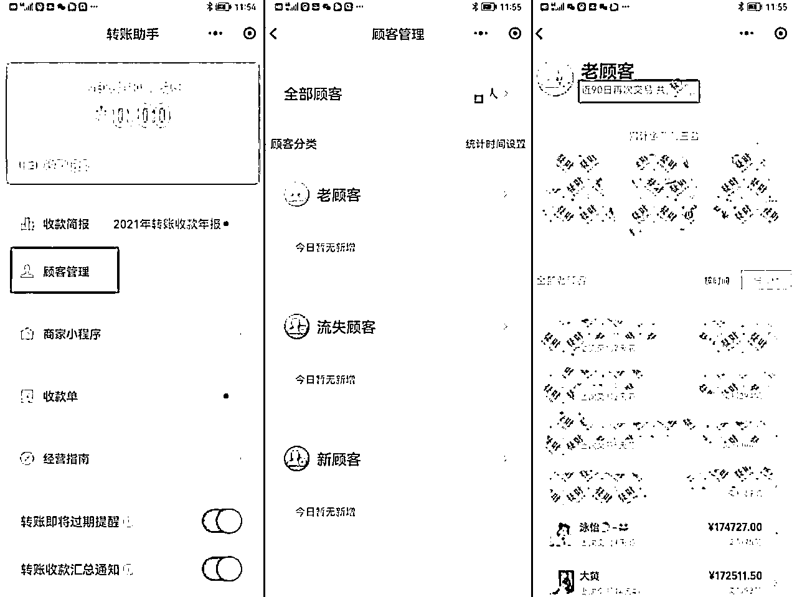
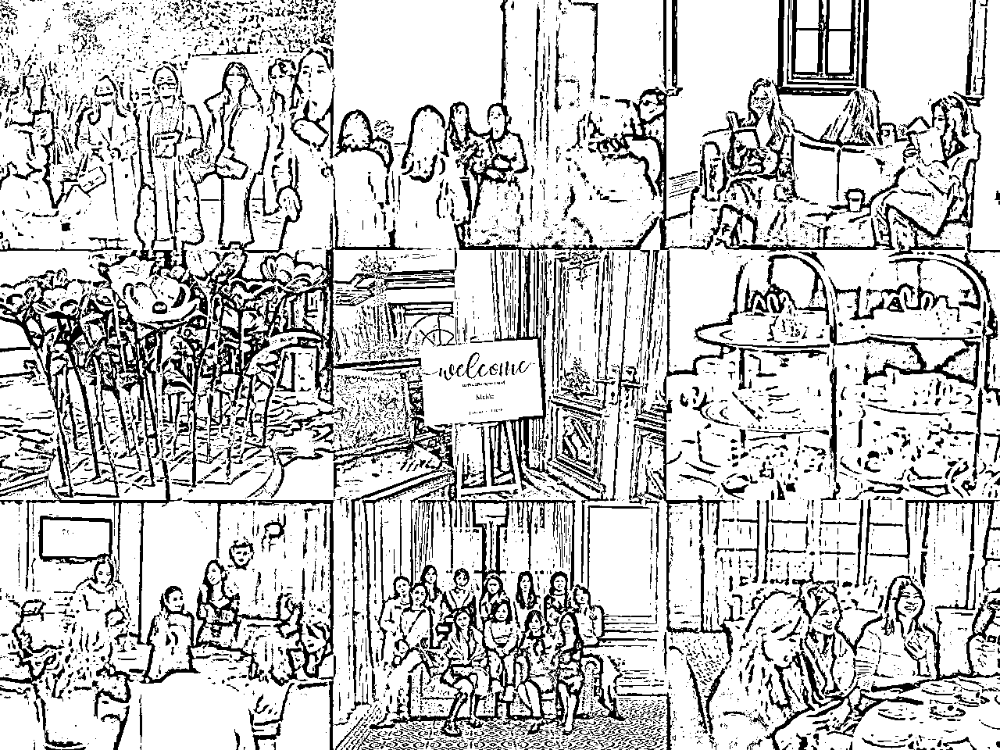

# (精华帖)(96 赞)以二手奢侈品为例，如何通过私域运营提升顾客粘性， 实现 74% 的转化？

作者：  美德布耀布耀德

日期：2022-05-23

大家好，我是美德，一名奢侈品培训师。副业是利用自己积累的一些资源，在微信社群里带货。由于我主业副业的关系，我也算跑通了一套带货的闭环。同时，也把奢侈品品牌的玩法，拆解整合，运用在了社群的运营上面。

美德先分享一下我这两年运营社群，在顾客粘性和贡献率上面的一个成果：

我只有 887 个精准** C **端客户（带货社群成员），去年成交过的顾客为 656 人，转化率为 74%。

**2021 **年到** 12 **月初** C **端客户一共发生交易 4589 次，平均每位** C **端客人年消费次数是 6 次，**C **端客户年消费最高次数是 67 次。

最高** C **端客户个人消费在 20 万左右。

 

 

带货社群，尤其是高客单价产品的带货，不仅需要良好的销售技巧，真诚的利他心态，还需要一点相对成熟的技巧去运作。

奢侈品行业 80% 的客群贡献了 20% 的销售额，我曾经看到过某高奢珠宝品牌的 VIP 名单，这个名单占顾客总数的 6%，这 6% 的客户，帮助品牌完成了多少的营业额大家知道么？

65%！没错，就是这么厉害！顾客的粘性是高客单价产品售卖好坏的重要指标。

那么我到底做对了些什么？** **

咱们都知道，营业额**=**流量*****转化率。我将会从两个方面分享：一是流量的获取，二是流量获取后的运营。运营会作为本文核心分享的部分。

**—01—**

高客单价社群的流量哪里来？

首先，我想表明的是，高客单的产品其实需要的客户不一定要那么多。虽然客流越大越好，但如果你只是想把营业额和利润维持在一个自己比较舒适的范围，那么找到一群精准的客群就够了。

凯文凯利曾说过一个理论，一千个铁粉可保你衣食无忧。我是这条理论的真实践行者。

所以，我分享的引流方法可能没有那么好的绝对数据，不过如果是高客单价的产品也许可以借鉴试试。

 

 

我主要用了最基础的四个方法。

**1. **利用好人品红利期

如果是开始一个新项目，这点非常重要，因为这是支撑你信心的关键。

这一点有三个方面要注意：

1）平时为人需要靠谱，让人信任。这样开始一个新项目的时候，朋友圈总是会有信任你但也不那么熟悉的朋友愿意支持你。

2）选择的项目或者产品一定要非常靠谱，做私域生意，产品或者项目本身有问题是绝对做不下去的，总不能天天换圈子。

3）要抓住初期的客户，让大家帮忙转介绍，形成初期裂变。

如果产品足够好，一般的朋友是会帮忙的，不要羞于开口。另外可以引导客户晒单，帮你写点，用来发朋友圈，影响还在观摩的朋友。

在让老客户介绍新朋友的时候，要表达感谢，可以设置积分给介绍者和被介绍者，这样双方都会很开心。

有些朋友只给介绍人福利，但是很多时候介绍人反而会有心理压力，感觉如果介绍好朋友过来就好像是为了从好友身上得到点福利。给双方都给予一定的感谢，可以消除大家的一些小顾虑。

 

 

社群初期的裂变给了我很大继续坚持下去的信心，也给了启动的基础流量。

**2. **线上参加付费社群

我报名付费社群的时候，90% 是真的想要了解或者学习相关信息，在这个过程中，稍微用心经营一下同学关系。比如每个社群的第一节开营课，都会给学员机会做自我介绍。

那么一个让人过目难忘的自我介绍就要提前写好。另外课程中，我几乎不会主动加人，都是找准时机用一些小技巧，让群里的精准人群加我。

什么小技巧呢？其实就是利他原则加上有自己的专业支撑自己的价值。如果有可以帮助到大家的就尽量帮助，大家都会记住那些给自己带来价值的人。同时要做好朋友圈的个人 IP 打造，这样吸引来的线上的朋友才比较好转化。

参加什么样的线上社群，需要根据实际情况去规划。

比如，我是做时尚相关的高客单价产品，那么我就会去和“美”相关的社群，比如美容保养的微商代理学习群；穿搭化妆相关的学习群。

另外还可以去有钱人会去的相关的社群，比如下午茶活动群，理财相关的社群，高端保险相关的社群等等。

**3. **线下参加付费活动或者课程

 

 

一般我也是优先选择自己喜欢的活动，一边享受活动本身或者安心去上课，一边寻找精准人群。

这个方法效率不高，一场活动或者线下课程最多十几个人，需要在活动上释放个人魅力，吸引别人主动加微信。

疫情后，活动也少了不少。虽然效率不高，但是因为线下见面过，有过接触，转化率是更高的。另外，由于一开始去的时候也没有那么强的功利心，因此整个过程不会有压力，是会比较快乐的。

**4. **异业合作

上面提到的线上，线下的课程或者活动组织方，都可以成为你的合作对象，可以交换流量，或者互相推荐等。

这里有个基本的法则就是，人都不会拒绝一个首先认可自己的人，认可对方的最佳方式是先给对方付费，尤其是自己的影响力还没有对方强的时候，是需要先主动的。

如果对方有产品，有付费服务就先去买，熟悉了，再谈合作，分成谈好即可。此方法的好处是不用太费心思，做起来不累心。

**5. **招募及培养合伙人

当整个转化的流程跑通后，如果想再扩大点规模，招募合伙人是最佳的方法。合伙人政策，一方面可以用自己跑通的模式帮助别人赚钱，另外一方面可以培养自己的忠实  VIP。

 

 

但是到这一步，其实也可以把知识付费模式纳入其中。即，给合伙人交付的是课程。课程是根据自己的成功经验，总结出来的知识和技能。再帮大家提供货源，就形成了完美的闭环。

以上方法用来解决流量的问题。

**—02—**

如何提高顾客粘性

精准流量获取之后，更为核心的部分就是后续的运营。这一板块我会围绕如何提高顾客粘性这一目的给大家做重点分享。** **

奢侈品或者高客单价产品与大众消费品最大的区别是，这些产品的溢价非常高，如果想要客户能够为高溢价买单，那么必然要提供产品本身以外的价值。

产品以外的价值包括，品牌本身带来的身份认同，社会地位的认可，虚荣心的满足。还包括消费的体验，以及让顾客感受到产品或者品牌背后的精神价值。

这两点做到了，那么就能够提供其他人无法提供的价值，就能够提升顾客的粘性。围绕这两点，我尝试了很多方法，总结下来，有以下三个方面可以和大家进行分享：

**1. **整体服务流程需要打造仪式感

 

 

**2. CRM**体系提升管理效率

**3. **学会造梦，提供精神价值

**1. **整体服务流程需要打造仪式感

** **

奢侈品这个行业最需要仪式感的打造，也是仪式感打造的最好的行业。外界听起来似乎是非常高大上，但实际上，奢侈品行业并未发明什么特别的操作，它们只不过是把每个环节做到极致。

在奢侈品行业，我们把顾客从进店到离店过程中的每个环节，设置为不同的接触点。每个品牌都是围绕顾客的这些接触点去做设计。

根据顾客的动线，接触点无非就包括以下几个环节：欢迎**-**探索**-**介绍产品**-**体验产品**-**处理问题**-**结束销售**-**送别**-**售后维系。

这些接触点里“欢迎”“介绍产品”在线上是最重要的提供仪式感的环节，下面我将详细和大家拆解线上如何通过这两个环节做好服务体验。

**1**）欢迎环节仪式感打造****

欢迎这件事，是由 3 个小细节组成的。

橱窗

欢迎的话术和动作

破冰话术

**01 **橱窗的仪式感打造****

 

 

在奢侈品店铺，从你看到店铺外观的那一刻就开始了。举个最简单的例子，奢侈品每一次的橱窗设计都不单单只是产品的堆放，每一次都会是有主题的故事。

 

 

这是爱马仕的橱窗，这已经不仅仅是橱窗了，而是一个个的艺术作品。任何顾客走到橱窗附近就会多看几眼，而且是以欣赏艺术作品的眼光。

比如，这组橱窗就融合了希腊神话故事和美感，还展示了产品。这是品牌的做法，那么平移到个人线上，如何在“橱窗”上，增强仪式感和美感呢？其实就是注意设计我们的朋友圈。

朋友圈封面，朋友圈的每个文案和图片，我们的头像，个性签名，都需要特别设计。因为，这些，就像奢侈品的橱窗一样重要。

 

 

 

 

美德的朋友圈背景图，会放奢侈品的秀场视频；个性签名表明自己的专业性及自己的资源；每张图片都精挑细选，放最好看的。这个意识相信每个人都有，但不是每个人都能把它们像布置橱窗一样精心且讲究美感。

**02 **欢迎话术的仪式感****

当我们走进奢侈品店铺，我们会发现，不同的品牌她的欢迎语是不一样的，员工微笑露几颗牙齿也是和其它品牌不一样的。哪怕是简单的欢迎语，奢侈品品牌怎么说的呢？

Gucci：欢迎来到 Gucci。

Graff：欢迎来到钻石王国的世界。

店员当然也不会非常热情地服务你，他们只会做到礼貌周到，微笑都不会露出 8 颗牙，大多被要求 6 颗。因为 8 颗过于殷勤不够优雅矜持。奢侈品的历史大多都是和服务皇室贵族有关，那么优雅矜持是第一要位。

 

 

有没有发现，每个品牌在你进去的那一瞬间，仪式感就来了，你会不自觉的觉得高级。

明白了以上的底层原因，美德也会去设计属于我自己的欢迎仪式感。首先每位新朋友加上我的微信后，我都会先做自我介绍，再邀请他进群。群里也设置了邀请须经群主同意。如果是群里朋友邀请新朋友，我也会先告知这位群友，需要新朋友加我微信。当我们友好的互相介绍完，我再通过。

以上的准入门槛，就是一种仪式感。亮明身份，提升自身价值，互相了解，平等对待。

高客单价产品的售卖，做到最高级，你应该和客户的平等交流的状态，而不是一个小客服。那么从第一步，就很重要了。

**03 **破冰话术的仪式感****

打完招呼后，就可以聊聊天，以达到破冰的效果。在奢侈品的销售里，我们会让员工准备 100 个破冰话术，用于欢迎完毕后和顾客聊天。

那么线上其实也非常需要设计这个破冰的语言。具体聊什么，线上来说，其实客户的头像，微信签名，自我介绍里的内容都可以作为破冰话术来聊一聊。具体大家也可以上一下线上沟通课。需要注意的是，聊天的内容氛围需要和你的社群格调保持一致。

美德这里还有一个小技巧，一定要去和每个加了好友的人打招呼。打招呼不要太官腔，而是把客户真正当成一个真正的人去沟通。

很多时候我们私域流量进来了，如果不打招呼这个人就不会和我们有链接。那么光打个招呼还是不够的。还必须在初始的聊天中，展示出自己的价值，但又不能让客人感觉你是在“显摆”。

 

 

之前这个问题一直困扰着我，加入生财后，这个问题立马就解决了。因为我发现生财的朋友们都会对自己的个人情况编辑好固定的自我介绍，发给新认识的朋友。那么这个方法在我们进行产品售卖的时候也非常好用。

因为如果不做价值展示，那么对于新客户来说，你就是个服务员，对你的信任度和认可度都不会太高，可能需要后期在朋友圈不断的进行个人 IP 的打造。

但是如果自我介绍发出来，自我介绍又写得能够为客户提供不一样的价值，那么在顾客心中的价值感就能得到迅速的提升。

**2**）介绍产品的仪式感****

最后我们再来看看关于，产品介绍的仪式感。

第一步，奢侈品品牌就不会把自己的产品叫做产品，而是叫做作品。她们也不会把生产产品的工人叫工人，而是叫工匠。

我们有一节课程叫做《奢华表达》专门教员工各种替换词。这是从上到下贯穿的培训，员工会很习惯这样讲话。

花一两万买到的是作品，什么东西是被称为作品？那都是花了心血，具有艺术价值的东西，那么如果贵，就能很坦然的接受了。美德在做线上运营的时候，也会抠字眼。为的就是给顾客打造这种特别的体验。

第二步，就是员工做产品推荐的时候需要讲求方法。这套方法是我在公司培训的时候独创的公式。也可以分享给大家。这套方法可以用于任何产品推荐。叫做“1+2+1”原则。

 

 

什么是“1+2+1”原则呢？

第一个 1 是指品牌的故事，设计师的灵感理念；2 是指，至少 2 个产品的 FAB（FAB 是一种介绍产品的公式，重点一定要站在顾客角度，思考产品本身的属性所具备的优点，重点描述这个优点对于顾客的好处），最后一个 1，是指，顾客的使用场景，需要帮他营造出来，需要有美图。

每一个产品，它都有很多很多个 FAB，我们在描述的时候，是通过前期对顾客的了解之后，针对性的去谈的几个点，一般来说我们描述两个即可，最多不超过三个，那方向是从哪几个方向来看呢。

一般我们是从颜色、风格、款式、细节、材质和剪裁这样几个方向去跟顾客做介绍。

在颜色上面来说，奢侈品在介绍颜色的时候，对于颜色的称呼会和普通的产品是不一样的，他不会用黑色、白色、绿色这样的词，反而是会给所有的颜色取一个非常好听的名字，目的是为了通过有仪式感的词汇表达，增加产品的价值。

比如上图的颜色，普通品牌把它叫姜黄色，而奢侈品会取名叫草地云雀黄，一听这个名字就感觉这个产品贵的有道理。

那么大家就可以看到，就是在一些用词上面，奢侈品是会非常有讲究，为的就是能够从各个方面去展示出这个仪式感。

 

 

我们在社群上新的时候，主要是图文展示，其实这时候用词就很重要，既要让客户感受到你的情绪温度，还要注意这些用词保住格调。

跟大家分享一下，一加二加一原则的最后一个一，最后这个一非常的重要，上文有提到它是指一个使用场景，但是注意，这个场景一定要结合着客人本身的需求去展开描述的。

我们不要自自说自话的告诉顾客噢，这个产品他设计的多么好，剪裁的多么好，细节做的多么好就结束啦。

而是应该重点告诉他，他穿上之后，在什么场景下可以得到什么样的一个效果。就是这个场景描述出来之后，让客人更有代入感，而且他会幻想自己穿上这个产品以后的样子，那么他购买的几率就会更大。

举个例子，假如是一件黑色绸缎的衣服，在上新的时候如何用文字描述出“场景呢”？

如果你是去参加朋友婚礼，这件衣服再适合不过了！低调经典，能够在不经意间让人对您的气质过目不忘。

如果你是去去参加小姐们聚会，这个丝绒的泡泡袖设计和复古可爱，一定能让你成为姐妹中的亮点。

如果你是上班穿这件衣服也不会太过，因为她虽是丝绒质感，但是黑色非常低调，设计也不浮夸，剪裁利落，能够把您衬托的非常大气！

 

 

这就叫有场景感的描述。

综上“1+2+1”这个公式可以在线上上新的时候使用，也是为了营造仪式感，能让客人体验干巴巴的产品刷屏外的另一种销售感受，在这个过程中还能收获精神内涵，谈资，以及欣赏搭配。

**3**）售后仪式感的打造****

我设定了每年的 11 月，顾客生日，12 月圣诞月，这三个重大时间点，为美德重要的顾客时间。

特别是 11 月这个时间也没有其她商家和我争抢哈哈，大部分商家都会把活动放在圣诞或者跨年。

11 月为感恩月：美德是绝对的回馈客户，这时候的任何操作都不会冲业绩。

会认真告诉每一个客户：我是真的对我的所有客户充满感谢，信任无价，常常让我感动。

所以，每年 11 月份，我会送 VIP 顾客一份小礼物。除此之外，也会在每年的 11 月举行一些互动小活动，让所有客户参与活动，赢大奖。

 

 

（感恩节晒单活动，客户都会写长文来描述她们买到产品时的惊喜）

圣诞月：一般我会设置一些非常有意思的互动小游戏和群里的客户进行互动，活动既要有意思，又要和群里的货品相联系。

 

 

（有趣的圣诞节有奖竞猜）

生日月：每位顾客生日都赠送不同的礼物，手写祝福等，具体就不晒记录了，具体的礼物是我和每个客人间的小秘密。顾客生日提醒目前是通过系统去统计。

其它一切营销活动都不参与，目的就是为群里客户养成属于我们有特色的购物习惯。同时坚持群里的一贯格调，不在原有价格上面打折，不做大促销。

顾客分类的目的是为了方便管理，我们应该把更多的钱和时间花在重要的人身上。

顾客分类如何分，一般公司都是根据销售数据去分类，美德认为这个是基础，但其实不要只看消费频次和消费的数量，还要看她对你的信任程度。

 

 

如果一个客户非常信任我，认可我，但是她的消费实力并没有很强，我也会把她分类到我的 VIP 里面去做维护。因为信任你的人，会帮你增加你的能量，这个也很重要。

**2. CRM **体系提升管理效率****

CRM 其实就是 Customer Relationship Management 的缩写，在每个奢侈品品牌都会有一整个部门，来进行顾客关系管理的相关事宜。这件事有多重要，我刚刚给大家分享的数据也证明了一切。

CRM 一般包括后台系统管理，以及一对一的顾客管理两部分内容，一个部门要做的事，真的有点复杂，美德只分享，我平移到我的顾客管理系统的时候，我做了些什么。

**1**）** **用好微信后台统计系统**“**微信转账助手**”**

另外的收款平台也同理，除了微信我还会用银行卡转账，道理一样，这里讲微信转账助手。

这个工具，可以帮助我们去统计每位顾客的消费动态。比如我们点进去转账助手，会发现有“顾客管理“”这个选项，这个地方的设计就能帮助你做 CRM 管理的基础工作。

 

 

点进去之后，你就能看到，你全部的顾客数：老顾客多少个，流失的顾客多少个，新顾客多少个。同时能看到她们分别是谁，这样就方便后续的管理。

老顾客就是每三个月都会一直购买的顾客，没有断过；流失的顾客就是之前他一直在买，但是近三个月没有购买了。

新顾客就是近三个月内才开始购买的客户。这个时间是可以设置的，由于我们都是高客单价产品，我觉得三个月内只要有消费就已经算很好了。

知道了以上的信息，我们就可以开始去分析。老顾客有哪些人，她们交易了多少钱，多少笔。这些人肯定是我们重点关注的对象，我们可以根据数据分析出她们的下单频率，购买的平均客单价，就能代表大部分客群的消费能力，那么我们在产品定价和选品上面就能有一些参考。

 

 

另外一方面，再配合后面我们会讲的顾客信息搜集，我们就能针对性的判断她的购买喜好，以及个人情况，那么作用就是，在选品的时候可以大概知道老顾客喜欢什么。在做顾客维护的时候，也能知道她会喜欢什么，送到心坎里。

一般，流失的客户也会是我重点跟进的，这些人里，消费金额特别高的会是我重点跟进的对象。三个月没有消费了，是为什么呢？是不小心得罪了这个客户，还是她家里出现了变故，现在买不了了？还是什么原因，要去一个个分析。

分析完后，需要用一些方法，唤醒客户。

唤醒顾客的方法：

（1）朋友圈多互动，人都需要被关注，如果顾客流失了，那么多去评论点赞她的朋友圈，让她感觉到被关注，有时候顾客自己就好了。

（2）可以偶尔给顾客送个惊喜，流失的顾客一定是消费过才能谈得上流失，那我们可以给客人偶尔送束花，送个下午茶。如果顾客不是本身出现什么变故导致消费不起了，一般以上两个方法足以唤醒。

（3）如果唤醒不了，那么一定要想办法在新客户上面下功夫，要补足流失的部分，把新客户发展成老客户或者发展更多新客户，才能保证营业额一直是稳中向上的。

当然这里面的数据还有更多可分析的，在这里我就不做深入讨论了，大家如果感兴趣可以私下探讨。

 

 

高客单价，代表着相对来说的高利润。所以值得我们这样花时间去分析，去想办法。另外一方面，数据是不会骗人的，如果只有一个人运营社群，单靠感觉很容易有时候遗忘了有些重要客户。数据统计，可以提醒咱们注意管理重要人员。

当然，这个只是个工具，对于客户的服务等，是需要一对一进行的，要把每个顾客都当成独立的个体的。这也是为什么奢侈品行业里，现在已经不把顾客管理叫做顾客管理了，因为每个人都有个体差异，都是活生生的人，其实是很难管理的。

现在我们都叫“Clientelling”，意思其实就是现在私域领域倡导的，用真心对待我们的客户。

OK，那么这个工具分享了之后，我来给大家分享更细致的操作：

**2**）**    **需要搜集顾客信息****

**2.1 **记录每笔订单信息****

和微信转账助手相互配合，这个更精细，如果时间不够，用微信转账助手即可。

Excel 列好如下信息：顾客姓名，下单日期，所购买的产品名称，图片，数量，拿货价，售价，购买品类。方便日后进行数据分析。

同比，环比，哪些品类卖的比较好，哪些品类是比较缺失的等等。以便后续选品。当然很多人会靠日常积累的感觉进行决策。可能由于我是零售管理出身，我喜欢用数据+详细分析进行决策参考。

 

 

**2.2. **收集记录顾客信息如下：****

**1**）第一类数据：年龄（生日），性别，职业及职务，工作单位，常见场合，家庭结构，配偶信息，子女信息等****

以上信息的搜集是为了方便寻找共同话题，以及提供不一样的价值。

知道顾客的职业和职务，工作单位及常见场合，是为了推荐的产品更加能符合她的身份和出席的场合。同时，其实我们运营的高客单价社群，群里每个人本身就是很好的资源，说不定多做留意就能帮大家互相链接，提供更多的价值给到大家。

再比如，知道顾客的家庭架构，配偶信息，可以在选品的时候起到作用。比如我群里 98%都是女性客户，那么她们的配偶的吃穿用基本上她们都可以帮忙买。

当我知道大家配偶大概情况后，我推荐的男士产品销量肯定也会不错。另外，我群里客户大部分都和我年纪差不多，都开始有了宝宝，那么，可能高客单价的宝宝母婴产品就会是我未来将要嫁接的方向。

比如，知道顾客子女的出生信息，就可以在顾客子女生日的时候送上祝福或者礼物，因为子女的破壳日，就是母亲的母难日，这个体贴的点做到了顾客的感受肯定非常不一样。

**2**）第二类数据：顾客的个人风格资料****

个人基础风格（优雅，时尚，性感，浪漫等），偏好，发色，肤色，妆容偏好，体型 

 

这部分信息，具体可以根据群内所售卖的商品进行细微的调整。不过这项数据的整理，除了能够帮助自己带货，还能帮助挖掘顾客其它隐形需求，我整理客户的这些信息，除了对我卖品牌的包包衣服有帮助，还会有其它更好的作用。

比如，之后我要开服装店，售卖自己的服装，我就有了具体的客户风格画像了，会非常有助于我选品。假如我要开美容院，我就知道我的客户可能喜欢哪一种类型的。

总之，数据样本量够大的话，这些数据对后续做其它方向的创业也会有帮助。

以上信息如何得知呢？我们有句行话叫做“非销”，从客户的闲聊中获取，另外就是从客户的朋友圈中获取。

以上都是 CRM 的基础数据信息管理。拿到数据后的分析，措施是第二步，第三步的管理。

这个方法的好处，首先是，有个思考方向，作为运营社群的群主，不管你是什么性格，你都可以做，起码做到及格分。

有些群主社交能力非常强，可能她根据自己的感觉就能把群做的非常活跃，每个客户都照顾好。但是肯定有人没有这种能力或者没有这个时间的，那么方法和 SOP 就可以相对来说不那么考验个人性格和能力的。甚至，变成 SOP 复制后，让员工完成，解脱出你自己的时间。

**3**）把顾客进行分类管理****

 

 

很多公司会根据顾客的消费能力把顾客进行分类，每类客人会有不同的待遇。美德现在的顾客基数还没大到进行顾客的深度层级分类。

我的顾客，购买 10 次以上都算老顾客，年消费 3 万以上都是我的 VIP，都会认真真心对待。新客户，只要沟通是礼貌的，是否购买都不重要，也会耐心对待。

有了基础的分层之后，就可以设定属于 VIP 客户专属的仪式感，具体上文仪式感打造部分已经详细分享，此处不再赘述。

**3. **学会造梦，提供精神价值****

**1**）要有造梦的能力****

奢侈品本就不是必需品，如何让普通人想要拥有？那么造梦的能力就很重要。

我们看看奢侈品品牌都是如何造梦的呢？不断的培养你可以拥有更好的东西，通过各种高级大片，广告，告诉你。进入店铺后，你会发现店铺营造的各种氛围：灯光，香水，陈列，甚至服务员的微笑露出几颗牙齿，都是在给你造梦。

这种造梦十分重要，这就是在勾引起人们内心的欲望，渴望。

那么作为线上，私人运营的高客单价产品销售，要如何实现造梦呢？

美德主要是通过以下关键词：品牌产品分级，图片，以及顾客惊喜，来进行造梦。

 

 

**A**：选品要布局，选品也是造梦的一部分。****

品牌产品分级其实也是奢侈品在玩儿的，比如大部分一线奢侈品品牌都会有高定系列，这些系列非常非常贵，其实并没有太多人能买得起，全世界就 500 人左右吧，但是大部分一线大牌都要做大秀，都要做高定；再比如，主要做包包和服装的，香奈儿，LV，迪奥等大牌也要抢着做高级珠宝。为什么？

其实以上所有操作都是为了提升逼格，抬高其它产品的品牌溢价能力。让顾客花小的钱，感觉到更高级的梦。

针对这一点，美德在社群里上新选品的时候，也会有所涉及，群里一定会保留一定量的爱马仕，以及硬奢，比如卡地亚，江诗丹顿等几十万甚至百万级别手表的内购资源。

虽然几乎很少有客户买，可能一年就几次吧，美德也基本上每个月至少会上新 3-4 次，差不多保证一周一次的频率。

同样的理由，反过来，顾客也需要培养，有很多客人现在虽然对奢侈品有向往，但是买不起。没关系，美德有很多奢侈品的美妆内购资源，有很多平价但也比专柜购买更加优惠的资源。

不赚钱，也会群里上新，为的就是养成客户在美德群里，想买好东西就能想到我的购物习惯。那么等到她真的想要拥有，有能力拥有的时候，也会想到我。

**B**：图片是梦想实现的第一步。****

 

 

图片很大程度上会决定顾客的购买欲。可能促使客人不再犹豫，直接下单的就是某一张图片。

关于这一点，其实就是奢侈品广告，明星穿搭的重要性。在实体店铺，客人只能看实物，看镜子里自己的上身图。

而线上有巨大的优势，在于可以看长得好看的人的上身图，好看，天然就有吸引力。

为了提高效率，以及前期的投入产出比计算，美德没有选择自己去拍专业的图。而是组织了图片搜集团队，专门找高清的，高级的图片。

全部是官方高清图还不够，因为太过于高端，对我的客群来说，会有距离感。因此小红书上好看的素人图，也很重要，也会是美德上新的一部分。

再有就是到货的实拍，美德自己的上身图等等，都会发出来，以此增加亲切感，起到带货的作用。

** C**：顾客惊喜：顾客最终梦想的实现。****

具体就不展开了，总之是让一部分客人能有“哇”的感觉。大家感兴趣可以来做我的 VIP 客人体验一下。

**D**：为顾客创造惊喜的使用场景。****

 

 

卡地亚每年都会举行高级珠宝展。每年这个展览期间，负责店铺大客户管理的员工都会邀请有购买实力的客户去现场看展，并引导大家消费。这个展的安排一定会有晚宴等很隆重的场合。

目的是什么呢？其实很多高级珠宝价值都是几百万几千万，客户很多时候买回去是搜藏的，也没有太多的机会“展示”，那么为客户创造这样的“展示”机会就很重要。

这个借鉴起来的话：比如，减肥的可以搞走秀走红毯，拍形象照等活动，肥都减完了，当然要给客户展示的机会啦！

而美德，平时也会举办一些活动，让顾客能够穿着她们在我这里购买的服装背着在我这里购买的包包，美美的展示拍照留念。

办活动，有一招，就是利用你所在城市的活动或者展览资源，把格调做起来，这个其实也是造梦的一部分。

美德经常会利用各个品牌的展览资源来办活动。给大家分享一下我们上一次活动的图片。反馈也都特别好。

 

 

**2**）**    **会讲故事，提供精神价值****

我们经常听到营销课里讲奢侈品的营销，就会说他们很会讲故事。这个故事的最终目的其实就是为了让消费者心甘情愿为自己的感觉而付费给品牌方。也叫用好“价值定价法”。

比如卡地亚的猎豹系列。这个系列最出名的就是翁莎公爵夫妇的爱情故事。翁莎公爵爱美人不爱江山，为了娶翁莎公爵夫人而放弃王位，并让卡地亚给这位夫人设计了猎豹元素的很多经典珠宝。从此，卡地亚的猎豹系列成为了爱情的象征，也是品牌的经典系列。

这个故事太过于经典和典型，以致这个系列到现在还是卡地亚的经典系列。奢侈品的每件作品，都有它的故事，灵感，还有设计师想要传达的理念。

 

 

再比如香奈儿，这个品牌的故事相信大家都不陌生，对香奶奶和 14 个男人的故事大家也肯定都很好奇。但这个猎奇的故事之所以为大众所知，不能说不是商业运作的的结果。

香奈儿历经 100 多年，品牌延续到现在靠的早就不是香奈儿和她的后代，而是后面的资本，维德摩尔家族。却有很少的人听过这个家族。

品牌就是专门让背后的资本神隐，而让香奈儿的故事成为传奇，这样才能让品牌故事流传下去。那些风流韵事，本来也是香奈儿的品牌公关宣传之一。

假如我是运作一个新品牌，那么在这方面我一定会研究一下，如何讲好我的品牌故事和我的产品故事。

但我目前售卖的是别人的品牌产品。所以我所做的就是，讲好这个产品的故事即可。

我们很少会像代购或者其它奢侈品的卖家在朋友圈或者群里发产品细节，反而更多的是倾向于讲解背后的故事。以此来和其它的卖家区别开来。

这里美德分享一个案例，是最近我分享的品牌故事。

 

 

左上角第一张是分享的宣传海报，海报就要有故事性；第二章是宣传文案，尽量和每个人的生活相结合；但三张和第四张是分享的内容节选，需要有干货知识的传递还能有个人感悟的抒发；最后三张是客户的反馈。

 

 

讲故事，也是为了提升客户对于产品的鉴赏力，并且通过课程，我们好好来教大家，怎么去享受。每一个故事，在讲解的时候都会有情感上面的共鸣和享受。这样客户在购买商品后这个产品就不单单是个产品了，它被赋予了意义，同时还附加了谈资价值。

客户如果只能在你这里享受到这种附加服务，那么粘性自然就增强了。粘性增强就会有源源不断的复购，以及转介绍。

以上就是关于高客单价产品提升顾客粘性的一些方法。谢谢大家！** **

评论区：

亦仁 : 二手奢侈品的生意模式和其中的一些坑，方不方便展开讲讲？利润核心来源是利润还是合伙人？

婷婷 : 写的太好了

小酱 : 棒棒的美德~学习啦

郭  嘉 : 学习了

若水 : 专业、精准，提供了高客单价社群运营的方法，厉害👍！

麦麦 : 1+2+1，造梦提供价值，还有细致的客户管理，学到了

宋大刀 : 美德 yyds～

心理諮詢師 - 根源 : 人美能力又强，还给不给人活！

来了张伊森 : 进一步的了解了私域运营，之前想的还是太简单了，每一个动作都是有价值的。
