# (精华帖)(85 赞)不同的人群如何切入抖音本地生活的操盘方法论

作者：  楚川

日期：2022-08-30

抖音本地生活现在市场现状怎么样？现在入局有哪些建议？有哪些可以复用的完整方法论？

我在抖音本地生活赛道已经耕耘两年，抖音本地生活去年的 GMV 是接近 200 亿的规模，今年上半年已经达到去年一整年的数据 220 亿。

在数据核销方面，去年抖音本地生活的核销数据只做到了 32% ，今年推测核销率是  35%~40%，在我看来，本地生活做短视频和直播还是很有增长空间的，今天我来分享一下不同的人群切入这个赛道的方法论。

大家好，我是楚川，一个从大二开始创业的连续创业者，到现在已经是 11 年了，先后从事校园传媒、淘系运营、电商品牌、直播供应链和短视频本地生活，算是经历互联网的风风雨雨，2 年本地生活创业拿到 2.6 亿+GMV 的结果。

我是一个爱总结、复盘、改进和强执行的人，也非常乐意去分享我们的方法论、经验，希望更多人加入到短视频本地生活赛道，共建完善的服务体系。

下面我将进入正题，正式从五个部分来展开我的分享：

一、行业经历和结果

二、抖音本地生活的几点逻辑共识

三、抖音本地生活的市场现状

四、抖音本地生活的完整方法论

五、抖音本地生活的从业总结

一、** **行业经历和结果

我们团队从 2020 年 10 月正式开始从事短视频本地生领域，自建短视频工厂，孵化 5W+素人分发矩阵，100W+文案，1000W+短视频，10 亿+曝光量，4000+商家，2.6 亿+GMV.。

**1. **团队搭建的过程

2020 年 8 月，我作为直播电商供应链公司的负责人清晰知道流量在吃紧，行业从蓝海快速变成红海，自己捞金的机会很快就会没有了。所以一直在找新的机会，新的赛道，这也是互联网人的创业日常。

那时候我们团队在运营品牌和 IP 账号的时候，发现带抖音地址（POI）和不带 POI 有差距。经过反复验证，发现即使是一个白号，在热门 POI 下发布作品，流量也会比平时更快突破 1 级流量池，并且曝光数更高，在这个时候我们就萌生出转型做本地生活的念头。

**2. **爆店码的增长期

关于爆店码的开发，我们是基于 2020 年的视频号霸屏技术的底层逻辑，大概就是借助自身私域的优势，拿视频矩阵进行分发，从而在视频号中获得足够多的曝光，从而完成转化，主要是游戏、营养品类目比较多。

但是这项技术在视频号没有真正推起来，所以在 2020 年 9 月我们就向 CTO 提出想法，我们想在抖音做一个类似的，于是就有了爆店码的概念雏形。

于是就倒逼技术去做研发，去对接他的行业资源，差不多在 2020 年 10 月份，我们跟其他团队同期落地了爆店码技术。

爆店码的逻辑：扫码自动转发抖音短视频，并且带上固定**POI**。

我们从一开始就成立了自己的素人矩阵，经过 2 个月的数据分析，摸清了抖音本地生活流量的推荐逻辑，就是下图。

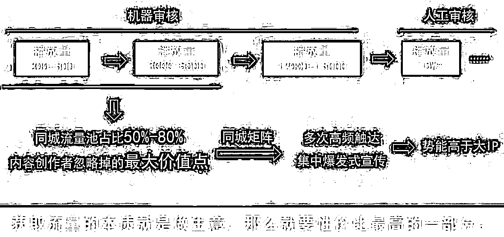

所以后面我们的内容创造方向和运营方向，都是去吃本地生活这块流量，那就是一定是把矩阵运营好，将流量的性价比做到最高，ROI 拉高才是我们的目标。

爆店码的疯狂是从 2021 年 1 月到 3 月，那时候抖音团购还没有真正形成闭环，所以我们都是用爆店码形成半闭环在做一些事情。

以下就是一些特殊的行业，统一动作就是：招募素人矩阵，扫爆店码分发视频获得基础曝光，再让门店引导顾客扫码转发视频&领取满减券，鼓励商家把所有咨询和核销券的用户转为私域，做后续成交或者二次成交。

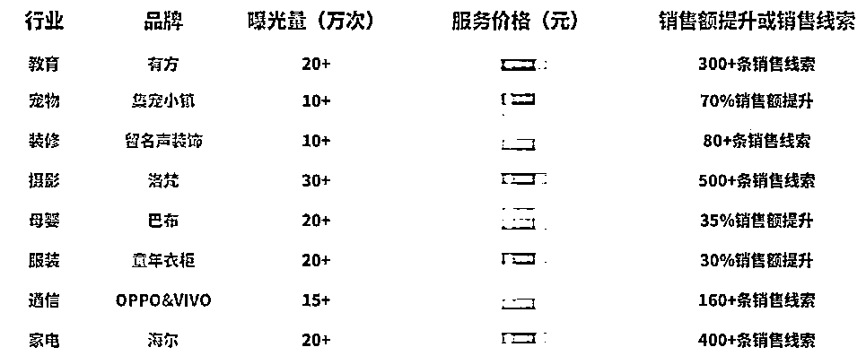

**P.S**：这里要注意一个点就是服务的客户，交付内容或者方式有区别。哪怕是到了今天有团购了，也要从多个维度去定服务**KPI**，单纯的销售目标或者以抖音平台单方面考核肯定是不合理的。

全程一共 4 个 BD，加上我们 4 个创始人两个月拓展到 400 商家，服务的内容调整为：爆店码**+AI**云剪辑**+**营销事件策划。

服务过的客户如：OPPO 和 VIVO（销售扫街分发视频，领取 300 优惠券和自拍杆）、海尔空调和台铃电动车（领取 500 优惠券分发视频，保留一星期找客服领取 88 元红包）、老火锅（朋友圈裂变扫码转发，播放量前三名分别送霸王餐）。

这个时候是本地生活流量擦边球和禁入行业的最佳获客时间，应该也有不少同行完成了满意的增长，我们其实这段时间也打出了很多骚操作，赚了一些舒服的钱。

但是这套思维，我觉得是很多要进来这个赛道的人要好好领悟学习。多方位去思考问题，下面我举两个例子，虽然是最后没有执行的案子。

第一，净水器行业。因为分销商很多，但是没有内容制作能力。当时对接到一个品牌叫“诺百纳”，他们每个月烧信息流预算挺高，并且是以 cpm 为主，销售线索很低。

所以我的建议是把分销商和员工成为素人视频，用我们内容生产能力，一个人 2 天分发一条视频，曝光指标和销售线索是肯定上去的。

这个案子是因为我们做爆店码开单太快太猛，根本没有精力来跟一个客户耗很久。但是这套思路，我个人是认为可以做到很多行业。

第二，银行的生活节。长沙建行每年都有 66 生活节，宣发预算其实挺足，但很多时候都是用于大屏广告和电梯广告，很难做到数据统计。

当时我的提案就是在长沙 IFS 周边放很多海报和传单，参加活动的商家放福利进来，消费者转发视频就领取代金券，直接到 IFS 进行消费和核销，同时所有用户可以做到默认关注建行官方账号，长期沉淀用户。

这一块没有合作起来的原因是因为我们公司没有做过银行业务，我们暂时没办法作为竞标单位，只能提案，但是他们营销口是很认可这个方案。我个人也会认为这种方式到现在也不算过时，小城市可能还可以玩开。

**3. **小程序服务商

在 2021 年元旦过后，我们团队技术重新提到：抖音小程序即将开通本地生活**SaaS**服务商资格。拿到服务商资质的，可以给二级服务商或者运营服务商做系统的**OEM**。

2021 年 3 月份与标点云达成深度合作，是他们最高级的 OEM 服务商，享受到的权利跟入围的本地生活 SaaS 服务商没有区别。在这也特别感谢标点云的全力支持，能让我们在市场上喝到第一口汤。

其实这一步算是大家要注意平台的调性，真的不能被牵着鼻子走。我们在前期开发阶段投入有**50**万，基本上打水漂，我记得还有一个山东的兄弟**20**多个人的开发团队花了**300**万也没成功，最后气炸。

抖音小程序可以与抖音 POI 进行融合，即地址可以带团购套餐。当时我们团队都非常兴奋，因为这意味着抖音本地生活进入到团购阶段，所有的曝光可以跟销售结果匹配，也能让服务商做到更高的 GMV。

2021 年 5 月我们也开始选了一些商家来做抖音团购，推爆了不少商家，这也是我们团队扩张的开始。其中蹦床是我们做爆的第一个行业，并且快速在其他城市复制。

使用的打法比较简单粗暴：KOC+素人+直播（你没看错，我们**5**月份就做了直播，直接本地推流）。这家蹦床当时在衡阳的郊区，老板极度焦虑，一个月只能做到 2-3 万元的销售额。找到我们的时候，几乎是恳求的语气。

于是我们用 30 天的流量轰炸，让这家店开始爆满。到 2021 年 6 月，累计曝光 1000W+，单月销售到 50 万元，我们每周安排到 2 场本地达人直播。最后这家蹦床长居本地玩乐榜 TOP1。

在这段时间也是抖音的热门 POI 的红利期，我们大部分素人账号从 50-200 粉丝增长到 1000 粉以上，因为：带一些网红店、网红景区地址的视频，就能获得流量加持。

等到 7 月份抖音推出团购带货达人的板块后，我们的素人账号顺势就开通了达人 CPS 的功能，一条视频可以获得基础费用+2-5%的 CPS。

后面我们对于 1000 粉丝以上的素人要求也更加严格，比如要 2000 播放量才给基础费用，慢慢的 100 人的矩阵可以做到 20 万播放量，我们跟客户签合同基本上是 15 万，收费价格在 20-50 元，保持毛利在 30-40%。

2021 年 6 月，我们在增长的同时也推出“爆店码**+AI**剪辑**2.0+**抖音小程序”，所有流程的 SOP 也完善。因为这个阶段我们人数已经从 15 人激增到 60 人，为了提高人效就直接把运营 SOP 推出。

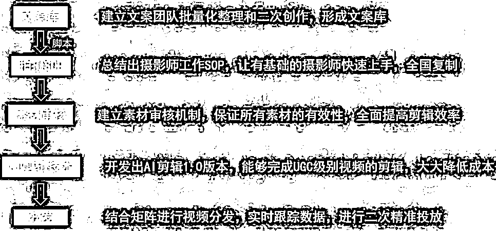

从文案、拍摄、素材审核、剪辑、分发全部规范，直接将短视频成本控制在 5 元/条，让我们最大的杀器：素人矩阵做到品类封杀。

以下就是我们的 SOP 介绍，另外关于 BD、后台运营这些则需要另外花不少时间沟通，这个我们可以私下交流。

这套 SOP 也有做视频的同行在使用，基本上能够满足大部分人的需求。

**4. **品牌全案服务

这个阶段，我们已经做到 2 亿 GMV 的级别，团队一度膨胀到 100 人。旗下站点有满天星精选、祝融严选、出来玩等 80 个直营站点。

我们过去沟通的 100 家 KA 客户， 99.9%的人愿意给 100 万+的预算到全案服务，也非常不情愿给到 10 万到抖音本地生活一个渠道。

所以我们就开始布局抖音探店作为其中一项服务，增加了公众号、小红书、大众点评、视频号和外卖。

后面也想通了这些事，渠道整合能力、对于本地生活的理解能力、策划能力，这是 KA 品牌全案服务一定要具备的水准，这依旧是在倒逼团队进步。

其实我们还是算市场上收费比较贵的服务商，但一直没有缺客户。我们也慢慢发现本地生活，重要的是商家运营，而不是技术本身有多牛逼。不过可惜的是在我们团队快速膨胀的时候，没有继承和放大这个优势，这也是我 2021 年最大的遗憾。

下面我就贴几张当时的全案服务内容，大家可以参考，也不算太好，欢迎大家提建议和吐槽。

P.S：这就是 150 万案子和 43 万案子的差别，第一个更加全面，也是很多品牌方想看到的。

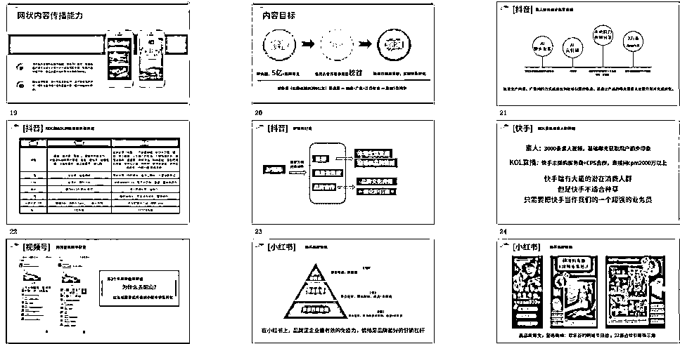

P.S：这就是线上的全案服务，各渠道都有规划。

**5. **官方直营和服务商管理部先后下场

2021 年 11 月，字节宣布在主要的城市开城，长沙就是其中之一，团队架构跟我们 90%相似。因为团队太相似，没有办法进行深度合作，他们只会快速蚕食我们的市场。

字节还是那个字节，在开城后，我们的重点客户都收到了官方的合作短信，邀约到公司见面。他们的服务就是：商家给到极限性价比套餐，再让出**10%**佣金，官方不拿一分钱提成。这对**90%**的服务商就是降维打击。

那会我们还是觉得这个生意还可以做，也在苦苦坚持。但没想到，在 11 月份到 12 月，一个多月时间直接对服务商卡审，无限拉长套餐上架。基本上大量团队原地解散，我们团队要做的也就是遣散和优化，以及业务调整。

这种情况一直拖到 2022 年 3 月，官方成立了服务商管理部，抖音本地生活呈现三角之势，分别为：本地生活小程序事业部、服务商管理部和直营中心，关系比较微妙。

在我们团队的努力下，又拿到了官方服务商的身份，隶属于服务商管理部，使用了群峰系统。

**6. **供应链和流量服务

2022 年 4 月，我们团队继续痛定思痛，想着怎么先人一步找到更好的赚钱方式。我们分析到大量的做爆的客户的一个共同点：他们有爆品，产品本来就自带流量，我们运营和推广都是辅助行为。

现在疫情之下所有门店亟需解决的问题是流量问题，其次是爆品的打造的能力，这两个点是可以做一个很好的结合。

所以我们就想彻底的抛弃品牌服务，直接以爆品供应链接入商家，再搭配我们的流量服务。于是就真的大刀阔斧的测试起来了，构思出这样一个商业闭环。

第一个我们选择的就是马上要在长沙爆发的品类，那就是小龙虾。于是我们选择了一家 300 平，具备接待能力的商家，但是从未做过口味虾，作为我们的样版。

第一，与商家共同制定了一款团购套餐；第二，安排摄影师拍摄素人素材+30-40 名达人探店，总共投入约 3000 元

截至 2022 年 5 月 22 日，一共销售 1084 份小龙虾套餐。按照平均 50%的核销率，一星期时间预计到店 190-200 桌，商家投入产出在 1：10 。

接着我就做了财务模型的分析，发现是盈利的，然后我们立马找了 20 家商家合作，最后在 4-6 月实现单项目 20 万净利润，日均小龙虾消耗在 2000 斤以上。

但随着 6 月开始，小龙虾开始泛滥，项目的盈利能力就减弱了，我们也还没有真正找到合适稳定的供应链。有供应链资源优势的朋友可以深度沟通，来项目合作。

**7. **品牌孵化和投资

我们现在盈利的打法：品牌孵化/投资-爆品供应链-品牌服务的组合拳，保证我们短期实现供应链盈利，长期实现品牌的增值。孵化落地千万级别的品牌有 4 家，最成功的案例就是以下展示的虾浪。

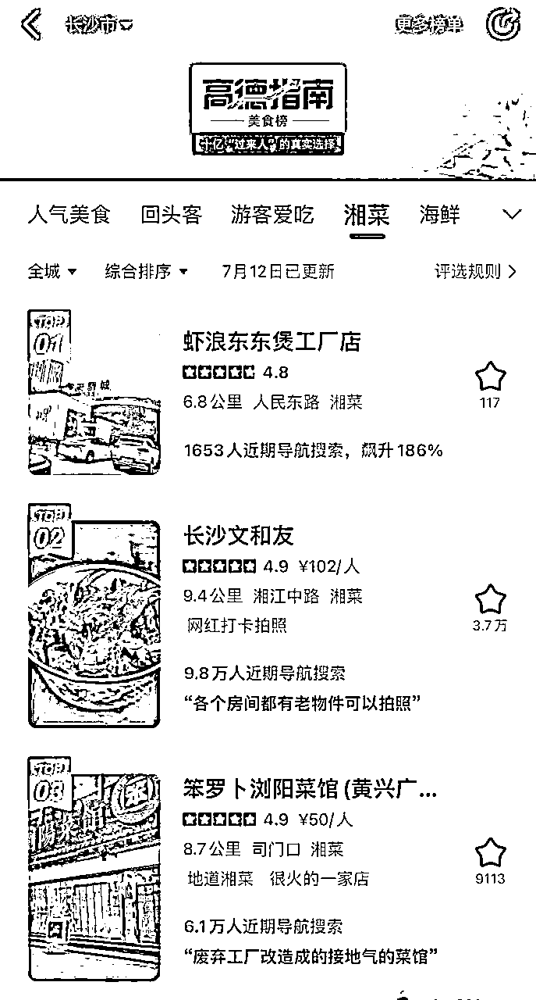 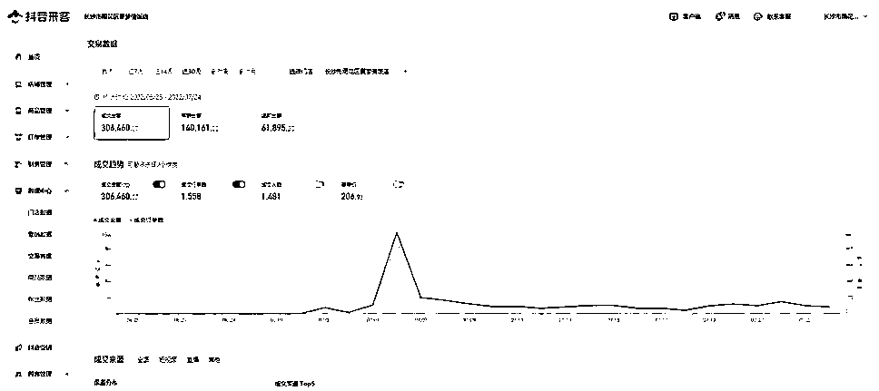

通过数据的多向分析，品牌单月营收 120 万，抖音核销 14 万，总 GMV30 万，美团系核销 45 万，大头还是实际到店为主。但是从线上的很多数据比较，引流效果明显，只是一部分人不会直接下单，而是直接到店消费。

所以如果在生财的朋友自己有品牌，想一起合作的话，我们可以深度沟通。如果我们团队评估没问题是可以直接入股，后续的品牌服务都拿下，品牌方只需要负责实体运营。

二、抖音本地生活的几点逻辑共识

**1. **抖音本地生活流量的逻辑

第一，要有一个很清晰的认知，上榜了就有额外的流量加持，所以第一时间就是需要知道 4 个榜单的评选规则。

第二，四榜都有推荐度，其实就是用户的评价，有效评价以为评价要有一定基数，那么就告诉你一定要有视频数量、用户数量为基础。

第三，那就是商户质量，其实无非就是适不适合打卡拍视频，有没有运营能力，折扣可不可以跟上，那这也可以作为你筛选客户的基础。

其余的指标看起来重要性都没有那么强，因为推荐度和商户质量做好了，其他都不是事。

第四，本地生活的流量推荐机制我已经分析了，那么无非就是再结合矩阵运营，那还有什么难事。

**2. **短视频会对图文的降维打击

“短视频&兴趣电商”是对“图案&文字”的降维打击。

场景化是最好的消费引导，千言万语不及视频一句：卧槽，真香！这个其实我们已经通过抖音证明了这一切，所以也说明我们在想做好本地生活之前就是做好短视频即可，直播如果在自己的能力范围以外，就先不要考虑这个问题。

那么这一块在做商家服务的时候，就是要脱离图文的思维。怎么样构建场景，让视频看起来更出色，更加有吸引力，这是我们要做的事情。

虽然抖音有图文，这条路也许短时间让你受益，但是终究走不远，也没有太大的未来。

**3. **电商和本地生活最大的差别**—**核销率

核销率非常非常重要，这样再大的 ROI 也不堪一击。我们去年的 GMV 这么大，但是核销率只有 32%，产出直接干掉三分之二，我说我亏钱了，那现在应该是信了吧。

去年整体情况应该是在 30%左右的核销率，意味着电商里面是 70%的退货率，那只能高客单可以跑。但是本地生活只能是低客单，这就是一个商业悖论，这需要很多人去做仔细的思考，怎么提高核销以及降低退货。

当然也因为核销率，我也是无数次劝退做本地生活直播，虽然抖音有很多人因此私信骂我，说我什么不懂，但我还是祝福这些人不要上头，不要破产，这年头赚钱不容易。

**4. **客户的内容需求不一样，没有标品服务

抖音本地生活用短视频重构了这块市场，这是毋庸置疑。但是平台的属性是基于内容为出发点，并且内容的需求是不一样，多元化的，所以基本上就没有标品服务。即使有，那也可能是短暂的。

如果做抖音本地生活的基本盘仅仅是抖音团购、内容服务，那么基本盘是建立在不稳定的基础。因为内容和流量没有绝对的相关，同时转化也是做不到公式化输出，那大概率是亏本生意。

按照生意的逻辑，当没有标品服务存在，就不能盲目扩张，拓大批量的商家，因为商家越多，交付的难度会越来越高，管理成本会越来越高。

在我们团队的发展中，我们犯过两次这一块的大错。

第一次就是我们以一个固定的服务套餐，去拓商家，当只有 60%的有效，剩下 40%的商家就会投诉或者找麻烦。

我们以全流程 SOP 化的方式推动工作，最后发现交付质量越来越差。的确是在说明一个问题：内容就是不能以一个标品来做，行业不一样，需求不一样，太容易踩雷。

当然交付的环节可以做到一部分是标品，但不成成为全部，就像我们的交付中素人视频和技术运营就是固定的流程。

第二次就是我们的品类服务，今年的餐饮供应链和足浴商家，都是以一个差不多的套餐去做推广，到后期的商家转化效果会很差。

其实就是缺乏商家运营环节，需要将自己的服务和产品跟客户进行调和，达到一个达人、顾客和商家都能接受的状态。

**5. **抖音本地生活的运营全景图

这就是抖音本地生活的运营全景图，所有的服务环节和生态环节都在这里，基本上入局的话可以从里面的一些角度切入，或者是自己的服务涵盖里面所有的内容。

当然在这一块，基于抖音的生态还可以衍生出其他的业态，比如投资、孵化和行业供应链。当团购业务不是很赚钱的阶段，就可以将生意赢利点转移到其他角度上。

三、抖音本地生活的市场现状

**1. **市场体量

（**1**）抖音本地生活：**2021-2022**年的战绩

抖音本地生活 2021 年的 GMV 是接近 200 亿的规模，2022 年上半年是 220 亿，其中短视频占 70%，直播占 30%，个人预测 2022 年整体的核销率是 35-40%。

按照 7 月 36 氪的报道，可知今年抖音本地生活需要将直播的份额拉高到 50%，那可能核销率也是很难高起来。

因为直播属于冲动型消费，很难达到刚需高频，所以这块会限制所有的服务商和流量主达到真正的突破。这也是所有入局者需要注意的点。

到目前为止，抖音直营中心超过 50 个城市，商家 70 万以上，4 万以上的服务商（官方服务商未统计），320 万达人。整体的生意逻辑相对来说比较简单，大部分都是达人撮合、服务商和商家互动的链接，普遍佣金为 10%-15%。

2022 年 6 月，字节在巨量网发布的《2022 年生活服务软件服务费标准说明》，只要商家在抖音平台发布商品或服务信息，如商品名称、价格、门店地址等，并与用户产生交易，就要向抖音缴纳软件服务费。

其中，软件服务费以“消费者实付金额+除商家自行补贴外的其他补贴金额”为基数，并且根据不同类目商品的服务软件服务费率计算。

收费标准共计区分 8 个类目，费率从 2%~8%不等。预计 6 月抽佣过千万，7 月可能突破 5 千万级别。

（**2**）抖音和美团真的是兴趣电商和需求搜索的抗衡吗

从最理想的角度分析，美团属于 10 年代的互联网产物，本地生活服务是基于需求到搜索，呈现形式是以图文的方式，商家之间的内卷以比价体系、烧流量进行。

而抖音属于 20 年代的互联网产物，兴趣电商的算法，让推荐变成唯一，并且是以短视频的方式冲击用户心智，从传播速度和广度都会远高于美团系。这也是大部分人对于抖音本地生活的期待。

从 2021 年 3 月抖音本地生活形成闭环起，已经接近一年半，发展速度相对来说也会比较快。但是现在的生态下，平台并没有十分有利于从业者。

商家端的来看，大部分竞争点在于破价引流，还存在一部分同品类的“猜你喜欢”推荐，是不太利于商家发展。服务商的话会因为商家的佣金太低，而没办法产生满意的交付。

流量主逐渐在商家眼里成为要饭的，职业素养较低。这些都是抖音需要自己去引导，去解决的问题，不然产业很难发展起来，这也不能靠几家服务商就可以搞定。

另外我们分析一下美团系和抖音之间的异同点，来真正认识这两个平台。

相同点的话，无非都是撮合与推荐服务，都需要付费换来效果。

不同点需要从几个角度来看，从宏观的角度来看，抖音和美团系存在维度的差别，那就是短视频和图文间的感官差距，其次在传播深度和速度也是巨大，最后就是流量的密度差距；

从供需关系来看，美团系是 C 端有需求，主动去搜索满足需求，抖音是兴趣电商的逻辑来勾引 C 端消费；

从内容上来看，美团系重在网罗一切商家，突出评价和排名，不同城市站点大同小异，抖音把站点入口和排名入口藏得很深，核心就是推具备传播性的商家。

所以在这个阶段两个平台之间的抗衡还没启动，因为抖音还需要时间去成长，让自己得到消费者、服务商、流量主和商家的认可。

（**3**）抖音和美团的差距

2021 年抖音 GMV 接近 200 亿，假设按照抖音平均抽佣 3%，预测 2022 年抽佣 15 亿。

美团到店和酒旅营收 325 亿（经营利润 141 亿）。2021 年，美团 GTV 为 7021 亿，营业收入 1791 亿。

其实这两组数据就已经证明平台之间的差距还挺大。抖音还需要时间去理解本地生活，行业的需求，平台怎么去真正赋能，推动赛道的进步和发展。不然可能就是泯然众人矣，几年后新的平台出来，夺走这一切。

**2.**服务商的生存现状

（**1**）大环境

第一是随时会变的平台，从 2021 年的直营中心下场，小程序几乎瓦解。其实小程序的变化每个月都有，只是最后突然间来了剧变，很多人一下接受不了。

2022 年的群峰，服务商还没有玩明白，6 月就迎来了抖音来客，未来还有外卖平台，也可能还有新的后台出现，然后从 2022 年 7 月小程序又可以开始运营了，这一切都在变化，充满了不确定性。

第二核销率是竖在所有人心头的刺，产出比不再稳，因为随时可能是腰斩，让一个看上去很好的生意变成没有盈利。如 ROI 为 6，核销率为 40%，投入产出就是 2.4，算下最终成本大概是不挣钱，甚至亏本。

第三，服务商现在至少 4 万家，达人超过 300 万，整体质量是鱼龙混杂，需要很长一段时间去让市场随着竞争而形成好的生态。

（**2**）服务商一定是平台刚需

有一个点，大家一定要达成一个共识，那就是只要你想在抖音做本地生活，想成为服务商，你就可以。

因为这是一个刚需的问题，官方用很多行为已经证明自己没办法完成，必须要用到服务商，这就是你的价值，至于你怎么赚到钱，他们管不了。

我先来说下抖音一定需要本地生活服务商的原因：抖音是内容为核心的平台，是创造美好生活。

本地生活的土壤和环境都不一样，这块的活又脏又累，你要跟认知度不高的商家来回周旋，你要让自己的内容接地气（上门拍摄，你要你用尽全力吃喝玩乐并表演者），这个是字节没办法去尽心尽力做。

当然字节也用行动证明了，他们这块很难干下去，如本地生活直播，2021 年 11 月开始的本地生活直营，10%佣金给出去的结果就是探店内容低品质，本地生活流量全部吃紧。

再比如 2022 年 3 月成立服务商管理部，就是在告诉全天下，我需要服务商。

（**3**）官方服务商

现在官方正儿八经的服务商一共有本地生活 SaaS 服务商、抖音来客服务商，这是大家可以去申请，可以去抱官方大腿的，具体的准入要求直接百度或者去字节官网查看就可以。

大概的流程基本都是报名，跟官方的同学对接，拿出你的计划和资源展示，最后 10 万保证金，根据你们制定的 KPI 往前走就行。

我们团队是两种身份都有经历过，现在是属于去字节化的一种发展方式，所以我们为了摆脱官方的约束就退了服务商，这个就是得看你们的团队生意模式，来选择跟官方的合作方式，这一点可以私聊沟通。

当然你也要清楚知道服务商的价值体现，摆正自己的位置，也不妄自菲薄：

第一，本地生活短视频化是板上钉钉，行业需要人去把各项服务丰富起来；

第二，市场有 20 多万亿，美团也才吃到 8%的市场，那么需要庞大的服务商群体去割；

第三，本地生活需要更多服务商去刺激商家进化、更新和换代，去掣肘资本制做的餐饮垃圾，真正把消费升级做起来。

（**4**）短视频和直播

我个人觉得做服务商还是一定要先想好怎么做好短视频，再去考虑做直播。

以下是我们的经验总结，按照 ROI 为 10 的投放和 70%核销来计算，所以这块并没有那么好做，大家一定要好好掂量。

（**5**）入局建议

第一就是一定不要铺 BD，你们可以合作的渠道很多，如行业协会，本地朋友圈意见领袖，商会等，每个人都有资源，那都是你的业务员。

第二好好选品比什么都重要，选对了就有流量，如小龙虾，冰面包等。

第三矩阵是一定要做的，千万不要重视，这是可以真正拉高你产出的工具。

第四就是学会拆解流量底层逻辑，从而完善你的运营方式和技巧。

第五销售渠道要多元，学会做全案，赚团购之外的钱。当你不会做全案，就去淘宝买以前别人的案子，学习好就去改，去抄。

第六是抱紧官方大腿，要方法论、资源和案例。但是不要成为狗腿子，唯命是从，不然团队会很难。

未来发展：同步参考电商行业就可知，短视频、直播、策划服务、品牌陪跑、达人派遣、战略咨询和投资管理，未来 5 年绝对会非常精彩。

**3. **达人的生存现状

（**1**）大环境

第一现在达人市场泛滥，粉丝量在 1000 以上就会去做探店达人，导致商家对达人的印象很差，动不动就会说是要饭的、乞丐。

第二达人撮合的链条变短，通过拉群可以快速召集本地大部分达人，让这块生意变成不可能的生意，因为价格和资源都变得非常透明。

第三好的内容不代表有大宗流量，所以很多达人也慢慢没有那么热衷于创造好的探店视频。当然有稳定产出的账号在市场上还是很受欢迎，不过只要出现翻车，本地的圈子就会开始传播出效果一般的信息，后期收费的难度就是提升。

第四本地生活的流量属性忠诚度并不高，KOL 做不到一呼百应。因为每个区域的人都会对本地吃喝玩乐有基本认知，做不到博主一呼百应，大家都下单。

（**2**）收益情况

第一普遍佣金在 6-12%，如果按照核销率的影响，佣金至少要折半。

第二长沙本地 V6 级别的达人基础收费约 1500-2500 元/次，其实前置收费一直在往下走。

百万粉丝的账号需求不是特别旺盛，属于比较尴尬的局面。

（**3**）入局建议

策划力很重要，需要流量主去学前人的经验。如各种地产、餐饮的营销案例，转化核心的部分在抖音，这种是有机会形成裂变传播。

一旦有，那就是你的案例，成名之战。现在市场上具备内容策划能力，可以策划出营销事件的流量主稀少，只要做到收费拉高是必然的。品牌方是愿意为创意买单。

不要为了探店而探店，所有的文案都是程序化，表演没有功底，表情僵硬，跟商家和服务商的沟通没有很好的交流，这些都会让你的口碑下降。

因为现在竞争很激烈，所以一旦风评不好，商单就会下降。建立自己的专业度和职业素养很关键，也是能力的体现。

团队越小越好，小而美才具备盈利的可能。以下是我做的团队模型。

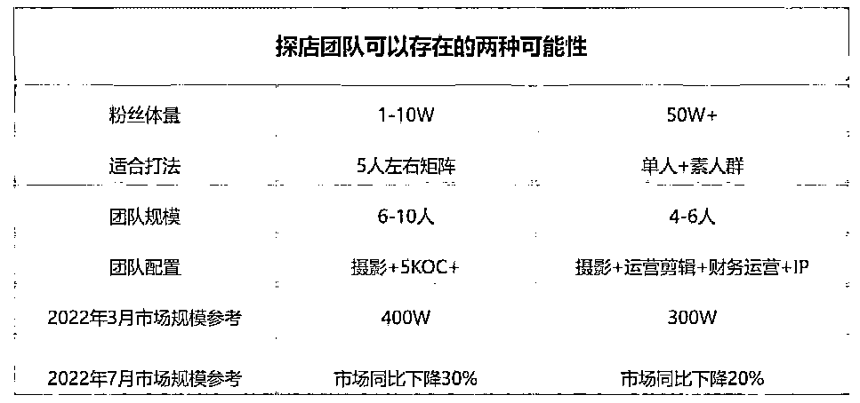

同时还是特别建议大家不要去接纯佣单子，一旦开始就是恶性循环，以后的价格拉不起来。

找服务商的品牌不一定有钱，但是主动找达人的品牌一定是有预算。那你要做好的事情就是，做好自己的专业，匹配对应价格。

**4. **品牌方的现状

（**1**）困境

第一品牌方自己去组织达人探店的效果是高于直播，因为交付在别人手里，可以提要求。

第二现阶段的大部分品牌最需求的就是到店客流量，但是自己又不知道怎么挖掘自己的核心爆品，怎么实现增长。

第三基本上都没有私域运营的能力，但是这一块私域流量获取的难度又是很低。

第四抖音引流到店的比例约 15-25%，怎么样延续流量的价值是很多品牌方的难题。但是抓到抖音这波机会的品牌方，只要是没有上头去做 GMV，都应该是有盈利的。

（**2**）入局建议

第一抖音外卖是可以考虑的一个点，多方面去触达用户。经营好就是自己的私域流量，当疫情到来时，自己的流量储备就是最大的底牌，至少保证不会亏损太多。

第二要学会做店内爆品，如果不会就找到自己品类的头部，跟着学，跟着抄也行。因为好的产品是自带流量进场，让你做生意事半功倍。

第三，创始人 IP 至关重要，有能力和时间一定要去做。因为这可以获得加盟、门店引流、吸引投资和技能培训等。

第四可以去白嫖服务商，实现纯佣合作。当然我前面也让服务商不接纯佣业务，这就是一个商业博弈的过程，看双方的合作怎么落地。

第五，电商品牌的本地化大有可为，这需要你们去深思，想好怎么构建新的场景。一旦落地，那就会拿到好的结果。

四、抖音本地生活的完整方法论

**1. **如何选品和组品

在选品这个角度上，我以餐饮为例子。

第一就是要挖掘出自己的核心产品，也就是行业的硬通货。

当门店平平无奇，那就是走超高性价比的方式推，那肯定菜品组合就是硬菜多，配合了蔬菜、汤之类的。

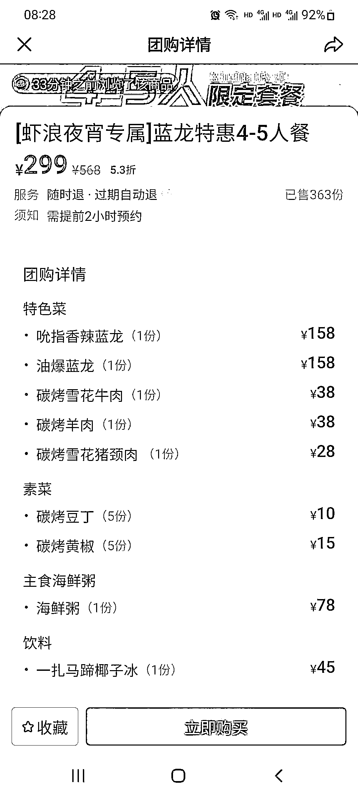

以上就是我们设计，我们会让套餐看上去很多，性价比超级高，看了以后很有冲动屯卷。

这种组合还会有好处就是那些不会视频制作的人，可能就是很差的画面+超高性价比的信息传播出去，一样能形成转化。

所以在选品阶段，是这种情况那就是空好成本，菜品上菜快，容易标准化，口味不多变，那就具备爆的可能性。

第二就是当门店具备单品特色，那就是单点打破，单菜品打爆，所有的营销动作围着来。

第三就是做应季或者是假日产品，这是商家基本上具备的思维能力，或者是服务商需要掌握的本领。

我举几个例子来说明：

案例一：所有情侣需要过的节日，鲜花店可以做特殊的产品，比如情人节的玫瑰花束、520 的草莓花、圣诞节橙子苹果花等，这些都可以通过控制供应链做出对应的产品，并且可以短时间内做出不错的销量，对于小团队来说其实是一个很不错的机会。

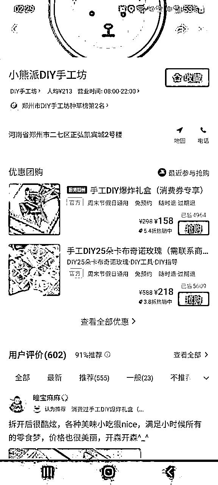

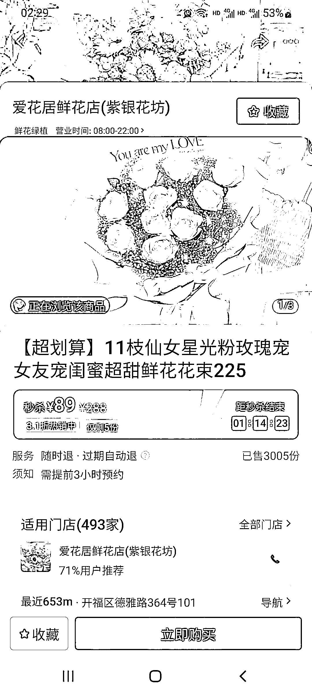

案例二：应季产品中可以选择每个月或者一个阶段的硬通货、爆品。秋冬季的羊肉汤、羊肉火锅和大闸蟹，这些都是很成熟的供应链体系，无非就是组建产品的能力。

在组货中，就是跟商家沟通，选品一定是有价格锚定的东西，下面的截图就是羊肉、大闸蟹，这些产品都是供应链产品或者是中央厨房供应的方式在合作。

第四就是当你的餐厅做不出高性价比，也没有特别好的硬通货，那再提供一个思路，就是蹭品牌或者是相关硬通货的热点。

我将举例来说明

案例：酒吧/小酒馆，直接选择百威、科罗娜等这些，在年轻人当中有知名度的品牌，组合店内的小吃做到一个高性价比的产品，话题可以带 #品牌词  ，从而去白嫖品牌流量和用户；

其次就是酒类 2022 年的大爆类目，精酿啤酒，大家都会认为这个品现在很高端、很贵，那么就可以做进套餐中，以一个流量套餐来推广。

第五就是当你的行业很内卷，从美团、抖音和其他渠道信息流都没有办法做出高性价比的引流动作，那么一定是要想着怎么用一个流量产品来加持流量进来，并且做到留存。

如洗衣咖啡店，用咖啡用户来做引流，从中筛选洗衣用户，并且拉高储值水平（咖啡店会员一般 200 元，洗衣店是 1000 起步），长沙有一个品牌—爱欢洗就是这么做的，并且我们帮这个品牌完成了抖音的冷启动（因为现阶段该品牌刚好换了套餐，当时的冷翠+洗鞋套餐没做到截图留存，所以此处就没有贴图示例了）。

以上就是 5 个我们一直常用的方式去做抖音推广，当然这其中可能还要配合场景出片好、流量到了能服务上、出品可以稳定供应，这些都是大家做大量增长要注意的点。如果我们是抱着拿结果，赚钱的方向，最好是不要偏离这几个选品和组品策略。

至于还有一些点可以做快速增长，但是不建议大家去采用，相对来说意义不大。如低价套餐，1 元喝可乐桶，1 元一只小龙虾套餐，这些都会引起用户反感，你在光明正大下钩子，秀智商下限去做引流。

如果实在是想通过这种方式触达用户，获取私域流量，那么可以拉高客单，严控供应链去获取流量，下面的小龙虾案例就是这样操作，并且每个月都拿到不错的结果。

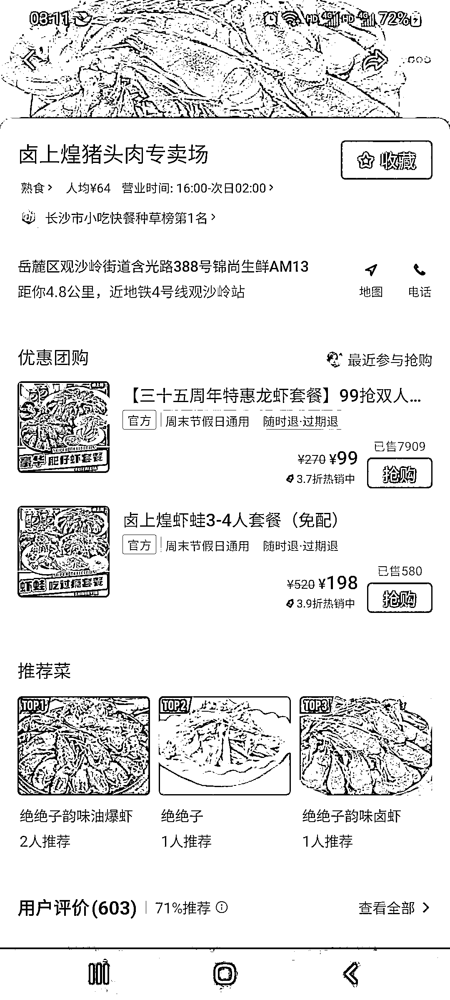

**2. **如何将**POI**加热

前面有说到抖音榜单现阶段比较核心的因素是用户推荐度和评价，其次是 GMV 和收藏等。并且在抖音本地生活有一个不成文的规定，那就是一个地址成为热门地址，你随便发一个视频，会比其他 POI 的流量更高，这是大家都心照不宣的秘密。

所以我们要把地址做成热门地址，其实无非就是视频足够多，那就是素人视频矩阵了。

一般建议在 100-200 条视频分发下去，一个地址的基本热度就上升了，好评率在 90%以上。

这一点上“空卡打酒站”就是按照我们思路做了调整，热度一下就上来了，这其实就叫 POI 加热，意义也在这里。

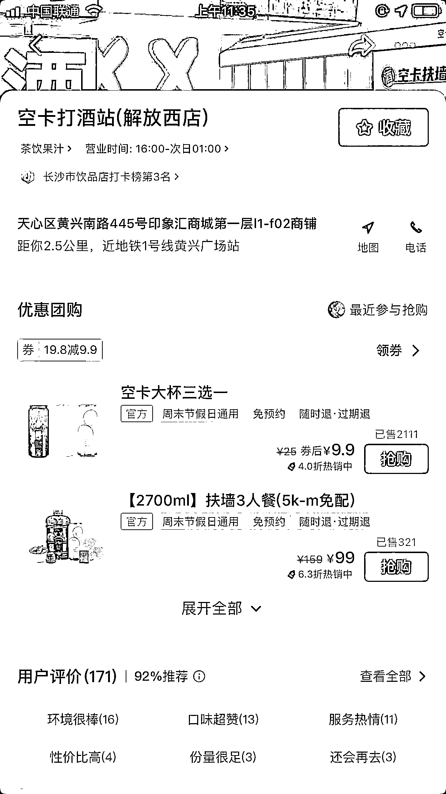

推广前后的对比其实特别明显，后期上达人效果会更好。这里也要提醒大家，当你的 POI 没加热，不要去贸然上达人，效果会很差，这也是我们成千上万次的经验总结。当曝光基数上去了以后，销售额也往上走，那么热度就是滚雪球。

这个阶段只要是靠着比较强的运营能力：

第一就是要注意推广的 POI 地址是没有问题的；

第二是确认团购套餐没有问题，每个套餐的标题也很重要，一定是一目了然，看着就有冲动点进去做选择；

第三是组织素人的视频发布；

第四是监督数据的发布情况，以及及时跟出错的素人联系，同时出现爆量的素人可以做一些投放加持。

这里说到的素人问题，肯定很多人会问到素人从哪里来。那就是涉及到招募问题，我们这边是一条视频的发布 5-10 元，没有设计分佣环节。

每个公司的运营基础不一样，那么跟素人的合作模式也可也有变化。前面有说到，我们是通过爆店码做了分发，但是我们现在已经换成账号托管和自动发布，这一块就是全程模拟人工在电脑端的发布。

至于为什么做的话，原理我这边就不做解释，归根结底还是为了素人的管理和发布及时性，还有就是流量相对比爆店码分发更加稳定。

当然这里还可以做一个拉升打爆几率的操作：在素人推广中，我们组织一批人购买团购套餐，大概是 20-30 单。

第一是做到有基础销量，第二是让系统知道产品在跑，是有流量转化。这个是我们现在运营相对来说比较细的点。

原理也有点像电商运营补单的逻辑，同理在后期的推广增量有限时，那可以在私域中做一部分导流，重新引发流量加持。

**3. KOL**和**KOC**的招募

达人的招募主要是看我们整体的想法，基本上可以从抖音私信、本地达人群里招募，最后一起拉到一个微信群做具体沟通，结算也可也在群里进行，文案如下。

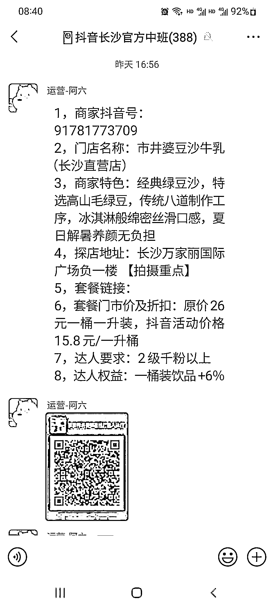

这属于一家店从 0 到 1 招募的一个阶段，基本上招募好，做好反选后，运营一定是规定达人给到视频审片，保证视频是没有做到糊弄。

这一点很重要，因为我们的客户很多，达人撮合也非常多，有些门店的审片没有做好，导致客户的不满，以及转化有限，这些都是很严重的问题。

这个环节我建议大家一定是要让商家运营的同事跟投放效益产生关联，有绩效的牵动，他们才会对视频质量本身提出要求和想法，最后的结果对大家都负责。

一般的矩阵组合是：100-200 素人矩阵+10-20 个 V3-V4 达人+2-3 个 V6 或者 V5 达人，这样有顺序的一套打下去是有声音的，经过我们这边的测算，流量持续周期大概 20 天，最长 30 天。当这一波流量结束了以后，也是需要采取下一步的动作，比如官方 IP 的运营、素人和 KOC 的持续更新。

矩阵推送的顺序为素人-KOL-KOC，其实这个过程经常会出现突发问题。下面从几种意外情况，需要做一些调整。

第一素人阶段门店就爆火，但是不能评估什么时候结束。

我们这边的操作就是判断素人的流量增长变化，一般素人矩阵平均是跑到 600-800，当达到 2000 以上时，大概率就是流量触底了，那立即安排 KOL 冲一波，等到 4-5 天，流量缓慢，再次以 KOC 的方式打爆。

这种情况，运营是可以让所有的账号都“@官方账号”，完成 IP 账号的一些流量和粉丝增长。

第二素人-KOL 阶段，大概是两块流量接近时，就会说明 KOC 必须上了。并且如果在 KOL 的阶段，ROI 没有跑到 2 以上，那就需要至少补单到这个水平，再安排 KOC 的轰炸。

另外说到门店达人招募从 1 到 10，文案和方式都一样，但是运营的顺序有要调整。

第一就是我们需要看此时的好评率大概是多少，POI 下面有多少视频，少了的都按照以上的标准进行补充，然后再按照正常的 KOL 和 KOC 招募，在运营选好的时间节点发布视频，在 3 天左右的时间，安排 KOC 的视频发布。

**4. **策划一场营销事件

事件策划一定需要提上日常，让更多人愿意主动进来陪你做传播，扩大话题热度，将你的流量性价比做到极致，以下是我们策划的两个营销事件：

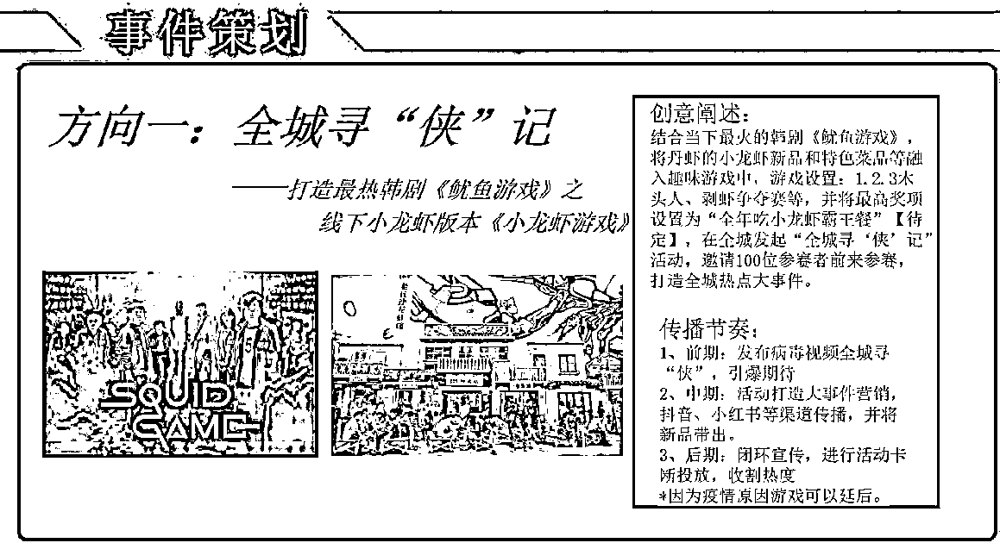 

营销事件的策划有几个角度去构思或者是提升。

第一就是你的想法和雏形从哪里来，如果我们不是大的营销策划公司，做这一块是非常吃力的，我的建议是需要及时抓抖音以前官方策划了那些很成功的事件营销，做一些留档，随时根据客户和季节的属性做一些匹配、调整，那这些就是你的一项很重要的能力。

第二就是可以多渠道获取这种营销思路，如从淘宝去买很多行业的营销策划案，还有一些内容分享平台的灵感，多收集一些，组合在一起就很容易找一个很适合客户的营销事件，并且这些都是经过大公司的验证，所以给出的东西，客户大概是满意的。

第三就是一定要根据客户的特点，核心卖点，以及季节或者是节日的属性，做一些对于的事件，让所有人都参与进来。

第四就是要结合每个时间节点，群众最爱什么爆点，你的营销思路往这块靠，视频发出去就能引发全员拍摄，你也能获得额外的流量加持。

**5. **素人持续铺量转化和维持好评率

当然随着视频的数量越多，消费人次也越来越多，当一个店火了以后，服务和菜品能不能跟上就是一个很大的问题。我们之前服务的很多商家 99%都会出现问题，包括我们现在投资的品牌。

那这个时候又会体现出素人视频的价值，主要是将好评率可能就是 70%的水平再次拉高到 85%以上，引导更多的人下单。好评率太低是会影响转化，并且产生退单，这一点很多品牌方都吃亏了，所以在最后的环节一定需要加一个素人持续铺量的阶段。

另外就是前期打出声量了以后，素人视频是可以持续做到转化，因为大家对品牌有基础认知了，当时不时刷到素人视频，可能就直接下单了。

说句题外话，这个环节也是需要多方面考虑。我举个例子，我们投资的虾浪因为上菜慢好评率只有 75%，转化影响很大，退单也高，但是我们没有太多餐饮实战经验。只能慢慢调整，好评率就一直没有拉高，等消化完这波流量，内部调整好以后再用同样的方法推爆。

所以这里就是 5 个抖音本地生活最重要的环节，结合我前面分享的经验，我会认为只要是互联网人都能领悟，都能明白怎么去完成前期的冷启动了。

五、抖音本地生活的从业总结

**1. **赛道深耕很重要

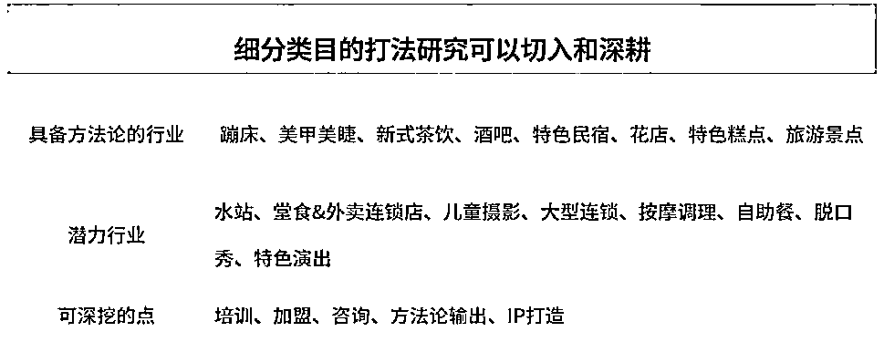

以上是我今年年初在群响做分享的时候 PPT 的一个预测，关于 2022 年哪些行业可能会火。也没出什么意外，在上半年其中很多品类通过抖音完成了不错的增长。

如美甲美睫，特色民宿，特色糕点，堂食&外卖、大型连锁、自助餐、脱口秀、特色演出、咨询加盟和 IP 打造。

赛道深耕真的很关键。2022 年 2 月-3 月，我们 3 人的 BD 团队，做足浴店的签单速度飞快，平均一天签单 6 家，我们 2021 年 BD 团队的招募平均三天签单 1 家，所以效率拉满。

下面我将从几个角度分析为什么值得大家去深耕一些赛道。

第一是见效相对做全类目更快。

因为做好了单店模型，团队就会形成初步的方法论，对行业有一定的了解了。类目刚上抖音团购，我们当时担心素人和 KOC 的账号限流，当时就选择让一个 80 人的服务团队的足浴店，全员成为我们的素人矩阵。素材也相对简单，就是每天拍漂亮技师小姐姐的跳舞视频，瞬间就在区域吃到了流量，并且完成增长。

第二是容易形成系统的方法论。团队在做成这件事情以后，就会拿着案例去 BD 其他门店，于是拓展到 3-5 家基本上方法论就形成了，那么你就成为行业奇兵，拿下业务就是理所应当了。

第三是赛道深耕是可以突破地域的限制。

因为在服务端很多时候都是可以在线上进行，因为工作就是拍摄、达人撮合、团购套餐设计和上架，只需要 BD 做好客情关系维系。这种就可以让 BD 逐渐往外跑，不断的拓店、复制，突破地域限制，并且不用担心一个城市客户太多，流量分散，导致一个都没有服务好的情况。

以上三点都是赛道深耕最快最直接的效益，大家想明白了就可以切入。

赛道深耕的变现途径多元，并且持续。赛道深耕其实真正做的是行业的解决方案，最终就是行业的营销专家，这一点对于服务商来讲意义大于做一个简单的本地生活服务公司。在变现层面上，这种方式走的更远更久。

第一行业做深了以后，全产业供应链的蛋糕是可以吃到。

因为这条线上可以涉及到品牌服务、金融供应、设备供应、原材料供应，你只需要在某个环节切入，并且做到跟商家的深度绑定，那这种效益就是长久的。如烘焙店，你的流量服务是配套设备，那增长点是做好设备的收益，补贴品牌服务，这一点的想象空间无限大。

基于本地生活的流量红利，吃喝玩乐只是很少的一部分，还有很多高毛利的行业可以去渗透，一定要打开思维。

第二规模化可以很迅猛。目前阶段实体行业的类目服务商，很多还处于比较初级阶段。当你掌握新媒体端的营销方法论，可以去绑定这类服务商，他们的客户资源和行业沉淀是一个很好的互补，这种新型的商业模型是很快做到分公司经营，快速起量。

第三垂直领域链接到的资源无法想象。如果你的团队走过了第一个阶段，真正在垂直领域发力的时候，你所链接到的基本上是行业协会、商会、头部企业和分管部门的资源，这一块你去建立盈利模式、拿资本放大的机会都会挺大。

**2. **策划能力很关键

策划能力很重要，其实我已经说过不下 100 遍。这种能力是需要互联网思维，传播角度和营销思维都要融合一起的，一家公司有这样一个人，那就可以孵化出一个本地的头部传媒公司。

这种策划的能力主要是体现在宣发端，比如餐饮这一块，就需要这块的负责人去解析品牌的亮点、故事和爆品，然后结合你的打法做一个事件营销。

在长沙有一家老牌机构，头等传媒，他们的创始人就具备这个能力，做出了很多漂亮的案子，所以经过多年的深耕，成了本土最大最久的本地生活广告传媒公司。

另外长沙的五溪红小子，今年在做宣发的时候就是简单策划出“#麻辣小龙虾变装”，配合场景化的冲击，其实就获得了千万级别的流量加持，以及不错的销售增长，这一点也不用在新的灵感上想太多，而是可以从前人当中学习、改进，一样能够获得流量。

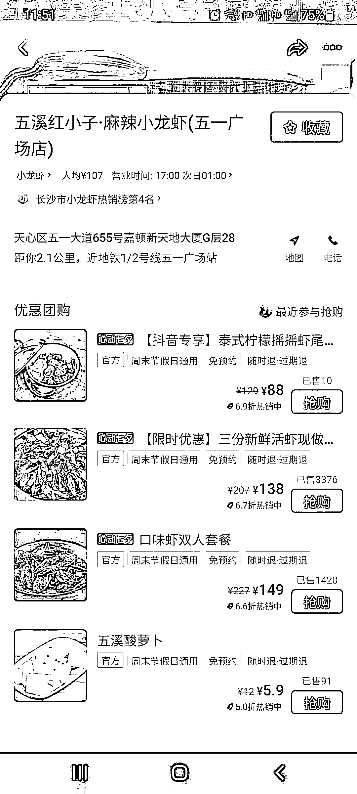

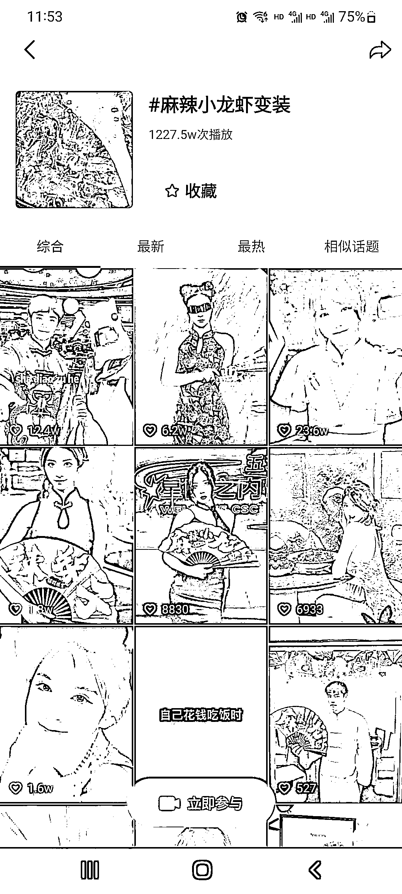

以上的策划还是停留在初阶的水平，但已经是可以做到给品牌方不错的交代，这也是可以作为很不错的案例。

如果从更高维度上去延申，那就是品牌策划的介入，互联网策划公司转型在这一块是有机会的，传统媒体是需要这种能力的加持。

第一，在品牌方的合作内容中，可以根据品牌特点，做全年的营销策划，品牌定位、传播和规划，这些都是现在的新消费品牌的弱点。

第二，很多品牌只会做大曝光和传播，但是在流量的转化是存在问题，流量的运营、留存，渠道和平台的规划都是没有清晰认知。

第三，策划的能力还包括品牌营销闭环的调整，你在做好所有的营销策划，一定要给他们方法或者是建议去让他们有更好的商业闭环。

行业类目：美甲美睫

品牌人群：18-30 岁女性，学生、白领为主

盈利方式：短期做美甲美睫和美容项目维持基本营收，中长期是从这块流量入口中转化一部分做医美项目，实现大增长。

人群需求：爱美，喜欢 CBD 远望的景色，喜欢拍照打卡，爱吃但希望是健康

匹配到的场景：写字楼靠窗的门面，有座位看到外面的车水马龙，服务套餐是美甲美睫搭配养颜茶饮和高颜值轻食糕点，配合拍照服务。

**3. **场景构建值得去深思

场景构思很关键，非常重要，这是新消费品牌下次增长的关键。因为涉及到电商品牌的本地化，老品牌革新等，举个例子现在的洗衣咖啡店就是构建了新场景，tea stone 构建了产业链的新消费场景，这种推起来就有机会，而你只需要在这里去想怎么突破。

有了基本的场景构思，那就需要去做一些落地的事情。

第一，你需要了解品牌的客群是谁；

第二，了解到这部分客群的需求，看怎么嫁接新的流量产品进来；

第三，那就是按照以上 POI 加热和达人撮合的方式推爆；第四，如果有能力，那就是私域的运营了。

关于这一块场景构建，我举个例子。

这是一个新的美甲美睫品牌，方法马上落地，我提前给大家分享这个价值百万的概念。

获客方式：抖音、美团、高德，后期全程私域运营。

这种组合拳的一套打下去，肯定是有声音，并且是对传统美甲美睫行业的降维打击。个人的预测，这种类似的场景组合会越来越多，完成增长，拓店速度会越来越夸张，并且互联网的下半程，一部分人就会扎根在类似的赛道中疯狂吸取流量。

抖音的本地生活红利很难超过 3 年，现在已经过去 1 年了，那么入局的你，一定要想好了。

评论区：

老张运营 : 哈喽，楚总，方便留一个联系方式建联一下吗？我们公司在长沙目前刚入局抖音本地生活这块。

楚川 : 抖音榜单的组成已经有更新，我在朋友圈有更新，后面在生财也发一份。另外 poi 质量分也出来了，都是能够拿到一些意想不到的惊喜。

楚川 : 私信我

Kuki : 楚总真的太厉害了，膜拜，要是能收徒就好了[玫瑰]。

楚总，我们这边也是做抖音本地生活的，但是做了两年，交付能力太差，可以再跟您细聊吗？

楚川 : 深度沟通一下

雪樵 : 内容非常实用，如何联系您？向您学习[抱拳]

楚川 : chuchuan2020

亦仁 : 感谢分享，已加精华。
