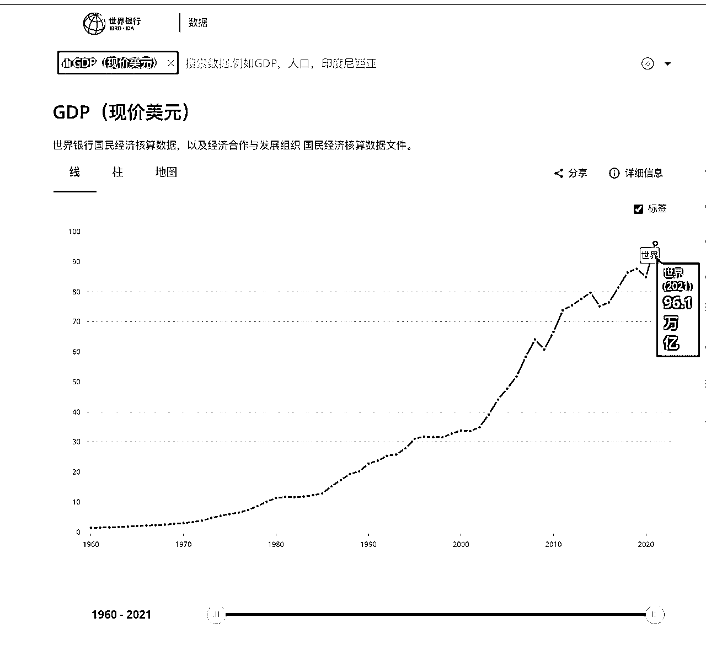

# 4.1.1 几个你不知道的金融事实

前面的内容中，有和大家讨论过一个问题：有哪些问题是 Web3 能解决，但 Web2 不能解决的？

这个问题的提出的背后思维框架，还是把 Web3 盯到到了互联网的范畴，我觉得可以格局更打开一些。

Web3 目前为止，主要解决的是金融的效率问题。基础盘，和没有触及金融的互联网，不在一个量级。

下面是世界银行 2021 年统计的全球 GDP，将近 100 万亿美金。互联网的产值，在不触碰金融这块领域的情况，是一定不会超过这个金额的。实际，当然要比这个小的多。

各国政府广义发放的货币，在 2020 年，大概是 GDP 的 1.4 倍，我估计这两年疫情大放水，实际的数据可能是 GDP 的 2 倍。假设是 200 万亿美金。

看到了这两个数据，就应该明白一个这个世界的事实：只要有金融体系在，资本收益必然大于劳动收益。《21 世纪资本论》这本书通篇讲的也就是这一观点。

全球有 17 亿人口还没有银行账户。

第三世界的自己国家的金融体系弱不禁风，很多国家的货币汇率波动幅度比我们国家的股市还要大，常年恶性通胀。全球几十亿居民没有可靠、方便、便宜的金融服务。

全球外汇交易金额每年是几十万亿美金的市场，全球跨境现金汇款转账+外汇兑换的摩擦损耗近 10%，在一些不发达地区，可能要几个工作日才能到账。

这些问题，都是有待解决的金融问题。

拓展阅读：[《新形式的数字货币：对货币和金融稳定的影响》](https://www.imf.org/zh/News/Articles/2020/10/30/sp103020-new-forms-of-digital-money)

目前 Web3 的两大基石：区块链技术和金融。区块链技术算是密码学和计算机的分支，但各类金融产品，在 Web3 基本全覆盖了。

所以这一章节，我们就来初步了解一些 Web3 的金融概念和产品。

在 Web3 我们将金融称为去中心化的金融，英文：DeFi。