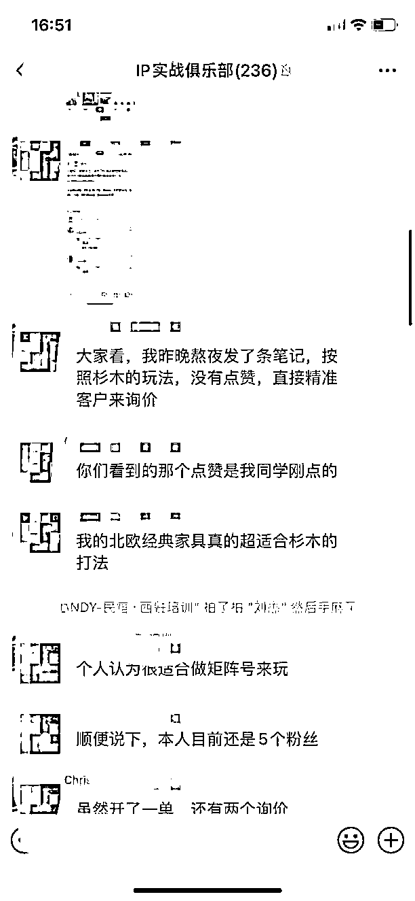
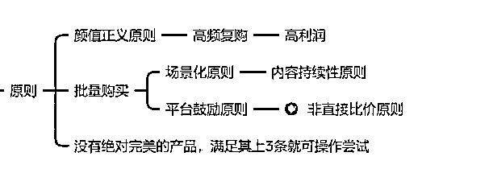
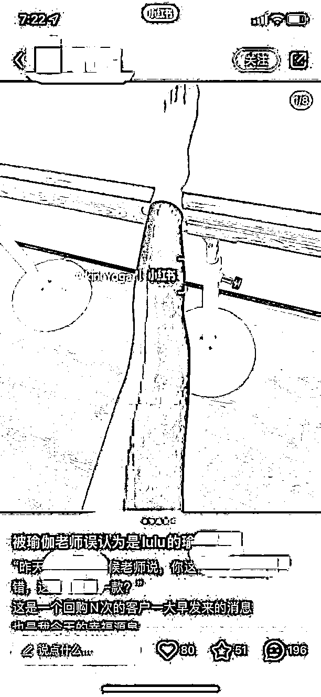
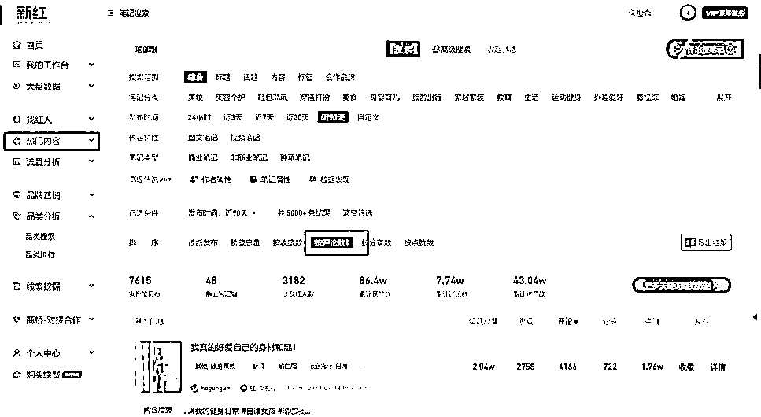
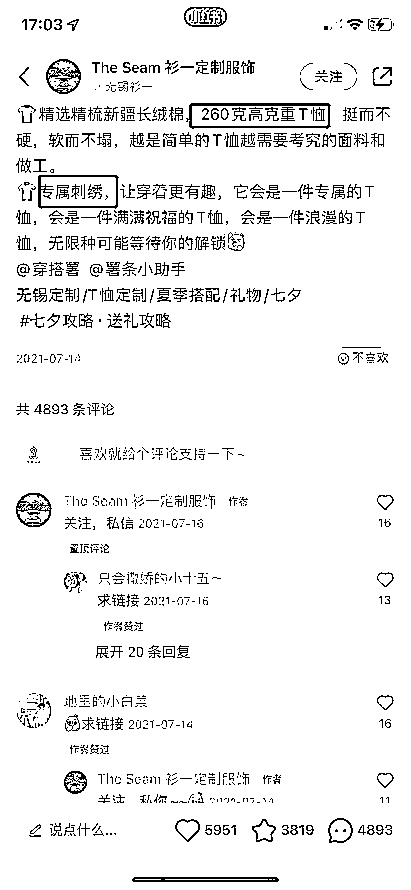
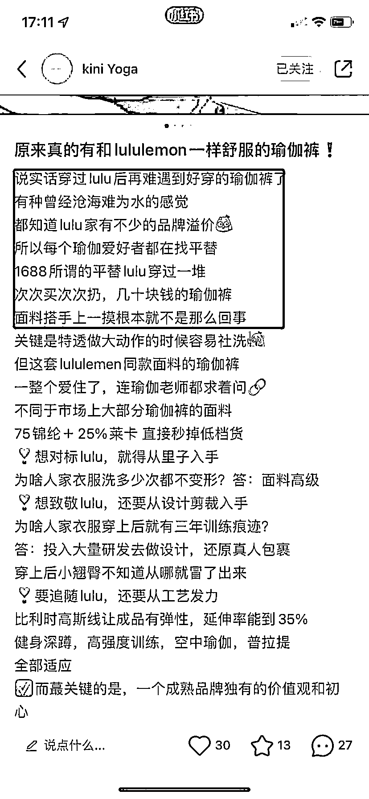
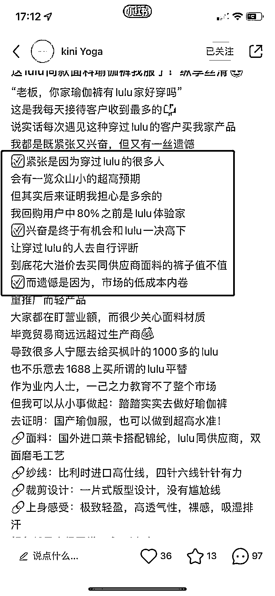
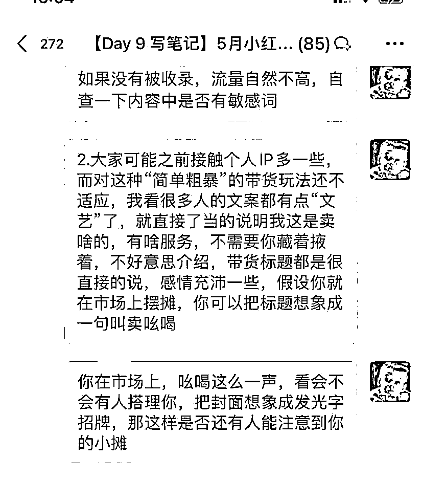
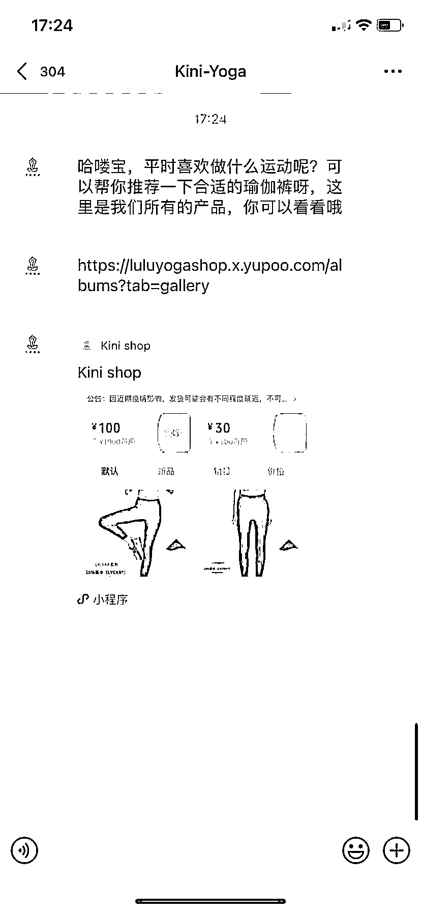
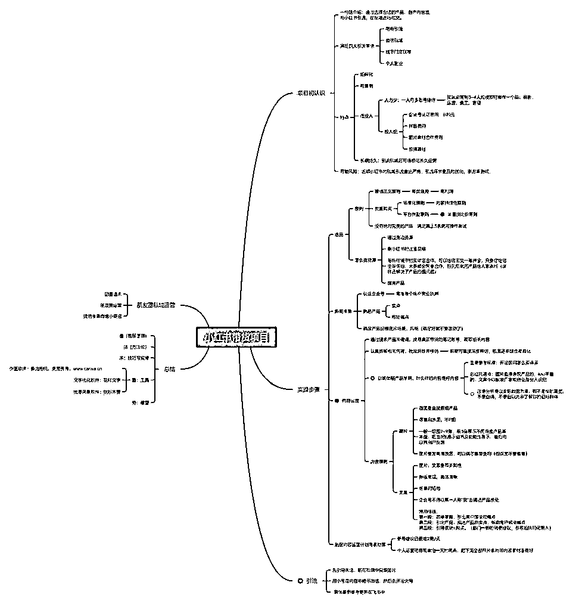

# (精华帖)(387 赞)我是如何通过小红书，两个月带货营收 30 万＋

作者：  杉木

日期：2022-06-08

（淘宝某天店铺数据，还有大部分在微信成交）

知乎转战小红书，从**0**开始小红书征程

大家好，我是杉木，坐标山东，99 年生人，大学期间一直在知乎平台比较活跃，之前做过知乎带货，有一个 3W 粉丝的大学生领域账号，一个 2W 粉丝的美妆账号，也做过带货，最佳战绩是在知乎好物蜜月期的时候，操盘过某品牌的推广项目，两个月内在知乎 GMV 做到了 80W＋

 

 

第一次开始接触小红书是在 22 年的年初，在之前我甚至都没下载过这个平台，说明一下，我是一男的，我之前的认知里小红书是女生玩的玩意儿，原谅我的偏见，但其实到现在小红书平台的男女比例仍然处于非常不均衡的状态，这其实之中蕴藏了很多机会，下面我会讲到

初尝甜头，继续深挖小红书

我第一个小红书账号，还是延承了我做知乎的很多东西，做了一个大学生领域和一个美妆领域的账号，让我感到神奇的事是，这两个账号都在第一周变现了，一个 4000 多粉丝的美妆账号，接一条合作价格 2000 左右。美妆账号在小红书很容易变现。但要知道，我在知乎赚到的第一笔钱，是做了知乎快半年之后的事...

账号展示给大家，这两个账号还是朝着个人 IP 的方向去做的，走的专业路线，可以说是有点知乎风的小红书账号，这类账号如果大家有稳定的内容输出能力，而且对某一领域又比较专业的话，还是比较建议大家去尝试的

 

 

 

 

当然，这不是今天的重点，而且我认为做个人 IP，并不是适合每个人，有一定门槛，收入是“看流量吃饭”但是每个普通人都值得去尝试，任何成功都离不开传播，自媒体是普通人实现阶级跨越的捷径。

个人**IP**的打造我在**@**花爷**@**那里学到很多，我也是他**IP**实战俱乐部的一员。上个月在花爷内部分享这个小红书带货后，有几个人很快就有了反馈

 

 

 

 

今天主要分享的主题就是小红书带货的玩法，从做到现在也就两个月的时间，做出过曝光 50 万＋的内容，0 投流的情况下，私域精准引流 3000＋客户，营收超过 30 万（我这个产品的利润能做到 60%）

我带货的这个产品在之前完全是 0 认知，全程单人操作，所以这个玩法我认为具备普适性，低成本，可复制等优势

我给这个项目起个名就叫小红书矩阵化带货吧，一句话概括就是通过低成本的图文内容制作，直接展示想要卖的产品（或服务），通过你的内容，引流最精准的流量，从而实现带货变现的目的

流量有多精准？我随便截一个后台的私信图片，都是直接问怎么买的强烈购买意向客户，消息回到手软那种...

 

 

 

 

我拆解一个项目玩法的全部，喜欢从道、术、法、器、势五个方向，今天做复盘，自己拆解，也从这五个维度来吧，文章读完后大家也可以自己往这五个方向套，这样会加深印象~

道：基本原理  ；术：方法论  ；法：具体操作方法；  器：辅助工具  ；势：机遇

先把我操盘的账号展示给大家

（打码主要是担心过多人搜索给账号造成影响，我会告诉大家我做的产品，也会在下面展示一个账号）

 

 

一：**/**小红书矩阵化带货的**“**道**”/**

从我上面分享自己的一批账号大家首先能观察到的共通点就是：

 

 

都开通了小红书企业号，且为矩阵化运营

为什么要开通企业号？

小红书用户的目的就是狩猎好物，企业号可以直接通过展示产品来吸引目标客户，就可以把企业号理解成一个虚拟线上店铺，这个店铺可以直接摆放产品，直接叫卖，是交了入住（baohu)费的。

而个人账号就像没有执照的小商贩，是要被城管（官方）随时赶走的...更别说叫卖了

总结下小红书企业号的优势：

内容创作更加直接，缩短变现链路，开通即可投流，营销工具多，运营成本低，引流很精准

PS：企业号并不是必需的，如果有营销需要，建议开通

什么是矩阵号，为啥要做矩阵？

矩阵号带货说人话，就是一批货通过多账号运营，比如这样子的

 

 

 

 

二：**/**小红书矩阵化带货的**“**术**”/**

矩阵式运营是建立在你单账号搞明白的基础上，所以建议大家先从一个账号开始练手，在这个过程中，熟悉流程和内容，尽早生产出第一篇数据好的内容后，开始往矩阵方向发展

矩阵主要是为了对抗平台的不确定性，降低内容运营成本（因为图文内容生产的边际成本很低，多开账号确实均摊到每个内容上，成本会降低）

更大的优势在于：大力出奇迹，在你内容技巧达到及格线后，剩下的爆文因素很大取决于：运气是一个概率游戏了（当然，在你第一篇爆文出来前，就是能力层面的，主修内功）假设你可以做到 20%的内容可以达到“爆文”标准，那 100 偏内容和 1000 篇内容产出，对应的是 20 和 200 篇爆文。可以类比做电商的店群思维。

在实际运营中，80%的意向客户基本都来自于“爆文”所以我们应该想办法尽量早的产出第一篇“爆文”找到感觉后再尽量多的产出“爆文”

** **

适合普通人操作的小红书带货玩法

关于选品

如果我们把这个项目拆分为两块，一块是内容，一块就是电商

 

 

每个电商人都知道，选品是很重要的一环，什么样的产品适合在小红书做带货呢？

先说明，没有十全十美的产品，不要在选品这一环节犹豫太久，优先选择自己现有的靠谱供应资源，很多产品只有你试了才知道行不行

大家可以从以下几个方向选品，比较容易快速得到反馈：

①：功能性半标品，代表有：瑜伽服（我带的产品就是），防晒服，这一类一般满足人某一需求，防晒，减肥，都是真实强需求。

②：红海市场中的蓝海：一般是只满足于特定人群的红海产品，例如专注于大罩杯 or 小胸的内衣，专注于小个子的女鞋。

③：美妆护肤品，护肤产品大家有货源且资质齐全，非常建议在小红书上带货

④：自带流量的产品：例如，情侣内衣，JK 服，汉服等

⑤：某大牌平替：帮用户省钱，但又能买到质量差不多的产品

⑥：新奇特且有真实需求的产品：光新奇特支撑不了转化率，有真实需求才行

⑦：知识付费类：具体到一个明确的项目，但又不是其他平台培训的（你在小红书写抖音赚钱肯定官方不给你流量的），或咨询服务类。

除此之外产品尽量满足其下几个原则中的其三

 

 

除了常规的选品思路外，再提供一个方向：蓝海产品，这点@陈铭老师文章在之前的文章中讲到过，蓝海思维@盗坤老师多次提及，我受益颇多。蓝海也就是竞争相对没有那么激烈的市场，比如开头我说道小红书男生比例少，但这也是一机会，太多品牌争夺女生的市场，但对于男生市场忽略，但比例再少基数也在这摆着，也有千万流量的级别，一些男生用品反而没有那么多的竞争，可以考虑一下。

再比如一些小众领域但又客单高的产品，定位于高端客户的服务也属于蓝海，像前几天我刷到过一个产品叫焚火台，属于户外露营用的，这个产品做的人也很少，得益于露营的热度近期流量不错。也是一个不错的选品。

还有一条大原则是不管做啥类目，我建议产品在小红书上都要走中高端路线，要敢于给你的产品开高价（当然高价前提是有比较突出的卖点，不能无缘无故的贵，这个需要精准挖掘到用户痛点）

如何寻找货源？

我们这里说的普通人指的是没有货源的朋友，像我一样，一定要走无货源一件代发模式，不要囤货，你可以选择自己在网上找供应商，或身边朋友的资源，比如生财社群里就有很多老板，自有供应的资源。

 

 

再就是与线下店合作，比如我在做瑜伽服之前还尝试过眼镜，我就找我附近的一个眼镜店，给老板娘说明来意，我说我需要的是你的产品，用于拍摄素材，用完就归还，多次少拿，不影响你做生意。而我可以给到你的是我拍摄的素材，老板你可以直接发朋友圈，另外我可以在内容上挂上你的店铺位置，可以帮你引流。

我当时就找了一个眼镜店，老板非常乐意合作，并没有收任何押金，后面因为瑜伽服这个品类明显跑的比眼镜快一些，我砍掉了眼镜。

找供应资源的核心在于：万物不为我所有，但万物皆为我所用

** **

开始带货之前，我们还要准备什么？

到这里，我们已经准备好账号，找好供应渠道，就要考虑内容了

在开始内容生产之前我们还要做这三件事：

 

 

**1.**确定内容展现方式，找到相对低成本的内容形式

**2.**确定内容制作基础模板

**3.**搭建好私域或淘宝店铺

我来一个个说，先说内容展现形式，这个非常重要，关键在于如何找到真正能赚钱的笔记，再强调一遍，是能赚钱的笔记，而不是数据好的笔记

我很喜欢马斯克的第一性原理模型：回溯事物本质，重新思考该怎么做。

而找到真正能赚钱的笔记，并做对标，这就是我们做小红书的核心

再例如电商的核心就是选品，做自媒体的核心就是内容。核心只占系统的 20%，但是解决了它就是解决了 80%的问题，找赚钱笔记这点@徐冬冬大佬这篇文章对我的启发很大 https://articles.zsxq.com/id_61nswd110ikb.html

在大家认知里出爆文＝能赚钱，这是错误的，比如我下面这篇笔记，数据上看只有 80 个点赞，绝对算不上数据好，但看评论区有快 200 多个直接问“怎么买？”“有链接么”的精准客户

这一篇笔记可以带来至少 500 多精准流量，转化掉一半不成问题

 

 

再强调一遍，我们做内容带货，终极目标不是为了出爆款，而是为了精准客户，不要把两者划等号。那些爆款如果带来不了精准流量，是完全没有任何意义的数字

 

 

我们再来看一个下图的反例，同样是瑜伽服，这个也是企业账号，这篇笔记单看主图好像比上面举例的好，模特身材很棒，数据看起来也不错，点赞 171，但评论区只有 8 个评论，而且这 8 个都不是冲着产品来的。我注意了下这 8 个评论全是男的，冲啥大家应该也明白。。。

 

 

 

 

为什么会产生如此大的差距？

内容中，用户需求与痛点是否能准确把握是关键

拿上面举得两个例子说，瑜伽服的购买群体主要是女性，他们更关注的是瑜伽服上身效果，包裹性如何？弹性如何？面料怎么样？等，而不是你的模特白不白，屁股大不大，性感不性感，这是 LSP 关注的东西，所以做带货内容不要内容上用力过度，你只需要把你的产品卖点在内容中兼顾到就可以了，不要你觉得，要让用户觉得，这样才能吸引最精准的流量

如何找到真正有价值的笔记作为对标？

我们最应该关注的点在于：评论区，这是真正能反馈出用户对内容的态度的

用户点赞，收藏你的动作只能说明：我认可，我喜欢，对我有用

而评论是带有明确目的性的，尤其是直接带货的内容，一般评论都是有强烈购买倾向的：我要买

来看下真正带货，能引流带货的笔记评论区长什么样

 

 

如果是引流，知识付费咨询类，评论一半长这样：

 

 

 

 

如何挖掘出这类笔记呢？

刚才我说要看评论区，第一个评判标准是赞评比（赞同数：评论数），我一般找那种比例比例接近 1：1，甚至于 1：2，总之就是评论数越多越好，而且评论内容直接表明购买意向的内容，这种我建议大家用最笨的方法去找，看你要做领域内容的大量笔记，然后不断挖掘

不建议大家上来就借助工具走捷径，因为这个过程值得我们花时间

而且你在找这种笔记的过程中，就会逐渐感知到你要做的产品的卖点，从而对内容方向更有把控，还可能会有很多意外发现

我们把这些笔记全部搜集下来，注意在挖掘这种笔记的时候，最好点开主页看下账号其他内容，因为一般一个账号他一篇笔记好，还会有别的类似内容，如果是他篇篇笔记都是如此

恭喜你，发现宝藏，建议你把这个账号的全部内容认真搜集下来，这个可以借助工具爬下来，淘宝上有类似工具。

也可以借助小红书数据分析工具：蝉妈妈，新红，我以新红举例吧

 

 

在热门内容选项键入你要做的类目大关键词，然后按评论数排序

不要按照赞藏数，赞藏只是糖衣炮弹，对于带货笔记来说没有参考意义，而评论数据可以，找那些评论多，且直接问产品链接的笔记

 

 

借助数据工具，我们也可以找到真正的热度词，在文案中植入，增加内容的搜索曝光

说白了就是蹭热度，主动 Search 的用户会高频次地使用小红书的搜索功能，特别是在品牌集中增加营销投放或是有新产品发布等较大事件时，小红书内关于该品牌的搜索量会明显上升。“大家在把小红书当搜索引擎用”，这是众多小红书用户的心声。

那我要做的就是借力，比如今年瑜伽服品牌 lululemon 热度很高，甚至于 lululemon 这个关键词的热度，要高于瑜伽服这个品类词，那我们就可以在文案中多次植入

我们找到这类笔记后，全部搜集下来分析他们的文案，除了发现这些笔记展示到的核心需求外，主要体会高询单内容的情绪价值。

 

 

说实话，这个需求如果光靠感觉去找的话，就算你在这个行业浸润了多年，你也很容易误判。所以一切要以实际笔记的反馈为主，而不是你的直觉，凡是评论区一堆人在问链接问怎么买的，那一定在内容中涉及到目标客户最关心的点。凡是评论区七嘴八舌的，就算再高赞，也是瞎热闹罢了，切记：

找到能赚钱的笔记，而非看热闹的

终极目标不是出爆款，而是精准客户

我做小红书是为了赚钱的，而不是为了高赞内容

也可以把这个当成一个选品标准，比如这个 T 恤这个品类，属于红海市场，竞争很激烈了，但是我们看到这篇笔记有 4000 多个精准询单，完美符合我们要找的高质内容笔记

 

 

 

 

那你肯定要问个为什么，通过分析他的文案和产品，我们可以得到结论，之所以有如此大的询单量，就是因为这个衣服：高克重，专属定制的卖点

说明市场急切渴望一款这样的 T 恤，所以我们也可以在找这类笔记的时候，发现一些值得做的产品。

除此之外，也要考虑内容制作成本，矩阵做号的要量化好每篇内容的生产成本，对成本有个清晰的概念，其实我们在找赚钱笔记的时候，也是在对比成本，专业的布景，玩味的文案，讲究的图片构图一定对应高成本，但高成本一定对应高询单么，未必！刚才我举的瑜伽裤就是鲜明案例

（我的内容成本是不到 20 块钱一篇...）

我们不论在小红书还是抖音，都能看到很多低成本高产出的经典案例，内容营销的魅力就在于此。如果你想效率更高一些，其中很多环节其实都可以做 SOP 流程化，压低时间成本，拿拍摄和写内容举例

 

 

我一般会在周六日把下一周要发布的素材全部准备好，拍摄如果找模特去拍，最好是在同城找，提前把拍摄注意事项和案例整理好发给模特，免得拍一堆废片浪费时间，另外完全没必要找专业模特去拍，也没必要后期处理照片，这不是拍淘宝主图详情页。小红书无论是平台还是用户，都更喜欢真实分享，效果反而更好

**/**三：小红书矩阵化带货的**“**法**”/**

 

 

流量当道，内容为王：这样做内容，低粉也能高变现

其实刚才我们做的一系列工作，都是为了内容这一步在做准备

内容生产也可以流程化，这样可以大大提升内容制作的效率。比如我的内容，图片是有共性的，基本每篇笔记的一组图里，都会有产品整体展示图，细节展示图，客户反馈图。文案上也有大量共性。我一天可以生产这种内容 10 篇以上。

我们前期在确定内容模板的时候可以多试几个，某篇笔记高的话就一直用这个就行。不要觉得是不是发多了就限流了，不会，这点放心好了，只要你内容不完全重复就行。

小红书图文内容可以分为：标题，图片，文案

先说标题：分享一个企业号起标题简单粗暴好用的方式，直接套用数据比较高的带货标题，比如我现在去小红书随便找一个标题

“挖到宝了！！这颜值实用双在线的婴儿车真香”

我们要做的是套用这个模板，填充上我们的产品关键词和卖点关键词

所以我要用这个标题就是：“挖到宝了！！这 lulu（热度词）同面料（需求词）瑜伽服（产品词）真香”

再来说文案和图片：

 

 

企业号的文案是比较灵活的，可以直接写产品，也可以从创始人的身份，写自己的创业心得，从故事引出产品，我建议大家可以多试试后者，文案中除产品介绍外，加上自己的价值观分享，对行业的思考，或者与客户的趣事，客户的真实反馈等.

注意：企业号是不可以用第一人称“我”的口吻去写产品使用感受的，否则平台会给笔记限流

下面是我总结的一些图文制作小 tips：

内容这块核心还是对标赚钱笔记写，这也是为啥我在找对标赚钱笔记花了如此多笔墨，因为这真的很重要。这里分享一个我认为最能调动人情绪的，最容易产生询单的：故事体文案

 

 

爱听故事是人的天性，尤其是在女性用户比例如此高的小红书平台，故事是调动你文案情绪的催化剂，一个好的故事可以既能引发讨论吸引流量，又能对你新人吸引精准流量导向付费

下面这几个点，是我总结出来的一些高询单内容的秘密，另外整理了几套内容模板供各位参考

一切都要围绕：让用户感觉到你是为他好，替他考虑，牵着用户的情绪走，再强调一遍：

感觉很重要！！

**①**：说出用户最深的痛或（喜），比如这个行业市场价格不透明，比如某知名品牌溢价太多，很多人消费不起，我这是厂家直销，同质量的东西。

再比如我从某厂辞职创业，某厂剥削严重，出来独立创业巴拉巴拉。当然也可以说“喜”也就是大家都认可的观点。

写这些是为了引发强烈共鸣，一般放在开头，你要让用户读完后有：的确如此！那就达到目的了，这样你就和看客统一“战线”了，咱们是一伙的，下面我再说啥都是为了你好，形成了基础信任。上次分享种大家做市场调查其实就是为了做这一层铺垫，抓住用户真正的痛点

比如：

 

 

 

 

**②**：顾客证言：客服和顾客的趣事对话。这个故事最好一波三折，用对话式让情景再现，可以从中穿插客户对于产品的好评反馈。案例：

PS：挑选出顾客证言并不难，关键是证言是否击中用户核心需求

 

 

 

 

**③**：写自己的价值观：可以提出一条脍炙人口且表明你产品价值观的 slogan，聊初心并在不同内容中反复提及（注意 slogan 别整的跟大牌一样喊口号，像什么 just do it，来点实际的）

 

 

**④**写销量

 

 

“利⽤⼈们的从众⼼理，明⽰或暗⽰产品‘畅销’，不但能激发购买欲望，还能赢得读者信任。”有基础销量的直接写卖了多少，没有的就写高回购率，卖的快，注意要量化到具体的数据。

**⑤**语言上：多用小排比，押韵的手法，

 

 

小学语文这里就用起来了，我们都知道排比句的作用就是：情绪递进，而且文案会有一种和谐节奏美，情绪递进，读起来更丝滑一些，尤其是在小红书这样的短文案中效果奇好举例：

 

 

 

 

**⑥ **用沟通的口吻而不是你自说自话，单向表达

情绪得让读者感受到，才是成功的，别把自己写嗨了别人看完一脸懵逼，哪来的感觉？

虽然不能用第一人称（消费者角度）直接描写产品，但是在写这类内容的时候，还是要以一个具体的人，比如公司客服，创始人的角度去写。

**⑦ **真诚，要贯穿你文案内容的每一个字词。

真诚的文案是是能感受出来的，你不需要多么华丽的辞藻，但是一定要走心，不要死套模板。

**⑧ **找到合适的机会介绍你的产品，引导下单

 

 

企业号是可以直截了当，不拐弯抹角的直接写产品和服务的，但是你要确保你的产品相对于同行，要么价格更低，要么东西更多，要么比市场的之外有其他额外的服务，如果没有明显的差异化，还是建议从故事角度切入。

再来说下排版，这也很重要，再好的内容阅读体验差，别人都读不下去，效果肯定不好

 

 

排版要干净，利索，善用小表情符号，多用短句代替长句，整个文案写完后自己再读一遍

逻辑要顺，阅读体验流畅。切忌大量文字堆砌，我一般都是一个句子一行，文案字数不宜过长。

展现类笔记可以无文案，或 100 字左右的短文案介绍产品卖点

故事类笔记文案字数建议控制在 600 字左右

最后来说下企业号安全引流和成交

① 先引导关注，私信，在私信里回复图片

示例：

 

 

 

 

话术参考：

  +关，底下扣 1.撕你们入口哈

点/囋+关/注之后，给薄/主发个肖/息，系统会自动回复[飞吻 R][飞吻 R]想要的小仙女们，点👍＋关🐖底下评论：111 銯信我怎么买，自动获的入口~

私信回复模板案例：

 

 

目前这种乱码图片的，监测到的风险相对会小一些。

注意同一内容如果频繁回复，就会触发系统的监测，所以回复图片要多准备几套，换着图发

②第二种引流方式是准备一个小号，企业号和小号打配合的方式

 

 

 

 

 

 

如何提高私域转化率？

提前搭建好你的私域，这在你内容生产之前就已经开始做了，所谓晴天修屋顶

私域沟通技巧

加到我们的微信后，通过好友（如果流量较大建议直接设置为加我好友时无需验证，否则容易显示添加好友频繁）欢迎语要固定下来，欢迎语建议以问题开头

问句可以有效破冰，从而很自然的引出你要推荐的产品

提问还有个好处就是：先提问，战略制高点，变被动为主动，后面是顾客跟着你来走

 

 

 

 

成交建议

营销的学问很多，这里就不班门弄斧了，我个人觉得不要去迷恋那些话术技巧，因为你面对的是一个个人，他们的情况都不一样，灵活应对就好。

一些的营销技巧都抵不过真诚二字

另外要好好经营好你的朋友圈，把微信商店的产品介绍好，用户加后尽快通过，因为加你的时候购买欲是最强的，最容易成交。

朋友圈运营

顾客加上你后，最先去看的就是你朋友圈，朋友圈运营是一个很大的话题，我个人在这方面还有很多不足，也是我学习的方向，就简单说下我的看法吧

**1.**每天都要发朋友圈，保持更新频率，建议一天两更

**2.**发什么？发你的专业知识；发产品展示，发个人生活方式等

不要像微商一样纯产品堆砌，这样来发让你的朋友圈更有血肉和温度

 

 

 

 

**3.**还是用户思维，要懂你的用户，他们爱听什么，爱看什么

如果你的客户是年轻人居多，一些有意思的表情包，一些网络梗可以迅速拉近距离

私域这块我这里讲的比较少，但非常重要，流量进了微信，其实玩法很丰富，如何提高单个粉丝的 uv，如何维持粉丝粘性，同样的产品有人 1000 私域可以创造 1 万 gmv，有人甚至可以千万

这块我一直在学习，后面有啥心得再来分享吧~

**/**四：小红书矩阵化带货的**“**器**”/**

其实在上文很多辅助工具都已经提及到了，这里再汇总一下吧

作图软件：www.canva.cn  创客贴  （我一般都是原创自己拍图，用不着作图，如果做知识付费的需要图片展示，可以用）

小红书笔记批量下载助手：（文件上传不了，有需要自己摸索一下，淘宝也有相关业务）

 

 

小红书数据分析平台：蝉妈妈，千瓜，新红

小红书笔记内容排期表（我自己的，大家参考就可）

https://hnzx3q4p4a.feishu.cn/sheets/shtcn2TLlyip1OnjZ0Ech54hDBd

OK，啰嗦了挺多，结尾放一个思维导图吧

 

 

** **

**/**五：小红书矩阵化带货的**“**势**”/**

先说企业号与个人号相比，他的势在哪？

下面这段引自我加入的小红书群里一位大佬，概括的很精辟，我直接搬来

 

 

从流量赛道上来看，个人号竞争大，目前平台已经有 4000 多万个人博主，意味着你是跟他们一起竞争的，对内容的把控要求更大

从账号运营角度来看，个人号偏 IP 打造，变现周期更长，需要形成一定的影响力和粉丝基础，才能达到变现的目的

从变现角度来看，个人号的变现主要是接商业广告、私域引流，前者需要有粉丝量的积累，后者引流的风险比较大。企业号的变现周期更短，主要以卖产品和服务为主。

从内容角度来看，个人号更多是软植入，不能过多讲产品，内容容易限流违规；企业号的内容主要以产品为导向，讲产品卖点，文案更直接。

再来聊聊小红书平台的势，其实很多人都忽视了小红书的价值，这句话是我做小红书以来发自内心的感慨，如果你还在犹豫要不要尝试，先卖出第一步再说，相信我，不会错付的：）

做个大总结，适合普通人的小红书卖货姿势：

1、发布纯突出产品的图文，挖掘最痛的点，吸引最精准的流量

2、找到内容生产成本最低的方式，核算每篇内容生产成本

 

 

3、挖掘最能激发人询单欲望的内容形式并模仿

4、用矩阵模式对抗不确定性

写在最后：

真的非常感谢生财有术这个社群，和各位老师分享的优质内容，虽然很多并没深度链接，但是很多老师的分享真的受益良多，我在项目推进中多次受到启发。感谢！也希望我的分享能给大家一些启发和帮助。永远谦虚，永远相信过程！

评论区：

何点解 : 杉木棒棒哒~

刘洋 sama : 有避免被检测到导流的办法嘛，最近小红书一件检测我说有导流行为  梦洁 : 可实操性很强，非常干货[呲牙]

Zoe : 杉木棒棒哒

小浔溪💛 : 杉木优秀，学到很多，赞赞赞~

桃酥 : 这也太干了！讲的很详细，杉木哥牛

幸运鹅小 Au : 杉木超优秀！！

幸运鹅小 Au : 这 BD 能力、文案能力、销售能力都太强了吧！！
