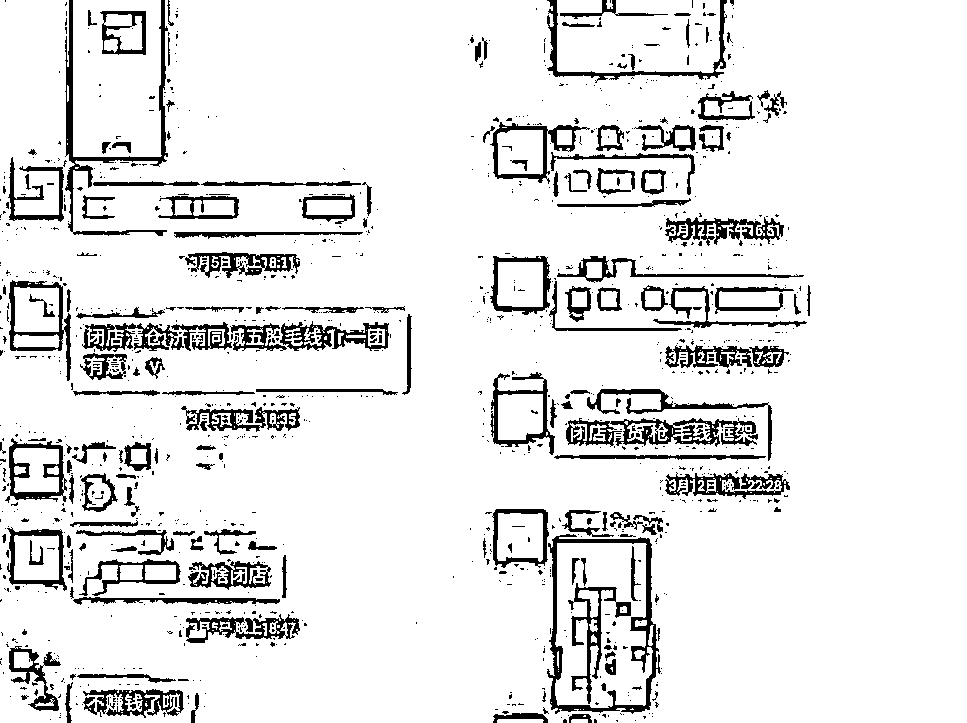
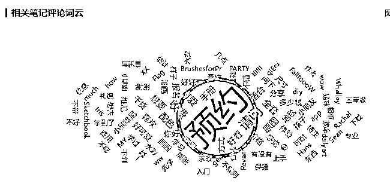
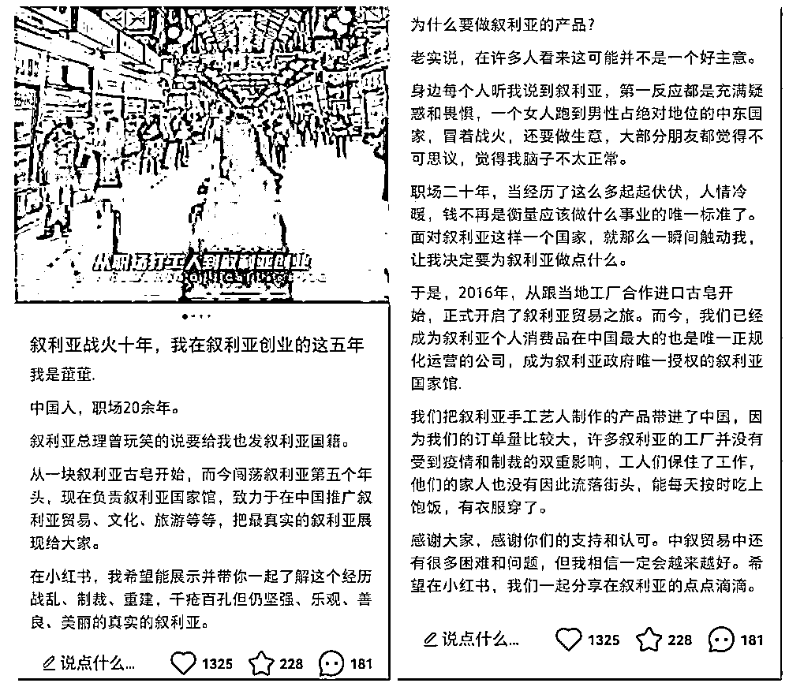
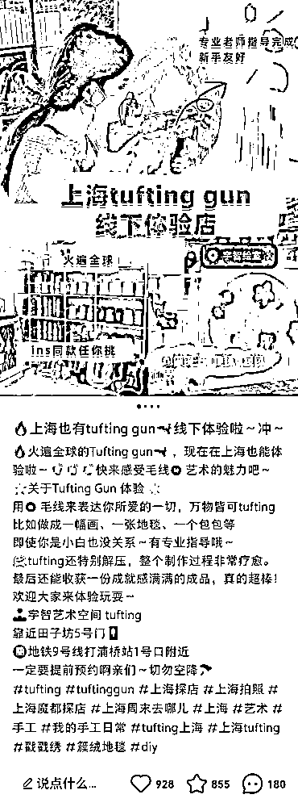
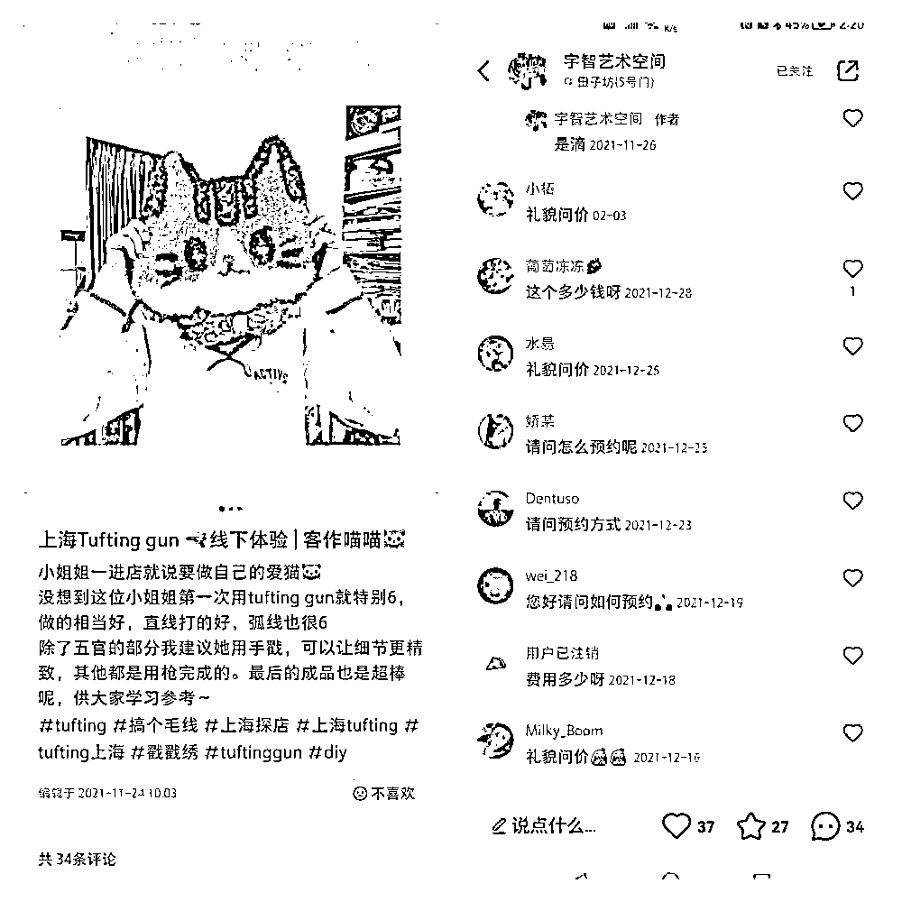

# (精华帖)(193 赞)千粉不到月入 10W ，我如何通过小红书救回濒临倒闭的艺术体验门店？

作者：  怡伶 78667

日期：2022-03-22

大家好，我是怡伶，是上海一家艺术店的老板，我主要做 Tufting 等线下艺术体验项目。

直到发文，我都还有点不敢相信，几个月前濒临倒闭的手工 DIY 体验店，凭着一个只有  700 粉的小红书账号，一跃成为网红打卡店，吸引国际品牌方、明星博主、电视台、小红书官方纷纷来体验和办活动。更神奇的是，由于生意太火爆，我还被同行恶意差评了。

目前我的门店 90% 客源都来自于小红书，月营收超过 10W。虽然这个成绩跟很多千万级别的生财大佬相比不算什么，但这段经历收获实在太多，我还是忍不住想分享出来～ 

 

通过这篇文章，我想给大家揭秘市面上号称「近乎 0 门槛、回本快」「7 天开家店」的小众艺术项目 Tufting 到底怎么玩、开店运营需要投入什么以及有哪些注意事项。

此外，我还会聊聊我是怎么把一个千粉不到的小红书账号运营到月入 10W 的，有经验分享也有踩坑总结。如果你是实体老板且门店生意不佳，或者是正在为客源犯愁的艺术领域同行，那这部分应该会对你们有一些帮助。

初次分享，我会努力把这个小众项目的全貌和玩法描述得清晰一些，可能会有思考不成熟或表达不当的地方，欢迎指正交流～

 

 

目录：

**1. **投** 2W **月赚** 10W **：风靡小红书的** Tufting **到底是啥？

**2. **网红店风那么大，开店或加盟有哪些注意事项？

**3. **如何通过线上运营获取源源不断的流量？（大众** & **小红书）

**4. **秒杀同行的关键：产品交付与用户维护

**—Part 1—**

投** 2W **月赚** 10W **：

风靡小红书的** Tufting **到底是啥？

我原本是做油画体验的，去年 3 月在上海田子坊开了自己的「梦中情店」，主要在线下成交。一开始我靠着企业 B 端客户的团建合作以及商圈流量勉强维持经营。

后来疫情限流，再加上油画体验已是红海，同行恶意低价竞争愈发激烈，门店生意愈发惨淡、入不敷出，逼得我差点把店给关了。

 

 

但天无绝人之路，我挖掘到了新方向 —— 国外早就爆火但国内还刚起步的小众艺术体验项目 Tufting。

Tufting 国内中文名一般叫簇绒、织毛线、戳戳绣等。其实就是在地毯上画画，用毛线  DIY 编织地毯、镜框、杯垫、抱枕套、手机壳、包包等，万物皆可突，每次耗时 2-3 小时左右。

这种 DIY 手作沉浸式体验极佳，深受小年轻的喜爱，现在不少中老年人也乐意来体验。

它最早在欧美兴起，ins 上都火了好几年了，但国内知道的人还少，门店数量相比泛滥的油画体验店还不算特别多。

 

 

Tufting 在小红书上一开始也不是很火。去年 10 月调研时，小红书上也才 2-3 万篇笔记，但现在一看已经 6 万多篇了，相应的话题浏览量也是暴增。我预计今年会爆发式增长，小红书官方已经搞了全国专场活动，去年年底去了我店里拍宣传片。

前段时间，我还收到了小红书工作人员给我发的 Tufting 店铺入驻手册。当然，不止  Tufting，小红书对手工、艺术类博主的扶持一直都不错。

 

 

归总下来，Tufting 还属于潜力十足的蓝海市场，这点就足够吸引我了。而且，Tufting 虽然小众但网红元素满满，对于国内用户来说足够新颖、热度够高，社交分享传播属性很强。因此只要精准运营，就能把生意做爆。

当身处红海市场，要么不停内卷外卷，搏杀而出；要么挖掘小众蓝海市场，专注于小而美的领域，在不经意间突围而起。

我更倾向于选择后者。

除了蓝海、小众、网红等元素，Tufting 身上还有其他优点吸引我快速布局：

 

 

投入少回报快：不包含我的店铺租金，前期投入不多，我也就花了 2 万多块买了设备物料，比如毛线、工具枪、毛毯、画架、投影仪等。在本身有开店经验的情况下，约 7-8 天就能营业，让资金回流（没经验的至少 1 个月起步）。

沉浸式体验：现在打工人压力太大了，「治愈」「解压」成为了他们的两大需求，手作类体验刚好可以满足需求。

技术低、一教就会：Tufting 不难操作，勾好线稿、选好毛线颜色，简单指导下就可以拿起工具枪「突突突」，覆盖的用户群较广。

复购率不低：很多客户都不是一次性消费体验，今天编织不满意改天再来，我有些客户还会拖家带口或者带闺蜜闺男、同事一起来玩。

整体来看，开店门槛确实挺低的，我见过网上有同行一下子就开了 8-9 家。

**—Part 2—**

网红店风那么大，

开店或加盟有哪些注意事项？

当然，肯定不是随便开个店就能赚钱，你的选址、产品服务体验、环境都很重要。

同行群其实每天都会有人说要关门倒闭，倒闭的要么是喜欢玩恶意低价竞争，要么是自己也不太懂，产品服务质量不太行，指导做出来的成品比较丑。

 

 

在提供服务的过程中其实会出现很多问题，比如客户作品打破了怎么处理？客户要做包怎么处理？怎么样的店铺氛围体验更好？什么毛线让作品效果更好？设备多久维护一次、怎么维护等等。

很多人开店以后才发现客户不满意、抱怨很多，都是因为急着开店的人前期根本没有做好这些准备。

所以别只看到网红店的表象就脑子一热，立刻疯狂投钱开店，最后关门不说可能还要倒贴钱。很多成功的例子都是「幸存者偏差」。开店前要做好调研，也要考虑下自己的实力是否接得住这样的产品和服务，能不能建立起「护城河」。

 

 

以我自己为例。我合伙人是有三十几年功底的手艺人，熟悉高定、各类 DIY 体验；而我则是艺术专业毕业，有几次创业经验，重视产品服务交付，开店选址方面也有一定经验。普通上班族、不懂行的不一定能交付得好。

另外，线下门店其实很容易遇到流量瓶颈，即便在商圈也是如此。因此，在互联网时代一定要学会借力于线上运营。

自从小红书笔记爆了，我的门店生意迎来了前所未有的大爆发，有时候上厕所都在接预约电话。别人是每天求客户来，但我真的每天都在「劝退」客户，因为接待不过来了。

不是凡尔赛，有截图有真相。

 

 

从试运营的第二个月起，我就月入 10W+ 了。现在准备开第二家场地更大的分店，制定加盟铺店计划；另外，我还筹备着拓展线上产品业务，丰富 SKU。

所以，接下来我想分享我是如何通过线上运营获取流量，引爆门店生意的。真的有很多踩坑点，新手一定要看完。

**—Part 3—**

 

 

如何通过线上运营获取源源不断的流量？

我精力有限，线上流量获取渠道只做了大众和小红书两个平台，后者是我的主战场。

运营初期我先做的大众点评，但没做起来就转战小红书了。在这部分内容里，我想先分享下我在小红书的运营经验，再总结我在大众踩过的各种坑。

一、如何用小红书引爆门店生意？

一开始也是各种踩坑，跟着小红书实战营的谢无敌和喵小 C 老师学了一整套玩法才有起色。很多思维和技能实战层面的提升，都是她俩带给我的，真心特别感恩。

言归正传。从去年 10 月运营到现在，我的小红书个人号也就 700 粉，询单爆发时才  500 粉不到。目前 90% 门店客源都来自于小红书，其中不乏单价 1W+、2W + 的企业单。

我的闭环设计很简单：从小红书等公域引流到私域，客户在微信预约后到线下店后消费成交。小红书客户基本都很精准，来一个成交一个，私域没有过多维护，我甚至连朋友圈都没咋发。

生财里教大家怎么注册账号、定位、设计主页、私域维护的分享已经很多了，我就不班门弄斧。这部分我主要想聊聊我对小红书内容种草引流的思考，有成功经验也有雷区踩坑。

 

 

先分享我亲自实战过，非常有效的种草笔记写作经验吧。我把主营业务优化为 Tufting 类目后，主要发了两类引流种草笔记：

个人引流名片

案例作品种草笔记

这两种都给我的账号、门店带来了不错的曝光，也吸引到了超多精准成交的目标客户，是高转化种草笔记。实战营同学测试过的，基本都出了效果，适用于很多类目。因此我觉得值得分享下经验。

我的评论区词云图（高频词：预约）

**1.  **置顶个人引流名片

置顶个人名片是我写的第一篇 Tufting 笔记，也是询单、客户预约最多的一篇。

 

 

在小红书里搜索「上海 Tufting」或「Tufting 上海」这篇基本都排在前十名（每个人的搜索呈现结果不一，会有些偏差）。

引流名片笔记，是软性植入自家产品或服务的「神器」。那这类笔记怎么写呢？

我分两部分说：「笔记类型」**+**「写作技巧」。

从笔记类型来看，引流名片主要包含故事经历型、硬广介绍型和伪真实体验型三种。

故事经历型：自我介绍和故事经历描述。

但这个描述不是流水式的，一定要重点说自己的工作部分，方便软植入产品和服务。在不明确导流的情况下暗示用户「在我这里可以买 XXX」。我拿实战营同学栗子姐的千赞笔记作为例子给你们展示下（这篇是无敌亲自指导写的，1 篇涨粉两三千呐）: 

 

真实体验型：我的笔记就是这种类型。

一开始写得比较硬广，后面做了优化调整，模仿常见的探店笔记写了一篇置顶到主页，直接放了门店地址都没被系统判导流违规。如果你也有店，可以试试这种伪探店口吻；

如果没有也可以模仿下素人体验口吻，有时候系统还真识别不出来你在打广告，非常好用。

 

 

 

 

硬广介绍型：简单粗暴介绍自己是谁，提供什么产品服务，什么流程、理念等等，偏硬广一些。

这种更适合企业号，个人号写不好的话可能踩雷违规。

 

 

 

 

这 3 种你们可根据自身情况测试，将笔记一直置顶在主页（发布 20 篇笔记即可解锁置顶功能）。

我这篇笔记的互动数据都源于自然流量，因此下面询单比较多。如果前期互动不够好的话，可以人工控制冷启动，错开布局「怎么联系」「怎么预约」「店在哪」等询单型的评论，会有不错的效果。

 

 

 

 

每个新用户过来第一眼就能看到你的自我介绍和下方评论，有需求自然会来询单。

写作技巧方面：

图片只要跟你的工作、产品或服务有关的就可以，最好能真人出镜，不想露脸就侧脸或者真实场景露出也可以。

文字部分没啥技巧，用大白话就成，就那种我跟你聊天的感觉，越接地气，小红书用户戒备心就越弱，更愿意来询单。

**2. **案例作品种草笔记

对于定制、客定、设计类商家 IP 来说，少不了要用到客户作品来做种草的。比如我肯定要发客户的 Tufting 成品才能吸引到对这个体验感兴趣的目标人群。

但这里就容易遇到两个问题：

很容易把案例作品种草写出干巴巴的硬广，对个人号来说效果不是那么好。

爆款种草笔记大多是素人体验口吻，商家也不好一直说是自己来亲自体验的，

角色切换有难度。

调研了比较多做得不错的企业号和商家个人号后，再结合自己实战，我觉得可以这么解决：

 

 

第一，大大方方告诉用户你就是老板，从老板的角度描述客户来体验的过程，描述他们的作品；或者打造一个公司**/**工作室里的员工人设也可以。

比如我这篇，就是老板视角的笔记（赞藏一般但评论和私信询单不少）：

比如小浔溪这篇，就是踢脚线工厂打工妹的角色（又爆又精准的代表！）：

 

 

第二，无论是老板还是员工视角，口吻也要聊天式，街坊邻居唠嗑的感觉。文字内容不用太长，语气可以适当俏皮一点。举两个例子给你们感受下：

生硬种草：冬日上新** **这款实木餐桌真的很值得买买买

聊天种草：客户全家都夸爆的实木餐桌！姐妹们快给我冲！

种草笔记的口吻真的挺重要的，就算明说你是企业、老板，只要够接地气，用户还是不会太反感，反而可能会因为你的「可爱」「真实」「坦率」而种草你家产品。

 

 

**3. **种草笔记的其他注意事项

**3.1.**首图

用户第一眼看到的就是首图，前期必须好好打磨。

我观察下来，小红书的爆款首图要么特别美好精致，要么真实接地气，主要看类目和 IP 人设。我的产品比较网红时尚，好看精致更圈粉，所以我的图都不会太丑，每张都处理美化一下。

美好精致型：

 

 

接地气型：

 

 

首图制作推荐美图秀秀、黄油相机，有比较多好看的文字和贴纸。稿定设计也有现场的小红书模板，很适合小白。

 

 

**3.2.**关键词

关键词用对了真的 YYDS，下面这套方法还适用于其他平台，逻辑都差不多。

首先你要挖掘到自己行业的高流量产品关键词。

在小红书搜索关键词如「画画」，看到图中画圈位置出现了很多相关关键词，从中找到适合你的去添加在你日常文案中。继续往下滑，就可以看到这个画圈位置出现了更多细分关键词，也可以参考使用。

 

 

 

 

在同行对标帐号里收集，他们的爆款文案中有哪些关键词，你也用小本本记下来。

看企业号的关键词投放、买量、搜索情况。这个专属功能还挺好使的，我刚升级了企业号，回头有新的经验总结再分享出来。

收集完就可以开始铺词。我一般会在笔记标题、正文、末尾都打上关键词，尤其是本地关键词（比如上海 Tufting）。

起号阶段最好是泛词** + **精准词组合放。泛词是指更大众一点的热词，比如探店、上海探店、周末探店；而精准词跟你的产品细分词有关，比如 Tufting、上海 Tufting、戳戳绣。

 

 

刚开始我就只放精准词，其实流量一般般。但加上泛词的强曝光，整体效果就不一样了。当然，前提还是你的笔记内容要吸引用户。

这个玩法用在大众上也吃香，把你的店铺名 + 团购都加上关键词，流量效果谁试谁知道。

以上就是亲测有效的经验总结了，接下来简单聊聊避坑。

刚开始做小红书的时候，其实我也踩了不少雷区的。有些问题，相信很多新手都会遇到或者已经遇到过。

踩坑一：盲目追逐爆款

初期我做油画体验那会，其实在小红书写了好几篇爆款笔记，都是干货分享为主，比如绘画接单 App 大合集、油画棒选购攻略、绘画教程等等。

互动数据不错，1 篇千赞、1 篇 800 赞。但这类笔记吸引过来的都是白嫖党或者来交流的，都不是来我这消费的，基本没有意向客户。

 

 

虽然我也能留钩子引流到私域，但很像广撒网，不那么精准，种草转化路径比较长。

后面我改成写 Tufting 种草笔记，互动量爆款不多，但询单成单立马激增。

因此，做产品种草的没必要盲目追逐爆款，精准转化更重要。在选题、选笔记类型的时候，就要思考清楚，用户看到这篇笔记后会采取什么操作，来交流还是来询单消费。

踩坑二：缺乏闭环思维

 

 

小红书等公域引流只是一种流量获取手段，但能不能成交还是取决于你产品或服务本身的质量。

比如我一开始做的油画体验，早就身处红海，同行恶意低价竞争激烈，而且我也没差异化优势。就算客户通过小红书引流过来，也基本不会成交。

当时，我还把重心放在内容优化上，但实际上是整个闭环有问题，尤其是变现端。产品本身不行，内容做得再好也是白费力气。

因此我觉得做任何平台的 IP，都要有闭环思维，在运营过程中审视和优化调整「定位** - **内容** - **引流** - **变现」每个环节。它真的是环环相扣的，错一环满盘皆输。

以上就是关于小红书内容种草、运营的全部经验总结，最后一部分想聊聊大众点评。

二、大众点评运营踩坑总结

这部分踩坑总结是我花了一万块买来的经验。

去年第一次做线上运营，其实我先做的大众，后面效果不好才转向小红书。可以说，我把各种坑都踩遍了，这里总结下帮大家避避雷。

避坑点** 1**：产品套餐设置不吸引，一来就烧钱

 

 

刚开始上架的都是油画体验类产品套餐，初期访客量真心惨淡，每天只有 30-40。急病乱投医，当时我就听了大众工作人员的推荐充值开了推广通。

平均每小时烧掉不少钱，一共花了一万多，但转化率几乎都是 0，要么就是非精准用户，要么就是对我店铺产品不感兴趣。

现在自己回看，在产品套餐不吸引、店铺初期评分低的时候，烧多少钱都没用。大众它是一个帮助大家找到好吃好喝好玩好去处的平台，还提供各种优惠套餐和活动价格。大众用户主要看谁价格更低、哪家店用户好评多。

如果你上架的产品或套餐不吸引，无论做什么运营手段都可能没啥客户。

避坑点** 2**：重视用户好评差评的评价维护

刚才我也提到了大众用户做消费决策前会看这店评分高不高。

我一开始没怎么管这事，因为基本都在私域或到店成交，平时客户来消费也没有让他们在大众写点评的习惯。

但随着生意越来越火爆，我好多同行都来恶意做差评，大众平台还帮我拦截过几次。可评分还是明显下滑，这有点影响我店铺的形象，因此我接下来会采取运营手段做优化调整。

避坑点** 3**：图片过于精致反而劝退客户

 

 

小红书对艺术类的精致程度要求比较高，所以图片一定要高颜值。但大众需要的是更真实的用户体验封面，过于精致美好，别人会觉得是广告。因此，发大众的图片尽量不要修，保留真实感，文案要再软一点、更客观一些，就会有机会爆。

我自己实战下来，小红书的流量比大众更持久，客户也更加优质。无论从内容还是流量获取来看，前者对新手来说都更加友好、更易上手。

当然，大众运营我才刚入门，还有很多要学习的地方，这里不过多指点啦。接下来我还要和生财圈友们多多请教，今年努力把大众平台也运营好，争取早日把被同行恶意差评拉低的分数提上去。

**—Part 4—**

秒杀同行的关键：

产品交付与用户维护

看到这里，可能很多人还是会疑惑，我到底是怎么超越同行，把店铺快速做出网红店的？

除了找到快速曝光和获取流量的渠道，我想可能还有两个比较核心的原因：

**1. **重视交付体验

 

 

从开始做油画体验到现在做 Tufting，我的初心都是不变的：让更多人享受艺术的快乐。

我时常会思考怎样才能让用户体验远超他们预期，注重到店交付中的每个细节，比如店铺氛围布置、指导流程、工具好不好用、体验作品的质量等各个方面，做好口碑。看到客户能沉浸其中，对我来说其实是一种享受和愉悦。

来我店里拍摄的明星经纪人也说，探过那么多家店，还是我家氛围最好、指导最专业，出来的成品审美也特别好。

我想，这应该是我的店能受到小红书官方、明星甚至电视台青睐的原因之一吧。而这些，都是需要专业经验积累的，并非一蹴而就的事。

**2. **和客户交朋友

我到现在都还没跟芒果台敲定双方都满意的档期时间，因为邀请的日期正好很多客户预约，我觉得临时取消很不厚道，体验感差。

有人说我傻哈哈，但我其实是很珍惜每一位客户，因为很多人都特意从外地赶过来店里体验，我不敢辜负每一份期待。

我喜欢和客户交朋友，无论在店里还是微信里，我一有空就会和客户唠唠嗑，关注他们的喜好并咨询体验反馈，送点小礼物。

 

 

从去年开店到现在，我真的积累了一批优质的客户好友。我没开口要求，私域也没怎么维护和运营，他们纷纷给我转介绍客户，其中还有不少是大客户。感恩，惜缘，继续努力做好服务。

以上就是我开店和线上运营经验的全部分享了。最后的最后，再简单总结一下：

身处竞争激烈、内卷严重的红海，学会挖掘蓝海机会， 小众不代表 0 需求，专注于小而美的领域也能成功突围。

产品服务质量是根基，我认为这是干事业最核心的一点。同行眼红我写恶意差

评，其实都用错力气了，还不如专注于打磨好产品和服务交付，和客户交朋

友。

艺术梦很美好但现实很骨感。 不要轻易开店，尤其是线下艺术体验店。选址、选品、服务体验、环境等一系列问题，都要筹备规划好。脑子一热就开店、加

盟，不是倒闭就是亏钱。

借力于线上运营，可以成功突破门店流量瓶颈。拓展新的客户源的同时，还能提升品牌影响力，甚至吸引到更深度的合作机会。小红书是真的** YYDS**，谁做谁香，强推～

未来我的开店创业之路可能还会遇到各种难题、困境，希望大家能一起多多交流，抱团前进！

最后，特别感谢生财有术！感谢一路上给我诸多帮助的谢无敌、喵小 C、刘杰和叶叶等优秀圈友～

评论区：

 

 

何友澜 : 好赞，福州有一家，可能地段不太好，还没去体验就倒闭了。

肖叮当🌟 : 太棒了！

怡伶 78667 : 地段不好也有做的特别好的店，还是要看怎么去运营

怡伶 78667 : 一起加油

青芦 : 优秀

小浔溪💛 : 优秀啊~一起打造小红书提款机~

怡伶 78667 : 好～  一起打造小红书提款机～

杨一 : 这篇文章在小红书刷到过，没想到是圈友的，太优秀了
