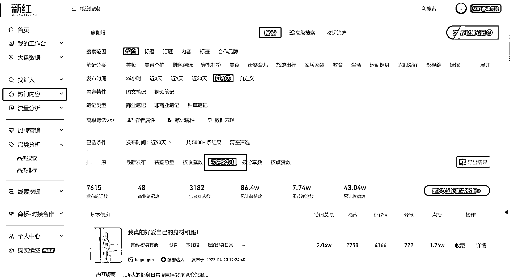
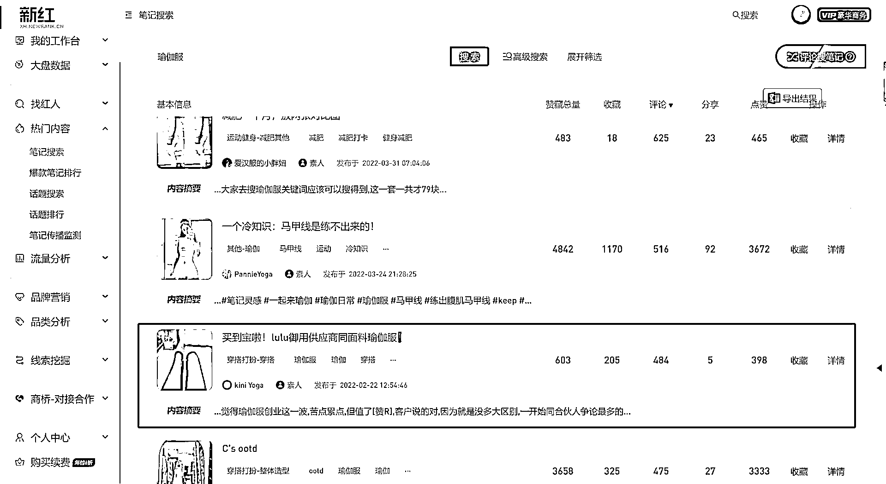
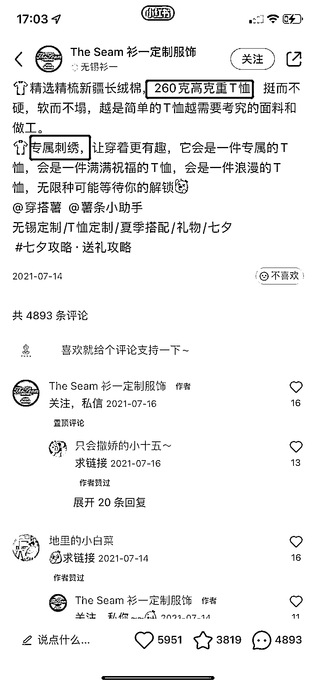

# 7.1.2 挖掘高价值对标笔记 @杉木

刚才我说要看评论区，第一个评判标准是赞评比（赞同数：评论数），我一般找那种比例比例接近 1：1，甚至于 1：2，总之就是评论数越多越好，而且评论内容直接表明购买意向的内容，这种我建议大家用最笨的方法去找。

方法之一是主动搜索关键词，频繁浏览竞品笔记，把自己的小红书账号刷成竞品内容瀑布流。通过大量阅读所在领域的笔记，然后不断挖掘。

不建议大家上来就借助工具走捷径，因为这个过程值得我们花时间

而且你在找这种笔记的过程中，就会逐渐感知到你要做的产品的卖点，从而对内容方向更有把控，还可能会有很多意外的发现。

我们把这些笔记全部搜集下来，注意在挖掘这种笔记的时候，最好点开主页看下账号其他内容，因为一般一个账号的一篇笔记好，还会有别的类似内容，如果是他篇篇笔记都是如此！

恭喜你，发现宝藏，建议你把这个账号的全部内容认真搜集下来。这个可以借助工具爬下来，淘宝上有类似工具。

也可以借助小红书数据分析工具：蝉妈妈，新红，我以新红举例吧

在热门内容选项键，输入你要做的类目大关键词，然后按评论数排序。

不要按照赞藏数，赞藏只是糖衣炮弹，对于带货笔记来说没有参考意义，而评论数据可以，找那些评论多，且直接问产品链接的笔记

借助数据工具，我们也可以找到真正的热度词，在文案中植入，增加内容的搜索曝光

说白了就是蹭热度，主动 Search 的用户会高频次地使用小红书的搜索功能，特别是在品牌集中增加营销投放或是有新产品发布等较大事件时，小红书内关于该品牌的搜索量会明显上升。“大家在把小红书当搜索引擎用”，这是众多小红书用户的心声。

那我要做的就是借力，比如今年瑜伽服品牌 lululemon 热度很高，甚至于 lululemon 这个关键词的热度，要高于瑜伽服这个品类词，那我们就可以在文案中多次植入

我们找到这类笔记后，全部搜集下来分析他们的文案，除了发现这些笔记展示到的核心需求外，主要体会高询单内容的情绪价值。

说实话，这个需求如果光靠感觉去找的话，就算你在这个行业浸润了多年，你也很容易误判。所以一切要以实际笔记的反馈为主，而不是你的直觉，凡是评论区一堆人在问链接问怎么买的，那一定在内容中涉及到目标客户最关心的点。凡是评论区七嘴八舌的，就算再高赞，也是瞎热闹罢了，切记：

找到能赚钱的笔记，而非看热闹的

终极目标不是出爆款，而是精准客户

我做小红书是为了赚钱的，而不是为了高赞内容

也可以把这个当成一个选品标准，比如这个 T 恤这个品类，属于红海市场，竞争很激烈了，但是我们看到这篇笔记有 4000 多个精准询单，完美符合我们要找的高质内容笔记

那你肯定要问个为什么，通过分析他的文案和产品，我们可以得到结论，之所以有如此大的询单量，就是因为这个衣服：高克重，专属定制的卖点

说明市场急切渴望一款这样的 T 恤，所以我们也可以在找这类笔记的时候，发现一些值得做的产品。

