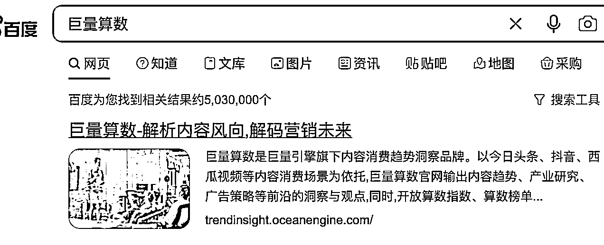
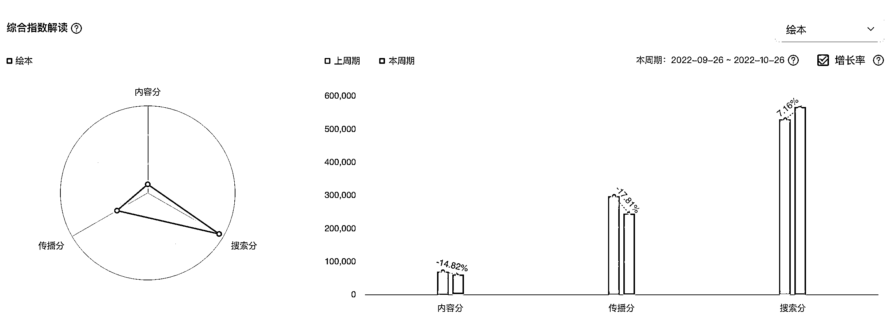
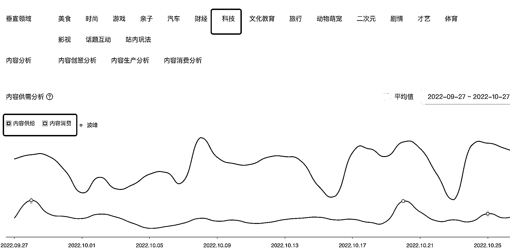

# 4.1.3 巨量算数搜索 @谢无敌

最后一种方法是借助巨量算数搜索，电脑端直接搜索巨量算数。

它的数据是以抖音、头条为基础的，但是自媒体的风向标大体上是差不多的，所以小红书博主也可以拿来参考，而且它还是免费的。

打开网页后，点击顶部的“算数指数”，会出现一个关键词搜索框。

在这里输入你想要做的品类关键词。比如我们现在输入：绘本。

点击搜索，就会出现关于绘本这个品类的数据分析，包括搜索指数和综合指数，网页下拉后有一个综合指数解读，我们需要重点看一下。

上图中，左边这张圆形图，有三个关键信息：内容分、传播分和搜索分。

内容分：指的是含有这个关键词的内容数量，数值越高说明写这个内容的人越多。

传播分：指的是内容的播放量和分享情况，数值越高，说明内容越受欢迎。

搜索分：就是指有多少人搜索过这个关键词。

很明显，内容分越低，传播分和搜索分越高，这个赛道就越好做。

我们刚才搜的“绘本”，搜索分和传播分都明显高于内容分，也就是说，它的用户需求量远高于现有的内容数量，所以可以判断为是一个蓝海赛道。

除此之外，巨量算数里还有一个可用的功能，就是打开顶部的「创作指南」-「内容消费分析」。

里面有十多个垂直领域选项，选择对应的领域，你就会看到两条变化的曲线。

蓝线：代表内容供给，也就是这个赛道内产出的内容数量。

绿线：代表内容消费，意思是有多少人观看这个内容。

比如上图，我们选择的是游戏赛道，两条线忽高忽低，总体来看，供需大致平衡。

再比如科技领域，出现的是蓝线在上，绿线在下，说明供大于求，关注这个领域的用户没有那么多，以上两类赛道都不适合我们去做。

还有一种情况是绿线在上，蓝线在下，而且我们还可以自定义搜索的时间，比如动物萌宠赛道，我们选择最近一年的数据。

出现的结果是，绿线远远高于蓝线，意味着产出的内容不够，满足不了消费者的需求，这就是一个蓝海赛道。

我们要找的就是这种绿线比蓝线高很多的赛道。

但这个方法有个缺点，就是目前只能搜索到它上面给出的这 15 个领域。

你可以把几个方法综合起来参考，千瓜的缺点是比较贵，一个月要 3000 来块，你可以和其他博主拼团一起买。

内容来源：《（附选品清单）如何选择小红书蓝海赛道和产品？3 个方法搞定！》

附选品清单：小红书产品清单（from 千瓜数据）.xls （下载请跳转：小红书航海｜实战工具包）

