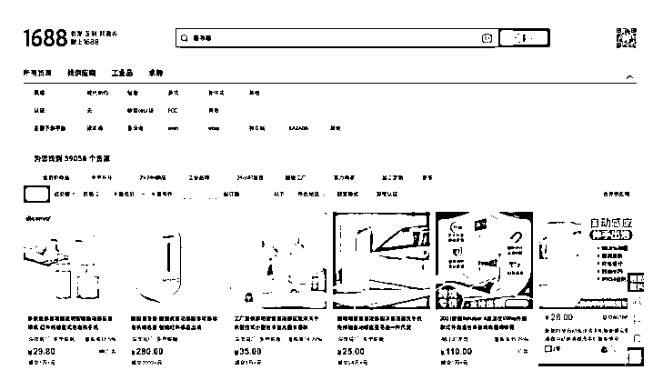
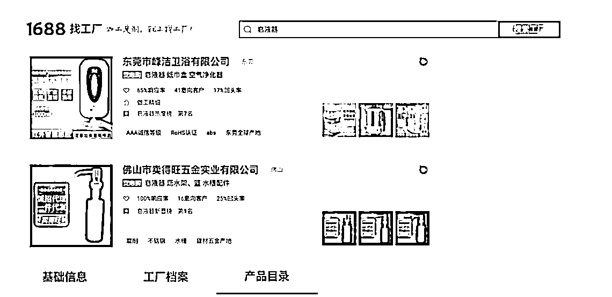
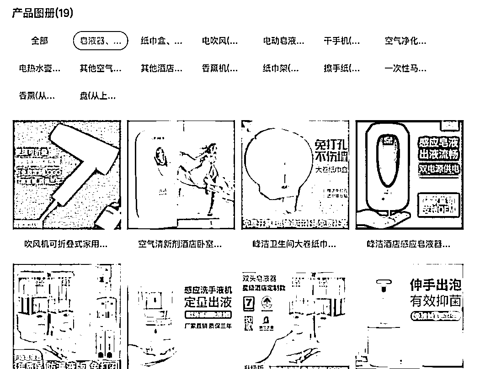

# 5.3 如何筛选工厂 @Bryce @Jennifer @Jing

下面以大家最为常用的 1688 网站，对去年日本站热卖的皂液器进行举例。

1）工厂类型

代理商：没有自有工厂，店铺产品通常横跨十数个小类，价格参差不齐。

组装工厂：主要负责整体的产品结构设计，但是芯片方案和外观模具通常是采购其他厂商的，和代工厂的定义类似。

产研一体的工厂：即 ODM ，有部分或全部的方案专利，在技术层面相较与其他工厂有一定自主研发的优势。

2）如何找到合适的工厂

很多时候我们在平台获知的产品名称是直译过来的，与工厂对产品标定的关键词可能会有出入，因此用已有的关键词搜索，找到其他常用品名，能让我们避免漏掉其他关键产品。

以皂液器搜索为例，结果中「皂液器」和「洗手机」被搜索系统判定为等价词汇并标红，因此我们也应该尝试洗手机的搜索，来扩大产品的搜索面。

① 以品定厂

在首页上直接搜索，我们进入的是货源模式，即看到全是产品，我们根据需求，细化搜索条件，来挑选产品并下单。

选定「泡沫洗手机」为关键词。

在深度认证一栏选择深度验厂，选择合并供应商（过滤大部分小代理商）。还可以按需筛选价格区间和所在地区。

② 定厂找品

在首页上我们选择找工厂，输入关键词，此时我们进入工厂模式。

点击品类的排行榜可查看热门工厂（注意有充钱刷榜的工厂）。点击厂名进入详情页，可查看工厂档案与产品目录。

③ 样品采购

比对产品，选择符合要求的 3 - 5 款产品。之后选择下单（通常必选 2 个），用阿里旺旺联系卖家拿样改价。

④ 工厂造访

有了样品的比对之后，我们可以有针对性的选择厂家进行造访了解。

产品的工期、质检规格、海外认证与专利。了解大货起订量与首批价格。返单之后的降价区间与账期的可行方案。

3）工厂筛选标准

筛选标准:

•找公司名带有“ XX 厂”、 “ XX 工厂”、“ XX 公司”字样的工厂；

•总结分布地区，把属于该地区的工厂全部找出来；

•看店铺各种指标和年限，1 年以上经验，货描相符为红标，回头率大于 30% 的工厂。

筛选出来后，询盘。询盘内容: 产品图片，材质、尺寸、做货要求、做货数量、包装要求。

4）工厂避坑指南

① 关于打样

不着急下单打样，先了解工厂的实力。通过和工厂的沟通了解：产能是否能跟上、大货是否能流水线生产，下达任务到生产车间的流程和标准是什么，有没有案例可以看一下。

样品作为生产大货的标准，工厂是把样品的质量作为上限还是下限？

如何确认样品是上限还是下限呢？这需要等样品确认后，在下订单的合同上和工厂直接写明并确认。下限的话，就说明样品是最低标准；上限的话，工厂又是如何把控生产质量，做到每一个都和样品一样甚至比样品还要好~

② 关于品控

品控，工厂是如何把控的？品控部门工作的流程如何，是抽检还是全检，不合格的商品是否会发出？

收到货品有问题工厂会怎么处理？这些都得提前谈好。我目前是出大货前让工厂寄五个大货样品过来确认，品质过关就可以出货了。

如果品质不过关，就指出哪里有问题。把产品退回，让工厂去跟进修改，重新做出新的产品寄过来~

通常来说，简单的产品打样两次就可以了。

如果大货样品过关，正常出货后，再次出现瑕疵如何处理？我的做法是把产品退回，让工厂把产品重新做好补寄过来。

③ 交货时间

交货时间必须写在合同上，包括延期出货，需要赔偿的违约金。

内容来源：3 月 22 日《小红书店铺运营——有货源模式的玩法》@Jing

