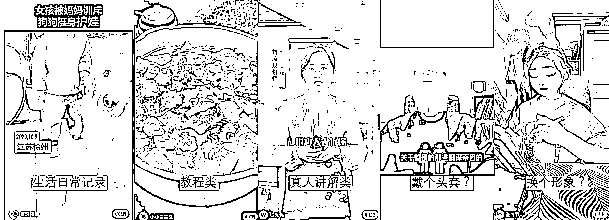

# 3.2.1.2 视频笔记 @Zora。 卓然

视频笔记，目前在小红书上也算是比较常见的了。对比图文笔记，视频笔记存在的几个优势：

1）让用户更有交流感

用户因为某个疑问或兴趣点开了你的笔记，然后你分享着自己的经历和观点，有画面、有声音，相比图文表达上也更加口语化，让用户感觉你们就是在面对面交流，缩短了距离感

2）更容易形成个人 IP

因为有具体的音画，用户通过一个个场景来了解你这个人，会让用户更有真实感，形象更立体，容易形成个人风格，因此这个建立人设的过程更加容易，根植在用户心里的你的形象也更深刻

3）流量扶持

随着短视频的发展，小红书平台对视频笔记也会有一定的流量支持，所以短视频内容会获得更多的曝光量，对比之前发图文，几十篇才有那么几篇是上千的，航海期间我发布了 6 个视频，其中 5 个曝光量都是 500 以上，并不是说这个数据多漂亮，而是对比图文，起码我小眼睛上来了。

4）同质化情况少，不容易被搬运

比起图文容易被“像素极模仿”，视频因为制作成本相对较高，因为同质化情况更少，不容易被模仿，因此带来的粉丝粘性也更强。

•视频笔记的门槛

有利有弊，视频也存在一些门槛

1）需要花费较多的时间

比起图文，视频需要写脚本、拍摄素材、配音、剪辑，因此花费的时间、成本肯定是更多的，但接下来我也会分享一些我的方法，来解决这些问题

2）5 秒定律

最初的 5 秒没有抓住用户的眼球，可能就会被划走，影响完播率。因此刚开始的脚本如何策划就显得尤为重要。这里可以参考前几天大芝的分享：走差异化的路线

3）内心有卡点

很多小伙伴觉得自己不好看，或者声音不好听，对拍视频有渴望的同时也有抗拒。这里想给大家说，完全不用担心，因为并不是一定要拍露脸视频，以下几类视频给大家参考⬇️

大家可以发现，拍视频并不直接等于真人出镜，不想出镜的方法千千万万，一样也可以做出自己的风格。

对新手来说，最好的方式是先用图文笔记训练选题和内容创作，等有了比较多的运营经验和时间之后，再慢慢尝试做视频笔记。

总的来说，图文更适合种草，视频更适合立人设。做视频还是做图文，归根结底还是看你自己的需求。

内容来源：《新手起号也能做的视频笔记》

