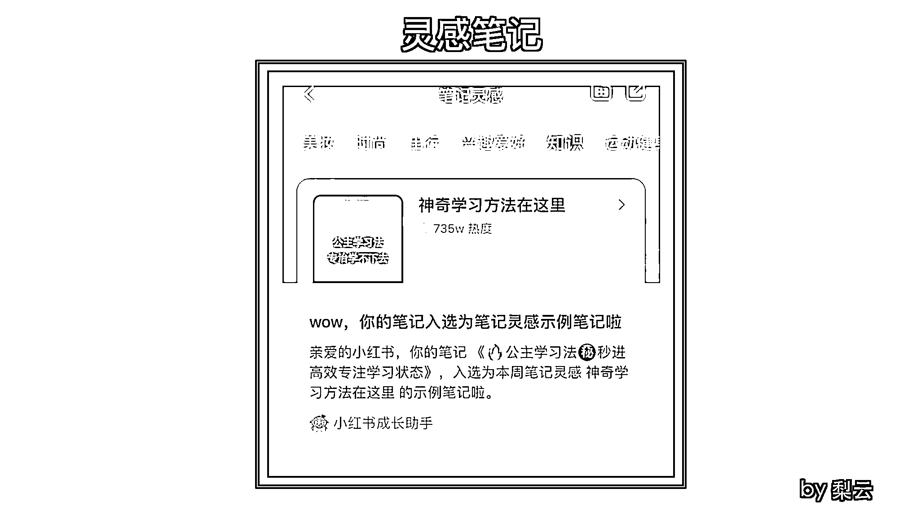

# 4.2.3 要素三：强化代入感 @梨云

我刷小红书的时候，看到了十万赞大爆款《公主学习法》，虽然觉得很 low，但敏锐的觉察力告诉我，这篇笔记不简单。

于是，我看完内容之后，真的好像体验了一把当公主的感觉，再看评论区，一片好评，目测这是一个爆款选题。

我立马以此为选题写了一篇，爆了，将近 10w 点赞。

没有欣喜若狂，我又陷入了思考，到底是什么造就了它的成功，评论区里那句高赞评论“很好，现在已经是公主了”引起了我的注意，这句话背后到底在表达什么？

读者把自己带进去了，就像看小说一样，结合学习的场景……

代入感！

没错，就是代入感！没有学习状态、讨厌学习，是大多数学生的通病，而这种看似不正经的心理暗示，提升了学习的趣味，提升了学习了体验！

学习娱乐化，知识趣味化，如果我的假设是正确的，那么我会开辟一条新的细分赛道，成为唯一。

说干就干，我从评论区分析粉丝感兴趣的角色，然后进行创作，尝试发一些极具创意的学习法试水。

结果，篇篇原创，篇篇爆款！

于是，在比例上，我开始加大这种被娱乐化包装的学习方法，内容高度垂直统一，主页转粉率接近 30% ！

而这种垂直又爆款的内容，还引起了小红书官方的注意，让其直接为我在灵感笔记里单独开辟出了新的话题咖位：

从模仿到原创，依然篇篇爆款，我做对了什么？

•以人为本，和粉丝进行深度链接，了解他们的痛点，关注他们的需求。

•提供价值，你的内容，一定要能够解决粉丝的问题，要么是实用性的方法论，要么是情绪性的愉悦感，或者像我这样，两者兼备。

•主动学习，在了解粉丝需求的过程中，我会遇到很多闻所未闻的东西，比如他们很喜欢的耽美、凹凸世界……这就倒逼自己要去主动学习，才能产出粉丝喜闻乐见的内容。

•长期主义，站在粉丝的需求角度用心的去输出每一篇内容，踏踏实实做内容，同时要不断的输入输出，精耕细作。因为一事精致，便已动人。

内容来源：《小红书三个月涨粉 17w，变现 10w+，我做对什么？》

