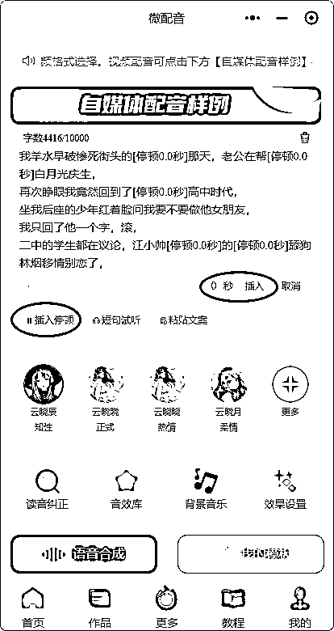
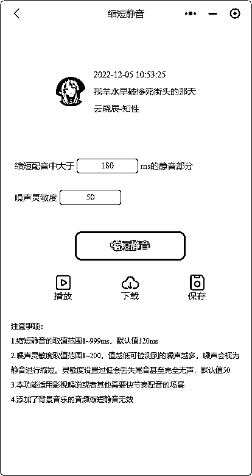
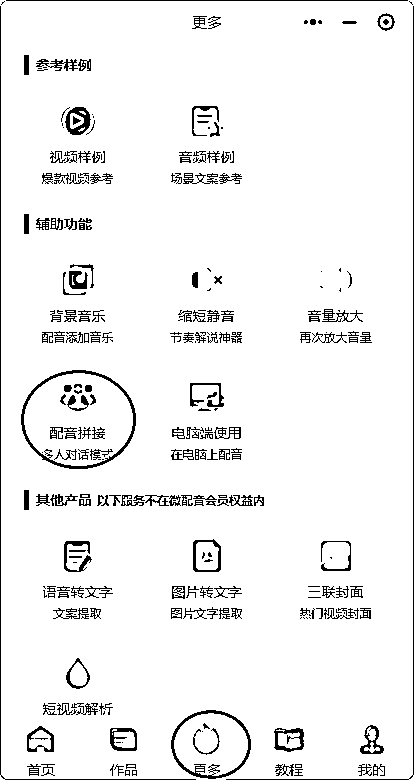
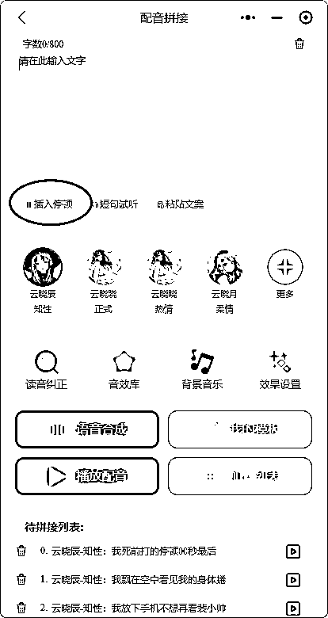

# 第一步：精细化配音

本节主要讲解如何利用配音软件，完成精细化的配音，包括配音软件的选择、操作方法、配音拼接、音色选择等内容。大家可以按需查看～

此外，@seven 老师也为大家提供了现成的音频素材，可供大家参考使用：

•[`pan.baidu.com/s/1nEY1ShBLJve9EbRDphmPdQ`](https://pan.baidu.com/s/1nEY1ShBLJve9EbRDphmPdQ) 提取码：Dygs

1）常见的配音软件

•魔音工坊：[`www.moyin.com/?promottype=BAIDU__PZ-mygf`](https://www.moyin.com/?promottype=BAIDU__PZ-mygf) （付费）

•微配音：微信搜索「微配音」小程序（付费）

•配音家：微信搜索「配音家」小程序 （付费）

2）直接配音

以微配音小程序为例，音频需要少停顿、无停顿。改好一篇文章后，将所有的标点符号替换为逗号，规避小程序识别句号、问号、感叹号等标点造成的长停顿。

同时要注意文本中的多音字，如果屡次出现，一定要用「读音纠正」功能正确配音，偶尔一个问题不大，但听多了一样会影响观感。

在初步配音完成后，可以在文本中手动添加 0 秒的停顿，抵消配音音频的短停顿。在「缩短静音」选项中缩短大于 150-200ms 的静音部分，批量处理音频文件生成后的较长停顿。

至少要做到前 20-30s 内无明显、突兀的停顿，这直接关系到 5s 完播率，和用户对视频的第一印象。换位思考一下，如果音频磕磕绊绊，发音错误，语调忽上忽下，你会给它点赞收藏吗？

3）配音拼接

如果想要做到全文无停顿，点击更多中的「配音拼接」，每一段音频配 350-450 个字，一边配音一边插入停顿，确保每一段音频无停顿、无错字。

但这样做的缺点也很明显——耗时极其严重。每一段音频至少要听两遍，还要一边听一边修改，对拥有多个配音账号的玩家来说十分不友好，显著降低了剪辑效率。

此外，使用配音拼接的时候，可以根据不同的说话人选择不同音色配音，从而区分讲话人、做到差异化，但多人配音更加麻烦，需要考虑旁白、声音 1、声音 2 等多个不同配音员。没有精细化运营的需求外，不建议新手使用。

4）音色选择

声音影响第一印象，推文声音可以冷门但不能邪门。

音色根据小说的类型进行调整，符合视频内容。比如，悬疑类的采用男声，言情类的用女声。知乎小说大多为女性第一人称视角讲述，选择一个温和的、说普通话的女声完全足够了，不需要特别选什么播音腔、夹子音等。

我们不是做 asmr（助眠音频），只是娓娓道来讲述一个吸引人的故事就足够了。其次我们喜欢听什么不重要，粤语、东北话还是河南话都不重要，让观众听起来正常最重要，正常最重要。

如果文章的 5s 完播率不大好，可以调整语调，或者更换配音员。目前用的最广泛的音色是微配音中的云晓辰（知性女声），语速 11.2，语调 8/15，音量 15。