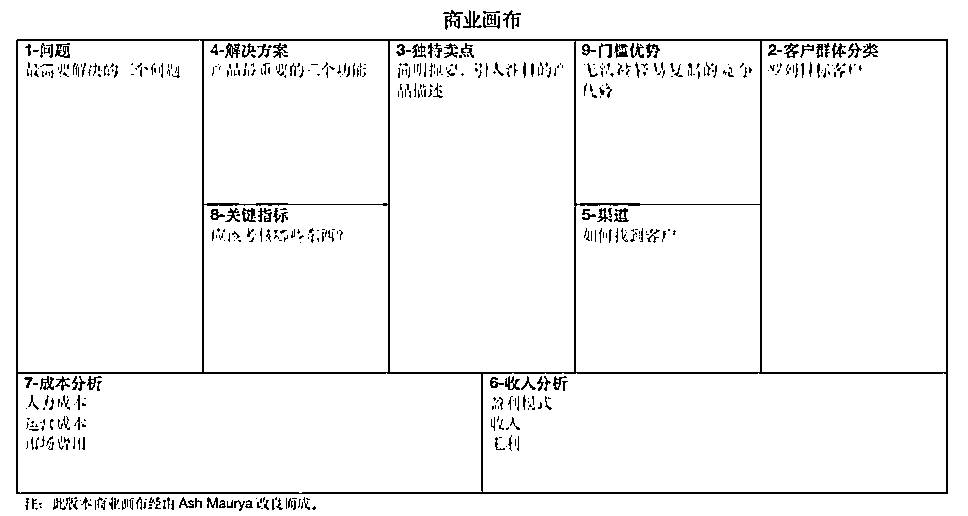

# (精华帖)(191 赞)37 岁裸辞创业变现 15W，我应用的 7 个思考模型

作者：  张亚萨

 

 

日期：2022-02-24

大家好，可以叫我亚萨，一个 37 岁才觉醒，裸辞创业的人。

稍作自我介绍。之前在北京在互联网做产品 8 年，而后去传统金融公司做了 5 年的创新营销。主要从事从**0**到**1**的商业产品规划与设计（**0-10w**用户量级），数仓系统设计工作。

从 2020 年 10 月开始筹划，在 2021 年 7 月裸辞离职，卖房离京，移居到昆明，自己创业做知识付费自媒体。

这篇文章，是以一个 35+职业经理人的视角，分享我看到的风险和机会，以及复盘自己是如何分析决策，完成赛道切换的。

其实生财的小伙伴很多都比我年轻，我的视角能提供的价值，或许在于某些环节的方法论可以帮助到你，也可能是步入中年的真实处境对你有一些感触。比起方法来说，有所感触是我觉得更珍贵的。

对我而言，当下最真实的人生体悟是：焦虑被挑旺了，平静才能莅临；恐惧被惊动了，希望才会出场。但愿文章能帮助各位产生新的思考。

我在文章中，将整个决策过程应用到的思维模型和方法都做了总结，供各位参考。希望对大家能有所帮助。

目录

一、现状简介

二、转型前，35+职业危机的分析与破局

1、职业发展的风险不是所见即所得，要定期评估；

2、多重人生角色，除了紧急的，也要重视长效的；

 

 

3、重大决策后，自身的资源会被激活，要关注它的流向和产出；

三、转型中，当想做一款产品时，8 年产品人的三个建议

1、定位，自己擅长什么和热爱什么，穷举做备选；

2、算账，测算清楚每个方案的财务模型，这是赚到钱的前提；

3、验证，做最小可行性产品（MVP），验证业务可行性，测试简易的业务流程；

4、产品设计过程中，我自己踩的坑；

四、转型后，从专职岗位到全流程负责，遇到不擅长的事怎么办？

1、初阶自学快速入门；

2、高阶信任代理模型，帮自己找到合适的杠杆；

五、总结

一、现状简介

创业半年多，目前已经跑通的业务，有两个方向：

1、C 端：做家庭教育知识付费；

2、B 端：针对和我一样做自媒体的小 B，做产品设计咨询。

这半年时间的主要成果：

1、C 端，自主开发了一门家庭教育训练营课程——亲子冲突管理课，招收学员 60 人+，变现 5w 左右。

目前的情况是流量获取有些困难，这个部分是我的短板，正在想办法突破，文中也会提到一些一开始遇到的坑，和现在的应对的举措。

2、小 B，协同开发了一门寿险线上获客训练营课程，一门收纳管理课程，一门儿童作家亲子写作课程。累计收入 10w 左右。计划下一阶段把服务流程的 SOP 做优化和分工。

 

 

半年整体营收 15w，比起之前收入低一些，但算是完成冷启动了。

二、转型前，**35+**职业危机的分析与破局

**1**、职业发展的风险不是所见即所得，要定期评估

我在准备离职之前，其实工作的环境还不错。在世界 500 强的传统金融公司，做中后台的中层管理岗，在北京能朝九晚五。岗位上呆了 5 年，拿过几个全国范围的年度奖项，表现中规中矩。

但就像我小标题说的，风险不是所见即所得。这些表象经不起分析。而当我深度分析之后，是比较焦虑的。

首先，是内部机会的分析：

1）岗位维持：公司是传统金融企业，继续待下去，3-5 年维持现状不会有问题。

2）内部晋升：传统企业的晋升模式，对于我这种互联网跨界的人，不太友好，比如：不是原生金融体系干起来的，没有足够的关系沉淀，在基于一个信任导向的体系中，想要在职级和岗位上有所突破的概率不大；同时传统金融行业晋升的速度都较慢。综合分析下来，我的判断是**5**年之内晋升概率接近于**0**。

其次是外部机会的情况：

沟通了一些互联网大厂的金融领域岗位，能够拿到 offer 的有 2 个机会，岗位稀少，匹配的机会数量也明显下降。

所以，发展路径就是：要么待着继续熬，要么返厂重新拼。前者要求的是长线时间投入，且不能保证有结果；后者则是短期的全时间梭哈，而且大环境下金融创新的口已经很窄，业务的稳定性很差，风险高企。并且，2 选 1 的岗位机会，其实几乎等同于没有选择。

是的，还可以找到工作，但隐性的风险是，将变得逐渐没得选。

这种情况下，意味着去大平台做职业经理人这条路径，我的发展潜力即将耗尽。虽然整体收益不差，但被替换的风险也极高。

俗称：天花板到了，楼梯也快垮了。

 

 

熬着，生活还能过得去，但未来保障不了。有人可能会问，朝九晚五为啥不考虑发展副业呢？不行，岗位环境不允许。另外还有一个变量，会在第二个点叙述。

分析完之后，焦虑了一阵，我决定要主动面对和解决问题。首先要寻找一个可以有持续沉淀且适合我的赛道，其次则是处理好切换前后的风险。

所以，我选择放弃大船，捞起细软（这里我选择卖房，去除债务，避免因为收入不稳定导致动作变形）。将之前积累的资源重新梳理整合，准备从自主创业（小船）的方向破局。

这个过程，我认为最重要的是对**“**风险不可见**”**的认识以及对风险的分析和排查，能够帮助我更长期的看待问题，而不是把人生放在一个不自主的环境中，等待命运的裁决。

**2**、多重人生角色，除了紧急的，也要重视长效的

在这个过程中，也有另外一个重要的因素，决定性的让我下决心离职。

促使我做这个切换的被动原因，是职业和家庭的角色产生我认为不可调和的冲突。

职业角色方面，在市场化的企业做职业经理人，公司基于业绩的诉求，对你的期许是逐步上升的包括成绩和态度。你拿钱多，就要多创造价值。同时因为岗位稀缺，内部竞争压力也很大，这就促成了一个内卷的局面。

并且更重要的是，在企业内部的竞争优势是不可积累的。因为，每次的努力和成果，绝大部分都会通过绩效和奖金的兑现来清零。本质上，你挣的是一份杠杆恒定的辛苦钱。

家庭方面，和企业一样，家庭对我时间和精力的需求也在增强。我们家有两个孩子，我们家庭非常看重教育的品质，采用的是 Homeschool（在家教育）英文全学科的方式给他们进行教育。老大已经 10 岁，即将进入前青春期。我非常清楚的知道这个阶段的孩子，特别是男孩，对父亲的角色，有进一步的需求，包括相处的时间，沟通频次与质量，对 

 

父亲的观察、模仿与批判等，这些需求都会在接下来的几年逐步的提高。

对于亲子关系时间的投入，是刚性投入，不可能有取巧的路径。但是在北京这所通勤成本排全国第一的城市。即使朝九晚五，我也几乎没有时间留给孩子。

要破局，只能做取舍。我选择的是留下不可替代的那个部分——父亲的角色。

至于职业发展，放弃的已经是潜能耗尽的机会，切换之后，未必就没有更好的可能。

事实上，我因为动了破局的念头，才打开视野开始接触新的可能，仅仅是寻求新可能的动机，就给我带来很多的收获，包括：

1）加入生财，和一些其他付费社群，极大的拓展了自己的视野；

2）从就业的态度，换成做事业的立场，看到太多的需求，也看到自己更长效的价值，自我价值的认可提升一大截。

某种意义上，在我的处境中做这个决定，我赢了两次：不论实际收益是否增长，人生的格局真的跃迁了。同时，家庭中那种很难看见，孩子也说不出的需求，被很好的满足，不愧于心，也为孩子提供了这个时代稀缺的陪伴。

我想，这一切都是勇气换来的嘉奖。如同开篇提到的：恐惧被惊动了，希望才会出场。

**3**、重大决策后，自身的资源会被激活，要关注它的流向和产出

在做重大决策的过程，也是自身各类资本梳理和重新分配的过程。这也是我想分享的第三个点，如何在重大决策过程中，去关注资源的流向和产出。

重大决策的定义，是需要耗费大量资源，以及会产生巨大变化的决策。等同于是用我现在拥有的资本，选择性的做一些激活，确保决策能够顺利落地，之后是否会后悔，取决于决策前考虑是否充分。

 

 

当我们想启动一个项目的时候，可能会有资金的损耗，也可能会求助于某些人脉，或者必须放弃当前的一些机会，同时也可能是变现其他人对自己的信任。这些方面都属于资源的激活。所以，每一项大资源的激活，收益是什么？确定性有多少？上限与下限在哪里？这些分析都非常重要。

举个我项目的例子，我做亲子冲突课程的时候，课程品质和交付难度都偏中上，但我因为线下做了 5 年的父母课堂，有一批非常信任我们的种子用户，所以，在一开始的定价上，就卡位在 1500 元左右，流量有限，但信任度高，所以成交了大概 50 人。这其实就是评估清楚后，对之前的信任关系资源的置换。

当然，实际情况中，业务模式不一样，资源的激活方式、成本、收益也不一样，需要具体问题具体分析。同时还有可能会造成交叉、或者负面的影响，比如：短期利润高的产品，可能会严重损害自己和用户的信任关系；或者创业初期，在工作中时间和精力都梭哈，家庭的其他成员是需要背负一定压力来支持你的，等例子。

如何能在决策前充分评估？

我的方式是，按照内外两条线去穷举，决策可能带来的影响，这两条线是：

外线：功能向评估，决策带来的外在收益。比如：财富、社会地位、声望的增长。

内线：情感向评估，决策带来的内在收益。比如：家庭、情感、精神等层面的提升和满足。

两者之间的关系不是简单的对立，而是以一种动态平衡的方式协同存在。通盘考虑的目的，是为了不进入某一条线的极端，导致另外一条线严重缺失，让我们人生失衡。这也是许多大咖在不同场合都经常提及的，我们需要平衡事业与家庭的重要原因。

内线部分，或许更偏形而上，但在如今这个信息、生产效率都极其高效的时代，业务对一个人的要求，已经从单一的技能，变成综合的状态了。只有虚实相济才能让我们稳住且获胜。为什么？

 

 

我稍微提一个自己对当代生产力的观点——情绪稳定是当代个体的第一生产力。

在当今这个重脑力劳动时代，个体的效能往往依靠专注、冷静、深度思考、灵感等因素。但在工作的场景中，我们不是独立于环境之外工作的，其中有大量的外部变量发生，包括：跨部门沟通、谈判与说服、工作内外的突发事件、各种立场的冲突……如果想要保持高效能，我们必须具备能够协调各种变化，让自己的状态不容易受到外界干扰，也就是有能力保持情绪稳定。

能够有效的调节自己的情绪的人，在任何场合都会被认为更可靠。面对大发雷霆的 BOSS 或客户，能够冷静分析，平和回应，肯定比陷入惊吓或暴怒硬刚好很多，不仅维系了人际关系，也在关键时刻，佐证自己能够持续产出个人价值。这就是一种可以被信赖的表现。

而上述谈到内线的投入，直观的收益就是：饱满的幸福感及高位的稳定情绪。

基于这个分析框架，一个上升空间不大的职业经理人角色，继续坚持会损害内线，但外线收益已经没什么大的增量，这是我决定离职切换的第三个原因。

三、转型中，当想做一款产品时，**8**年产品人的三个建议

当做了切换赛道，脱离职业经理人这条路径的时候，我要面对的问题就变成寻找创业定位的问题。在这个过程中，我认为关键的决策有三个部分：1、自我认知与定位；2、可盈利的财务模型；3、最小可行性产品测试（MVP）。同时也会分享我遇到的一些困难以及如何应对。

**1**、分析自己擅长什么和热爱什么，总结出备选方案

当我们开始自主启动项目的时候，短期要注重的是提高项目的成功率，长期要考虑的则是是否有坚持项目的内在动力。分析自己擅长什么，解决的是第一个问题；热爱什么，顾及的是第二个问题。

 

 

拿我自己举例：自己在互联网呆了 8 年，主要是做从 0 到 1 的产品设计项目，也有一部分内容运营的经验。对产品的商业模式设计、业务流程设计都比较擅长，因此可以自主开发产品，也可以将设计能力作为产品，对外出售。

创业之后的路径，基本上也是围绕这两个方向前进的。

如何确定的呢？

这个方面，除了依靠履历、圈层、信息源等因素总结分析确定，同时要关注的，其实是你本来很擅长，但自己并未发觉的，比如我自己其实很擅长对知识的总结和宣讲，但之前不自知。后来通过盖洛普测试（推荐大家可以测试一下，官网或者找身边做教练的都可以，我知道生财的醒醒是专家），佐证了自己擅长的部分，才觉醒过来。而且盖洛普也非常有效的帮助我避开自己的短板——说服，我不擅长说服别人，所以创业本身会去掉这部分对我的困扰。

找到自己能做什么，喜欢做什么，成功概率高的事项的交集，这里可能会有多个选项，没关系，都纳入备案的范畴，进入下一个步骤，继续验证。

**2**、测算清楚每个方案的财务模型

明确自己大概可能做什么之后，接下来就需要坐下来算清楚每一个备选项目的财务模型。简单来说，明确几件事：

1）拟定一个业务的盈利方式；

2）分析成本结构，和资源投入的体量及阶段；

3）大略估算初创阶段的周期和营收能力，并核算一下利润（=营收-成本）；

4）针对项目风险，设置好止损的条件；

这样假设你选择其中一个实施，那么这个项目第一阶段的指标，基本上就清楚了，不一定符合真实情况，但可以作为参照，帮助自己更好的分析问题、纠偏和控制风险。

**3**、做最小可行性产品（**MVP**），验证业务可行性，测试简易的业务流程

 

 

MVP 这个概念，是《精益创业》中提出的，其实在生财小航海和大航海之中一直强调的定位模型也是 MVP 的一种表达：你面向谁？——目标用户；提供什么内容？——产品；

解决他们的什么问题？——需求。

它代表了你业务最核心的逻辑，所有的环节都基于这个核心逐步生长和扩散出来。

而在初创阶段，我们首先要考虑的是，如何低成本的验证某一个业务核心是否真正符合市场的需求。

这是产品设计最重要的一步。

测试项目的 MVP，大概可以分成四个环节：

1）设计：包括需求的调研、用户群体的确认、商业模式的设计、产品的设计和反馈验证点的设计，这个部分，我常用的工具是《精益创业实战》提供的商业画布。完成分析之后，制作一个不需要大规模、不需要自动化的产品模型。如下图：

比如知识付费课程，可以是课程的教学目标、大纲、内容主体、课程作业等部分。具体的话术，都可以先不用确定。

 

 

2）测试投放：根据定位选取部分种子用户进行产品投放，也可以借此过程促成部分环节的生产，比如话术、运营方式等。

3）反馈收集：面向用户收集反馈，对照设计好的验证点，对业务进行定量或定性的判断；这个阶段获得的反馈，往往有三种，正向反馈、负向反馈和超预期反馈。根据不同类型的反馈，重新考量解决方案。

4）优化迭代：按照反馈，对产品需要调整的部分，进行新的需求分析、并完成产品优化。

通过以上业务定位、财务模型核算、产品测试三个环节，可以快速验证出，这个项目是否具备向市场提供价值交换到足够的资源的能力。同时因为有验证模型，在业务持续推进的过程中，也很容易继续使用模型，查缺补漏的找到不足的地方，加以改进。

当产品验证逐渐稳定下来之后，一个符合市场规律的产品，也算是堪堪成型，之后可以根据业务规划，再在细节层面逐步完善。当然，每一次的资源投入都要记得算账，哪怕是个主观的投产比预估，也比拍脑门下决定强。

**4**、产品设计过程中，我自己踩的坑

对于做产品这件事，我其实蛮自信的。直到家庭教育的项目产品上线后，踩了坑。我才意识到自己又犯了经验主义的错误，对新的市场不够敬畏。踩的什么坑？

首先是“大手大脚”。虽然我在创业之初，就一直强调控成本控成本，但实际操作过程中，还是会延续之前在职业岗位的习惯，先设计产品规划中最核心的部分，以至于我的第一个知识付费产品，选择的是训练营。这就导致前期时间投入过高，上线之后，因为客单价的问题，只有之前私域沉淀的少量高信任的用户购买，对拉新毫无帮助。而且它还要占用我一部分时间用以交付，所以导致业务节奏不稳定。

踩这个坑，让我意识到的是，哪怕做相同的事，在不同的场景中，前提条件发生变化了，就必须要从 0 开始推演和定计划。

 

 

同时在设计过程中，之前职业经理人角色的惯性也延续下来，在产品面对市场测试验证之前，我按照自己的判断，填充了一些功能。比如：增加了微信群的互动，和知识星球的提问。结果不如人意，用户觉得收益不大，我则增加了交付成本，到现在还需要按照承诺继续填坑。其实是把一些之前适用的想法，当做当下场景的需求。

产品设计可以依靠经验吗？可以。前提是对口的行业和业务经验。这种情况，可以依赖经验快速做判断，测试时在略微调整即可。

但如果是跨界到一个之前并未深度参与的行业，那么设计的方法，必须从依靠“设计经验”转变成依靠“数据反馈”。也就是我强调的第三条 MVP 设计策略，要用“最小”去快速验证。成本低，效率高，帮助自己快速完成对行业的体认和理解。

产品经过市场初步验证之后，接下来会进入对整体业务的运营管理。在这个阶段，我遇到的问题是，必须要开始操盘很多自己不擅长，甚至没接触过的事。

四、转型后，从专职岗位到全流程负责，遇到不擅长的事怎么办？

之前说过，我的个人履历上是产品设计为主。对于业务的运营和获客这些部分实际上是我的短板。我非常清楚，每个领域都有自己的认知壁垒，特别是实践上想要精通，短时间是很难做到。所以我不太可能通过自主学习，去精通相关环节，时间和现状也不允许。

因此，在那些我需要系统应用，但又不擅长的领域，我采用的模型是：初阶自学+高阶信任代理的模型。

什么是初阶自学？业务涉及到的所有环节，其实全网都有非常多的通识课程，找一个靠谱的品牌或个人，就可以快速学一遍，把基本概念了解清楚，然后就可以边学边操作一遍了。

是的，不论你是否有团队，我都建议自主创业的伙伴，自己把全流程走一遍。

 

 

这个操作能够有效的帮助你，了解业务流程中所有要点，以及这些要点之间的逻辑关系。这种要点及之间的关系，体现在成熟企业中就是岗位**KPI**，如果业务发展起来，需要搭建团队进行管理的时候，这些经验将会给你提供极其宝贵的支持。

初创阶段，则有另外的意义，当你操作完全流程，其实可以把事务分成四类：

自己必须做的；

自己可以做的；

自己不想做的；

自己做不了的；

区分完之后，怎么决策呢？根据你对财务的测算结果来评估，如果不差钱，可以将除了自己必须做的事项，都通过引入人力资源解决。当然，这个决策也伴随着管理事务的增加，需要新增到业务流程中评估。

而我自己的情况是，我认为控成本是我创业非常需要注意的事，所以在业务和营收稳定之前，不准备起团队。一个人先**solo**。基于这样的考虑，也拒绝掉了一些线下机会的诱惑。

对我而言，创业的机会成本极高。我必须控成本，活下来，才有足够多的犯错机会，直到业务稳定。在那之后，才考虑增加团队来承担部分任务。

但这样的决策依然解决不了，那些“自己做不了的”，或者说做得达不到业务标准的部分。这个部分的事项，必须找到快速有效的解决方案。

这部分就是要分享的“信任代理”模型。

什么是信任代理？在文章中的定义有别于克里斯·布洛根《信任代理》书中提及的概念——指信任是互联网时代的新货币。

我提到的信任代理，是指一种协作的策略：就是在你需要专业支持的部分，找到精通该领域的专家且善于合作的人，明确你需要他为你把关的那些环节，按照合作的方式让专家给你形成专业支持，快速突破。

 

 

这里提到的**“**信任**”**，更偏向于共识性的客观评价，而非主观的判断。比如：行业公认的要优先于自我标榜的；有社会共识的优先于创新崛起的；有学术成果的优先于野生的。如果一个领域还处于极其早期的阶段，比如元宇宙，请谨慎的对待任何“权威”，当你的业务涉及到这个部分的时候，自己下场会比任何代理都更稳妥。

**“**代理**”**则是指委托和合作的一种形式，也可以理解为外脑或购买服务。

举例子说明一下，比如大家选择生财，就是一种信任代理的逻辑。生财本身就是用专家的认知给他人提供信息杠杆的地方。借助生财的力量，我们可以快速获取各类业务核心信息，比起自己做调研省力不知多少倍。

而且生财的成果和用户口碑，就是“信任”的客观评价。

类似我在给一些客户做产品咨询的时候，需要快速了解一个行业的情况，这种情形下，生财就是我首选的信息源。

同时还在生财链接到了像花爷、芷蓝、梁靠谱等不同领域的专家，在他们的课程学习，以及和他们的沟通和咨询，对我的业务形成了非常直接和及时的帮助。

比如：我做获客和营销的计划时，一头雾水，是通过他们的建议设定了不同梯队工作流程，根据这些思路，我就可以非常明确的去做功能产品的测试，少走了非常多的弯路。

信息时代对人与人的联结提供了太多可能，我们可以用新的协作形式，更高效、低成本的搭建自己更多元的团队。而信任代理，就是搭建这种团队的一个基本的筛选模型。作为一个受益者，也向各位生财的小伙伴强烈案例这个模型。

五、总结

风险并不总是所见即所得的，能被看见的风险，总有方法规避或者对冲。而对看不见之风险的审视和评估，是我们能稳步前行很必要的行动。我想，这对任何人生阶段和际遇，都是个好建议。

 

 

充分评估之后，做决策时更需要的是勇气。并不是倡导大家如同我一样裸辞，而是希望当某一时刻，各位需要面对抉择的时候，可以相信自己。在人生中各样的关键时刻，勇气会带来命运的奖励。

人生角色是多元的，不同的角色之间会互相影响、赋能，做好平衡的调整。各个角色之间的权重排序，来源于价值观，不用刻意追求某一个模板，去做让自己自豪的选择就好。

重大决策的时刻，也是大量资源需要被激活的时刻。做好内外线的评估，可以避免上头和掉坑里，更重要的是，能够对每项资源的损耗和产出有概念进而可以做有效的调控，让自己的资源有形成复利的可能。

信任代理是当代已经有充分共识且性价比极高的协作方式，某种意义上，它就是我们拉开竞争优势的杠杆，一定要学会搭建自己的虚拟团队，获得支持的同时，也可以输出价值。

产品设计领域，是有专业门槛的，在应用过程中，结合具体的业务情况，需要专业的分析和指导，尽量要找专家评估，能少走弯路。我推荐两本书，帮助大家迅速了解产品设计的重要内核。

市面上产品经理的书目很多，但毕竟大家并不需要掌握系统的产品设计方法论，我就推荐对于商业设计核心概念有帮助的两本书籍：

1、《交互设计精髓》，重点学习的内容：需求分析部分，和用户调研部分。

 

 

2、《精益创业实战》，重点学习的内容：商业模式设计部分、需求分析部分。

以上就是我这段经历的分享，希望能够对大家有所帮助。谢谢阅读。

评论区：

梁靠谱 : 萨哥牛逼，太燃了！

张亚萨 : 向先进份子梁靠谱学习！

宋大刀 : 亚萨老师🉑太优秀了  ！！

张亚萨 : 谢谢大刀！[愉快]

倪大胖 : 前进前进前进进

晨阳牙牙 : 焦虑被挑旺了，平静才能莅临。

恐惧被惊动了，希望才会出场。

谢谢萨哥分享呀！

张亚萨 : y 有帮助就好

清扬 : 很有感触，感谢分享！

 

 
