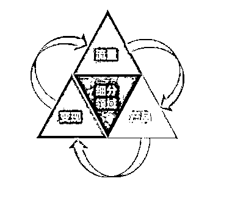
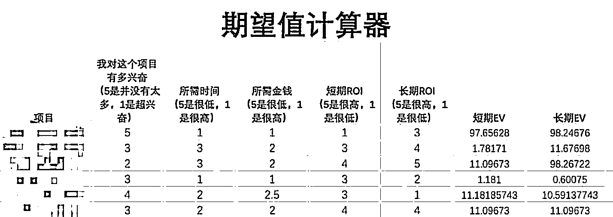

# (精华帖)(305 赞)4 个工具帮助普通人副业定位

作者： Junday

日期：2020-08-19

大家好，我是陈俊达，[呲牙]今天是我在生财的第一次分享。

本次分享的主题是：4 个工具帮助普通人副业定位。

 

 

我先自我介绍下，我叫陈俊达，以前网名凉皮。

一直潜水，我很不好意思。但我一直挺敬佩亦仁哥的，能组织这么一群谈钱不伤感情、厉害的小伙伴在一起交流。

所以今天我也为生财社群献丑一把，希望各位同学看完觉得不错了话点个赞，谢谢各位同学。

而本次分享内容主要是我今年和吴晓波 890 商学院合作的课程中的直播精华，而我应该是吴晓波 890 商学院最年轻的讲师了。

我曾经创业过，是某手游的金团团长，也是某网校的西安分校长，开过 20 多人的小公司，赚过一些小钱，但也失败过，赔过一些钱。

在工作之余，也干过不少副业，淘宝开过店、抖音带过货、做过美食博主，还当过 up 主，同时我给多个公司干过数字营销顾问。

在做副业这件事，因为我享受 0-1，所以我尝试够多，做过不少项目，经过很多项目从零到一的全过程。

今天把我的小小的副业经验分享给大家，希望能帮助大家在科学副业这条路上，少走弯路。

#定位方向不同，选择不同

不过我首先想向大家分享的并不是一个工具，而是想让大家清楚自己做副业的原因，或者是做副业的目标。

大家做副业的原因一般是两种：

第一个是通过副业，去达到自己的职业生涯的第二增长曲线。

通常是自己的副业是和主业密切相关的，比如做跟自己行业相关的自媒体，通过内容来扩大自己在行业的影响力，从而提高职场竞争力。

第二个是通过副业，建立自己的 plan B。

这种情况的同学可能更多一些，一般是到了 30 岁左右，会存在一定的职场危机，建立副业也就是在职业风险侧来控制，当主业出现危机，现金流不会断裂。选择这种副业的同学重点就是围绕着自己的爱好或者业余擅长的事情来做副业发展。

当我们确定了副业的大的目标后，我们再去思考副业的定位就会更清晰些。

# 个体商业铁三角

 

 

图 1

好的，大的目标清晰后，那我想向你分享的第一个工具是商业铁三角。

这个是我理解商业模式的一个小杀器，可以很快的让我们捋清我们副业方向的闭环逻辑。

这个商业铁三角由流量、产品、变现围绕细分领域共同组成，流量、产品、变现形成一套循环自增长体系，也就是闭环。

先说说流量，这个流量换句话说，也就是向我们细分领域里哪个人群会向我们买单。

也就是我们基本盘服务于谁。

大家可以围绕自己的圈层来分析，可以看看自己身边什么样的人群最多，或者是你最喜欢跟什么样的人群去打交道来做分析。

而这个圈子里，他们的人群特征是什么？

比如说有的同学喜欢宠物，那么宠物圈子，尤其是猫圈，可能最多的是年轻 24 岁到 30 岁的女性居多，喜欢宠物，这也就是我们互联网常说的用户画像。

然后呢，你可以把围绕着你的细分领域，所在圈子他们的人群特征，填在这个流量这个三角形里。

填写到这个三角形后，我们就不妨根据这个三角形的这部分人群特征去找到他们最聚集的地方。比如说刚刚的爱宠人群，我可以在宠物社区、知乎上做关于宠物的回答，抖音上做宠物视频等等，关于宠物的内容营销都可以去触达到爱宠人群。

接着你可以通过用户调研，竞品调研，来分析该人群的需求。

说一个简单可实操的方法。

我们可以打开内容平台关于你所想针对的人群的头部 kol，来分析。还是举刚刚的例子，爱宠人群怎么分析？可以通过关键词搜索找到抖音、知乎、公众号上头部的爱宠 kol，首先分析他们的内容，内容即需求，看看他们内容是满足爱宠人群的什么需求？

是宠物护理教程？是萌宠分享？还是其他的？

紧接着，可以通过分析他们内容粉丝的评论，也就是粉丝的需求，最后再把经常评论的粉丝或者热评的粉丝页打开，看看他们点赞喜欢什么样的内容，这就能抓住需求。

抓住需求后怎么办？

将这些需求填写到变现这个三角形里，可以采用的形式是  场景+痛点的形式。

比如：

场景：宠物在家掉毛满地都是，太难打扫了！

 

 

痛点：宠物飞毛严重，难清理。

再去从变现反过来，思考产品这件事情。

首先看我们的对手盘是否满足了这个需求，如果满足了需求，是否完全满足了需求？

大部分爱宠抖音 KOL 满足的都是大家云吸猫、云养宠的需求。

而对于真正养宠的人群，推荐好的实用性强的内容就有一定的空间，这就是个不错的定位。

也许粉丝量级没那么大，  但是解决了痛点，满足了需求，能卖出去产品。

这里的产品我一般指两样：服务型产品和电商型产品。

电商型产品大家都懂什么意思，我说说服务型产品，比如说培训、课程、咨询、甚至是资源、信息的中介都是属于这种服务型产品。

这里注意，服务型产品和电商型产品不是相互对立的关系，可以结合在一起去做的。比如你可以通过 9 元社群筛选和吸引爱宠人群，再社群内推荐宠物好物。

然后将你能提供的产品名称放在产品这个三角形里，再整体看看，产品是不是符合流量的特征，产品是不是符合变现的需求。

这里再补充下，变现不止可以通过电商和服务来做，还有很多方式，比如广告、直播都是很好的变现方式，这也就是所谓的内容即产品，产品即变现。

但是无论如何都要套在这个三角形里，看一看，自己的定位到底是什么，有没有跑偏。

总结一下：商业铁三角，先定人群，再定需求，再定产品，最后形成品牌，围绕定位的品牌部分我们稍后来讲。

好，那我们不妨现在来举一个案例，我的一个好朋友程序员阿正的副业故事。

我的好朋友阿正是一个程序员，今年 28，快到程序员的那个分水岭，所以他就想做个副业防止出现职业危机后现金流断裂。

他刚开始也不知道做什么副业，他没什么爱好和擅长，但是他有个很大的优点，就是他很喜欢研究和学习，于是他经常进入一些学习社群，慢慢的他发现大家都喜欢研究一些学习方法呀或者知识管理的内容。

于是 2018 年底，阿正也跟着这帮爱学习的人开始了长达 2 个月的学习和研究这个知识管理的方向。

 

 

“知识管理”这个方向也是那两年在一些小圈子火的，可能现在很多同学还是不知道这件事是干嘛的，其实就是对知识进行收集整理和输出的一套方法论，是不是特别小众？

但是一说一个软件，大家肯定都知道，印象笔记。

通常大家知识管理用什么软件呢？印象笔记。

刚开始他也不会知识管理，于是就在买课，在在行上请教这方面的人。

后来他发现知识管理这件事在外做内容和讲课的人并没有把知识管理和印象笔记很好的结合在一起。

也就是工具和方法没有很好的结合在一起。

于是他就又去研究印象笔记这个软件，看看官方文档，很快的他对知识管理和印象笔记这个软件的钻研就很深入了。

那么既然已经有自己深入的方向了，该怎么找到这些流量呢？

后来他发现喜欢知识管理的人，都是喜欢学习的人，知识工作者，综合素质偏高，而这群人，最符合互联网平台里知乎的调性，于是他就去知乎上去写跟知识管理、印象笔记的回答。

很快的积累粉丝多了，他发现了这些人真的不太懂到底如何使用印象笔记进行知识管理。

于是他就做了一个关于如何利用印象笔记来进行知识管理的课程。

现在每个月光靠卖这个课程都能轻松的月入过万。

那我们根据阿正的案例，来做一次商业铁三角定位。

先定人群，爱学习的人，再定需求，学习方法和知识管理，再定产品，以咨询和教程的方式来。

流量是  喜欢学习的人、知识工作者居多，和国内知乎平台最符合。

产品是  利用印象笔记来进行知识管理的课程。

变现是  想要有效的组织信息和知识，但却不会使用工具来进行知识管理。

这样就通过细分的定位，达成了商业的闭环，他也很容易的现在轻松副业收入过万。

好，这个案例过完，想必大家对商业铁三角有个初步的了解了。

那么我们进行下一个工具的使用。

 

 

# 追求长期价值，品牌造壁垒

# 为什么追求长期价值，一定是品牌

作为一个长期主义者，想要建议可持续稳定的被动收入，那么一定要在某一个品类成为品牌。

只有在一个品类做一个品牌，占领了某个人群的心智，获取了固定人群的信任，这样才能获得足够的溢价和变现。

定位理论认为，品牌是品类及其特性的代表。

而对于个人副业建立，就是找到一个细分品类，一个细分领域，扎下去，无论是做电商产品还是服务产品，都可以持续的通过品牌进行被动变现。

例如只有你成为爱宠人群的 KOL，你有你的个人品牌，你说的话才足以让人相信，你出售的电商产品那些爱宠人群才会向你下单，你写的教程他们才会购买。

我曾经写过一句话：流量效率最高的方式是广告、变现效率最高的方式是电商、而留存效率最高的方式是品牌。

个人品牌是最适合个人副业去做，长期价值最高的方式。

而个人品牌，最容易的方式就是做内容。

# IP 铁三角

图 2

那么如何做内容呢？我向你推荐今天的第二个工具，叫做 IP 铁三角。

就是以自己在上一步选择出的大方向（细分领域）的内容为中心，以某种主形式例如视频、文字为表达形式，传递内容背后的三观、美学、趣味（实用）。

内容是 IP 最主要的呈现因素，而这个 IP 铁三角就是帮助我们定位个人品牌的内容的。

接下来我给大家一一解释一下这 IP 铁三角的每一个元素，可能内容理解比较难，我尽可能把里面晦涩的内容具象化，建议大家在这块保持注意力，这是我学习研究出来的内容心法。

 

 

# 趣味实用

趣味性是有趣，是让内容灵动起来的元素，比如说有趣故事、梗、段子、押韵、表情包、双关语、新奇特的观点和现象等；

实用性是知识，对受众的生活等方面起到作用的内容。比如说硬核分析、锐利观点、详实数据、工具教程、方法论、思维模式、好物推荐等，像我今天的内容就是实用性偏多，趣味性偏少；

# 美学

美学是审美，是美感。包括 BGM 的搭配、素材的选择、展示的舞蹈、优美的词藻和诗句、戏剧性的内容处理、电影感的画面、先天的颜值、身材、声音等，后天的品味、气质等、电影感叙事风格、颜色、形象、音乐、IP 的选择（例如网红音乐等）

# 三观

很隐性，包括世界观、价值观、人生观，会影响对事物、世界、人生、金钱的看法。利用三观输出内容是最容易调动用户的情绪的方式。

而对于定位来说，比如我们要切入一个大的领域，例如 PS 培训，做 PS 培训的不少吧，做相关内容的更不少。

按照蓝海战略来说，PS 这个大的领域就很难切入。

那怎么办？用这趣味实用、美学、三观，这三方面来找切入点，来找定位。

比如 ps 培训大部分人都打的是实用性强一些，那么我们可不可以打趣味性+实用性结合在一起呢？

这不就差异化定位了。

抖音就有个小姐姐，叫做赵琪琪爱 PS。

大家都在教一步步 ps 该怎么做的时候，她就换了个思路，趣味性的 rap+实用性的教程，一下子就做到了近 800 万粉丝，广告费六位数。

咱们再说个创业品牌的案例，实用性跟实用性结合的，元气森林是我最近经常喝的一个品牌，听说过的同学可以点个赞共鸣一下。

他就是选择饮料赛道，然后“减肥”+“好喝”=估值 140 亿。

 

 

所以大家在副业定位时，尤其是内容和品牌的定位时，不妨以趣味实用、美学、三观，这三方面结合来找切入点，来找定位。

同时呢，我们在商业铁三角那块想清楚了闭环，就可以围绕赛道去选竞品了。

观察竞品的，趣味实用、美学、三观，这三方面。

趣味和实用性是浅显易观测的，在大的类目下可以关注他们的趣味（有趣故事、梗、段子、押韵、表情包、新奇特的观点和现象等）、实用性（硬核分析、锐利观点、详实数据、工具教程、方法论、思维模式、好物推荐）密度来确定应该在本类目下应重点发展趣味性还是实用性。

这里要注意一点，趣味是可以低成本产生的，更多的是灵感和创意。

而实用性是需要大量的调研和数据支撑的，如果非业内资深人士，可以考虑在实用性上稍弱一些，或者购买相对应的课程、书籍，查阅相关资料，进行补充。

所以实用性较强的内容延续性和更新速度会相对较差，可以做精品路线。

趣味走的广，实用走的深。

简单来说就是趣味性更容易吸引粉丝，扩大影响力。实用性更容易让专业人士买账，塑造信任背书，容易塑造品牌，这是需要平衡的。

在美学上，重点可以以竞品内容的选择，排版处理，音乐的搭配，画面的处理，真人的颜值、气质、表现力，声音的效果、画面的流畅感、音乐的匹配度、文案的节奏感、舞蹈的专业度等方面来进行观测，一句话，感性的来看有没有美感。

三观是内容的隐性基底，是风险和机会并存的，这个很难说通过某个元素来看出来，更多的是人导致内容的呈现的情绪不同。

最后一句话总结一下，趣味和实用性是内容的核心，美学会让内容达到第二增长曲线，三观是风险和机会。

# IP 坐标轴

图 2

好，我们进入第三个工具，IP 坐标轴，这个是刚刚 IP 铁三角的一个延展，我今天由于内容长度问题，不展开讲，只简单聊两句，同时也可以作为我今天内容的思考题，我认为一场有用的帖子一定是能引起大家思考的。

 

 

在这个 IP 坐标轴 x 轴、y 轴、z 轴的坐标，所代表的是我们的内容定位，大家可以通过 IP 坐标轴找到自己的个人品牌应该所处的位置，以及找到市场上定位的空隙。

大家在选择自己内容定位时，重点可以思考下这张坐标轴，将对手盘带入进去，思考他们的坐标，以及我们 IP 在哪个坐标上能打的过他们。

# 把握短期现金流，保持副业活性

# 为什么要把握短期现金流

很多同学刚刚听完了长期价值、个人品牌那一部分可能云里雾里，跃跃欲试，那么在本次直播分享的这个部分我就开始揭雾、浇水。

相信我，绝大部分人做副业这件事，3 个月没有现金流，基本都会非常沮丧，而绝大部分人半年没有现金流都会放弃，不过这部分放弃的人，要么是方法不对，目标定的太大，要么是不持之以恒。

大处着眼，小处着手。做副业，我建议大部分同学都着手一些，看一看短期的现金流。

在这个部分，我会分享一个我的副业案例，一个我的朋友的副业案例，以及分享我认为几个有前景的方向。

# 从兴趣出发

首先想分享一下我的第一个副业，也是我现在还在做的副业，数字营销咨询。

我的这份副业是起源于我的兴趣，2018 年，刚第二次创业失败赔了几十万一身沮丧的我，没有绝望，想重新开始。

因为上一次创业失败我总结是我营销能力不足，于是我就去学习营销，没想到我却对营销有了非常浓烈的兴趣，但为自己制定的首要目标不是再搞一番大事，而是日复一日的用知识疯狂的洗涤大脑，买书、听网课、我记得我家那本科特勒的市场营销都被我翻卷 

 

了，然后还看了什么抖音的、微信的、淘宝的上千个营销案例。

还有市面上知名的落地的营销网课都被我扫了一遍，花了五个多月时间。

五个月后，我的营销能力大精进，足以让上次创业失败，市场的问题不会重现。

后来又去创业了，但是同时我也想找个副业。

因为学习了一大段时间营销策划和数字营销，自己手头资源不足，很多想法没法实现，但是又想验证自己能力，实操起来。

那么我的客户是谁呢？是需要互联网营销策划的人。

于是我每天在各种互联网营销群晃荡着，像找猎物一样，找到需要互联网营销策划的人，想着法秀自己肌肉，给他们表示：我是专业的，我给你些建议吧！

提供什么的产品呢？就是我的策划。

刚开始我是免费帮别人做策划的。

只给关系不错的线上熟人或者线下熟人做，嘿，还别说真管用，第一个月我就找到了 15 个愿意咨询我的人，虽然咨询是免费的，但是人情是无价的。

这 15 个人中间，有 10 个人应用了我的建议，当时刚开始的营销策划都是一些落地细节的策划，很好去执行，后来这 10 个人有给我几万块谢金的，也有其他方式表示感谢的。

利他真的很重要。

后来做付费咨询，定价线上一小时几百，没多少钱，但是有一个筛选作用，同时我还做了另外的一件事，付费咨询觉得我的咨询内容价值小于价格的，全额退款。这是第二阶段的杀器，其实还是利他思维起作用。效果很好，一个月也十来个人来咨询，至今还没遇到退款的，慢慢的就建立稳定副业收入了。

那我这是数字营销服务靠什么变现呢？靠我的服务、策划、咨询、培训等等。

后来通过我的咨询的一些案例背书，加上我创业做的一些小项目，我开始给一些企业开始做咨询和策划，服务过知名连锁餐饮店、抖音某头部 MCN、知名教育公司等等。

也去过百度这样级别的大厂做过分享和培训。

虽然现在创业如狗，很少接咨询的 case 了，但是通过我这个副业积累了大量实操的经验，为现在包括未来做项目做了很好的积累。

其实就是想通了流量产品变现这个闭环，想通了谁需要我的服务这件事。

# 从前景出发

 

 

对于前景这件事，我不能说我准确的预判，因为针对每个人的副业前景是不同的。

但是前景这件事，核心看供需关系，不能逆着趋势来。

我在前阵子在我的公众号上分享了我创业观察的几个赛道，消费品新品牌、跨境电商和跨境游戏、tik tok，我目前重点观察观察的是女性消费品、食品新品牌这块。

而对于大家副业来说，我更建议大家重点观察几个副业领域：

第一是 B 站。掌握年轻人就是掌握未来，大家如果想要做视频自媒体我建议可以重点观望下 b 站。

第二是快手。快手虽然量级不如抖音，但是竞争要比抖音小很多，如果你刚开始做视频，我建议先试试快手，短视频和直播的形式是不错的，而后再入局抖音也是个很好的选择。

第三是从短期现金流出发可以重点看看国外的兼职平台，比如 upwork，如果英语还不错了话，相对于国内人才竞争比较大，甚至有些恶劣的环境，国外绝对要友善非常多。无论是策划、中国市场的调研，还是剪辑、文案这种基础的活，甚至中文教学，都要比国内环境 ok 很多。

这样先通过做第二职业雇员的形式来磨练自己技能，拿到一定案例，还能有现金流，也是一个不错的选择。

那么以上就是对于短期现金流的部分，可能我讲完后，你有了长期的打算，也有短期的想法，那么怎么去抉择呢？我就要引出我的第四个工具——期望值计算器。

# 期望值计算器

图 3

这个期望值计算器就是通过一个简单的数值来排列我们心中的项目优先级的。

首先将我们选好的几个项目名称填写至项目那一列，然后分别填写兴奋度、所需时间、所需金钱、短期的投产比、长期的投产比，最后我写了个函数，会得出两个值，短期的期望值和长期的期望值。

这时候就可以针对我们个人的性格和条件进行选择副业了，偏重于短期现金流的同学可以选择短期期望值高的，偏重于长期价值主义的可以选择长期期望值更高的。

这个表格文末有获取方式。

大家可以将这个表格对比的数值进行定位决策。

 

 

那么我分享的第二部分 4 个工具助定位就结束了，在我分享的第三部分，我给大家分享一下我定位的六句心得。

# 副业的方向是动态变化的

第一句是，副业的方向是动态变化的。

首先，因为我们刚开始做定位实际是了解市场，和了解自己的过程。

更重要的是了解自己，尤其是自己的爱好，擅长。

想要找到一个一下子能让自己从床上蹦下来的事并不是个容易的事。

而随着我们对用户了解越来越清楚，对商业的闭环理解越来越深入，也会不断的调整定位，甚至会选择另外一个方向，这都是非常常见的。

还有一种可能性是我们的副业需要再定位，升级定位。

比如以前是做火锅店室内设计的，随着副业业务的发展，慢慢就可以升级成餐饮室内设计。

所以，副业的方向一定是动态变化的，一定是随着业务的发展和对自己的探索，不断调整的。

# 先完成，后完美，快速试错

第二句是，先完成，后完美，快速试错。

刚刚我说，副业一定是快速调整的，尤其是探索自己，一定是先做成商业闭环，先完成，这件事情最重要。

而在做副业这件事，最大的难点一定是做产品，无论是做课程、做咨询，那都是需要相当大的积累。所以怎么快速验证这个商业闭环是否成立，怎么快速验证这个商业闭环是否符合你自己就是个非常重要的事情。

对于产品来说，电商产品我建议大家刚开始可以选择像 1688 这样可以一件代发的平台，像服务型产品，我建议大家刚开始不要去制作，直接去用市面上成熟的，比如说我们生财一些朋友做的课程，亦仁哥组织的训练营，就很不错，如果你也想做这样的副业，你 

 

就可以向朋友推荐，你在赚取佣金的同时，也能验证了这件先验证自己能不能通过内容吸引到一定的粉丝，能否跑成商业的闭环。

先完成，后再进行优化，比如说做产品，优化转化率。快速的去验证商业闭环，快速的去试错。

# 一米宽，一千米深

第三句，一米宽，一千米深。

意思是指我们再上一步找到了自己的商业闭环，发现了自己愿意做、并且能做，能带来稳定收入的的副业方向，快速的打井。

选择一个垂直类目的赛道，对手盘没那么强，基本盘在自己承受范围之内，向下挖井，挖一千米深。

你经常可以看到一些在某个行业深扎 5 年以上的同学，可能他的文案水平很差，他的专业水平也没有那么强，但是就是依靠着自己挖井的功夫，挖了一千米深，就能给他带来源源不断的现金流。

# 笃学好古，别重复造轮子

第四句话，笃学好古，别重复造轮子。

笃学好古的意思是指，专心致志地学习古代典籍

而造轮子，直播间做 IT 相关的同学肯定知道，就是说业界已经有公认的软件或者库了，你明知道自己摸索不可能比它做得更好，却还坚持要做。

这两句加一起是什么意思呢？就是相信我，永远有人把你做过的事，做了一遍。去学习他们就好了。

这里我引进个概念，叫做跨领域学习。

比如最近爆火的直播电商，在前两年刚开始火的时候，谁知道怎么做呀？难道全靠自己摸索吗？并不是，去思考前人怎么做的。

跟直播电商有共性的是什么？电视购物，找到最优秀的电视购物节目，去拆解他们的模式，然后复用在自己身上，最多再做一些变型，比如直播间引导弹幕，让大家扣“1”。

 

 

所以千万不要重复造轮子，研究竞品、研究历史非常重要，会对你定位和方法非常有帮助。

# 做有门槛的事，敢为天下后

第五句话，做有门槛的事，敢为天下后。

我前阵子在我的朋友圈分享了这么一句话：

很多相对比较聪明的人都会做高杠杆、低成本的事情，导致这个事情竞争就很大，因为聪明人都进去干了。

其实只要事情稍微麻烦一点，竞争立马就会小很多。

所以比较聪明有时侯不是好事。

稍微门槛高一点，立马海阔天空。比如微商，就是一个很没门槛的事情，大家都能做，那我们凭什么能 pk 过别人呢？如果换个思路，我去 1688 找厂家，拿一样的货，我可能麻烦些，需要一件代发，甚至联系厂家。

但是立马利润高了，变现空间有了，未来也大了。

而敢为天下后，是对一些不太自信的同学说的，他们的优势、擅长可能很多人都在做，导致他们忐忑不安，要自信些，相信自己能力，相信市场足够大，相信自己能找到差异化的定位，如果市场足够大，即使不是第一，第十也要比别的小赛道第一可能要赚钱。

# 躬身入局者赢

最后一句话，躬身入局者赢。

相信参加生财的都是非常聪明非常勤奋的小伙伴，但是我知道，真正能开始副业的，并且能坚持下去跑成闭环的，可能比例不会太大。

不过我还是希望大家都能科学的开启自己的副业之路，正式开始自己的人生 B 计划，也祝各位老板发大财～

 

 

那么我本次分享就结束了，如果想要交流欢迎加我 vx:592146145。

  

 

 

评论区：

初心 : 支持！

Junday : 谢谢老板的点赞[转圈]

Charles : 干货满满，谢谢大佬分享

Junday : 谢谢老板的点赞评论支持[转圈]

Lissa Tam : 超赞，躬身入局者赢

Junday : 谢谢老板的点赞

宋大刀 : 看完收货满满  谢谢大佬的分享

Junday : 谢谢大佬的点赞和赞赏[转圈]
