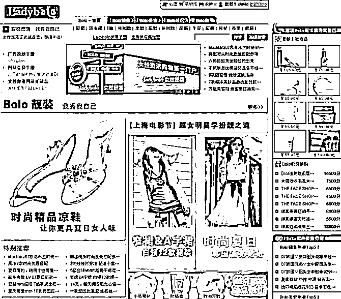
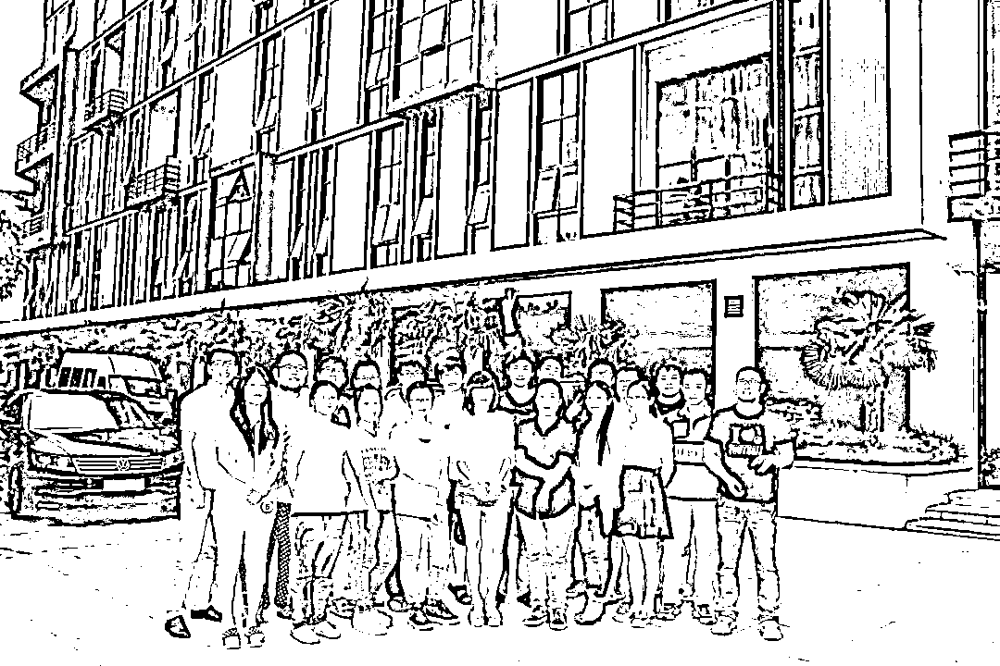
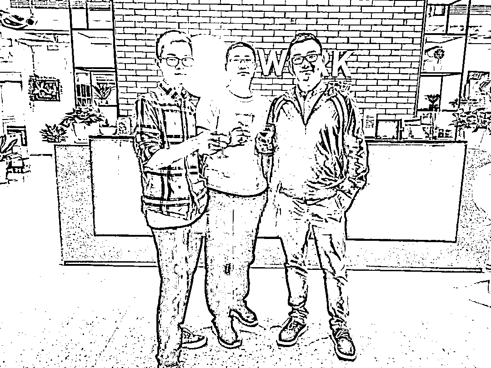
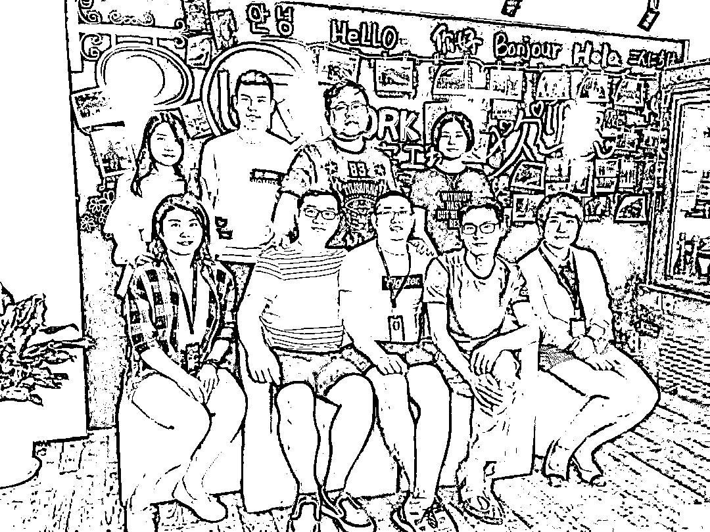
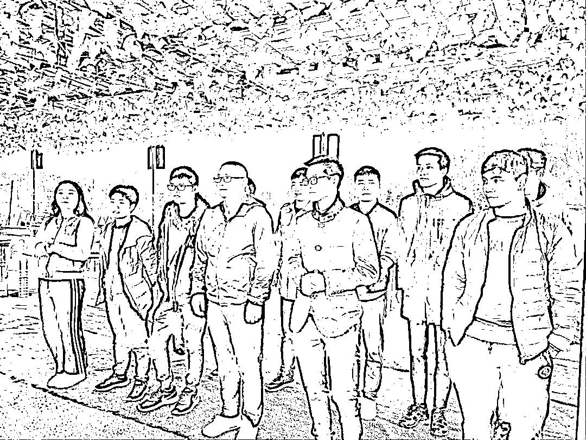

# (精华帖)(270 赞)血与泪，我的十年创业故事

 

 

作者：  老胡

日期：2021-09-01

圈友们，大家好，我好久没在生财有术分享了，主要还是我今年事情多，内容产出太少，这段时间我花费了半个月的时间写了一篇 10 年创业血泪史总结，发出来和大家一起分享下我花费了几千个 W 总结出来的一些血泪教训和经验，希望对大家有帮助。

一、前言

实话说从去年开始我都想写一写这些年的创业总结回顾，不过那个时候创业才 9 年，我想等到创业 10 年的时候再来总结下我那些年关于创业的血泪史。一方面是给自己 10 年创业小结复盘一下，另一方面也可以给大家一些参考借鉴。

到今年的 7 月 1 日我算正式从返利网离职创业 10 年了，原计划这篇文章应该是在 6 月底写完，然后准备 7 月 1 日那天发出来的。可是那段事情心情烦躁，具体是什么事情这里也就不说了，反正就是无法安下心来静静的写点东西。

于是一拖再拖，然后就拖到了现在，一转眼这都 9 月了，如果再不抽时间写出来，估计这篇文章很大概率会流产，因为这个选题在我的日程表里一而再、再而三被延期。

前段时间我看到曹大(caoz)写的一篇关于创业的 10 万+爆文，感慨良多，估计不少朋友都看过。

曹大在文章的开头写到“十年前，我一直在鼓动别人创业。5 年前，我会注意区分什么人适合创业，什么人不适合。而现在，基本上，我会试图劝退每个想要创业的人。为什么？因为时代的机会窗口，越来越小，而创业的机会成本，越来越高。没看过的建议看看曹大的 ”还在做创业梦？醒醒！“ 这篇文章。

 

 

我自己也走了 10 年的创业路，也算的上是个老油条了,做了这么多年创业狗，前前后后干了不少项目，砸进去了几千个 W。所以身边经常也有很多老朋友和年轻的朋友咨询我，说他们想出来创业，让我给一些建议。

绝大部分情况下我都是劝退，只有极少数我认为他真的很强，有资源、有积累且时机等各方面都合适的那种我才会去鼓励。有时候去劝退那些人可能还会导致他们还不理解，以为我不希望让他们“暴富”。

直到他们自己真的投身创业被毒打后，就会经常找我来聊天“老胡你当时给我的建议很好，但当时听不进去啊，有点后悔了”。

我说很多事情你没有身受是无法感同的，把这段经历当做人生的修炼也挺好。其实创业这 2 个字听起来很高大上，但是等到你真正的投入进去以后，才发现这 2 个字代表着什么含义。

创业不是什么高大上，不是一路非常顺利的从天使到 A B C 轮融资，然后 IPO 上市，接着买上大别墅，迎娶白富美，走上所谓人生巅峰。

不管以前你的职场履历多牛逼，自从你开始创业开始的那一刻就进入了一个茫茫的未知领域，需要你趴在地上匍匐前进。还可能随时遇到雷区导致你直接挂掉，所以战战兢兢、如临深渊、如履薄冰、时常焦虑、彻夜失眠都将是你的生活常态。而且大概率将会是创业不成一场空，输掉了你的全部（包括自信心），严重的甚至还会妻离子散。

我相信以上这些话但凡真正独立创业过的，尤其创业 5 年以上，真正亲自操盘从 0 到 1 做出过一点点成绩的创业者更加深有体会。

 

 

所以我这篇文章没有华丽的辞藻，也没有需要增加转发量而去写煽动你创业的激情文字，更不会去吹牛逼和装逼。而是真正把我这 10 年的一些个人创业血泪史和小经验总结和大家分享下，都是实打实的个人经历和心路历程。

因为本文内容比较多，所以我分成 6 个模块来展开，分别为：

1、前言；

2、我和电商的结缘及 3 次小型创业经历；

3、创业干“返利邦”时期；

4、创业干短视频导购“玩好货”时期；

5、创业干社交代理淘客“兔子优选”时期；

6、后记；

废话不多说，下面正式开始写。

二、我和电商的结缘及**3**次小型创业经历

 

 

在正式写我的 10 年创业经历之前，还是先讲讲我和电子商务的结缘以及我的三次小型创业经历，因为这几次创业对我的认知提升也有非常大的帮助。

我和电子商务的结缘起始于 2004 年我在北京工作的时候，那时候我刚从学校出来，去了北京在一家卖牧羊犬的老板家里帮他做网站，是个私人小企业。

我至今记得他家位于朝阳区的楼梓庄，家里养了 200 多条牧羊犬，最贵的一条名字叫“威士忌”，是从德国进口的，当年花了 300 万。

2004 年的 300 万对我来说真的是一个天文数字啊，而这条尊贵的“威士忌“就住在我们老板家的别墅车库里，每天 24 小时有专门的人来伺候。

可能你会问，为什么一条狗要这么贵，因为这条“威士忌”的爷爷、奶奶、外祖父、外祖母都是获得过国际大奖，我也是那时候才知道狗也是要讲究血缘关系的。

我在他家负责网站的运营和维护，说简单点就是每次他们请摄影师帮这些牧羊犬拍摄好了照片以后，由我来处理这些照片并发布到网站上去。然后在维护下网站的论坛，因为大量的买家和需要配种的人都是通过网站了解情况和通过论坛进行留言交流的。

平时事情真的很少，甚至有点无聊，不过日子过的还挺舒服的。

舒服到什么地步呢？我的办公室在老板家的大别墅里面，衣服有保姆给我顺便洗了，吃饭和老板一起每天有专门的厨师来做，最大的缺点就是极度的无聊，每天就我一个人在他家办公，缺少交流和学习的氛围。

 

 

（牧羊犬老板家的大别墅）

所以我没事就上网看新闻学习，我至今记得在 2004 年的 12 月底，我看到了马云荣获“中国经济年度人物”的称号，我当时看到马老师讲的那些话，真是热血沸腾啊，我摘几条金句出来一起回忆下。

他说“如果马云可以成功，那么 80%的年轻人都可以成功“、“蚂蚁雄兵可以战胜大象”、“男人的长相和他的才华往往成反比”、“今天你不电子商务，未来你将无商可务”、“平凡人也可以干非凡事”、“今天很残酷，明天更残酷，但是后天很美好。只要永不放弃，过了明天，我们也许就能见到后天的太阳”。

当我看完马老师的这些讲话以后，整个人仿佛都被点燃了，当时心想我一定要加入这家公司，只不过当时远在北京，身上也没什么钱，我一个人突然跑到杭州来，那也不现实，所以就没行动。

 

 

因为在北京待的太孤独（跟我一起去的同学大部分都陆续回家了），外加我也不适应那个干燥的气候，所以 2004 年底我就离职了。

回家过完年后，我就去了上海，本来我是想一个人去深圳闯荡的（那时候有点天不怕地不怕的感觉），但是家里人还是坚持让我去上海发展，因为我家好多亲戚都在上海，包括我姨和舅舅他们，那么去上海找工作就会方便很多，因为刚开始就住在他们家里，我都不需要考虑房子和生活的问题。

我去上海后找的第一份工作是在一个培训学校里当计算机老师，第二份工作是广告设计制作。虽然做的不是电商，但是我一直对电商保持着学习和关注，那段时间我每天都通过“电子商务世界”、“艾瑞网”等网站了解互联网和电商行业的动态。

然后在 2005 年 10 月份我就入职了一家垂直 B2B 网站做网站设计，后面转岗做了运营，同时我利用业余时间还兼职开了一个淘宝店，卖的是高仿大牌运动鞋，从阿里巴巴 B2B 网站上进货（今天的 1688），然后在淘宝上卖，也就是今天大家熟悉的一件代发、无货源店铺模式。

刚开店第三天我就通过网络赚到了人生的第一财富，这笔财富是多少钱呢，是 20 块钱。

我至今仍然记得这个下单的客户是湖南怀化的，当时他在旺旺上咨询我以后，因为没有支付宝，还是通过邮政银行给我打的钱，当这笔交易结束以后，我兴奋了一周。

原来通过网络真的可以空手套白狼，赚到真金白银啊，正是由于赚到了这 20 块钱，让我对电子商务产生了浓厚的兴趣，从而改变了我后来的人生命运。

 

 

在 2005 年-2008 年我都一直在淘宝兼职开店，其中 2008 年之前只卖运动鞋，2008 又开了女装店（也是一件代发的模式），每个月通过这两个淘宝店能帮助我赚到几千块，在加上我上班的工资收入，日子还算过的去，农村贫苦家庭出身的我，还是蛮节省的，所以平时我也不怎么乱花钱。

在开女装店的时候，我发现了一个需求，就是大量的女性用户每天通过旺旺咨询我，问她们买了这件衣服以后应该怎么搭配。其实我一个钢铁直男啥也不懂呀，于是我都是复制过去问我的供应商，她们回答以后，我再复制发给客户，基本上就是 Ctrl+C 和 Ctrl+V 两个操作。

但是随着问的人越来越多，我发现如果做一个教女性穿衣搭配的网站应该很有前景，毕竟我一个小小的女装店每天都这么多人咨询。

后面就和一个干技术开发的朋友一起做了个女性咨询和购物的网站，当时我们那个网站的名字叫“女性部落”(ladybolo)，网站的内容都是我们从各大门户搬过来的，只不过我们会在网站的右侧配上文章中介绍的相似服饰鞋包进行售卖，而这些服装供应链的来源就是阿里巴巴 B2B 网站和淘宝上的一些大卖家。

 

 

（我们当时的女性部落网站截图）

当时我们两个也没多少钱，所以付费推广都没弄，那时候也不知道 SEO 这些免费获取流量的方法，唯一的推广方法就是去各个论坛发帖子。还有自己上传视频到优酷上去，然后在视频内加入我们网站的广告，流量来的也有，但是非常的少，始终没有起色，所以干了半年我们就给关掉了，这就是第一次创业做平台的经历。

虽然给关掉了，但是在 2008 年初我们这个网站还获得了上海互联网站长大会给我们颁发的“最佳草根创业之星”奖。

 

 

评委是原新浪网创始人王志东、大众点评 CEO 张涛、艾瑞网 CEO 杨伟庆、百姓网创始人王建硕等一众大佬，当时评选的理由是我们很好的把资讯和购物进行了结合，是一个很好的创业方向，也算是虽败犹荣吧。

后面一直到蘑菇街和美丽说诞生以后，这个时候我才觉得我们当时不应该选择图文的内容导购，而是应该直接采用读图的导购模式。

不过那个时候淘宝上卖家的图片都拍摄的很一般，没有什么模特出镜和专业摄影来拍，所以观赏感不佳，如果当时通过读图导购模式的话应该也做不好，但是这样会比较轻。

而蘑菇街和美丽说诞生的时候，淘宝上的商品图很多都已经非常的精美了，大量的店家也都采用了模特和专业摄影师来拍摄，所以这个时候采用图片导购的模式是非常好的。

一个商业模式如果大方向没问题，而产品的落地解决方案和当时的天时地利与人和也非常的关键，这个做过产品的人都应该身有体会。

当我们那个“女性部落”导购网站停止运营以后，2008 年初我就和一个朋友去了广州。

干的是啥项目呢，就是通过淘宝网开店卖二手笔记本电脑业务，当时广州这块的产业链非常的丰富和发达，基本都是从国外弄进来的淘汰笔记本电脑，经过一番的硬件更换和修复后能变成一台看起来有 7-8 成新的二手笔记本电脑。

我们当时判定中国的网民伴随着互联网的发展一定会大幅度的增加，绝大部分人之前都在网吧上网，而后面一定是要自己买电脑在家上网的，所以电脑硬件的需求尤其是笔记本电脑的需求会非常大，我们要抓住这一波机会赚到钱。

 

 

正如我们所想的那样，生意每天都还不错，一天可以发几十台笔记本电脑出去。

但是面临的问题也很突出，那个时候淘宝上的竞争也很激烈，也没有任何的付费推广手段，我们只能靠把价格压低，然后依靠消费者在淘宝内通过价格筛选这样来做到搜索排名靠前，基本一台电脑的平均利润在 200-300 块钱。

看似有点利润，但是我们每次给用户发货的时候都要选择保价，又要额外增加几十块的成本。且大量的客户收到货以后，都来找我们询问，为什么说好的硬盘 100G，他们那里显示只有 80 多个 G，内存说好的 512M，为什么显示只有 475M 等一堆问题，其实懂的人都知道这些都是正常的。

但是客户不懂啊，他们就是纠缠不休，我们只能又答应补偿几十上百块给他进行安抚。

这样算下来，一单利润差不多只有 100 块左右了。这还不是最严重的，最严重的是啥呢，经常有客户要求退货，当我们收到退回来的货以后，要不电脑就被摔坏了，要不就是一个空包，里面的电脑丢失了，这样的损失就太大了。

再加上各种库存压力，我们一次拿货的多，供应商就给我们价格更低，所以库存占比也不少，很多时候拿进来的货堆在那里又卖不掉，变成了成本。所以这样整体一算账，这个生意模型不成立啊，根本赚不到钱，结果我们干了半年多又给停止了。

最后我们就都返回了上海，我是 7 月份回来的，重新回到上海的那一段时间，我是真的感受到了什么叫创业不成一场空。

当时身上的全部现金也只有几千块，租完房子以后我身上就剩了几百块钱充当生活费，连一件像样的衣服都不敢买，后面还是找同学借了几千块才挺过来那段艰难岁月。

 

 

我那个朋友后面也回到了上海，不过他转型去卖女鞋去了，这个事情他一直做的也很不错，一年赚个几百万。

而我没有再去选择开店卖货，去了朋友公司干了半年多，2009 年初又经过另外一个朋友介绍认识了返利网创始人 Gary，加盟了返利网一起创业，继续在职场发展。

经过这三次的小型创业，可以总结的点还是蛮多的，其实我最早做的淘宝店生意模式就很不错，回过头来看这个事情是完全可以规模化复制放大的，而且还比较轻。

比如搞店群，在淘宝开几百家卖运动鞋的店，开几百家卖女装的店啥的，伴随着中国电商和淘宝的快速发展，一年能赚几千万、上亿都是可以实现的，后面天猫做起来了，如果再注册个品牌搞天猫店也是个不错的路子。

这些年很多赚到大钱的人都是在淘宝选择做无货源店群和大卖家呀，而我却 TMD 选择了搞平台去（这是九死一生的事情），错过了一次伴随着淘宝发展壮大的机会，至今我都认为这是我错过的最赚钱机会之一，不过那时候认知太局限了。

虽然嗅觉灵敏入局早，但是根本都没想到过这个事情可以这样放大干，我只是帮它当做一个副业玩着，说到底当时还是小农思维，没有什么认知。

还有选择卖笔记本电脑这种产品，遇到的各种问题，让我这么多年始终对直接卖货一直有恐惧心理，不敢去碰货，只是选择做比较轻的流量型项目。其实有时候是品类选择的问题，比如最近认识的一些朋友，他们在抖音上做卖货，就没什么售后问题，而且毛利润有 50%以上。

三、创业干**“**返利邦**”**时期

 

 

经历过上面那三次小型的创业后，我就停止了三年，老老实实在职场好好发展，积累经验。大家可以通过我之前的那篇讲几个返利网上市背后的小故事，详细了解我那几年。

2011 年的 6 月 30 日我结束了在返利网的最后一个工作日，7 月 1 日就开始搬到上海宝山顾村那边的海宝创业园区开始了这次创业，创业项目是一个专注于做淘宝返利的网站，叫“返利邦”。

这次创业的初心很简单，主要是看好淘宝返利这个大市场，觉得这里面可以产生赚大钱的机会。

因为我在返利网工作那几年，我们主要都是围绕京东、凡客、唯品会、当当、亚马逊等众多 B2C 进行的返利导购，而当时占据电商 90%市场的淘宝并没有开放相关数据接口，所以做淘宝返利没办法实现。

但是我深知如果淘宝能够未来有一天开放了相关数据接口，那将会是非常大的一个市场，我自己也一直在持续关注着。

为了验证我这个想法的靠谱性，期间我还做了一次小型的试验，那就是我自己创建了一个网站，直接调用淘宝联盟的相关频道，然后告诉用户通过这个网站去淘宝购物，购物成功后在网站后台提交相关订单编号即可拿到返利，其实这背后都是我人工来进行返利操作的。

最早的冷启动方式就是我在百度的贴吧里发了个帖子，告诉大家淘宝购物居然还可以有返利拿，发了几张返利到账的截图，然后简单介绍下网站。

 

 

通过百度贴吧的帖子，第一次发展了几百个种子用户，然后每一个注册的用户我都单独人肉发送了邮件，每次返利订单到账后我也都人工发送了相关邮件，那个时候并没有使用系统化的邮件模板，我都是人工在操作，精心维护。

后面我还开通了邀请好友也有奖励的功能，就这样踏踏实实的干，功夫不负有心人，也就才 2 个多月吧，轻轻松松就做到月佣金破 5 万了。

这个模式被验证后，一开始也没想过马上融资去干，还想着在继续测试一段时间看看，主要想有没有低成本、规模化放大的可能和增长方法。

但是在 2011 年某一个周末的下午，当时我还在办公室加班，一个认识多年的朋友 QQ 上问我“老胡，你要不要出来创业，我给你介绍投资人呀”。

就这样 2 周后我们在上海中山公园附近和那个投资人一起吃了饭，天使投资人基于对我的信任，一周后就签署了一份 2 张纸的简单投资协议，接着就有一笔投资款直接打入我的个人银行卡。

实话说当时出来创业内心还是蛮纠结的，因为返利网这边刚刚完成了 A 轮千万美金的融资，不管是薪酬还是相关福利待遇也都有很大的增长。

不过我当时纠结了 2 天，经过思考还是果断的选择出来了，当时想的是就算我创业没成功，大不了在回去上班好了，也许那个时候经过创业磨练过的我能力会更强。

就这样我带着投资人给的 69 万现金，外加我自己投了 5 万块，一共 74 万的启动资金，带着一个技术和客服，一共三个人就开始了草根的创业之路。

 

 

（返利邦早期的三人小团队）

当时为什么把办公室设置在宝山顾村那么偏远的地方呢，因为我那个技术开发住在那边。所以我就为了他方便，直接在那边附近的创业园区找了小小的办公室，办公室很小只能坐四个人，当然房租也比较便宜，每月 1200 元。

在那个小小的办公室里我们干了 3 个月，然后就换到了一个可以坐 8 个人的办公室，我们当时的目标是一年后可以进城，至少搬到地铁站附近，这样方便未来的同事上下班。

我们用一周的时间开发好了新的网站，把之前的种子用户信息导入，接着就开始了推广，刚开始我们只是增强了邀请好友的功能，通过这个实现了前期的裂变增长。

 

 

后续经过一个朋友的介绍，我当时找到了一个微博的草根大 V 合作微博推广，本以为只是尝试下，没想到那天中午那个博主把我们的广告一发出来，流量太大直接把我们的服务器搞崩掉了，简直太吓人。

后面访问量变小了以后，我们看了下数据，一个注册用户的成本才 2 毛钱，一周后我们看到购买数据，一个产生购买的用户成本才 2 块钱，基本一周内都能回本，真是太划算了。

这一次推广直接刷新了我的三观，原来一个微博草根大 V 都有这么大的能力。

后续我就调整了投放策略，所有其他付费推广的渠道全部暂停，集中全部精力到微博推广当中来，但这个时候我们有个最大的技术问题一直无法解决。

那就是每次做微博推广时带来的高并发我们的服务器都扛不住，每次都会被瞬间涌入的大流量给搞崩掉。

而我们的技术在应对高并发这个问题上始终找不到解决方案，以至于我们每次投放都不敢大力的去推广，可以说技术的瓶颈直接影响着我们网站的发展。

这就给我带来了新的困扰，我们已经找到了规模化、低成本的增长方法。但是受制于技术的瓶颈，无法规模化推进。所以我就一直在想还是需要先解决技术问题，但是在技术问题解决之前，还是需要维持适当的投放，这样增长还会继续。

但是找到合适的技术实在是太难了，我陆陆续续的找了好几个 PHP 技术人员，始终没有找到一个特别不错的技术负责人，技术团队的整体实力还是非常薄弱的，后续的一年内都没找到合适的技术负责人来替我扛起这个重任。

 

 

于是我们就这样慢慢的发展着，我们这个项目的初期一年内也只是投入了 15 万，就获得了 1000 万+年佣金的收入。

一直到 2013 年我才找到合适的产品负责人和技术负责人，来帮我们网站做了一次全新的重构，这个时候我们可以扛住大流量的高并发了。但此时外部的推广成本又上去了，一个注册用户的成本从 2011 年的几毛几块飙升到 20-30 块左右，实在没办法像 2011 年底那样的低成本规模化了。

所以我们此时把运营的重心放在了产品的迭代和优化上，希望通过产品的改进，加强用户的体验，实现新流量引入后的转化率提升，这样也能够降低我们的单个购买用户成本，这样做确实有效果，但是对整体的增长并没有很大的帮助，提升的只是一小部分。

后续我们网站在产品和用户体验的迭代上，包括各种数据分析上确实都做的很不错（这块就不在展开细说了），可以说基本做到了行业的前几名的体验。

不过这只是练内功，我们在更重要的用户增长上确没有很大的提升，期间我们也尝试了很多的渠道，但都是测试下来成本太高，没有敢规模化放大。

在此期间我们靠产品的驱动确实找到了一个还不错的增长方向，那就是我们在行业内第二家上线了单品高佣金的返利导购形式（网站频道叫超级返），通过建设 BD 团队，直接跟淘宝商家洽谈高佣金返利合作，说白了就是以高额返利模式做商品特卖导购，这个项目一上线数据就特别好，一个月就能干到佣金 200 万+。

 

 

（返利邦当时的团队合影）

但是“超级返”频道上线后对我们的常规搜索拿返利产生了一定的影响，因为一些老用户看到这个频道的返利比较高，就通过这个频道进行购物，而降低了对我们搜索拿返利的使用。

因为那个时候我们普通搜索拿返利的毛利润可以达到 60%，而超级返的利润只有 10%，所以也一直没有去大规模做“超级返”这个频道，只是常规的当成提升用户粘性的产品在做着。

另外因为从 2013 年、2014 年、2015 年这几年淘宝联盟每年都会对返利网站做出了很大的政策调整，每一次调整都对我们来说是致命的打击，让我不敢大规模的在返利业务上投入，非常害怕投入的太多。

 

 

未来政策一改直接归零，当时做返利业务真的是很煎熬，能赚钱但是未来充满着巨大的风险和不确定性，犹如一把随时可以掉下来的剑，天天悬在我们的头顶上。

关于那段历史，大家有兴趣的可以读一下我之前写的那篇“老胡：白话版解读淘宝联盟 506 社交淘客新政”，在那篇文章中我有对那几年的淘宝联盟的淘宝客政策变化详细的描述过。

在 2013-2015 这几年在我们明显感觉到返利淘客业务的局限性和瓶颈，我们内部就开始尝试做了一些其他方向的项目，寻找转型之路，能拿出讲一讲的一共有三个小项目。

第一个就是 2014 年初，我们搞了个积分墙产品，这个了解过的朋友都知道，这个模式前些年也是大行其道很赚钱，这个产品是我们公司第一次从 PC 互联网开始往移动互联网转型，在此之前我们整个团队对移动互联网都没什么认识，纯粹的门外汉。

当时我们的返利用户本身都是比较喜欢贪小便宜的，而我们看到了在移动应用推广领域，积分墙产品还是蛮火的，也知道这个模式比较赚钱，本质上就是下载 APP 给用户返利的意思，业务模式差不多。

所以我们也就招了一些做移动应用开发的人来干这个产品，当产品开发出来以后，苹果市场居然出了个政策，那就是禁止积分墙类产品上线，真是个晴天霹雳。

对于我们第一次接触移动互联网的团队来说，当时都是懵逼的，我们无法在应用市场上架，那就代表着没办法去推广啊。尽管我们在上架的时候对应用的很多地方做了隐藏处理，但还是被苹果发现了，每一次上架后都需要等 1-2 周的审核，结果还是审核失败，整个团队都非常沮丧和迷茫。

 

 

如果不上架苹果市场，通过利用企业分发来下载吧，用户体验非常的不好，而且每个企业证书的下载次数也有限制。

如果只做安卓市场呢，利润率那又比较低的，我们当时啥都不懂，纯粹移动互联网小白，也不知道如何突破，各种突发的情况，我们也解决不了，其实是不知道如何去解决，所以 3 个月后我们就放弃掉了这个项目，只保留了安卓应用在那里维护着。

我也是后面才知道，当时其他公司也在干这种产品，有的是通过公众号在干，有的是通过企业证书在干，但是需要大量的去购买企业证书，总的来说还是很赚钱的。

虽然我们积分墙产品没有做起来，但是在做这个产品的过程中我认识了一个朋友，他们就是干这个产品做到了国内头部，因为这次结缘，后面我们之间还发生了一些故事，这个后面我会写到。

第二个就是 2014 年中旬 O2O 比较火，我们也跟风做了“趣健身”，希望把健身房那个年卡的模式改为次卡，但是这个模式除非只有自建健身房，否则真的运转不下去，我们也只是投入了少量的资金，后面就停止了这个项目，关于这块在我去年写的那篇减肥的文章中有过详细的阐述，有兴趣的可以去我的公众号“老胡地盘"读一下"不运动一月减肥 15 斤，我是如何做到的？"

第三个是 2015 年初，我们看到微信朋友圈的巨大价值，我们做了个公众号，叫“蚂蚁差事”，给用户提供兼职转发广告赚钱的服务，也就是只要你转发了我们对应的广告文章，你的朋友圈只要有人浏览了，你就可以根据浏览次数赚取对应的奖金，这个模式其实有点类似于后来的“趣头条”。

只不过我们当时把每一篇广告都包装的具有一定可读性的文章，来帮助客户进行推广，这个产品一推出来效果也非常好，用户量增长非常快。

 

 

随之而来最大的问题出现了，那就是狼多肉少，用户每天大量的涌入，而我们的广告主却非常的少，当没有广告主的时候用户就没广告可以转发，没钱赚，这个非常的蛋疼。

当时我们自己也没有专门的广告销售团队，为了解决这个问题，我还专门去找到了好多广告公司，包括一些大的 4A 公司。希望从他们手中接一些客户，来提供这种朋友圈广告的转发服务，但是广告公司们对这个没什么感觉，当时他们主要是做品牌广告的投放为主，对这种 CPM 的业务接的少。

后来这个项目我们又是干了 3 个多月，广告主的供应跟不上，导致用户也慢慢的流失了，这个项目也随之在内部停止了。

后面一直到我看到“趣头条”发展起来的时候，2016 年我和趣头条的董事长谭思亮聊过以后才恍然大悟。

同样是做信息分发，同样是让用户看广告赚钱，但是“趣头条”就比较聪明，直接选择做一个独立的 APP，然后提供新闻服务，通过在新闻中间嫁接相关的各种广告，接着再把这些广告收入当做资金池来对阅读者进行对应的阅读激励分配，最终做到了在美股 IPO 上市。

这样做的好处就是不会出现我们当时的那样狼多肉少，因为新闻是每天都永不枯竭的，用户每次都可以通过浏览新闻赚钱，而这个钱也来源于广告收入的资金池，同时接了包括各大营销联盟在内的 CPM 广告，也自建了广告联盟对接其他有 CPM 需求广告主，这样就比较靠谱了。

讲到这里我在穿插个话题，前两年我也跟很多模仿趣头条模式的新闻类 APP 创始人聊过，他们当时也是做给用户看新闻赚钱，不过没有对接广告主，就是直接跟百度联盟合作，从百度联盟的每日分佣里拿出一些给用户做激励。

 

 

我当时说百度联盟不是佣金比较低么，那么给用户的分成也很低啊，他们怎么会使用？

我记得他给了一个能够让我信服的答案，说 2015 年之前确实是这样，因为那个时候上网的都是白领和年轻人，如果给的激励太少，他们就没有兴趣。

但是 2015 年以后大量的下沉市场人群和中老年都通过智能手机上网了，这部分人还是在意的，看个新闻每月赚个几十块、上百块还是有吸引力的，所以他们能做起来并且赚到钱的原因就是获取了大量的下沉市场用户和中老年用户群体。

就这样跌跌宕宕，在 2015 年 7 月份左右，我就和上面做积分墙时期认识的那个朋友聊天，当时他们发展比较快，每月的营收可以达到 5000 万+，而我们这边始终没有找到好的方向，来来回回搞了几个产品也没成功。于是我们就聊着要不要两家一起合并掉发展，就这样我们两家从合并最后谈成了全资收购。

在决定公司到底卖不卖那几天，我超级的纠结，如果卖了就会觉得不甘心自己这几年的付出，有一个做大平台的梦想，如果不卖呢独立发展也很艰难，挑战非常大。

那几天真的是茶不思、饭不想，我们创业过的都知道，一个平台或者一个公司从小做到大，都是跟咱们养育孩子一样，真是非常的舍不得，创始人对于项目的情感都是非常深厚的，而我本来又是个重感情的人。

经过几天的纠结后，我回归想了下自己创业的初心，当时出来创业为了什么？一方面是想做个大平台，能做到 10 亿美金级别，未来可以融资上市啥的；另外一方面主要还是为了赚点钱，让自己可以变得富有一些么，我也不是那种非要追求大富大贵的人，只要过的是中产小康的生活就行了。

 

 

所以这么想了以后，就果断做了一个决定，签署了协议，同意把公司卖掉了，拿到一笔当时看起来还算不错的钱吧。

后面的事情就比较简单了，在 2015 年 9 月初，他们完成了对我们的全资收购，我和团队也都从宝山搬到上海外滩那边一起办公,不过我们也是独立的办公室。

（收购后我们位于外滩旁的独立办公室）

今天回过头来看，当初做了那个决定也是没有错的，因为在 2016 年淘宝联盟针对返利淘客又出了一个更具打击性的政策。这个政策在我们业内叫 619 新政，因为是 2016 年 6 月 19 日推出的，我在之前写过的文章也有描述过，感兴趣的可以自己我的公众号“老胡地盘”翻翻看“老胡：白话版解读淘宝联盟 506 社交淘客新政”这篇文章。

 

 

至此我在返利邦时期的创业故事算是基本讲完了，那几年应该是我个人成长比较快的几年，今天回过头来看，很多都是可以一眼看穿的常识型东西，只不过当时的认知有限，身在其中不知道而已，这里也可以简单总结下。

一共有 6 个可以总结的点或者坑吧，分别是：

**1**、对流量红利和窗口期完全没概念；

比如在 2011 年我们微博推广的时候，一个注册用户的成本只有 2 毛钱，一个购买用户的成本只有 2 块钱，我居然当时对窗口期和流量红利期的感知不明显，对每次推广的 ROI 卡的比较严格，追求极致的性价比，在做市场推广决策的过程中还想着红利期可以很长，我们还能够细水长流，今天来看简直是笑话。

**2**、做平台技术团队要足够成熟，能够支撑；

这点也非常的关键，我们当时处在流量红利期和窗口期，每次推广的时候居然因为流量太大，次次都把服务器搞崩溃了，而短期内也没有找到合适的人员来解决这个问题，以至于我们在微博流量红利期推广中非常的掣肘，错过了低价规模化发展用户的好时机。

在比如我们 2012 年双 11 的时候，整个服务器奔溃了近 1 个多小时，大量的用户无法下单购买，在应对高并发的过程中，我们的技术团队非常的不给力。

所以总结是做平台呀，不管你是面向 C 端还是 B 端，尤其是有大流量高并发的业务，一定要有足够强的产品和技术团队来支撑。

 

 

**3**、敢于打破行业规则，极致的优化用户体验；

这点体验也很深刻，2012 年初，一个用户跟我们反馈，说某同行 1 块钱就能提现了，而我们还需要满 10 元才能提现，希望我们能够也优化到 1 块钱起提现，但当时我深知，这种做 1 块钱就可以提现对资金的占用和消耗是巨大的。

当时其他的同行都是 50 元或者 100 元才给提现的，所以我们设定为 10 元起提现已经是相对低的标准了，但是这个新的网站，居然敢搞 1 元起提。

因为我们这些返利网站都是给用户在确认收货后就可以提现，其实这个提现的钱都是我们平台方自己提前垫付的，淘宝联盟给我们结算的话需要到次月的 20 号以后，如果全部给用户 1 块钱就能提现，那么在伴随着平台的快速扩张，这对现金流的消耗是很恐怖的。

但是某同行就这么干了，由于大量的用户对这个平台是否能真正返利一直存在怀疑，所以他们解决了这个问题，让用户收到货以后，马上就能提现，这种体验非常好，以至于后来变成了行业头部的网站。

直到几年后我和他们的创始人共同参加个活动，一起吃饭的时候聊到这个事情，他说当时他们的资金垫付压力很大，他个人找朋友借款了千万现金来支撑，听到他这么说以后，我还是竖起了大拇指，深深的佩服啊。

他们网站当时非常的简单，基本就是一个搜索框，核心就是做到了给用户的返利金额足够高，用户提现门槛足够低。然后在配合强大的市场推广能力，就可以快速起量，所以找准核心关键点，用户体验做到极致，同时敢于打破行业规则，对我们面向 C 端的平台来说无比重要。

 

 

这点希望大家以后在做平台的时候一定要记住哇，找到影响产品增长和转化的核心关键点，进行极致化的优化迭代，让用户爽到爆炸，你就可以脱颖而出。

**4**、找到靠谱的合伙人，哪怕只能做到你的**70**分；

这个点也是至关重要的，我从返利网离职的时候没有带走一个人，都是我从外面找的 2 个小伙伴，但是没有找到一个靠谱的技术合伙人，以至于我们前期技术是阻碍我们发展的关键点。

同时做市场工作，都是我自己在亲自操盘，非常看重每一次投放的 ROI 等，后面也面试过一些人，总体感觉都很一般，达不到我满意的程度，所以这个活一直都是我在干，导致了我个人因为精力有限影响了整体业务的发展。

总结创业还是要找到价值观一致，能力足够互补的合伙人或者负责人，哪怕他只能做到你的 70 分，你也需要把某一个块的工作让他负责并顶起来，我们作为 CEO 的才有时间出去学习碰撞，提升自己的认知和思维，这样才能回到公司反哺业务，否则创始人的认知就会阻碍企业的发展。

**5**、做平台不能只看净利润，关键还是看现金流；

这个点也是我后面总结的，当时我们做“超级返”频道时，佣金增长非常快，但是毛利润相对低，甚至影响到一部分我们的自然搜索返利，从而降低了我们的利润，所以一直没有去大搞。

但是反过头来看返利网那几年依靠做这种超高返利导购，一年能干到 20 亿+的佣金收入，且也不是所有的用户都会来提现，这种情况下虽然看起来利润率比较低，但是现金流非常好，现金流一旦多起来我们在经营当中的操作就会有很多可以调节的地方。

 

 

因为只要现金流好，哪怕利润率很低都能支撑我们干很多其他的事情，这点在京东的发展过程中体现的非常明显，京东早些年快速发展的时候，虽然一直没有盈利，但是由于和供应商之间的结算账期，手上的现金流非常充沛，可以利用这些现金流做很多事情，后面京东还把这些现金流反过来做供应链金融给商家提供贷款服务。

**6**、业务瓶颈期，转型也要围绕核心方向探索；

大家通过我前面的描述就看出来了，我们从 2014 年开始到 2015 年期间，内部陆陆续续做了好几个创业项目，但是都没有做成功，最大的问题除了我们的认知以外，我觉得还是在转型期没有围绕核心方向来探索转型，而是去搞了积分墙下载、O2O 健身、看新闻赚钱等项目去了。

别的团队之所有能够在这些方向上能做成功，那是因为他们团队本身之前有一些相关的积累，而我们对那些行业都是单纯的从表面上看懂了，但是遇到一些实际问题的时候都不知道怎么去解决，甚至无法解决，所以我们就做不下去。

如果当时我们围绕淘客相关的业务来转型，比如做基于 QQ 群的社群淘客，或者继续恢复和发展“超级返”，甚至在招商淘客上深入去做，都可能做的还不错。我们当年是淘宝联盟第一批开放了“鹊桥”权限的合作伙伴，也就是后来招商团长的早期产品，因为在核心方向上我们都会比较懂和熟悉，但是跨界了我们就是小学生。

四、创业干**“**玩好货**”**时期

 

 

2016 年的元宵节过后，因为我还是想独立创业，所以在年前就和收购方谈好了，等全部交割完成后我会离开，但是我不会带走一个人，原有团队全部保留以保持项目可以继续推进发展。

在相关收购工作全部交割完成后，我一个人从办公室出来，在电梯间等电梯的那一刻，内心中并没有任何的窃喜，也没有什么完全放松的感觉，而是充满了很多的失落。

创业 4 年多，所有过往的画面如同电影片段一样在脑海里不断的闪过，回想这几年创业到底得到了什么？

只不过到头来我只是拿到了一些现金而已，其他好像也一无所获，而这些现金也还不能够让我实现所谓财务自由，还是要重新创业，又要从 0 开始了，那种感觉非常的不好，内心中还是充满着大量焦虑和失落的。

可能很多人不理解，以为我太凡尔赛，创业项目顺利被收购，你拿到了还不错的现金，这时候就是应该吃吃喝喝，出去旅游啥的，应该过的很爽才对嘛？

其实真的不是，我是那种不想也不能让自己停止下来的人，我需要一直在路上奔跑着，尽管这样还是会让自己陷入到创业的无尽痛苦当中去。不过在我内心来看，真正的成长和修炼不应该天天花天酒地、夜夜笙歌，而是应该过的苦一些才是对，正所谓人间正道是沧桑，这样才有安全感和归属感（也许我就这苦逼的命吧）。

我还年轻，暂时不想过那种退休的生活，一旦停止下来我就感觉自己和主流社会脱节，会和朋友们慢慢没有共同语言，自己也会对很多东西变得没有体感，同时我认为自己还有无限可能，所以必须要继续折腾。

 

 

那段时间具体做什么东西，我也没想好。所以我离开后的那段日子，每天都是看看书，跑跑步，顺便减减肥，本来还计划去报名学个英语啥的，因为我想未来去美国自驾游，那么学好英语那也是必须的，所以我并没有急着找寻项目马上开始下一段创业，只是让自己先阶段性的调整调整，然后同时也在关注者外界的一些新机会。

2016 年 3 月 1 日我在家看到了天猫举行了商家大会，在会上阿里集团的 CEO 逍遥子说随着 4G 的普及和通信资费的降低，未来的机会属于短视频，阿里会持续推进短视频在电商领域的应用。

这个短视频是未来的说法我超级认同的，看完这个大会以后我非常的兴奋。

我们以前做返利导购，做了那么多年都是围绕着图文进行，消费者的感知很有限，纯粹靠价格优惠的刺激去吸引用户下单。而现在如果我们能够通过短视频带货，那么不仅可以 360 度对商品进行展示，还有专门的人员出镜，通过短视频对货品全方位介绍，让消费对产品的感知能力更强，在短视频这种场景中带货的转化能力一定会超越我们过往图文的。

说干就干，马上和一个在宁波创业的朋友聊起了这个项目，他也非常的兴奋，于是他就把他自己在宁波的公司关掉了，直接搬到上海我们一起创业干短视频。他来负责整个产品，加上我们还有个合伙人也辞职加入，负责整个技术，这样算下来三个人的核心团队很快就建立了。

接着找投资人，聊了我们这个创业方向，我们当时啥都没有，只有 3 个人和这一个大概的方向，按照 2000 万人民币的估值融资了 200 万（出让 10%），加上我们自己投入的一些钱，总共有接近 300 多万的启动资金。

 

 

这次创业我们并没有一开始马上租独立的办公室，而是选择了在选择了联合办公空间，用的是杨浦区长阳路的优客工场，办公室找好后我们马上投入到产品的规划和开发当中去，产品名字叫“玩好货”。

本来我们想叫“好货”的但是相关域名被人注册了，所以我们只能改名叫“玩好货”，为此还专门花了 5000 块购买了 wanhaohuo.com 的域名（至今还躺在我的阿里云账户里），前期都是我们三个人在干，没有招聘员工。

（我们三个创业合伙人）

等产品底层和后台开发的差不多后，我们就开始正式组建团队，最先招聘的分别是财务和人事。

 

 

这次创业我们准备要大干，当时规划的是半年直接融 A 轮，一年后融 B 轮，同时也总结了前面创业的经验教训，在我看来财务和人事这两个岗位无比重要，所以我们一开始就招聘了这 2 个非常重要的岗位。

大概在第三个月开始，我们的小团队就组建的差不多了，除了财务和人事以外，前期主要还是产品和技术团队为主，也有部分商务团队。

在这个产品模式当中商务部分的工作是非常重的，因为我们做的是独立 APP 的短视频导购，简单来说就是消费者打开我们 APP 看到的都是和购物相关的各种短视频导购内容。

然后看到合适的产品就可以直接在 APP 内成交购买，成交后我们在把相关订单信息通过接口传递给淘宝，由淘宝商家发货。这样我们就可以获得导购佣金，具体实现方案用的就是淘宝客的百川接口，如果懂产品和技术资深淘客应该能明白这套逻辑，太专业这里就不在赘述过多。

既然用的是淘宝客百川接口，我们就需要和商家单独去洽谈渠道专享价，让商家给我们的设置最低的隐藏折扣，这个和淘客渠道隐藏优惠券的模式很像，只不过这个不是优惠券，而是一个立减的渠道专享价而已，如果没有独家专享价的支持，消费者会觉得我们的产品价格和淘内相比没有竞争力，这就需要用到大量的商务人员。

还有一个需要用的商务人员的地方就是短视频内容建设，今天我们看到和购物相关的短视频全网到处都是，但是在 2016 年真的很少很少，那个时候淘宝的商家都还是图文为主，并没有商家使用短视频作为头图和详情页。所以我们招聘商务人员就是来对接达人和商家，找到淘宝上的商家洽谈帮他们拍摄短视频，但是不收他们的费用，他们需要寄送相关样品给我们的达人，由达人拍摄好以后在上传到我们 APP 内就行商品的关联，最后靠淘宝客佣金收入分成。

 

 

（玩好货早期小团队）

关于更多的过程我就不详细说太多了，直接说结果，然后说总结吧。

在 2016 年的年底，我们把这个项目给停掉了，项目结束以后，那段时间我自己开始有点轻度抑郁了，这种状态当时持续了 2 个多月，就是天天不想说话，对什么东西都提不起兴趣，对生活没有热情，每天都在深深的自责当中。

为什么会抑郁并不是因为亏钱，而是因为我们这次信心满满的创业居然不到一年就草草结束了。年初的时候身边所有的朋友都恭喜我成功套现后再次踏上创业征程，我们在做项目的过程中，一堆一堆的投资人找到我们洽谈投资合作（其实大部分都是打着投资的幌子来学习和请教的），让我们感觉这个短视频项目非常有未来。

 

 

同时我也对自己产生了深深的怀疑，觉得自己一无是处，为什么我们从理论上分析和认定，短视频电商是有未来的，而我们却做不成功，是不是我们自己的判断不对？为此 2017 年我写短视频创业总结的时候，也说过我并不认为短视频电商这条路不行，而是我们没有找到对的路。

后面为了让自己从那种轻度抑郁的状态中摆脱出来，我还专门去看了心理医生，其实她也没有给我解决掉这个问题。最后还是我自己去解决的，解决的办法就是我跑到海南去环岛骑行 10 几天，回来后整个人都变好了很多，有兴趣的可以看下我之前写的老胡的 2017 总结：我总算混过去了!

重点说说这次“玩好货”项目的经验总结吧。

**1**、看到的趋势是对的，但是我们入场的时机不对。

今天来看，短视频和直播带货都已经是全民参与了，是一个无比正确的方向。

但在 2016 年的时候这是一个大大的未知数，很多人都怀疑这个方向，虽然当时国内同期围绕电商搞短视频的 APP 也有 10 来个，而且很多都融资了不少钱，但是绝大部分都没搞起来，基本都转型了，我觉得不是我们看到的机会和趋势不对，而是当时的环境还不成熟。

那个时候连抖音都没诞生，淘宝商家都没有配置上短视频，而我们却来搞短视频导购，有点过于超前了。

 

 

就跟早期美丽说和蘑菇街一样，他们如果诞生在 2008 年也不一定能做起来，因为那个时候淘宝卖家的图片都不好看，也没有专门的模特和摄影师来拍摄，如果这个时候他们入场去做图片导购，那么也会出现没有好的图片素材，用户观赏感不佳，从而导致留存率和转化率不行。

由于整个时机不成熟，如果我们要去把做这个事情做起来，太多东西都需要我们自己去解决，这对我们来说实在太重了。

比如我们建设独立的短视频导购 APP 都已经很重了，我们还需要去解决短视频拍摄问题，还需要去寻找达人参与进来帮助拍摄，而这些达人的拍摄我们都是要付出成本的（当时给的 200 块/ 条）。

另外还需要解决选品的问题，找到商家洽谈，由商家提供样品发货给达人，达人在进行拍摄，同时还需要和卖家洽谈给我们的渠道专享价问题，最关键的去市场上推广 APP 做增长都是需要我们去解决的。

需要解决的环节如此的多，而我们是一个创业小团队，启动资金也只有区区几百万，根本不可能把这个事情做好。

所以在 2016 年底停掉这个项目在今天来看都是无比正确的决定，因为天时地利人和都不具备，创业真的不能只是看到趋势，还是要看到客观的市场环境是否成熟，相关的上下游产业链支持是否到位，否则我们只能当先烈、当炮灰。

**2**、独立做**APP**还不如嫁接到大平台上去做内容。

 

 

上面我已经讲到我们需要解决的环节非常多，当时如果想切入这个赛道，我觉得应该改变思维，不应该去建设独立的 APP，根本都不需要去组建相关的产品技术团队，而是应该入驻相关平台去做内容，当时虽然抖音没有诞生，但是快手已经在下沉市场很火了。

如果我们当时转换思路，建设内容团队，然后入驻快手去做一些电商导购或者内容相关的矩阵号，这对我们来说就会比较轻。

首先不用建设独立 APP，也就不需要大量的产品和技术人员。其次我们也不需要大量的 BD 去对接淘宝商家，而是招聘或者合作一些能做内容达人就行，最后我们也不需要去推广独立 APP，而是在快手上直接推广相关账号获取关注就行，这样获取流量就比较方便。

这样后面 2017 年抖音诞生以后，我们就可以同步在抖音里面来进行这套操作，而且都是最早期的内容入驻者，可能会踩中这波短视频快速发展的红利，那么今天也许就是另外一个样子了，可惜凡事没有如果。

这个点能总结的非常多，今天做生意创业绝大部分情况下就不要去做一个独立的平台了，这种成功率真的很低，而是应该围绕大平台做相关的生态业务。

比如我们淘宝客这些人都是围绕阿里来做相关的电商导购业务，是伴随着阿里的大生态在发展。公众号、微商、社交电商、私域卖货包括各种微信内的工具和服务，都是围绕微信的大生态在发展，伴随微信的增长而增长，短视频和直播都是围绕抖音和快手的生态在发展。

所以只要我们认准了一个方向后，就直接入驻这些平台里面内去做就好了，伴随着他们一起壮大，我们事情做起来也会很简单和轻很多，因为我们不需要去解决那么多问题，而是专注于解决一个或者几个小问题就行，平台的大船在快速前进，我们就跟着乘风破浪就好。

 

 

这点真的是无比重要、无比重要、无比重要，重要的事情说三遍不为过。

**3**、纯粹的短视频电商导购是很难做起来的。

这个总结其实也挺有用的，因为我去年就想写一篇关于淘宝短视频相关的一些看法。

我当时和几个朋友交流，其实阿里如果当初看到了短视频和直播的趋势，不应该仅仅在淘内去做这个事情，而是应该弄一个独立的 APP 来做这个，而这个独立的 APP 不应该只是购物相关的短视频。

我们来假设下，如果阿里的战略部门在 2016 年看到短视频和直播的趋势，同时启动两条腿走路，一条就是围绕电商业务开展短视频和直播，另外一条就是单纯的围绕短视频内容这个战略方向来做，比如看到抖音这个 APP，马上就让优酷团队也来做个事情，采用腾讯那种多个产品赛马机制，说不定也有机会做起来。

因为当一个用户进入一个短视频 APP 以后，里面全是购物和卖货的，其实没什么太多的浏览性，如果不是 PGC 专门制作的精良内容，用户是会很反感的。

我们“玩好货”APP 当时的短视频基本都是 UGC 带货短视频，一条短视频的时长在 3 分钟左右，用户对着手机看三分钟一个人讲解某个产品的短视频，确实有点枯燥和乏味的，所以我们推广后看到的留存数据和转化率都不太行。

另外从浏览效率上来说，虽然短视频可以多维度看到产品的展示讲解，甚至也有人物出镜，但是浏览效率还是和图文没办法比，单纯的刷图文 3 分钟，用户可以浏览几十件商品。

 

 

从这个角度来看，今天的淘宝短视频和直播就没办法和抖音、快手对比，淘宝之所以能把短视频和直播做到这个体量，最大的原因还是因为手淘本身的流量比较大，且都是精准购物的人群，是这些本身有购物需求的人群在淘内浏览短视频和直播，短视频和直播是用来做转化提效的，你看淘宝之前也出了几个短视频和直播相关的独立 APP 就没做起来，本质上也是这个原因。

而抖音和快手本身就是泛娱乐类的短视频，用户进去看到的都是生动、活泼、有趣、长知识的内容，通过这些内容让用户产生依赖和沉浸，然后在切入一些购物类的流量对用户来说影响不大，反而觉得有趣。因为他们平时都喜欢看某个达人的短视频，对这个达人产生了信任，所以达人带货他们愿意购买。

但是从整体流量的分配来看，购物类的短视频和直播在抖音和快手上的占比还不是太高，我想他们两家都会对这块的内容展示都有相关的流量分配控制，否则会挤压常规内容的展现，对用户浏览体验造成巨大的影响，从这个角度来说抖音未来做独立的 APP 也是必须的。

不知道快手会不会做独立的电商 APP，目前这个问题还是蛮突出的，因为快手的日活比抖音少一倍，但是在电商 GMV 上快手是希望能够和抖音持平甚至超过的，那么这种情况下快手就必须把更多的流量分配给电商相关的短视频和直播，长期来看对其常规内容的流量挤压会比较大，从而产生对用户的浏览会有影响。

**4**、** **创业团队不能给自己设限太多。

我们在决定停止掉“玩好货”这个项目的时候，我们内容有讨论过一些其他的方向，比如当时我是想做给公众号作者提供卖货的供应链服务。

 

 

找到一些好的货，然后上架到比如有赞等平台，接着去 BD 公众号作者来带货变现，后端的发货、客服什么的由我们来承接，这些年确实有团队这样做，他们也赚到过不少钱。

但是我们团队另外 2 个合伙人负责的是产品和技术，他们的专长在这块，对做供应链这块我们都不是太懂，信心不足、兴趣也不是太大，所以内部讨论转型方向的时候我们很难达成一致，最后也没选择其他转型方向。

这个在今天来看，还是我们当时给自己设限了，虽然我们短视频项目亏钱了，但是我们公司账上还是有百万以上的现金流的，转型做其他方向还是有一些可能，但是我们放弃了。

这个点虽然不重要，但也是可以总结下，创业团队不要给自己设限太多，本来我们都是光脚不怕穿鞋的，只要干不死，就往死里干就行。什么方向不知道，相关经验没有可以学，人没有可以招，只要公司账户上有钱，我们都可以去尝试，也许新的路就在我们这种坚持尝试中找到了，如果没找到，现金流耗光了，那就死了嘛，也没啥，创业本来就是九死一生，胜败乃兵家常事。

梁宁不是说过麽**“**战争以一方失去战斗意志为结束”我觉得这个定义，非常准确。

创业过程中遇到巨大困难不是问题，跨越周期很难也不是最关键的问题，最关键的问题是主导者的战斗意志。企业的死亡，来自企业主导者战斗意志的破产。主导者只要战斗意志不息，其实他总能再募到资源，再找机会，再干一把。

当年史玉柱的珠海巨人破产，他找遍所有认识的人，拿到 50 万元的投资，做出了脑白金，然后东山再起。这就是一个企业主导者，战斗意志和作战技巧的典范。

 

 

五、创业干**“**兔子优选**”**时期

（兔子优选期间创业团队）

短视频那个时期停止以后，2017 上我基本上没干啥事情，主要是休息调整状态为主，这一年我过的其实蛮轻松自在的，也去了一些地方进行游玩。春天的时候每天早上起来跑步 3-5 公里，然后回家坐在阳台的躺椅上泡一杯茶，然后晒晒太阳看看书，还给自己制定了几个要完成的小目标，之前也写过总结，有兴趣的可以看老胡的 2017 总结：我总算混过去了!

 

 

3 月份我去了一次香港旅游+办事，我并没有选择坐飞机，而是选择了高铁，因为我一路要去一些地方旅游走一走，首先从上海做高铁到厦门，见了 2 个朋友，他们当时刚刚结束掉上一个做家装分期贷款的项目，正在处于寻找新的方向阶段，我们一起畅聊了新的一些机会可能性，其中谈到了做现金贷超市（以下简称贷超）这个方向。

虽然我之前一直做的是电商淘宝客，但总归做的是基于流量变现的事情，而且我身边已经有朋友在做贷超，可以说非常的赚钱，这个商业模式本质上和我们做淘宝客一样的逻辑。

理解起来非常简单，只不过我们以前是给淘宝导流购物赚取佣金，而贷超们是给各家现金贷 APP 导流，通过 CPA 进行结算而已，一个用户可以重复卖几十上百次给各个贷款 APP，利润极高。

聊完这个方向以后，我那 2 个朋友力邀我一起加盟创业做这个方向，只不过我年初给自己制定了 2017 年主要是休息，不想再次投入到创业中去，所以就没答应，只是会经常保持沟通和交流。

可这两个家伙为了拉我入伙，基本上每个月都给我发业绩报告，我真的是亲眼看着他们从每个月几十万利润变成几百万利润，接着做到上千万利润。

一直到 2017 年 9 月份，我也觉得休息的差不多了，还是要干点事情，但是我要从上海厦门实在太远了，很不方便，所以我就来到了杭州准备和另外一个朋友咱们合作启动贷超的项目，基本上 10 月-11 月都在学习和筹备当中，本来要准备启动了，结果 2017 年 12 月 1 日，央行发布了一个公告，开始管理现金贷这个方向的事情。

那个公告中明确提出小额贷款的年利率不得超过 36%，不得进行暴力催收。

 

 

当我看到这两条规定以后，就知道现金贷和贷超这个方向不好玩了，有很大的风险，利率的规定限制了现金贷们的利润，不得暴力催收限制了回款的问题，因为当时大量的现金贷 APP 是没有什么太多风控的，最有效的风控就是靠后续的人工催收来保证回款。

今天回看，幸好当时没干现金贷和贷超这个方向，因为前两年身边不少做这块的朋友都进去了，还是电商卖货和导购这个方向更稳妥一些。

当不搞贷超那个方向以后，那段时间我也不知道要干啥，因为我人已经从上海到杭州来了，所以必须还是要在杭州继续干项目，我就看了一些其他方向，后面发现了社交代理淘客这个方向。

经过一翻的调查了解，我知道这个模式当时刚刚兴起，有一些 APP 的增长速度极快，因为我自己之前做过很多年的淘客，一看就懂，也知道这里面的逻辑是淘客+社交代理裂变来组成，所以我就找到一个朋友让他们给我开发一个独立的产品 demo，上架到苹果市场然后先小范围测试看看。

当时我给那个产品取名叫“小群助手”，希望这个助手可以帮助有微信群流量的人能够利用淘宝客进行变现。我进行了简单的冷启动，这个在我之前的文章中多次描述过，这里我再讲一下吧。

因为我身边很多朋友都知道我干了很多年的淘宝客，但是她们想学习不知道怎么入门，传统的淘宝联盟的模式过于复杂，一般人想入门还是有很多的门槛的，但是通过社交淘客代理 APP 就比较简单，只需要简单的下载注册就可以分享商品赚钱了。

于是我就发了一条朋友圈，说免费教大家做淘宝客赚钱，但是需要每人付款 99 元的押金，一个月内赚到 99 元我退还相关押金，赚不到则不推，感兴趣的点赞。

 

 

就这样一条朋友圈又 50 多人点赞，最后我挑选出符合条件的 30 个宝妈用户，然后 15 人为一组，分成 2 次用微信群进行培训，前后用了 2 周的时间来教会他们，慢慢的就有一些人开始赚到钱了，培训过后差不多就过年了，那段时间在老家过年，我都没怎么去看相关的后台数据。

结果年后回来我看到后台数据，给我吓了一跳，短短的半个多月时间，我最开始的 30 个宝妈用户居然给我带来了 2000 多的 APP 全部用户，然后我的淘宝联盟后台收入数据从开始的几千块变成了 20 万，这着实给我震惊了，因为在我们传统的流量投放逻辑下，要想做到 2000 个用户和 20 万的佣金收益，那必须要投入 10 万以上的营销费用才有可能实现呀。

当我看到这个数据以后，我才深深的明白，晚上市场上其他几家社交代理淘客 APP 会在短时间内迎来那么大的增量爆发了，于是 2018 年 3 月我就正式决定干这个方向，然后找我的朋友谈了下，他就是之前和我在上海一起干短视频的合伙人，本来我们两个商量一起到杭州发展，他从宁波过来，我从上海过来，刚开始并没有想着一起合伙人干，只是各自发展摸索。

但是当我决定投入干这个方向的时候，我和他深入的聊了聊，他也非常认同社交代理淘客这个方向，然后就停止了他自己创业项目的探索，我们两个决定一起合伙干这个，然后找投资人谈了下，也是和短视频那次一样，按照 2000 万的估值出让 10%。

还是一样，我们刚开始没有招聘任何员工，就是我们两个在干，他负责产品和技术的开发，我负责其他一切事物，我们从杭州西溪湿地旁边的腾讯众创空间暂时搬到了华星现代产业园，和好省一起联合办公。因为我最早的那个“小群助手”APP 的 Demo 就是在好省的基础上开发出来的，所以这次我们需要从好省的底层架构上面剥离出来。

 

 

用了 1 个多月吧，我们基本就剥离完毕，在此期间我们只招聘了一个财务来负责客服和给用户打款提现的事情。在 2018 年 5 月份我们就从华星现代产业园搬回到了腾讯众创，开始了新一轮的招兵买马，很快我们组建了一个 10 来人的产品和技术团队，对 APP 进行全新的重构，在 2018 年 8 月 8 日我们正式上线，把之前的“小群助手”APP 更名为“兔子优选”。

（兔子优选期间我们团建打真人 CS）

改名并全新重构后的“兔子优选”APP，界面和用户体验基本上和市面上的主流社交代理淘客 APP 差不多了，那段时间我们发展很块，佣金从几十万变成了上百万只用了 2 个多月，旗下代理用户也快速到了 10 万+。

 

 

但是很快我们面临的问题也出现了，那就是我们的增长开始出现瓶颈，因为我们最早只是依靠普通的宝妈用户裂变发展起来的，并没有大的 KOL 和微商团队长加入，同时我们自己刚刚从纯流量玩法切换到这种代理制玩法当中来，对这块的认知还很缺乏。

当时我犯了一个重大的判断错误，那就是认为通过普通人的裂变也可以让用户快速增长起来，因为拼多多就是在微信生态这样干起来的，我们也通过这些普通人的裂变做到了百万佣金和 10 万+的用户，这些数据也证明了普通人也是可以的。

其实我错了，我把“社交电商”和“社群电商”混为一体了。

拼多多是属于社交电商的玩法，通过拼团+砍价，让 C 端用户发起裂变推广，但是“社群电商”本质上更加偏重对 KOL 的运营培训和管理，依靠这些 KOL 小 B 在去裂变发展团队，是两个完全不同的运营策略。

前者商业模式简单只需要重视 C 端裂变即可，而后者商业模式相对复杂些，必须要结合微信群的培训和管理，是微商的那套小 B 运营逻辑。

那个时候我们虽然搞了很多年电商导购，但是对微商和社群电商这块的认知真的是很少很少，而我还在处于那种原来流量运营的思路里面，希望通过产品上的打磨优化，让 C 端用户去帮助我们裂变发展，真的是大错特错，这种思路不是不可以，但这应该是小菜，不应该当成主菜。

到了 2019 年的年中，我们的用户量虽然也做到了 50 万+，日活也做到了 10 万+，月佣金破了 300 万+，但这些增长靠的仍然是之前的那些用户自然裂变的。一直没有找到大的微商团队加入，甚至我也不知道去哪里找到他们，经过朋友的介绍谈了一些微商，但基本上都没有谈成功，她们要不就是没兴趣，要不就是他们不会放弃本身的微商项目，对淘客这个事情基本上觉得赚的太少没意思。

 

 

所以我们的发展一直非常缓慢，不知道如何去突破，加上本身我们产品和代理层级设置上慢慢的和市场上的其他家拉开了一些差距，当这些普通用户的资源耗尽后，自然的裂变增长速度也开始慢下来了，同时每个月的各种运营开支不断加大，但是收入却开始不增长了，让我们非常的焦虑。

我们当时和其他社交代理淘客 APP 的慢慢有了差距，主要表现以下 2 点：

**1**、** **首先在代理层级设置上，我们当时只有 2 级，分别是初级用户叫合伙人，高级用户叫团长，但是由于只有 2 级，我们的代理之间的利益脱节很快就会发生，这点在后续其他的社交电商平台上也经常发生，很多平台也因为这个问题直接搞不下去了。

这个点真的是值得好好说一下，社交电商的代理抽成机制最好在一开始就设置好，否则到后面在来更改会出现很大的不稳定性，会导致大量的代理出走，从而对整个平台形成毁灭性打击。

我们当时已经有了一定的体量，如果这个时候重新设置代理层级关系，势必会对现有代理的收入产生巨大的影响，会导致大量的军心不稳。我们当时因为只有 2 级，所以给团长的佣金抽成非常高，大量的中小团长在我们平台是可以赚到一月几千块的收入的，但是别的平台因为层级设置的多一些，给普通团长的收入会比较低，但是一些头部的大团队长如果升到了最高级，就会收入非常多，高的可以达到几十万甚至是百万级每月，这对下面的其他团长会形成很大的吸引力，所谓明星效应。

所以我们当时就处在这种历史包袱的情况下，不管是重新设计利益分配机制，还是增加代理层级关系，都会导致现有的团长们非常不满意，因为她们是既得利益者，这样会减少他们的收入。

不去增加代理层级和更改利益分配机制，一些头部的团长就会慢慢的不满意，因为她们看到别的平台上的头部团队长收入就比较高，她们在我们这里就收入上不去。

 

 

真的是进退两难，我们当时也没有特别好的办法来解决这个问题，就这样导致了一些头部团队长的出走，对我们的增长和发展带来了一些影响，新的牛逼的团队长也没有引入更多，所以增长就越来越慢。

我也是后面才看到其他平台的解决办法，有的是选择直接更改，不需要关注太多小 B 的感受，她们如果流失了就随便他们流失，只需要让这些头部的大团队长满意就好，这些头部的收入上来了，他们自然会去搞定下面的那些小 B。

而有的公司是选择重新做一个平台，新的平台在一开始就重新设计好利益分配机制和代理体系，然后把原有的平台用户按照以往的代理层级关系重新迁移到新的平台里面去。

**2**、** **多个购物平台的支持上，这个我们做的也不够好，我们始终围绕着淘宝来展开，没有接入其他更多的平台。因为我知道我们这类 APP 本质上还是以淘宝导购为核心，其他的平台都是配角，不论从用户的选择上还是订单数和佣金体量上都非常的小，花太多心思在那些事情上面没必要。

这个时候如果去接入其他更多的第三方平台，不仅可能会让淘宝联盟不满意，同时还会加重我们的运营负担，需要增加商务、客服和财务等相关人员，对整体大盘增长并没有太大的帮助。

当时淘宝联盟也不希望我们这些淘客代理 APP 接入其他电商平台的，但是有一些同行还是照样接入，如果淘宝联盟有意见就安排下线，不过后面淘宝联盟也没怎么管这块了，就随着大家自己发展。

干了那么多年的返利导购，我太清楚这些 B2C 平台的问题了，比如结算问题，丢单问题等等都会让我们增加很多的负担，当时我们的人力和财务资源都有限，所以就没有选择去接入这些平台，主要还是以淘宝为主。

 

 

这里我又犯了一个错误，那就是虽然这些独立 B2C 的订单数和佣金数在我们平台上占比很小，包括在每家独立的社交淘客代理 APP 上都占比比较小，但还是有一部分用户有其他平台购物拿佣金和查询优惠券的需求的，这个需求不是重要的，最重要的是接入的平台越多，不管这些平台对用户来说有没有用，主要是代理们觉得是一个很好的噱头，他们在发展代理的时候就会和下级说，咱们平台接入了多少家，基本主流的平台都有返利拿，衣食住行、吃喝玩乐都有，本质上说接入越多的平台，对于代理们来说是一种推广上的赋能。

所以基本上以上两个问题对我们形成了比较大的挑战，我们在增长上面越来越慢，加上原有代理的流失，我们的收入也开始入不敷出了，这个时候我们就在思考，独立的平台还是太难做了，所以我们就考虑把兔子优选这个项目给卖掉。

当时洽谈了一些公司，包括在导购领域非常头部的大公司和港股上市的公司，也经过了几次谈判，最后也没有达成一致。后面我才考虑要不和同行合并掉，这样我们就不用在管这个平台了，经过多家的接触后我们选择了和好省进行了合并，合并的原因很简单，我们两家互相持有对方的股份，同时我们的产品逻辑和代理体系非常的接近。

于是在 2019 年的 9 月份我们两家成功的进行了合并，合并后我们不需要管理平台部分的产品和技术开发了，只需要对团队长和发放佣金那块进行管理运营即可，模式相对比较轻很多，成本也没多少，就把这个业务当做公司的现金流业务在运营。

 

 

兔子优选这段创业总的来说不能算成功，但是也算不上失败，这段创业能总结有以下几点：

1、社交代理淘客的本质是对 KOL 和大 B 进行有效运营管理，而不能把普通的小 C 当做小 B 去运营，更加不能想着纯粹依靠小 C 的裂变推广推动整体的增长，这些只是长尾流量，不是主力增长发动机，这点在上面我已经写到，这里不再重复。

2、代理的抽成机制一开始就要明确的设计好，否则后面在改动起来就非常的困难，会对平台产生致命性打击，这点我上面也写到了。

当然如果到了必须要改革的时候，就应该痛下决心去坚决执行，不要顾及部分团队的流失，因为平台运营必须从自身的宏观大局出发，否则不仅对平台不好，从长远角度来看对团队长们也不好。

 

 

3、自己还是要身先士卒去参与代理的运营管理当中去，找到真实的体感，我们做兔子优选的时候，因为模式本身是基于微商代理体系，而我们自己之前都是纯互联网人出身，不太好意思发朋友圈，更不想去和那些代理们打成一片，觉得这样有点太 LOW 了，拉低了自己身段。

这个问题其实蛮严重的，我们传统的互联网从业者一直都觉得自己干的是高大上的工作，平时比较喜欢那种低调、神秘的范儿，就连发朋友圈都要做到逼格十足。

而代理团队长们的性格恰恰和我们相反，他们就是天天发朋友圈高调晒收入，高调把自己做的事情宣扬出去，天天在微信群里和旗下的代理们打成一片，这样他们在一线才能找到真实的体感，才知道如何管理和运营团队。

4、  做平台是九死一生的事情，它不像咱们做生意，前期千万不能太考虑盈利。之前我们的利润还可以，基本上每个月的收入是可以覆盖掉开支的，心态还算好，但是后面开始逐渐入不敷出甚至出现亏损的时候，新的增长点也没找到，心态就开始很不稳定了，觉得这样下去我们会把投资人的钱亏光了，对不住他们。

其实不应该太关心这个问题，投资人投资就是让我们去亏损的，是希望我们用这个钱把事情做大的，不然我们要投资人的钱干啥？这个道理我也不是不明白，主要当时我们拿的是朋友的钱，而不是专业投资机构的钱，所以在这块有心理压力。回过头今天来看应该不管是谁的钱，只要你是投资人身份，那么这个钱我们就算亏光了也不要有什么心理压力才对，当然这个问题的责任主要还是在我自身了。

5、创业千万不要轻易做平台，这条路 99%的人不适合走。我前后一共干了近 10 年的平台，累计投入的资金几千万是有的，基本上每年赚的利润都投入到公司里面去了，最后发现远远不如那些不搞平台，纯粹做生意的朋友。

 

 

今天的用户红利都消失了，创业者们也不要去做那种平台创业梦了，最好的窗口期都已经过去了，今天创业首先不应该轻易去创业，就算你投身创业，也应该用做生意的思维去干，说白了就是公司业务应该以先赚钱养活团队为主，不要想着去烧钱扩大规模，未来再盈利，这种路子绝大部分人都不适合。

我在这些年的创业过程中，不是没有发现那些做生意的机会，而是觉得如果去做了那些事情，可能公司的重心就会发生偏移，这样平台就可能做不起来，不能为了去赚那些现金流放弃了做平台的梦，现在来看这都是笑话。

好了，关于兔子优选这段时期的创业就写这么多吧，其实还有很多可以写的地方，我担心越写越多，全文 3 万字都不够，如果未来有机会和各位见面的话，我可以给大家分享更多细节性的东西。

六、后记

经过前些年付出的大量学费和血泪教训以后，从 2020 年开始我就给自己定了个铁律，短期内不再轻易去开发产品做平台了，也不要去想什么必须要做 10 亿美金的平台公司梦了。

至少在短期内不会去做这些事情，还是做点自己力所能及的事情，要习惯接受自己是一个普通人，不再去好高骛远，先从小生意开始做，有机会再去慢慢放大。在 2020 年我也把做兔子优选事情的亏损的投资款全部还给投资人了，另外还给了他们一些额外的回报，也算是有一个圆满的结束。

所以我这两年，公司的业务基本上就是围绕着做生意的思路在进行，原来的代理淘客业务继续运营。有空的时候写写公众号，把我的一些所思所想和过去的一些经验可以告诉更多人，一方面是给大家提供一个参考，另外一方面也能帮助到更多人少走弯路。

 

 

我经常接到很多陌生的人来加我微信，他们都非常感谢我，说是通过我的文章了解到了淘宝客这个行业，少走了很多弯路。有些人他们进来做了，也赚到钱了，生活变得越来越好，每当看到这些话时候，我就感觉到特别的欣慰，甚至眼睛里有点泪水在打转，这种感觉比我赚到 1000 万还有成就感和自豪感。

另外我们公司也在做其他相关的一些淘客变现业务，比如在今年我们帮助淘宝特价版进行市场推广，带动了整个淘客圈都进入了淘宝特价版的推广，大量的淘客通过这个业务赚到了真金白银，找到了 2021 年的业务增长点。

我们还联合了返利网开发了“满天星”外卖 CPS 系统，帮助更多淘客轻松的入门外卖淘客业务，这个产品不论是从产品的易用性和靠谱程度来说都是在行业内靠前的，现在已经有上千位淘客在使用了，覆盖了千万以上的外卖用户群。

同时在今年的 7 月我们又和拼多多达成了合作，正式接入“群买买”项目的推广合作，短短的 2 个月时间，我们就发展了超过 15 万的店主，实现了月 GMV 破千万，帮助了很多的大 V、KOL、微商团队长们通过群买买项目成功变现。

也帮助了大量的普通用户通过这个项目赚到了还不错的副业收入，当下这个项目的增速非常之快，我们也在设计体系化的运营策略，我很有信心在不远的将来能够做到每月 1 亿 GMV 的小目标。

总之就是先围绕做生意的思路去做，踏踏实实的去经营，帮助公司不断的积累现金流，帮助团队小伙伴不断的提升业务能力和增加收入，找到更多有能力、价值观趋同且志同道合的人加入团队，一起去乘风破浪。

其实在当下这个环境中，这个担子也不轻，但是我会尽全力去扛起来，不断的修炼自己，因为人生就是一场修行。

 

 

如果，这里说的是如果未来哪一天我们公司有足够稳定的现金利润了，我还是可能会去考虑开发一个自己的产品出来，因为从根上来说我还是一个有产品情怀的人，相信好的产品是改变行业提升效率，也可以帮助到更多的人。

至于这个产品是什么，我现在也不知道，具体还是要看市场的需求，只不过我个人有这样一种产品情怀而已，如果用一个数字来表达这种情怀的话，那就是如果我们一年能赚 1000 万，我愿意投入 500 万进来。

好了，到这里我这篇 10 年创业总结算是基本写完了，全文超过 2.6 万字，感谢各位花时间来阅读。

 

 

虽然还有很多很多的东西没有写进来（包括项目判断、市场投放、管理、招人用人等等一大堆的血泪），但是我觉得主要的一些复盘和总结都写出来了，其他的一些未来有机会再和大家分享。

在创业这路上，不管你的经历和经验总结再多，我们都还是会继续不断的犯错，都还会继续不断的失败。

失败跌倒了不可怕，只要我们还愿意再爬起来，只要我们的战斗意志没有消亡，一切都可以重来。所以我们时刻都需要不断的去学习，去试错、去交学费，不断的提升认知，这是所有创业者最重要的功课，甚至没有之一。

人生路上大家的终点都一样，只不过每个人在这几十年的路程中看到的风景不一样，还是要尽情的去享受这个痛苦又煎熬的过程。这样当我们老的时候再回过头来看今天，现在的一切挑战和困难都不是事情，反而觉得会我们的人生很精彩、很有意思、没有白活。

 

 

最后用一句话送给自己，也送给大家“生如蝼蚁，当立鸿鹄之志；命如纸薄，应有不屈之心”，让我们一起生财有术，共同致富。

评论区：

纵横领域 : 生如蝼蚁，当立鸿鹄之志；

命如纸薄，应有不屈之心！

老胡 : [抱拳]

正在兴旺家族的星佳 : 直到三十岁才知道，迎娶白富美，住上大别墅，成为人生赢家除了创业还有很多办法。

可悲的是，年轻的时候以为创业是所有问题的唯一答案。

老胡 : 是啊，创业不是唯一的路，比如你的选择就很不错。

贾飞 : 收获太多了

正在兴旺家族的星佳 : 确实是选择大于努力呀，以前觉得创业要改变世界之类的，有了孩子后，觉得能把家人照顾好，确实已经很牛逼了。

不过，创业会上瘾，胡总加油呀，带更多人致富，过上更好的生活[呲牙]

老胡 : 你看的好快呀

老胡 : 好，带领更多人一起生财有术，共同致富[愉快]
