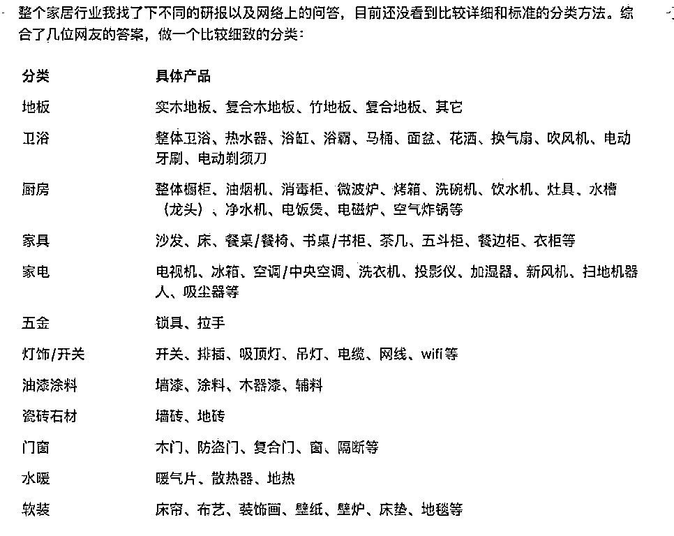
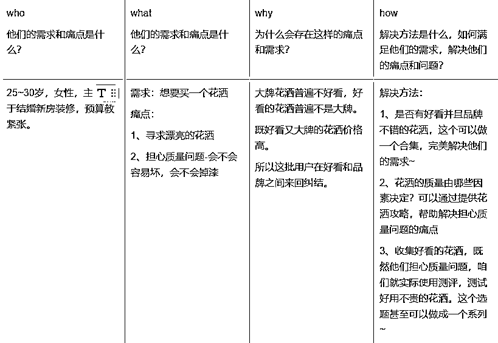

# (精华帖)(267 赞)我做小红书半年收入 20W+ 的秘诀：切入品牌视角做流量实现爆商单

作者：  七天假

日期：2023-02-27

相信不少圈友刚开始做小红书都是从借鉴和模仿开始的吧，但你会发现洗稿借鉴并不能在这个赛道长久立足

要想账号能够长远发展，首先是得让用户对你有清晰的认识，其实很多人都忘关注最基本的内容框架—— 3W1H

也就是从用户思维、数据分析等相关内容切实关注用户特点、用户需求以及痛点，思考如何解决用户的需求，让流量持续加速爆发

今天，我在这给大家讲讲我做小红书半年，粉丝增长 2W+收入 20W+的经验大致从快速起号、保持高爆文、变现方法和自身的经验和感悟这几个方面分享，希望对大家实战会有一些帮助。

一、自我介绍

 

 

大家好！我是七天假。主业是一名互联网 C 端产品经理，百万级流量产品负责人。

先预告一下，这篇内容超级硬核，恭喜你，点开了他~~相信他带给你的收获，会超乎你的想象。

正文开始：

因为是产品经理，我习惯用数据以及案例说话！

去年上半年入局小红书，半年时间小红书粉丝量 2W+ ，收获赞藏 30W+ ，变现超过  10W+ 。

总计发文 80 篇，千赞以上笔记 27 篇，千赞率为 33.7%，百赞以上笔记 75 篇（含千赞），百赞率 93.7%。

因为这个数据，引来了超过 100 个品牌的合作邀请。但是精力有限，拒绝了很多，后来只合作自己喜欢的品牌，会他们多次合作。有些品牌害怕我跟他们的竞品合作，还会签署全年的合作协议~~~

 

 

 

 

 

 

 

 

本次做纯博主接商单的方法以及经历分享。接下来的内容，我会从大致四个方面来为大家分享：

（1）开始与起号--分享我是如何快速起号，1 个月达到 1 万粉的

（2）3W1H 内容框架法介绍 -- 分享我的高爆文保持方法

（3）变现方法 -- 分享与品牌沟通的方法，实现品牌复购

 

 

（4）零星的经验和感悟分享

二、开始与起号

# （1）起号前，先从心理建设开始

你有没有想过，你可能没有你想的那么想赚钱。

做项目前，得先确定心态。坚定不移的想要赚钱的心态。很多人其实没有自己想的那么想赚钱！

之前陆陆续续做过一些项目，如知乎好物，抖音 IP 等，但是都失败了。

我总结了失败原因：赚钱的欲望不够强烈！

知乎好物当时已经月入 3k 了，但是没有做下去，因为觉得月入 3k 已经很好了，想扩大很累。

 

 

抖音更新了 30 多个短视频，没什么成绩，都是重复式的机械劳动，懒得去思考，去改变。

根本原因我也没有自己想的那么想赚钱！我有主业，并且主业收入还不错。

刚开始做项目是很想赚钱的，但是做着做着就疲了，懒了，怕了，害怕走出现有的舒适圈，害怕努力了没结果。然后做着做着就放弃了。

然后我做了一件事。我辞职了，辞掉了 996 年薪 40w+ 的工作。打算孤注一掷，逼自己一把，让自己没有退路，专心搞钱。

我的小红书，就是在提离职后的那一个月做起来的，事实证明，逼自己一把真的有用！！！

（不建议别人学我，我还是有工作的，只是换工作降薪了。当然现在降薪的部分，也已经从小红书赚回来了，哈哈哈～）

# （2）小红书起号 -- 认识推荐算法

主业曾经做过内容推荐的产品负责人，对推荐算法的运行机制有一定了解。想要获取高流量，得到推荐算法的青睐，一定要先了解推荐算法！

**① **从平台的视角看推荐算法

 

 

你猜，小红书推荐算法的产品经理，人家的 OKR 或者 KPI 是什么？

是首页点击率、首页内容互动率和首页停留时长。

对应的，如果我们的内容有吸引人点击的标题和封面，有吸引人互动（点赞、收藏、评论）的欲望，有能让人一直看下去的魅力。

那我们的内容，就会愈加受推荐算法欢迎，我们也就能获得更多的流量。如果创作这样的内容，后面会讲~

**② **推荐算法的两种推荐机制

推荐算法的本质，是基于千人千面的技术手段，把用户可能感兴趣的优质内容推荐给用户。

刚发布的时候，系统不知道你的内容是否优质，所以不会大范围推广，只会小范围的进行推荐。

# 1）根据内容进行推荐（专业术语叫分词算法）

这个是最好理解的，你的内容系统会自动给你打上标签，把他推荐给对这个标签感兴趣的人。

 

 

比如你写了窗帘的笔记，系统就会打上窗帘的标签，把他推荐给近期观看过窗帘的用户。

启发**&**需要注意的点：

1、尽可能在标题和内容，多提核心关键词，这样有助于内容的标签的生成。

**2**、不要打不相关的标签，这些标签会把你的内容推荐给不感兴趣的人，会降低推荐算法对你内容的评价。

# 2）根据人进行推荐

根据人进行推荐会比较复杂：

第一：根据关注的人进行推荐，发布的内容会优先推荐给关注过你的人，由他们对内容做成反应，系统会判断是否为优质内容

第二：系统会把内容推荐给其他点赞收藏过你内容的人。这个理解是，系统认为如果用户对你的一篇内容感兴趣，那也有可能会对你另一篇内容感兴趣。

第三：系统会把你的内容推荐给与你的内容互动过的相似的人。这个理解是，如果这个人对你的内容感兴趣，那与他兴趣差不多的用户，可能也会对你的内容感兴趣。

 

 

启发**&**需要注意的点：

**1**、不要买粉！尤其是不要买活粉！买来的活粉只会降低系统对你的内容评价，会降低你之后的内容流量。

**2**、不要刷赞！刷赞会让系统对你的内容进行误判，误会对内容感兴趣的用户属性。

**3**、你的爆款内容，会带火你的其他内容。认真的创作内容，确保每一篇都存在价值，这样一旦出现爆款，你的账号就会起飞！

# （3）小红书起号 -- 火过的内容一定还会再火

在我看来，这是一句至理名言。

刚刚起号，在你不了解平台推荐算法的偏好，不明白平台用户的喜好是，产生内容最好的做法是模仿！

火过的内容，一定符合刚才总结的推荐算法的三点：有吸引人点击的标题和封面；有吸引人互动的欲望；有让人一直看下去的魅力。

内容的背后，是推荐算法的逻辑和人性。

 

 

模仿会让我们快速把握平台的推荐算法和用户偏好，模仿的多了，慢慢平台网感也就有了，知道用户喜欢什么样的内容。（具体怎么找爆款内容，如何模仿，这里不赘述，其他小伙伴已经讲了很多了）

如果你正确的调整了心态，真正认识了推荐算法，并且懂得火过的内容一定会火这个道理，那你经过一段时间，一定会出现爆款内容。

但是，光这些还不够！

如果内容只会借鉴，是没办法形成自己的核心竞争力的，也没办法收到品牌方的青睐。

接下来我会分享一套我实际正在使用并且效果还不错的内容制作框架，帮助你产生高质量并且被品牌方（金主爸爸）喜欢的内容。

三、通过** 3W1H **内容框架法，加速流量爆发

光洗稿和借鉴无法形成自己的人设，也无法让用户对你有清晰的认知。这种时候，就需要通过一定的方法，产出原创让用户喜欢的内容。

接下来就会是 3W1H 内容框架法的详细讲解，里面会包含用户思维、数据分析等相关内容。

 

 

who：用户是谁？是哪些人群？他们的特点是什么？

what：他们的需求和痛点是什么？

why：为什么会存在这样的痛点和需求？

how：解决方法是什么，如何满足他们的需求，解决他们的痛点和问题？

# （1）who

用户是谁？他们的特点是什么？

我是做装修的，对于在小红书需要装修的用户，我会先简单的画出他们的用户画像：

① 25~30 岁，女性，主要用于结婚新房装修，会在意各种装修细节和装修中美的事物，大部分预算比较紧张，喜欢收集廉价好物或者平替好物。

② 30~40 岁，女性，宝妈，主要用于改善型住房装修，预算较为充裕，装修过程中更关注孩子的所在的环境因素，会有针对孩子的选购需求，比如有熊孩子应该怎么选沙发？

有熊孩子应该选那种颜色的乳胶漆不容易脏等。

 

 

当然，还有很多，我只是简单举几个例子。可以尽可能的细节描述，去代表一类人群。

我们想要产生优质的内容，一定要先清楚用户是谁，能为接下来产生用户感兴趣的内容打比较好的基础。

# （2） what

他们的需求和痛点是什么？

这个就很简单了，特别的固定。像装修，我会先用穷举法，把他们需要了解的东西或者需要购买的东西，全部列出来。

 

 

这个是啥？这个就是你的选题了，可以根据上面列的，各做一个内容系列~

OK，需求找到了，那如何找痛点？

我会从淘宝的提问、知乎相关专业贴的内容和评论，还有小红书相关爆款内容和底下的高赞评论去寻找。

比如说电视，我们来看看用户究竟在关心什么？

小红书直接搜电视，点开排名前 2 的电视相关笔记，查看下面的高赞评论，排除一些吐槽和询问内容，可以发现，用户在讨论关心电视的尺寸以及广告问题。

 

 

 

 

 

 

 

 

 

 

打开淘宝，搜电视，找销量和评价多的，在问大家页面，可以看到大家关心的东西，我这里看到的电视相关的，一个是质量，还有一个就是广告。

 

 

 

 

知乎也是类似的套路，找热门帖子，找高赞评论即可。这样你就能总结出用户在购买电视时，会遇到的问题：

① 应该买怎么样的电视

② 哪个电视质量好？质量好的电视有什么样的特质？

③ 电视广告多不多，哪个电视广告少，如何去除电视广告？

基于他们遇到的问题，我们其实就可以确认** N **个选题了，然后可以根据这** N **个选题，分别去制作内容。

年前就有根据这个方法，挑选了如何去除电视广告这个选题，并成功制作了一个爆款。

这个内容当天就爆了，但是视频里面因为有二维码什么的，导致被限流了...后面也懒的改他~~

 

 

 

 

# （3）why

为什么会存在这样的痛点和需求？

到 what 那一步，其实就已经明确选题了，why 和 who，其实是在了解内容结构，追根溯源，方便产出的内容能贴合用户心理。

对于为什么，记得多问自己几句为什么。还是拿上个例子举例：

用户为什么会嫌弃广告？因为用户不喜欢广告，对广告不感兴趣，他们只想快速看到自己想看的东西。既然用户不喜欢广告，电视厂家为什么一定要放广告？

① 为了盈利，但是这个理由不充分，他们完全可以把电视卖的更贵点但是通过无广告这个差异化来制造噱头，从而盈利。

② 因为电视本身没有视频资源，他需要依赖各大视频网站，而各大视频网站需要盈利，所以有广告。

 

 

这里好像遇到了死胡同，我们没有办法解决用户看电视没有广告的问题。因为这跟电视好像没有什么关系了。

这个时候就要另辟蹊径了，既然各大视频网站需要盈利所以有广告，那我们可不可以找一个不要广告的视频网站，来帮助用户解决看电视必须看广告的问题？

答案是可以的！市面上有很多类似的网站，但是很少有人知道。大家都只知道爱奇艺、腾讯视频等。

why 这一步，主要是多问自己为什么，从现象中，了解实物的本质，从而从根本上，解决问题。

# （4）how

解决方法是什么，如何满足他们的需求，解决他们的痛点和问题？

到了这里，其实是最简单的。只要你找对了痛点和问题，并且懂得搜索。其实很容易搜索到答案。

记住，搜索到的答案，不要复制黏贴，基于你的上面的分析，先做增删改查的操作，然后根据自己的风格，去定制内容。

这就是 3W1H 内容框架法的全貌了，但是听着简单，实操很难！主要就是难在寻找痛点和找出根源。

 

 

没有人引导的情况下，会判断失误或者看到比较浅层的问题。这个就需要真实环境去联系，练多了，能一眼看穿本质~

祝大家都能成为追根溯源的高手~

为了更方便大家的理解，我就多举一个例子：

通过这个方法，可以通过需求，找到至少 2~3 个选题，其实还能继续衍生，只要你会思考和寻找。

 

 

四、变现方法分享** -- **爆商单

# （1）商单基本情况介绍

小红书的商单其实很好获得，只要你流量好，就会有品牌方找上门。

品牌方找上门有会有两种方式。

一种是放根据你主页放的邮箱，小红书不是很限制邮箱的方式，基本不会违规，各位可以都去主页放一个邮箱，方便品牌方联系。

（图里的邮箱不是我哈，我随便找的！）

 

 

还有一种就是蒲公英，小红书官方的商单渠道，现在 1000 粉丝就能开通蒲公英。

这个咱就简单说一下，相信大家都知道~

# （2）获取更多商单的方法

相信大家都希望有很多商单上门，但是也会有同学疑问，明明我的内容流量很高，但是找我的品牌方这么少？

我来告诉你原因！

因为你的内容不符合品牌方预期，没有进入品牌方视线范围内。

首先我们切入到品牌方的视角：

品牌方寻找博主，也是通过小红书搜索、推荐或者用第三方数据分析进行寻找的。他们会基于他们需要推荐的品的关键词，来寻找博主。

比如“电视”的品牌方，他们要找博主推广，肯定会找那些发过电视（或者其他相关品）的笔记，并且流量还不错的博主。

这下你明白了不？

 

 

想要接到更多的商单，首先思考一下，在你的领域中，有哪些品，是利润比较高，品牌比较多的。然后基于这个品去写内容，只要有流量，就会有相关的品的品牌方找到你，来寻求推广！

一般我观察到的现象是，只要你写“电视”的笔记火了，会有 N 个电视的品牌方，会找上门，来找你合作。

# （3）如何让品牌方持续复购，带来持续的商单？

今年刚开始，我就签下了某个品牌方全年笔记的预定协议。还有品牌方听说我要合作竞品，追着我，跟我电话 1 小时，一定要和我合作的情况~~

 

 

 

 

我是如何做到的？

秘诀就是：对每一篇笔记认真负责，并努力打造爆款。

你是否用心，别人是感受的到的！都在你的作品和文字里。试问，如果你作为品牌方，你愿意与一个认真负责的人合作，还是愿意和抱着拿钱办事，结果无所谓心态的人合作？

因为我的认真负责，我的爆款数量变多了，也让我在后续的接单中更加顺利。形成了一个正向循环。

我认真到什么程度？

我有已经创作好了内容，品牌方觉得也还行，但是因为自己不满意，又重新推倒重来的。

当然哈，光认真负责，但是没技巧还是不行的。这里还存在另一个问题，如何保证广告笔记也能有较高的流量？

我分享一些我常用的方法和技巧：

**① **创造新奇的使用场景。

创作内容时，切记不要站在品牌方的视角去介绍功能特点，这种太像营销文了，一看就很广，没有人会爱看！

 

 

需要结合产品的使用情况，把自己当做一个用户，真正使用之后，去分享使用感受和使用效果。最好还是新奇的有别于大众的使用感受。放几个案例：

 

 

 

 

这是科沃斯的空气净化器的广，核心卖点就是智能移动，哪里有问题就净化哪里。

基于这台机子，作者实际使用后发现，放个屁他会跟着走。这个就是实际的比较新奇的使用场景了，后面很自然的引入使用感受+功能介绍，一篇超级种菜的广告文就诞生了~总结：新奇的使用场景**+**真实的使用感受**+**穿插的功能介绍

PS ：新奇的使用场景可以根据我提供的选题方法进行寻找，这个作者就是在淘宝提问入口找到的新奇选题~

**② **欲扬先抑。

因为现在小红书种草的内容和广告是在是太多了，用户已经审美疲劳。他们不想知道这个东西多好多好，他们就想知道，这个东西哪里不好！

先说缺点，再谈优点。这样既能吸引那边比如对空气净化器感兴趣的用户，又不会真正劝退那些想买空气净化器的人。

PS ：灵感来源于一个好友，人家告诉我，现在想买什么东西，先去小红书搜：XXX 避坑。

**③**合集推荐。

 

 

小红书的用户喜欢合集！这个结论是无数的前辈和我自己亲身实践都认证过的。所以接到商单，可以把你要推广的品放在合集里面，一起推荐。

可以把金主爸爸的品放前面并详细介绍。只要不是推荐竞品，金主爸爸一般是不会介意你推其他的品的~

再分享一些这么多商单接下来的感受和想法：

① 创作广告内容时，你可以不说缺点，但请不要夸大和欺骗，用户不是傻子。出来混，都是要还的，别赚昧良心的钱。

② 遇到产品不好的品牌，或者搞不拎清的品牌方，请学会 say no ！宁可不合作，也不要发自己不满意的内容。发了你还删不掉，会很糟心。

五、零星的经验和感悟分享

这里我就想到哪，写到哪。比较随意了，我随意写，你随意看，就当避坑。

（1）做内容的目标一定是制造爆款，爆款能助力涨粉和变现，还能助力历史内容的流量增长。

 

 

（2）跟随爆款，根据爆款去制造内容，这种内容往往会再次爆。不要浪费自己爆款的流量，出现了爆款，一定要抓紧时间继续创作内容。

（3）用焦虑流量问题，用心制作内容，时间会给你答案。（等爆款）

（4）认真负责是最好一件事的基础，没有什么事情能随随便便成功。

（5）看到了机会，一定要抓紧时间放大。我就已经错过了一波放大的机会（在流量最大的时候），最近有和小伙伴在规划放大的事情。

我是七天假，如果有什么不懂的，或者想一起交流小红书的，可以一起交流哦。

评论区：

嘻嘻｜溪溪 : 为你辞职的勇气，点个赞[微笑]

七天假 : 哈哈哈，谢谢[呲牙]

清欢 : 感谢分享，很有收获

七天假 : 相互交流～

厚德载物^O^洪永安 : 感谢分享

七天假 : [加油][加油]

麻雀 : 找了个 bug[呲牙]

七天假 : 哈哈哈😂，看的好仔细👍
