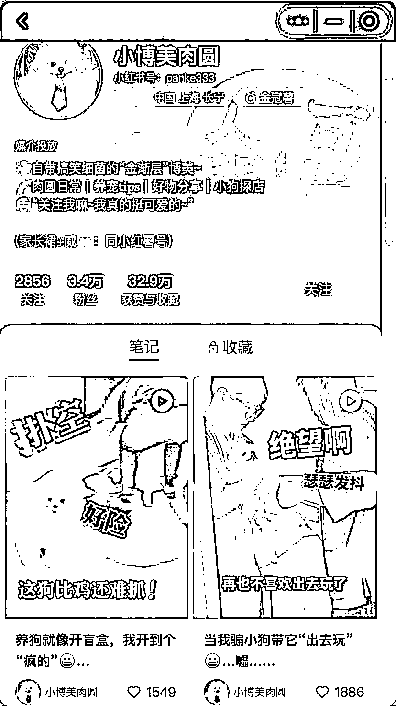
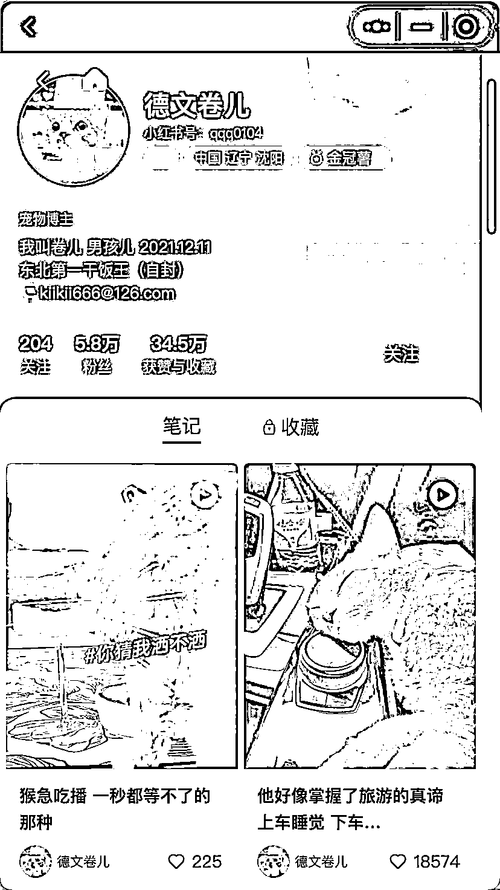
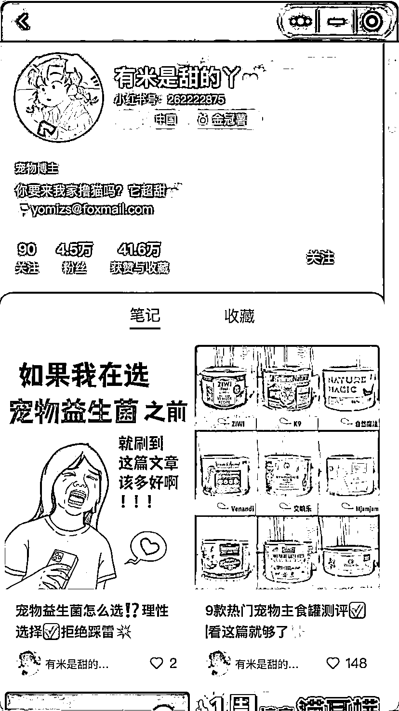
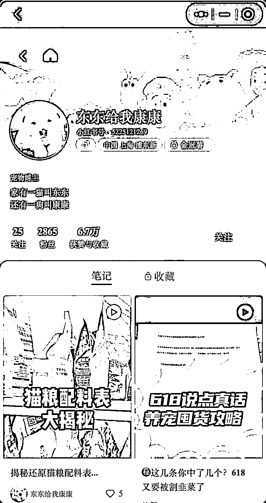
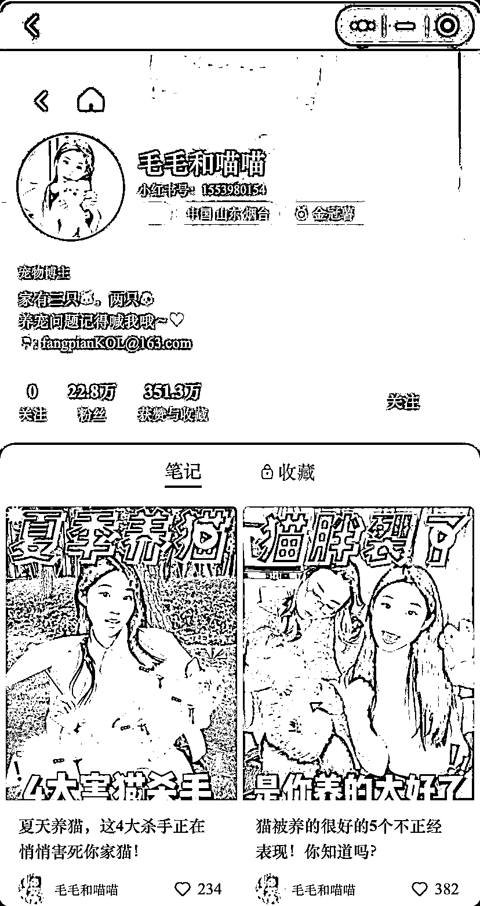
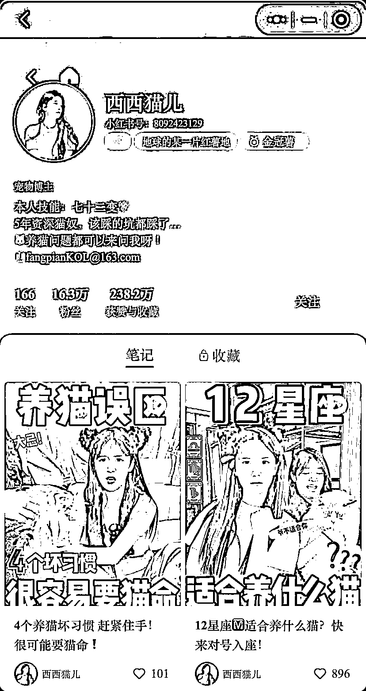
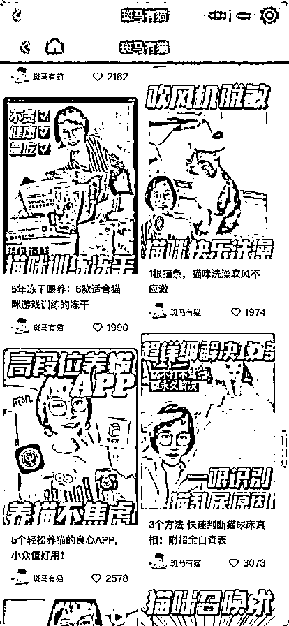
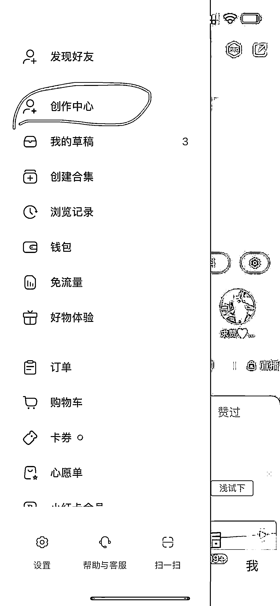
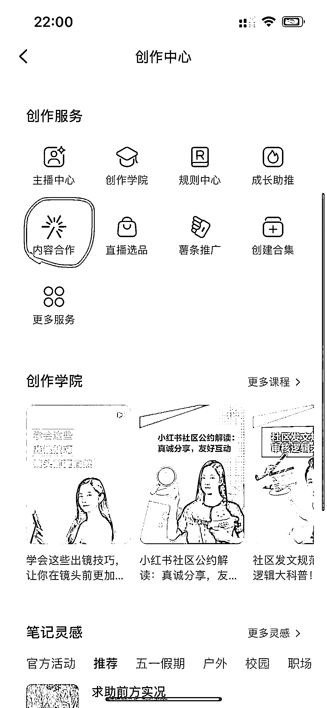

# (精华帖)(112 赞)职场小白裸辞做小红书宠物博主，一个月收入顶一年工资

作者：  虾饼

日期：2023-06-21

宠物赛道越来越卷了，那除了头部大 V 外，素人还能做起来吗？

 

 

不知道大家有没有发现，很多的红海赛道细分之后，就又是一个新的蓝海。我在小红书做宠物科普博主之前，就是一个毫无基础的新人，在小红书做宠物赛道也只是因为热爱分享。

所以在刚开始起号时，仅仅是利用闲暇时间去蹭爆款标题，发笔记试试水，没想到一个月就积累了近千粉。慢慢的我就开始专职做宠物科普博主，接广告推广变现了。现在，我单月的收入比我之前一年的收入还高，这也是我当时不敢想的。

而对于素人来说，宠物科普就是一个机会比较大的蓝海类目。相比萌宠、吃播赛道，宠物科普难度比较低，适合小白入局，而且起号成功之后不仅仅可以只做科普，也可以做同类型的矩阵号去引流卖货。

今天，和大家分享我做小红书宠物科普博主的一些经验和实操，希望对大家有帮助。

一、自我介绍

哈喽大家好，我是虾饼，3 年生财圈友，2 年谢无敌的红书宝宝友。我在 21 年底裸辞后开始做小红书，选择了宠物赛道里的细分赛道——宠物科普，单月收入最高抵我之前上班一年的收入。

小红书可以说是各个自媒体平台里对素人最容易上手、推荐机制最友好的，分分钟从苦逼打工人转型为全职博主！

 

 

宠物行业近年来发展趋势向好。比起生娃，现代年轻人更偏爱养育成本低而精神陪伴价值高的宠物，将它们看做是家庭成员的一部分，愿意为它们付出精力和金钱。

但实际上我选择这个赛道偶然性是比较多的，我没有像其他人一样用很科学的方式去调研去分析，仅仅是从我个人长处出发。我是一名铲屎官，特别特别爱我的毛孩子，有事没事就要逛论坛取经，学习科学养育的知识，淘车价好物，我还很热衷于把我所知道的安利给身边的朋友。

那么我的优势就是：有知识储备（量多量少不要紧）+热爱分享。所以我决定大类上选择宠物，细分赛道上选择做科普。

误打误撞，这个赛道恰恰是最适合新人入场的赛道之一。

先说一下我起号的情况：2021.10 开始利用通勤时间发简单科普笔记+萌宠日常，但发现科普笔记流量更好，通过蹭爆款标题一个月积累了近千粉丝。

零零碎碎地接广，一个品报价小几百。2022.2 用了一个爆款模板一周时间涨粉 3W，广告邀约不断，报价四位数。

 

 

二、宠物赛道情况

宠物赛道大致可以细分为：萌宠、吃播、科普。

（**1**）萌宠** **难度：**5 **星

**1. ** 必备条件：宠物有特色或号主有较强的包装能力

**2. ** 其他条件：会讲故事、会拍摄剪辑

**3. ** 优点：流量大，出大** V **概率高

**4. ** 缺点：泛粉多，用户画像不够精准，报价较低，无法批量复制

 

 

 

 

（**2**）吃播** **难度：**3 **星

**1. ** 必备条件：宠物干饭能干得很香或号主场景布置能力较高

**2. ** 其他条件：简单的拍摄剪辑

**3. ** 优点：流量中等，出片比萌宠难度低，可以复制

**4. ** 缺点：同萌宠

 

 

 

 

 

 

 

 

（**3**）科普** **难度：**2 **星

**1. ** 必备条件：宠物知识储备

**2. ** 其他条件：简单的拍摄剪辑或文案排版

**3. ** 优点：制作简单几乎无成本，用户画像精准，报价较高，可批量复制

**4. ** 缺点：流量较少，较难出大** V**

 

 

 

 

 

 

 

 

因为科普类可量产的特点，成为了许多机构和品牌做号的切入点。团队来做这类号的优势是人力充足，能量产，只要一批号里有那么几个做起来了，收益就很可观了。

**1**、品牌

**H5**

品牌起号只需要组建一个非常小的团队，成本远比每月找博主投放低。

例子：诚实一口

**H5**

品牌矩阵号&作用：

 

 

 

 

专业号大号 1 个

品牌宣传、活动发布用

 

 

 

 

专业号小号 1 个

品牌宣传、引流用

 

 

 

 

个人号猫号 N 个

给品牌打软广用

 

 

 

 

个人号狗号 N 个

给品牌打软广用

诚实一口的专业号小号做得很好，通过发布一系列有趣但没什么意义的内容，打造品牌有意思、亲近用户的形象，博得用户好感，打开品牌知名度。

该品牌前期的个人号也是图文类型，使用爆款模板大量起号，后来又做了视频类型的，成本高了一些，但传播度和影响力也更大。

视频内容的打造跟图文爆款也是一样的，猫号的某条内容火了，选题不变，台词稍微改一下，套到狗号上面，能再爆一次。

**2**、机构

**H5**

量产一批号，选题、封面设计、剪辑套路共用，只要做起来了，就可以找品牌合作推广。而且由于机构手上号多，什么量级的号都有，价位不同，给了品牌较大的选择空间。

 

 

例子：方片新媒体

**H5**

矩阵号：

 

 

 

 

 

 

 

 

 

 

 

 

他们做的号太多了，但是基本上只要看到就能认出来，因为风格差不多。毛毛和喵喵这个号还是换过演员的，谁都可以是猫猫，视频里露的脸长什么样，对他们来说并不重要。

当然批量批号对机构来说不过是常规操作，只是做宠物号的机构没有很多。我认为可能是能批量做的类型比较少，目前看来主要都是科普类，此外就是宠物品牌预算较低，远不如美妆类的利润高。

**3**、素人入场分析

**H5**

去年小红书对宠物赛道十分友好，经常给予流量扶持，还拉了作者群进行运营。

今年起来砍掉了宠物赛道大部分的流量扶持，活动减少，类目仅限于萌宠和异宠，大部分作者群也直接解散了。现在整体环境对新号比较友好，新号能获得较多自然流量，但老号基本只能靠推流。

此外品牌和机构入场会挤压到素人的生存空间，质量不够高，或自然流量不够好的素人接广概率相比之前有所降低。

 

 

但对素人来说宠物科普仍是一个机会比较大的蓝海类目。所以我会建议小白多考虑宠物科普赛道，先套爆款模板起号，再看是要做同类型矩阵号去引流卖货，还是要精耕内容转型更有深度的科普博主。

三、实操流程

（**1**）账号装修

**1. ** 账号定位：科普类使用真人的** IP **价值更高，用宠物做** IP **需要结合萌宠内容一起做效果才好

**2. ** 昵称：最好带上关键词方便被搜到，如：**XX **养猫、铲屎官** XX**、**XX **说宠物**3. ** 头像：用真人照更容易拉近和用户之间的距离，形象更丰满

（**2**）内容来源

**1. ** 豆瓣、贴吧、知乎：找选题相关资料用，这几个网站拥有较多高质量的经验贴**2.  PetMD**、**ASPCA**、**icatcare**：在谷歌里用英文搜关键词，能找到很多同类网站。

找选题相关资料用，需自行翻译，内容有专家把控，比中文论坛的素人发帖专

业严谨

**3. ** 谷歌学术：找文献用，宠物相关的研究国外更先进且资料更丰富

**4. ** 小红书：内容质量参差不齐，主要用来模仿内容的呈现方式，内容的呈现方式，如标题、封面、排版等

 

 

（**3**）创作流程

**1**、找选题

**H5**

**1. ** 不要局限于自己的类目，其他类目的爆款也是可以参考的，比如：

 

 

 

 

 

 

 

好会养猫一女的 200 元搞定日常消耗品

（同时参考了选题、标题、封面）

**1. ** 笔记要注意内容分配，一开始可以设定** 30%**引流内容（蹭热点、蹭爆款模板）**+70%**体现账号价值的内容。这个** 70%**里面留有产品植入位置，为后续接广打基础，同时也要注意账号调性，如果只发** PDD **平价养猫这种选题的笔记，接到高端产品的几率会较低。

**2**、定封面

**H5**

小红书瀑布流的推送形式让封面变得极为重要，用户第一眼看到的就是封面，想要笔记脱颖而出，封面就得足够吸睛。

但是不建议所有笔记封面都复刻爆款的，这样很累，而且没有明显的个人标识，还是得定下一个足够有个人特点的封面模板。

 

 

 

 

统一的花字，封面均为人像

 

 

 

 

统一花字、封面、视频特效，但这位博主也是经历了很长时间的蛰伏才找到自己的爆款方向

 

 

 

 

统一花字，封面均为多物品摆拍

**3**、定图片内容

**H5**

内容跟封面有共通之处，但是没有封面要求那么严格，只需琢磨出你自己一套模板即可，不用模仿爆款。

但也还是要注意可读性。

 

 

 

 

笔记科普部分

模板可拆解为：底图、标题、段落、配图，这些都是可以用固定的字体配色和排版的 

 

 

 

笔记推广部分（宠物与产品的合影）

拍摄模板可拆解为：宠物与产品的合影、产品细节图、宠物试吃图；

推广部分的文案模板：大标题、小标题、卖点详解等的字体配色和排版

 

 

 

 

笔记推广部分（产品细节图）

 

 

 

 

笔记推广部分（宠物试吃图）

**4**、定文案

**H5**

这部分其他朋友分享过，无非是分好段落，开头固定打招呼，中间抛问题埋关键词，结尾自我介绍和引导互动。此处不赘述。

四、变现方向

对于小白来说最简单方便的变现方法就是接推广

 

 

（**1**）如何提高接广率

**1. ** 前面强调的，笔记内留出产品植入空间，比如你在科普猫咪软便怎么办时，留一部分出来讲平时吃什么猫粮**/**保健品可以解决这个问题。

**1. ** 简介里留联系方式，方便** PR **联系你。不过现在不能留邮箱了，建议使用特殊字符，工具： https://exotictext.com/zh-cn/** ** 

 

**1. ** 到达千粉后马上去开通报备合作权限，你的账号可能被品牌在蒲公英平台上看到并选中：

 

 

 

 

小红书-我-左上角三条杠-创作中心

 

 

 

 

创作中心下滑-内容合作-进去后有开通指引

**1. ** 使用第三方通告平台（注意甄别），如螃蟹通告、布偶通告（均为小程序），这些平台里会有新媒体群入群引导，多加，也多跟其他人互换群资源，能接触

到很多通告信息

**1. ** 遇到心仪的品牌也可以去私信求合作

（**2**）推广合作流程

**① **合作形式

合作的形式分为报备笔记和非报备笔记。报备笔记就是前面提到过的官方认可的品牌合作，是要被收取“保护费”的；非报备就是咱们私底下合作，悄咪咪打暗广。

 

 

非报备又可以分为单品跟合集，单品就是一篇笔记里只能含这个品的广告；合集就是同时有好多个品给你广告费来出现在你这篇笔记中。

单品里面还有个概念叫做伪合集，就是一篇笔记里看似出现了很多个产品，但真正给广告费的只有一家，这种就是在最大程度上避免被判定为私自推广。

跟 PR 聊的时候还得聊清楚以下几个问题：

**1. ** 档期：就是你出初稿、终稿、以及最后发布的日期。

**1. ** 授权转发：能否授权给品牌方在电商**/**内容平台上发布，是否免费，授权周期多长。尾部博主一般是免费授权，周期一般在三个月到半年。

**1. ** 授权投流：能否授权给品牌方在小红书里投流，是否免费，授权周期多长。虽然投流能帮博主涨数据，但如果品牌爆出丑闻，还继续拿我们的笔记去投流，

对我们账号形象会有影响，所以最好定一个周期，比如一年内免费授权投流，

一年后看情况是否继续授权，是否加费用。

**1. ** 笔记发布后的保留周期：一般是一年或永久。

**1. ** 排竞：在你发布这篇笔记的前几天到后几天，不能再发布该品牌方的竞品的相关笔记。

**1. ** 活动出席：美妆和穿搭类的品牌可能会邀请达人出席他们的产品发布会之类的。

**② **如何报价

 

 

推广分为两大类，无费和有费。

无费推广就是置换，把东西送给你你帮忙出一篇笔记，跟小红书的好物体验是差不多的；

有费就是会给你一定数额的报酬，大原则上报价一般是按粉丝量的 10%～20%，具体可以看你账号的情况，如果这段时间流量很好，账号定位又跟品牌契合度很高，那就可以再往上报。

还有就是看你是否注重长期合作。一种情况是你笔记报价相对较高，但是出来的效果不好，人家可能就不会考虑二次合作了；

另一种情况是比如原价是 2000 一篇，按他们的预算可能一个月只够找你合作一次，如果能谈到 1500 一篇  ，或许他们一个月内就会找你合作两次。

再者你要看是跟品牌直接对接，还是跟机构对接。机构的话一般会找你要返点。返点就是你收了推广费之后返一部分给机构。

返点在 20% 左右比较合理，那种 35% 以上我觉得有点离谱。

图文报价一般会低一些，大概是视频报价的 60%～70%。但如果你本身就偏向于图文类的博主，那么你的图文报价是和可以视频报价相当的。

报备笔记报价，要高于非报备，因为你不仅要被品牌收取服务费，还要接受品牌更严格的审核，可能需要你更高度的配合，如果到手比非报备低的话就太亏了。

 

 

有一点很重要，一定要记得跟 PR 讲！就是你现在给的这个价格是几月份的价格，是不是一定要在当月发布稿子，如果延迟到下一个月份发布，你是不是要涨价。（保价的概念）

然后就是修改次数啦，特别是视频的，脚本接受几次修改，后期接受几次修改，大改的话是否要加钱。

有一些合作不是按固定价格来结算的，可能是按周期内的互动量阶梯式付费，比如 7 天内到达 100 赞就多少钱，到达 1000 赞就多少钱。

也有的是按带货佣金给的，给你的一个基础费用之后，你能帮忙带多少货就额外给你多少钱，或者没有基础费用，按纯佣计算。

在寄样品上面有两个概念需要了解：寄拍和送拍。寄拍主要用于单价较高的产品，你拍完照片后是要寄回去还给品牌的；送拍就是东西完全送给你了。

**③ **结款

最后就是结款了，要问清楚是否需要发票。跟机构对接他们会帮你开票，不用担心。

跟品牌对接可能要你提供替票或者是上诺诺网代开发票，替票就是你去外面消费，然后要求开发票，用的是合作公司的抬头，再把发票给他们拿去报销；

代开发票可以上某宝搜发票管家  里面有个代开的选项，是诺诺网提供的服务，选择一个税点低的城市，开票给品牌方。

 

 

还要问清楚的是结款周期，是发布后就打款，还是要等多久才能打款。

结款方式是直接打到你私人账户上，还是要注册类似人力家这种第三方平台，这种平台是会帮你交税和解决品牌的发票问题的，很省心。

现在也不止接推广的变现方式，发笔记带商品链接也是可以挣佣金的，类似抖音的小黄车，>1000 粉后可开通。

此外还可以开个小红书店铺，自己给自己带货，无粉丝要求，找得到货源即可。

评论区：

虾饼 : 加入生财的第三年啦！没想到居然会被生财约稿哈哈哈！感谢生财团队的认可和运营编辑小伙伴的工作支持🎉

周彦充 : 厉害，[强]，至今还没被谁约过稿[色]

虾饼 : [抱拳]仁兄过奖！还得感谢无敌老师给的曝光哈哈哈，让小白在圈子里也有露脸的机会

Sherry💎谢无敌 : 一直都是棒棒的虾饼[得意]

虾饼 : 呜呜感谢无敌姐团队的指导和支持

胖大魔 : 我最喜欢的宠物博主是抖音的二狗[呲牙]还有郑义的大黄[呲牙] 周周 Mia : 赶来给锤妈点赞[呲牙][呲牙]

虾饼 : [亲亲][亲亲]
