# (精华帖)(215 赞)普通女生 0 经验如何靠做课程赚到第一个 1000W

作者：  阿佳 bonnie

日期：2022-06-16

大家都有过知识付费的经历吧？以前通过收徒的形式来做，现在可以在网上做一门课程分发给全网的用户。

哈哈哈，看到这里大家会不会觉得这和我有什么关系呢？其实逻辑上来说，想把自己的内容做沉淀，给到其他有需要的人，都可以参照这个逻辑来做。

所以今天想和大家聊聊怎么做一门有吸引力的知识付费课程，其实一开始做知识付费的时候，我还是一个什么都不懂的小白，但在几个月以后我录了一门课程，销售

1000W+，在这个课程成功以后我又依法炮制了几门课，也都小爆了，营收在几十万到几百万。

 

 

 

目录

一、我做最小 MVP 测试产品的过程

二、如何打造爆款课程

三、总结

 

 

一、我做最小** MVP **测试产品的过程

在腾讯游戏内部，一个产品要正式上市之前，会经历立项、很多次的测试（内测、封测、公测），用户调研、数据分析、用户留存、付费率、不断调整，反复验证才可以正式公测。

那我们做知识付费也是产品，也一样需要做选方向（选题）、立项（定选题）、用户调研、市场分析、测试。

我在做知识付费课程之前是做营销策划的，营销策划的特点是喜欢做用户调研和数据分析，洞察用户的真实需求和分析市场需求。

我在做第一个正式的录制课程之前，其实我做了很多个测试型的知识付费产品。

**1. **免费公开课

最开始，我也不知道自己可以做什么产品，我看到别人做知识付费一个月十万，我垂涎欲滴，但是我作为一个「刚失业」的职场妈妈，没有粉丝没有流量，怎么办呢？

当时有唯库、职场充电宝等一些职场平台，最开始想到的是积累讲课案例，积累讲课经验。因为虽然我在腾讯负责过培训工作，但我实际上是没有讲课经验的，于是我就毛遂自荐当讲师，免费给别人讲课。

 

 

当时，我每个知识付费平台的公众号都会去留意看有没有申请讲师的，申请讲师需要写清楚你的工作经验、擅长的领域，讲课经验或者有没有现成的课程，大家要提前思考一下。

我申请了好几个平台，第一个联系我的是职场充电宝，我和他们的运营一起碰了一下分享方向和分享时间，我结合自己的工作经验想了一个选题叫做《如何策划一场刷爆朋友圈的营销活动》，当时有 1600 多人听。如果你拿捏不准，请你一定要认识几个知识付费平台的运营，多跟他们聊天，是问一下最近什么课卖的好，什么课有市场。

**2. **付费咨询（**699 **元** 1 **小时）

我申请了在行的行家，设置了 2 个话题：

如何转行互联网

如何线上线下营销

这两个话题都是几百块一个小时，两个对比下来，如何线上线下营销约我的人更多。

约我如何转行的大部分是传统行业想转行互联网的职场新鲜人，约我线上线下营销的要么是公司里的营销策划要么是创业者、老板。

我们通过单个的付费咨询，其实也可以洞察你的「产品」有没有人愿意付费，他们付费以后你可以通过问答聊天，了解到你客户都是什么样的人群、他们的真实痛点，以及你能不能很好地解决他们的问题。

通过付费咨询，我发现我不是很喜欢解决小白的转行问题，但是对于怎么做营销、怎么获客、怎么转化，我特别信手拈来，那说明这是一个好的方向。

 

 

**3. **付费授课（**1 **万** 1 **小时）

通过几次免费分享，有更多的平台看到了我，虎嗅和 91 运营联系到我，愿意付费 1 万  1 小时邀请我讲课，讲课的方向是运营，听课的人是多少我忘记了，最后是 2 个小时分了 2 万多给我，但是课程反馈不是特别好。

通过这个产品，我又发现了我的价值，很多人想学习运营知识，提升自己的职场技能。

但是这块我不是很擅长，我自己做起来有点吃力，也不是我很喜欢方向。

所以 pass 这个方向。

**4. 19.9 **元** 21 **天打卡付费社群

我看到有人做时间管理社群和时间管理打卡社群，我觉得很简单，这个时候，公众号和微信都积累了一些粉丝。我试了一下招募，居然有几十个人付费。但是运营下来其实我并不是很享受，所以这个产品，后来也被我 pass 了。

**5. 99 **元销量** 10W+ **营收** 1000W+**

如果我们没有做课经验，一上来就想做一个大而全，又贵又好的课程是不现实的。

第一你没有经验，第二你没有案例，第三客户需要漏斗，第四你需要验证你的策划和进行进一步的数据分析，所以我们最佳的选择是先做一个最小可行性（MVP）课程产品。

我们创业要去很远的地方，不是一上来就先造汽车，先做轮子再做车身。而是先做一个滑板车，先跑起来，再换单车、摩托车、汽车。

 

 

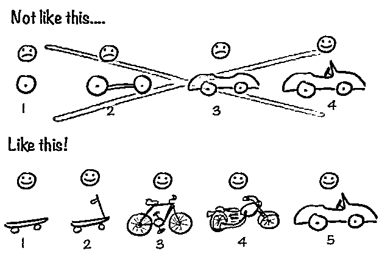

所有的产品都需要测试验证，最小的验证方法，就是通过引流课、公开课、付费咨询的方式，30 分钟到 1 小时。大家也可以参考我在做第一个录播课之前那 4 个 MVP 测试的经历，如果有粉丝积累也可以通过直播验证。

设计公开课/直播海报，通过朋友圈/社群宣传，看看有多少人对这个公开课/直播感兴趣，如果来的人很多，恭喜你，这个选题很好。如果来的人很少，最后还没什么人愿意为他付费，那么你就要调整，通过和粉丝、学员、用户聊天、访谈等方式挖掘他们最迫切需要的。

我最早验证朋友圈课程可行，是综合了几个数据：

我做了一场** 1600 **人的** 45 **分钟公开课，说明需求是存在的；

偶然发现有一个人单节** 45 **分钟的朋友圈课程卖了** 1000 **多份，验证大家愿意付费；

 

 

发现一个线下的企业内训老师，他一年** 260 **天都在上课，**90% **都是微信营销，企业花几万一天请他讲课；

当当京东上微信营销的书卖的很好，还有人出了系列书。而知识付费平台上目

前并没有成体系的课程，微商自己做的课程则都是内训，并且授课质量很低，

都是文字语音**+**图片，没有很好的理论体系知识体系；

在荔枝微课测试了** banner **和大纲，连课都没有，转化率在** 30% **以上，数据奇好，于是才开始做课件。

所以，你也可以先做一个海报，咨询、直播都可以，看看朋友圈有没有愿意咨询、付费。有人愿意付费了，再考虑下一步。不要一上来就开发一个课，花了几个月开发了几十节课录好了发现没人买，这就太尴尬了。

二、如何打造爆款课程

如何打造爆款课程，我总结起来有以下六个步骤。

第一：选题定位——选题 90% 决定了你的课程能不能卖得好。

第二：数据分析——市场分析、用户调研都做好了你才能找到一个能爆的选题。

第三：用户调研——如何让你的课程更符合学员预期，如何拥有高满意度。

第四：内容填充——体系的知识理论模型、契合的案例、PPT、实操练习。

第五：MVP 测试——转化率怎么样？市场反馈怎么样？有人愿意买吗？

第六：营销推广——如何让你的课程卖得更好更多。

 

 

**1. **如何进行选题定位

前 4 个测试产品测试下来，我发现，我最擅长、最多人买单、我最喜欢的，就是营销。

但是营销这个领域这么大，我肯定干不过已经有名气的呀，于是，我就正式分析营销有哪些细分领域，我有哪些领域是可以进入的，我自己分析一圈下来就是微信营销。

那么作为小白，你也是一样，要先分析自己的优势：

你毕业于哪个名校？不是名校有没有在哪个名企工作过？没有在名企工作过有没有为名企服务过，有没有名企客户？都没有的话，你有没有在哪个领域做出过什么成绩？有没有经常被人夸的地方？参加过什么培训，拿过什么证书，哪个领域有多年的经验？会买房？会理财？懂财务？英语特别好？特别会聊天？求职能拿很多 offer，面试特别厉害等等。

每个你觉得没什么了不起的地方，其实都是有需求的。你觉得很简单的事，可能别人觉得特别难，觉得你特别厉害，所以你的优势是需要梳理的。

 

 

当然，也不是所有的优势出一门课程都能卖得好，这是一个事实。因为有的知识特别小众，受众面不广，但是作为想做课程的人，他往往当局者迷，因为掌握的数据不够多，导致可能做了几个课程发现都不火。

一个课程能不能卖得好，跟它的受众、市场需求、热点有关。比如瑜伽课和杠铃课，副业课和 Java 课，受众和需求就有很明显的差别。

如果你想做一个爆款课，首先，你选的方向受众就不能过窄，最好能是大众，绝大部分人都有需求的。比如变美：减肥、瑜伽；技能：PPT、Excel、销售、文案；赚钱：副业、理财。

但是这些我列举的关键词不一定是适合你的，你能做的。所以，还需要结合你的自身或者你的讲师，挖掘讲师身上可以讲的又需求大受众广的方向，刚好还切合当下的趋势和热点那就更再好不过了。

我们如何去挖掘这些关键词呢？你可以根据下面这张图写下属于你的关键词。

可以从学习经历、工作经验、业绩荣誉、兴趣爱好、特长、成功经历这 6 个方向入手，写下 6-10 个你擅长能输出的关键词。挖掘自身的优势、经验、经历，看看爆款选题中是否有跟自己的经历经验背书背景相匹配的的。

 

 

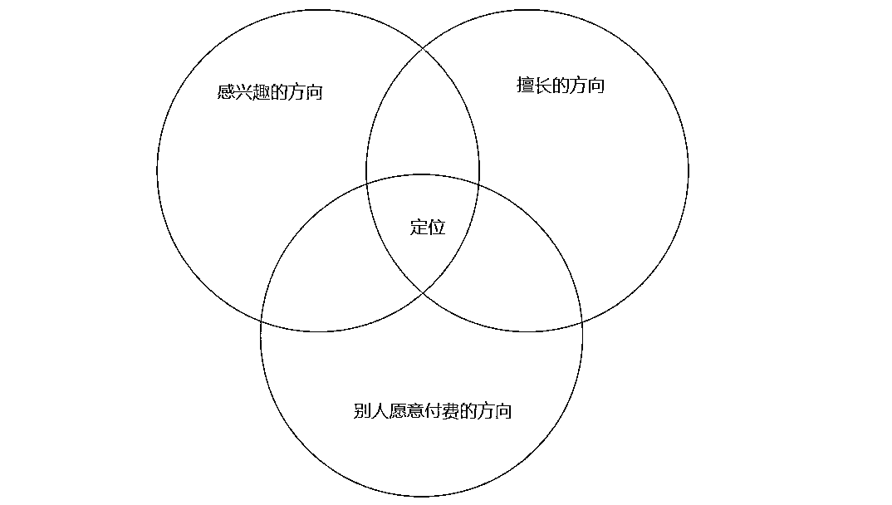

因为我在腾讯工作过，做过几次副业、卖羽绒服 8 天赚 5 万、24 岁通过信用卡买了 2 套房，我曾经做过地产置业顾问销售出身，在腾讯做的是 BD 经理，品牌营销传播等工作。

我梳理的的关键词是：副业、时间管理、营销、销售、商业模式、信用卡、房产、社交、人脉、升职加薪、创业、新媒体、短视频、直播等等。

注意：非常重点，梳理你过去的成绩、成果、经验，请数据化表达。

几岁（多长时间）做了什么事得到了什么样的成绩

你帮助过多少人做了什么事

你过去服务过有多少客户

过去在公司做出了多少业绩

过去你在学习中多短时间做出了多厉害的结果

你有多少年的** XX **的从业经验，拿到过什么样的证书（奖状）

 

 

小结：课程无论是线上课，训练营还是线下课，选题定位是核心中的核心，第一步中的第一步。短视频也是一样，选题 90% 决定了这个视频会不会火。卖货也是一样，选品决定了能不能爆。

**2. **验证关键词，全网挖掘关键词并进行数据分析

我在确定选题「微信营销」时，我同样还做了很多的数据分析、市场需求分析和用户分析，证明这个是市场上非常热的需求和非常痛的痛点，并且清楚知道这个课程的受众人群是谁。

我们有了关键词，但是你并不知道他们的需求到底是哪个大哪个小，这个时候我们需要一些辅助的工具，帮助我们验证这些关键词的数据情况。

大家可以列出自己的行业关键词，通过京东、当当、淘宝、微信指数、百度指数、阿里指数、线下企业内训等等找到属于你的行业的搜索爆款、销量爆款、需求爆款。

如果一个选题只在一个地方火  不一定大火  但是大家都在用、都在搜、都在买、都有需求，那么他肯定会爆。人群、关键词也会反复验证，看看哪个关键词更好，类似百度指数。

 

 

比如我在做微信营销这个选题时，我通过微信指数搜索「微信」「朋友圈」「社交」「人脉」哪个的关键词更热。我通过搜索当当、京东、淘宝发现微信营销的书销量特别高，通过讲师网发现「微信营销」的内训课需求量特别大。

我知道的一位讲师，一年讲 260 多天课，就是讲微信营销，一年课酬几百万。但是通过用户调研发现用户认为「朋友圈」跟自己更有关系一些。所以正式的录播课程的选题定的是「你的朋友圈价值百万」「朋友圈营销」也是这个课最后卖了十几万份，销售额超过了 1000W。

在建立我的直播间的时候，搜索了副业、业余、兼职这几个关键词，哪个词更热。我发现副业更热，于是直播间的名字起的是「副业赚钱商学院」，这个直播间也成为所在知识付费平台比较爆款的直播间。

当然，我认为这种成功是不可以复制的，但是经验是可以迁移的。我认为可以迁移的能力是：数据分析能力、搜索能力、成功案例的拆解能力、分析爆款共性的能力，最重要的是行动力，去测试最小** MVP**，不要怕试错。

 

 

 

确定了微信营销这个选题以后，我把当当、京东、淘宝上卖的好的排名靠前的微信营销的书籍全部下单买回来研究，研究什么呢？书籍的标题、副标题、目录都是精心打磨过的，再看书里面的内容也是成体系的，你可以查漏补缺知己知彼。分析卖得最好得书和卖的一般的书内容差在哪里？再同时通过百度指数分析他们的核心需求点是什么，为什么企业和业务销售需要这个课？在其他平台上是否有这个选题的课程？

 

 

如何你想知道有哪些类目卖得好，有市场需求，还可以多看看知识付费平台，讲师网平台的类目是怎么分的，通常排在前面的就代表需求更大。

课程平台我们可以选择荔枝微课、千聊、小鹅通、有赞、学浪、小红书或者你的行业内比较知名的课程网站，讲师网，比如中国讲师网等等他们都有检索栏，类目栏、排行榜。

举个例子：

这是某知识付费平台和讲师网平台的导航。从导航中，你就可以看到哪些课程是需求更大的，一般需求更大的排在最前面。

在个人学习中，我要变美，个人成长，赚钱，理财，婚姻情感是需求最大的。

在企业内训中，企业管理，销售服务，职场提升，财务管理，人力资源是需求最大的。

从这里我们也可以看出，个人端和对企业端大家的需求会有很大的区别。

在抖音中，我们也可以看到在个人成长、赚钱、理财、情感的需求是最大的，而对公司或者是企业管理端，企业管理的课程、商业模式、销售服务、职场技能、财务人力管理的课程的需求是比较大的。

 

 

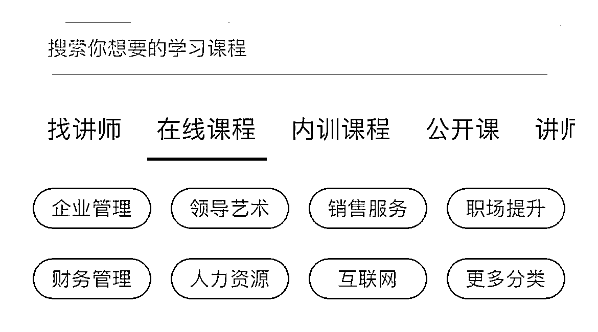 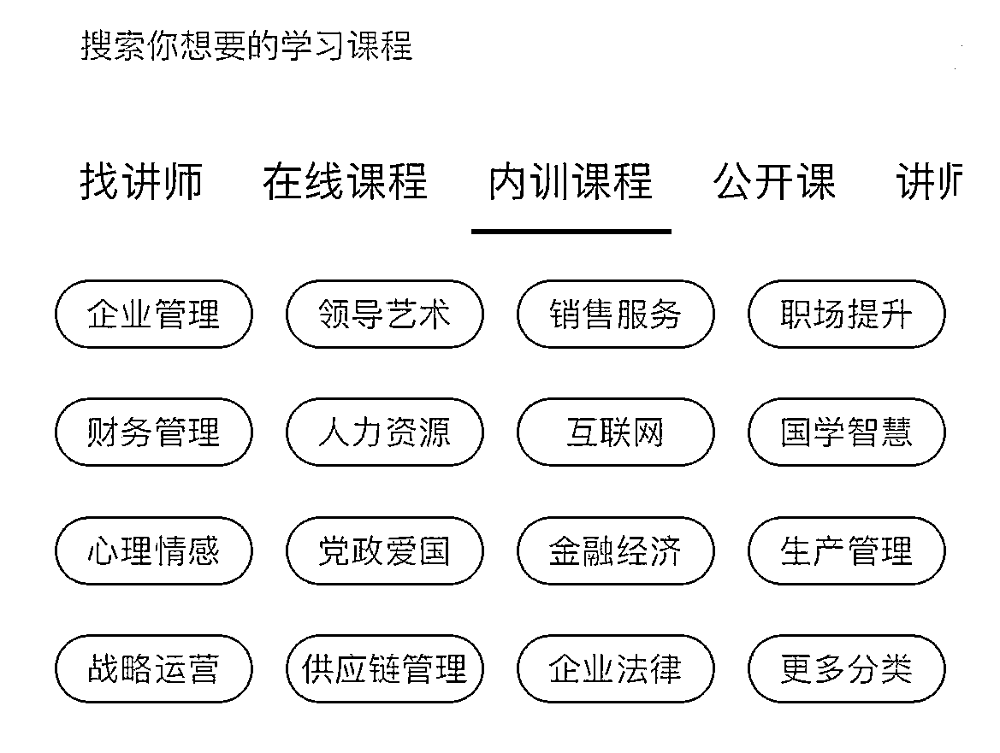

 

 

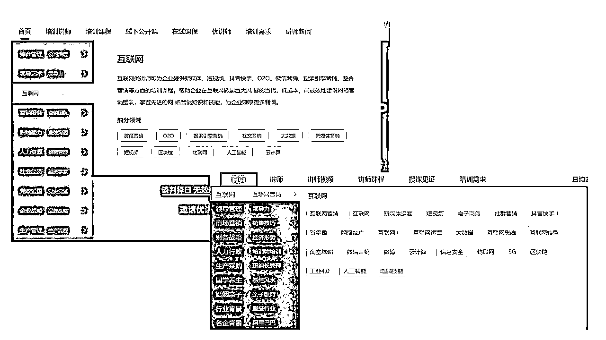

通过数据分析，你会发现以下几个方向大概率会卖的比较好，通识类、热点类、变美类、技能类、财富类、亲子类。还有要注意的是 to C （个人）和 to B （公司）的课程需求也是不一样的。

 

 

不同平台属性，他们的用户群体不一样，课程需求也会有差别。我们在策划课程的时候需要把这些因素考虑进去。同时如果你能有平台内部消息知道哪个类目正在被扶持而你又恰好有这方面的资源那就更好了。

 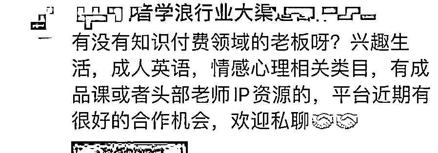 

这是抖音学浪最近官方在寻找和扶持的方向

小结：一定要做数据分析，重视数据分析。没有数据支撑的商业行动，一般都是失败告终。因为没有数据支撑，那就是瞎搞，靠蒙。蒙对的几率有多大？

 

 

**3. **竞品分析

Swot 分析（优势劣势机会挑战）

比如我分析自己优势：在大公司做了 10 年市场，懂营销懂品牌，自己有做副业的经验和成功案例，接触过微商知道微商的痛点。

劣势：入场在线教育比较晚，没有很多授课经验，品牌和营销比我名企大的大有人在，如何选择细分市场切入？

市场细分

营销：文案，公众号营销，微信营销，小红书营销，社群营销，营销策划

品牌：产品品牌，个人品牌，品牌策划，品牌传播

市场分析：机会

现在有很多新起的知识付费品牌和自媒体，那里还没有头部，是否可以借助新的知识付费平台和自媒体找到机会？

威胁：是不是有人做的比我更好？如何迅速找到细分领域定位、快速提升自身的授课能力、积累学员案例、口碑。

 

 

确定自己的选题方向，我们需要做竞品分析，简而言之就是要分析你的对手、同行，分析他们的优劣势，哪里做得好你可以学习，哪里做得不好你可以优化补充，你可以做哪些定位和内容上的差异化。

分析他们的课程标题、讲师包装、课程大纲、课程文案、课程销售渠道、引流转化方式、增值服务、社群运营等等。

举个例子：我当时的课就没有人在做，于是我只能通过书，线下企业内训，微商培训等方向去分析差异化。通过跨界的课程研究分析好的课程标题、大纲、详情页、文案都是怎么做的。

这里需要用到拆解的能力，360 度无死角拆解分析。

**4. **用户分析

 

 

用户分析主要用于分析你的用户需求，让你的课程内容可以更好的匹配你用户的需求，一般我会做用户调研。用户调研分为定量、定性、访谈。

最简单的方法我们可以收集用户的问题找出共性，帮助你优化大纲和课程内容。

举个例子：

我在做朋友圈课程的时候，我先把买了课程的人引流到微信群，通过群接龙问题收集的方法，挖掘他们共性的问题、底层痛点、根本性需求。所以再最后通过这群人收集上来的问题针对性开发课程，最后呈现出来的课程口碑和反馈非常好，好评率 97%。

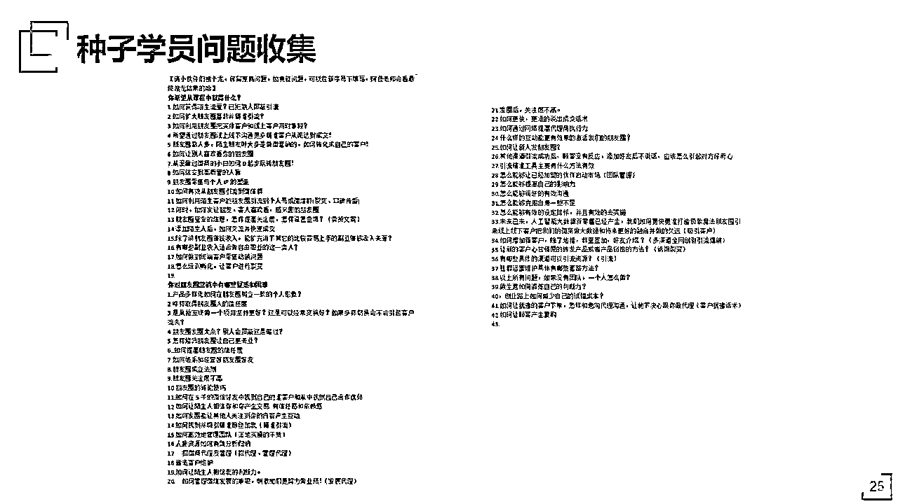

如何洞察用户的需求大家通过痛点问题收集、收集马斯洛需求层次理论，Kano 模型，多维度尺度方法，用户画像，客群定位，用户标签，角色细分等等方法。

 

 

小结：一定要了解市场，了解自己。不了解市场叫做不敬畏市场，不了解用户，叫做不敬畏用户，那一定会吃苦的。

**5. **内容策划填充

这是我策划第一个课程时列的大纲，10 节课。

大纲我的方法是结合同选题的畅销书，课程（线上课或者线下课都可以），去分析他们的大纲设计的逻辑、顺序、版块，再结合自己的经验，你觉得她们哪里好哪里不好，哪里可以更好，你有什么不同的见解、案例，梳理自己的版本。

通过 excel 或者思维导图梳理大纲会更清晰有逻辑。先写一个初版大纲，再精雕细琢润色，一般没到最后上架，大纲都有可能会修改，不需要追求一次到位把大纲策划好。

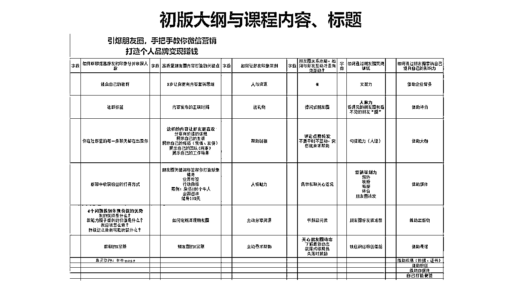

 

 

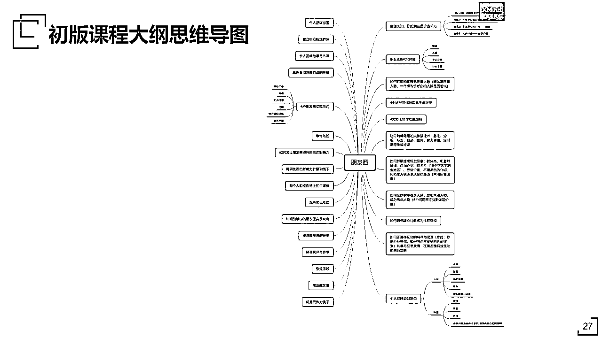 

知己知彼百战不殆，内容填充你可以通过大量同主题的系列书籍找灵感，如果有可以大量对标的课程更好，细心耐心地看一遍大纲、内容，听一遍别人的课程，看看别人有没有好的可以借鉴，再根据自身的经验用思维导图梳理出自己的知识框架、理论体系和案例集。

 

 

PPT 如果你不会做的话，可以在淘宝上去做 PPT 模板，然后再把我们的知识填充到合适的 PPT 页里面即可。如果有需要 PPT 模版的话也可以留言。

逐字稿不是必须的，但是一般优质的录播课程都会提前准备好文稿。这样讲师在录课讲课的过程中才会通顺有逻辑不卡壳。

以下是我在录制课程之前先准备好的文字稿，通过 word 或者有道云笔记写好保存。

 

 

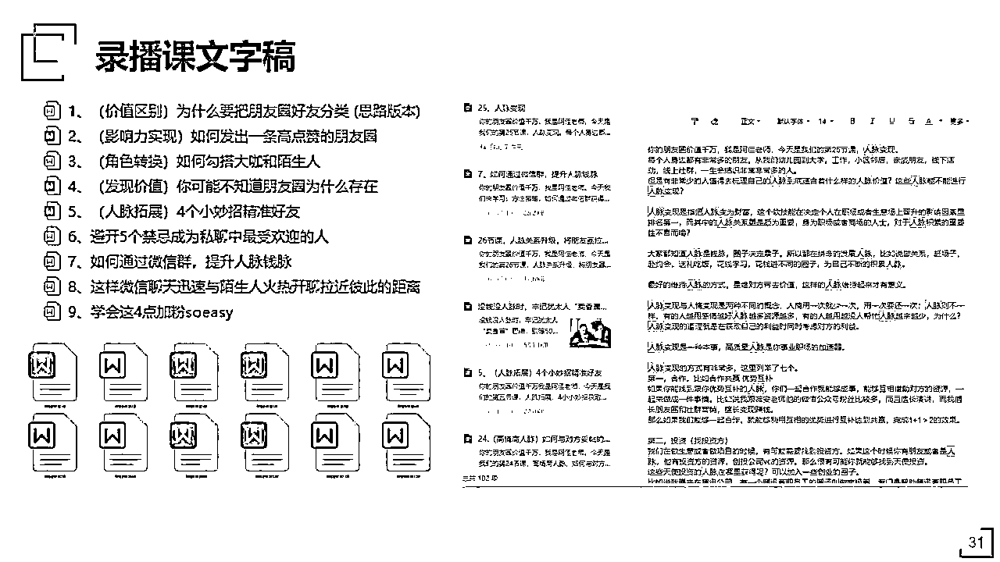

小结：

如何做出一个还不错的有逻辑不会被骂不容易过时的课程内容？

把同选题相关的好书好课都研究一遍，这样你的课才不会片面，缺乏体系和逻

辑，还可以知己知彼查漏补缺。

用思维导图或** excel **把大纲逻辑梳理出来，串一下，看逻辑是不是顺的，框架是否完整。

**PPT **可以用** PPT **模版，美观也方便你讲课得时候写文字稿的时候有画面有逻辑，还可以方便你写文字稿的时候做案例延伸。

文字稿注意不要说年月日，这样课程容易过时。比如现在是** 2020 **年做的课，你提了** 2020 **年。今年我们听的时候就明显知道这个课是** 2 **年前的，不利于持续销售。

如何又快又好写好文字稿？

先写大纲

写** PPT**，把我想到的都往里面填，包括理论，案例

**PPT **自己讲一遍，可以用** EV **录屏

 

 

通过语音转文字，可以用讯飞语音，网易见外工作台，转文字后再把文字复制

到** word **、有道云笔记、印象笔记、飞书这样的笔记工具上修改一遍。

**6. **正式发布

营销包含：课程包装、讲师包装、首发、渠道分发、营销活动、公开课、推文、试听等等。

正式发布上线，你需要梳理出你的课程产品卖点、营销方式、通过公开课和测试用户收集口碑。先通过朋友圈、社群，做冷启动和借势、造势、预热。新课程需要做一些口碑和数据才能卖得更好。

 

 

 

由于课程仓促上线，直播课程的效果其实是不够好的，如果一个课程希望可以长期卖，还需要注意课程录制时不要提时间点。

在课程卖了 3 万份后，我收集学员反馈，好评，学员案例等等重新修改课程的 banner、详情页、文案，根据直播转文案，把多余的口水话、提到时间的话等去掉重新录制了一版，这个时候这个课程可以长期卖且可以多个平台卖了。

如果你不知道如何做一个详情页如何包装你的课程，这里就要用到成功案例/竞品拆解的能力。

细到毛孔级别，拆解对标的包装策略、标题、副标题、banner 、广告语、详情页、讲师包装、选题包装、增值服务、卖点等等。

这里就不贴案例了，大家自己去搜，锻炼你的搜索能力。

 

 

**7. **如何持续提升销量

上架其他平台，需要针对不同的平台进行修改包装，比如大纲修改、讲师形象照、课程标题、软文文案等。

以下是针对某个平台做的大纲标题修改图，和详情页修改图，以及课程分发不同的平台的表格。

现在也有很多 MCN 机构会联系有成品课程的老师进行包装分发，他们负责包装分发，最后跟你来进行分成。像这样的机构有很多，比如博闻、简知、个人发展学会、荔枝微课现在也有部门专门做这个。

现在单个平台销量几万已经不容易出现，都是通过多个平台来销售达到销量过万到几万。

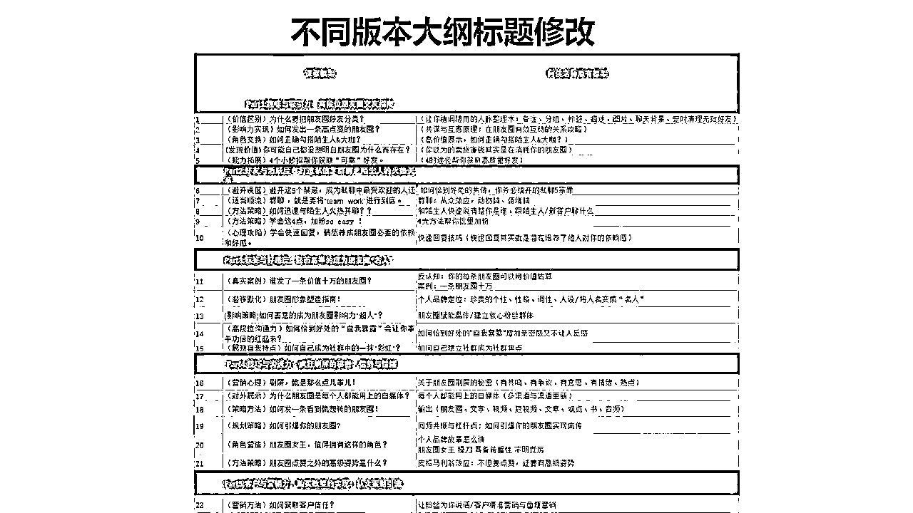

 

 

小结：没有流量怎么办？不会包装怎么办？不认识平台运营怎么办？刚开始做课程课程没数据怎么办？

没有流量我们就要去创造流量，一定要主动出击。你没有流量谁有呢？平台有，有那么我们想办法找到运营，问一下他们的合作标准，再努力去达到。看看公众号有没有商务联系方式，招募讲师，合作联系方式等等。

不会包装，第一先研究同行怎么包装，不会设计有很多免费设计网站：创客贴，图怪兽，模版很多修改文字和图片就可以。

如果你对课程非常自信，有一些数据，可以找 MCN 机构。如果你有细心留意，就会发现很多课程会上架很多平台，直播间还不一样，这就是 MCN，他们会把成品课程拿过来重新包装上架。可以找公众号，留言，买课程加课程里联系方式，加群里的运营，方法太多了。

 

 

课程没数据怎么办？让你的朋友圈好友帮忙转发，免费送出去，裂变出去，如果这个都做不到好好想想是你脸皮太薄还是平时人品关系没处好，发个红包别人不会拒绝。

这个时代是对普通人最好的时代，你可以在各个平台打造个人品牌获得流量，个人品牌是一件长期复利的事，低成本获得流量和曝光，多香呀。

三、总结

**1. **先有产品还是先有流量

做副业变现，做课程变现也好，最常见的误区就是先去做流量。

很多人做了很久都没流量，有的人做了几年十万百万粉丝了还不知道怎么变现，少数能变现的也不是很稳定，太长时间粉丝也失去了粘性。所以不要迷信什么我要多少粉丝了才能变现才开始变现，先保证自己不要饿死。

**2. **想清楚你用什么变现

副业的本质是，先有产品再搞流量或者边搞产品边搞流量。

副业、变现、赚钱、商业本质其实就是「生意」，就是商品交换、价值交换。你只有粉丝没有产品，别人想给你钱都不知道怎么给。所以你如果有实物产品很好，你的定位很清晰。如果你是虚拟产品，比如社群、服务、课程，那么你需要先设计好想好你的产品是什么。

 

 

**3. **用最小** MVP **验证这个产品是否有市场需求，是否可行

最小 MVP 可以是免费产品，也可以是超低价产品。如果免费的都没人要，那么这个产品说明没有市场，如果低价很多人要，那么你可以设计一套系统化的阶梯式的产品。（前提是你的粉丝是你的目标用户，是精准的）

**4. **知识付费小白到大神你会经历四个阶段

**1**）小白不知道怎么定位，做什么课程、什么服务。

梳理你的学习经历、工作经历、兴趣爱好、特长，把关键词写下来，把不擅长不喜欢的删除，再从中挑选市场上你觉得最有市场最有需求的，留下 1-2 个即可，这个就是你可以定位的方向。

如果不知道哪个市场有需求，微信指数、百度指数、淘宝拼多多京东当当搜一搜关键词，数据低销量低的代表需求量少，相反就是需求量大。

**2**）新手阶段，确定好你的定位，开始设计打磨你的最初级的产品雏形，这个过程都需要测试

比如时间管理的课程和服务都分为很多种：打卡群、每日早起、早起陪伴、早起攻读、时间管理课程、时间管理训练营，高效能、时间管理工具等等，人群：职场人、宝妈、学生党、高管。不同的人群你做的产品也不一样。

**3**）打造属于你的「里程碑」「冠军」「第一」「首个」事件

 

 

比如短视频播放量累计 100 万，XX 万粉丝、XX 平台签约博主、获得 XX 奖、分销第一名、畅销书第一名、XX 平台最 XX 的博主等等。这个时候你赚钱靠你的 IP 影响力。

**4**）打造系统

课程系统：免费引流、低价成交、会员产品、高价产品、超高价(合伙人/代理人）产品。这个阶段你赚钱靠团队、靠系统。

举个例子：免费送 28 个时间管理工具表、9.9 元 7 天时间管理课、999 元 XX 金币会员、3999 元 XXX 年社群、9999 元私董/合伙人/轻创客，这个时候你不仅需要有团队，还需要有好的服务和交付能力，带团队的能力。

评论区：

岁寒 : [捂脸]你是吃到了 16 年那波知识付费的红利吧，现在知识付费平台都活不下去了  赖欢 : 天花板太高了，没法实操，跳着看完的。

阿佳 bonnie : 感谢生财团队和我一起打磨的分享，现在在抖音小红书依然可以做知识付费，而且还很香，各个平台依然可以做，目前做低转高价课市场也很大。

阿佳 bonnie : 也不是的，你看到的只是表面，转型低转高了

阿佳 bonnie : 还有很多你想不到的领域

亦小亮 : 都是口播的课程吧，纯图文的很难了

阿佳 bonnie : 口播

岁寒 : 加油，建议分享点小红书的一线实操经验吧，唯库、荔枝、喜马拉雅真的是风口造就的，没啥说服力。
