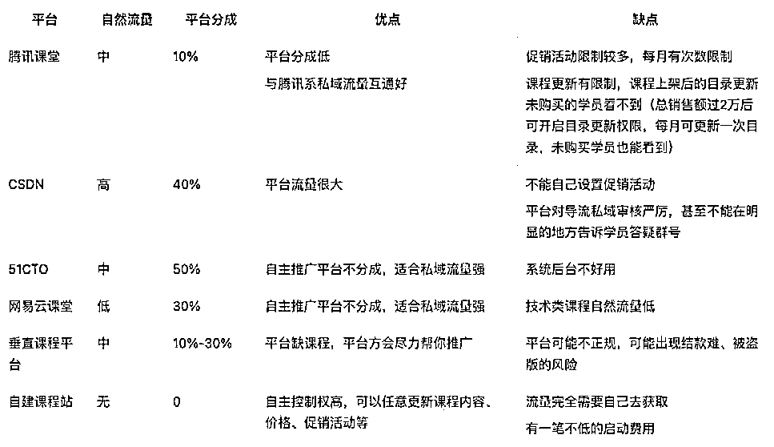

# (精华帖)(221 赞)细分定位 IT 录播课，实现每月被动收入 5W+

作者：  鱼丸|亦仁助理

日期：2022-03-16

 

 

大家都知道，我们本期抖音商业 IP 大航海 2.0 已正式开船，但我们也发现有不少圈友因为时间的问题，没办法跟着我们一起学习。没关系，我们这期「生财合伙人」专栏，请来了 @突围一只鹰  老师，来为我们分享另外一个切入知识付费赛道的方式：录播课。

在同样时长下，直播课需要协调学员的时间，但录播课却可以把时间售卖多次，大大提高了用户覆盖数。虽然大部分垂类录播课的收入天花板不高（百万级），但对个人来说仍是个不错的选择。

他将会在本篇「生财合伙人」专栏中，以他细分定位 IT 录播课为例，为我们详细分享一门爆款录播课从制作到售卖，再到交付的全过程。

虽然文中涉及的领域比较小众，但是课程的制作、售卖、售后服务都是相通的。如果你在找一个时间效率相对较高的副业方向，文中会给出你想要的答案。

目录

一、录播课是个好的副业吗？

二、如何制作一门录播课？

三、如何卖出第一份录播课？

四、如何扩大录播课的收入？

五、如何做好录播课的服务？

 

 

你好，我是突围一只鹰，程序员出身，从 2014 年开始创业，做过 App、软件外包，目前专注于自媒体。

我做 IT 录播课已经有 4 年多了，出过爆品课程，也有 0 销量课程，目前能做到每月  5W+ 收入，高峰时期月收入超 20W。同时我也在帮助一些朋友通过技术类录播课变现，最高的已经做到年销售额大几十万。

本文约一万字，整篇分享围绕以下话题展开：

**—Part 1—**

录播课是个好的副业吗？

 

 

好的副业应该满足以下 3 个条件：

收入有潜力，长期来看有机会超过主业。

与主业互相促进，主业的经验能给副业带来竞争优势，副业带来的个人影响力

可以反哺主业。

最好可以长期做，有积累、有复利。

对于录播课而言：

**1**） 它是一个可以把时间售卖多次的好生意。大部分垂类录播课的收入天花板虽然不高（百万级），但对个人来说是个不错的选择。

**2**） 它可以打造你的个人** IP**，提高你在整个技术生态中的地位，以及增强日后你在职场中的竞争力。

3）长期来看，教育行业会是一个持续存在的行业，只要你做的内容符合未来趋势，就能长期持续地做。

如果你也是程序员，或者是技术类职业，这个副业方向将会非常适合你，不仅能带来额外收入，还能帮助你的主业更好地发展，甚至超过你的主业。

**Q**：我是怎么走上录播课这条路的呢？

 

 

大鹰自从大学本科毕业以来，就一直从事软件开发工作，也就是程序员。我有写技术博客的习惯，会把工作中遇到的问题或者学到的新知识技进行总结记录。

经常有小伙伴在博客留言问一些非常基础的操作问题，比如 XX 功能的入口在什么位置，XX 的设置在哪？还有小伙伴问：博主有没有视频教程？

刚开始我并没有当回事儿，不觉得这是一个机会风口。后来我开始发现图文表达的方式有局限，因为当时自己的写作能力也有限，经常会出现文章内容表述不够精准的情况。

而且，自己在学新技能的时候也更倾向于看视频教程，我这才渐渐意识到：视频教程有得天独厚的优势。

图文是有选择地表达，总会有遗漏的地方，而视频能记录下所有的操作，其他同学在学习的时候可以根据看到的步骤进行操作、模仿学习，减少学习中遇到的问题。

2018 年初，我尝试录了一个简短的视频教程，定价 38 元。这个视频上架到腾讯课堂（抽成 10%）之后，反响还不错，前几个月每月都能有一千多块的收入。

当时我心想这门生意不错，如果我能录 100 门视频教程，那相当于每个月就能有 10W 收入。当然，这是异想天开，具体原因后面再说。

我从 2018 年初到 2021 年底，总计制作课程 50+ 门，目前还在售卖的课程有 20 门。

在全网多平台自然流量下，月收入稳定在 5W+。

**Q**：对讲师有什么硬性要求吗？

 

 

录课的门槛并没有想象中那么高，就像你在日常工作中给一位新同事讲解你做的东西，在这个基础上更精炼一些就行。

大体上来说，制作录播课需要你具备以下几点：

**1**）有一个熟悉的技术或者项目

这里说的是熟悉，但不需要技术难度很高。优秀的高中生就可以教小学和初中，所以不要怕自己还不是行业专家，没法去当老师。记住：并不是要成为罗永浩才可以直播带货。

小到你的大作业项目、课程设计、自学的技术，大到商业级实战项目、专业系统课，都可以成为录播课。

**2**）正常的表达能力

**3**）视频剪辑（不会可以学！）

视频一定要精炼，不要发布未经剪辑的视频，把视频中无关紧要的内容全部剪掉，节省用户的时间。

读到这里，你大概已经知道录播课适不适合自己，以及要不要选择录播课作为一个副业突破口。下面我们就一起尝试去制作第一门录播课吧！

 

 

**—Part 2—**

如何制作一门录播课？

如何做出一门爆款录播课呢？

首先要回答一个问题：别人为什么会买你的课？

你的课一定是能让学员解决遇到的困难、更好地完成工作、找到更好的工作、挣更多的钱，然后你从他们挣到的钱中分走一部分，你的课才能做得更好。

让买课的同学高效学会你讲授的知识技能，更进一步则是帮他们解决问题、找到工作、升职加薪。这些是录播课的原则，将这些话记在心中，遇到问题时这个就是答案。

下面我们就开始讲具体的录播课制作流程。

第一步：做好选题

2018 年初，我在第一门小课上尝到甜头之后，就开始准备疯狂录课，目标是一年录制  100 门课程。然后开始制作我拍脑门想到的一些选题的课程并逐步上架，定价都是 200 元以内的小课。但是随后上架的 3、4 个课程，销量很差。

 

 

另外，还发现了一个问题：课程生产速度并没有那么快。第一门课程虽然只用了两三天就录完了，但是在录制前是花了很多时间做准备工作的。当时觉得一年能做 100 门课程，可实际上一年想做 50 门课程都非常困难。

既然课程的产量做不到那么高，就得从质量入手，得研究一下为什么有的课程卖得好，有的课程就卖得差呢？经过仔细分析以后，发现卖得好的课程有两个原因：

**1**）跟上了一个热点

当时微信刚出来跳一跳小游戏，那门课程是跳一跳小游戏的教程。但是后来出的几个课程既没有热点加持，也忽略了市面上已经有类似的课程，而且这些课程有数据和评价支持，我的课程并没有差异化，学员自然会去选择那些课程。

**2**）目标人群精准

这在当时是误打误撞的，后来才发现 80% 购买此类小课的学员都是为了完成自己的课程设计而购买，刚好课程的内容、难易程度、价格非常符合此类人群的需求。

所以，一门录播课能否成功赚到钱、赚到大钱，选题占了一半以上。选题选好了，后面会事半功倍。这个环节是你的课程能不能卖好的最关键一环！最关键一环！最关键一环！

一、选题类型

在开始选题之前，你先要了解录播课的几种课程内容类型：

 

 

**1. 0 **基础入门课

这类课程主要面向小白用户，他们的核心需求是快速入门。课程内各个知识点需要详尽讲解，否则后续的答疑压力会非常大。

在这个阶段，学员主要不是为了课程视频付费，而是买个能随时帮忙答疑的老师。所以，讲师不需要有很强的技术背景，现学现卖都可以。即使将很多技术官方出的图文教程通过视频课演绎一遍，也会有人买。

此类课程的缺点是门槛低、竞争激烈，而且 B 站中有很多免费基础教程。

这类课程的机会在于一些新兴技术的教程，由于国内暂时没有系统性的入门教程，如果早期能从国外网站学习并用中文重新演绎，并在垂直领域站住脚，也可以取得不错的收入。缺点是选择太早期、变化太快的技术版本做教程是一把双刃剑：

早期技术的教程还没人做，你做可以快速占领市场，但是维护成本非常高，可能在教程录制的过程中，技术就发生变化了，学员跟着你的教程学习，会遇到很多的问题，答疑压力会非常大。

如果你想做一门课长期获得被动收入，个人并不推荐这种类型的选题。

**2. **专题进阶课

什么是专题？《0 基础入门 Excel》属于入门课，而《如何在 Excel 中使用 VBA》则属于专题进阶课。

 

 

此类课程面向有一定基础的用户，他们的需求通常是解决工作中的问题，增加自己的核心竞争力，争取升职加薪。

此类课程的大课可以做到较高的客单价，但需要比较强的技术背景，对专题技术熟悉度很高。

**3. **项目实战课

此类课程有自身的优势，即使你两门课包含的技术点大体相同，但是用不同的实战项目串起来，就可以作为两个课程售卖。

课程主要可以定位 3 类人群：在校学生、应届毕业生、求职者。

在校学生：实战项目作为课程设计的作业，课程内容不需要太多，重点不在技术讲解，而是跟着你的视频操作就能把项目做出来。用户对定价敏感。

应届毕业生：实战项目作为毕业设计或求职作品集的展示项目，课程内容需要相对完整，有一定的技术难度，符合最新的职场技术方向。用户对定价不太敏感。

求职者：实战项目需要作为项目经历写入简历。课程内容需要完整，看起来是一个商业项目案例，有较多的技术难点讲解，能经得起面试官的提问。用户对定价不敏感。

**4. **系统就业课

此类课程主要面向应届毕业生以及求职者。学员的需求是掌握此门技术达到特定岗位的要求，可以通过笔试面试找到工作。

 

 

课程内容需要完整且系统化，包括基础知识原理的讲解，也包括实战项目，可以说涵盖了上述 3 种课程的内容，但不是简单拼凑，而是需要系统化的设计。

4 类课程类型的对比如下：

二、选题原则

了解了课程类型后，在具体选题之前，先分享我总结的 4 个选题原则：

**1. **力出一孔

 

 

如果可以，尽量集中精力做一门优质大课。比如项目实战课或就业课（如果对课程有信心可以包就业），为什么呢？

学员对低价课和高价课的品质与服务要求是一样的，低价课会有很多的客服、答疑成本，综合算下来可能并不能赚钱。但是一个 5000 元左右的高价课，一方面可以减少精力分散，另外一方面高价课所产生的收入足以让你做好课程的各个方面。

**2. **选题查重

在选题基本确定后，一定要去市面上查找看看有没有类似的课程。

如果有，一定要想好你的差异点、竞争点在哪里，为什么用户买你的课而不是友商的课？如果没有明确答案，这个课程选题就要放弃掉。

**3. **强获得感

课程学完后，学员要能跟着你做出一个实际案例出来，能作为他学业、求职升职的一个作品。这种类型的课程对学员才有获得感，不至于学完之后什么都没留下。

**4. **蹭热点

如果可以，尽量跟上一些当下的热点，这样会有流量加持。但是也不要为了蹭热点而蹭热点，核心还是课程内容本身。

比如最近《原神》游戏比较火，你就出一门《原神渲染实战课》，但你的课程核心还是渲染技术。

 

 

比如最近拼多多爆火，你就出一门《从 0 开始开发一个拼多多 App》，但课程核心还是  App 开发技术。相当于铁打的技术（内核），流水的项目（外表）。

然后要避开「选择太早期、变化太快的技术做教程」。这是一把双刃剑，早期技术还没人做教程，你做可以快速占领市场，但维护成本非常高。在教程录制的过程中，可能技术就发生变化了，学员跟着你的教程学习，会遇到很多的问题，答疑压力会非常大。

三、选题步骤

**1**）根据自己的技术储备，确定课程大体的技术方向。比如你擅长 Android 开发，那就大方向是 Android。

**2**）定位目标用户。根据自己的实际情况，定位你的课程要卖给谁，解决他们的什么问题（学生的课程作业、毕业生的就业、在职人员的转行等），基本确定课程类型。

3）通过下述的数据驱动选题法，找出 20 个关注度高的技术、项目作为备选主题，依次执行 4-7 步。

**4**）在搜索引擎中搜索是否已有类似的课程。如果有且与你定位的目标用户冲突，则排除该主题。

**5**）评估该主题所涉及的技术范围是否是你力所能及的。如果是，选用该主题，如果不是，进入下一步。

 

 

6）如果主题涉及的技术范围太大，评估能否缩小课程范围到能力圈。比如你讲不了《拼多多系统架构实战》，你可以讲《拼多多 iOS App 开发实战》。如果能缩小范围，选用该主题；如果不能，进入下一步。

**7**）评估能否现学现卖。很多技术通过自学，然后录视频二次演绎，能取得非常好的效果。因为你能从初学者的角度，去讲解课程中内容。如果能，选用该主题，如果不能，放弃该主题，回到第 2 步。

现在拿到的选题就可以作为下一步课程设计的题目了。

再举几个具体选题的例子：

一门技术如果你也刚入门，刚好你可以从初学者的角度制作** 0 **基础课，初学者视角对于技术大牛来说很难做到。

如果你对某项技术研究的非常深，专题进阶课适合你。

如果你项目经验丰富，实战课适合你。

如果你在一个技术岗位有超过** 5 **年的经验，系统就业课适合你。

**Q**：什么是数据驱动选题？

找一个你想要录课技术领域的规模最大的公众号，扒下来它最近一年内的推送数据，分析阅读量、点赞量、转发率最高的文章。身为程序员，数据当然不是手动扒了，把数据爬下来。

 

 

如果不熟悉爬虫，可以看看新榜、拓途数据等工具里面的公众号回采服务。新榜贵一些，拓途数据 500 篇 30 元。如果你还觉得贵，可以看看某宝，关键词是「公众号回采」。

同理，还可以分析各个博客网站、课程平台的数据，分析当下热门的话题，更要分析几年内都很热门的话题（说明这类技术关注度一直很高，此类话题的课程更不容易过时）。

还有一个选题数据来源，就是找各个在线课程平台的类目经理，他们会给你提供一些选题的建议，毕竟他们手里的数据是平台实时一手的数据，有很大的参考价值。

四、选题验证

选题完毕就开始制作课程了么？NONONO。

我们还需要验证选题是否真的是用户感兴趣的选题，进而会买你的课，同时找到一些种子用户。怎么操作呢？

根据选题写一篇相关图文教程，教程内容是你想做的选题中的部分知识点。文

末留下** QQ **群号（**XXX **技术交流** Q **群：**1234567XX**），发到各大技术博客中（**CSDN**、博客园、知乎、简书等）。

分享文章到你已加入的相关技术群中。

如果大家对你的内容感兴趣，会有一些人加入** Q **群。

 

 

持续在群中讨论相关技术** 3 **天，在第** 3 **天分享课程大纲，关注大家的反馈。

第** 4 **天发布课程预售信息，**1 **元定金（课程上线后可抵** XXX **元）。如果入群** > **交定金转化率能超过** 20%**，说明你的选题是用户真正有需求的，可以继续进行课程制作。

选题验证环节就是要通过真实用户的反馈，来验证你的选题不是一厢情愿，并且通过早期的验证可以积累起一部分种子用户。

这里用到了一种精益创业的方法：假设验证法。这种方法能避免我们的产品做出来，才发现用户根本不需要，没人买的场面出现。

先做假设：一个创业项目要做成，有许多先决条件，这些先决条件就是我们做出的假设，只有这些假设经过验证可成立之后，我们的创业项目才可能成功。

再验证：验证的方法成本从低到高依次是：常识 < 数据分析 < 调研 < MVP。

这个话题后续我会再详细总结分享一下。

第二步：课程设计

现在我们的选题经过了验证，也有了一些种子用户，可以开始课程设计了。

 

 

课程设计最开始要做的是什么？查阅资料，寻找对标，还是设计大纲？这些都是课程设计的必要环节，但我认为最开始需要做的不是这些。

一、先定价

最开始要做的是定价。

你可能会很诧异，怎么会是定价呢？现在还什么都没有，怎么定价呢？

价格决定产品！价格决定产品！价格决定产品！

同样是一瓶洗发水，定价 20 和定价 200 的产品设计方案完全不同，主打卖点不同、包装不同、渠道不同等等。

所以，在你选完题之后，你就应该结合自己的能力，先对课程做一个初步的价格预估。

比如同一个选题，你要做一个 200 元的小课还是做一个 2000 元的大课，在课程设计上一定是不同的。200 元的小课可能只包含主题相关知识点，很少做技术延伸讲解，大概  10-20 小时。但是 2000 元的大课，除了课程内容更丰富、系统化之外，还提供更多的增值服务，比如答疑、督学、直播加餐等等。

但是一定要记住，即便是不同价位的课程，用户对于课程质量和答疑的需求都是没有太大差别的，如果有能力，建议多做高价课，高价课和低价课引流、服务的成本几乎一样，但是高价课能让你更专心地去提升课程内容质量和服务。

如果你对一门课程能卖多少钱没有什么概念，以下几点可以作为参考：

 

 

1）可以参考同类型课程确定价格范围，并在课程上架时先从较低的价格试验（早鸟价、首发价），后续可以逐步提高价格。

2）如果是独有的课程，差异化较大且是刚需，可以定高价（根据课程内容甚至可以过万元）。

3）还有一个定价角度：你的课程能给学员带来多少收入增量，比如学完你的课包就业  8K 以上，那你可以收他 1-3 个月薪酬也就是 8K-24K 作为学费。

二、大纲设计

下面就要具体设计课程中需要包含什么内容了，大纲设计和优化贯穿在整个课程制作过程中，初版大纲可以按照如下步骤去设计：

1）使用思维导图（大鹰用的飞书文档），暂不查阅资料，拍脑门子列出选题所涉及的需要讲解的内容点。

2）验证所列出的内容点能否支撑目标用户的需求以及课程定价（如不确定可以在各课程平台搜索，对标同类型相近价位的课程）。

3）如果不能，需要进一步扩展内容点或者增加实操案例。

4）细化整个大纲思维导图，有些课程（实战课）可以直接拿思维导图录课，不需要再额外做 PPT。

 

 

5）开发大纲中涉及到的实战项目。

定价和大纲有初版之后，可以继续在种子用户群中分享验证一下。

三、课程制作

课程制作一般要包含以下几块内容：

1）PPT 制作，是否制作 PPT 需要根据课程内容来定。

 

 

如果理论知识偏多，建议用 PPT 图文搭配讲解；如果课程是实战项目，很少有原理讲解，主要是实际操作，可以直接用思维导图大纲将课程串起来。PPT 中尽量不要包含二维码等内容，有些课程平台审核严格，严禁向站外导流。

2）配套实战项目开发。

3）几篇图文干货（用于图文平台的推广）。

4）提供几节试听课。

为什么要学这个课？讲遇到的问题、技术背景、前景、学好之后的收获（升职加薪等等）。

我能得到到什么？尽情展示本节课的直观最终成果，比如实战课最终成

为什么要跟你学？一两节吸引人的课程内容。

5）后面是正常的课程内容。

四、录制

录课所基于的技术版本，尽量使用最新的稳定版本来录制课程。优先使用最新的 LTS（Long Term Support，长期支持）稳定版本（因为企业中通常会使用 LTS 版本开发，而且 BUG 更少）。

1）最新可以保证课程的寿命，不会因为技术过时而过早淘汰。

 

 

2）稳定版可以保证课程质量，避免因基础技术、SDK 版本不稳定带来问题，可以减少售后以及答疑的压力。

录制、剪辑工具顺手即可，我用的工具如下：

录音设备：罗技 H340 头戴耳麦

录制工具：OBS 或 Camtasia（Camtasia 有个问题就是录出来的视频特别大，比较占空间，但好处是可以录制中加一些标记，比如在你卡壳地地方加标记，这样你可以有重点地剪辑）

录制配套小工具：PointerFocus（高亮显示光标位置）、Carnac（显示你按下的快捷键）剪辑工具：Camtasia（如果不会 Pr，可能 Camtasia 是一个比较好的选择，简单够用）如果从来没有录过课，建议先录几个短视频教程传到 B 站练手

五、讲解

在录课讲述时，要有目标感。你要想象面前是你的一个学生，你要一对一将知识经验传授给他。你所讲的内容一定是连续的，有前后逻辑的。

图文内容在某处作为补充内容可以放一个超链接，如果用户想了解更多详细信息可以点击超链接去阅读另外一篇文章。

但由于视频课是线性前进的，要根据你的目标用户在课程讲解中及时对可能大多数人都不清楚的内容进行补充说明。补充说明要简洁明了说清楚两件事：这个名词是什么；如果你要详细了解应该去哪里？

六、注意事项

 

 

录制过程中注意以下几点，可以大幅减少后期的剪辑工作量：

有意识的控制自己不必要的语气词，比如「嗯、然后」等等。

熟练使用录制工具的暂停功能，某些时候，会发现没办法表述清楚或者突然大

脑一片空白，可以先暂停，好好梳理后再继续讲。

在说错的地方做记号，方便后期剪辑。**Camtasia **录制工具可以在录制中加标记，使用其他录制软件的时候可以拍手做记号，剪辑时能在音波图上看到一个

尖刺。

**—Part 3—**

如何卖出第一份录播课？

课程制作完毕，下一步就要开始想办法卖出这份课了。

 

 

一、选择课程平台

首先要有一个能承载录播课的平台，这个平台可以完成用户从浏览到下单再到学习的整个闭环。

作为一门副业，不建议自己建站（小鹅通、EduSoho、有赞等 SaaS 工具也算）作为主阵地。优先使用公域课程平台有以下好处：

第一，可以减少早期的工具服务费投入。

第二，可以大幅降低流量获取成本，但相应地也需要支付一定的分成给平台（一定要舍得分钱，让专业的人做专业的事，否则自己会累死）。

第三，即使你自己不做任何推广宣传，靠自然流量以及平台的促销活动，依然会有出单。但是自己建站卖课就需要自己去开拓流量。

技术类课程的通用渠道主要有以下这些：

腾讯课堂（初始平台扣 10%，随着老师账号等级提升，平台服务费也会降低）CSDN（平台扣 40%）

51CTO（平台扣 50%，自主推广不扣费）

网易云课堂（平台扣 50%，自主推广不扣费）

你的课程技术领域头部的课程平台（与平台协商）

不同的平台有不同的入驻要求，都接受个人讲师（腾讯课堂严格一些），要求可以自行查看申请。

 

 

个人建议高价课优先选择腾讯课堂。一方面是与腾讯系的微信、QQ 互通更好，方便学员的运营维护；另一方面是平台服务费更低，最后是打款更省心（不用手动提现，每月两次打款）。

腾讯课堂收益分级：

如果是低价引流课不要太在意分成收入，尽可能上线越多平台越好。

另外，不要忽视技术垂直领域的课程平台，它们往往会有更多的精准流量，可以先尝试上架一两门低价课程看看数据，可能会有意想不到的收获。但也要小心黑心平台不尊重版权、随意免费送课、不结款等行为。

课程平台对比表：

 

 

二、制作封面、详情页

封面、详情页建议用图片展示。使用创客贴、稿定设计等在线设计工具制作，有课程详情页模板。封面和详情页是非常重要的一个环节，是给学员的第一印象，一定要好好设计。

好好设计并不是说要做得花里胡哨，而是让用户清晰地、一眼就能找到他想要的答案。

好的详情页应该包含以下内容：

课程解决的是什么问题

学完以后会怎样？

都学习哪些内容？

为什么要跟你学？

秀肌肉（讲师个人实力）

秀案例（学员评价等）

 

 

学习中遇到问题怎么办？（给一些服务保障，比如答疑、助教助学等）

限时促销优惠？能提升转化率。

三、卖出第一份课

这时候我们的产品已经准备就绪了，进入到销售环节。

 

 

课程上线后第一时间应该告诉种子用户群，之前付了定金的用户就可以用优惠价购买课程。这时候应该就能卖出第一份课程了。

除了种子用户群，最早期的种子流量也可以来自你的朋友圈、QQ 群以及博客。

课程上线了记得发朋友圈，技术类 QQ 群一般不排斥干货分享，把你的博客文章分享过去，文章最后加个钩子引流到课程。对于客单价比较高的课程，博客最后的钩子可以引流到你的个人 QQ 或者微信，如果能够追单可以大幅提高下单率。

**—Part 4—**

如何扩大录播课的收入？

利用二八原理，20% 的课程贡献了 80% 的收入。那应该如何去提高收入呢？

我们从一个通用的销售公式入手：销售额** = **流量** X **转化率** X **客单价** X **复购率。

要想提升销售额，可以从以下几个方面入手：

**1**）想办法增加流量。免费流量渠道有内容引流、用户运营、裂变、发展推广员等。付费流量渠道有广告投放、找同类号主付费推广等。

**2**）增加转化率。优化课程封面、介绍、试听课等，让学员容易感知课程的价值。增加  1 对 1 的私聊追单。

 

 

**3**）提高客单价。提高单个课程的价格，但是也要考虑课程提供的价值以及用户的付费意愿。

**4**）提高复购率。对于录播课，单门课程的复购率几乎等于零。因为学员一旦学会，他就不会再去购买一次这个课程甚至同类课程。单门课程没有复购，但是可以扩充课程产品线，让学员可以有机会再去买其它课程。还有一个方式是做年付费的课程或者社群。

下面我们进一步分析说明：

一、提升流量

当时为了扩大录播课的整体收入，先尝试了从流量入手。因为当时课程卖出去是完全靠课程平台的自然流量，自己并没有去做运营和推广工作。

于是，我就去把几年前注册的微信公众号又启用了。每天去发一些原创技术文章。由于我做的这个技术教程的领域相对比较狭窄，每天大概只能涨几个粉丝。心想这样也不行啊，每天几个粉丝，一年撑死也就 3000 粉丝，考虑到转化率可能也只能把销售额每月提高几千。

于是开始去公域寻找流量，首先是把写的技术文章在各个公域平台发，主要是 CSDN、简书、知乎以及垂直的技术论坛，然后在文末留钩子，在公众号回复「xxx」就能领取资料，引到公众号里。

每个平台的审核力度也不一样，比如 CSDN 可以比较明目张胆地放一些钩子，但知乎就不太行，差点把号搞没了。后来经过实验发现知乎写「本文首发于 XXX 公众号」问题不大，但是引流力度也差了很多。

 

 

当时百度贴吧也是我一直想攻下的一个公域流量池，但是百度贴吧非常严，除了系统审核还有吧主，有时候发干货内容都会被莫名其妙删帖，更别说引流了。

有一天，还是和往常一样，在贴吧费了九牛二虎之力发了一个帖子，发完以后顺便逛逛贴吧，就发现贴吧上有一篇帖子特别火《收徒弟，想学游戏开发的进》，帖子内容是：

加群 XXXXX，并在帖子下面留下 ID，群验证填写贴吧 ID。

这个帖子几天就有几百的回复，每天都有好多新人留 ID，每次有人回复会把帖子自动顶到贴吧首页。我想了想，也可以这么搞啊，于是仿效写了一个同样的帖子，发现贴吧的流量是真的厉害，而且都是初学者，对于我来说流量十分精准。仅仅用了 10 天就加满了一个 2000 人 QQ 群。但是后来吧主发现这都是引流套路，此类帖子都被删除了。不过我已经累积了大量的种子用户。

模仿是最好的老师，一定要注意观察学习那些做得好的案例，动手尝试。

关于引流，我总结了一些尝试过的方法。

第一种：免费流量。

免费流量的核心打法是：干货 + 钩子，但是需要注意每个平台对钩子的打击力度不同，而且经常会调整，需要自己不断地试探总结。

免费流量引流的办法有：

 

 

1）把之前准备的干货文章在各个技术博客上发布。知乎、CSDN、简书流量都是很高的平台，尤其要重视知乎。垂直社群虽然流量不高，但是用户精准。百度贴吧有很多小白用户。

知乎可以容忍类似本文首发于 XXX 公众号的钩子，QQ 群号也可以尝试 CSDN 可以容忍在 XXX 公众号回复关键词获取本文相关资料

简书审核不太规律，有时可以容忍在 XXX 公众号回复关键词获取本文相关资料垂直社群一般对钩子打击力度不大，  但也看具体社群的运营者

百度贴吧对引流打击力度非常大，只能小心地引流到 QQ 群

2）把之前准备的试听课（干货部分）在各个视频网站上发布，视频中和视频详情介绍中留钩子。

3）精彩课程片段在短视频网站发布，个人介绍中留钩子。

4）在一些微信群/QQ 群分享你的干货技术文章（末尾带钩子），直接发广告分享课程很大可能会被踢。

第二种：付费流量。

1）和一些群主合作，在他们群里发广告，可以给他们开通分销权限，让他们帮你发。同样适用于公众号主。

2）投放广告。这个话题比较大，大鹰也不特别擅长，可以单独去学习付费投放。

二、提升转化率

 

 

课程底价秒杀，从 699 开始，每 10 人涨 100 元。

前 2 位购买的同学，拼手气 200 红包；第 3-5 位购买的同学，拼手气 200 红包；6-9 位购买的同学，拼手气 200 红包。以此类推。

流量的问题解决了一部分，然后尝试去提升转化率。当时花了很多时间去优化课程封面、介绍等内容，但是收效不大。到 618 的时候，就想着促销一波，设计了一个活动。

活动的大概规则是这样的：

当时怕有的同学看不懂规则，留了个微信作为客服。没想到不是活动规则吸引了用户提高了销量，而是加了微信的同学，因为我 1 对 1 私聊的追单，转化率超过了 70%。

由于微信好友可以通过朋友圈、私聊等多次触达，大幅提高了转化率，这也是为什么现在私域流量这么火的一个原因。对于高价课程，一定要重视追单。

关于促销活动的原则，总结如下：

不能让已经购买的用户觉得自己有损失（或较大损失）

即使降价也需要付出一些努力（时间成本）才能获得的较好

制造紧迫感，促进购买

技术类课程由于面向人群比较窄，有一些促销活动实际上不适用，比如砍价、关注、助力等吸引的都是非精准粉丝。

比较适合的活动包括：

 

 

拼团

涨价秒杀（比如从一个较低的价格开始，每秒杀一个涨 100）

推广分销（注意是推广员和新客户同时获得优惠，这样减少推广员赚朋友钱的负罪感）课程包（多个课程打包，优惠价）

抽奖（可以是付费后抽奖）

三、提升客单价

然后我开始着手解决客单价的问题。到这个时候我已经意识到，垂直类目里的目标用户群体数量很小，如果想把录播课单独作为一个创业项目，收入要达到一定规模，必须得提高客单价才行。

提高客单价当然不是简单涨价，因为在课程自身价值不提高的情况下，涨价会影响转化率，收入总量不会变化太大，甚至会降低。

要想提高客单价，首先要修改课程的定位以及用户的心理预期，其次是增加课程内容。

如果课程只是教会用户学会一项技能、学会开发一个小案例，这些只是在一定程度上提高了学员的竞争力，但是并没有切实的解决用户的本质需求：学生的课程设计、毕业生找工作、跳槽找工作。

例如一个 99 元的实战项目小课，如果你将课程目标从讲好一个实战项目变成通过实战课程帮助学生顺利完成毕业设计，定价可以提高到 999。

如果能帮助学员找到工作，那学费收几个月的工资，也是用户想要的一个双赢的结果。

 

 

四、提高复购率

在学习如何提高复购率的时候，发现了我之前课程产品设计里面很大的坑，就是之前仿照友商推出了终身包更新产品。终身本身就是一个伪命题，在课程产品设计时一定要注意：你不可能终身交付。而且提出终身更新这种产品就注定与复购无缘了。

所以，要想提高复购率，首先需要确保你的课程付费模式可以复购。有两种比较好的产品设计是：

课程内容可以不限时回看（仅限这个课程版本，不包括后续更新），服务期限** 3 **个月（服务期限一定要有时间限制，比如答疑、督学等，到期后解散服务群，

可以将学员拉入交流社群），可以付费延长服务期限。

年费会员制：**1 **年期内可以查看所有课程内容，服务期（答疑等）也是** 1 **年。

用户在你这买过一门课，后来又买了另外一门课，也是一种复购。所以扩充课程产品线，覆盖从入门、进阶、高级，再到社群圈子。

其次，提升复购率的最好办法就是通过优质的内容和服务让学员成为你的粉丝。一旦你在学员那里建立了信任感，学员会优先在你这里买他需要的课程，你的新课他们也会额外关注。

**—Part 5—**

如何做好录播课的服务？

 

 

现在已经有学员购买课程了，录播课并不是将课程卖出去就结束了，这只是交付的开始。还记得最上面我们提到的录播课的核心么？

你的课一定是要让学员解决遇到的困难、更好地完成工作、找到更好的工作、挣更多的钱，然后你从他们挣到的钱中分走一部分，你的课才能做得更好。

让买课的同学高效学会你讲授的知识技能，更进一步的是帮他们解决问题、找到工作、升职加薪。

学员在学习过程中一定会遇到非常多的问题，做好课程服务对于交付至关重要。

一、答疑

技术类课程答疑是一个非常重要的环节，学员遇到的问题千奇百怪，处理不好答疑环节会导致很多差评。

技术类课程一般学员不会主动给好评，需要通过答疑和用户拉近距离，然后引导用户对课程好评。

答疑渠道目前看来较好的是 QQ 群，一方面不需要维护二维码，另外不需要专门负责人去拉群。但是个人微信是最好的私域渠道，最好是个人微信也加一下，但是切记不要在个人微信上答疑，只是将个人微信的朋友圈作为一个曝光渠道。

学员群最好分开交流群和答疑群，交流群供学员日常交流，答疑群专门回答问题禁止闲聊。

 

 

如何减轻答疑环节的负担呢？

一定要汇总学员问过的问题到一个文档中，将这个文档作为课件提供给学员。

如果问同一个问题的同学很多，那就要考虑是不是课程视频中有问题，可以在

课件中增加更明确的解释引导，或者重录视频进行更新。

在学员群中招募助教回答问题（金钱报酬最直接，但是也可以用更有价值的回

报给助教，比如就业推荐、核心群、课程优惠等等）。

二、课程更新升级

技术类课程有一个很大的问题就是随着技术更迭，课程有一定的生命周期。短则几个月，最长一般也不会超过 3 年，除非是底层的课程比如数据结构、算法之类的。

如果课程持续销量很好，内容有些过时，建议可以重新录制一遍。

如果课程销量不好，那就放弃这个课程，去寻找更好的选题吧。

**—Part 6—**

新手避坑清单

 

 

**1. **早期不要自建课程站

我在很早就买了一个小鹅通店铺，虽然平台分走的钱少了（小鹅通服务费一年固定 2W ），但是为获取流量付出了巨大的成本，每一个流量都需要自己努力去获取。

另外，技术类课程大家都更愿意在 PC 端学习，如果想要小鹅通 PC 端得买旗舰版（一年  2W ，而且体验还不好），总的算下来没有全部放到腾讯课堂上划算。

**2. **尽量不要做价格太低的课，引流课除外

有一句话说的很好：同样的产品，不论价格怎样，客户想要的服务都是相同的。所以价格一定要瞄准那些真正想学的。价格也是一种筛选。

**3. **不要基于最新技术录课

一方面课程寿命可能很短，另一方面答疑工作量可能会很大。最新技术的视频教程只适合做一个免费的入门介绍，放到视频站（如 B 站）引流，然后将人流引入公众号或者群内，不适合做成课。

**4. **不要盲目追技术热点

技术更新迭代比较快，一门课上架以后大多数寿命在 6 个月至数年不等，并不是一劳永逸的被动收入，而追热点可能会导致课程寿命更短。延长课程寿命的办法是尽可能找到经久不衰的主题。如果课程刚好能蹭上话题热点，不要吝啬。

**5. **个人讲师不要做太多课程

 

 

课程维护和答疑压力会非常大，非常消耗精力。

**6. **防盗版设计

录播课的盗版问题目前通过法律手段解决很费劲，最好的防盗版是防患于未然。

盗版通常只能拿到课程的视频、课件等内容，但是没有办法获得课程的配套服务。所以防盗版要在课程设计之初让盗版者无法顺利完成整个课程的学习，同时要让课程的核心变成服务，视频只是知识服务的一部分，甚至一小部分。

防盗版手段主要有：

加入答疑群需要订单验证（最关键）

加入学员群需要订单验证

课件或资料只能通过私聊或者答疑群获取

直播互动课在答疑群中进行

课程提供增值服务（分销赚钱、内推、抽奖、共学活动等）

有时候，在课程中使用这些小手段，说不定会让盗版者变成你的推广者，就好比买了生财有术的精华帖也没用，发现有价值的人最后还是会加入生财有术社群。

**—**结语**—**

 

 

以上，就是目前整个录播课的攻略。特别感谢生财有术提供的丰富资源，其中技术大牛  @梁勇老师 @二两老师 @Sitin @涛哥老师都给了我很多的启发和帮助。而对于技术人员都不擅长的流量能力，生财的精华帖、大航海和小航海都能给你很多帮助，一定不要错过。

最后，本文中难免有纰漏，如果你也对录播课感兴趣，欢迎找我聊一聊。

P.S. 如果你也想在生财有术专栏分享你的经验和认知，请点击链接

http://form.shengcaiyoushu.com/f/HA1G1g  填写表单，我们会陆续邀请有赚钱相关经验和案例的嘉宾做分享。如已填写表单请忽略。

评论区：

鱼丸|亦仁助理 : 感谢  老师的分享，大家如果有什么问题。可以在评论区留言~ 看好你 : 干货满满 get 感谢突围老师分享

突围一只鹰（旧号） : 参考文中的选题部分，使用数据驱动选题法选几个适合你的录播课题目

发出来让大家给你提提意见呀~

老黄牛 : 干货[强]

苟有恒 : 大鹰太厉害了，这真的是干货杠杠滴[强][强][强]

浮生一梦半日凉 : 干货满满！！超级感谢老师那么细致的讲解。

蠢小二 : 突突突，满满的干货，thanks

向上的塔皮 : 真的是干货满满！！！疫情结束，我得打印出来，随时拿出来看看！！
