# (精华帖)(65 赞)银发经济 2.6 亿规模的老年人市场，有哪些你能入局的新机会

作者：  刘三点

日期：2022-01-10

近几年，网上崛起了一大批网红中老年银发 IP ，最广为人知的就是时尚奶奶团，目前全网粉丝已超过 1500 万；全国有超过 200 万人住在养老机构里，从进入养老机构开始就需要初始评估，签订入住契约、合同，通过评估结果实施不同等级的服务，这里面存在着很多新兴的机会......中老年是个非常大的市场，所有行业都会因为中老年人再做一次细分。

接着，介绍一下我自己，我留美七年，今年初刚刚回国在做养老院的产品策划。我本科是 UC Davis 景观建筑专业，研究生在 USC 南加大念了老龄服务管理专业。

本篇内容，我想给大家分享的更多是一个大趋势关于老龄化的现象以及伴随着现象带来的新机遇的话题，也希望有更多有爱有才的人能加入到中老年行业里，在创造商业价值的同时，给世上千千万万的老年人，传递一种中老年人美好的生活方式的可能性。

---正文---

很多人问过我一个 90 后的小姑娘，怎么会想着去做养老？

其实纯属偶然一个机会，我暑假回国陪朋友一起去帮她给她爷爷考察养老院，那个环境我到现在都印象深刻。所有的画面都变成了几个印象：昏暗，悲伤，一个大写的不开心。在里面的爷爷奶奶不开心，工作人员不开心，进去参观的人也不开心甚至有写压抑和难过。

 

 

我一看就下定决心一定要做出一些改变，这不是我所期望的老年人的生活，我也不希望任何人是在这种氛围中度过自己的晚年。于是就选了这个老龄服务管理专业就读。

文章分为三个板块：

一、老龄化趋势

二、人口老龄化带来的新机会

三、银发经济

**-01-**

老龄化趋势** **

老龄化成为全球国家面临的重要民生问题之一，继欧洲和北美洲后，东亚的较

高老龄化速度将助推其成为下一个“重老龄化”地区。

继欧洲和北美后，东亚是全球老龄化最快的地区之一，人口预测显示，到 2030 年左右，东亚 65 岁年龄以上的人口将超过 10-25 岁的人口群，中国将在 2030-2035 年间实现老龄人口大于新生一代人口。

而我国人口老龄化态势严峻，面临着更为复杂的问题:

老年人口绝对规模大

发展速度快，中国国在崛起过程中是除日本外的老龄化速度最快的世界人口大

国，应对人口老龄化的时间安排要求更为紧迫。

存在 “长寿不健康”现象，我国老年人 平均健康余寿比发达国家低 10 岁左右；同时， 实际退休年龄只有 53.3 岁，加之**“** 未富先老**”**，这使得我国在同等老龄化水平下， 面临着比发达国家更沉重的养老、医疗和照护服务压力。

高龄、独居空巢、失能半失能等弱势老年人快速增加，养老照料供求缺口巨大。

 

 

发展不均衡。人口老龄化水平城乡倒置， 农村人口老龄化程度始终高于城镇。区域常住人口老龄化呈现出 东部放缓、中西部不断加快的态势，随着中西部青壮年人口向东部流动，这种态势还将 进一步加剧。

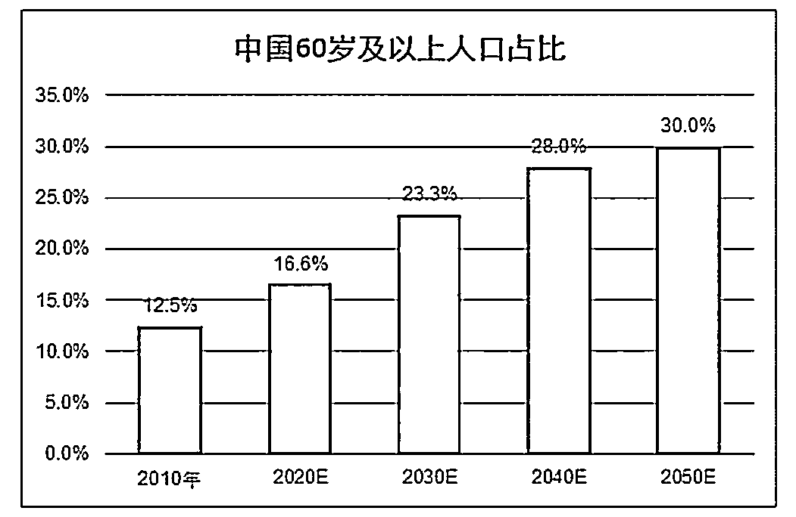

中国七普人口数据分析（老龄化趋势）

2021 年 5 月 11 日，国家统计局发布第七次全国人口普查公报（以下简称七普）。此次人口普查的调查研究对人口和人口结构对经济发展具有重要的意义。

此次人口普查的调查时间为 2020 年 11 月 1 日至 12 月 10 日，以 2020 年 11 月 1 日零时为标准时点，对我国境内的自然人以及在境外但未定居的中国公民，逐户逐人进行了普查登记。

 

 

人口普查是全面查清国家人口数量、结构、分布的重要途径，中国目前为止进行了七次人口普查，分别于 1953、1964、1982、1990、2000、2010、2020 年进行。在现行统计制度下，人口普查每 10 年开展一次，尾数为“0”的年份为普查年度，其余年份进行人口抽样调查，其中尾数为“5”的年份进行规模较大的 1% 人口抽样调查，也称为“小普查”。

需要注意的是，人口普查与抽样调查的统计方法不同。人口普查以全体目标人群为调查对象，而人口抽样调查的数据利用抽样比推算获得。相比之下，人口普查不存在抽样误差，漏登率更低，数据更为准确。因此，根据普查结果修正中间年份的历史数据亦是人口普查的重要意义之一。

我这次会从人口规模、年龄结构、城乡结构、区域结构和人口素质等方面对七普数据进行研究，分析中国人口变化的五个趋势，以及由此带来的对经济的影响和市场机遇。

首先有个事实：

人口老龄化是今后较长一段时期我国的基本国情，这既是挑战也存在机遇。** **

中国人口变化趋势可以用“一慢四快”概况。

人口增速放慢

 

 

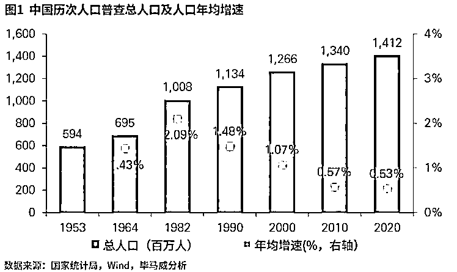

而生育率较低是人口增长放慢的主要原因。

历史上，中国三次婴儿潮分别在建国初期、**1962-1973 **年左右、**1986-1990 **年左右出现，出生人数的波动存在明显的周期性，但由于实施计划生育政策，第四次婴儿潮并未在 2010 年左右出现，且 15- 49 岁育龄妇女人数在 2011 年达到约 3.8 亿的顶峰后持续减少，使 2010 年后出生人口直接进入下行区间。

生育政策逐渐放宽使出生人口短期上升，继“双独二孩**”**、**“**单独二孩”于 2011 年、2013 年相继放开后，2016 年中国放开“全面二孩”，在 2016 年、2017 年出生人口大幅增长至 1,883 万和 1,765 万人，二孩占比由 2013 年的 30% 左右升至 2017 年的 50% 左右。

随着此前积累的存量释放，2018 年以来出生人口回落，但出生人口中的二孩及以上孩次占比在 2019 年仍高达 59\. 5% ，**“**二孩效应**”**放缓但仍在延续，使得 2020 年 0-14 岁少儿人口占比较 2010 年回升 1.4 个百分点。

 

 

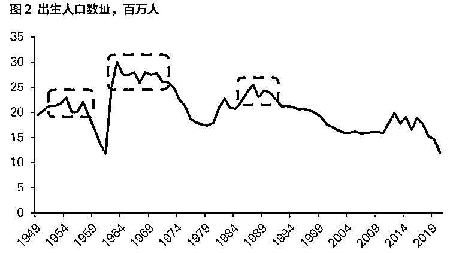

老龄化加快

根据七普数据，我国劳动年龄人口的比例和绝对量都出现下降。

 

 

我国老龄化现象加重，并呈现出三大特点：

**1**）人口老龄化加深且规模庞大：

“七普”数据显示，我国  **60 **岁及以上人口有 2.6 亿人，比重达到  **18.70% **，其中 65 岁及以上人口 1.9 亿人，比重达到 13.50% 。

按照国际通行划分标准，当一个国家或地区 65 岁及以上人口占比超过 7% 时，意味着进入老龄化；达到 14% ，为深度老龄化；超过 20% ，则进入超老龄化社会。我国正处于属于轻度老龄化阶段。

**2**）从国际比较来看，中国老龄人口规模也非常庞大：

65 岁及以上人口数量大于美日德法英韩 6 个主要经济体之和。

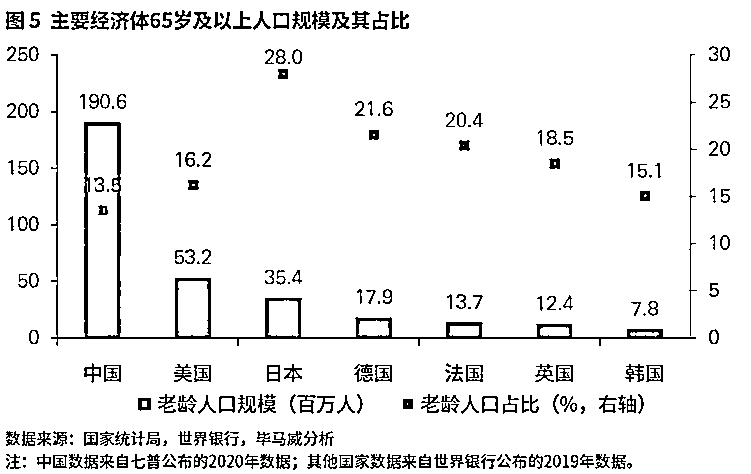

**3**）未富先老：

 

 

从经济发展水平来看，2020 年我国人均** GDP **为** 10,504 **美元，而日韩达到相似老龄化比例（ 65 岁及以上占比 13\. 5% ）的时间分别为  **1993 **年、**2016 **年，当时其人均  GDP 分别为 35,766 美元、29,289 美元，远高于我国目前水平，中国正面临未富先老的现象。

而老龄化进程也是明显加快：2010 至 2020 年间，我国老龄化进程明显加快，与六普相比，**60 **岁及以上和** 65 **岁及以上人口占比上升速度分别加快了  **2.5 **和** 2.7 **个百分点。

相比之下，六普相对于五普，65 岁及以上人口占比幅度仅提升 0.5 个百分点。据世界银行数据，**2008 **年后我国老龄化速度明显加快，**2017 **年增速超过日本，目前在主要经济体中增速仅低于韩国。

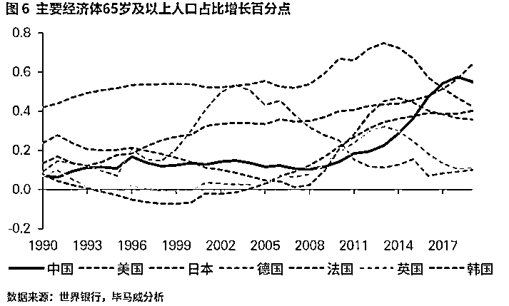

城镇化加快

 

 

中国城镇化率由  **2010 **年的** 50% **达到** 2020 **年的** 63. 9% **，年均增速** 1.4% **，处于城镇化高速发展阶段。从国际比较来看，改革开放后，我国城镇化进程迅速加快，不断缩小和世界的差距。

1980 年时我国和世界中等偏上收入国家平均城镇化率的差距高达 28.3 个百分点，到  2019 年时该差距已经缩小到不足 2 个百分点。

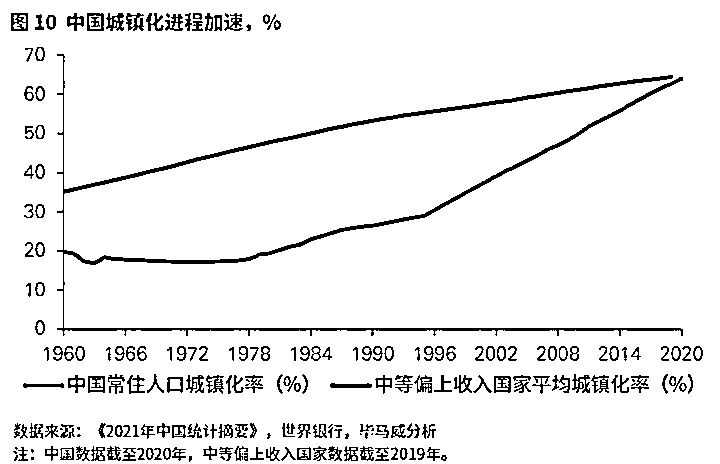

人口流动加快

2020 年我国共有流动人口 3.76 亿人  ，较** 2010 **年六普增加** 69.7% **，意味着我国约每四人中便有一人为流动人口。其中，2.5 亿人为从乡村到城镇的流动，较 2010 年增长  1.1 亿人，在总流动人口中占比达** 66.2% **。反映了我国城镇经济活力正在不断提升，人才资源配置水平提高，城镇吸纳人口迁入包容度加大。

 

 

人口素质提升加快

随着我国人均受教育水平不断提升，接受高等教育的大学毕业生数量越来越多，根据教育部最新预测，2021 年我国高校毕业生数量将达到 909 万，到 2022 年，高校毕业生数量将超过 1,000 万人（图 15）。但另一方面，创造合适的就业岗位，解决大量大学毕业生的就业问题也是一个挑战。

 

 

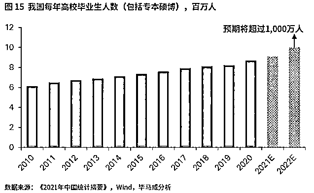

**-02-**

中国人口老龄化趋势带来的影响和机遇** **

一、影响

**1. **一老一小消费市场广阔****

根据联合国对中国 2020-2030 年间人口变化的预测，未来 10 年间 35-44 岁、55-64 岁、65 岁及以上几个年龄段人口数量增长最快（图 16）。人口结构的变化也将带来消费结构的改变，婴幼儿消费、银发经济这一老一小市场空间广阔，同时，家庭规模缩小也带动了单身经济、宠物经济等消费的发展。

 

 

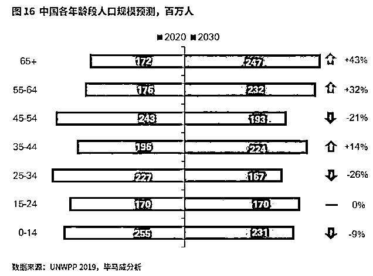

联合国数据预测未来  **10 **年我国将增加** 1.1 **亿** 60 **岁以上老龄人口。中国老年人口庞大，老龄化进程加快，是我国人口面临的一大重要挑战，但老龄人口的增加也扩大了老龄产品和服务的消费，使得银发经济具有广阔的前景和巨大的发展潜力。

除了带动医疗、康养等相关行业之外，老年人对休闲娱乐、旅游等需求也越来越强烈，甚至许多老年人退休之后进入老年大学等教育机构来获取知识和培养兴趣，老龄教育服务行业应运而生。

 

 

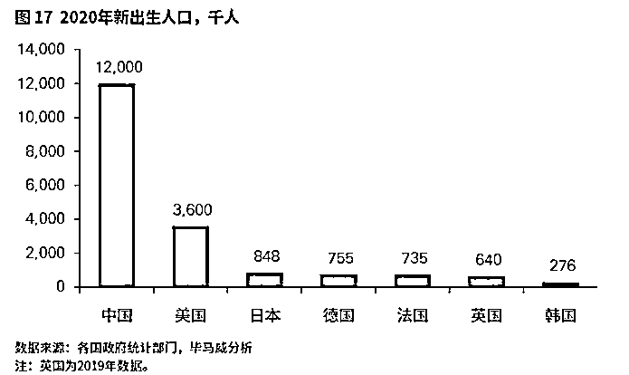

我国近年来人口出生率虽然有所下降，但 2020 年仍有 1,200 万新出生人口，约为美国、日本、德国、法国、英国、韩国  **6 **国新出生人口总和的** 1.8 **倍。

5 月 31 日中央政治局会议进一步提出放开三胎，并将重点推出税收、住房等配套支持措施，随着后续生育政策在降低家庭生育、养育、教育等成本方面发力，有望在一定程度上提高适龄青年生育积极性。

同时，越来越多的  **90 **后甚至** 00 **后将成为父母，成为育儿消费市场的主力。他们普遍接受过良好的教育，更加注重科学育儿和品质消费，推动育儿产品的消费升级。此外，越来越多的年轻父母也将需要独立育儿，这也给普惠托育、智能玩具、育儿生活护理等细分市场带来新的增长点。

**2. **国货品牌快速崛起****

 

 

近年来，随着中国经济的增长、国内产品质量的不断提升，以及中国文化魅力的彰显，中国消费者对国货品牌的关注度明显提升，百度数据显示，从 2009 年到 2019 年的十年间，消费者对中国品牌的关注度几乎翻倍，从** 38% **增长到** 70% **，甚至超过了对境外品牌的关注度。

特别是对于  **80 **后、**90 **后来说，是在中国经济和数字化高速发展的过程中成长，拥有更高的国家和民族认同感、自豪感。此外，年轻一代消费群体更加注重个性化的表达，勇于尝鲜，是中国品牌发展最主要的关注者。

未来 10 年，这些年轻一代消费群体普遍处于  **35-44 **岁区间，也是增长最快的人口区间之一，这个年龄段消费群体的增长为中国品牌的崛起提供了巨大的成长空间。

为了迎合年轻一代消费升级的需求，国货品牌的质量也在不断提升，中国在数字经济方面快速创新的优势，也使得国货品牌可以更快速地洞察消费者需求、打造“千人千面”的营销模式、加强个性化定制的产品输出，从而提升品牌价值。

如今的国货产品已经褪去“无趣”和“廉价”的刻板形象，国货品牌也代表着“新潮”和“高品质”。我们预期国货品牌价值将迅速增长，新国货全面崛起指日可待。

**3. **社区养老和商业养老保险大有可为****

面对日益严重的老龄化压力，**“**十四五**”**规划将积极应对人口老龄化上升为国家战略。对于如何破解中国目前的老龄化矛盾，可以从几个方面推进：

**1**）大力发展社区养老和机构养老

 

 

随着计划生育时期出生的独生子女逐步成为社会的中坚力量，家庭养老的负担也日益加重，加强社区养老和机构养老可以帮助缓解一些对家庭的压力。

对于社区养老，可以完善社区居家养老服务网络，推进公共设施适老化改造；对于机构养老，可以加大对养老产业的支持力度，多措并举扩大养老机构床位供给，提升养老机构的专业服务能力。

加大二三支柱养老金的推进力度：我国三大支柱的养老金体系发展很不平衡，呈现**“**头重脚轻**”**的现象，以企业年金和职业年金为主的第二支柱参保覆盖面仍然较窄，只能满足小部分群体的养老需求；由个人储蓄型养老保险和商业养老保险构成的第三支柱参保人数几乎可以忽略不计。

根据 2019 年数据，我国养老金第一支柱占比逾七成；第二支柱占比不足  **3 **成；第三支柱占比几乎可以忽略不计，相比之下，美国等发达国家养老金体系已经走向以二三支柱为主导的商业化模式。未来我国亟需加大对二三支柱养老金的推进力度，促进养老金体系更均衡、更可持续的发展。

 

 

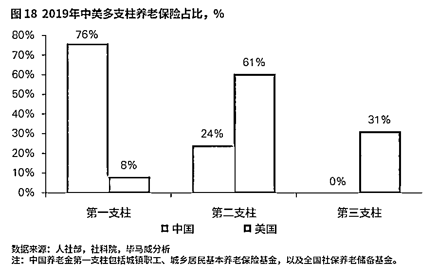

**2**）自动化、智能化升级加速****

七普数据显示，我国劳动人口的比例和绝对量都出现下降，较低的生育率也将影响我国未来劳动力人口增长。劳动力作为主要生产要素之一，劳动力数量的下降会推升劳动成本，但也将加速企业自动化升级的步伐。

疫情后制造业企业正在加大资本开支，例如今年前四个月，制造业企业固定资产投资增长** 23.8% **，明显快于房地产、基建等投资门类。可以看到，企业正在加大投入提升机械设备自动化水平，减轻对人口成本的依赖，预计未来工业自动化装备市场前景广阔。

中国经济正处于转型升级的关键阶段，面对人口红利的逐步消失，以及当前新一轮的科技革命和产业变革着重强调的数字化转型，传统产业也将加速向智能、高端升级，以提升国际竞争力。

 

 

目前许多行业龙头企业已经从早期的数字化尝试，演进到数字化贯穿企业的各个部门，并积累了大量数据。在此基础上，企业可以利用云计算、人工智能等先进适用技术，更好地挖掘和利用数据资产价值，助力产品和服务创新，发现新的业务和商业模式。

另外，智能化转型不仅可以帮助企业提高生产和服务、发现新的需求，还可以帮助提高企业的敏捷能力，以应对全球市场的快速变化和技术的不断更新，推动企业提质增效。

**3**）人才红利推动创新发展****

我国人口结构的变化将推动从人口红利向人才红利的转变。**“**十四五**”**规划指出，创新是我国未来发展的核心驱动。在国际环境日趋复杂的背景下，加强基础研究，攻关核心技术，切实提升关键领域自主可控能力，是我国面临的重要任务和挑战，而人才是科技创新的根本。

过去十年间，我国拥有大学（大专及以上）文化程度的人口占比增长最多，由  **8.9% **提高至** 15.5% **。企业应充分发挥人才资源的作用，利用好当前的人才红利优势，加大对人才投入力度，加强对创新型、应用型、技能型的人才培养，以提升在未来创新发展中的市场竞争力。

一方面，企业可以通过引进高端人才，提升科技创新能力和国际竞争力，在加快产业转型升级的同时，创造出更多适合大学生的就业岗位，进一步形成人才红利的良性循环。

另一方面，企业可以加强与高校、科研机构合作，通过承担国家重大科技项目，建立产业创新中心等模式，对基础学科、关键技术和前沿领域进行研究和攻关。这能够促进产学研相互融合，全面激发科研人才的创新活力，同时也有助于企业加快成果转化能力，助力国家实现关键技术自主可控。

 

 

二、人口老龄化带来的新机会** **

**1. **养老院

很多对养老感兴趣，准备进入这一行的人，经常会问一个问题：那就是养老院的名字各不相同，有的叫养老院，有的叫养护院，还有的叫护理院，这些到底有何区别？

虽然市面上能见到养老院、养护院、老年公寓等种类繁多的称谓，其实在国家标准规范上，有一个统一的名称——老年人照料设施。

根据 2018 年 10 月 1 日正式实施的《老年人照料设施建筑设计标准》（JGJ450-2018），老年人照料设施（care facilities for the aged）是指为老年人提供集中照料服务的设施，是老年人全日照料设施和老年人日间照料设施的统称，属于公共建筑。

老年人全日照料设施（24-hour care facilities for the aged）是指为老年人提供住宿、生活照料服务及其他服务项目的设施，是养老院、老人院、福利院、敬老院、老年养护院等的统称。

老年人日间照料设施（day care facilities for the aged）是指为老年人提供日间休息、生活照料服务及其他服务项目的设施，是托老所、日托站、老年人日间照料室、老年人日间照料中心等的统称。

当然每个人分类方式不同，从养老院产品策划角度来说，我一般喜欢按照辐射范围分为以下几类：

**1**）社区居家型：

 

 

如同老年人日间照料设施，辐射范围为全社区的长者，可提供日间照料，居家上门，康复理疗，文化娱乐等服务，也有一些社区型机构会设置少量床位（几十床），为长者提供长托、短托和临托服务，床位设立是创收的基础，而入住率对机构来说是营收的最关键指标。

**2**）护理型机构：

设有生活起居、文化娱乐、康复训练、医疗保健等多项服务设施。主要面对的的需要护理照护的，缺乏自理能力的长者，为他们提供居住、医疗、保健、康复和护理的配套服务；主要类型有养护院（民政牌照，养护为主），护理院（医疗机构，医疗护理为主），养老院（自理、介助、介护长者都有）等。

**3**）**CCRC**（可持续照顾型社区** **）：

是一种复合式的老年社区，通过为老年人提供自理、介护、介助一体化的居住设施和服务，使老年人在健康状况和自理能力变化时，依然可以在熟悉的环境中继续居住，并获得与身体状况相对应的照料服务。

CCRC 选址通常在郊区，离城市较远，由于社区规模较大，在选址上关注生态环境和自然气候，大量运用园林景观和水系营造出人与自然和谐的居住环境，使老人在城市中享受到田园生活，达到怡情养性、延年益寿的目的，十分适合老年人居住和生活。

随着观念的改变，现在送长辈去养老院已经不是子女不孝的代表了，有些高级养老院的入住反而成了一种儿女成功的身份象征。家里没人照料，保姆照护不专业，老人独自在家太寂寞，都是越来越多人选择去养老院的原因。

随着年龄的增长，老人对物质的追求逐渐降低，更加注重内心渴望，但居家养老，老人在家里时儿女上班，孙子孙女上学，大多数时间老人都是孤单一人。

 

 

孤独比每天吸一包烟对身体的损伤都要大，对于老人来说，精神孤寂是影响健康的首要原因。

如果在养老院，就会找到一群和自己年龄相仿、阅历相差无几，也不会有代沟的朋友。

那些共同经历的年代记忆能让老人找到归属感，不再孤单，吐露心声，成为知心朋友。

现在的养老院为入住老人提供丰富的业余选择，做到天天有活动，月月有安排，使老人乐在其中，认识更多同龄的朋友，实现自身价值，丰富业余生活，让老人在精神上得到极大的满足。

传统观念中，养老院仅为老人提供住宿和饮食，经过这些年的发展，我国养老院尤其是民营养老机构不断建设与完善。居住房间均配有电视、冰箱、空调等生活设施，公共活动中心有阅览室、棋牌室、理发室、健身房、康复室……

一般的养老院都具备完善的组织架构和服务体系，从悉心照护到精神关怀再到一体化医疗，专业化的服务让入住中心的老人安心，让家属放心。

大部分养老院都会有自己的时间表，老人除了自由活动外，一般都会安排集体活动时间。和老伙伴们一起运动娱乐玩耍，这样会让老人的生活更加健康和快乐，也可以让老人的一天过得非常充实。规律的一日三餐，营养均衡；规律的生活有利于老人的身心健康。养老院把合理丰富的活动和充足的休息时间相结合，老人每天都能精神振奋。

最后必须总结一下：

养老院虽然前景广阔，但却不是一个适合普通人入局的项目。

原因：投资大，回报周期长

 

 

因为整体老龄化趋势，诞生了很多门槛不高适合普通人入局的新兴职业：

**1**）老年人能力评估师

2020 年 7 月，人社部联合国家市场监管总局、国家统计局发布 9 个新职业，包括老年人能力评估师。

截至 2020 年 11 月初，全国各地的老年人能力评估师大致分为专职和兼职两种，专职指第三方老年人评估机构，兼职则指由养老机构从业人员担任评估师，两种类型的评估从业者人数在 10 万人以上。常见的评估方式分为三类：第三方评估、养老机构评估后再由相关部门抽查或普查、养老机构独立评估。

工作任务包括：

采集、记录老年人的基本信息和健康状况；

评估老年人日常生活活动能力；

测量与评估老年人认知能力、精神状态、感知觉与沟通能力、社会参与能力；

依据测量与评估结果，确定老年人能力等级；

出具老年人能力综合评估报告；

为老年人能力恢复提出建议。

目前，我国享受高龄津贴的老年人达 2680 万人，享受护理补贴的老年人达 61 万人，享受养老服务补贴的老年人达 354 万人，共有超过 3000 万人需要通过老年人能力评估确定领取补贴资格。

从筛查到护理补贴发放的过程都需要进行评估，需求量很大。而且现在全国有超过 200 万人住在养老机构里，从进入养老机构开始就需要初始评估，签订入住契约、合同，通过评估结果实施不同等级的服务。所以，这个岗位无论是从宏观体系、干预人才体系的建设还是微观的服务提供上，都是一个非常有必要的新岗位。

 

 

统计数据显示，老年人能力评估师人才需求为 150 万，但当前的从业人员尚不足 10 万，有巨大的人才缺口。这跟老年人能力评估师是 2020 年人社部等发布的“新职业”，很多人还不了解或者说是没接触过有一定的关系。一个新的风口，就看能不能把握住了。

现在一线城市中的老年人能力评估师月薪将近万元，二三线城市月薪也高达五六千元。

随着养老机构、评估机构等需要老年人能力评估师的机构越来越多，而人才缺口还高达百万，相信老年人能力评估师的待遇还会有所提高！

**2**）适老体验师

一个为老年人“造梦”的新职业经由央视新闻推广。

在 2020 年底，工信部开展互联网应用适老化改造专项行动，为了让老年人在信息化发展中获得更多幸福感，适老体验师应运而生。

为解决界面复杂看不懂，想看视频不会搜索，字太小看不清……这些问题，适老体验师推出了听音识图、无障碍剧场等功能。为了摸准老年人的使用习惯，适老体验师还会蒙上眼睛，模拟老年人真实使用场景，或去社区收集老年人的使用建议，为老年人带来更多的文化娱乐新体验。

帮老年人追赶智能时代。

 

 

目前，各大互联网公司应工信部要求，都有适老化改造需求。截止至 12 月，工业和信息化部发布《关于电信服务质量的通告（2021 年第 4 号）》。通告指出，第三季度互联网应用适老化及无障碍改造专项行动取得阶段性成效。目前，已有 158 家网站和 APP 初步完成改造。改造后，老年人浏览新闻更轻松，线上购物更简单，购票打车更省心。

（工信部）

“阿里 40 万元年薪聘“老年产品体验师”、“还记得年薪 40 万的中老年淘宝体验师吗？”消息层出不穷。

这个职业不仅仅年轻人可以参与到软件的适老化改造，老年人也有机会被聘请为体验师。随着老年群体的网购需求，网络娱乐需求的快速增长，适老体验师需求和市场也在逐步扩大。

适老化改造推行一年，成果显著，更有不少网站和 APP 不止于字体放大、界面简化等初级改造，而是为老人配备专属客服，更加彻底地解决老人面临的数字困境。伴随老人使用互联网的障碍进一步消除，未来更深层次的适老化将展开拉锯战，各大平台需要更加深入地研究老人的需求和喜好，为他们提供适合他们的内容、产品和服务，这是留存老年用户的关键。

再例如健康管理师和公共营养师等新职业也因为老龄化趋势而变的紧俏。平均 2 个月就可以自学考到证书，考完后还可以领导国家办发的证书并申请补贴。就业市场也是十分的广泛。

**-03-**

银发经济** **

 

 

你心目中的老年人 vs 现在的老年人

你心目中的中国大爷大妈是不是还停留日本脚踹樱花树、在法国喷泉泡脚、在泰国盘子铲虾？

是不是在停留在穿着老土、仪态欠妥的传统印象？

是不是认为老年人稍微会用手机搜索购物，会跳广场舞就算很厉害了呢？

给大家看看现在网上崛起的一大批网红中老年银发 IP 。

2019 年 6 月，几位奶奶穿着非遗蜡染旗袍在北京三里屯走秀的视频迅速登上各大社交软件的热搜榜，在抖音上发布第一条视频，并迅速登上抖音、微博、快手三大平台热搜榜。连续 7 天，总播放量超过** 5 **亿。

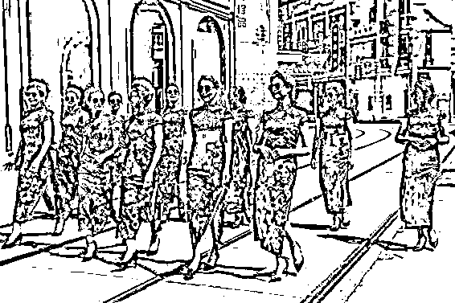

这个是由一个平均年龄超过了** 65 **岁，每个人的头发都已经灰白，但仍然化着精致妆容的团体：**“**时尚奶奶团**”**

 

 

时尚奶奶团是中国时尚文化传播者，她们代表着中老年女性的精神面貌、生活状态和生命状态，时尚奶奶团更是全新的中老年生活方式平台，让更多的中老年女性都能活出自我，开启崭新人生。她们穿着旗袍走遍世界各地，向全世界宣传中国的文化，向大家传达了美好的生活理念，把中国老年人的时尚态度及文化带向世界舞台，让世界看到东方女性的魅力。

时尚奶奶团曾受邀在上海的日本大使馆、菲律宾大使馆、法国大使馆和明星走秀，也曾经多次受邀参加伦敦、纽约的时装周，国内很多电视台也都给她们递过邀请函。

截至目前，时尚奶奶团全网粉丝已超过 1500 万，已经发展成引领中老年女性开启全新生活方式的成长平台，从而鼓励所有中老年女性群体不再被年龄定义和束缚，勇于表达自我，欣赏自我，活出精彩。”

往小了说，我国中老年产业发展已经初具规模，这个产业里的各个细分市场都在重塑消费者画像，创业者们都在寻找中老年人群隐藏在表象之下的真实消费需求。

往大了说，随着我国国力日益强盛，需要向全世界展示中国老人美丽、优雅、自信、大方、从容的精神风貌，在世界范围内打造完美的国际形象。

得益于互联网短视频平台的发展，更得益于近两年兴起的中老年网红产业，他们创造与传播了全新的中老年人形象，将越来越多的中老年人带入了互联网。

看中了这个产业趋势，在互联网平台上打造中老年网红的远不止何大令和她的团队打造的“时尚奶奶团”。

 

 

他们有的帮中老年人甩掉了“封建落后”的标签，如“罗姑婆”就操着一口流利四川话，教年轻人如何在爱情中取舍；他们有的帮中老年人拔掉了“生活技能落后”的字眼，如“老饭骨”就细致入微的给年轻人讲解了经典菜肴的制作过程，让他们能回归家庭生活。

任何行业都会因为老年行业而细分一次，那么面对的问题也不会有太大偏差。

在中老年网红产业里，大部分中老年网红们都是通过内容吸引粉丝，从而通过打广告、接代言、或者选品带货的方式进行流量变现。

近两年被吹上风口的直播带货模式，成为了各类网红们变现的首选，然而，这条路在中老年网红身上却并不好走。很多中老年网红都并没有选择直播带货的变现模式，如“罗姑婆”目前还是以原始的广告合作为主，而“老饭骨”宣布融资之后开始走线下品牌孵化之路了。

做任何事情你的发心都是绝对最后能否成功的基石。这个世界上任何成功的企业，都源自于他解决了一个社会问题，又或是提供了另一个视角的生活方式的可能。一个好的初心，一个利众的旅程，在任何行业做任何事情都是至关重要的。

中老年行业里创造商业价值的同时，如果能传递一种中老年人美好的生活方式作为切入口，带给千千万万的中国老人更多种丰富多彩生活的可能性，打破传统的限制性信念，这一点对于我本人来说是最重要的。

年轻人现在美业流行，那么按照每个行业都可以就银发群体做一次细分的规则，大家是不是也可以考虑做中老年的美业？大家自行发挥想象哈哈

开头说过所有行业都会因为中老年人再做一次细分，最后给大家整理了一下老年行业在娱乐，健康、科技的发展数据以及市场动向资讯。

 

 

**1. **有声书****

近日，QuestMobile 发布《2021 声音经济洞察报告》，2021 年 10 月，声音人群规模达到 7.28 亿，其中，有声听书作为新兴行业，月活用户规模增长强劲，对比 2020 年 10 月增长率高达 166.9% ，远超其他四个行业。而在有声书的用户画像里，60、70 后为代表的年长用户偏好度（TGI）明显高于年轻用户。另外，为声音付费的用户里，60、70 后占比也达到 27.9% 。

基于“看”的短视频在席卷中老年人群生活之时，有关“听”的声音经济也在快速向中老年人渗透。多种数据表明，中老年人是有声书的重度用户，“听书”已经成为他们中间的一股风潮。围绕“听”的需求，中老年人的付费意愿也越来越强烈。如今，随着互联网的流量红利日趋接近天花板，中老年人作为最大的增量所在，毫无疑问也将为在线音频市场带来新一轮机遇。

**2. **银发健身****

 

 

银发族健身人数增速明显，女性私教活跃率高出男性** 1.3 **倍。

早前，乐刻发布“银发一族（60 岁及以上人群）”健身大数据，近两年该年龄段人数增速明显，每年增幅在 30% 左右，上午 8 时至 10 时是“银发一族”女性最爱时段。同时，“银发一族”每周到店健身频次比其他年龄段多出 1 次，该年龄段女性私教活跃率占比比男性高出 1.3 倍。

此外，平均每两位到店的“银发一族”女性中，就有 1 位会上团操课，Zumba 类的舞蹈课程为“银发一族”最爱，其次是瑜伽类等课程，男性团课活跃率几乎为零。（新京报）随着国内老年群体健康意识增强，他们对运动健身的需求也不断扩大，传统健身市场大多把目光聚焦在年轻人身上，针对中老年人群的商业健身机构一片空白。近日，中共中央、国务院发布《关于加强新时代老龄工作的意见》，提到要提升老年文化体育服务质量，可以预见，未来老年运动健身市场将迎来新的发展。

**3. **银发族线上消费****

QuestMobile 数据显示，2020 年，中国 50 岁以上人口数量为 4.51 亿。截止 2021 年  10 月，50 岁以上移动网民月活突破 2.5 亿，月人均使用时长达 143.9 小时；地域分布上，三四五线城市人群占比达到 62.1% 。另外，近七成银发人群通过线上进行支付，千元以上消费能力的银发人群占比 54.3% 。女性人群关注价格和品牌，男性更注重时尚、品质等，在消费体验方面要求更为突出。（QuestMobile）

 

 

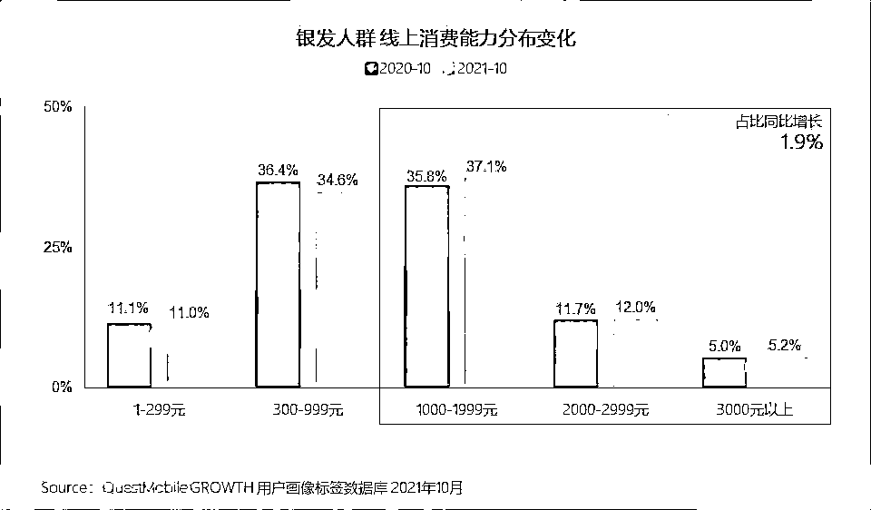

在国内，50 岁以上人群已经可以视为占比高达 1/3 的主力人群之一，他们在互联网上的渗透率也在不断提升，线上正在成为他们生活场景中的重要组成部分。未来，银发人群的各种需求很大概率将会通过线上满足。然而，目前针对银发人群的线上内容、产品和服务供给还相对稀缺，未来潜力巨大。

**4. **电视节目****

银发人群收视特点：**50 **岁以上电视观众达** 3.58 **亿，每天近** 7 **成银发观众收看电视节目。

 

 

CSM 2021 年基础研究报告数据显示，50 岁以上银发 e 族电视观众数量达 3.58 亿，占全国电视观众的 28% 。每天有近七成银发观众收看过电视节目，人均收视时长达 215 分钟，收视率达 14.9% ；从节目类型来看，电视剧、新闻/时事、综艺是银发 e 族收看的最主要节目类型。另外，相比所有观众，银发 e 族在财经、法制、新闻/时事、体育和戏剧类型的节目资源使用效率更高。（CSM）

银发网民数量已经高达 2.8 亿，但相比银发电视观众仍然少了 7500 万人，时至今日，电视仍然是触达银发人群最主要的媒介渠道。

而从银发人群对媒介的偏好和使用习惯来看，他们也依然是电视的重度用户。这一方面为传统电视台转型指出了方向：即针对老年人的需求和喜好设计创新节目，增强粘性。

另一方面也为老年行业企业提供了新的获客思路。

**5. **中老年化妆教程网站****

日本资生堂推广** 50+ **女性个护产品线，上线中老年化妆教程网站。

 

 

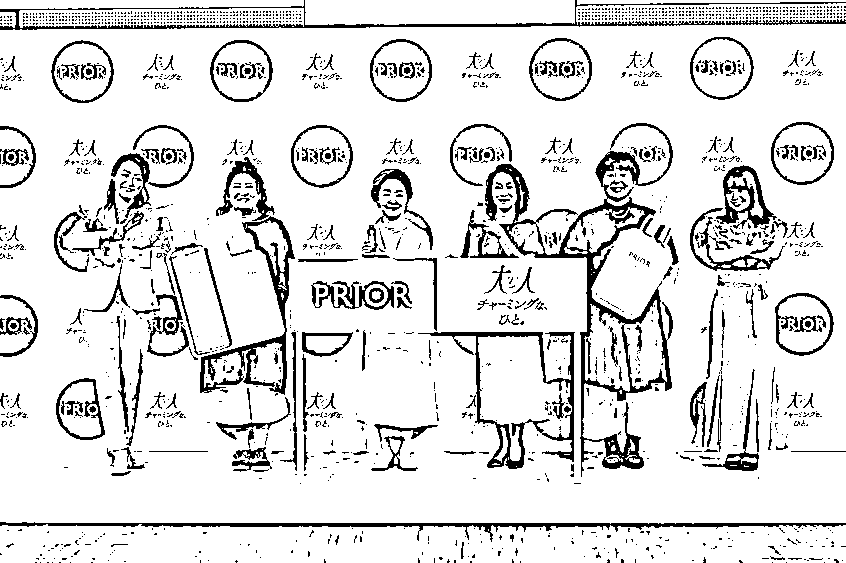

近日，日本资生堂面向 50 岁以上女性的个人护理系列“PRIOR”启动新项目“熟龄魅力”（意译）  。资生堂将为此开设专门的网站，传播中老年化妆教程，目标是在三年内将“PRIOR”打造为熟龄一代的首选品牌。

发布会上，76 岁的宫本信子、67 岁的黑泽和子、69 岁的大岛美雪等演艺名人作为代言人亮相。据了解，日本永旺、亚瑟士健步鞋、连锁药店 WELCIA 等日本企业也将参与此项目。（外媒）

于 2015 年推出的资生堂“PRIOR”主打美容护理产品，以护肤、底妆、护发等系列为主，售价约在 200-600 元人民币之间。

在产品线成熟后，资生堂将重点放在了市场教育及渗透上，通过化妆教学视频打开市场。在国内市场，通过化妆教学视频引流，也已经成为中老年赛道的流量密码。在线下渠道方面，资生堂选择和日本永旺、连锁药店合作，为国内老年化妆品品牌提供了新的思路。

 

 

**6. **天猫医药健康联合薇娅直播间，发起**“**银发经济公益活动**”**

近日，为协助关怀困境老年人群体，在国家卫生健康委人口家庭司的指导下，天猫医药健康联合薇娅直播间发起“银发经济公益活动”，举行关怀困境老人义卖直播，聚焦关注 60 岁以上，身体和心理需要照顾的老年人，公益收入将全部捐献给中国人口福利基金会，用于困难老人等特殊老年群体健康和扶助关怀。（中国家庭报）

从字节跳动发起助老公益项目“银杏家园”，到天猫如今发起的银发经济公益活动，巨头围绕银发人群展开的动作不仅仅是适老化改造，也在纷纷以公益形式助推他们的生活变得更加美好。这也诠释了银发经济的核心不是“经济”，而是“银发”，只有本着为银发人群提供更高品质更加美好生活的心态，才能做好银发人群的生意。

** **

**7. **中国老年人体育协会广场舞专项委员会成立****

近日，中国老年人体育协会广场舞专项委员会成立大会在国家体育总局老干局活动中心举行，中国老年人体育协会副主席温文当选广场舞专委会主任。专委会由中国老年人体协、各省老年人体协、华奥星空科技发展有限公司及合作企业代表组成，办公机构设立在华奥星空。会上，湖北、山东和河南的老年人体协代表以网络连线的方式进行经验分享，介绍了省内开展广场舞运动进行的有益尝试和成熟做法。（中国体育报）

广场舞，一直以来被视为中老年女性的专属标签，也被不少企业视为打入中老年市场的重要渠道。如今，中国老年人体育协会广场舞专项委员会成立，意味着广场舞在老年人运动、文娱、社交等领域的价值正在被国家重视，正式成为老年人体育运动中的一种。

可以预见，未来，广场舞仍然会有更多发展形态，围绕广场舞所建立的老年线下运动、健身空间也有机会。

**8. **韩国将开发**VR**老年驾驶培训课程，计划于**2025**年开始使用****

 

 

为了控制老年司机的事故率，近日，韩国警方正在开发一个定制驾驶员培训项目，该项目计划使用 VR 技术评估 65 岁及以上驾驶员的驾驶、认知和记忆能力，以判断他们是否继续持有驾驶证，项目为期三年。该项目源于韩国日益加深的人口老龄化问题，据悉，在韩国，约有 40% 的士司机年龄超过 65 岁，同时，去年由老年人驾驶员造成的道路交通事故，超过 31000 起。（外媒）

VR 在老年人中的应用场景越来越多，此前，曾有公司探索将 VR 与旅游结合在一起，为老人提供虚拟世界旅行；也有公司将 VR 与游戏结合，应用于认知症的治疗等等。如今，VR 又被应用于老年驾驶培训，这意味着，VR 技术在老年人群中的商业空间在不断拓宽，未来仍有许多值得探索的方向。

** 9. **伊利欣活签约**70**后刘国梁为品牌推荐官****

近日，伊利旗下中老年奶粉品牌欣活宣布签约 70 后知名乒乓球运动员、教练员刘国梁为品牌推荐官。刘国梁有着近 40 年乒乓球职业生涯，现任国际乒乓球联合会执行副主席、中国乒乓球协会主席、世界乒乓球职业大联盟理事会主席。关于此次签约，伊丽欣活表示，希望和刘国梁一起用专业配方守护中老年人健康。（伊利欣活公众号）婴幼儿奶粉市场增速正在放缓，由增量市场变成存量市场。与此同时，伴随老龄化趋势加深，中老年奶粉正日渐成为乳企的主要竞争方向。近两年来，包括伊利欣活、蒙牛悠瑞、雀巢怡养等在内的中老年奶粉品牌不断加码中老年高端市场，除了密集发布新品，营销玩法也越来越多样，推动中老年奶粉市场竞争加速升级。

**10. **美国老年人社交学习平台**GetSetUp**获得**1000**万美元战略投资** **近日，AgeClub 获悉，美国一家老年人社交学习平台 GetSetUp 获得 1000 万美元战略投资，投资方为 LightShed Ventures 和 Cowboy Ventures 。

 

 

一年前，该公司曾获得 1000 万美元天使轮融资。GetSetUp 创立于 2019 年，采用实时互动的同辈教学模式，主要为老年人提供课程学习和社交服务，通过视频向老年用户讲解如何使用不同类型的软件，以及一些医疗、金融产品和服务的相关内容。（鲸准）老龄化带来的市场潜力和机遇不仅仅发生在国内，也发生在许多国家。同时，老年人生活、工作、贡献社会的时间也整体呈现出延长的趋势，这催生了不同国家老人对文娱社交和学习的共通需求。

而 GetSetUp 采用同辈教学的模式，既能够帮助老人化解孤独，提升个人认知和社会参与感，也能为不少老人带来“赚钱”的新方式，从另一个维度解决了老人的价值感和收入问题。对于国内企业来说，这不失为一种值得借鉴的模式。

**11. **智能助听器公司智听科技获数千万元**Pre-A**轮投资****

近日，智能助听器公司智听科技（全名为：深圳市智听科技有限公司）获得数千万元  Pre-A 轮投资，投资方包括青松基金、小米战投、顺为资本，华芯资本、至澄资本担任融资顾问。此前，智听科技曾获力合创投天使轮投资。据悉，智听科技成立于 2017 年，是一家致力于听力检测与助听系统智能化开发的医疗器械公司。（界面）

世界卫生组织曾发布统计数据显示，65 岁以上老人中约有三分之一患有残疾性听力损失。与此同时，国内助听器市场的覆盖率不到 5% ，这其中，传统助听器普遍万元以上的售价和不佳的体验是阻碍老人购买助听器的主要痛点。

针对传统助听器市场的痛点和巨大空白，近两年出现了不少新兴智能助听器企业，也带动资本的关注和布局。未来，立足研发，探索更适合老人的产品形态和验配模式，将成为助听器市场变革的关键。

 

 

** **

**12. **美国数字化老年健身平台**Vivo**完成**100**万美元种子轮融资****

近日，AgeClub 获悉，美国数字化老年健身平台 Vivo 完成 100 万美元种子轮融资，本轮融资包括著名的医疗保健和长寿行业领导人及风险资本家参与。Vivo 是一家在线训练健身服务提供商，专门为 55 岁及以上成年人设计训练健身计划。该计划以远程方式提供，用户通过该平台可在家中锻炼。（鲸准）

关于中老年运动健身，国内外已经出现不少相关项目，不乏成功者。而从最近的趋势来看，区别于过去以健身房为主要承载空间的商业模式，瞄准中老年人居家运动锻炼需求的项目也开始出现。除了美国这家数字化老年健身平台 Vivo ，在国内，以乐刻为代表的头部健身公司也在通过家庭场景切入中老年人群。这意味着，中老年人将成为整个健身市场的重要增量已经成为共识，而聚焦他们在不同场景下的运动锻炼需求，也将产生多元的创新创业空间。

**13. **发展智慧旅游提高适老化****

 

 

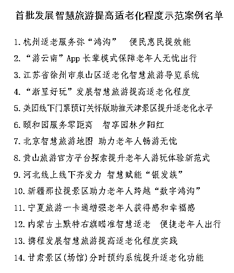

近日，文化和旅游部资源开发司发布通知，公布首批发展智慧旅游提高适老化程度示范案例名单，“杭州适老服务弥‘鸿沟’便民惠民提效能”等全国范围内 14 个案例入选。案例评选旨在推动发展智慧旅游提高适老化程度，解决老年人“数字鸿沟”问题。

种种现象和数据表明，老年人正在成为推动旅游市场复苏的重要推动力量。相比年轻人，他们有钱有闲，对旅游的喜好和需求更加旺盛。而伴随旅游适老化的逐步推进，意味着他们在出行时面临的第一层壁垒被消除，出游的热情也会进一步激发。未来，围绕老人的旅游需求和痛点进行深层次的改造，打造高品质的场景、内容和服务，将成为推动旅游市场升级的新动能。

 

 

关于人口老龄化的思路绝不仅限如此，我只是做了一个大致市场趋势的描述来供大家参考，对中老年人赛道有兴趣的朋友欢迎在评论区跟我交流呀~

评论区：

亦仁 : 感谢分享，已加精华。

刘三点 : 谢谢亦仁🙏

老黄 : 我做了一个月的中老年交友，对标的美国 outtime，但项目终止了，其实中老年市场最大的风险在于我们的国情，很容易被定性为“诈骗”，客单价不高问题不大，但是一旦客单价起来了，就很容易暴雷，没有十全十美的交付，即使降低预期也不可能，所以老白金真正的购买群体是年轻人，而不是老年人。

我做的这部分群体都是高知的中老年人，拿退休金的，但是也不能。

我想明白了为谁服务，但是没想透钱从谁身上出。

一起个人经历，一起生财！

Destiny : 感谢分享，我们团队目前在上海做养老社区领域，想深耕养老行业，期待能加微信联系私聊 Loius19357

池月白 : 感谢分享，老年人在互联网上的商机挖掘，值得探索一番~

聪 _CC : 内容完整、数据详实，思路结构有逻辑，仔细阅读了全文，感谢分享！不管是从行业需求发展趋势，还是我们这代人父母长辈身边人的切实需求，都是一个很值得思考的多赢创业方向～希望有机会还能看到你的相关分享

夜翔梦多 : 你好哦，方便加个微信交流吗，也是从事养老行业的。yexiangmengduo 哇咔丸 : 我们机构想做老年人兴趣课，但是不认识老师....
