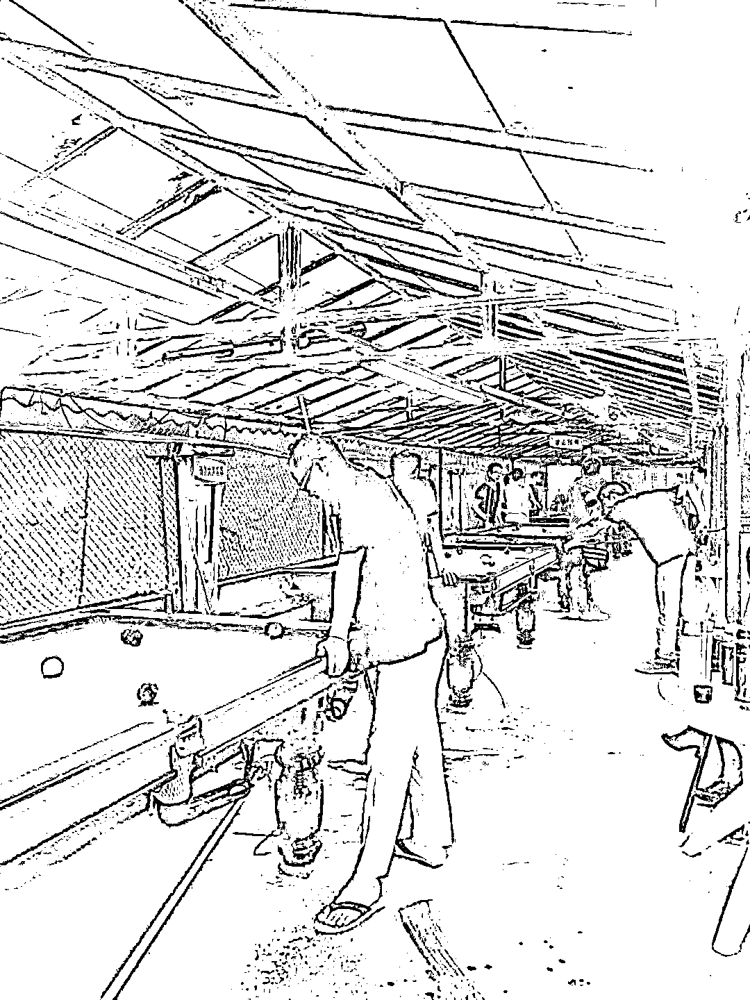
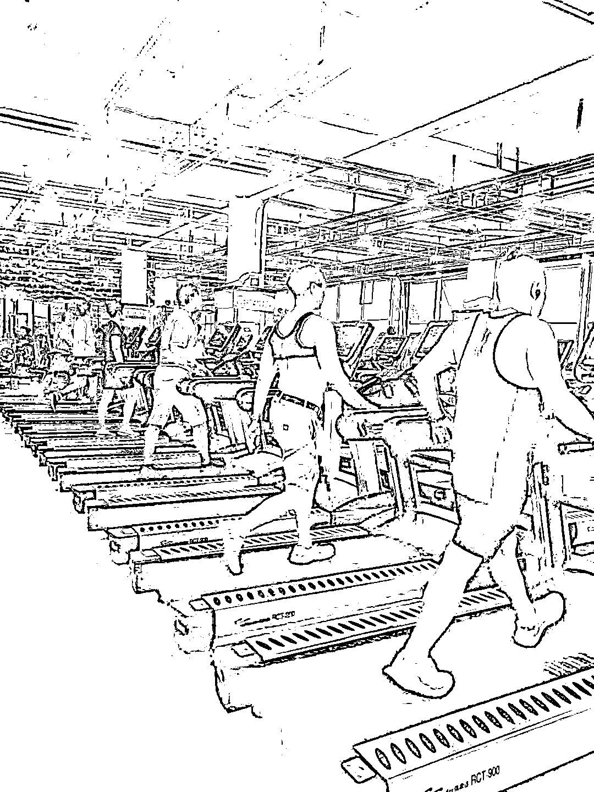
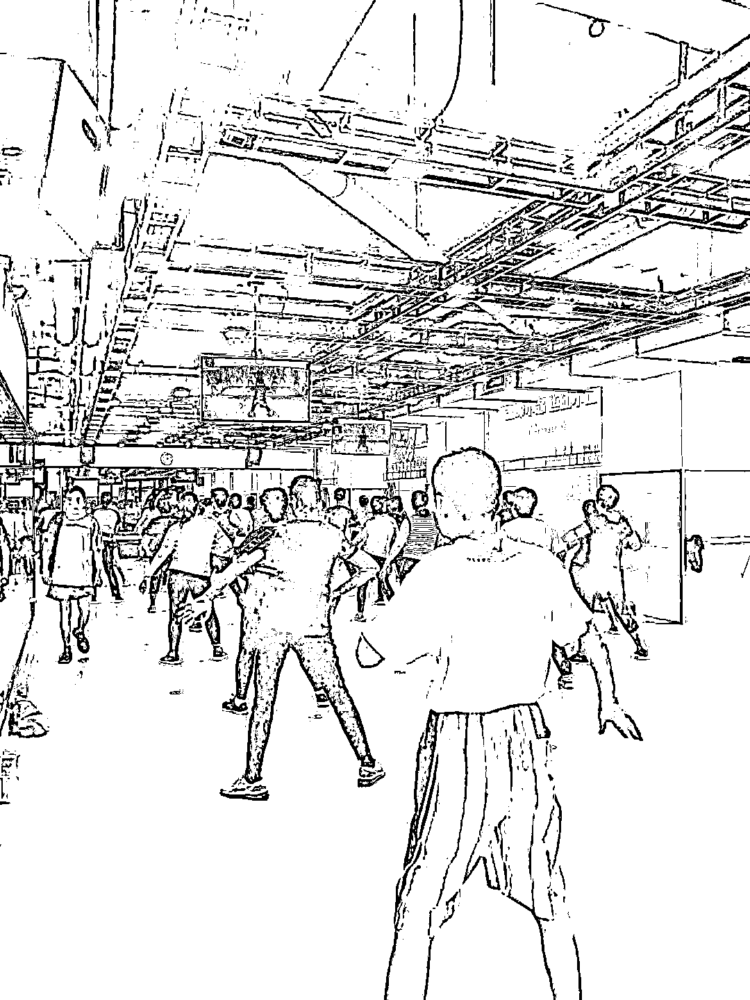
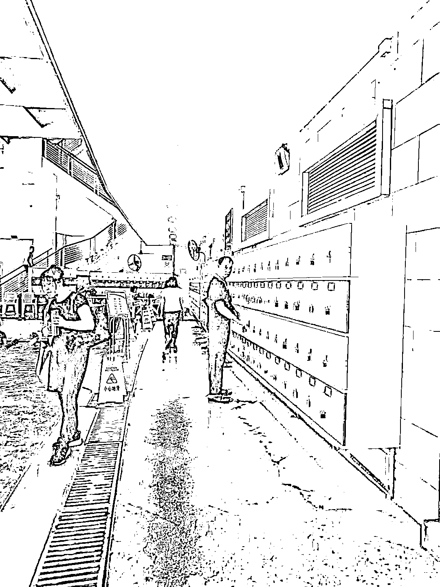
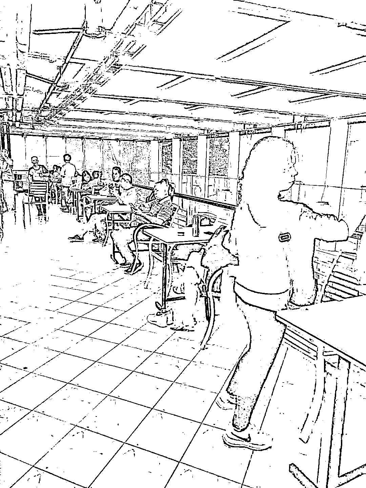
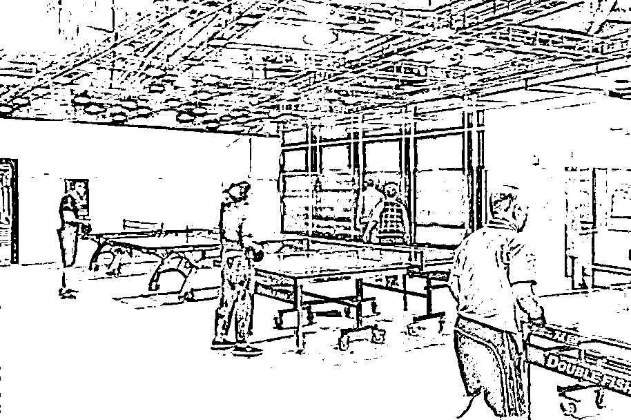
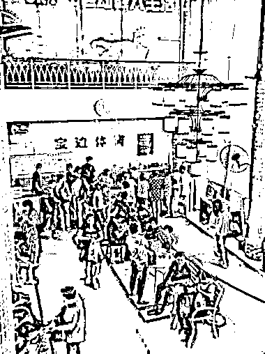

# (精华帖)(75 赞)靠「租柜+老人社交」屹立 20 年的健身房案例拆解

作者：  老黄牛

日期：2021-02-28

《靠“租柜+老人社交”屹立 20 年的健身房》  案例分享

 

 

今天拆解一间位于老城区健身房的商业模式，通过几个差异化战略让它屹立 20 年不倒，而且越办越好，占地越来越大。

本文主要分享：

1、从“场、人、货”三个维度看看本案健身房如何做差异化战略

场：场地设施的差异化

人：消费群体的差异化

货：产品的差异化

2、如何用“场、人、货”框架，发掘自己的差异化商业模式。

▶场（场地设施与同行的差异）

本健身房隐藏在广州一个老城区，占地三层

设施包括：

1、一般健身房该有的撸铁设备、跑步机

2、两个游泳池：室外、室内恒温

3、舞蹈室、形体室、瑜伽室

4、球类场所：篮球、乒乓球、桌球

“场”的差异化：

这个身处老城区的健身房的不同之处是，除了一般该有的撸铁、跑步机等设施设备，还有室内恒温泳池、各类球类的场所。不但没有因为占地大而倒闭，反而越做越好，人原来越多。原因请看下面“人与货”的分析。

▶人（消费群体与同行的差异）

1、因地制宜

因为本健身房是老城区住宅区，这就有别与坐落在商业区、受众为白领的健身房。

附近年纪偏大人群较多，所以 50 岁以上退休的女性和 60 岁以上退休男性较多。

2、老中青幼全面覆盖

这里受众从 6 岁~90 岁全面覆盖

①退休的中老年，会去跳健身操、撸铁锻炼、游泳、打乒乓、桌球。

②上班一族，下班后也会去锻炼身体

③上学的青少年，下课会去打篮球

④读小学的儿童，会参加儿童游泳训练班

 

 

3、全天候策略

①本健身房营业时间 7:30~22:00。无论从早上、下午、晚上，都人员鼎盛。

②周一~周五，上、下午上班时段，是退休的中老年人在锻炼，游泳、打乒乓等。

③到了晚上下班、放学，白领和学生就会去锻炼或打球。

★中老年社交需求

之所以中老会员那么多，社交需求的驱动尤为重要。

1、消磨时间

在这个健身房有个独特的现象，就是早上和中午，会看到一些退休的大叔大妈坐在休息区吃早餐，和身边的人笑谈风声。

然后相约踢毽、桌球、乒乓，这就消磨时间的方式取代了早茶、公园锻炼。

2、互相监督互相鼓励

大妈们都有微信群，会约定某个时间段跳操，然后对相互间的体重了如指掌，互相攀比、监督、取笑、鼓励。

3、组队旅游吃饭

每隔一段时间她们会约饭、约唱 K、约旅游。

这种高频次的社交圈，把他们绑定在这家健身房，要转会的成本很高。也正是这种社交需求取代了反人性的自律，才能让她们可以做到 1 周 5 天去锻炼。

▶货（出售产品与同行的差异）

常规的大部分健身房，是靠教练卖课，健身房拿提成这样的模式，这样的模式难以持续，面临倒闭不在小数。

反观本案例，整个健身馆只有一个教练看场子，而且还不主动卖课。它却提供一项特别的服务：租柜。

一、租柜

整个健身房租的柜子不完全统计大概是 1200 个。每个每月收 40 元，一年是差不多 60 万的纯利润。

 

 

为什么学员，愿意租柜子呢？

1、高频

退休的大妈大叔过来跳舞撸铁已经成为生活一部分，每周一到五都准时过来，基本不缺席（就和跳广场舞一样大妈一样，每次来都是充满热情、有讲有笑，而不是通过反人性的自律）

由于来的次数频繁，每次带物品来回就显得特别繁琐（柜子放冲凉用品，拖鞋，洗头水冲凉液、运动鞋等。）

2、占小便宜

很多住附近的大妈大叔们，过来锻炼后，在这里洗澡洗头回家就不用再冲凉了，省些水费。

二、月卡

很多健身房会员卡都是一年期，如果只买一个月是非常贵的。

但这里月卡 170 元（但每年交 100 会员费），年卡是 12 个月送 3 个月（大部分人买年卡）这种少有的便宜的月卡形式，也很好的把散客收揽。

最后，本案健身房的“场、人、货”是一个相辅相成三要素，项目也是逐步迭代的（因为我曾经也是会员之一，是看着它逐渐有了篮球场、桌球，也看着它们的柜子越来越多）▶如何用“场、人、货”框架，发掘出自己的差异化商业模式。

把“场、人、货”三个要素先单独分开，再按照 MECE 的原则（完全穷尽，互相独立）列出所有因素，然后逐个看看能否纳入自己的商业模式中。

一、场（场地设施）

以书店为例，书店除了卖书，也可以书为入口，提供很多场景

1、吃：很多书店提供咖啡消费区，只要消费就可供大家休息、看书

2、住：1200book&bed:书店+民宿的结合

3、行：打造网红打卡点：茑屋书店

4、衣：成都的诚然书店就有卖衣区，“不务正业”却火得一塌糊涂。

同理。。。尽可能多列出各种要素，找出属于自己的创新基因

 

 

二、人（消费者）

1、学生、在家待业者、职场人士、老板

2、儿童、少年、中年、老人

3、单身、恋爱、已婚、离婚

4、程序员、司机、医生、律师、产品经理。。。参考《国际标准职业分类表》  像生财根据消费人群不同，提供副业、私董会等产品。“得到”也开发“少年得到”。把能想到人群画像都列举出来，头脑风暴一下。

三、货（出售什么产品与服务）

1、线上：文章、音频、训练营、社群、直播

2、线下：见面会、座谈会、演讲分享、饭局、私董会

3、产品服务：日历、礼品、书、咨询

根据场和人的特性，打造自己的产品与服务（产品线）

最后总结：

本文通过拆解一家坐落在老城区的健身房，分析它如何以中老年为突破口，以独特“中老年社交需求”+“租柜服务”屹立 20 年不倒。

再从“货、人、场”三个角度从新思考自身商业模式，希望对大家有启发。

 

 

 

 

 

 

 

 

 

 

 

 

 

 

 

 

 

评论区：

小蚁 : 这个案例有意思[强]

郑小焦 : 哇塞，感谢分享~观察细致、解析精辟，用“经营”的角度看待身边的营业场所，的确有新的收获。

芷蓝 : 这个是从人群做行业差异化，厉害！

HEXIN : 感谢分享，找到同类项了，我现在也在用人货场这个方式进行分析：。补一个信息，我之前有研究过传统健身房这个赛道（泡健身房闲聊出来的经验），传统的健身房，本身盈利要看年卡会员费+私教课时费，所以一般健身房会分两个部门：一个是会籍部，主要负责开新卡，一个是私教部，负责一次性多交私教课的钱，然后再慢慢消耗课时。年卡会员费，是不靠中老年人赚钱的，这块主要要赚的，是开了卡，但是不来健身的人的钱。因为健身房的空间是有承载能力上限的，如果大家都每天来健身，承载能力加上器械的磨损，都是亏的。而私教，主要赚健身新手的钱。

https://articles.zsxq.com/id_155ttlvf66rg.html  老黄牛 : 那这个案例和“年卡会员+私教”这个模式完全不同。

萧遥 : 日本有个针对老太太的连锁健身房，好像差不多

老黄牛 : 想起孙正义的时光机理论。多看案例对创业帮助和启发还是很大的  老黄牛 : 嗯嗯，也和设施场地与有关会员模式有关。相互吸引
