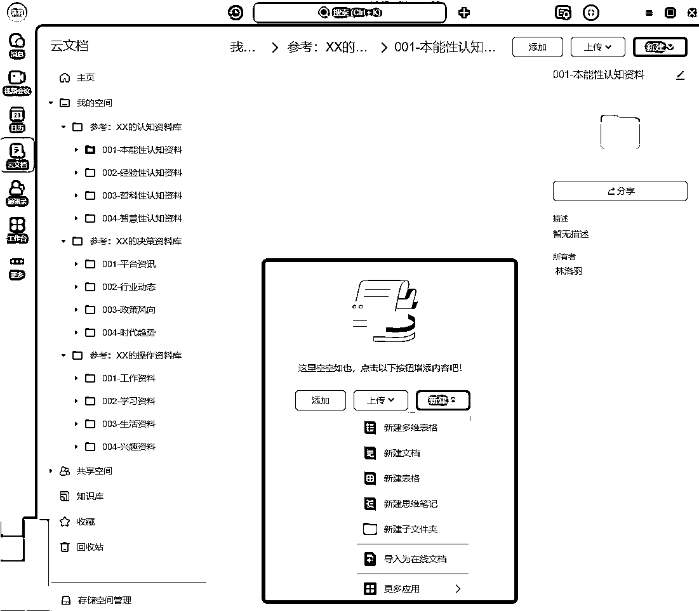
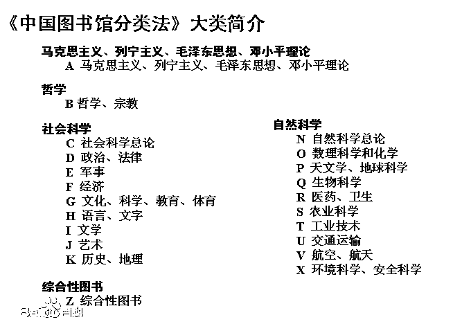
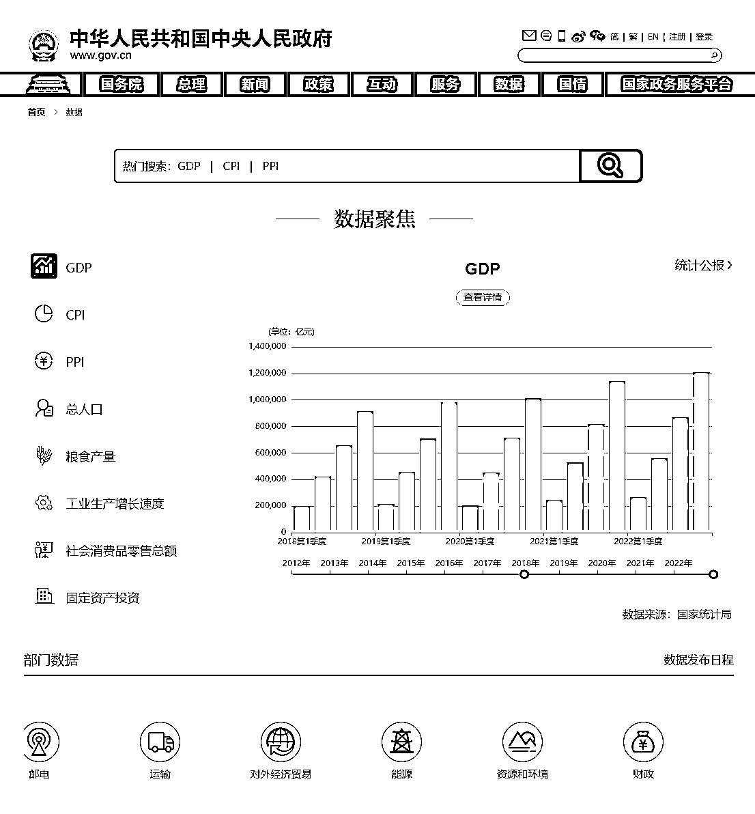
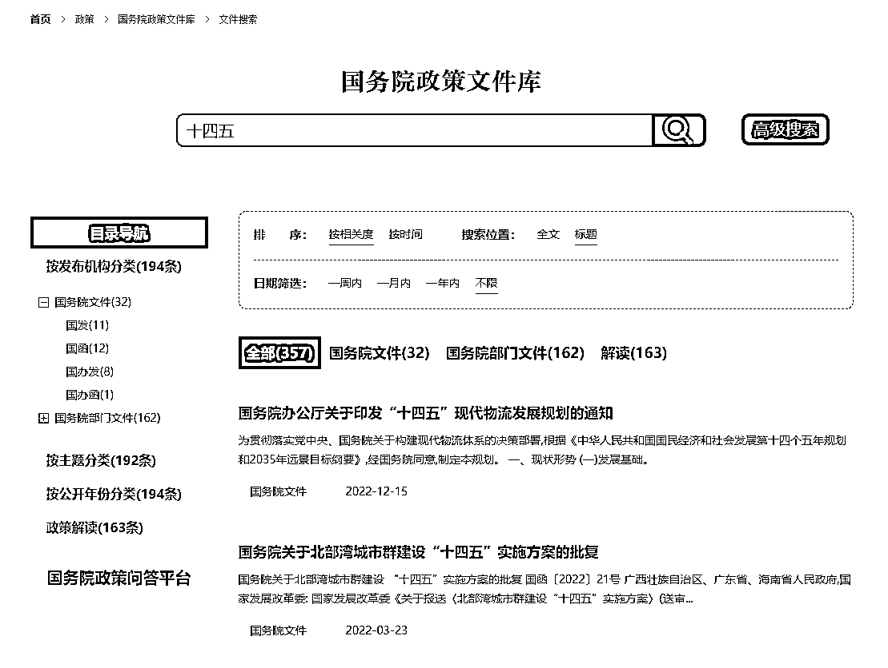
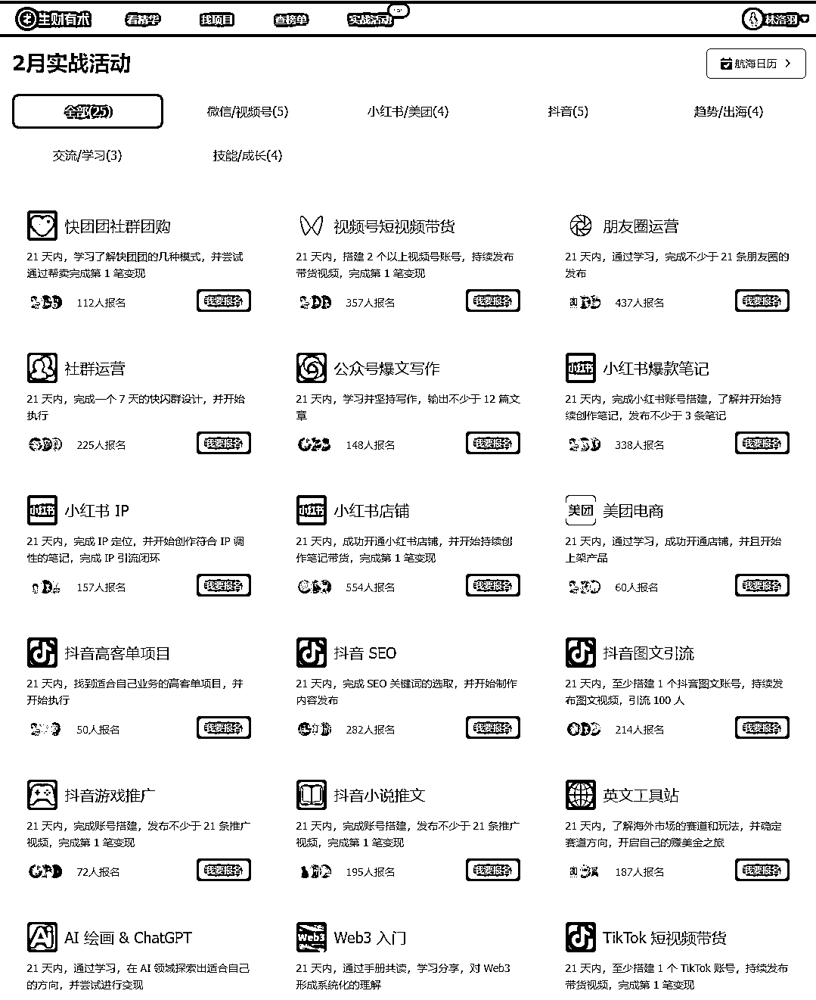
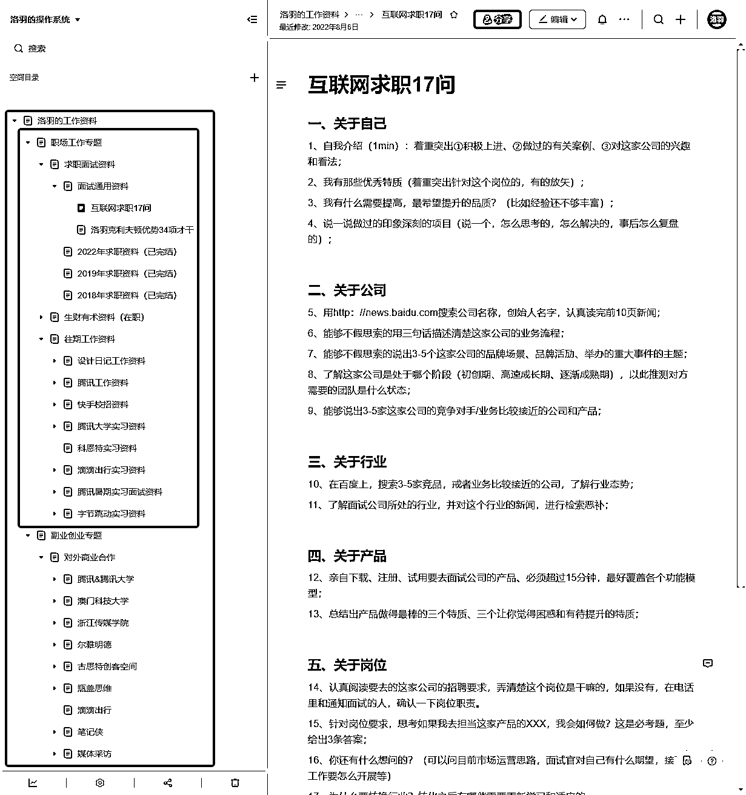
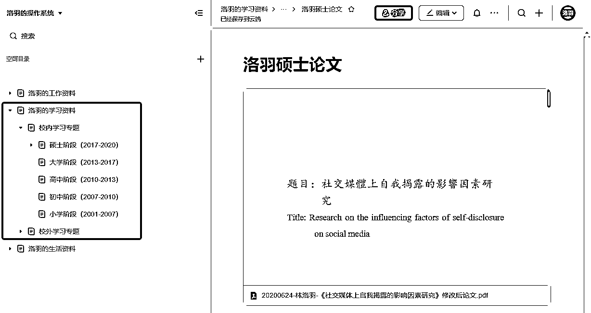
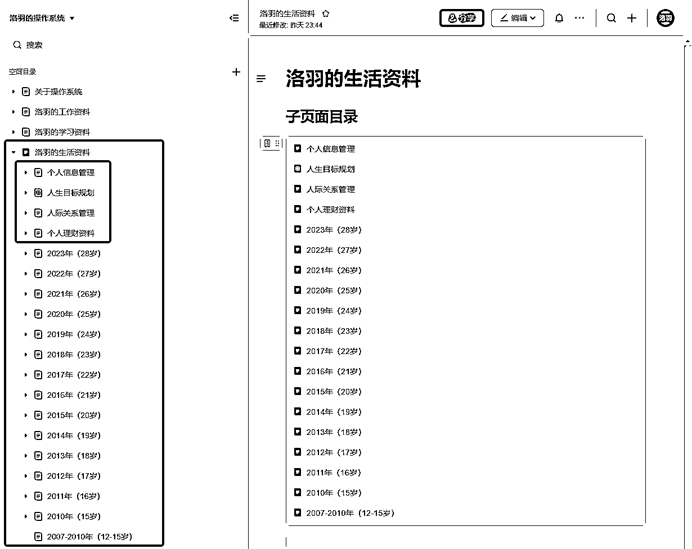
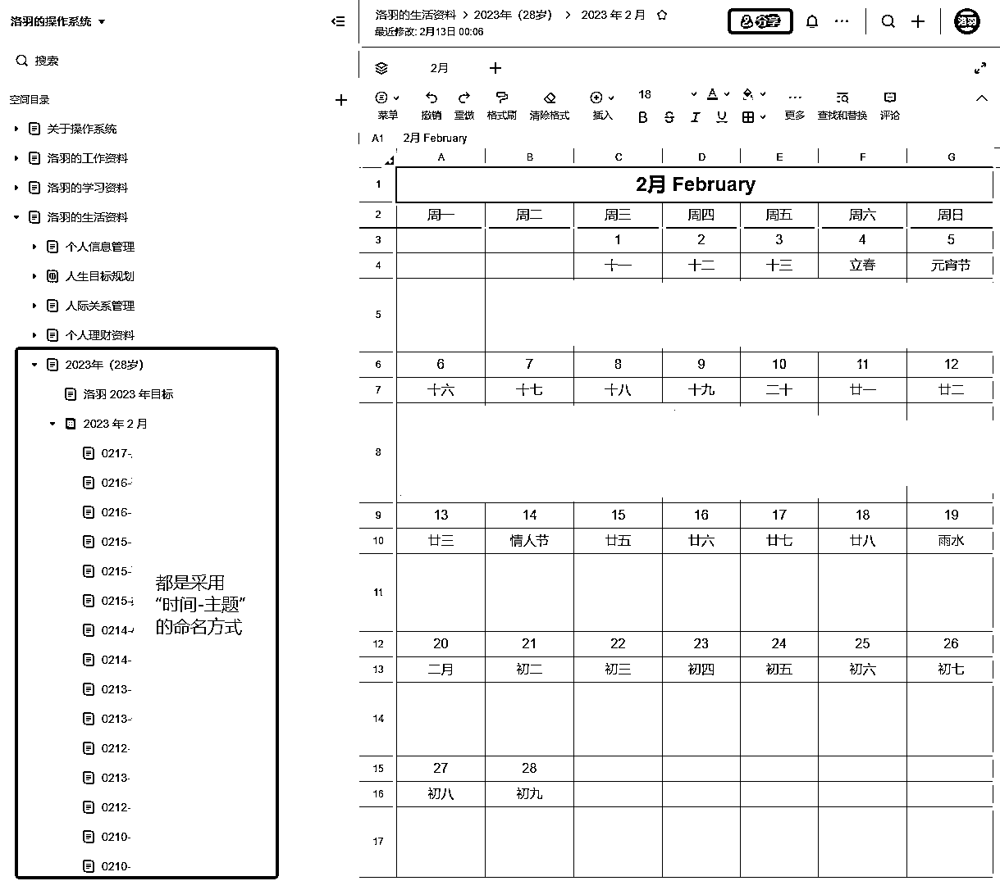
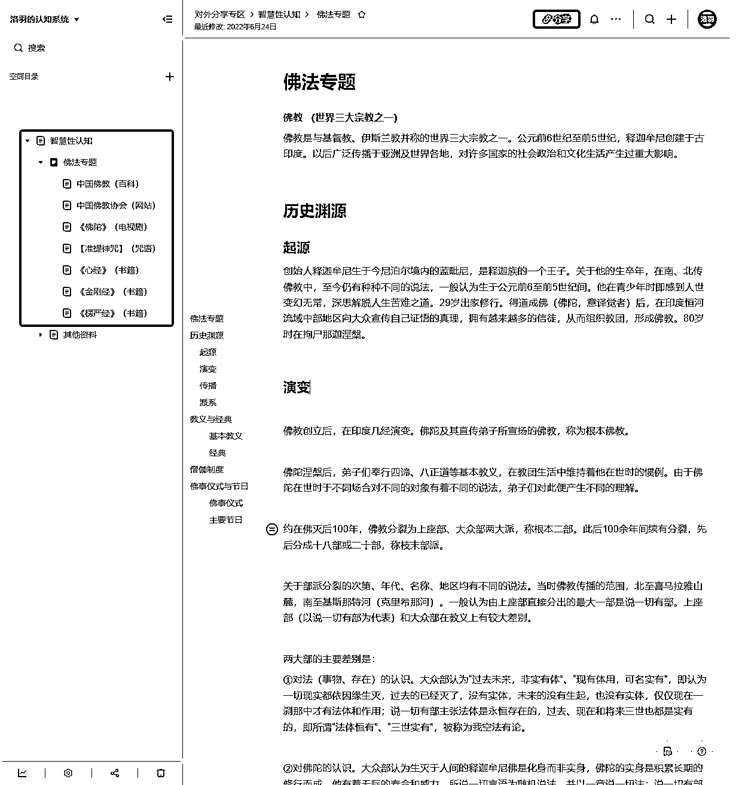

# 方法一：人生资料库分类|命名法 @洛羽

针对已有的资料归档，知识库里可以新建云文档、云表格、思维笔记、多维笔记等，操作起来非常方便：

云空间也可以新建云文档、云表格、思维笔记、多维笔记、子文件夹，也可以上传本地文件或文件夹：

可能有很多伙伴在归档的时候，对于不同资料应该归属于哪个库以及哪个目录不清楚，这里我给大家做一个类目说明：

1）认知资料库类目说明

上面我们已经说过，认知所对应的资料类别是：人类对于事物的理解和判断。基于不同类型认知所能解释事物的广度和深度，将人类思维分为四个层级：

•本能性认知

•经验性认知

•哲科性认知

•智慧性认知

① 哪些属于本能性认知？

从本质上来说，本能性的东西都不能算做认知，它就是人性和动物性本身。通常来说，本能性资料不会很多，也不会很完整。因为稍微完整一点的内容，基本就涉及到人类对于人性和动物性的观察研究，这就可能上升到经验和哲科部分了。

所以大家对于本能性认知模块不用太关注，可以把自己日常收录到的、和人性动物性相关的零碎信息，统一归档到这个地方。

② 哪些属于经验性认知？

我们日常看到的几乎所有文章和书籍，基本都算作是他人的经验沉淀。人类现有的资料，80% 以上也都属于经验性资料。

根据《中国图书馆分类法》，可以将所有经验性资料分为五大类共 22 个小类，这是针对经验性资料比较通用的划分方法，大家去到任何一家图书馆，都可以基于上述分类逻辑去寻找资料。

然而，对于大多数普通人来说，我们对于资料收集和学习的需求，可能并不是想要成为“行走的百科全书”，所以经验部分，多关注和自己工作、学习、生活和兴趣相关的领域即可。

③ 哪些属于哲科性认知？

哲科性认知，算是人类前 20% 的知识类别了。所谓科学，是一个建立在可检验的解释和对客观事物的形式、组织等进行预测的有序的知识体系，是已经系统化和公式化了的知识。具备相关认知和能力的人，几乎可以算作是各行各业的“高人”。这类资料的收集和整理，比较适用于学术型和科研型人员，如本硕博学生、各专业老师教授、各领域科学家等。

对于哲科领域的资料分类，目前世界上没有完全统一的说法，有的说是社会科学和自然科学，有的还加上了抽象概念的形式科学（如逻辑、数学、计算机科学等），现在甚至还有复杂性科学（如人工智能、机器识别等）。

大家如果对哲科领域的资料管理感兴趣，可以研究一下中国的学科门类分类知识。2011 年 3 月，国务院学位委员会和教育部颁布修订的《学位授予和人才培养学科目录（2011 年）》，规定我国分为哲学、经济学、法学、教育学、文学、历史学、理学、工学、农学、医学、军事学、管理学、艺术学、交叉学科 14 个学科门类 。

不同于《学位授予和人才培养学科目录》 14 个学位学科门类，另一种版本是《中华人民共和国国家标准学科分类与代码》 5 个学术门类（ A 自然科学，代码为 110～190 ；B 农业科学，代码为 210～240 ；C 医药科学，代码为 310～360 ；D 工程与技术科学，代码为 410～630 ；E 人文与社会科学，代码为 710～910 ）。

二者分类目的、依据有很大区别；前者用于高校学位授予与人才培养，后者用于国家宏观管理和科技统计。

④ 哪些属于智慧性认知？

智慧性认知，属于哲科性认知都无法触及的宇宙顶尖智慧。

本能性认知是人和动物的本性，经验是人类实践后的方法论沉淀，哲科是已经被系统化和公式化了的知识。那那些不属于人和动物、人类没有实践过、无法被系统化和公式化，甚至无法用语言和文字描述出来的东西呢？到哪里去了呢？

针对这个问题，哲学上有“可知论”和“不可知论”的派别划分，感兴趣的朋友可以自行研究，我们这里不做过多展开。我给大家把智慧性认知类别展示出来，目的不是让大家去深入研究这个领域，这是一个高维世界，我们知道即可，无需太过于关注。

对我自己的认知研究而言，我会把一些偏宗教、灵修、临在觉察相关的资料存放在这个地方，作为闲暇时候的读物。

好了，以上就是认知类资料的类别说明。相信大部分人看完之后，会发现自己可能只有“经验性认知”里面的少部分资料，而且还是不成体系的碎片信息，完全构不成知识系统。

说实话，这挺正常的，毕竟从古至今，也没有出现过多少“全才”。另外，这还只是认知类资料的类别，下面还有决策类资料和操作类资料，我们也接着来看看！

2）决策资料库类目说明

上面我们也说了，决策类资料，是除思维认知外，还能影响我们做决策的各种因素，主要有时代趋势、国家大势（政策风向）、行业动态、平台讯息等。

这些东西瞬息万变，但对我们的发展至关重要。很多时候一个人的成功，不是看他有多聪明能干，而是看他抓住了多少次顺势而为的机会。

时代趋势资料，包括了各种对于时代发展、科技发展、大国竞争的预测和解读等；国家大势（政策风向）资料，包括了各种国家级的会议资料、各类国民级数据、各项法律法规、最新出台的政策等。

行业动态资料，包括了各行各业的白皮书、数据资料、分析报告等；平台讯息资料，包括了各个平台（如抖音、小红书、B 站、微信等）的最新动态、最新数据、最新功能、最新玩法等。

除了上述这些权威数据和报告，还有一些资料来自于比较专业的解读。比如 B 站的科技博主 @所长林超，他就经常关注和分享决策类资讯，内容都还比较干。

以上就是决策类资料的类别说明。更细分的维度，如某一家公司、某一个项目的资料，得根据实际情况整合。

3）操作资料库类目说明

上面我们了解了比较体系化的认知类资料，和瞬息万变的决策类资料，还有一个类别是和自己相关的，是我们对于上述认知和决策应用之后沉淀下的个人资料库。

我把这个资料库分为了四大类：工作、学习、生活、兴趣。

所谓工作资料，包括了每一份实习、全职、主业、副业等沉淀下的个人信息、脱敏资料、职场经验和重要方法论等。

以我自己为例，我有主业工作，有过副业工作，也有过创业经验，所有资料全部按顺序进行了归档，方便及时提取：

所谓学习资料，包括了每一段学业、每门课程、每次作业、每次校园活动等沉淀下的资料。

这个我自己是比较遗憾的，虽然从初中就开始做人生记录，但是直到读研了才开始做系统性资料管理，很多资料都遗失在了各处。要是从小就有这样的资料管理能力，或者父母有这样的资料管理意识，也许的人生资料库会更完整。

所谓生活资料，包括了个人常用信息、人生目标规划、人际资源管理、个人理财管理、年度资料汇总。

关于这个板块的归档操作，我分了长期资料和短期资料。长期资料有常用信息、目标管理、人际管理等；短期资料主要是按年月日来记录和复盘：

所谓兴趣资料，根据自己的实际情况整理即可。由于我个人把兴趣融入和工作、学习和生活，所以就没有单独再开一个模块。

以上，就是关于认知资料库、决策资料库和操作资料库的细分类别说明，相信大家看完上述内容，应该比较清楚，不同的资料，应该存放在哪个库的哪个模块了吧。

知道存放在哪里，这还不够，为了便于快速识别资料，我们还得学会给这些资料进行统一命名。

我的资料命名方式，主要是根据时间和主题的优先级，决定采用“时间-主题”还是“主题（时间）/（形式）”：

•“时间-主题”的命名方式，代表这份资料的关注重点是时间，也就是有一定的时间限制；•“主题（时间）/（形式）”的命名方式，代表这份资料的关注重点是主题，也就是资料可能是长期性的。如果有版本更迭，就加上时间；如果只有这一个版本，也可以不加时间。如果有类型区分，就加上类型等。

比如：这是我的“生活资料”，重点是成长轨迹（时间），所以命名为：

再比如，这是我的“智慧性认知”部分资料，重点是主题，不是时间，所以命名为：

备注：由于我已经归档的资料非常非常多，所以把认知资料库、决策资料库和操作资料库拆成了三大库。

